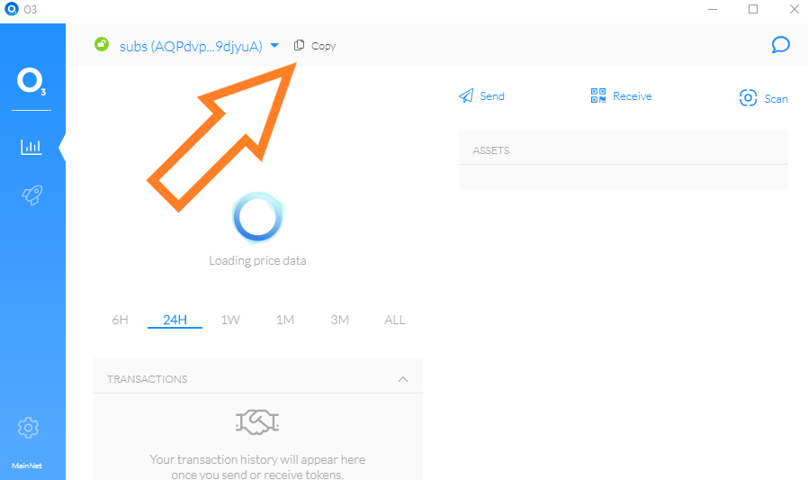

# Guide: How to stake ONT

## :checkered_flag:1. Prerequisites

In order to stake, ONT must be stored on a local wallet, where you control the seed/private keys. 


Remember, it's best practice to always withdraw coins from an Exchange.


## :last_quarter_moon_with_face: 2. Download and use a compatible wallet


[o3-neo-ont.md](../../wallets/desktop-wallets/o3-neo-ont.md)



[exodus-multi-chain-assets.md](../../wallets/mobile-wallets/exodus-multi-chain-assets.md)


## :fire: 3. Stake your ONT


Staking ONT means generating ONG. It's easy to stake because holding ONT in your own wallet is the only requirement.


1. Open ONT wallet
2. Copy your ONT address
3. Send or withdraw ONT from exchange or other wallet to your ONT address


**Did you know?** ONT and NEO addresses are interchangeable.



:sparkles: Now you're staking ONT and earning ONG, every block or 1 second.

