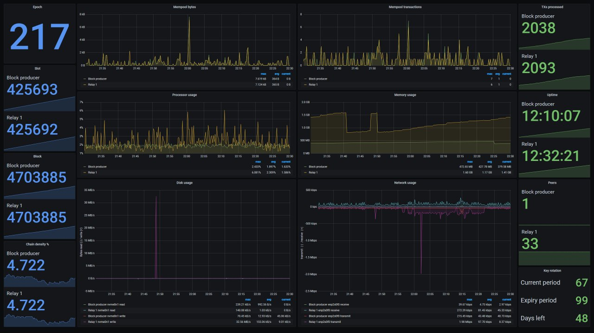

# Guide: How to build a Cardano Stake Pool

## 🎉 ∞ Pre-Announcements


If you want to support this free educational Cardano content or found this helpful, visit [cointr.ee to find our donation ](https://cointr.ee/coincashew)addresses. Much appreciated in advance. 🙏 



As of October 1 2021, this is **guide version 4.1.0** and written for **cardano mainnet** with **release v.1.30.1** 😁 


### 📄 Changelog - **Update Notes -** **October 1 2021**

* Added a [collection of projects](./#17-6-community-inspired-projects) built by this amazing community.
* Added cardano-node RTS flags to reduce chance of missed slot leader checks.
* Added Leaderlog changes and improvements
* Increased minimum RAM requirements to 12GB.
* Updated for Alonzo release 1.29.0.
* Various fixes to testnet  / alonzo / storage requirements / cli commands
* Updated CNCLI's Leaderlog command with the [stake-snapshot approach](./#18-12-slot-leader-schedule-find-out-when-your-pool-will-mint-blocks)
* Added [CNCLI tool](./#18-12-slot-leader-schedule-find-out-when-your-pool-will-mint-blocks) for sending slot to Pooltool and for LeaderLog scripts
* Updated guide for release cardano-node/cli v1.27.0 changes
* Added [Stake Pool Operator's Best Practices Checklist](./#18-15-stake-pool-operators-best-practices-checklist)
* Contribution By [Billionaire Pool](www.billionairepool.com) - [Guide to monitor your node security with OSSEC and Slack.](how-to-monitor-security-with-ossec.md)
* Added how to [Secure your pool pledge with a 2nd pool owner using a hardware wallet](./#18-14-secure-your-pool-pledge-with-a-2nd-pool-owner-using-a-hardware-wallet)

## 🏁 0. Prerequisites

### 🧙♂ Mandatory skills for stake pool operators

As a stake pool operator for Cardano, you will be competent with the following abilities:

* operational knowledge of how to set up, run and maintain a Cardano node continuously
* a commitment to maintain your node 24/7/365
* system operation skills
* server administration skills \(operational and maintenance\).

### 🧙 Mandatory experience for stake pool operators

* experience of development and operations \(DevOps\)
* experience on how to [harden ](https://www.lifewire.com/harden-ubuntu-server-security-4178243)and [secure a server](https://gist.github.com/lokhman/cc716d2e2d373dd696b2d9264c0287a3).
* [passed the official Stake Pool School course.](https://cardano-foundation.gitbook.io/stake-pool-course/)


🛑 **Before continuing this guide, you must satisfy the above requirements.** 🚧 


### 🎗 Minimum Stake Pool Hardware Requirements

* **Two separate servers:** 1 for block producer node, 1 for relay node
* **One air-gapped offline machine \(cold environment\)**
* **Operating system:** 64-bit Linux \(i.e. Ubuntu Server 20.04 LTS\)
* **Processor:** An Intel or AMD x86 processor with two or more cores, at 2GHz or faster
* **Memory:** 12GB of RAM
* **Storage:** 50GB of free storage
* **Internet:** Broadband internet connection with speeds at least 10 Mbps.
* **Data Plan**: at least 1GB per hour. 720GB per month.
* **Power:** Reliable electrical power
* **ADA balance:** at least 505 ADA for pool deposit and transaction fees

### 🏋♂ Recommended Future-proof Stake Pool Hardware Setup

* **Three separate servers:** 1 for block producer node, 2 for relay nodes
* **One air-gapped offline machine \(cold environment\)**
* **Operating system:** 64-bit Linux \(i.e. Ubuntu 20.04 LTS\)
* **Processor:** 4 core or higher CPU
* **Memory:** 16GB+ of RAM
* **Storage:** 256GB+ SSD
* **Internet:** Broadband internet connections with speeds at least 100 Mbps
* **Data Plan**: Unlimited
* **Power:** Reliable electrical power with UPS
* **ADA balance:** more pledge is better, to be determined by **a0**, the pledge influence factor

### 🔓 Recommended Stake Pool Security

If you need ideas on how to harden your stake pool's nodes, refer to



### 🛠 Setup Ubuntu

If you need to install **Ubuntu Server**, refer to



For instructions on installing **Ubuntu Desktop**, refer to the following:



### 🧱 Rebuilding Nodes

If you are rebuilding or reusing an existing `cardano-node` installation, refer to [section 18.2 on how to reset the installation.](./#18-2-resetting-the-installation)

## 🏭 1. Install Cabal and GHC

If using Ubuntu Desktop, **press** Ctrl+Alt+T. This will launch a terminal window. 

First, update packages and install Ubuntu dependencies.

```bash
sudo apt-get update -y
```

```text
sudo apt-get upgrade -y
```

```text
sudo apt-get install git jq bc make automake rsync htop curl build-essential pkg-config libffi-dev libgmp-dev libssl-dev libtinfo-dev libsystemd-dev zlib1g-dev make g++ wget libncursesw5 libtool autoconf -y
```

Install Libsodium.

```bash
mkdir $HOME/git
cd $HOME/git
git clone https://github.com/input-output-hk/libsodium
cd libsodium
git checkout 66f017f1
./autogen.sh
./configure
make
sudo make install
```


**Debian OS pool operators**: extra lib linking may be required.

```bash
sudo ln -s /usr/local/lib/libsodium.so.23.3.0 /usr/lib/libsodium.so.23
```

**AWS Linux CentOS pool operators:** clearing the lib cache may be required.

```bash
sudo ldconfig
```

**Raspberry Pi 4 with Ubuntu pool operators** : extra lib linking may be required.

```bash
sudo apt-get install libnuma-dev
```

This will help to solve "cannot find -lnuma" error when compiling.


Install Cabal and dependencies.

```bash
sudo apt-get -y install pkg-config libgmp-dev libssl-dev libtinfo-dev libsystemd-dev zlib1g-dev build-essential curl libgmp-dev libffi-dev libncurses-dev libtinfo5
```

```bash
curl --proto '=https' --tlsv1.2 -sSf https://get-ghcup.haskell.org | sh
```

Answer **NO** to installing haskell-language-server \(HLS\).

Answer **YES** to automatically add the required PATH variable to ".bashrc".

```bash
cd $HOME
source .bashrc
ghcup upgrade
ghcup install cabal 3.4.0.0
ghcup set cabal 3.4.0.0
```

Install GHC.

```bash
ghcup install ghc 8.10.4
ghcup set ghc 8.10.4
```

Update PATH to include Cabal and GHC and add exports. Your node's location will be in **$NODE\_HOME**. The [cluster configuration](https://hydra.iohk.io/job/Cardano/iohk-nix/cardano-deployment/latest-finished/download/1/index.html) is set by **$NODE\_CONFIG** and **$NODE\_BUILD\_NUM**. 

```bash
echo PATH="$HOME/.local/bin:$PATH" >> $HOME/.bashrc
echo export LD_LIBRARY_PATH="/usr/local/lib:$LD_LIBRARY_PATH" >> $HOME/.bashrc
echo export NODE_HOME=$HOME/cardano-my-node >> $HOME/.bashrc
echo export NODE_CONFIG=mainnet>> $HOME/.bashrc
echo export NODE_BUILD_NUM=$(curl https://hydra.iohk.io/job/Cardano/iohk-nix/cardano-deployment/latest-finished/download/1/index.html | grep -e "build" | sed 's/.*build\/\([0-9]*\)\/download.*/\1/g') >> $HOME/.bashrc
source $HOME/.bashrc
```


💡 **How to use this Guide on TestNet**

Run the following commands to set your **NODE\_CONFIG** to testnet rather than mainnet.

```bash
echo export NODE_CONFIG=testnet>> $HOME/.bashrc
source $HOME/.bashrc
```

As you work through this guide, replace every instance of ****CLI parameter

```bash
 --mainnet 
```

with 

```bash
--testnet-magic 1097911063
```


Update cabal and verify the correct versions were installed successfully.

```bash
cabal update
cabal --version
ghc --version
```


Cabal library should be version 3.4.0.0 and GHC should be version 8.10.4


## 🏗 2. Build the node from source code

Download source code and switch to the latest tag.

```bash
cd $HOME/git
git clone https://github.com/input-output-hk/cardano-node.git
cd cardano-node
git fetch --all --recurse-submodules --tags
git checkout $(curl -s https://api.github.com/repos/input-output-hk/cardano-node/releases/latest | jq -r .tag_name)
```

Configure build options.

```text
cabal configure -O0 -w ghc-8.10.4
```

Update the cabal config, project settings, and reset build folder.

```bash
echo -e "package cardano-crypto-praos\n flags: -external-libsodium-vrf" > cabal.project.local
sed -i $HOME/.cabal/config -e "s/overwrite-policy:/overwrite-policy: always/g"
rm -rf $HOME/git/cardano-node/dist-newstyle/build/x86_64-linux/ghc-8.10.4
```

Build the cardano-node from source code.

```text
cabal build cardano-cli cardano-node
```


Building process may take a few minutes up to a few hours depending on your computer's processing power.


Copy **cardano-cli** and **cardano-node** files into bin directory.

```bash
sudo cp $(find $HOME/git/cardano-node/dist-newstyle/build -type f -name "cardano-cli") /usr/local/bin/cardano-cli
```

```bash
sudo cp $(find $HOME/git/cardano-node/dist-newstyle/build -type f -name "cardano-node") /usr/local/bin/cardano-node
```

Verify your **cardano-cli** and **cardano-node** are the expected versions.

```text
cardano-node version
cardano-cli version
```

## 📐 3. Configure the nodes

Here you'll grab the config.json, genesis.json, and topology.json files needed to configure your node.

```bash
mkdir $NODE_HOME
cd $NODE_HOME
wget -N https://hydra.iohk.io/build/${NODE_BUILD_NUM}/download/1/${NODE_CONFIG}-byron-genesis.json
wget -N https://hydra.iohk.io/build/${NODE_BUILD_NUM}/download/1/${NODE_CONFIG}-topology.json
wget -N https://hydra.iohk.io/build/${NODE_BUILD_NUM}/download/1/${NODE_CONFIG}-shelley-genesis.json
wget -N https://hydra.iohk.io/build/${NODE_BUILD_NUM}/download/1/${NODE_CONFIG}-alonzo-genesis.json
wget -N https://hydra.iohk.io/build/${NODE_BUILD_NUM}/download/1/${NODE_CONFIG}-config.json
```

Run the following to modify **mainnet-config.json** and 

* update TraceBlockFetchDecisions to "true"

```bash
sed -i ${NODE_CONFIG}-config.json \
    -e "s/TraceBlockFetchDecisions\": false/TraceBlockFetchDecisions\": true/g"
```


\*\*\*\*✨ **Tip for relay and block producer nodes**: It's possible to reduce the number of missed slot leader checks, memory and cpu usage by setting "TraceMempool" to "false" in **mainnet-config.json**


Update **.bashrc** shell variables.

```bash
echo export CARDANO_NODE_SOCKET_PATH="$NODE_HOME/db/socket" >> $HOME/.bashrc
source $HOME/.bashrc
```

## 🔮 4. Configure the block-producer node


A block producer node will be configured with various key-pairs needed for block generation \(cold keys, KES hot keys and VRF hot keys\). It can only connect to its relay nodes.



A relay node will not be in possession of any keys and will therefore be unable to produce blocks. It will be connected to its block-producing node, other relays and external nodes.




For the purposes of this guide, we will be building **two nodes** on two **separate servers**. One node will be designated the **block producer node**, and the other will be the relay node, named **relaynode1**.



Configure **topology.json** file so that 

* relay node\(s\) connect to public relay nodes \(like IOHK and buddy relay nodes\) and your block-producer node
* block-producer node **only** connects to your relay node\(s\)


On your **block-producer node,** run the following. Update the **addr** with your relay node's public IP address.



```bash
cat > $NODE_HOME/${NODE_CONFIG}-topology.json << EOF 
 {
    "Producers": [
      {
        "addr": "<RELAYNODE1'S PUBLIC IP ADDRESS>",
        "port": 6000,
        "valency": 1
      }
    ]
  }
EOF
```



## 🛸 5. Configure the relay node\(s\)


🚧 On your other server that will be designed as your relay node or what we will call **relaynode1** throughout this guide, carefully **repeat steps 1 through 3** in order to build the cardano binaries.



You can have multiple relay nodes as you scale up your stake pool architecture. Simply create **relaynodeN** and adapt the guide instructions accordingly.


On your **relaynode1,** run ****with the following after updating with your block producer's public IP address.



```bash
cat > $NODE_HOME/${NODE_CONFIG}-topology.json << EOF 
 {
    "Producers": [
      {
        "addr": "<BLOCK PRODUCER NODE'S PUBLIC IP ADDRESS>",
        "port": 6000,
        "valency": 1
      },
      {
        "addr": "relays-new.cardano-mainnet.iohk.io",
        "port": 3001,
        "valency": 2
      }
    ]
  }
EOF
```




Valency tells the node how many connections to keep open. Only DNS addresses are affected. If value is 0, the address is ignored.



\*\*\*\*✨ **Port Forwarding Tip:** You'll need to forward and open ports 6000 to your nodes. Check with [https://www.yougetsignal.com/tools/open-ports/](https://www.yougetsignal.com/tools/open-ports/) or [https://canyouseeme.org/](https://canyouseeme.org/) .


## 🔏 6. Configure the air-gapped offline machine


An air-gapped offline machine is called your cold environment. 

* Protects against key-logging attacks, malware/virus based attacks and other firewall or security exploits. 
* Physically isolated from the rest of your network. 
* Must not have a network connection, wired or wireless. 
* Is not a VM on a machine with a network connection.
* Learn more about [air-gapping at wikipedia](https://en.wikipedia.org/wiki/Air_gap_%28networking%29).



A note about **hardware requirements** for an air-gapped offline machine.

* Can be as basic as a Raspberry Pi or an upcycled older laptop/desktop.
* Uses an usb port to transport files back and forth.




```bash
echo export NODE_HOME=$HOME/cardano-my-node >> $HOME/.bashrc
source $HOME/.bashrc
mkdir -p $NODE_HOME
```



Copy from your **hot environment**, also known as your block producer node, a copy of the **`cardano-cli`** binaries to your **cold environment**, this air-gapped offline machine. 


In order to remain a true air-gapped environment, you must move files physically between your cold and hot environments with USB keys or other removable media.


## 🤖 7. Create startup scripts

The startup script contains all the variables needed to run a cardano-node such as directory, port, db path, config file, and topology file.



```bash
cat > $NODE_HOME/startBlockProducingNode.sh << EOF 
#!/bin/bash
DIRECTORY=$NODE_HOME
PORT=6000
HOSTADDR=0.0.0.0
TOPOLOGY=\${DIRECTORY}/${NODE_CONFIG}-topology.json
DB_PATH=\${DIRECTORY}/db
SOCKET_PATH=\${DIRECTORY}/db/socket
CONFIG=\${DIRECTORY}/${NODE_CONFIG}-config.json
/usr/local/bin/cardano-node run +RTS -N -A16m -qg -qb -RTS --topology \${TOPOLOGY} --database-path \${DB_PATH} --socket-path \${SOCKET_PATH} --host-addr \${HOSTADDR} --port \${PORT} --config \${CONFIG}
EOF
```



```bash
cat > $NODE_HOME/startRelayNode1.sh << EOF 
#!/bin/bash
DIRECTORY=$NODE_HOME
PORT=6000
HOSTADDR=0.0.0.0
TOPOLOGY=\${DIRECTORY}/${NODE_CONFIG}-topology.json
DB_PATH=\${DIRECTORY}/db
SOCKET_PATH=\${DIRECTORY}/db/socket
CONFIG=\${DIRECTORY}/${NODE_CONFIG}-config.json
/usr/local/bin/cardano-node run +RTS -N -A16m -qg -qb -RTS --topology \${TOPOLOGY} --database-path \${DB_PATH} --socket-path \${SOCKET_PATH} --host-addr \${HOSTADDR} --port \${PORT} --config \${CONFIG}
EOF
```



Add execute permissions to the startup script.



```bash
chmod +x $NODE_HOME/startBlockProducingNode.sh
```



```bash
chmod +x $NODE_HOME/startRelayNode1.sh 
```



Run the following to create a **systemd unit file** to define your`cardano-node.service` configuration.


#### 🍰 Benefits of using systemd for your stake pool

1. Auto-start your stake pool when the computer reboots due to maintenance, power outage, etc.
2. Automatically restart crashed stake pool processes.
3. Maximize your stake pool up-time and performance.




```bash
cat > $NODE_HOME/cardano-node.service << EOF 
# The Cardano node service (part of systemd)
# file: /etc/systemd/system/cardano-node.service 

[Unit]
Description     = Cardano node service
Wants           = network-online.target
After           = network-online.target 

[Service]
User            = ${USER}
Type            = simple
WorkingDirectory= ${NODE_HOME}
ExecStart       = /bin/bash -c '${NODE_HOME}/startBlockProducingNode.sh'
KillSignal=SIGINT
RestartKillSignal=SIGINT
TimeoutStopSec=2
LimitNOFILE=32768
Restart=always
RestartSec=5
SyslogIdentifier=cardano-node

[Install]
WantedBy	= multi-user.target
EOF
```



```bash
cat > $NODE_HOME/cardano-node.service << EOF 
# The Cardano node service (part of systemd)
# file: /etc/systemd/system/cardano-node.service 

[Unit]
Description     = Cardano node service
Wants           = network-online.target
After           = network-online.target 

[Service]
User            = ${USER}
Type            = simple
WorkingDirectory= ${NODE_HOME}
ExecStart       = /bin/bash -c '${NODE_HOME}/startRelayNode1.sh'
KillSignal=SIGINT
RestartKillSignal=SIGINT
TimeoutStopSec=2
LimitNOFILE=32768
Restart=always
RestartSec=5
SyslogIdentifier=cardano-node

[Install]
WantedBy	= multi-user.target
EOF
```



Move the unit file to `/etc/systemd/system` and give it permissions.

```bash
sudo mv $NODE_HOME/cardano-node.service /etc/systemd/system/cardano-node.service
```

```bash
sudo chmod 644 /etc/systemd/system/cardano-node.service
```

Run the following to enable auto-starting of your stake pool at boot time.

```text
sudo systemctl daemon-reload
sudo systemctl enable cardano-node
```


Your stake pool is now managed by the reliability and robustness of systemd. Below are some commands for using systemd.


#### 🔎 View the status of the node service

```text
sudo systemctl status cardano-node
```

#### 🔄 Restarting the node service

```text
sudo systemctl reload-or-restart cardano-node
```

#### 🛑 Stopping the node service

```text
sudo systemctl stop cardano-node
```

#### 🗄 Viewing and filter logs

```bash
journalctl --unit=cardano-node --follow
```

```bash
journalctl --unit=cardano-node --since=yesterday
```

```text
journalctl --unit=cardano-node --since=today
```

```text
journalctl --unit=cardano-node --since='2020-07-29 00:00:00' --until='2020-07-29 12:00:00'
```

## ✅ 8. Start the nodes

Start your stake pool with systemctl and begin syncing the blockchain!



```bash
sudo systemctl start cardano-node
```



```bash
sudo systemctl start cardano-node
```



Install gLiveView, a monitoring tool.


gLiveView displays crucial node status information and works well with systemd services. Credits to the [Guild Operators](https://cardano-community.github.io/guild-operators/#/Scripts/gliveview) for creating this tool.


```bash
cd $NODE_HOME
sudo apt install bc tcptraceroute -y
curl -s -o gLiveView.sh https://raw.githubusercontent.com/cardano-community/guild-operators/master/scripts/cnode-helper-scripts/gLiveView.sh
curl -s -o env https://raw.githubusercontent.com/cardano-community/guild-operators/master/scripts/cnode-helper-scripts/env
chmod 755 gLiveView.sh
```

Run the following to modify **env** with the updated file locations.

```bash
sed -i env \
    -e "s/\#CONFIG=\"\${CNODE_HOME}\/files\/config.json\"/CONFIG=\"\${NODE_HOME}\/mainnet-config.json\"/g" \
    -e "s/\#SOCKET=\"\${CNODE_HOME}\/sockets\/node0.socket\"/SOCKET=\"\${NODE_HOME}\/db\/socket\"/g"
```


A node must reach epoch 208 \(Shelley launch\) before **gLiveView.sh** can start tracking the node syncing. You can track the node syncing using `journalctl` before epoch 208.

```text
journalctl --unit=cardano-node --follow
```


Run gLiveView to monitor the progress of the sync'ing of the blockchain.

```text
./gLiveView.sh
```

Sample output of gLiveView.


For more information, refer to the [official Guild Live View docs.](https://cardano-community.github.io/guild-operators/#/Scripts/gliveview)


\*\*\*\*✨ **Pro tip**: If you synchronize a node's database, you can copy the database directory over to your other node directly and save time.



Congratulations! Your node is running successfully now. Let it sync up.


## ⚙ 9. Generate block-producer keys

The block-producer node requires you to create 3 keys as defined in the [Shelley ledger specs](https://hydra.iohk.io/build/2473732/download/1/ledger-spec.pdf):

* stake pool cold key \(node.cert\)
* stake pool hot key \(kes.skey\)
* stake pool VRF key \(vrf.skey\)

First, make a KES key pair.



```bash
cd $NODE_HOME
cardano-cli node key-gen-KES \
    --verification-key-file kes.vkey \
    --signing-key-file kes.skey
```




KES \(key evolving signature\) keys are created to secure your stake pool against hackers who might compromise your keys. 

**On mainnet, you will need to regenerate the KES key every 90 days.**



\*\*\*\*🔥 **Cold keys** **must be generated and stored on your air-gapped offline machine.** The cold keys are the files stored in `$HOME/cold-keys.`


Make a directory to store your cold keys



```text
mkdir $HOME/cold-keys
pushd $HOME/cold-keys
```



Make a set of cold keys and create the cold counter file.



```bash
cardano-cli node key-gen \
    --cold-verification-key-file node.vkey \
    --cold-signing-key-file $HOME/cold-keys/node.skey \
    --operational-certificate-issue-counter node.counter
```




Be sure to **back up your all your keys** to another secure storage device. Make multiple copies.


Determine the number of slots per KES period from the genesis file.



```bash
pushd +1
slotsPerKESPeriod=$(cat $NODE_HOME/${NODE_CONFIG}-shelley-genesis.json | jq -r '.slotsPerKESPeriod')
echo slotsPerKESPeriod: ${slotsPerKESPeriod}
```




Before continuing, your node must be fully synchronized to the blockchain. Otherwise, you won't calculate the latest KES period. Your node is synchronized when the _epoch_ and _slot\#_ is equal to that found on a block explorer such as [https://pooltool.io/](https://pooltool.io/)




```bash
slotNo=$(cardano-cli query tip --mainnet | jq -r '.slot')
echo slotNo: ${slotNo}
```



Find the kesPeriod by dividing the slot tip number by the slotsPerKESPeriod.



```bash
kesPeriod=$((${slotNo} / ${slotsPerKESPeriod}))
echo kesPeriod: ${kesPeriod}
startKesPeriod=${kesPeriod}
echo startKesPeriod: ${startKesPeriod}
```



With this calculation, you can generate a operational certificate for your pool. 

Copy **kes.vkey** to your **cold environment**. 

Change the &lt;**startKesPeriod&gt;** value accordingly.


Stake pool operators must provide an operational certificate to verify that the pool has the authority to run. The certificate includes the operator’s signature, and includes key information about the pool \(addresses, keys, etc.\). Operational certificates represent the link between the operator’s offline key and their operational key.




```bash
cardano-cli node issue-op-cert \
    --kes-verification-key-file kes.vkey \
    --cold-signing-key-file $HOME/cold-keys/node.skey \
    --operational-certificate-issue-counter $HOME/cold-keys/node.counter \
    --kes-period <startKesPeriod> \
    --out-file node.cert
```



Copy **node.cert** to your **hot environment**.

Make a VRF key pair.



```bash
cardano-cli node key-gen-VRF \
    --verification-key-file vrf.vkey \
    --signing-key-file vrf.skey
```



Update vrf key permissions to read-only. You must also copy **vrf.vkey** to your **cold environment.**

```text
chmod 400 vrf.skey
```

Stop your ****stake pool by running the following:



```bash
sudo systemctl stop cardano-node
```



Update your startup script with the new **KES, VRF and Operation Certificate.**



```bash
cat > $NODE_HOME/startBlockProducingNode.sh << EOF 
DIRECTORY=$NODE_HOME
PORT=6000
HOSTADDR=0.0.0.0
TOPOLOGY=\${DIRECTORY}/${NODE_CONFIG}-topology.json
DB_PATH=\${DIRECTORY}/db
SOCKET_PATH=\${DIRECTORY}/db/socket
CONFIG=\${DIRECTORY}/${NODE_CONFIG}-config.json
KES=\${DIRECTORY}/kes.skey
VRF=\${DIRECTORY}/vrf.skey
CERT=\${DIRECTORY}/node.cert
cardano-node run --topology \${TOPOLOGY} --database-path \${DB_PATH} --socket-path \${SOCKET_PATH} --host-addr \${HOSTADDR} --port \${PORT} --config \${CONFIG} --shelley-kes-key \${KES} --shelley-vrf-key \${VRF} --shelley-operational-certificate \${CERT}
EOF
```




To operate a stake pool, you need the KES, VRF key and Operational Certificate. Cold keys generate new operational certificates periodically.


Now start your block producer node.



```bash
sudo systemctl start cardano-node

# Monitor with gLiveView
./gLiveView.sh
```



## 🔐 10. Setup payment and stake keys

First, obtain the protocol-parameters.


Wait for the block-producing node to start syncing before continuing if you get this error message.

`cardano-cli: Network.Socket.connect: : does not exist (No such file or directory)`




```bash
cardano-cli query protocol-parameters \
    --mainnet \
    --out-file params.json
```




Payment keys are used to send and receive payments and stake keys are used to manage stake delegations.


There are two ways to create your `payment` and `stake` key pair. Pick the one that best suits your needs.


🔥 **Critical Operational Security Advice:** `payment` and `stake` keys must be generated and used to build transactions in an cold environment. In other words, your **air-gapped offline machine**. Copy `cardano-cli` binary over to your offline machine and run the CLI method or mnemonic method. The only steps performed online in a hot environment are those steps that require live data. Namely the follow type of steps:

* querying the current slot tip
* querying the balance of an address
* submitting a transaction




Create a new payment key pair:  `payment.skey` & `payment.vkey`

```bash
###
### On air-gapped offline machine,
###
cd $NODE_HOME
cardano-cli address key-gen \
    --verification-key-file payment.vkey \
    --signing-key-file payment.skey
```

 Create a new stake address key pair: `stake.skey` & `stake.vkey`

```bash
###
### On air-gapped offline machine,
###
cardano-cli stake-address key-gen \
    --verification-key-file stake.vkey \
    --signing-key-file stake.skey
```

Create your stake address from the stake address verification key and store it in `stake.addr`

```bash
###
### On air-gapped offline machine,
###
cardano-cli stake-address build \
    --stake-verification-key-file stake.vkey \
    --out-file stake.addr \
    --mainnet
```

Build a payment address for the payment key `payment.vkey` which will delegate to the stake address, `stake.vkey`

```bash
###
### On air-gapped offline machine,
###
cardano-cli address build \
    --payment-verification-key-file payment.vkey \
    --stake-verification-key-file stake.vkey \
    --out-file payment.addr \
    --mainnet
```




Credits to [ilap](https://gist.github.com/ilap/3fd57e39520c90f084d25b0ef2b96894) for creating this process.



**Benefits**: Track and control pool rewards from any wallet \(Daedalus, Yoroi or any other wallet\) that support stakings.


Create a 15-word or 24-word length shelley compatible mnemonic with [Daedalus](https://daedaluswallet.io/) or [Yoroi](../../../wallets/browser-wallets/yoroi-wallet-cardano.md) on a offline machine preferred.

Using your online block producer node, download `cardano-wallet`

```bash
###
### On block producer node,
###
cd $NODE_HOME
wget https://hydra.iohk.io/build/3662127/download/1/cardano-wallet-shelley-2020.7.28-linux64.tar.gz
```

Verify the legitimacy of `cardano-wallet` by checking the [sha256 hash found in the **Details** button.](https://hydra.iohk.io/build/3662127/)

```bash
echo "f75e5b2b4cc5f373d6b1c1235818bcab696d86232cb2c5905b2d91b4805bae84 *cardano-wallet-shelley-2020.7.28-linux64.tar.gz" | shasum -a 256 --check
```

Example valid output:

> cardano-wallet-shelley-2020.7.28-linux64.tar.gz: OK


Only proceed if the sha256 check passes with **OK**!


Transfer the **cardano-wallet** to your **air-gapped offline machine** via USB key or other removable media.

Extract the wallet files and cleanup.

```bash
###
### On air-gapped offline machine,
###
tar -xvf cardano-wallet-shelley-2020.7.28-linux64.tar.gz
rm cardano-wallet-shelley-2020.7.28-linux64.tar.gz
```

Create`extractPoolStakingKeys.sh` script.

```bash
###
### On air-gapped offline machine,
###
cat > extractPoolStakingKeys.sh << HERE
#!/bin/bash 

CADDR=\${CADDR:=\$( which cardano-address )}
[[ -z "\$CADDR" ]] && ( echo "cardano-address cannot be found, exiting..." >&2 ; exit 127 )

CCLI=\${CCLI:=\$( which cardano-cli )}
[[ -z "\$CCLI" ]] && ( echo "cardano-cli cannot be found, exiting..." >&2 ; exit 127 )

OUT_DIR="\$1"
[[ -e "\$OUT_DIR"  ]] && {
       	echo "The \"\$OUT_DIR\" is already exist delete and run again." >&2 
       	exit 127
} || mkdir -p "\$OUT_DIR" && pushd "\$OUT_DIR" >/dev/null

shift
MNEMONIC="\$*"

# Generate the master key from mnemonics and derive the stake account keys 
# as extended private and public keys (xpub, xprv)
echo "\$MNEMONIC" |\
"\$CADDR" key from-recovery-phrase Shelley > root.prv

cat root.prv |\
"\$CADDR" key child 1852H/1815H/0H/2/0 > stake.xprv

cat root.prv |\
"\$CADDR" key child 1852H/1815H/0H/0/0 > payment.xprv

TESTNET=0
MAINNET=1
NETWORK=\$MAINNET

cat payment.xprv |\
"\$CADDR" key public | tee payment.xpub |\
"\$CADDR" address payment --network-tag \$NETWORK |\
"\$CADDR" address delegation \$(cat stake.xprv | "\$CADDR" key public | tee stake.xpub) |\
tee base.addr_candidate |\
"\$CADDR" address inspect
echo "Generated from 1852H/1815H/0H/{0,2}/0"
cat base.addr_candidate
echo

# XPrv/XPub conversion to normal private and public key, keep in mind the 
# keypars are not a valind Ed25519 signing keypairs.
TESTNET_MAGIC="--testnet-magic 1097911063"
MAINNET_MAGIC="--mainnet"
MAGIC="\$MAINNET_MAGIC"

SESKEY=\$( cat stake.xprv | bech32 | cut -b -128 )\$( cat stake.xpub | bech32)
PESKEY=\$( cat payment.xprv | bech32 | cut -b -128 )\$( cat payment.xpub | bech32)

cat << EOF > stake.skey
{
    "type": "StakeExtendedSigningKeyShelley_ed25519_bip32",
    "description": "",
    "cborHex": "5880\$SESKEY"
}
EOF

cat << EOF > payment.skey
{
    "type": "PaymentExtendedSigningKeyShelley_ed25519_bip32",
    "description": "Payment Signing Key",
    "cborHex": "5880\$PESKEY"
}
EOF

"\$CCLI" shelley key verification-key --signing-key-file stake.skey --verification-key-file stake.evkey
"\$CCLI" shelley key verification-key --signing-key-file payment.skey --verification-key-file payment.evkey

"\$CCLI" shelley key non-extended-key --extended-verification-key-file payment.evkey --verification-key-file payment.vkey
"\$CCLI" shelley key non-extended-key --extended-verification-key-file stake.evkey --verification-key-file stake.vkey


"\$CCLI" shelley stake-address build --stake-verification-key-file stake.vkey \$MAGIC > stake.addr
"\$CCLI" shelley address build --payment-verification-key-file payment.vkey \$MAGIC > payment.addr
"\$CCLI" shelley address build \
    --payment-verification-key-file payment.vkey \
    --stake-verification-key-file stake.vkey \
    \$MAGIC > base.addr

echo "Important the base.addr and the base.addr_candidate must be the same"
diff base.addr base.addr_candidate
popd >/dev/null
HERE
```

Add permissions and export PATH to use the binaries.

```bash
###
### On air-gapped offline machine,
###
chmod +x extractPoolStakingKeys.sh
export PATH="$(pwd)/cardano-wallet-shelley-2020.7.28:$PATH"
```

Extract your keys. Update the command with your mnemonic phrase.

```bash
###
### On air-gapped offline machine,
###
./extractPoolStakingKeys.sh extractedPoolKeys/ <15|24-word length mnemonic>
```


**Important**: The **base.addr** and the **base.addr\_candidate** must be the same. Review the screen output.


Your new staking keys are in the folder `extractedPoolKeys/`

Now move `payment/stake` key pair over to your `$NODE_HOME` for use with your stake pool.

```bash
###
### On air-gapped offline machine,
###
cd extractedPoolKeys/
cp stake.vkey stake.skey stake.addr payment.vkey payment.skey base.addr $NODE_HOME
cd $NODE_HOME
#Rename to base.addr file to payment.addr
mv base.addr payment.addr
```


**payment.addr**, or also known as base.addr from this extraction script, will be the cardano address which holds your pool's pledge.


Clear the bash history in order to protect your mnemonic phrase and remove the `cardano-wallet` files.

```bash
###
### On air-gapped offline machine,
###
history -c && history -w
rm -rf $NODE_HOME/cardano-wallet-shelley-2020.7.28
```

Finally close all your terminal windows and open new ones with zero history.


Awesome. Now you can track your pool rewards in your wallet.




Next step is to fund your payment address. 

Copy **payment.addr** to your **hot environment**.

Payment address can be funded from your Daedalus / Yoroi wallet.

Run the following to find your payment address.

```bash
cat payment.addr
```

After funding your account, check your payment address balance.


Before continuing, your nodes must be fully synchronized to the blockchain. Otherwise, you won't see your funds.




```bash
cardano-cli query utxo \
    --address $(cat payment.addr) \
    --mainnet
```



You should see output similar to this. This is your unspent transaction output \(UXTO\).

```text
                           TxHash                                 TxIx        Lovelace
----------------------------------------------------------------------------------------
100322a39d02c2ead....                                              0        1000000000
```

## 👩💻 11. Register your stake address

Create a certificate, `stake.cert`, using the `stake.vkey`



```text
cardano-cli stake-address registration-certificate \
    --stake-verification-key-file stake.vkey \
    --out-file stake.cert
```



Copy **stake.cert** to your **hot environment.**

You need to find the **tip** of the blockchain to set the **invalid-hereafter** parameter properly.



```bash
currentSlot=$(cardano-cli query tip --mainnet | jq -r '.slot')
echo Current Slot: $currentSlot
```



Find your balance and **UTXOs**.



```bash
cardano-cli query utxo \
    --address $(cat payment.addr) \
    --mainnet > fullUtxo.out

tail -n +3 fullUtxo.out | sort -k3 -nr > balance.out

cat balance.out

tx_in=""
total_balance=0
while read -r utxo; do
    in_addr=$(awk '{ print $1 }' <<< "${utxo}")
    idx=$(awk '{ print $2 }' <<< "${utxo}")
    utxo_balance=$(awk '{ print $3 }' <<< "${utxo}")
    total_balance=$((${total_balance}+${utxo_balance}))
    echo TxHash: ${in_addr}#${idx}
    echo ADA: ${utxo_balance}
    tx_in="${tx_in} --tx-in ${in_addr}#${idx}"
done < balance.out
txcnt=$(cat balance.out | wc -l)
echo Total ADA balance: ${total_balance}
echo Number of UTXOs: ${txcnt}
```



Find the stakeAddressDeposit value.



```bash
stakeAddressDeposit=$(cat $NODE_HOME/params.json | jq -r '.stakeAddressDeposit')
echo stakeAddressDeposit : $stakeAddressDeposit
```




Registration of a stake address certificate \(stakeAddressDeposit\) costs 2000000 lovelace.


Run the build-raw transaction command


The **invalid-hereafter** value must be greater than the current tip. In this example, we use current slot + 10000.




```bash
cardano-cli transaction build-raw \
    ${tx_in} \
    --tx-out $(cat payment.addr)+0 \
    --invalid-hereafter $(( ${currentSlot} + 10000)) \
    --fee 0 \
    --out-file tx.tmp \
    --certificate stake.cert
```



Calculate the current minimum fee:



```bash
fee=$(cardano-cli transaction calculate-min-fee \
    --tx-body-file tx.tmp \
    --tx-in-count ${txcnt} \
    --tx-out-count 1 \
    --mainnet \
    --witness-count 2 \
    --byron-witness-count 0 \
    --protocol-params-file params.json | awk '{ print $1 }')
echo fee: $fee
```




Ensure your balance is greater than cost of fee + stakeAddressDeposit or this will not work.


Calculate your change output.



```bash
txOut=$((${total_balance}-${stakeAddressDeposit}-${fee}))
echo Change Output: ${txOut}
```



Build your transaction which will register your stake address. 



```bash
cardano-cli transaction build-raw \
    ${tx_in} \
    --tx-out $(cat payment.addr)+${txOut} \
    --invalid-hereafter $(( ${currentSlot} + 10000)) \
    --fee ${fee} \
    --certificate-file stake.cert \
    --out-file tx.raw
```



Copy **tx.raw** to your **cold environment**.

Sign the transaction with both the payment and stake secret keys. 



```bash
cardano-cli transaction sign \
    --tx-body-file tx.raw \
    --signing-key-file payment.skey \
    --signing-key-file stake.skey \
    --mainnet \
    --out-file tx.signed
```



Copy **tx.signed** to your **hot environment.**

Send the signed transaction.



```bash
cardano-cli transaction submit \
    --tx-file tx.signed \
    --mainnet
```



## 📄 12. Register your stake pool

Create your pool's metadata with a JSON file. Update with your pool information.


**ticker** must be between 3-5 characters in length. Characters must be A-Z and 0-9 only.



**description** cannot exceed 255 characters in length.




```bash
cat > poolMetaData.json << EOF
{
"name": "MyPoolName",
"description": "My pool description",
"ticker": "MPN",
"homepage": "https://myadapoolnamerocks.com"
}
EOF
```



Calculate the hash of your metadata file. It's saved to **poolMetaDataHash.txt**



```bash
cardano-cli stake-pool metadata-hash --pool-metadata-file poolMetaData.json > poolMetaDataHash.txt
```



Copy **poolMetaDataHash.txt** to your air-gapped offline machine, cold environment.

Now upload your **poolMetaData.json** to your website or a public website such as [https://pages.github.com/](https://pages.github.com/)

Refer to the following quick guide if you need help hosting your metadata on github.com



Find the minimum pool cost.



```bash
minPoolCost=$(cat $NODE_HOME/params.json | jq -r .minPoolCost)
echo minPoolCost: ${minPoolCost}
```




minPoolCost is 340000000 lovelace or 340 ADA. Therefore, your `--pool-cost` must be at a minimum this amount.


Create a registration certificate for your stake pool. Update with your **metadata URL** and your **relay node information**. Choose one of the three options available to configure relay nodes -- DNS based, Round Robin DNS based, or IP based. 


DNS based relays are recommended for simplicity of node management. In other words, you don't need to re-submit this **registration certificate** transaction every time your IP changes. Also you can easily update the DNS to point towards a new IP should you re-locate or re-build a relay node, for example.



#### \*\*\*\*✨ **How to configure multiple relay nodes.** 

Update the next operation

`cardano-cli stake-pool registration-certificate`

to be run on your air-gapped offline machine appropriately. Replace with your proper domain names or IP addresses.

**DNS based relays, 1 entry per DNS record**

```bash
    --single-host-pool-relay <relaynode1.myadapoolnamerocks.com> \
    --pool-relay-port 6000 \
    --single-host-pool-relay <relaynode2.myadapoolnamerocks.com> \
    --pool-relay-port 6000 \
```

**Round Robin DNS based relays, 1 entry per** [**SRV DNS record**](https://support.dnsimple.com/articles/srv-record/)\*\*\*\*

```bash
    --multi-host-pool-relay <relayNodes.myadapoolnamerocks.com> \
    --pool-relay-port 6000 \
```

**IP based relays, 1 entry per IP address**

```bash
    --pool-relay-port 6000 \
    --pool-relay-ipv4 <your first relay node public IP address> \
    --pool-relay-port 6000 \
    --pool-relay-ipv4 <your second relay node public IP address> \
```



**metadata-url** must be no longer than 64 characters.




```bash
cardano-cli stake-pool registration-certificate \
    --cold-verification-key-file $HOME/cold-keys/node.vkey \
    --vrf-verification-key-file vrf.vkey \
    --pool-pledge 100000000 \
    --pool-cost 345000000 \
    --pool-margin 0.15 \
    --pool-reward-account-verification-key-file stake.vkey \
    --pool-owner-stake-verification-key-file stake.vkey \
    --mainnet \
    --single-host-pool-relay <dns based relay, example ~ relaynode1.myadapoolnamerocks.com> \
    --pool-relay-port 6000 \
    --metadata-url <url where you uploaded poolMetaData.json> \
    --metadata-hash $(cat poolMetaDataHash.txt) \
    --out-file pool.cert
```




Here we are pledging 100 ADA with a fixed pool cost of 345 ADA and a pool margin of 15%. 


Copy **pool.cert** to your **hot environment.**

Pledge stake to your stake pool.



```bash
cardano-cli stake-address delegation-certificate \
    --stake-verification-key-file stake.vkey \
    --cold-verification-key-file $HOME/cold-keys/node.vkey \
    --out-file deleg.cert
```



Copy **deleg.cert** to your **hot environment**.


This operation creates a delegation certificate which delegates funds from all stake addresses associated with key `stake.vkey` to the pool belonging to cold key `node.vkey`



A stake pool owner's promise to fund their own pool is called **Pledge**.

* Your balance needs to be greater than the pledge amount.
* You pledge funds are not moved anywhere. In this guide's example, the pledge remains in the stake pool's owner keys, specifically `payment.addr`
* Failing to fulfill pledge will result in missed block minting opportunities and your delegators would miss rewards. 
* Your pledge is not locked up. You are free to transfer your funds.


You need to find the **tip** of the blockchain to set the **invalid-hereafter** parameter properly.



```bash
currentSlot=$(cardano-cli query tip --mainnet | jq -r '.slot')
echo Current Slot: $currentSlot
```



Find your balance and **UTXOs**.



```bash
cardano-cli query utxo \
    --address $(cat payment.addr) \
    --mainnet > fullUtxo.out

tail -n +3 fullUtxo.out | sort -k3 -nr > balance.out

cat balance.out

tx_in=""
total_balance=0
while read -r utxo; do
    in_addr=$(awk '{ print $1 }' <<< "${utxo}")
    idx=$(awk '{ print $2 }' <<< "${utxo}")
    utxo_balance=$(awk '{ print $3 }' <<< "${utxo}")
    total_balance=$((${total_balance}+${utxo_balance}))
    echo TxHash: ${in_addr}#${idx}
    echo ADA: ${utxo_balance}
    tx_in="${tx_in} --tx-in ${in_addr}#${idx}"
done < balance.out
txcnt=$(cat balance.out | wc -l)
echo Total ADA balance: ${total_balance}
echo Number of UTXOs: ${txcnt}
```



Find the deposit fee for a pool.



```bash
stakePoolDeposit=$(cat $NODE_HOME/params.json | jq -r '.stakePoolDeposit')
echo stakePoolDeposit: $stakePoolDeposit
```



Run the build-raw transaction command.


The **invalid-hereafter** value must be greater than the current tip. In this example, we use current slot + 10000. 




```bash
cardano-cli transaction build-raw \
    ${tx_in} \
    --tx-out $(cat payment.addr)+$(( ${total_balance} - ${stakePoolDeposit}))  \
    --invalid-hereafter $(( ${currentSlot} + 10000)) \
    --fee 0 \
    --certificate-file pool.cert \
    --certificate-file deleg.cert \
    --out-file tx.tmp
```



Calculate the minimum fee:



```bash
fee=$(cardano-cli transaction calculate-min-fee \
    --tx-body-file tx.tmp \
    --tx-in-count ${txcnt} \
    --tx-out-count 1 \
    --mainnet \
    --witness-count 3 \
    --byron-witness-count 0 \
    --protocol-params-file params.json | awk '{ print $1 }')
echo fee: $fee
```




Ensure your balance is greater than cost of fee + minPoolCost or this will not work.


Calculate your change output.



```bash
txOut=$((${total_balance}-${stakePoolDeposit}-${fee}))
echo txOut: ${txOut}
```



Build the transaction. 



```bash
cardano-cli transaction build-raw \
    ${tx_in} \
    --tx-out $(cat payment.addr)+${txOut} \
    --invalid-hereafter $(( ${currentSlot} + 10000)) \
    --fee ${fee} \
    --certificate-file pool.cert \
    --certificate-file deleg.cert \
    --out-file tx.raw
```



Copy **tx.raw** to your **cold environment.**

Sign the transaction. 



```bash
cardano-cli transaction sign \
    --tx-body-file tx.raw \
    --signing-key-file payment.skey \
    --signing-key-file $HOME/cold-keys/node.skey \
    --signing-key-file stake.skey \
    --mainnet \
    --out-file tx.signed
```



Copy **tx.signed** to your **hot environment.**

Send the transaction.



```bash
cardano-cli transaction submit \
    --tx-file tx.signed \
    --mainnet
```



## 🐣 13. Locate your Stake pool ID and verify everything is working 

Your stake pool ID can be computed with:



```bash
cardano-cli stake-pool id --cold-verification-key-file $HOME/cold-keys/node.vkey --output-format hex > stakepoolid.txt
cat stakepoolid.txt
```



Copy **stakepoolid.txt** to your **hot environment.**

Now that you have your stake pool ID,  verify it's included in the blockchain.



```bash
cardano-cli query stake-snapshot --stake-pool-id $(cat stakepoolid.txt) --mainnet 
```




A non-empty string return means you're registered! 👏 


With your stake pool ID, now you can find your data on block explorers such as [https://pooltool.io/](https://pooltool.io/)

## ⚙ 14. Configure your topology files


Shelley has been launched without peer-to-peer \(p2p\) node discovery so that means we will need to manually add trusted nodes in order to configure our topology. This is a **critical step** as skipping this step will result in your minted blocks being orphaned by the rest of the network.


#### 🚀 Publishing your Relay Node with topologyUpdater.sh


Credits to [GROWPOOL](https://twitter.com/PoolGrow) for this addition and credits to [CNTOOLS Guild OPS](https://cardano-community.github.io/guild-operators/Scripts/topologyupdater.html) on creating this process.


Create the `topologyUpdater.sh` script which publishes your node information to a topology fetch list.

```bash
###
### On relaynode1
###
cat > $NODE_HOME/topologyUpdater.sh << EOF
#!/bin/bash
# shellcheck disable=SC2086,SC2034
 
USERNAME=$(whoami)
CNODE_PORT=6000 # must match your relay node port as set in the startup command
CNODE_HOSTNAME="CHANGE ME"  # optional. must resolve to the IP you are requesting from
CNODE_BIN="/usr/local/bin"
CNODE_HOME=$NODE_HOME
CNODE_LOG_DIR="\${CNODE_HOME}/logs"
GENESIS_JSON="\${CNODE_HOME}/${NODE_CONFIG}-shelley-genesis.json"
NETWORKID=\$(jq -r .networkId \$GENESIS_JSON)
CNODE_VALENCY=1   # optional for multi-IP hostnames
NWMAGIC=\$(jq -r .networkMagic < \$GENESIS_JSON)
[[ "\${NETWORKID}" = "Mainnet" ]] && HASH_IDENTIFIER="--mainnet" || HASH_IDENTIFIER="--testnet-magic \${NWMAGIC}"
[[ "\${NWMAGIC}" = "764824073" ]] && NETWORK_IDENTIFIER="--mainnet" || NETWORK_IDENTIFIER="--testnet-magic \${NWMAGIC}"
 
export PATH="\${CNODE_BIN}:\${PATH}"
export CARDANO_NODE_SOCKET_PATH="\${CNODE_HOME}/db/socket"
 
blockNo=\$(/usr/local/bin/cardano-cli query tip \${NETWORK_IDENTIFIER} | jq -r .block )
 
# Note:
# if you run your node in IPv4/IPv6 dual stack network configuration and want announced the
# IPv4 address only please add the -4 parameter to the curl command below  (curl -4 -s ...)
if [ "\${CNODE_HOSTNAME}" != "CHANGE ME" ]; then
  T_HOSTNAME="&hostname=\${CNODE_HOSTNAME}"
else
  T_HOSTNAME=''
fi

if [ ! -d \${CNODE_LOG_DIR} ]; then
  mkdir -p \${CNODE_LOG_DIR};
fi
 
curl -s "https://api.clio.one/htopology/v1/?port=\${CNODE_PORT}&blockNo=\${blockNo}&valency=\${CNODE_VALENCY}&magic=\${NWMAGIC}\${T_HOSTNAME}" | tee -a \$CNODE_LOG_DIR/topologyUpdater_lastresult.json
EOF
```

Add permissions and run the updater script.

```bash
###
### On relaynode1
###
cd $NODE_HOME
chmod +x topologyUpdater.sh
./topologyUpdater.sh
```

When the `topologyUpdater.sh` runs successfully, you will see

> `{ "resultcode": "201", "datetime":"2020-07-28 01:23:45", "clientIp": "1.2.3.4", "iptype": 4, "msg": "nice to meet you" }`


Every time the script runs and updates your IP, a log is created in **`$NODE_HOME/logs`** 


Add a crontab job to automatically run `topologyUpdater.sh` every hour on the 33rd minute. You can change the 33 value to your own preference.

```bash
###
### On relaynode1
###
cat > $NODE_HOME/crontab-fragment.txt << EOF
33 * * * * ${NODE_HOME}/topologyUpdater.sh
EOF
crontab -l | cat - ${NODE_HOME}/crontab-fragment.txt > ${NODE_HOME}/crontab.txt && crontab ${NODE_HOME}/crontab.txt
rm ${NODE_HOME}/crontab-fragment.txt
```


After four hours and four updates, your node IP will be registered in the topology fetch list.


#### 🤹♀ Update your relay node topology files


Complete this section after **four hours** when your relay node IP is properly registered.


Create `relay-topology_pull.sh` script which fetches your relay node buddies and updates your topology file. **Update with your block producer's IP address.**



```bash
###
### On relaynode1
###
cat > $NODE_HOME/relay-topology_pull.sh << EOF
#!/bin/bash
BLOCKPRODUCING_IP=<BLOCK PRODUCERS IP ADDRESS>
BLOCKPRODUCING_PORT=6000
curl -s -o $NODE_HOME/${NODE_CONFIG}-topology.json "https://api.clio.one/htopology/v1/fetch/?max=20&customPeers=\${BLOCKPRODUCING_IP}:\${BLOCKPRODUCING_PORT}:1|relays-new.cardano-mainnet.iohk.io:3001:2"
EOF
```



```bash
###
### On relaynode1
###
cat > $NODE_HOME/relay-topology_pull.sh << EOF
#!/bin/bash
BLOCKPRODUCING_IP=<BLOCK PRODUCERS IP ADDRESS>
BLOCKPRODUCING_PORT=6000
curl -s -o $NODE_HOME/testnet-topology.json "https://api.clio.one/htopology/v1/fetch/?max=20&magic=1097911063&customPeers=${BLOCKPRODUCING_IP}:${BLOCKPRODUCING_PORT}:1|relays-new.cardano-testnet.iohkdev.io:3001:2"
EOF
```



Add permissions and pull new topology files.

```bash
###
### On relaynode1
###
chmod +x relay-topology_pull.sh
./relay-topology_pull.sh
```

The new topology takes after after restarting your stake pool.

```bash
###
### On relaynode1
###
sudo systemctl restart cardano-node
```


Don't forget to restart your relay nodes after every time you fetch the topology! 



\*\*\*\*🛑 **Critical Key Security Reminde**r: The only stake pool **keys** and **certs** that are required to run a stake pool are those required by the block producer. Namely, the following three files.

```bash
###
### On block producer node
###
KES=\${DIRECTORY}/kes.skey
VRF=\${DIRECTORY}/vrf.skey
CERT=\${DIRECTORY}/node.cert
```

**All other keys must remain offline in your air-gapped offline cold environment.**



\*\*\*\*🔥 **Relay Node Security Reminder:** Relay nodes must not contain any **`operational certifications`, `vrf`, `skey` or `cold`** ``**keys**.



Congratulations! Your stake pool is registered and ready to produce blocks.


## 🎇 15. Checking Stake pool Rewards

After the epoch is over and assuming you successfully minted blocks, check with this:



```bash
cardano-cli query stake-address-info \
 --address $(cat stake.addr) \
 --mainnet
```



## 🔮 16. Setup Prometheus and Grafana Dashboard

* Prometheus is a monitoring platform that collects metrics from monitored targets by scraping metrics HTTP endpoints on these targets. [Official documentation is available here.](https://prometheus.io/docs/introduction/overview/)
* Grafana is a dashboard used to visualize the collected data.

###  🐣 16.1 Installation

Install prometheus and prometheus node exporter.



```
sudo apt-get install -y prometheus prometheus-node-exporter 
```



```bash
sudo apt-get install -y prometheus-node-exporter 
```



Install grafana.



```bash
wget -q -O - https://packages.grafana.com/gpg.key | sudo apt-key add -
```





```bash
echo "deb https://packages.grafana.com/oss/deb stable main" > grafana.list
sudo mv grafana.list /etc/apt/sources.list.d/grafana.list
```





```bash
sudo apt-get update && sudo apt-get install -y grafana
```



Enable services so they start automatically.



```bash
sudo systemctl enable grafana-server.service
sudo systemctl enable prometheus.service
sudo systemctl enable prometheus-node-exporter.service
```



```
sudo systemctl enable prometheus-node-exporter.service
```



Update **prometheus.yml** located in `/etc/prometheus/prometheus.yml`

Change the **&lt;block producer ip address&gt;** in the following command.



```bash
cat > prometheus.yml << EOF
global:
  scrape_interval:     15s # By default, scrape targets every 15 seconds.

  # Attach these labels to any time series or alerts when communicating with
  # external systems (federation, remote storage, Alertmanager).
  external_labels:
    monitor: 'codelab-monitor'

# A scrape configuration containing exactly one endpoint to scrape:
# Here it's Prometheus itself.
scrape_configs:
  # The job name is added as a label job=<job_name> to any timeseries scraped from this config.
  - job_name: 'prometheus'

    static_configs:
      - targets: ['localhost:9100']
      - targets: ['<block producer ip address>:9100']
      - targets: ['<block producer ip address>:12798']
        labels:
          alias: 'block-producer-node'
          type:  'cardano-node'
      - targets: ['localhost:12798']
        labels:
          alias: 'relaynode1'
          type:  'cardano-node'
EOF
sudo mv prometheus.yml /etc/prometheus/prometheus.yml
```



Finally, restart the services.



```text
sudo systemctl restart grafana-server.service
sudo systemctl restart prometheus.service
sudo systemctl restart prometheus-node-exporter.service
```



Verify that the services are running properly:



```text
sudo systemctl status grafana-server.service prometheus.service prometheus-node-exporter.service
```



Update `${NODE_CONFIG}-config.json` config files with new `hasEKG`  and `hasPrometheus` ports.



```bash
cd $NODE_HOME

sed -i ${NODE_CONFIG}-config.json -e "s/127.0.0.1/0.0.0.0/g"  
```



```bash
cd $NODE_HOME

sed -i ${NODE_CONFIG}-config.json -e "s/127.0.0.1/0.0.0.0/g"  
```




Port forwarding and firewall config: 

On block producer node \(or relaynodeN\), you need to open ports 12798 and 9100

On relaynode1, you will need to open ports 3000 for grafana.


Stop and restart your stake pool.



```bash
sudo systemctl restart cardano-node
```



```bash
sudo systemctl restart cardano-node
```



Verify the metrics are working by querying the prometheus port.



```bash
curl -s 127.0.0.1:12798/metrics

# Example output:
# rts_gc_par_tot_bytes_copied 123
# rts_gc_num_gcs 345
# rts_gc_max_bytes_slop 4711111
# cardano_node_metrics_served_block_count_int 8112
# cardano_node_metrics_Stat_threads_int 8
# cardano_node_metrics_density_real 4.67
```



### 📶 16.2 Setting up Grafana Dashboards 

1. On relaynode1, open [http://localhost:3000](http://localhost:3000) or http://&lt;your relaynode1 ip address&gt;:3000 in your local browser. You may need to open up port 3000 in your router and/or firewall.
2. Login with **admin** / **admin**
3. Change password
4. Click the **configuration gear** icon, then **Add data Source**
5. Select **Prometheus**
6. Set **Name** to **"Prometheus**"
7. Set **URL** to **http://localhost:9090**
8. Click **Save & Test**
9. **Download and save** this [**json file**](https://raw.githubusercontent.com/coincashew/coincashew/master/.gitbook/assets/grafana-monitor-cardano-nodes-by-kaze.json)**.**
10. Click **Create +** icon &gt; **Import**
11. Add dashboard by **Upload JSON file**
12. Click the **Import** button.




Community contributer **Sansky.de** is sharing a very detailed Grafana tutorial 🙏 [https://sanskys.de/dashboard/](https://sanskys.de/dashboard/)



Congratulations. You're basically done. More great operational and maintenance tips below.



🍰 Be sure to review the [stake pool operator's best practice checklist](./#18-15-stake-pool-operators-best-practices-checklist) to ensure a smooth sailing with your pool.


## 👏 17. Thank yous, Telegram and reference material

### 😊 17.1 Donation Tip Jar


Did you find our guide useful? Let us know with a tip and we'll keep updating it. Bonus points if you use [section 18.9's instructions](./#18-9-send-a-simple-transaction-example). 🙏 🚀 

It really energizes us to keep creating the best crypto guides. 

Use [cointr.ee to find our donation ](https://cointr.ee/coincashew)addresses. 🙏 


Thank you for supporting Cardano and us! Please use the below cointr.ee link. 😊 



### 😁 17.2 Thank yous

Thanks to all 102,000+ of you, the Cardano hodlers, buidlers, stakers, and pool operators for making the better future a reality.

### \*\*\*\*💬 17**.3 Telegram and Discord Chat Channel**

 Hang out and chat with our telegram stake pool community at [https://t.me/coincashew](https://t.me/coincashew)

Discord community located @ [https://discord.gg/w8Bx8W2HPW](https://discord.gg/w8Bx8W2HPW) 😃 

### 🙃 17.4 Contributors, Donators and Friendly Stake Pools of CoinCashew

#### ✨ Contributors to the Guide

* 👏 Antonie of CNT for being awesomely helpful with Youtube content and in telegram.
* 👏 Special thanks to \[[KAZE](https://kaze.network/)\] for the pull requests, sharing a new and improved grafana dashboard, and automatic script contributions.
* 👏 [The Legend of ₳da \[TLOA\] for translating this guide to Spanish.](https://github.com/tloada/coincashew/tree/master/coins/overview-ada/guide-how-to-build-a-haskell-stakepool-node)
* 👏 [X-StakePool \[BTBF\] for translating this guide to Japanese.](https://github.com/btbf/coincashew/blob/master/guide-how-to-build-a-haskell-stakepool-node.md)
* 👏 Chris of OMEGA \| CODEX for security improvements.
* 👏 Raymond of GROW for topologyUpdater improvements and being awesome.
* 👏 QCPOL for the script and service to update node's height on pooltool.io.

#### 💸 Tip Jar Donators

* 😊 BEBOP \| BCOOL
* 😊 DEW
* 😊 GROW
* 😊 Leonardo
* 😊 PANJ
* 😊 SQUID
* 😊 TREE
* 😊 SAvvY
* 😊 YOU?! [Hit us up.](https://cointr.ee/coincashew)

#### 🚀CoinCashew's Preferred Stake Pools

* 🌟 CNT
* 🌟 OMEGA \| CODEX
* 🌟 BTBF
* 🌟 TLOA
* 🌟 KAZE
* 🌟 BEBOP \| BCOOL
* 🌟 DEW
* 🌟 GROW
* ⭐ PANJ
* 🌟 SQUID
* 🌟 TREE
* ⭐ SAvvY
* ⭐ QCPOL 

### 📚 17.5 Reference Material

For more information and official documentation, please refer to the following links:











#### CNTools by Guild Operators

Many pool operators have asked about how to deploy a stake pool with CNTools. The [official guide can be found here.](https://cardano-community.github.io/guild-operators/#/Scripts/cntools)

### 🌍 17.6 Community Inspired Projects

Did you build something new based on this guide? Let us know with a PR or open issue on [github](https://github.com/coincashew/coincashew).

Here's a collection of some amazing community projects.









## 🛠 18. Operational and Maintenance Tips

### 🤖 18.1 Rotate pool's KES keys - Updating the operational cert with a new KES Period


You are required to regenerate the hot keys and issue a new operational certificate, a process called rotating the KES keys, when the hot keys expire.

**Mainnet**: KES keys will be valid for 120 rotations or 90 days


When it's time to issue a new operational certificate, run the following to find the starting KES period.



```bash
cd $NODE_HOME
slotNo=$(cardano-cli query tip --mainnet | jq -r '.slot')
slotsPerKESPeriod=$(cat $NODE_HOME/${NODE_CONFIG}-shelley-genesis.json | jq -r '.slotsPerKESPeriod')
kesPeriod=$((${slotNo} / ${slotsPerKESPeriod}))
startKesPeriod=${kesPeriod}
echo startKesPeriod: ${startKesPeriod}
```



Make a new KES key pair.



```bash
cd $NODE_HOME
cardano-cli node key-gen-KES \
    --verification-key-file kes.vkey \
    --signing-key-file kes.skey
```



Copy **kes.vkey** to your **cold environment.**

Verify the current value of your **node.counter** is valid.

```bash
cat $HOME/cold-keys/node.counter

# Example where value is 6
# "Next certificate issue number: 6"
```


A valid value of your **node.counter** MUST be greater than a recently created block's **OpCertC** value. 

To find your pool's current **OpCertC** value, search for your pool on [https://adapools.org/](https://adapools.org/) and check the **Blocks** tab, then look at the **OpCertC** column.

For example, if your **OpCerC** value is 5, then your node.counter should be`"Next certificate issue number: 6"`

If not, then you need to increment the counter by running the below command with issue-op-cert.


Create the new `node.cert` file with the following command. Update `<startKesPeriod>` with the value from above.



```bash
cd $NODE_HOME
chmod u+rwx $HOME/cold-keys
cardano-cli node issue-op-cert \
    --kes-verification-key-file kes.vkey \
    --cold-signing-key-file $HOME/cold-keys/node.skey \
    --operational-certificate-issue-counter $HOME/cold-keys/node.counter \
    --kes-period <startKesPeriod> \
    --out-file node.cert
chmod a-rwx $HOME/cold-keys
```




Copy **node.cert** back to your block producer node.


Stop and restart your block producer node to complete this procedure.



```
sudo systemctl restart cardano-node
```



```bash
cd $NODE_HOME
killall -s 2 cardano-node
./startBlockProducingNode.sh
```




\*\*\*\*💡 **Best practice recommendation**: It's now a good time to make a new backup of your new `node.counter` file and `cold-keys` directory to another USB drive or other offline location.


### 🔥 18.2 Resetting the installation

Want a clean start? Re-using existing server? Forked blockchain?

Delete git repo, and then rename your previous `$NODE_HOME` and `cold-keys` directory \(or optionally, remove\). Now you can start this guide from the beginning again.

```bash
rm -rf $HOME/git/cardano-node/ $HOME/git/libsodium/
mv $NODE_HOME $(basename $NODE_HOME)_backup_$(date -I)
mv $HOME/cold-keys $HOME/cold-keys_backup_$(date -I)
```

### 🌊 18.3 Resetting the databases

Corrupted or stuck blockchain? Delete all db folders.

```bash
cd $NODE_HOME
rm -rf db
```

### 📝 18.4 Changing the pledge, fee, margin, etc.


**Important Reminder**🔥 Any changes made in this section take effect in two epochs. A common mistake is lowering the pledge amount and removing funds too soon. This results in zero rewards as the current live pledge amount is no longer met.



Need to change your pledge, fee, margin, pool IP/port, or metadata? Simply resubmit your stake pool registration certificate.

**Reminder**: There is no requirement to pay the 500 ADA stake pool deposit again.


First, generate the protocol-parameters.



```bash
cardano-cli query protocol-parameters \
    --mainnet \
    --out-file $NODE_HOME/params.json
```



If you're changing your poolMetaData.json, remember to calculate the hash of your metadata file and re-upload the updated poolMetaData.json file. Refer to [section 9 for information.](./#9-register-your-stakepool) 



```text
cardano-cli stake-pool metadata-hash --pool-metadata-file poolMetaData.json > poolMetaDataHash.txt
```



If you changed your poolMetaData.json, copy **poolMetaDataHash.txt** to your **cold environment.**

Update the below registration-certificate transaction with your desired stake pool settings.

If you have **multiple relay nodes,** [**refer to section 12**](./#12-register-your-stake-pool) and change your parameters appropriately.


**metadata-url** must be no longer than 64 characters.




```bash
cardano-cli stake-pool registration-certificate \
    --cold-verification-key-file $HOME/cold-keys/node.vkey \
    --vrf-verification-key-file vrf.vkey \
    --pool-pledge 1000000000 \
    --pool-cost 345000000 \
    --pool-margin 0.20 \
    --pool-reward-account-verification-key-file stake.vkey \
    --pool-owner-stake-verification-key-file stake.vkey \
    --mainnet \
    --single-host-pool-relay <dns based relay, example ~ relaynode1.myadapoolnamerocks.com> \
    --pool-relay-port 6000 \
    --metadata-url <url where you uploaded poolMetaData.json> \
    --metadata-hash $(cat poolMetaDataHash.txt) \
    --out-file pool.cert
```




minPoolCost is 340000000 lovelace or 340 ADA. Therefore, your `--pool-cost` must be at a minimum this amount.



Here we are pledging 1000 ADA with a fixed pool cost of 345 ADA and a pool margin of 20%. 


Copy **pool.cert** to your **hot environment.**

Pledge stake to your stake pool.



```text
cardano-cli stake-address delegation-certificate \
    --stake-verification-key-file stake.vkey \
    --cold-verification-key-file $HOME/cold-keys/node.vkey \
    --out-file deleg.cert
```



Copy **deleg.cert** to your **hot environment.**

You need to find the **tip** of the blockchain to set the **invalid-hereafter** parameter properly.



```bash
currentSlot=$(cardano-cli query tip --mainnet | jq -r '.slot')
echo Current Slot: $currentSlot
```



Find your balance and **UTXOs**.



```bash
cardano-cli query utxo \
    --address $(cat payment.addr) \
    --mainnet > fullUtxo.out

tail -n +3 fullUtxo.out | sort -k3 -nr > balance.out

cat balance.out

tx_in=""
total_balance=0
while read -r utxo; do
    in_addr=$(awk '{ print $1 }' <<< "${utxo}")
    idx=$(awk '{ print $2 }' <<< "${utxo}")
    utxo_balance=$(awk '{ print $3 }' <<< "${utxo}")
    total_balance=$((${total_balance}+${utxo_balance}))
    echo TxHash: ${in_addr}#${idx}
    echo ADA: ${utxo_balance}
    tx_in="${tx_in} --tx-in ${in_addr}#${idx}"
done < balance.out
txcnt=$(cat balance.out | wc -l)
echo Total ADA balance: ${total_balance}
echo Number of UTXOs: ${txcnt}
```



Run the build-raw transaction command.


The **invalid-hereafter** value must be greater than the current tip. In this example, we use current slot + 10000. 




```bash
cardano-cli transaction build-raw \
    ${tx_in} \
    --tx-out $(cat payment.addr)+${total_balance} \
    --invalid-hereafter $(( ${currentSlot} + 10000)) \
    --fee 0 \
    --certificate-file pool.cert \
    --certificate-file deleg.cert \
    --out-file tx.tmp
```



Calculate the minimum fee:



```bash
fee=$(cardano-cli transaction calculate-min-fee \
    --tx-body-file tx.tmp \
    --tx-in-count ${txcnt} \
    --tx-out-count 1 \
    --mainnet \
    --witness-count 3 \
    --byron-witness-count 0 \
    --protocol-params-file params.json | awk '{ print $1 }')
echo fee: $fee
```



Calculate your change output.



```bash
txOut=$((${total_balance}-${fee}))
echo txOut: ${txOut}
```



Build the transaction. 



```bash
cardano-cli transaction build-raw \
    ${tx_in} \
    --tx-out $(cat payment.addr)+${txOut} \
    --invalid-hereafter $(( ${currentSlot} + 10000)) \
    --fee ${fee} \
    --certificate-file pool.cert \
    --certificate-file deleg.cert \
    --out-file tx.raw
```



Copy **tx.raw** to your **cold environment.**

Sign the transaction. 



```bash
cardano-cli transaction sign \
    --tx-body-file tx.raw \
    --signing-key-file payment.skey \
    --signing-key-file $HOME/cold-keys/node.skey \
    --signing-key-file stake.skey \
    --mainnet \
    --out-file tx.signed
```



Copy **tx.signed** to your **hot environment.**

Send the transaction.



```bash
cardano-cli transaction submit \
    --tx-file tx.signed \
    --mainnet
```



Changes take effect in two epochs. After the next epoch transition, verify that your pool settings are correct.



```bash
cardano-cli query ledger-state --mainnet > ledger-state.json
jq -r '.esLState._delegationState._pstate._pParams."'"$(cat stakepoolid.txt)"'"  // empty' ledger-state.json
```



### 🧩 18.5 Transferring files over SSH

Common use cases can include

* Downloading backups of stake/payment keys
* Uploading a new operational certificate to the block producer from an offline node

#### To download files from a node to your local PC

```bash
ssh <USERNAME>@<IP ADDRESS> -p <SSH-PORT>
rsync -avzhe “ssh -p <SSH-PORT>” <USERNAME>@<IP ADDRESS>:<PATH TO NODE DESTINATION> <PATH TO LOCAL PC DESTINATION>
```

> Example:
>
> `ssh myusername@6.1.2.3 -p 12345`
>
> `rsync -avzhe "ssh -p 12345" myusername@6.1.2.3:/home/myusername/cardano-my-node/stake.vkey ./stake.vkey`

#### To upload files from your local PC to a node

```bash
ssh <USERNAME>@<IP ADDRESS> -p <SSH-PORT>
rsync -avzhe “ssh -p <SSH-PORT>” <PATH TO LOCAL PC DESTINATION> <USERNAME>@<IP ADDRESS>:<PATH TO NODE DESTINATION>
```

> Example:
>
> `ssh myusername@6.1.2.3 -p 12345`
>
> `rsync -avzhe "ssh -p 12345" ./node.cert myusername@6.1.2.3:/home/myusername/cardano-my-node/node.cert`

### ✅ 18.7 Verify your stake pool ticker with ITN key

In order to defend against spoofing and hijacking of reputable stake pools, a owner can verify their ticker by proving ownership of an ITN stake pool.


Incentivized Testnet phase of Cardano’s Shelley era ran from late November 2019 to late June 2020. If you participated, you can verify your ticker.


Make sure the ITN's `jcli` binaries are present in `$NODE_HOME`. Use `jcli` to sign your stake pool id with your `itn_owner.skey`



```bash
./jcli key sign --secret-key itn_owner.skey stakepoolid.txt --output stakepoolid.sig
```



Visit [pooltool.io](https://pooltool.io/) and enter your owner public key and pool id witness data in the metadata section.

Find your pool id witness with the following command.



```text
cat stakepoolid.sig
```



Find your owner public key in the file you generated on ITN. This data might be stored in a file ending in `.pub`

Finally, follow [instructions to update your pool registration data](./#18-4-changing-the-pledge-fee-margin-etc) with the pooltool generated **`metadata-url`** and **`metadata-hash`**. Notice the metadata has an "extended" field which proves your ticker ownership since ITN.

### 📚 18.8 Updating your node's configuration files

Keep your config files fresh by downloading the latest .json files.

```bash
NODE_BUILD_NUM=$(curl https://hydra.iohk.io/job/Cardano/iohk-nix/cardano-deployment/latest-finished/download/1/index.html | grep -e "build" | sed 's/.*build\/\([0-9]*\)\/download.*/\1/g')
cd $NODE_HOME
wget -N https://hydra.iohk.io/build/${NODE_BUILD_NUM}/download/1/${NODE_CONFIG}-byron-genesis.json
wget -N https://hydra.iohk.io/build/${NODE_BUILD_NUM}/download/1/${NODE_CONFIG}-shelley-genesis.json
wget -N https://hydra.iohk.io/build/${NODE_BUILD_NUM}/download/1/${NODE_CONFIG}-alonzo-genesis.json
wget -N https://hydra.iohk.io/build/${NODE_BUILD_NUM}/download/1/${NODE_CONFIG}-config.json
sed -i ${NODE_CONFIG}-config.json \
    -e "s/TraceBlockFetchDecisions\": false/TraceBlockFetchDecisions\": true/g" \
	  -e "s/127.0.0.1/0.0.0.0/g" 
```

### 💸 18.9 Send a simple transaction example

Let's walk through an example to send **10 ADA** to **CoinCashew's tip address** 🙃 


The minimum amount, or smallest UTXO, you can send in one transaction is 1 ADA.


First, find the **tip** of the blockchain to set the **invalid-hereafter** parameter properly.



```bash
currentSlot=$(cardano-cli query tip --mainnet | jq -r '.slot')
echo Current Slot: $currentSlot
```



Set the amount to send in lovelaces. ✨ Remember **1 ADA** = **1,000,000 lovelaces.**



```bash
amountToSend=10000000
echo amountToSend: $amountToSend
```



Set the destination address which is where you're sending funds to.



```bash
destinationAddress=addr1qxhazv2dp8yvqwyxxlt7n7ufwhw582uqtcn9llqak736ptfyf8d2zwjceymcq6l5gxht0nx9zwazvtvnn22sl84tgkyq7guw7q
echo destinationAddress: $destinationAddress
```



Find your balance and **UTXOs**.



```bash
cardano-cli query utxo \
    --address $(cat payment.addr) \
    --mainnet > fullUtxo.out

tail -n +3 fullUtxo.out | sort -k3 -nr > balance.out

cat balance.out

tx_in=""
total_balance=0
while read -r utxo; do
    in_addr=$(awk '{ print $1 }' <<< "${utxo}")
    idx=$(awk '{ print $2 }' <<< "${utxo}")
    utxo_balance=$(awk '{ print $3 }' <<< "${utxo}")
    total_balance=$((${total_balance}+${utxo_balance}))
    echo TxHash: ${in_addr}#${idx}
    echo ADA: ${utxo_balance}
    tx_in="${tx_in} --tx-in ${in_addr}#${idx}"
done < balance.out
txcnt=$(cat balance.out | wc -l)
echo Total ADA balance: ${total_balance}
echo Number of UTXOs: ${txcnt}
```



Run the build-raw transaction command.



```bash
cardano-cli transaction build-raw \
    ${tx_in} \
    --tx-out $(cat payment.addr)+0 \
    --tx-out ${destinationAddress}+0 \
    --invalid-hereafter $(( ${currentSlot} + 10000)) \
    --fee 0 \
    --out-file tx.tmp
```



Calculate the current minimum fee:



```bash
fee=$(cardano-cli transaction calculate-min-fee \
    --tx-body-file tx.tmp \
    --tx-in-count ${txcnt} \
    --tx-out-count 2 \
    --mainnet \
    --witness-count 1 \
    --byron-witness-count 0 \
    --protocol-params-file params.json | awk '{ print $1 }')
echo fee: $fee
```



Calculate your change output.



```bash
txOut=$((${total_balance}-${fee}-${amountToSend}))
echo Change Output: ${txOut}
```



Build your transaction. 



```bash
cardano-cli transaction build-raw \
    ${tx_in} \
    --tx-out $(cat payment.addr)+${txOut} \
    --tx-out ${destinationAddress}+${amountToSend} \
    --invalid-hereafter $(( ${currentSlot} + 10000)) \
    --fee ${fee} \
    --out-file tx.raw
```



Copy **tx.raw** to your **cold environment.**

Sign the transaction with the payment secret key. 



```bash
cardano-cli transaction sign \
    --tx-body-file tx.raw \
    --signing-key-file payment.skey \
    --mainnet \
    --out-file tx.signed
```



Copy **tx.signed** to your **hot environment.**

Send the signed transaction.



```bash
cardano-cli transaction submit \
    --tx-file tx.signed \
    --mainnet
```



Check if the funds arrived.



```bash
cardano-cli query utxo \
    --address ${destinationAddress} \
    --mainnet
```



You should see output similar to this showing the funds you sent.

```text
                           TxHash                                 TxIx        Lovelace
----------------------------------------------------------------------------------------
100322a39d02c2ead....                                              0        10000000
```

### 🔓 18.10 Harden your node's security

Do not skimp on this critical step to protect your pool and reputation.



### 🍰 18.11 Claim your rewards

Let's walk through an example to claim your stake pools rewards. 


Rewards are accumulated in the `stake.addr` address.


First, find the **tip** of the blockchain to set the **invalid-hereafter** parameter properly.



```bash
currentSlot=$(cardano-cli query tip --mainnet | jq -r '.slot')
echo Current Slot: $currentSlot
```



Set the amount to send in lovelaces. ✨ Remember **1 ADA** = **1,000,000 lovelaces.**



```bash
rewardBalance=$(cardano-cli query stake-address-info \
    --mainnet \
    --address $(cat stake.addr) | jq -r ".[0].rewardAccountBalance")
echo rewardBalance: $rewardBalance
```



Set the destination address which is where you're moving your reward to. This address must have a positive balance to pay for transaction fees.



```bash
destinationAddress=$(cat payment.addr)
echo destinationAddress: $destinationAddress
```



Find your payment.addr balance, utxos and build the withdrawal string.



```bash
cardano-cli query utxo \
    --address $(cat payment.addr) \
    --mainnet > fullUtxo.out

tail -n +3 fullUtxo.out | sort -k3 -nr > balance.out

cat balance.out

tx_in=""
total_balance=0
while read -r utxo; do
    in_addr=$(awk '{ print $1 }' <<< "${utxo}")
    idx=$(awk '{ print $2 }' <<< "${utxo}")
    utxo_balance=$(awk '{ print $3 }' <<< "${utxo}")
    total_balance=$((${total_balance}+${utxo_balance}))
    echo TxHash: ${in_addr}#${idx}
    echo ADA: ${utxo_balance}
    tx_in="${tx_in} --tx-in ${in_addr}#${idx}"
done < balance.out
txcnt=$(cat balance.out | wc -l)
echo Total ADA balance: ${total_balance}
echo Number of UTXOs: ${txcnt}

withdrawalString="$(cat stake.addr)+${rewardBalance}"
```



Run the build-raw transaction command.



```bash
cardano-cli transaction build-raw \
    ${tx_in} \
    --tx-out $(cat payment.addr)+0 \
    --invalid-hereafter $(( ${currentSlot} + 10000)) \
    --fee 0 \
    --withdrawal ${withdrawalString} \
    --out-file tx.tmp
```



Calculate the current minimum fee:



```bash
fee=$(cardano-cli transaction calculate-min-fee \
    --tx-body-file tx.tmp \
    --tx-in-count ${txcnt} \
    --tx-out-count 1 \
    --mainnet \
    --witness-count 2 \
    --byron-witness-count 0 \
    --protocol-params-file params.json | awk '{ print $1 }')
echo fee: $fee
```



Calculate your change output.



```bash
txOut=$((${total_balance}-${fee}+${rewardBalance}))
echo Change Output: ${txOut}
```



Build your transaction. 



```bash
cardano-cli transaction build-raw \
    ${tx_in} \
    --tx-out $(cat payment.addr)+${txOut} \
    --invalid-hereafter $(( ${currentSlot} + 10000)) \
    --fee ${fee} \
    --withdrawal ${withdrawalString} \
    --out-file tx.raw
```



Copy **tx.raw** to your **cold environment.**

Sign the transaction with both the payment and stake secret keys. 



```bash
cardano-cli transaction sign \
    --tx-body-file tx.raw \
    --signing-key-file payment.skey \
    --signing-key-file stake.skey \
    --mainnet \
    --out-file tx.signed
```



Copy **tx.signed** to your **hot environment.**

Send the signed transaction.



```bash
cardano-cli transaction submit \
    --tx-file tx.signed \
    --mainnet
```



Check if the funds arrived.



```bash
cardano-cli query utxo \
    --address ${destinationAddress} \
    --mainnet
```



You should see output similar to this showing your updated Lovelace balance with rewards.

```text
                           TxHash                                 TxIx        Lovelace
----------------------------------------------------------------------------------------
100322a39d02c2ead....  
```

### 🕒 18.12 Slot Leader Schedule - Find out when your pool will mint blocks


🔥 **Hot tip**: You can calculate your slot leader schedule, which tells you when it's your stake pools turn to mint a block. This can help you know what time is best to schedule maintenance on your stake pool. It can also help verify your pool is minting blocks correctly when it is your pool's turn. This is to be setup and run on the block producer node.





## [CNCLI](https://github.com/AndrewWestberg/cncli) by [BCSH](https://bluecheesestakehouse.com/), [SAND](https://www.sandstone.io/), [SALAD](https://insalada.io/)

A community-based `cardano-node` CLI tool. It's a collection of utilities to enhance and extend beyond those available with the `cardano-cli`.


### 🧬 Install the binary release

```bash
###
### On blockproducer
###
RELEASETAG=$(curl -s https://api.github.com/repos/AndrewWestberg/cncli/releases/latest | jq -r .tag_name)
VERSION=$(echo ${RELEASETAG} | cut -c 2-)
echo "Installing release ${RELEASETAG}"
curl -sLJ https://github.com/AndrewWestberg/cncli/releases/download/${RELEASETAG}/cncli-${VERSION}-x86_64-unknown-linux-gnu.tar.gz -o /tmp/cncli-${VERSION}-x86_64-unknown-linux-gnu.tar.gz
```

```bash
sudo tar xzvf /tmp/cncli-${VERSION}-x86_64-unknown-linux-gnu.tar.gz -C /usr/local/bin/
```

#### Checking that cncli is properly installed

Run the following command to check if cncli is correctly installed and available in your system `PATH` variable:

```text
command -v cncli
```

It should return `/usr/local/bin/cncli`

### \*\*\*\*⛏ **Running LeaderLog with stake-snapshot**

This command calculates a stake pool's expected slot list. 

* `prev` and `current` logs are available as long as you have a synchronized database. 
* `next` logs are only available 1.5 days \(36 hours\) before the end of the epoch. 
* You need to use `poolStakeMark` and `activeStakeMark` for `next`, `poolStakeSet` and `activeStakeSet` for `current`, `poolStakeGo` and `activeStakeGo` for `prev`.

Example usage with the `stake-snapshot` approach for `next` epoch:


Run this command 1.5 days \(36 hours\) before the next epoch begins.


```bash
/usr/local/bin/cncli sync --host 127.0.0.1 --port 6000 --no-service

MYPOOLID=$(cat $NODE_HOME/stakepoolid.txt)
echo "LeaderLog - POOLID $MYPOOLID"

SNAPSHOT=$(/usr/local/bin/cardano-cli query stake-snapshot --stake-pool-id $MYPOOLID --mainnet)
POOL_STAKE=$(echo "$SNAPSHOT" | grep -oP '(?<=    "poolStakeMark": )\d+(?=,?)')
ACTIVE_STAKE=$(echo "$SNAPSHOT" | grep -oP '(?<=    "activeStakeMark": )\d+(?=,?)')
MYPOOL=`/usr/local/bin/cncli leaderlog --pool-id $MYPOOLID --pool-vrf-skey ${NODE_HOME}/vrf.skey --byron-genesis ${NODE_HOME}/mainnet-byron-genesis.json --shelley-genesis ${NODE_HOME}/mainnet-shelley-genesis.json --pool-stake $POOL_STAKE --active-stake $ACTIVE_STAKE --ledger-set next`
echo $MYPOOL | jq .

EPOCH=`echo $MYPOOL | jq .epoch`
echo "\`Epoch $EPOCH\` 🧙🔮:"

SLOTS=`echo $MYPOOL | jq .epochSlots`
IDEAL=`echo $MYPOOL | jq .epochSlotsIdeal`
PERFORMANCE=`echo $MYPOOL | jq .maxPerformance`

echo "\`MYPOOL - $SLOTS \`🎰\`,  $PERFORMANCE% \`🍀max, \`$IDEAL\` 🧱ideal"
```

Example usage with the `stake-snapshot` approach for `current` epoch:

```bash
/usr/local/bin/cncli sync --host 127.0.0.1 --port 6000 --no-service

MYPOOLID=$(cat $NODE_HOME/stakepoolid.txt)
echo "LeaderLog - POOLID $MYPOOLID"

SNAPSHOT=$(/usr/local/bin/cardano-cli query stake-snapshot --stake-pool-id $MYPOOLID --mainnet)
POOL_STAKE=$(echo "$SNAPSHOT" | grep -oP '(?<=    "poolStakeSet": )\d+(?=,?)')
ACTIVE_STAKE=$(echo "$SNAPSHOT" | grep -oP '(?<=    "activeStakeSet": )\d+(?=,?)')
MYPOOL=`/usr/local/bin/cncli leaderlog --pool-id $MYPOOLID --pool-vrf-skey ${NODE_HOME}/vrf.skey --byron-genesis ${NODE_HOME}/mainnet-byron-genesis.json --shelley-genesis ${NODE_HOME}/mainnet-shelley-genesis.json --pool-stake $POOL_STAKE --active-stake $ACTIVE_STAKE --ledger-set current`
echo $MYPOOL | jq .

EPOCH=`echo $MYPOOL | jq .epoch`
echo "\`Epoch $EPOCH\` 🧙🔮:"

SLOTS=`echo $MYPOOL | jq .epochSlots`
IDEAL=`echo $MYPOOL | jq .epochSlotsIdeal`
PERFORMANCE=`echo $MYPOOL | jq .maxPerformance`

echo "\`MYPOOL - $SLOTS \`🎰\`,  $PERFORMANCE% \`🍀max, \`$IDEAL\` 🧱ideal"
```

Example usage with the `stake-snapshot` approach for `previous` epoch:

```bash
/usr/local/bin/cncli sync --host 127.0.0.1 --port 6000 --no-service

MYPOOLID=$(cat $NODE_HOME/stakepoolid.txt)
echo "LeaderLog - POOLID $MYPOOLID"

SNAPSHOT=$(/usr/local/bin/cardano-cli query stake-snapshot --stake-pool-id $MYPOOLID --mainnet)
POOL_STAKE=$(echo "$SNAPSHOT" | grep -oP '(?<=    "poolStakeGo": )\d+(?=,?)')
ACTIVE_STAKE=$(echo "$SNAPSHOT" | grep -oP '(?<=    "activeStakeGo": )\d+(?=,?)')
MYPOOL=`/usr/local/bin/cncli leaderlog --pool-id $MYPOOLID --pool-vrf-skey ${NODE_HOME}/vrf.skey --byron-genesis ${NODE_HOME}/mainnet-byron-genesis.json --shelley-genesis ${NODE_HOME}/mainnet-shelley-genesis.json --pool-stake $POOL_STAKE --active-stake $ACTIVE_STAKE --ledger-set prev`
echo $MYPOOL | jq .

EPOCH=`echo $MYPOOL | jq .epoch`
echo "\`Epoch $EPOCH\` 🧙🔮:"

SLOTS=`echo $MYPOOL | jq .epochSlots`
IDEAL=`echo $MYPOOL | jq .epochSlotsIdeal`
PERFORMANCE=`echo $MYPOOL | jq .maxPerformance`

echo "\`MYPOOL - $SLOTS \`🎰\`,  $PERFORMANCE% \`🍀max, \`$IDEAL\` 🧱ideal"
```

#### PoolTool Integration

CNCLI can send your tip and block slots to [PoolTool](https://pooltool.io/). To do this, it requires that you set up a `pooltool.json` file containing your PoolTool API key and stake pool details. Your PoolTool API key can be found on your pooltool profile page. 

Here's an example `pooltool.json` file. 

Please update with your pool information and save it at `$NODE_HOME/scripts/pooltool.json`

```bash
cat > ${NODE_HOME}/scripts/pooltool.json << EOF
{
    "api_key": "<UPDATE WITH YOUR API KEY FROM POOLTOOL PROFILE PAGE>",
    "pools": [
        {
            "name": "<UPDATE TO MY POOL TICKER>",
            "pool_id": "$(cat ${NODE_HOME}/stakepoolid.txt)",
            "host" : "127.0.0.1",
            "port": 6000
        }
    ]
}
EOF
```

#### Systemd Services

CNCLI `sync` and `sendtip` can be easily enabled as `systemd` services. When enabled as `systemd` services:

* `sync` will continuously keep the `cncli.db` database synchronized.
* `sendtip` will continuously send your stake pool `tip` to PoolTool.

To set up `systemd`:

* Create the following and move to`/etc/systemd/system/cncli-sync.service`

```bash
cat > ${NODE_HOME}/cncli-sync.service << EOF
[Unit]
Description=CNCLI Sync
After=multi-user.target

[Service]
User=$USER
Type=simple
Restart=always
RestartSec=5
LimitNOFILE=131072
ExecStart=/usr/local/bin/cncli sync --host 127.0.0.1 --port 6000 --db ${NODE_HOME}/scripts/cncli.db
KillSignal=SIGINT
SuccessExitStatus=143
StandardOutput=syslog
StandardError=syslog
SyslogIdentifier=cncli-sync

[Install]
WantedBy=multi-user.target
EOF
```

```bash
sudo mv ${NODE_HOME}/cncli-sync.service /etc/systemd/system/cncli-sync.service
```

* Create the following and move to `/etc/systemd/system/cncli-sendtip.service`

```bash
cat > ${NODE_HOME}/cncli-sendtip.service << EOF
[Unit]
Description=CNCLI Sendtip
After=multi-user.target

[Service]
User=$USER
Type=simple
Restart=always
RestartSec=5
LimitNOFILE=131072
ExecStart=/usr/local/bin/cncli sendtip --cardano-node /usr/local/bin/cardano-node --config ${NODE_HOME}/scripts/pooltool.json
KillSignal=SIGINT
SuccessExitStatus=143
StandardOutput=syslog
StandardError=syslog
SyslogIdentifier=cncli-sendtip

[Install]
WantedBy=multi-user.target
EOF
```

```bash
sudo mv ${NODE_HOME}/cncli-sendtip.service /etc/systemd/system/cncli-sendtip.service
```

* To enable and run the above services, run:

```text
sudo systemctl daemon-reload
```

```text
sudo systemctl start cncli-sync.service
```

```text
sudo systemctl start cncli-sendtip.service
```

### 🛠 Updating cncli from earlier versions

```bash
RELEASETAG=$(curl -s https://api.github.com/repos/AndrewWestberg/cncli/releases/latest | jq -r .tag_name)
VERSION=$(echo ${RELEASETAG} | cut -c 2-)
echo "Installing release ${RELEASETAG}"
curl -sLJ https://github.com/AndrewWestberg/cncli/releases/download/${RELEASETAG}/cncli-${VERSION}-x86_64-unknown-linux-gnu.tar.gz -o /tmp/cncli-${VERSION}-x86_64-unknown-linux-gnu.tar.gz
```

```bash
sudo tar xzvf /tmp/cncli-${VERSION}-x86_64-unknown-linux-gnu.tar.gz -C /usr/local/bin/
```

#### Checking that cncli is properly updated

```text
cncli -V
```

It should return the updated version number.




Credits for inventing this process goes to the hard work by [Andrew Westberg @amw7](https://twitter.com/amw7) \(developer of JorManager and operator of BCSH family of stake pools\).


Check if you have python installed.

```bash
python3 --version
```

Otherwise, install python3.

```text
sudo apt-get update
sudo apt-get install -y software-properties-common
sudo add-apt-repository ppa:deadsnakes/ppa
sudo apt-get update
sudo apt-get install -y python3.9
```

Check if you have pip installed.

```bash
pip3 --version
```

Install pip3 if needed.

```bash
sudo apt-get install -y python3-pip
```

Install pytz which handles timezones.

```bash
pip3 install pytz
```

Verify python and pip are setup correctly before continuing.

```bash
python3 --version
pip3 --version
```

Clone the leaderLog scripts from [papacarp/pooltool.io](https://github.com/papacarp/pooltool.io) git repo. 


Official documentation for this LeaderLogs tool can be [read here.](https://github.com/papacarp/pooltool.io/blob/master/leaderLogs/README.md)


```bash
cd $HOME/git
git clone https://github.com/papacarp/pooltool.io
cd pooltool.io/leaderLogs
```

Calculate your slot leader schedule for the latest current epoch.

```bash
python3 leaderLogs.py \
--pool-id $(cat ${NODE_HOME}/stakepoolid.txt) \
--tz America/Los_Angeles \
--vrf-skey ${NODE_HOME}/vrf.skey
```


Set the timezone name to format the schedule's times properly. Use the --tz option. \[Default: America/Los\_Angeles\]'\) [Refer to the official documentation for more info.](https://github.com/papacarp/pooltool.io/blob/master/leaderLogs/README.md#arguments-1)



\*\*\*\*🤖 **Pro Tip**: 1.5 days before the end of the current epoch, you can find the next epoch's schedule.

🤖 **Pro Tip \#2**: Add the flag **--epoch &lt;INTEGER \#&gt;** to find a specific epoch's slot schedule.

🤖 **Pro Tip \#3**: Ensure your slot leader scripts are up to date.

```bash
cd $HOME/git/pooltool.io/leaderLogs
git pull
```


If your pool is scheduled to mint blocks, you should hopefully see output similar to this. Listed by date and time, this is your slot leader schedule or in other words, when your pool is eligible to mint a block.

```bash
Checking leadership log for Epoch 222 [ d Param: 0.6 ]
2020-10-01 00:11:10 ==> Leader for slot 121212, Cumulative epoch blocks: 1
2020-10-01 00:12:22 ==> Leader for slot 131313, Cumulative epoch blocks: 2
2020-10-01 00:19:55 ==> Leader for slot 161212, Cumulative epoch blocks: 3
```




Your slot leader log should remain confidential. If you share this information publicly, an attacker could use this information to attack your stake pool.


### 🔝 18.13 Update your node's height on pooltool.io


Credits to [QCPOL](https://cardano.stakepool.quebec/) for this addition and credits to [papacarp](https://github.com/papacarp/pooltool.io/tree/master/sendmytip/shell/systemd) which this script is based on. Alternatively, use [cncli's](https://github.com/AndrewWestberg/cncli) pooltool integration as described in [section 18.12](./#18-12-slot-leader-schedule-find-out-when-your-pool-will-mint-blocks).


When browsing pools on [pooltool.io](https://pooltool.io/), you'll notice that there's a column named `height`. It shows the node's current block and let your \(future\) delegators know that your node is running and up to date.



If your block producer doesn't have Internet access, you can use a relay node.

**Installing the script**

```bash
cd $NODE_HOME
wget https://cardano.stakepool.quebec/scripts/qcpolsendmytip.sh
sed -i -e 's/\r$//' qcpolsendmytip.sh
md5sum qcpolsendmytip.sh
```

To make sure the file is genuine, the md5 hash should be `f7646132e922b24b140202e5f5cba3ac`. If it's not, stop here and delete the file with `rm qcpolsendmytip.sh`.

You will need your pooltool.io API key \(shown in your profile after registering\).

```bash
sed -i qcpolsendmytip.sh -e "s|CFG_MY_POOL_ID|$(cat stakepoolid.txt)|"
sed -i qcpolsendmytip.sh -e "s/CFG_MY_API_KEY/<YOUR POOLTOOL API KEY HERE>/"
sed -i qcpolsendmytip.sh -e "s|CFG_MY_NODE_SOCKET_PATH|$NODE_HOME/db/socket|"
chmod +x qcpolsendmytip.sh
```

**Installing the service \(systemd\)**

```bash
cd $NODE_HOME
wget https://cardano.stakepool.quebec/services/qcpolsendmytip.service
sed -i -e 's/\r$//' qcpolsendmytip.service
md5sum qcpolsendmytip.service
```

To make sure the file is genuine, the md5 hash should be `f848641fdc2692ee538e082bada44c2c`. If it's not, stop here and delete the file with `rm qcpolsendmytip.service`.

```bash
sed -i qcpolsendmytip.service -e "s|CFG_WORKING_DIRECTORY|$NODE_HOME|g"
sed -i qcpolsendmytip.service -e "s|CFG_USER|$(whoami)|"
sudo mv qcpolsendmytip.service /etc/systemd/system/qcpolsendmytip.service
sudo chmod 644 /etc/systemd/system/qcpolsendmytip.service
sudo systemctl daemon-reload
sudo systemctl enable qcpolsendmytip
sudo systemctl start qcpolsendmytip
```



If everything was setup correctly, you should see your pool's height updated on pooltool.io.



**Tip:** If the script uses too much CPU on your machine, you can lower the frequency it checks for new blocks. Simply change **0.5** in the following script by a value that works for you. The value is in seconds. The original value of the script is **0.1**.


```bash
cd $NODE_HOME
sed -i qcpolsendmytip.sh -e "s/sleep.*/sleep 0.5/"
```

Then restart the service:

```bash
sudo systemctl restart qcpolsendmytip
```

### 💰 18.14 Secure your pool pledge with a 2nd pool owner using a hardware wallet


Secure your **pool pledge account** and **pool reward account** with a hardware wallet such as Trezor or Ledger Nano S/X. Credits to [angelstakepool ](https://github.com/angelstakepool/add-hw-wallet-owner-to-pool)for documenting this process.



**Critical Reminder**: After adding a 2nd pool owner using a hardware wallet, you **must wait 2 epochs** before you transfer pledge funds from your **CLI Method** or **Mnemonic Method Wallet** to hardware wallet. Do not transfer any funds earlier because your pool pledge will be not met.


First, delegate your 2nd pool owner to your stake pool with Daedalus or Yoroi or Adalite.io

Install [cardano-hw-cli](https://github.com/vacuumlabs/cardano-hw-cli) to interact with your hardware wallet.



```bash
# Hardware Wallet works with Trezor and Ledger Nano S/X
# Reference https://github.com/vacuumlabs/cardano-hw-cli/blob/develop/docs/installation.md

cd $NODE_HOME
wget https://github.com/vacuumlabs/cardano-hw-cli/releases/download/v1.2.0/cardano-hw-cli_1.2.0-1.deb
sudo dpkg --install ./cardano-hw-cli_1.2.0-1.deb
```



Connect and unlock your hardware wallet on your local PC or block producer node.

Export your hardware wallet's staking keys.



```bash
cardano-hw-cli address key-gen \
  --path 1852H/1815H/0H/2/0 \
  --verification-key-file hw-stake.vkey \
  --hw-signing-file hw-stake.hwsfile
```



Copy **hw-stake.vkey** to your **cold environment.**

Update stake pool registration certificate to add your new hardware wallet owner, which will secure both your **pool pledge account** and **pool reward account**.

Tailor the below registration-certificate transaction with your pool's settings.

If you have **multiple relay nodes,** [**refer to section 12**](./#12-register-your-stake-pool) and change your parameters appropriately.



```bash
cardano-cli stake-pool registration-certificate \
    --cold-verification-key-file $HOME/cold-keys/node.vkey \
    --vrf-verification-key-file vrf.vkey \
    --pool-pledge 1000000000 \
    --pool-cost 345000000 \
    --pool-margin 0.10 \
    --pool-reward-account-verification-key-file hw-stake.vkey \
    --pool-owner-stake-verification-key-file stake.vkey \
    --pool-owner-stake-verification-key-file hw-stake.vkey \
    --mainnet \
    --single-host-pool-relay <dns based relay, example ~ relaynode1.myadapoolnamerocks.com> \
    --pool-relay-port 6000 \
    --metadata-url <url where you uploaded poolMetaData.json> \
    --metadata-hash $(cat poolMetaDataHash.txt) \
    --out-file pool.cert
```




👀 Notice the **pool-reward-account** and additional **pool-ownerstake-verification-key-file** lines point to **hw-stake.vkey**.

Example above is pledging 1000 ADA with a fixed pool cost of 345 ADA and a pool margin of 10%. 


Copy **pool.cert** to your **hot environment.**

You need to find the **tip** of the blockchain to set the **invalid-hereafter** parameter properly.



```bash
currentSlot=$(cardano-cli query tip --mainnet | jq -r '.slot')
echo Current Slot: $currentSlot
```



Find your balance and **UTXOs**.



```bash
cardano-cli query utxo \
    --address $(cat payment.addr) \
    --mainnet > fullUtxo.out

tail -n +3 fullUtxo.out | sort -k3 -nr > balance.out

cat balance.out

tx_in=""
total_balance=0
while read -r utxo; do
    in_addr=$(awk '{ print $1 }' <<< "${utxo}")
    idx=$(awk '{ print $2 }' <<< "${utxo}")
    utxo_balance=$(awk '{ print $3 }' <<< "${utxo}")
    total_balance=$((${total_balance}+${utxo_balance}))
    echo TxHash: ${in_addr}#${idx}
    echo ADA: ${utxo_balance}
    tx_in="${tx_in} --tx-in ${in_addr}#${idx}"
done < balance.out
txcnt=$(cat balance.out | wc -l)
echo Total ADA balance: ${total_balance}
echo Number of UTXOs: ${txcnt}
```



Run the build-raw transaction command.



```bash
cardano-cli transaction build-raw \
    ${tx_in} \
    --tx-out $(cat payment.addr)+${total_balance} \
    --invalid-hereafter $(( ${currentSlot} + 10000)) \
    --fee 0 \
    --certificate-file pool.cert \
    --out-file tx.tmp
```



Calculate the minimum fee:



```bash
fee=$(cardano-cli transaction calculate-min-fee \
    --tx-body-file tx.tmp \
    --tx-in-count ${txcnt} \
    --tx-out-count 1 \
    --mainnet \
    --witness-count 4 \
    --byron-witness-count 0 \
    --protocol-params-file params.json | awk '{ print $1 }')
echo fee: $fee
```



Calculate your change output.



```bash
txOut=$((${total_balance}-${fee}))
echo txOut: ${txOut}
```



Build the transaction. 



```bash
cardano-cli transaction build-raw \
    ${tx_in} \
    --tx-out $(cat payment.addr)+${txOut} \
    --invalid-hereafter $(( ${currentSlot} + 10000)) \
    --fee ${fee} \
    --certificate-file pool.cert \
    --out-file tx-pool.raw
```



Copy **tx-pool.raw** to your **cold environment.**

This multi signature transaction will be signed using witnesses.

You need the following 4 witnesses.

* node.skey
* hw-stake.hwsfile
* stake.skey
* payment**.**skey

Create a witness using node.skey,



```bash
cardano-cli transaction witness \
  --tx-body-file tx-pool.raw \
  --signing-key-file $HOME/cold-keys/node.skey \
  --mainnet \
  --out-file node.witness
```



Create a witness using stake.skey,



```text
cardano-cli transaction witness \
  --tx-body-file tx-pool.raw \
  --signing-key-file stake.skey \
  --mainnet \
  --out-file stake.witness
```



Create a witness using payment.skey,



```text
cardano-cli transaction witness \
  --tx-body-file tx-pool.raw \
  --signing-key-file payment.skey \
  --mainnet \
  --out-file payment.witness
```



Copy **tx-pool.raw** to local PC or block producer node, which is where your hardware wallet device is connected. Ensure your hardware wallet is unlocked and ready.

Create a witness using hw-stake.hwsfile



```text
cardano-hw-cli transaction witness \
  --tx-body-file tx-pool.raw \
  --hw-signing-file hw-stake.hwsfile \
  --mainnet \
  --out-file hw-stake.witness
```



Copy **hw-stake.witness** to your **cold environment.**



```text
cardano-cli transaction assemble \
  --tx-body-file tx-pool.raw \
  --witness-file node.witness \
  --witness-file stake.witness \
  --witness-file payment.witness \
  --witness-file hw-stake.witness \
  --out-file tx-pool.multisign
```



Copy **tx-pool.multisign** to your **hot environment.**

Send the transaction.



```bash
cardano-cli transaction submit \
    --tx-file tx-pool.multisign \
    --mainnet
```



Check your updated pool information on [adapools.org](https://adapools.org/) which should now show your hardware wallet as a pool owner.


**Important Reminder**🔥 These changes take effect in two epochs. Do **not** transfer pledge funds to your hardware wallet until at least two epochs later. 



After two epoch snapshots have passed, you can safely transfer pledge funds from your CLI Method or Mnemonic Method wallet to your new hardware wallet owner account. 🚀 


### 🏁 18.15 Stake pool operator's best practices checklist

Here are the top problems a stake pool can experience and how to solve them.

1. **Pool configuration / metadata issues** - Check with [https://pool.vet](https://pool.vet) If problems are detected, fix by [updating your pool registration](./#18-4-changing-the-pledge-fee-margin-etc).
2. **Relay status** - check your pool's relays on [adapools.org](https://adapools.org/) under About Tab
3. **Block producer in/out connections** - should match your environment. At least 1 in and 1 out connection is required. Check your firewall or IP/port configurations.
4. **TX processed count** - must be non-zero on your block producer node. Check your network config.
5. **Time synchronization** - install [chrony](how-to-setup-chrony.md) on all BP/relay nodes.
6. **Declared pledge is met** - check your pool on [pooltool.io](https://pooltool.io/) or [adapools.org](https://adapools.org/). Add more ADA to pledge address.

## 🌜 19. Retire your stake pool

First, generate the protocol-parameters.



```bash
cardano-cli query protocol-parameters \
    --mainnet \
    --out-file $NODE_HOME/params.json
```



Calculate the current epoch.



```bash
startTimeGenesis=$(cat $NODE_HOME/${NODE_CONFIG}-shelley-genesis.json | jq -r .systemStart)
startTimeSec=$(date --date=${startTimeGenesis} +%s)
currentTimeSec=$(date -u +%s)
epochLength=$(cat $NODE_HOME/${NODE_CONFIG}-shelley-genesis.json | jq -r .epochLength)
epoch=$(( (${currentTimeSec}-${startTimeSec}) / ${epochLength} ))
echo current epoch: ${epoch}
```



Find the earliest and latest retirement epoch that your pool can retire.



```bash
poolRetireMaxEpoch=$(cat $NODE_HOME/params.json | jq -r '.poolRetireMaxEpoch')
echo poolRetireMaxEpoch: ${poolRetireMaxEpoch}

minRetirementEpoch=$(( ${epoch} + 1 ))
maxRetirementEpoch=$(( ${epoch} + ${poolRetireMaxEpoch} ))

echo earliest epoch for retirement is: ${minRetirementEpoch}
echo latest epoch for retirement is: ${maxRetirementEpoch}
```




\*\*\*\*🚧 **Example**: if we are in epoch 39 and poolRetireMaxEpoch is 18,

* the earliest epoch for retirement is 40 \( current epoch  + 1\).
* the latest epoch for retirement is 57 \( poolRetireMaxEpoch + current epoch\). 

Let's pretend we wish to retire as soon as possible in epoch 40.


Create the deregistration certificate and save it as `pool.dereg.`  Update the epoch to your desired retirement epoch, usually the earliest epoch or asap.



```bash
cardano-cli stake-pool deregistration-certificate \
--cold-verification-key-file $HOME/cold-keys/node.vkey \
--epoch <retirementEpoch> \
--out-file pool.dereg
```



Copy **pool.dereg** to your **hot environment.**

Find your balance and **UTXOs**.



```bash
cardano-cli query utxo \
    --address $(cat payment.addr) \
    --mainnet > fullUtxo.out

tail -n +3 fullUtxo.out | sort -k3 -nr > balance.out

cat balance.out

tx_in=""
total_balance=0
while read -r utxo; do
    in_addr=$(awk '{ print $1 }' <<< "${utxo}")
    idx=$(awk '{ print $2 }' <<< "${utxo}")
    utxo_balance=$(awk '{ print $3 }' <<< "${utxo}")
    total_balance=$((${total_balance}+${utxo_balance}))
    echo TxHash: ${in_addr}#${idx}
    echo ADA: ${utxo_balance}
    tx_in="${tx_in} --tx-in ${in_addr}#${idx}"
done < balance.out
txcnt=$(cat balance.out | wc -l)
echo Total ADA balance: ${total_balance}
echo Number of UTXOs: ${txcnt}
```



Find the **tip** of the blockchain to set the **invalid-hereafter** parameter properly.



```bash
currentSlot=$(cardano-cli query tip --mainnet | jq -r '.slot')
echo Current Slot: $currentSlot
```



Run the build-raw transaction command.



```bash
cardano-cli transaction build-raw \
    ${tx_in} \
    --tx-out $(cat payment.addr)+${total_balance} \
    --invalid-hereafter $(( ${currentSlot} + 10000)) \
    --fee 0 \
    --certificate-file pool.dereg \
    --out-file tx.tmp
```



Calculate the minimum fee:



```bash
fee=$(cardano-cli transaction calculate-min-fee \
    --tx-body-file tx.tmp \
    --tx-in-count ${txcnt} \
    --tx-out-count 1 \
    --mainnet \
    --witness-count 2 \
    --byron-witness-count 0 \
    --protocol-params-file params.json | awk '{ print $1 }')
echo fee: $fee
```



Calculate your change output.



```bash
txOut=$((${total_balance}-${fee}))
echo txOut: ${txOut}
```



Build the transaction. 



```bash
cardano-cli transaction build-raw \
    ${tx_in} \
    --tx-out $(cat payment.addr)+${txOut} \
    --invalid-hereafter $(( ${currentSlot} + 10000)) \
    --fee ${fee} \
    --certificate-file pool.dereg \
    --out-file tx.raw
```



Copy **tx.raw** to your **cold environment.**

Sign the transaction. 



```bash
cardano-cli transaction sign \
    --tx-body-file tx.raw \
    --signing-key-file payment.skey \
    --signing-key-file $HOME/cold-keys/node.skey \
    --mainnet \
    --out-file tx.signed
```



Copy **tx.signed** to your **hot environment.**

Send the transaction.



```bash
cardano-cli transaction submit \
    --tx-file tx.signed \
    --mainnet
```




Pool will retire at the end of your specified epoch. In this example, retirement occurs at the end of epoch 40. 

If you have a change of heart, you can create and submit a new registration certificate before the end of epoch 40, which will then overrule the deregistration certificate.


After the retirement epoch, you can verify that the pool was successfully retired with the following query which should return an empty result.



```bash
cardano-cli query ledger-state --mainnet > ledger-state.json
jq -r '.esLState._delegationState._pstate._pParams."'"$(cat stakepoolid.txt)"'"  // empty' ledger-state.json
```




After retirement completes in 2 epochs, 

* Verify your pool is retired by checking with a block explorer such as [cardanoscan.io](https://cardanoscan.io/)
* Pool deposit of 500 ADA is returned to your stake address \(stake.addr\) as a reward.
* Withdraw reward funds following [section 18.11](./#18-11-claim-your-rewards).
* Finally send the funds away to another wallet with a [simple transaction as shown in section 18.9](./#18-9-send-a-simple-transaction-example).


## 🚀 20. Onwards and upwards...


Did you find our guide useful? Let us know with a tip and we'll keep updating it. 🙏 🚀 

It really energizes us to keep creating the best crypto guides. Use [cointr.ee to find our donation ](https://cointr.ee/coincashew)addresses and share your message. 🙏 


