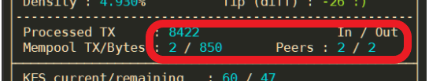

# Guía: ¿Cómo implementar una Stake Pool en Cardano?


¡Muchas gracias por todo el apoyo y los mensajes! Realmente nos motiva a seguir creando las mejores guías de criptomonedas. Si deseas donar [estas son las direcciones](https://cointr.ee/coincashew) a las que puedes depositar 🙏 



Última actualización: 18 de Abril de 2021. 
La guía está en su **versión 3.3.0** y está escrita para la  **mainnet de cardano** versión **1.26.2** 😁 


### 🏁 0. Prerrequisitos

#### 🧙 Habilidades necesarias para los operadores

Como operador de un nodo de Cardano, tendrás que tener las siguientes habilidades:

* Conocimientos de cómo implementar, iniciar y mantener un nodo de Cardano de manera continua.
* Compromiso de mantener tu nodo funcionando 24/7/365.
* Habilidad para operar sistemas.
* Habilidad para la administración de servidores \(operación y mantenimiento\).

#### 🧙 Experiencia necesaria para los operadores

* Experiencia en DevOps.
* Experiencia [reforzando](https://www.lifewire.com/harden-ubuntu-server-security-4178243) y [aumentando la seguridad de un servidor](https://gist.github.com/lokhman/cc716d2e2d373dd696b2d9264c0287a3).
* [Haber tomado el curso oficial de Stake Pool.](https://cardano-foundation.gitbook.io/stake-pool-course/) 


🛑 **Antes de continuar, es NECESARIO cumplir con los requisitos anteriores.** 🚧 


#### 🎗 Hardware mínimo

* **Dos servidores independientes:** 1 para el nodo productor de bloques, 1 para el nodo relevador.
* **Una máquina fuera de línea \(Entorno frío\)**
* **Sistema Operativo:** Linux 64-bit \(por ejemplo Ubuntu Server 20.04 LTS\).
* **Procesador:** Un procesador AMD o Intel x86 con dos o más núcleos, de 2GHz o mayor.
* **Memoria:** 8GB de RAM.
* **Almacenamiento:** Al menos 20GB de almacenamiento disponible.
* **Internet:** Conexión con una velocidad de al menos 10Mbps.
* **Plan de Datos**: De al menos 1GB por hora. 720GB al mes.
* **Alimentación:** Alimentación eléctrica confiable.
* **ADA:** Al menos 505 ADA para el registro del Stake Pool y tarifas de transacción.

#### 🏋♂ Hardware recomendado a futuro

* **Tres servidores independientes:** 1 para el nodo productor de bloques, 2 para los nodos relevadores.
* **Una máquina fuera de línea \(Entorno frío\)**
* **Sistema Operativo:** Linux 64-bit \(por ejemplo Ubuntu Server 20.04 LTS\).
* **Procesador:** Un procesador de 4 núcleos o mayor.
* **Memoria:** Más de 8GB de RAM.
* **Almacenamiento:** Un SSD 256GB o más.
* **Internet:** Conexión con una velocidad de al menos 100Mbps.
* **Plan de Datos**: Ilimitado.
* **Alimentación:** Alimentación eléctrica confiable con UPS.
* **ADA:** Dependerá del parámetro **a0**, entre más ADA en el Stake Pool será mejor a futuro.

#### 🔓 Medidas de Seguridad

Si deseas mejorar la seguridad de tus nodos, puedes consultar el siguiente enlace:



### 🛠 Instalación de Ubuntu

Si necesitas ayuda instalando **Ubuntu Server**, puedes consultar el siguiente enlace:



Si necesitas ayuda instalando **Ubuntu Desktop**, puedes consultar el siguiente enlace:




### 🧱 Reconstruyendo Nodos

Si estás reconstruyendo o reutilizando una instalación previa de `cardano-node`, consulta la [sección 18.2 ¿Cómo reiniciar la instalación?.](./#18-2-resetting-the-installation)

### 🏭 1. Instalar Cabal y GHC

Si estás usando Ubuntu Desktop, **presionar** Ctrl+Alt+T abrirá una nueva sesión en la terminal.

Actualizamos el sistema e instalamos las dependencias de Ubuntu.

```bash
sudo apt-get update -y
```

```text
sudo apt-get upgrade -y
```

```text
sudo apt-get install git jq bc make automake rsync htop curl build-essential pkg-config libffi-dev libgmp-dev libssl-dev libtinfo-dev libsystemd-dev zlib1g-dev make g++ wget libncursesw5 libtool autoconf -y
```

Instalamos Libsodium.

```bash
mkdir $HOME/git
cd $HOME/git
git clone https://github.com/input-output-hk/libsodium
cd libsodium
git checkout 66f017f1
./autogen.sh
./configure
make
sudo make install
```


Para los Operadores que utilicen Debian OS, puede que sea necesario vincular una librería adicional.

```bash
sudo ln -s /usr/local/lib/libsodium.so.23.3.0 /usr/lib/libsodium.so.23
```


Instalamos Cabal y sus dependencias.

```bash
sudo apt-get -y install pkg-config libgmp-dev libssl-dev libtinfo-dev libsystemd-dev zlib1g-dev build-essential curl libgmp-dev libffi-dev libncurses-dev libtinfo5
```

```bash
curl --proto '=https' --tlsv1.2 -sSf https://get-ghcup.haskell.org | sh
```

Respondemos **NO** cuando se nos pida instalar haskell-language-server \(HLS\).

Respondemos **YES** para agregar de manera automática la variable PATH al archivo ".bashrc".

```bash
curl --proto '=https' --tlsv1.2 -sSf https://get-ghcup.haskell.org | sh
ghcup upgrade
ghcup install cabal 3.4.0.0
ghcup set cabal 3.4.0.0
```

Instalamos GHC.

```bash
ghcup install ghc 8.10.4
ghcup set ghc 8.10.4
```

Actualizamos la variable PATH para que incluya a Cabal y GHC y exportamos rutas y variables. La localización del nodo estará en **$NODE\_HOME**. La [configuración del cluster](https://hydra.iohk.io/job/Cardano/iohk-nix/cardano-deployment/latest-finished/download/1/index.html) está dada por **$NODE\_CONFIG** y **$NODE\_BUILD\_NUM**. 

```bash
echo PATH="$HOME/.local/bin:$PATH" >> $HOME/.bashrc
echo export LD_LIBRARY_PATH="/usr/local/lib:$LD_LIBRARY_PATH" >> $HOME/.bashrc
echo export NODE_HOME=$HOME/cardano-my-node >> $HOME/.bashrc
echo export NODE_CONFIG=mainnet>> $HOME/.bashrc
echo export NODE_BUILD_NUM=$(curl https://hydra.iohk.io/job/Cardano/iohk-nix/cardano-deployment/latest-finished/download/1/index.html | grep -e "build" | sed 's/.*build\/\([0-9]*\)\/download.*/\1/g') >> $HOME/.bashrc
source $HOME/.bashrc
```


💡 **¿Cómo usar esta guía para la TestNet?**

En cada ****parámetro de CLI**** donde aparezca: 

 `--mainnet` 

lo reemplazaremos por:

`--testnet-magic 1097911063`


Actualizamos Cabal, y nos aseguramos de que la versión sea la correcta.

```bash
cabal update
cabal --version
ghc --version
```


Cabal debe ser versión 3.4.0.0 y GHC versión 8.10.4



### 🏗 2. Construyendo el nodo desde su código fuente

Descargamos el código fuente y cambiamos la etiqueta de versión a descargar para que corresponda a la 1.26.2.

```bash
cd $HOME/git
git clone https://github.com/input-output-hk/cardano-node.git
cd cardano-node
git fetch --all --recurse-submodules --tags
git checkout tags/1.26.2
```

Configuramos las opciones de construcción.

```text
cabal configure -O0 -w ghc-8.10.4
```

Actualizamos la configuración de Cabal, los parámetros del proyecto y reiniciamos la carpeta donde se va a construir.

```bash
echo -e "package cardano-crypto-praos\n flags: -external-libsodium-vrf" > cabal.project.local
sed -i $HOME/.cabal/config -e "s/overwrite-policy:/overwrite-policy: always/g"
rm -rf $HOME/git/cardano-node/dist-newstyle/build/x86_64-linux/ghc-8.10.4
```

¡Ahora construimos el nodo!

```text
cabal build cardano-cli cardano-node
```


El proceso de construcción puede tomar de unos cuantos minutos a unas cuantas horas, dependiendo de la capacidad de procesamiento de la computadora.


Copiamos los archivos **cardano-cli** y **cardano-node** a la carpeta bin.

```bash
sudo cp $(find $HOME/git/cardano-node/dist-newstyle/build -type f -name "cardano-cli") /usr/local/bin/cardano-cli
```

```bash
sudo cp $(find $HOME/git/cardano-node/dist-newstyle/build -type f -name "cardano-node") /usr/local/bin/cardano-node
```

Verificamos que las versiones de **cardano-cli** y **cardano-node** sean las correctas (En este caso, la 1.26.2).

```text
cardano-node version
cardano-cli version
```


### 📐 3. Configuración de los nodos

Descargamos los archivos config.json, genesis.json y topology.json, los cuales son necesarios para la configuración y arranque del nodo.

```bash
mkdir $NODE_HOME
cd $NODE_HOME
wget -N https://hydra.iohk.io/build/${NODE_BUILD_NUM}/download/1/${NODE_CONFIG}-byron-genesis.json
wget -N https://hydra.iohk.io/build/${NODE_BUILD_NUM}/download/1/${NODE_CONFIG}-topology.json
wget -N https://hydra.iohk.io/build/${NODE_BUILD_NUM}/download/1/${NODE_CONFIG}-shelley-genesis.json
wget -N https://hydra.iohk.io/build/${NODE_BUILD_NUM}/download/1/${NODE_CONFIG}-config.json
```

Ejecutamos los siguientes comandos para modificar el archivo **mainnet-config.json** y actualizar la línea:
* update TraceBlockFetchDecisions a "true"

```bash
sed -i ${NODE_CONFIG}-config.json \
    -e "s/TraceBlockFetchDecisions\": false/TraceBlockFetchDecisions\": true/g"
```


\*\*\*\*✨ **Tip**: En el Nodo Relevador es posible reducir el consumo de memoria y de CPU cambiando el parámetro "TraceMemPool" a "false" en el archivo **mainnet-config.json**  


Actualizamos nuestro archivo **.bashrc** con las nuevas variables de Shell.

```bash
echo export CARDANO_NODE_SOCKET_PATH="$NODE_HOME/db/socket" >> $HOME/.bashrc
source $HOME/.bashrc
```

#### 🔮 4. Configurar el Nodo Productor


Un Nodo Productor de Bloques es aquel que está configurado con varios pares de claves \(Frías,KES y VRF\), las cuales son necesarias para la producción de bloques. Solamente debe de tener conexión con sus Nodos Relevadores.



Un Nodo Relevador no tendrá ningún tipo de clave y por lo tanto no será capaz de producir ningún bloque. Estará conectado a su Nodo Productor, a otros relevadores y nodos externos en la red.




Para propósitos de la guía, vamos a trabajar **dos nodos** en **dos servidores independientes**. Uno será llamado el **NodoProductor** y el otro será su Nodo Relevador, llamado **NodoRelevador1**.



Editamos el archivo **topology.json** para que: 

* El/Los Nodo(s) Relevadore(s) se conectan a los Relevadores Públicos \(como los de  IOHK y los Nodos de amigos\) y a tu Nodo Productor de Bloques.
* El Nodo Productor de Bloques **SOLAMENTE** debe de tener conexión con el/los Nodo(s) Relevadore(s). 


En el **Nodo Productor de Bloques,** ejecuta los siguientes comandos. Cambia el campo **addr** con la IP pública de tu Nodo Relevador (En caso de que ambos estén en una red local, deberás colocar la IP privada de tu Nodo Relevador).



```bash
cat > $NODE_HOME/${NODE_CONFIG}-topology.json << EOF 
 {
    "Producers": [
      {
        "addr": "DIRECCION IP DEL NODO RELEVADOR",
        "port": 6000,
        "valency": 1
      }
    ]
  }
EOF
```



### 🛸 5. Configurar el Nodo Relevador


🚧 En el otro servidor que será designado como tu Nodo Relevador, o como lo llamamos en la guía: **NodoRelevador1**, repite los pasos del **1 al 3** para construir los archivos binarios del nodo de Cardano.



Puedes tener múltiples Nodos Relevadores a manera que escales la arquitectura de tu Stake Pool. Simplemente reemplaza el número de **NodoRelevadorN** y adapta las instrucciones de la guía para generar otro Nodo Relevador.


En el **NodoRelevador1** ejectuta el siguiente comando, **recuerda cambiar la dirección IP del Nodo Productor** (En caso de que ambos estén en una red local, deberás colocar la IP privada de tu Nodo Productor de Bloques).



```bash
cat > $NODE_HOME/${NODE_CONFIG}-topology.json << EOF 
 {
    "Producers": [
      {
        "addr": "IP DEL NODO PRODUCTOR DE BLOQUES",
        "port": 6000,
        "valency": 1
      },
      {
        "addr": "relays-new.cardano-mainnet.iohk.io",
        "port": 3001,
        "valency": 2
      }
    ]
  }
EOF
```




La valencia, **valency**, le indica a nuestro nodo cuántas conexiones mantener abiertas. Solamente afecta a las direcciones en modo de DNS. Si el valor es 0, la dirección es ignorada.



\*\*\*\*✨ **Abrir los Puertos:** Necesitarás abrir el puerto 6000 de tus nodos para que se puedan comunicar entre sí. Puedes ver el estado del puerto en las siguientes páginas: [https://www.yougetsignal.com/tools/open-ports/](https://www.yougetsignal.com/tools/open-ports/) , [https://canyouseeme.org/](https://canyouseeme.org/) .


### 🔏 6. Configurar la máquina fuera de línea


Una máquina fuera de línea se conoce como un **entorno frío**. 

* Está protegida contra intentos de key-logging, ataques basados en virus o otro tipo de exploit del firewall.
* Físicamente aislada del resto de la red.
* No debe estar conectada a la red por cable Ethernet ni vía Inalámbrica. 
* No es una máquina virtual con conexión a la red.
* Puedes aprender más acerca de esta medida de seguridad en [Air-Gapping, en Wikipedia](https://en.wikipedia.org/wiki/Air_gap_%28networking%29).




```bash
echo export NODE_HOME=$HOME/cardano-my-node >> $HOME/.bashrc
source $HOME/.bashrc
mkdir -p $NODE_HOME
```



Copia de tu **entorno caliente**, también conocido como el Nodo Productor de Bloques, una copia del archivo **`cardano-cli`** hacia tu **entorno frío**, y colócalo en la carpeta de binarios. 


Para que verdaderamente se considere una Máquina Fuera de Línea, debes de mover los archivos de manera física entre los dos usando una USB o otro dispositivo portátil.



### 🤖 7. Creación de Scripts de arranque

El script de arranque contiene todas las variables necesarias para ejecutar el Nodo de Cardano, tales como el directorio, puerto, ruta a la base de datos, archivos de configuración y el archivo de la topología.



```bash
cat > $NODE_HOME/startBlockProducingNode.sh << EOF 
#!/bin/bash
DIRECTORY=$NODE_HOME
PORT=6000
HOSTADDR=0.0.0.0
TOPOLOGY=\${DIRECTORY}/${NODE_CONFIG}-topology.json
DB_PATH=\${DIRECTORY}/db
SOCKET_PATH=\${DIRECTORY}/db/socket
CONFIG=\${DIRECTORY}/${NODE_CONFIG}-config.json
/usr/local/bin/cardano-node run --topology \${TOPOLOGY} --database-path \${DB_PATH} --socket-path \${SOCKET_PATH} --host-addr \${HOSTADDR} --port \${PORT} --config \${CONFIG}
EOF
```



```bash
cat > $NODE_HOME/startRelayNode1.sh << EOF 
#!/bin/bash
DIRECTORY=$NODE_HOME
PORT=6000
HOSTADDR=0.0.0.0
TOPOLOGY=\${DIRECTORY}/${NODE_CONFIG}-topology.json
DB_PATH=\${DIRECTORY}/db
SOCKET_PATH=\${DIRECTORY}/db/socket
CONFIG=\${DIRECTORY}/${NODE_CONFIG}-config.json
/usr/local/bin/cardano-node run --topology \${TOPOLOGY} --database-path \${DB_PATH} --socket-path \${SOCKET_PATH} --host-addr \${HOSTADDR} --port \${PORT} --config \${CONFIG}
EOF
```



Le damos permisos de ejecución a los scripts de arranque.



```bash
chmod +x $NODE_HOME/startBlockProducingNode.sh
```



```bash
chmod +x $NODE_HOME/startRelayNode1.sh 
```



Introduce los siguientes comandos para crear un **archivo de unidad en systemd** esto nos permitirá hacer un servicio llamado cardano-node.


#### 🍰 Ventajas de usar systemd para una Stake Pool

1. Reinicio automático del Stake Pool ante cualquier reinicio inesperado.
2. Reinicio automático en caso de falla de un proceso.
3. Maximiza el tiempo que se mantiene en línea la Stake Pool y mejora su desempeño.




```bash
cat > $NODE_HOME/cardano-node.service << EOF 
# The Cardano node service (part of systemd)
# file: /etc/systemd/system/cardano-node.service 

[Unit]
Description     = Cardano node service
Wants           = network-online.target
After           = network-online.target 

[Service]
User            = ${USER}
Type            = simple
WorkingDirectory= ${NODE_HOME}
ExecStart       = /bin/bash -c '${NODE_HOME}/startBlockProducingNode.sh'
KillSignal=SIGINT
RestartKillSignal=SIGINT
TimeoutStopSec=2
LimitNOFILE=32768
Restart=always
RestartSec=5
SyslogIdentifier=cardano-node

[Install]
WantedBy	= multi-user.target
EOF
```



```bash
cat > $NODE_HOME/cardano-node.service << EOF 
# The Cardano node service (part of systemd)
# file: /etc/systemd/system/cardano-node.service 

[Unit]
Description     = Cardano node service
Wants           = network-online.target
After           = network-online.target 

[Service]
User            = ${USER}
Type            = simple
WorkingDirectory= ${NODE_HOME}
ExecStart       = /bin/bash -c '${NODE_HOME}/startRelayNode1.sh'
KillSignal=SIGINT
RestartKillSignal=SIGINT
TimeoutStopSec=2
LimitNOFILE=32768
Restart=always
RestartSec=5
SyslogIdentifier=cardano-node

[Install]
WantedBy	= multi-user.target
EOF
```



Movemos el archivo hacia `/etc/systemd/system` y le damos permisos de ejecución, lectura y escritura para el usuario.

```bash
sudo mv $NODE_HOME/cardano-node.service /etc/systemd/system/cardano-node.service
```

```bash
sudo chmod 644 /etc/systemd/system/cardano-node.service
```

Ejecutamos los siguientes comandos para habilitar el inicio automático de nuestro servicio al arranque del sistema.

```text
sudo systemctl daemon-reload
sudo systemctl enable cardano-node
```


Tu Stake Pool ahora está administrada por la robustez y confiabilidad de Systemd. A continuación hay varios comandos para utilizar systemd


#### 🔎 Ver el estado actual del Nodo

```text
sudo systemctl status cardano-node
```

#### 🔄 Reiniciar el Nodo

```text
sudo systemctl reload-or-restart cardano-node
```

#### 🛑 Detemer el Nodo

```text
sudo systemctl stop cardano-node
```

#### 🗄 Ver y filtrar registros

```bash
journalctl --unit=cardano-node --follow
```

```bash
journalctl --unit=cardano-node --since=yesterday
```

```text
journalctl --unit=cardano-node --since=today
```

```text
journalctl --unit=cardano-node --since='2020-07-29 00:00:00' --until='2020-07-29 12:00:00'
```


### ✅ 8. Iniciando los Nodos

¡Vamos a iniciar la sincronización de los nodos con la cadena de bloques!



```bash
sudo systemctl start cardano-node
```



```bash
sudo systemctl start cardano-node
```



Instalamos gLiveView, una herramienta de monitoreo.


gLiveView muestra información importante de nuestro nodo y funciona bien con los servicios controlados con systemd. Créditos a [Guild Operators](https://cardano-community.github.io/guild-operators/#/Scripts/gliveview) por desarrollar esta herramienta.


```bash
cd $NODE_HOME
sudo apt install bc tcptraceroute -y
curl -s -o gLiveView.sh https://raw.githubusercontent.com/cardano-community/guild-operators/master/scripts/cnode-helper-scripts/gLiveView.sh
curl -s -o env https://raw.githubusercontent.com/cardano-community/guild-operators/master/scripts/cnode-helper-scripts/env
chmod 755 gLiveView.sh
```

Ejecutamos lo siguiente para modificar el archivo **env** con las rutas y variables de nuestro nodo.

```bash
sed -i env \
    -e "s/\#CONFIG=\"\${CNODE_HOME}\/files\/config.json\"/CONFIG=\"\${NODE_HOME}\/mainnet-config.json\"/g" \
    -e "s/\#SOCKET=\"\${CNODE_HOME}\/sockets\/node0.socket\"/SOCKET=\"\${NODE_HOME}\/db\/socket\"/g"
```


El nodo debe de alcanzar el epoch 208 \(lanzamiento de Shelley\), antes de que **gLiveView** pueda empezar a mostrar información acerca de la sincronización del nodo. Por el momento puedes usar `journalctl` en lo que el nodo alcanza el epoch 208.

```text
journalctl --unit=cardano-node --follow
```


Mandamos a ejecutar gLiveView para monitorear el proceso de sincronización de nuestro nodo.

```text
./gLiveView.sh
```

Vista de ejemplo de gLiveView


Para más información, puedes ir a la [página Oficial de Guild Live View](https://cardano-community.github.io/guild-operators/#/Scripts/gliveview)


\*\*\*\*✨ **Super Tip**: Si terminas de sincronizar la base de datos de un nodo, puedes copiar el directorio completo al otro nodo para reducir el tiempo de sincronización.



¡Felicidades! Tu nodo ahora se encuentra corriendo, déjalo sincronizar.


### ⚙ 9. Generación de claves para el Nodo Productor de Bloques
El nodo Productor de Bloques requiere la creación de 3 claves, las cuales están definidas [en el documento de Shelley](https://hydra.iohk.io/build/2473732/download/1/ledger-spec.pdf):

* Claves frías del Stake Pool \(node.cert\)
* Claves calientes del Stake Pool \(kes.skey\)
* Claves VRF del Stake Pool \(vrf.skey\)

Primero, generamos el par de claves KES.



```bash
cd $NODE_HOME
cardano-cli node key-gen-KES \
    --verification-key-file kes.vkey \
    --signing-key-file kes.skey
```




Las claves KES \(Key Evolving Signature\) están hechas para prevenir ataques de hackers que pudieran comprometer la seguridad de tus claves.

**En la mainnet, las claves KES deben ser generadas cada 90 días.**



\*\*\*\*🔥 **Las claves frías** **deben ser creadas y resguardadas en tu máquina fuera de línea** Las claves frías se almacenan en la ruta `$HOME/cold-keys.`


Hacemos un directorio para almacenar nuestras claves frías.



```text
mkdir $HOME/cold-keys
pushd $HOME/cold-keys
```



Generamos el par de claves frías y creamos el archivo node.counter.



```bash
cardano-cli node key-gen \
    --cold-verification-key-file node.vkey \
    --cold-signing-key-file node.skey \
    --operational-certificate-issue-counter node.counter
```




Asegúrate de **respaldar todas tus claves** en otro dispositivo de almacenamiento seguro. Es recomendable tener múltiples copias.


Determinamos el número de slots por periodo KES del archivo genesis.



```bash
pushd +1
slotsPerKESPeriod=$(cat $NODE_HOME/${NODE_CONFIG}-shelley-genesis.json | jq -r '.slotsPerKESPeriod')
echo slotsPerKESPeriod: ${slotsPerKESPeriod}
```




Antes de continuar, tu nodo debe de estar completamente sincronizado a la cadena de bloques. De lo contrario no podrás calcular el periodo KES. Tu nodo se encuentra sincronizado cuando el epoch y el slot en gLiveView son iguales a los que muestra un explorador de bloques, tal como [https://pooltool.io/](https://pooltool.io/)




```bash
slotNo=$(cardano-cli query tip --mainnet | jq -r '.slot')
echo slotNo: ${slotNo}
```



Encontramos **kesPeriod** dividiendo número de slot entre los slots por periodoKES.



```bash
kesPeriod=$((${slotNo} / ${slotsPerKESPeriod}))
echo kesPeriod: ${kesPeriod}
startKesPeriod=${kesPeriod}
echo startKesPeriod: ${startKesPeriod}
```



Con este cálculo, ya podemos generar el certificado de operación para el Stake Pool. 

Copia **kes.vkey** a tu **entorno frío**. 

Cambiamos &lt;**startKesPeriod&gt;** al valor calculado anteriormente.


Los operadores deben de proveer un certificado de operación para verificar que el Stake Pool tiene la autorización de funcionar. El certificado incluye la firma del operador e información clave acerca del Stake Pool \(direcciones, claves, etc.\). Los certificados de operación representan el vínculo entre las claves fuera de línea y sus claves de operación.




```bash
cardano-cli node issue-op-cert \
    --kes-verification-key-file kes.vkey \
    --cold-signing-key-file $HOME/cold-keys/node.skey \
    --operational-certificate-issue-counter $HOME/cold-keys/node.counter \
    --kes-period <startKesPeriod> \
    --out-file node.cert
```



Copia **node.cert** a tu **entorno caliente**.

Hacemos un par de claves VRF.



```bash
cardano-cli node key-gen-VRF \
    --verification-key-file vrf.vkey \
    --signing-key-file vrf.skey
```



Actualizamos los permisos de la clave VRF para ser solo lectura.

```text
chmod 400 vrf.skey
```

Detenemos la ****Stake Pool ejecutando el siguiente código:



```bash
sudo systemctl stop cardano-node
```



Actualizamos el script de arranque con nuestros nuevos archivos **KES, VRF y el Certificato de Operación.**



```bash
cat > $NODE_HOME/startBlockProducingNode.sh << EOF 
DIRECTORY=$NODE_HOME
PORT=6000
HOSTADDR=0.0.0.0
TOPOLOGY=\${DIRECTORY}/${NODE_CONFIG}-topology.json
DB_PATH=\${DIRECTORY}/db
SOCKET_PATH=\${DIRECTORY}/db/socket
CONFIG=\${DIRECTORY}/${NODE_CONFIG}-config.json
KES=\${DIRECTORY}/kes.skey
VRF=\${DIRECTORY}/vrf.skey
CERT=\${DIRECTORY}/node.cert
cardano-node run --topology \${TOPOLOGY} --database-path \${DB_PATH} --socket-path \${SOCKET_PATH} --host-addr \${HOSTADDR} --port \${PORT} --config \${CONFIG} --shelley-kes-key \${KES} --shelley-vrf-key \${VRF} --shelley-operational-certificate \${CERT}
EOF
```




Para operar una Stake Pool, necesitas los archivos KES, VRF y el Certificado de Operación. Las llaves frías generan nuevos certificados de operación de manera periódica.


Iniciamos el Nodo Productor de Bloques.



```bash
sudo systemctl start cardano-node

# Monitor with gLiveView
./gLiveView.sh
```



### 🔐 10. Establecer las claves de pago y stake


Primero obtenemos los parámetros del protocolo.


Si aparece el siguiente mensaje al momento de obtener los parámetros, debes de esperar a que tu Nodo Productor de Bloques comience a sincronizar de nuevo.

`cardano-cli: Network.Socket.connect: : does not exist (No such file or directory)`




```bash
cardano-cli query protocol-parameters \
    --mainnet \
    --out-file params.json
```




Las claves de pago son usadas para mandar y recibir pagos, mientras que las claves de stake son usadas para administrar las delegaciones.


Hay dos maneras de crear tu par de claves de `pago` y `stake`. Elige la que cumpla mejor con tus necesidades.


🔥 **Consejo Crítico de Seguridad:** Las claves de `pago` y `stake` deben de ser generadas y usadas para construir transacciones en un entorno frío, en otras palabras tu **Máquina Fuera de Línea**. Copia el binario `cardano-cli` a tu Máquina Fuera de Línea y ejecuta el método CLI o el método de la mnemónica. Los únicos pasos que son hechos en el Nodo Productor son aquellos que requieren información actualizada. Específicamente los siguientes pasos:  

* Consultar el slot actual en la red.
* Consultar el balance de una dirección.
* Enviar una transacción.




Creamos un nuevo par de claves de pago:  `payment.skey` y `payment.vkey`

```bash
###
### En la máquina fuera de línea,
###
cd $NODE_HOME
cardano-cli address key-gen \
    --verification-key-file payment.vkey \
    --signing-key-file payment.skey
```

Creamos un nuevo par de claves de stake: `stake.skey` y `stake.vkey`

```bash
###
### En la máquina fuera de línea,
###
cardano-cli stake-address key-gen \
    --verification-key-file stake.vkey \
    --signing-key-file stake.skey
```

Creamos una dirección de stake usando `stake.vkey` y la guardamos en `stake.addr`

```bash
###
### En la máquina fuera de línea,
###
cardano-cli stake-address build \
    --stake-verification-key-file stake.vkey \
    --out-file stake.addr \
    --mainnet
```

Construimos una dirección de pago para la clave de pago `payment.vkey` la cual delegará a la dirección de stake `stake.vkey`

```bash
###
### En la máquina fuera de línea,
###
cardano-cli address build \
    --payment-verification-key-file payment.vkey \
    --stake-verification-key-file stake.vkey \
    --out-file payment.addr \
    --mainnet
```




Créditos a [ilap](https://gist.github.com/ilap/3fd57e39520c90f084d25b0ef2b96894) por crear este proceso.



**Beneficios**: Monitorear y controlar las recompensas desde cualquier wallet \(Deadalus, Yoroi o cualquier otra\) que soporte staking.


Crea una wallet compatible con Shelley con mnemonica de 15 o 24 palabras en [Daedalus](https://daedaluswallet.io/) o con [Yoroi](../../../wallets/browser-wallets/yoroi-wallet-cardano.md), de preferencia en una máquina fuera de línea.

Usando el Nodo Productor de Bloques, descargamos `cardano-wallet`

```bash
###
### En el nodo productor,
###
cd $NODE_HOME
wget https://hydra.iohk.io/build/3662127/download/1/cardano-wallet-shelley-2020.7.28-linux64.tar.gz
```

Verificamos la legitimidad de la descarga de `cardano-wallet` revisando el [hash sha256 encontrado en el botón **Details**](https://hydra.iohk.io/build/3662127/).

```bash
echo "f75e5b2b4cc5f373d6b1c1235818bcab696d86232cb2c5905b2d91b4805bae84 *cardano-wallet-shelley-2020.7.28-linux64.tar.gz" | shasum -a 256 --check
```

Si aparece la siguiente línea en la terminal, significa que el hash es válido.

> cardano-wallet-shelley-2020.7.28-linux64.tar.gz: OK


Procede con los siguiente pasos solamente si sha256 retorna un **OK**!


Transfiere el archivo **cardano-wallet** a tu **Máquina Fuera de Línea** por USB o otro dispositivo.

Extraemos los archivos y eliminamos el comprimido.

```bash
###
### On air-gapped offline machine,
###
tar -xvf cardano-wallet-shelley-2020.7.28-linux64.tar.gz
rm cardano-wallet-shelley-2020.7.28-linux64.tar.gz
```

Creamos el script `extractPoolStakingKeys.sh`.

```bash
###
### On air-gapped offline machine,
###
cat > extractPoolStakingKeys.sh << HERE
#!/bin/bash 

CADDR=\${CADDR:=\$( which cardano-address )}
[[ -z "\$CADDR" ]] && ( echo "cardano-address cannot be found, exiting..." >&2 ; exit 127 )

CCLI=\${CCLI:=\$( which cardano-cli )}
[[ -z "\$CCLI" ]] && ( echo "cardano-cli cannot be found, exiting..." >&2 ; exit 127 )

OUT_DIR="\$1"
[[ -e "\$OUT_DIR"  ]] && {
       	echo "The \"\$OUT_DIR\" is already exist delete and run again." >&2 
       	exit 127
} || mkdir -p "\$OUT_DIR" && pushd "\$OUT_DIR" >/dev/null

shift
MNEMONIC="\$*"

# Generate the master key from mnemonics and derive the stake account keys 
# as extended private and public keys (xpub, xprv)
echo "\$MNEMONIC" |\
"\$CADDR" key from-recovery-phrase Shelley > root.prv

cat root.prv |\
"\$CADDR" key child 1852H/1815H/0H/2/0 > stake.xprv

cat root.prv |\
"\$CADDR" key child 1852H/1815H/0H/0/0 > payment.xprv

TESTNET=0
MAINNET=1
NETWORK=\$MAINNET

cat payment.xprv |\
"\$CADDR" key public | tee payment.xpub |\
"\$CADDR" address payment --network-tag \$NETWORK |\
"\$CADDR" address delegation \$(cat stake.xprv | "\$CADDR" key public | tee stake.xpub) |\
tee base.addr_candidate |\
"\$CADDR" address inspect
echo "Generated from 1852H/1815H/0H/{0,2}/0"
cat base.addr_candidate
echo

# XPrv/XPub conversion to normal private and public key, keep in mind the 
# keypars are not a valind Ed25519 signing keypairs.
TESTNET_MAGIC="--testnet-magic 1097911063"
MAINNET_MAGIC="--mainnet"
MAGIC="\$MAINNET_MAGIC"

SESKEY=\$( cat stake.xprv | bech32 | cut -b -128 )\$( cat stake.xpub | bech32)
PESKEY=\$( cat payment.xprv | bech32 | cut -b -128 )\$( cat payment.xpub | bech32)

cat << EOF > stake.skey
{
    "type": "StakeExtendedSigningKeyShelley_ed25519_bip32",
    "description": "",
    "cborHex": "5880\$SESKEY"
}
EOF

cat << EOF > payment.skey
{
    "type": "PaymentExtendedSigningKeyShelley_ed25519_bip32",
    "description": "Payment Signing Key",
    "cborHex": "5880\$PESKEY"
}
EOF

"\$CCLI" shelley key verification-key --signing-key-file stake.skey --verification-key-file stake.evkey
"\$CCLI" shelley key verification-key --signing-key-file payment.skey --verification-key-file payment.evkey

"\$CCLI" shelley key non-extended-key --extended-verification-key-file payment.evkey --verification-key-file payment.vkey
"\$CCLI" shelley key non-extended-key --extended-verification-key-file stake.evkey --verification-key-file stake.vkey


"\$CCLI" shelley stake-address build --stake-verification-key-file stake.vkey \$MAGIC > stake.addr
"\$CCLI" shelley address build --payment-verification-key-file payment.vkey \$MAGIC > payment.addr
"\$CCLI" shelley address build \
    --payment-verification-key-file payment.vkey \
    --stake-verification-key-file stake.vkey \
    \$MAGIC > base.addr

echo "Important the base.addr and the base.addr_candidate must be the same"
diff base.addr base.addr_candidate
popd >/dev/null
HERE
```

Añadimos permisos de ejecución y exportamos la variable PATH para usar los binarios.

```bash
###
### On air-gapped offline machine,
###
chmod +x extractPoolStakingKeys.sh
export PATH="$(pwd)/cardano-wallet-shelley-2020.7.28:$PATH"
```

Extramos las claves, coloca en el comando tu frase mnemónica con la que se generó la wallet.

```bash
###
### On air-gapped offline machine,
###
./extractPoolStakingKeys.sh extractedPoolKeys/ <Frase Mnemónica de 15/24 palabras>
```


**Importante**: **base.addr** y **base.addr\_candidate** deben ser exactamente iguales. Revisa la terminal para confirmarlo.


Tus claves recien generadas se encontrarán en el directorio `extractedPoolKeys/`

Ahora transifiere los pares de claves `payment y stake` hacia `$NODE_HOME` para usarlas en tu Stake Pool.

```bash
###
### On air-gapped offline machine,
###
cd extractedPoolKeys/
cp stake.vkey stake.skey stake.addr payment.vkey payment.skey base.addr $NODE_HOME
cd $NODE_HOME
#Rename to base.addr file to payment.addr
mv base.addr payment.addr
```


**payment.addr**, o también conocida como base.addr en el script de extracción, será la dirección de Cardano que almacene el pledge de tu Stake Pool.


Limpia el historial del bash para proteger tu frase mnemónica, eliminamos también los archivos de `cardano-wallet`.

```bash
###
### On air-gapped offline machine,
###
history -c && history -w
rm -rf $NODE_HOME/cardano-wallet-shelley-2020.7.28
```

Finalmente cierra todas las ventanas de terminal y abre una nueva sesión con cero historial.


¡Genial! Ahora puedes monitorear las recompensas de tu Stake Pool desde una wallet.




Ahora hay que añadir fondos a tu dirección de pago. 

Copia **payment.addr** a tu **entorno caliente**.

Las direcciones de pago pueden ser fondeadas desde Deadalus o Yoroi.

Ejecuta el siguiente comando para conocer tu dirección de pago.

```bash
cat payment.addr
```

Después de fondear tu cuenta, revisa el balance actual de tu dirección de pago.


Antes de continuar, tus nodos deben estar completamente sincronizados a la cadena de bloques. De otra manera no serás capaz de revisar tus fondos.




```bash
cardano-cli query utxo \
    --address $(cat payment.addr) \
    --mainnet
```



Deberías de ver una respuesta en la terminal similar a esto. Estás son tus UxTO \(Undspent transaction output\).

```text
                           TxHash                                 TxIx        Lovelace
----------------------------------------------------------------------------------------
100322a39d02c2ead....                                              0        1000000000
```

### 👩💻 11. Registrando la dirección de Stake

Creamos el certificado `stake.cert`, usando `stake.vkey`



```text
cardano-cli stake-address registration-certificate \
    --stake-verification-key-file stake.vkey \
    --out-file stake.cert
```



Copia **stake.cert** a tu **entorno caliente.**

Necesitarás encontrar el tip actual de la cadena de bloques para que el parámetro **invalid-hereafter** sea el correcto.



```bash
currentSlot=$(cardano-cli query tip --mainnet | jq -r '.slot')
echo Current Slot: $currentSlot
```



Consulta tu balance y tus **UTXOs**.



```bash
cardano-cli query utxo \
    --address $(cat payment.addr) \
    --mainnet > fullUtxo.out

tail -n +3 fullUtxo.out | sort -k3 -nr > balance.out

cat balance.out

tx_in=""
total_balance=0
while read -r utxo; do
    in_addr=$(awk '{ print $1 }' <<< "${utxo}")
    idx=$(awk '{ print $2 }' <<< "${utxo}")
    utxo_balance=$(awk '{ print $3 }' <<< "${utxo}")
    total_balance=$((${total_balance}+${utxo_balance}))
    echo TxHash: ${in_addr}#${idx}
    echo ADA: ${utxo_balance}
    tx_in="${tx_in} --tx-in ${in_addr}#${idx}"
done < balance.out
txcnt=$(cat balance.out | wc -l)
echo Total ADA balance: ${total_balance}
echo Number of UTXOs: ${txcnt}
```



Encontramos el valor de **keyDeposit**



```bash
keyDeposit=$(cat $NODE_HOME/params.json | jq -r '.keyDeposit')
echo keyDeposit: $keyDeposit
```




Registrar un certificado de dirección de stake \(keyDeposit\) cuesta 2000000 lovelace, o 2ADA.


Ejecutamos el comando para generar una nueva transacción.


El valor de **invalid-hereafter** debe ser mayor al tip actual de la red. Para este ejemplo usamos **current slot + 10000**. Esto significa que la transacción no será valida pasando 10000 slots en la cadena de bloques.




```bash
cardano-cli transaction build-raw \
    ${tx_in} \
    --tx-out $(cat payment.addr)+0 \
    --invalid-hereafter $(( ${currentSlot} + 10000)) \
    --fee 0 \
    --out-file tx.tmp \
    --certificate stake.cert
```



Calculamos la tarifa mínima:



```bash
fee=$(cardano-cli transaction calculate-min-fee \
    --tx-body-file tx.tmp \
    --tx-in-count ${txcnt} \
    --tx-out-count 1 \
    --mainnet \
    --witness-count 2 \
    --byron-witness-count 0 \
    --protocol-params-file params.json | awk '{ print $1 }')
echo fee: $fee
```




Asegurate que el balance es mayor a la suma de la tarifa + keyDeposit, de otra manera no el registro no se hará.


Calculamos el balance restante, después de la transacción.



```bash
txOut=$((${total_balance}-${keyDeposit}-${fee}))
echo Change Output: ${txOut}
```



Construimos la transacción que registrará la dirección de Stake.



```bash
cardano-cli transaction build-raw \
    ${tx_in} \
    --tx-out $(cat payment.addr)+${txOut} \
    --invalid-hereafter $(( ${currentSlot} + 10000)) \
    --fee ${fee} \
    --certificate-file stake.cert \
    --out-file tx.raw
```



Copia **tx.raw** a tu **entorno frío**
 
Firmamos la transacción con las claves secretas de pago y stake.



```bash
cardano-cli transaction sign \
    --tx-body-file tx.raw \
    --signing-key-file payment.skey \
    --signing-key-file stake.skey \
    --mainnet \
    --out-file tx.signed
```



Copia **tx.signed** a tu **entorno caliente.**

Enviamos la transacción a la red.



```bash
cardano-cli transaction submit \
    --tx-file tx.signed \
    --mainnet
```



### 📄 12. Registrando el Stake Pool

Crea la metadata de tu Stake Pool con un archivo .JSON y actualiza la información de tu Stake Pool.


**ticker** debe de ser un valor de 3-5 caracteres. Solamente se pueden usar de la A-Z y del 0-9



**description** no puede exceder los 255 caracteres.




```bash
cat > poolMetaData.json << EOF
{
"name": "Nombre de mi Stake Pool",
"description": "Descripcion de mi Stake Pool",
"ticker": "MEX",
"homepage": "https://mystakepoolrifa.com"
}
EOF
```



Calcula el hash del archivo metadata.



```bash
cardano-cli stake-pool metadata-hash --pool-metadata-file poolMetaData.json > poolMetaDataHash.txt
```



Ahora sube el archivo **poolMetaData.json** a tu propio sito web o en un sitio web público tal como [https://pages.github.com/](https://pages.github.com/)

Consulta la siguiente guía si necesitas ayuda subiendo tu archivo a github.com



Encontramos el costo mínimo del Stake Pool:



```bash
minPoolCost=$(cat $NODE_HOME/params.json | jq -r .minPoolCost)
echo minPoolCost: ${minPoolCost}
```




Actualmente el costo mínimo es de 340000000 lovelace o 340ADA. Por lo tanto `--pool-cost` debe ser al menos esta cantidad.


Creamos un certificado de registro para la Stake Pool. Actualiza los campos de **metadata URL** y **relay node information**. Puedes elegir una de las tres opciones disponibles para configurar tus Nodos Relevadores -- En base a DNS, Round Robin en base a DNS o en base en IP.


DNS based relays are recommended for simplicity of node management. In other words, you don't need to re-submit this **registration certificate** transaction every time your IP changes. Also you can easily update the DNS to point towards a new IP should you re-locate or re-build a relay node, for example.

Los relevadores en base a DNS son recomendados por las simplicidad de administración. En otras palabras, no necesitas volver a ennviar el **certificado de registro** cada que la IP del relevador cambia. También puedes actualizar más fácilmente el DNS para apuntar hacia otra dirección IP en caso de que tengas que reubicar o reconstruir el Nodo Relevador.



#### \*\*\*\*✨ **¿Cómo configurar múltiples relevadores?** 

Update the next operation
Actualiza la siguiente operación para que sea ejecutada en tu máquina fuera de línea de manera apropiada

`cardano-cli stake-pool registration-certificate`

**Relevadores en base a DNS, 1 registro por DNS **

```bash
    --single-host-pool-relay relaynode1.myadapoolnamerocks.com\
    --pool-relay-port 6000 \
    --single-host-pool-relay relaynode2.myadapoolnamerocks.com\
    --pool-relay-port 6000 \
```
**Relevadores en base a Round Robin de DNS, 1 registro por** [**SRV DNS record**](https://support.dnsimple.com/articles/srv-record/)\*\*\*\*

```bash
    --multi-host-pool-relay relayNodes.myadapoolnamerocks.com\
    --pool-relay-port 6000 \
```

**Relevadores en base a IP, 1 registro por dirección IP**

```bash
    --pool-relay-port 6000 \
    --pool-relay-ipv4 DIRECCION IP DEL PRIMER RELEVADOR \
    --pool-relay-port 6000 \
    --pool-relay-ipv4 DIRECCION IP DEL SEGUNDO RELEVADOR \
```



La longitud del url de **metadata-url**, no debe ser mayor a 64 caracteres. 




```bash
cardano-cli stake-pool registration-certificate \
    --cold-verification-key-file $HOME/cold-keys/node.vkey \
    --vrf-verification-key-file vrf.vkey \
    --pool-pledge 100000000 \
    --pool-cost 340000000 \
    --pool-margin 0.01 \
    --pool-reward-account-verification-key-file stake.vkey \
    --pool-owner-stake-verification-key-file stake.vkey \
    --mainnet \
    --single-host-pool-relay <dns based relay, example ~ relaynode1.myadapoolnamerocks.com> \
    --pool-relay-port 6000 \
    --metadata-url <url where you uploaded poolMetaData.json> \
    --metadata-hash $(cat poolMetaDataHash.txt) \
    --out-file pool.cert
```




En este ejemplo, tenemos un pledge de 100ADA con un costo fijo de 340 ADA y un margen del 1%.


Copia **pool.cert** a tu **entorno caliente.**



```bash
cardano-cli stake-address delegation-certificate \
    --stake-verification-key-file stake.vkey \
    --cold-verification-key-file $HOME/cold-keys/node.vkey \
    --out-file deleg.cert
```



Copia **deleg.cert** a tu **entorno caliente**.


Esta operación crea un certificado de delegación, el cual delega los fondos de todas las direcciones de stake asociadas a la clave `stake.vkey` a la Stake Pool a la cual pertenece la clave fría `node.vkey`.  



La promesa de colocar fondo a una Stake Pool propia se le conoce como el **Pledge**.

* El balance debe de ser mayor a la cantidad de pledge declarada.
* Tus fondos nunca se transfieren. El pledge se mantiene en la dirección asociada a `payment.addr`.
* En caso de no cumplir con la cantidad declarada de pledge la Stake Pool puede perder oportunidad de construir un bloque, por lo que las recompensas pueden disminuir.
* Tu pledge no se congela, eres libre de transferir tus fondos en cualquier momento.


Ahora necesitarás encontrar el **tip** de la cadena para una vez más, para que el parámetro **invalid-hereafter** sea el correcto.



```bash
currentSlot=$(cardano-cli query tip --mainnet | jq -r '.slot')
echo Current Slot: $currentSlot
```



Consulta tu balance y las **UTXOs**



```bash
cardano-cli query utxo \
    --address $(cat payment.addr) \
    --mainnet > fullUtxo.out

tail -n +3 fullUtxo.out | sort -k3 -nr > balance.out

cat balance.out

tx_in=""
total_balance=0
while read -r utxo; do
    in_addr=$(awk '{ print $1 }' <<< "${utxo}")
    idx=$(awk '{ print $2 }' <<< "${utxo}")
    utxo_balance=$(awk '{ print $3 }' <<< "${utxo}")
    total_balance=$((${total_balance}+${utxo_balance}))
    echo TxHash: ${in_addr}#${idx}
    echo ADA: ${utxo_balance}
    tx_in="${tx_in} --tx-in ${in_addr}#${idx}"
done < balance.out
txcnt=$(cat balance.out | wc -l)
echo Total ADA balance: ${total_balance}
echo Number of UTXOs: ${txcnt}
```



Consulta la tarifa de depósito para una Stake Pool



```bash
poolDeposit=$(cat $NODE_HOME/params.json | jq -r '.poolDeposit')
echo poolDeposit: $poolDeposit
```



Ejecuta el comando para construir la transacción.


El valor de **invalid-hereafter** debe ser mayor al tip actual de la red. Para este ejemplo usamos **current slot + 10000**. Esto significa que la transacción no será valida pasando 10000 slots en la cadena de bloques.




```bash
cardano-cli transaction build-raw \
    ${tx_in} \
    --tx-out $(cat payment.addr)+$(( ${total_balance} - ${poolDeposit}))  \
    --invalid-hereafter $(( ${currentSlot} + 10000)) \
    --fee 0 \
    --certificate-file pool.cert \
    --certificate-file deleg.cert \
    --out-file tx.tmp
```



Calculamos la tarifa mínima.



```bash
fee=$(cardano-cli transaction calculate-min-fee \
    --tx-body-file tx.tmp \
    --tx-in-count ${txcnt} \
    --tx-out-count 1 \
    --mainnet \
    --witness-count 3 \
    --byron-witness-count 0 \
    --protocol-params-file params.json | awk '{ print $1 }')
echo fee: $fee
```




Asegurate que tu balance sea mayor que la suma de la tarifa y minPoolCost, de otra manera el registro no funcionará.


Calculamos el balance después de la transacción.



```bash
txOut=$((${total_balance}-${poolDeposit}-${fee}))
echo txOut: ${txOut}
```



Construimos la transacción.



```bash
cardano-cli transaction build-raw \
    ${tx_in} \
    --tx-out $(cat payment.addr)+${txOut} \
    --invalid-hereafter $(( ${currentSlot} + 10000)) \
    --fee ${fee} \
    --certificate-file pool.cert \
    --certificate-file deleg.cert \
    --out-file tx.raw
```



Copia **tx.raw** a tu **entorno frío**

Firmamos la transacción.



```bash
cardano-cli transaction sign \
    --tx-body-file tx.raw \
    --signing-key-file payment.skey \
    --signing-key-file $HOME/cold-keys/node.skey \
    --signing-key-file stake.skey \
    --mainnet \
    --out-file tx.signed
```



Copia **tx.signed** a tu **entorno caliente**

Envía la transacción.



```bash
cardano-cli transaction submit \
    --tx-file tx.signed \
    --mainnet
```



### 🐣 13. Localizando el ID del Stake Pool y verificando que esté funcionando bien.

El ID del Stake Pool se puede calcular de la siguiente manera:



```bash
cardano-cli stake-pool id --cold-verification-key-file $HOME/cold-keys/node.vkey --output-format hex > stakepoolid.txt
cat stakepoolid.txt
```



Copia **stakepoolid.txt** a tu **entorno frío**

Con el ID del Stake Pool, verificamos que esté incluido en la cadena de bloques.



```bash
cardano-cli query ledger-state --mainnet | grep publicKey | grep $(cat stakepoolid.txt)
```




Si el comando retorna una cadena no vacía, significa que estás registrado correctamente 👏
 

Con el ID del Stake Pool, ahora puedes buscar tu información en exploradores de la cadena de bloques, tales como [https://pooltool.io/](https://pooltool.io/)

### ⚙ 14. Configuración del archivo de topología


La actualización de Shelley fue lanzada sin descubrimiento de nodos por P2P (Peer-to-peer), lo que significa que necesitaremos agregar de manera manual las direcciones de los nodos para configurar nuestro archivo de topología. Este es un **paso crítico**, saltarse este paso resultará en bloques aislados del resto de la red.


Configuremos los archivos de la topología.

* **El método topologyUpdate.sh** es una manera de automatizar el descubrimiento de los nodos, tomará mínimo 4 horas. 



### 🚀 Publicar tu nodo con topologyUpdater.sh


Créditos a [GROWPOOL](https://twitter.com/PoolGrow) por esta opción y créditos a [CNTOOLS Guild OPS](https://cardano-community.github.io/guild-operators/Scripts/topologyupdater.html) por la creación de este proceso. 


Creamos el script `topologyUpdater.sh` el cual publica la información de nuestro nodo en una lista.
```bash
###
### En el NodoRelevador1
###
cat > $NODE_HOME/topologyUpdater.sh << EOF
#!/bin/bash
# shellcheck disable=SC2086,SC2034
 
USERNAME=$(whoami)
CNODE_PORT=6000 # must match your relay node port as set in the startup command
CNODE_HOSTNAME="CHANGE ME"  # optional. must resolve to the IP you are requesting from
CNODE_BIN="/usr/local/bin"
CNODE_HOME=$NODE_HOME
CNODE_LOG_DIR="\${CNODE_HOME}/logs"
GENESIS_JSON="\${CNODE_HOME}/${NODE_CONFIG}-shelley-genesis.json"
NETWORKID=\$(jq -r .networkId \$GENESIS_JSON)
CNODE_VALENCY=1   # optional for multi-IP hostnames
NWMAGIC=\$(jq -r .networkMagic < \$GENESIS_JSON)
[[ "\${NETWORKID}" = "Mainnet" ]] && HASH_IDENTIFIER="--mainnet" || HASH_IDENTIFIER="--testnet-magic \${NWMAGIC}"
[[ "\${NWMAGIC}" = "1097911063" ]] && NETWORK_IDENTIFIER="--mainnet" || NETWORK_IDENTIFIER="--testnet-magic \${NWMAGIC}"
 
export PATH="\${CNODE_BIN}:\${PATH}"
export CARDANO_NODE_SOCKET_PATH="\${CNODE_HOME}/db/socket"
 
blockNo=\$(/usr/local/bin/cardano-cli query tip \${NETWORK_IDENTIFIER} | jq -r .block )
 
# Note:
# if you run your node in IPv4/IPv6 dual stack network configuration and want announced the
# IPv4 address only please add the -4 parameter to the curl command below  (curl -4 -s ...)
if [ "\${CNODE_HOSTNAME}" != "CHANGE ME" ]; then
  T_HOSTNAME="&hostname=\${CNODE_HOSTNAME}"
else
  T_HOSTNAME=''
fi

if [ ! -d \${CNODE_LOG_DIR} ]; then
  mkdir -p \${CNODE_LOG_DIR};
fi
 
curl -s "https://api.clio.one/htopology/v1/?port=\${CNODE_PORT}&blockNo=\${blockNo}&valency=\${CNODE_VALENCY}&magic=\${NWMAGIC}\${T_HOSTNAME}" | tee -a \$CNODE_LOG_DIR/topologyUpdater_lastresult.json
EOF
```

Le damos permisos de ejecución al script.

```bash
###
### En el NodoRelevador1,
###
cd $NODE_HOME
chmod +x topologyUpdater.sh
./topologyUpdater.sh
```

Cuando `topologyUpdater.sh` se ejecute de manera exitosa verás el sisguiente mensaje

> `{ "resultcode": "201", "datetime":"2020-07-28 01:23:45", "clientIp": "1.2.3.4", "iptype": 4, "msg": "nice to meet you" }`


Cada que el script se ejecuta y actualiza tu IP, se genera un registro en **`$NODE_HOME/logs`**


Agregamos una tarea de crontab, para que `topologyUpdater.sh` se actualice cada hora en el minuto 22. De ser necesario puedes cambiar el valor 22 al de tu preferencia.

```bash
###
### On relaynode1
###
cat > $NODE_HOME/crontab-fragment.txt << EOF
22 * * * * ${NODE_HOME}/topologyUpdater.sh
EOF
crontab -l | cat - crontab-fragment.txt >crontab.txt && crontab crontab.txt
rm crontab-fragment.txt
```


Después de cuatro horas y cuatro actualizaciones, la IP de tu nodo será registrada en una lista de topología.


### 🤹♀ Actualizando la topología de los Nodos Relevadores


Completa los siguientes pasos después de **cuatro horas**, cuando la IP de tu Nodo Relevador haya sido registrada correctamente.


Creamos el script `relay-topology_pull.sh`, el cual extrae las IPs de los demás nodos y actualiza tu archivo de topología. **Reemplaza en el script la IP pública del Nodo Productor de Bloques**

```bash
###
### En el NodoRelevador1
###
cat > $NODE_HOME/relay-topology_pull.sh << EOF
#!/bin/bash
BLOCKPRODUCING_IP=DIRECCION IP DEL NODO PRODUCTOR DE BLOQUES
BLOCKPRODUCING_PORT=6000
curl -s -o $NODE_HOME/${NODE_CONFIG}-topology.json "https://api.clio.one/htopology/v1/fetch/?max=20&customPeers=\${BLOCKPRODUCING_IP},\${BLOCKPRODUCING_PORT},1|relays-new.cardano-mainnet.iohk.io,3001,2"
EOF
```

Le damos permisos de ejecución y corremos el script para actualizar nuestro archivo de topología.

```bash
###
### On relaynode1
###
chmod +x relay-topology_pull.sh
./relay-topology_pull.sh
```

Ahora reiniciamos el nodo para que se ejecute con las nueva topología.

```bash
###
### On relaynode1
###
sudo systemctl restart cardano-node
```


No olvides reiniciar tus Nodos Relevadores después de cada actualización del archivo de topología.





\*\*\*\*🔥 **Paso Crítico:** Para que tu Stake Pool sea funcional y esté lista para producir bloques, debes de ver el número de transacciones aumentando en gLiveView. De lo contrario revisa tu archivo de topología y asegurate que los demás nodos están conectados correctamente, y de manera ideal que hayan producido algún bloque anteriormente.





\*\*\*\*🛑 **Nota Importante de Seguridad**: Las siguientes claves y certificados son los únicos archivos requeridos enb el Nodo Productor para que el Stake Pool funcione:

```bash
###
### 
###
KES=\${DIRECTORY}/kes.skey
VRF=\${DIRECTORY}/vrf.skey
CERT=\${DIRECTORY}/node.cert
```

**Todas las otras claves y certificados deben estar en tu Máquina Fuera de Línea.**



\*\*\*\*🔥 **Recordatorio:** Los Nodos Relevadores no deben tener ningún **`certificado de operación`, `vrf`, `skey` o `claves frías`**.



¡Felicidades! Tu Stake Pool está registrada y lista para producir bloques.


## 🎇 15. Recompensas

Cuando acabe un epoch y suponiendo que tu Stake Pool ha producido al menos un bloque de manera exitosa, puedes revisar las recompensas de la siguiente manera:



```bash
cardano-cli query stake-address-info \
 --address $(cat stake.addr) \
 --mainnet
```




### 🔮 16. Configura tu Consola de Control con Prometheus y Grafana

Prometheus is a monitoring platform that collects metrics from monitored targets by scraping metrics HTTP endpoints on these targets. [Official documentation is available here.](https://prometheus.io/docs/introduction/overview/) Grafana is a dashboard used to visualize the collected data.

Prometheus es una plataforma para monitero de información que se recolecta a través de métricas. [La documentación oficial se puede encontrar aquí](https://prometheus.io/docs/introduction/overview/). Grafana es un tablero que se usa para visualizar la información recolectada.

#### 🐣 16.1 Instalación

Instalamos prometheus y el exportador de nodos de prometheus



```
sudo apt-get install -y prometheus prometheus-node-exporter 
```



```bash
sudo apt-get install -y prometheus-node-exporter 
```



Instalamos Grafana



```bash
wget -q -O - https://packages.grafana.com/gpg.key | sudo apt-key add -
```





```bash
echo "deb https://packages.grafana.com/oss/deb stable main" > grafana.list
sudo mv grafana.list /etc/apt/sources.list.d/grafana.list
```





```bash
sudo apt-get update && sudo apt-get install -y grafana
```



Activamos los servicos para que se ejecuten automáticamente.



```bash
sudo systemctl enable grafana-server.service
sudo systemctl enable prometheus.service
sudo systemctl enable prometheus-node-exporter.service
```



```
sudo systemctl enable prometheus-node-exporter.service
```



Actualiamos **prometheus.yml** localizado en la ruta `/etc/prometheus/prometheus.yml`

Cambia la línea **&lt;block producer public ip address&gt;** en el siguiente comando, por la dirección IP de tu Nodo Productor de Bloques.



```bash
cat > prometheus.yml << EOF
global:
  scrape_interval:     15s # By default, scrape targets every 15 seconds.

  # Attach these labels to any time series or alerts when communicating with
  # external systems (federation, remote storage, Alertmanager).
  external_labels:
    monitor: 'codelab-monitor'

# A scrape configuration containing exactly one endpoint to scrape:
# Here it's Prometheus itself.
scrape_configs:
  # The job name is added as a label job=<job_name> to any timeseries scraped from this config.
  - job_name: 'prometheus'

    static_configs:
      - targets: ['localhost:9100']
      - targets: ['<block producer public ip address>:9100']
      - targets: ['<block producer public ip address>:12798']
        labels:
          alias: 'block-producer-node'
          type:  'cardano-node'
      - targets: ['localhost:12798']
        labels:
          alias: 'relaynode1'
          type:  'cardano-node'
EOF
sudo mv prometheus.yml /etc/prometheus/prometheus.yml
```



Finalmente, reiniciamos los servicios.



```text
sudo systemctl restart grafana-server.service
sudo systemctl restart prometheus.service
sudo systemctl restart prometheus-node-exporter.service
```



Verificamos que los servicios están funcionando correctamente:



```text
sudo systemctl status grafana-server.service prometheus.service prometheus-node-exporter.service
```



Actualizamos el archivo de configuración `${NODE_CONFIG}-config.json` con los nuevos puertos de `hasEKG` y `hasPrometheus`.



```bash
cd $NODE_HOME

sed -i ${NODE_CONFIG}-config.json -e "s/127.0.0.1/0.0.0.0/g"  
```



```bash
cd $NODE_HOME

sed -i ${NODE_CONFIG}-config.json -e "s/127.0.0.1/0.0.0.0/g"  
```




Configuración del firewall y apertura de puertos:

En el Nodo Productor de Bloques \(o en el NodoRelevadorN\), necesitarás abrir los puertos 12798 y 9100.

En el NodoRelevador1, necesitarás abrir el puerto 3000 para Grafana


Detenemos y reiniciamos el Stake Pool.



```bash
sudo systemctl restart cardano-node
```



```bash
sudo systemctl restart cardano-node
```



#### 📶 16.2 Configuración de Grafana

2. En el NodoRelevador1, abre la página [http://localhost:3000](http://localhost:3000) o http://IpNodoRelevador1:3000 en un explorador web.
3. Accedemos a Grafana usando **usuario: admin** / **contraseña: admin**
4. Cambiamos la contraseña.
5. Hacemos clic en el ícono del **engrane** y luego hacemos clic en **Add Data Source**.
7. Seleccionamos **Prometheus**
8. Establecemos **Name** como **"Prometheus**"
9. Establecemos **URL** como **http://localhost:9090**
10. Hacemos clic en **Save & Test**
11. **Desgarga y guarda** este [**archivo .json**](https://raw.githubusercontent.com/coincashew/coincashew/master/.gitbook/assets/grafana-monitor-cardano-nodes-by-kaze.json)**.**
12. Hacemos click en **Create +**  &gt; y luego en **Import**
13. Agregamos un tablero usando la opción **Upload JSON file**
14. Hacemos clic al botón **Import**.



¡Felicidades! Básicamente has terminado. A continuación hay más consejos para la operación y mantenimiento del Stake Pool 



🍰 Asegúrate de leer [la lista de las mejores prácticas para el operador](./#18-15-stake-pool-operators-best-practices-checklist)


### 👏 17. Agradecimientos, Telegram y material de referencia

### 😊 17.1 Donaciones

 
¿Encontraste útil esta guía? Haznolo saber con una donación y continuaremos actualizandola. Puntos extras si sigues [las instrucciones de la sección 18.9](./#18-9-send-a-simple-transaction-example). 🙏 🚀 

Esto realmente nos anima a seguir creando las mejores guías en criptomonedas.

Utiliza [cointr.ee](https://cointr.ee/coincashew) para conocer nuestras direcciones de donación addresses. 🙏 

¡Muchas gracias por apoyar a Cardano y a nosotros! Por favor, usa el enlace de cointr.ee 😊  


#### 😁 17.2 Agradecimientos

Gracias a los más de 5000 seguidores, a la gente que tiene Cardano, desarroladores, delegadores y a los operadores por hacer del futuro mejor.

### \*\*\*\*💬 17**.3 Telegram and Discord Chat Channel**

Únete y chatea con nuestras comunidades de Stake Pool en Telegram [https://t.me/coincashew](https://t.me/coincashew)

La comunidad de Discord se encuentra en [https://discord.gg/w8Bx8W2HPW](https://discord.gg/w8Bx8W2HPW) 😃 

### 🙃 17.4 Contribuyentes, Donadores y Stake Pools amigas de Coincashew

#### ✨ Contribuyentes de a la guía:

* 👏 Antonie de CNT por su asombroso apoyo generando contenido en Youtube y Telegram.
* 👏 Agradecimientos especiales a \[[KAZE](https://kaze.network/)\] por los scripts de topología, por compartir nuevos y mejores tableros de Grafana y contribuciones de scripts automatizados.
* 👏 [A The Legend of ₳da \[TLOA\] la primera traducción a Español.](https://github.com/tloada/coincashew/tree/master/coins/overview-ada/guide-how-to-build-a-haskell-stakepool-node)
* 👏 [X-StakePool \[BTBF\] por la traducción de esta guía a Japonés.](https://github.com/btbf/coincashew/blob/master/guide-how-to-build-a-haskell-stakepool-node.md)
* 👏 Chris de OMEGA \| CODEX por las mejoras de seguridad.
* 👏 Raymond de GROW por las mejoras al script topologyUpdater y ser una persona asombrosa.
* 👏 QCPOL por el script y servicio para actualizar la "altura de los nodos" en pooltool.io.

#### 💸 Donadores

* 😊 BEBOP \| BCOOL
* 😊 DEW
* 😊 GROW
* 😊 Leonardo
* 😊 PANJ
* 😊 SQUID
* 😊 TREE
* 😊 SAvvY
* 😊 ¡Tú podrias ser el próximo! [Hit us up.](https://cointr.ee/coincashew)

#### 🚀Stake Pools Preferidas de Coincashew

* 🌟 CNT
* 🌟 OMEGA \| CODEX
* 🌟 BTBF
* 🌟 TLOA
* 🌟 KAZE
* 🌟 BEBOP \| BCOOL
* 🌟 DEW
* 🌟 GROW
* ⭐ PANJ
* 🌟 SQUID
* 🌟 TREE
* ⭐ SAvvY
* ⭐ QCPOL 

### 📚 17.5 Material de Referencia

Para más información y documentación, por favor consulta los siguientes enlaces.











#### CNTools by Guild Operators

Many pool operators have asked about how to deploy a stake pool with CNTools. The [official guide can be found here.](https://cardano-community.github.io/guild-operators/#/Scripts/cntools)
Muchos operadores han preguntado como implementar una Stake Pool usando CNTools. La [guía oficial se encuentra aquí.](https://cardano-community.github.io/guild-operators/#/Scripts/cntools)

## 🛠 18. Consejos de operación y mantenimiento

### 🤖 18.1 Rotación de las claves KES - Actializar el certificado de oepración con un nuevo periodo KES


Se requiere generar las claves KES y un nuevo certificado de operación, este proceso se llama rotación de claves KES, y debe ser realziado cuando estas claves expiran.

**En la mainnet**: Las claves KES serán validas durante 120 rotaciones, lo que es equivalente a 90 días.


Cuando sea tiempo de emitir un nuevo certificado de operación, ejecuta los siguientes comando para encontrar el nuevo periodo.



```bash
cd $NODE_HOME
slotNo=$(cardano-cli query tip --mainnet | jq -r '.slot')
slotsPerKESPeriod=$(cat $NODE_HOME/${NODE_CONFIG}-shelley-genesis.json | jq -r '.slotsPerKESPeriod')
kesPeriod=$((${slotNo} / ${slotsPerKESPeriod}))
startKesPeriod=${kesPeriod}
echo startKesPeriod: ${startKesPeriod}
```



Hacemos un nuevo par de claves KES.



```bash
cd $NODE_HOME
cardano-cli node key-gen-KES \
    --verification-key-file kes.vkey \
    --signing-key-file kes.skey
```



Copia **kes.vkey** a tu **entorno frío.**

Crea un nuevo archivo `node.cert` con el siguiente comando. Actualiza el parámetro `<startKesPeriod>` con el valor encontrado en el paso anterior.



```bash
cd $NODE_HOME
chmod u+rwx $HOME/cold-keys
cardano-cli node issue-op-cert \
    --kes-verification-key-file kes.vkey \
    --cold-signing-key-file $HOME/cold-keys/node.skey \
    --operational-certificate-issue-counter $HOME/cold-keys/node.counter \
    --kes-period <startKesPeriod> \
    --out-file node.cert
chmod a-rwx $HOME/cold-keys
```




Copia **node.cert** de regreso a tu Nodo Productor de Bloques.


Detenemos y reiniciamos el Nodo Productor de Bloques para completar el procedimiento.



```
sudo systemctl restart cardano-node
```



```bash
cd $NODE_HOME
killall -s 2 cardano-node
./startBlockProducingNode.sh
```




\*\*\*\*✨ **Tip:** Con tus nuevas claves KES generadas, puedes bloquear el acceso a las llaves frías para mejorar la seguridad. Esto las protege ante un borrado accidental, edición o acceso a su contenido.

Para bloquearlas,

```bash
chmod a-rwx $HOME/cold-keys
```

Para desbloquearlas,

```bash
chmod u+rwx $HOME/cold-keys
```


### 🔥 18.2 Reiniciando la intalación

¿Quieres empezar de cero? ¿Reutilizar un servidor existente? ¿Un fork en la cadena de bloques? 

Borra el repositorio, y renombra tu anterior directorio `$NODE_HOME` y `cold-keys` \(o borralos de manera opcional\). Ahora puedes comenzar con esta guía desde el inicio.

```bash
rm -rf $HOME/git/cardano-node/ $HOME/git/libsodium/
mv $NODE_HOME $(basename $NODE_HOME)_backup_$(date -I)
mv $HOME/cold-keys $HOME/cold-keys_backup_$(date -I)
```

### 🌊 18.3 Reiniciando la base de datos

Corrupted or stuck blockchain? Delete all db folders.
¿La cadena de bloques está dañada o se trabó? Borra todos los directorios de la base de datos.

```bash
cd $NODE_HOME
rm -rf db
```

### 📝 18.4 Cambiando los parámetros del Stake Pool (Tarifas, Márgenes, etc)


**Recordatorio importante**🔥 Cualquier cambio hecho en esta sección tardan en tomar efecto hasta dentro de dos epochs (10 días). Es un error común disminuir el pledge y retir fondos de manera prematura, esto resulta en cero recompensas debido a que el pledge no ha sido actualizado y no se cumple.



¿Necesitas cambiar tu pledge, tarifa, mergen, IP/Puerto, o la URL del metadata? Simplemente vuelve a enviar tu certificado de registro de Stake Pool.


Encontramos el costo mínimo del Stake Pool.



```bash
minPoolCost=$(cat $NODE_HOME/params.json | jq -r .minPoolCost)
echo minPoolCost: ${minPoolCost}
```




El costo mínimo es de 340000000 lovelaces o 340 ADA. Por lo tanto el parámetro `--pool-cost` debe ser por lo menos esta cantidad.  


If you're changing your poolMetaData.json, remember to calculate the hash of your metadata file and re-upload the updated poolMetaData.json file. Refer to [section 9 for information.](./#9-register-your-stakepool) If you're verifying your stake pool ID, the hash is already provided to you by pooltool.

Si modificas tu archivo poolMetaData.json, recuerda calcular el hash del archivo y volverlo a subir. Consulta la [sección 9 para más información.](./#9-register-your-stakepool)



```text
cardano-cli stake-pool metadata-hash --pool-metadata-file poolMetaData.json > poolMetaDataHash.txt
```



Actualiza el certificado de registro con los parámetros que desees.

Si tienes **múltiples nodos relevadores** [**consulta la sección 12**](./#12-register-your-stake-pool) y cambia tus parámetros de manera apropiada.


El parámetro **metadata-url** no debe ser mayor a 64 caracteres.




```bash
cardano-cli stake-pool registration-certificate \
    --cold-verification-key-file $HOME/cold-keys/node.vkey \
    --vrf-verification-key-file vrf.vkey \
    --pool-pledge 1000000000 \
    --pool-cost 340000000 \
    --pool-margin 0.20 \
    --pool-reward-account-verification-key-file stake.vkey \
    --pool-owner-stake-verification-key-file stake.vkey \
    --mainnet \
    --single-host-pool-relay <dns based relay, example ~ relaynode1.myadapoolnamerocks.com> \
    --pool-relay-port 6000 \
    --metadata-url <url where you uploaded poolMetaData.json> \
    --metadata-hash $(cat poolMetaDataHash.txt) \
    --out-file pool.cert
```




Aquí estamos declarando un pledge de 1000 ADA con un costo fijo de 340 ADA y un margen del 20%.


Copia **pool.cert** a tu **entorno caliente.**



```text
cardano-cli stake-address delegation-certificate \
    --stake-verification-key-file stake.vkey \
    --cold-verification-key-file $HOME/cold-keys/node.vkey \
    --out-file deleg.cert
```



Copia **deleg.cert** a tu **entorno caliente**

Necesitarás encontrar el **tip** de la cadena de bloques para asignar el parámetro **invalid-hereafter** de manera apropiada. 



```bash
currentSlot=$(cardano-cli query tip --mainnet | jq -r '.slot')
echo Current Slot: $currentSlot
```



Consulta tu balance y las **UTXOs**.



```bash
cardano-cli query utxo \
    --address $(cat payment.addr) \
    --mainnet > fullUtxo.out

tail -n +3 fullUtxo.out | sort -k3 -nr > balance.out

cat balance.out

tx_in=""
total_balance=0
while read -r utxo; do
    in_addr=$(awk '{ print $1 }' <<< "${utxo}")
    idx=$(awk '{ print $2 }' <<< "${utxo}")
    utxo_balance=$(awk '{ print $3 }' <<< "${utxo}")
    total_balance=$((${total_balance}+${utxo_balance}))
    echo TxHash: ${in_addr}#${idx}
    echo ADA: ${utxo_balance}
    tx_in="${tx_in} --tx-in ${in_addr}#${idx}"
done < balance.out
txcnt=$(cat balance.out | wc -l)
echo Total ADA balance: ${total_balance}
echo Number of UTXOs: ${txcnt}
```



Construimos la transacción.

 
El valor de **invalid-hereafter** debe ser mayor al tip actual. En este ejemplo, usamos el slot actual + 10000.




```bash
cardano-cli transaction build-raw \
    ${tx_in} \
    --tx-out $(cat payment.addr)+${total_balance} \
    --invalid-hereafter $(( ${currentSlot} + 10000)) \
    --fee 0 \
    --certificate-file pool.cert \
    --certificate-file deleg.cert \
    --out-file tx.tmp
```



Calculamos la tarifa mínima.



```bash
fee=$(cardano-cli transaction calculate-min-fee \
    --tx-body-file tx.tmp \
    --tx-in-count ${txcnt} \
    --tx-out-count 1 \
    --mainnet \
    --witness-count 3 \
    --byron-witness-count 0 \
    --protocol-params-file params.json | awk '{ print $1 }')
echo fee: $fee
```



Calculamos el balance final.



```bash
txOut=$((${total_balance}-${fee}))
echo txOut: ${txOut}
```



Construimos la transacción.



```bash
cardano-cli transaction build-raw \
    ${tx_in} \
    --tx-out $(cat payment.addr)+${txOut} \
    --invalid-hereafter $(( ${currentSlot} + 10000)) \
    --fee ${fee} \
    --certificate-file pool.cert \
    --certificate-file deleg.cert \
    --out-file tx.raw
```



Copiamos **tx.raw** al **entorno frío**

Firmamos la transacción. 



```bash
cardano-cli transaction sign \
    --tx-body-file tx.raw \
    --signing-key-file payment.skey \
    --signing-key-file $HOME/cold-keys/node.skey \
    --signing-key-file stake.skey \
    --mainnet \
    --out-file tx.signed
```



Copiamos **tx.signed** hacia nuestro **entorno caliente.**

Enviamos la transacción.



```bash
cardano-cli transaction submit \
    --tx-file tx.signed \
    --mainnet
```



Los cambios toman efecto en dos epochs (10 días). Después de la siguiente transición de epoch, verifica que la configuración del Stake Pool sean los correctos.



```bash
cardano-cli query ledger-state --mainnet > ledger-state.json
jq -r '.esLState._delegationState._pstate._pParams."'"$(cat stakepoolid.txt)"'"  // empty' ledger-state.json
```



### 🧩 18.5 Transferencia de archivos usando SSH

Casos de uso comunes pueden incluir:

* Descarga de respaldos de las claves de stake/pago.
* Transferencia de nuevos certificados de operación al Nodo Productor de Bloques desde un Nodo Fuera de Línea.

#### Para descargar archivos de un nodo a la PC

```bash
ssh <USERNAME>@<IP ADDRESS> -p <SSH-PORT>
rsync -avzhe “ssh -p <SSH-PORT>” <USERNAME>@<IP ADDRESS>:<PATH TO NODE DESTINATION> <PATH TO LOCAL PC DESTINATION>
```

> Ejemplo:
>
> `ssh myusername@6.1.2.3 -p 12345`
>
> `rsync -avzhe "ssh -p 12345" myusername@6.1.2.3:/home/myusername/cardano-my-node/stake.vkey ./stake.vkey`

#### Para transferir archivos de la PC a un Nodo

```bash
ssh <USERNAME>@<IP ADDRESS> -p <SSH-PORT>
rsync -avzhe “ssh -p <SSH-PORT>” <PATH TO LOCAL PC DESTINATION> <USERNAME>@<IP ADDRESS>:<PATH TO NODE DESTINATION>
```

> Ejemplo:
>
> `ssh myusername@6.1.2.3 -p 12345`
>
> `rsync -avzhe "ssh -p 12345" ./node.cert myusername@6.1.2.3:/home/myusername/cardano-my-node/node.cert`

### ✅ 18.7 Verificar el ticker del Stake Pool usando una clave ITN

Para prevenir la suplantación de identidad de Stake Pools, el propietario puede verificar su ticker presentando la propiedad de una Stake Pool en la ITN.


La fase de la INT (Incentivized Testnet) en la era Shelley estuvo activa desde Noviembre de 2019 hasta finales de Junio de 2020. Si participaste en ella, puedes verificar tu ticker.


Asegurate que los binarios de ITN, `jcli`, estén presentes en `$NODE_HOME`. Usa `jcli` para firmar el ID de tu Stake Pool usando `itn_owner.skey` 



```bash
./jcli key sign --secret-key itn_owner.skey stakepoolid.txt --output stakepoolid.sig
```



Visita [pooltool.io](https://pooltool.io/) e ingresa tu clave pública de propietario así como el ID Testigo en la sección del metadata.

Puedes encontrar la ID Testigo con el siguiente comando:



```text
cat stakepoolid.sig
```



Encuentra tu clave pública de propietario en el archivo generado en la ITN. Esta información podría estar almacenada en un archivo con extensión `.pub`

Finalmente sigue [las instrucciones para actualizar la información de tu Stake Pool](./#18-4-changing-the-pledge-fee-margin-etc) usando **`metadata-url`** y **`metadata-hash`**. Date cuenta que la metadata tiene un campo llamado "extended" en donde se demuestra que tienes propiedad sobre el ticker desde la ITN.

### 📚 18.8 Actualizar los archivos de configuración del nodo

Manten tus archivos de configuración actualizados descargando los archivos .json más recientes

```bash
NODE_BUILD_NUM=$(curl https://hydra.iohk.io/job/Cardano/iohk-nix/cardano-deployment/latest-finished/download/1/index.html | grep -e "build" | sed 's/.*build\/\([0-9]*\)\/download.*/\1/g')
cd $NODE_HOME
wget -N https://hydra.iohk.io/build/${NODE_BUILD_NUM}/download/1/${NODE_CONFIG}-byron-genesis.json
wget -N https://hydra.iohk.io/build/${NODE_BUILD_NUM}/download/1/${NODE_CONFIG}-shelley-genesis.json
wget -N https://hydra.iohk.io/build/${NODE_BUILD_NUM}/download/1/${NODE_CONFIG}-config.json
sed -i ${NODE_CONFIG}-config.json \
    -e "s/TraceBlockFetchDecisions\": false/TraceBlockFetchDecisions\": true/g" \
	  -e "s/127.0.0.1/0.0.0.0/g" 
```

### 💸 18.9 Envío de una transacción simple

Vamos a hacer un ejemplo, de como mandar **10 ADA** a la **dirección de donaciones de CoinCashew** 🙃 

Primero, encontramos el **tip** de la cadena de bloques para configurar el parámetro **invalid-hereafter** de manera adecuada.



```bash
currentSlot=$(cardano-cli query tip --mainnet | jq -r '.slot')
echo Current Slot: $currentSlot
```



Set the amount to send in lovelaces. ✨ Remember **1 ADA** = **1,000,000 lovelaces.**
Colocamos la cantidad a enviar en lovelaces. ✨ Recuerda que **1 ADA** = **1,000,000 lovelaces.**



```bash
amountToSend=10000000
echo amountToSend: $amountToSend
```



Elegimos el destino de la dirección, que es hacia donde estarás enviando los fondos.



```bash
destinationAddress=addr1qxhazv2dp8yvqwyxxlt7n7ufwhw582uqtcn9llqak736ptfyf8d2zwjceymcq6l5gxht0nx9zwazvtvnn22sl84tgkyq7guw7q
echo destinationAddress: $destinationAddress
```



Consulta tu balance y tus **UTXOs**.



```bash
cardano-cli query utxo \
    --address $(cat payment.addr) \
    --mainnet > fullUtxo.out

tail -n +3 fullUtxo.out | sort -k3 -nr > balance.out

cat balance.out

tx_in=""
total_balance=0
while read -r utxo; do
    in_addr=$(awk '{ print $1 }' <<< "${utxo}")
    idx=$(awk '{ print $2 }' <<< "${utxo}")
    utxo_balance=$(awk '{ print $3 }' <<< "${utxo}")
    total_balance=$((${total_balance}+${utxo_balance}))
    echo TxHash: ${in_addr}#${idx}
    echo ADA: ${utxo_balance}
    tx_in="${tx_in} --tx-in ${in_addr}#${idx}"
done < balance.out
txcnt=$(cat balance.out | wc -l)
echo Total ADA balance: ${total_balance}
echo Number of UTXOs: ${txcnt}
```



Ejecuta el comando para construir la transacción.



```bash
cardano-cli transaction build-raw \
    ${tx_in} \
    --tx-out $(cat payment.addr)+0 \
    --tx-out ${destinationAddress}+0 \
    --invalid-hereafter $(( ${currentSlot} + 10000)) \
    --fee 0 \
    --out-file tx.tmp
```



Calculamos la tarifa mínima.



```bash
fee=$(cardano-cli transaction calculate-min-fee \
    --tx-body-file tx.tmp \
    --tx-in-count ${txcnt} \
    --tx-out-count 2 \
    --mainnet \
    --witness-count 1 \
    --byron-witness-count 0 \
    --protocol-params-file params.json | awk '{ print $1 }')
echo fee: $fee
```



Calculamos el balance restante.



```bash
txOut=$((${total_balance}-${fee}-${amountToSend}))
echo Change Output: ${txOut}
```



Construimos la transacción.



```bash
cardano-cli transaction build-raw \
    ${tx_in} \
    --tx-out $(cat payment.addr)+${txOut} \
    --tx-out ${destinationAddress}+${amountToSend} \
    --invalid-hereafter $(( ${currentSlot} + 10000)) \
    --fee ${fee} \
    --out-file tx.raw
```



Copiamos **tx.raw** al **entorno frío.**
 
Firmamos la transacción con las claves secretas de pago y stake.



```bash
cardano-cli transaction sign \
    --tx-body-file tx.raw \
    --signing-key-file payment.skey \
    --mainnet \
    --out-file tx.signed
```



Copiamos **tx.signed** al **emtorno caliente.**

Enviamos la transacción firmada.



```bash
cardano-cli transaction submit \
    --tx-file tx.signed \
    --mainnet
```



Revisamos si los fondos ya llegaron.



```bash
cardano-cli query utxo \
    --address ${destinationAddress} \
    --mainnet
```



Deberías ver un resultado similar en la terminal, que demuestre que tus fondos fueron enviados de manera correcta.

```text
                           TxHash                                 TxIx        Lovelace
----------------------------------------------------------------------------------------
100322a39d02c2ead....                                              0        10000000
```

### 🔓 18.10 Refuerza la seguridad del Nodo

No te saltes este paso crítico para proteger tu Stake Pool y reputación.



### 🍰 18.11 Reclamar recompensas

Ahora vamos a hacer una guía paso a paso para reclamar las recompensas.


Las recompensas se acumulan en la dirección del archivo `stake.addr`


Primero, encontramos el **tip** de la cadena de bloques para configurar el parámetro **invalid-hereafter** de manera adecuada.



```bash
currentSlot=$(cardano-cli query tip --mainnet | jq -r '.slot')
echo Current Slot: $currentSlot
```



Set the amount to send in lovelaces. ✨ Remember **1 ADA** = **1,000,000 lovelaces.**
Coloca la cantidad a enviar en lovelaces. ✨ Recuerda que **1 ADA** = **1,000,000 lovelaces.**



```bash
rewardBalance=$(cardano-cli query stake-address-info \
    --mainnet \
    --address $(cat stake.addr) | jq -r ".[0].rewardAccountBalance")
echo rewardBalance: $rewardBalance
```



Coloca la dirección destino hacia donde se moverán tus recompensas. Esta dirección debe de tener un balance positivo para poder pagar la cuota de transferencia.



```bash
destinationAddress=$(cat payment.addr)
echo destinationAddress: $destinationAddress
```



Consulta el balance de la dirección de pago, utxos y construye la cadena de retiro de fondos.



```bash
cardano-cli query utxo \
    --address $(cat payment.addr) \
    --mainnet > fullUtxo.out

tail -n +3 fullUtxo.out | sort -k3 -nr > balance.out

cat balance.out

tx_in=""
total_balance=0
while read -r utxo; do
    in_addr=$(awk '{ print $1 }' <<< "${utxo}")
    idx=$(awk '{ print $2 }' <<< "${utxo}")
    utxo_balance=$(awk '{ print $3 }' <<< "${utxo}")
    total_balance=$((${total_balance}+${utxo_balance}))
    echo TxHash: ${in_addr}#${idx}
    echo ADA: ${utxo_balance}
    tx_in="${tx_in} --tx-in ${in_addr}#${idx}"
done < balance.out
txcnt=$(cat balance.out | wc -l)
echo Total ADA balance: ${total_balance}
echo Number of UTXOs: ${txcnt}

withdrawalString="$(cat stake.addr)+${rewardBalance}"
```



Ejecuta el comando para construir la transacción.



```bash
cardano-cli transaction build-raw \
    ${tx_in} \
    --tx-out $(cat payment.addr)+0 \
    --invalid-hereafter $(( ${currentSlot} + 10000)) \
    --fee 0 \
    --withdrawal ${withdrawalString} \
    --out-file tx.tmp
```



Calculamos la tarifa mínima.



```bash
fee=$(cardano-cli transaction calculate-min-fee \
    --tx-body-file tx.tmp \
    --tx-in-count ${txcnt} \
    --tx-out-count 1 \
    --mainnet \
    --witness-count 2 \
    --byron-witness-count 0 \
    --protocol-params-file params.json | awk '{ print $1 }')
echo fee: $fee
```



Calculamos el balance restante.



```bash
txOut=$((${total_balance}-${fee}+${rewardBalance}))
echo Change Output: ${txOut}
```



Construimos la transacción.



```bash
cardano-cli transaction build-raw \
    ${tx_in} \
    --tx-out $(cat payment.addr)+${txOut} \
    --invalid-hereafter $(( ${currentSlot} + 10000)) \
    --fee ${fee} \
    --withdrawal ${withdrawalString} \
    --out-file tx.raw
```



Copiamos **tx.raw** hacia el **entorno frío.**

Firmamos la transacción con las claves secretas de pago y stake. 



```bash
cardano-cli transaction sign \
    --tx-body-file tx.raw \
    --signing-key-file payment.skey \
    --signing-key-file stake.skey \
    --mainnet \
    --out-file tx.signed
```



Copiamos **tx.signed** hacia el **entorno caliente.**

Enviamos la transacción firmada.



```bash
cardano-cli transaction submit \
    --tx-file tx.signed \
    --mainnet
```



Consultamos si los fondos fueron depositados.



```bash
cardano-cli query utxo \
    --address ${destinationAddress} \
    --mainnet
```



Deberías de ver una salida similar a esta, mostrando tu balance actuializado con la cantidad de las recompensas que se retiraron.

```text
                           TxHash                                 TxIx        Lovelace
----------------------------------------------------------------------------------------
100322a39d02c2ead....  
```

### 🕒 18.12 Agenda de Producción de Bloques - Encuentra cuándo le toca a tu Stake Pool crear bloques


🔥 **Súper Tip**: Puedes calcular la agenda, la cual te dice cuando es el turno de tu Stake Pool para crear un bloque. Esto te puede pueda ayudar a saber cuando es el mejor momento para realizar mantenimiento a tu Stake Pool. También puede ayudar a verificar si tu Stake Pool está creando bloques correctamente cuando llegue tu turno. El crédito de este proceso se lo lleva [Andrew Westberg @amw7](https://twitter.com/amw7) \(desarrollador de JorManager y operator del grupo de Stake Pools de BCSH\). 


Revisamos en la terminal si tenemos instalado Python



```bash
python3 --version
```



De lo contrario, instalamos python3



```text
sudo apt-get update
sudo apt-get install -y software-properties-common
sudo add-apt-repository ppa:deadsnakes/ppa
sudo apt-get update
sudo apt-get install -y python3.9
```



Revisamos si tenemos pip instalado. 



```bash
pip3 --version
```



Instalamos pip3 de ser necesario.



```bash
sudo apt-get install -y python3-pip
```



Instalamos pytz, que maneja las zonas horarias.

```bash
pip3 install pytz
```

Verificamos que python y pip estén correctamente instalados antes de continuar.



```bash
python3 --version
pip3 --version
```



Clonamos el script leaderLog del repositorio [papacarp/pooltool.io](https://github.com/papacarp/pooltool.io). 


La documentación oficial para la herramienta leaderLogs puede ser consultada [aquí.](https://github.com/papacarp/pooltool.io/blob/master/leaderLogs/README.md)




```bash
cd $HOME/git
git clone https://github.com/papacarp/pooltool.io
cd pooltool.io/leaderLogs
```



Calculamos la agenda de producción para el epoch más reciente.



```bash
python3 leaderLogs.py \
--pool-id $(cat ${NODE_HOME}/stakepoolid.txt) \
--tz America/Los_Angeles \
--vrf-skey ${NODE_HOME}/vrf.skey
```




Establece el nombre de la zona horaria para darle formato a los tiempos de la agenda de producción. Usa la opción --tz \[Por defecto: America/Los\_Angeles\]'\) [Consulta la documentación oficial para más información.](https://github.com/papacarp/pooltool.io/blob/master/leaderLogs/README.md#arguments-1)



\*\*\*\*🤖 **Pro Tip**: 1.5 días antes del final del epoch actual, puedes consultar la agenda de producción del sisguiente epoch.

🤖 **Pro Tip \#2**: agrega la bandera **--epoch &lt;NUMERO \#&gt;** para conocer la agenda de un epoch en específico.

🤖 **Pro Tip \#3**: Asegúrate que tus scripts estén al día.

```bash
cd $HOME/git/pooltool.io/leaderLogs
git pull
```


Si tu Stake Pool está agendada en la producción de bloques, deberías de ver en la terminal un resultado similar a este. Listado por fechas y tiempos, esta es tu agenda de producción, en otras palabras cuánd tu Stake Pool es elegible para producir un bloque.


El registro de la agenda de producción debe de mantenerso confidencial. Si compartes esta información de manera pública, alguien podría usar la información para atacar tu Stake Pool.


```bash
Checking leadership log for Epoch 222 [ d Param: 0.6 ]
2020-10-01 00:11:10 ==> Leader for slot 121212, Cumulative epoch blocks: 1
2020-10-01 00:12:22 ==> Leader for slot 131313, Cumulative epoch blocks: 2
2020-10-01 00:19:55 ==> Leader for slot 161212, Cumulative epoch blocks: 3
```

### 🔝 18.13 Actualizando el parámetro 'height' en pooltool.io


Créditos a [QCPOL](https://cardano.stakepool.quebec/) por esta adición y créditos a [papacarp](https://github.com/papacarp/pooltool.io/tree/master/sendmytip/shell/systemd) en el cuál se basa este script.


Mientras navegas en [pooltool.io](https://pooltool.io/), te darás cuenta que hay una columna llamada `height`. Muestra el bloque actual del nodo y le hace saber a tus \(future\) delegadores que tu nodo está en funcionamiento y actualizado.



Si tu Nodo Productor de Bloques no tiene acceso a internet, puedes usar tu nodo relevador.

**Instalando el script**

```bash
cd $NODE_HOME
wget https://cardano.stakepool.quebec/scripts/qcpolsendmytip.sh
sed -i -e 's/\r$//' qcpolsendmytip.sh
md5sum qcpolsendmytip.sh
```

Para asegurarte que el archivo es genuino, el hash debe ser `f7646132e922b24b140202e5f5cba3ac`.  Si no lo es, detente aquí y borra el archivo usando `rm qcpolsendmytip.sh`.

Necesitarás tu clave API de pooltool.io \(se muestra en tu perfil después de registrarte\).

```bash
sed -i qcpolsendmytip.sh -e "s|CFG_MY_POOL_ID|$(cat stakepoolid.txt)|"
sed -i qcpolsendmytip.sh -e "s/CFG_MY_API_KEY/<YOUR POOLTOOL API KEY HERE>/"
sed -i qcpolsendmytip.sh -e "s|CFG_MY_NODE_SOCKET_PATH|$NODE_HOME/db/socket|"
chmod +x qcpolsendmytip.sh
```

**Instalando el servicio \(systemd\)**

```bash
cd $NODE_HOME
wget https://cardano.stakepool.quebec/services/qcpolsendmytip.service
sed -i -e 's/\r$//' qcpolsendmytip.service
md5sum qcpolsendmytip.service
```

Para asegurarte que el archivo es genuino, el hash debe ser `f848641fdc2692ee538e082bada44c2c`.  Si no lo es, detente aquí y borra el archivo usando `rm qcpolsendmytip.service`.

```bash
sed -i qcpolsendmytip.service -e "s|CFG_WORKING_DIRECTORY|$NODE_HOME|g"
sed -i qcpolsendmytip.service -e "s|CFG_USER|$(whoami)|"
sudo mv qcpolsendmytip.service /etc/systemd/system/qcpolsendmytip.service
sudo chmod 644 /etc/systemd/system/qcpolsendmytip.service
sudo systemctl daemon-reload
sudo systemctl enable qcpolsendmytip
sudo systemctl start qcpolsendmytip
```



If everything was setup correctly, you should see your pool's height updated on pooltool.io.
Si todo fue configurado de manera correcta, deberías de ver la columna `height` actualizada en la página.



**Tip:** Si el script consume demasiada CPU, puedes disminuir la frecuencia en la que revisa nuevos bloques. Simplemente cambia a **0.5** en el siguiente script por un valor que funcione para ti. El valor está dado en segundo. El valor original del script es de **0.1**


```bash
cd $NODE_HOME
sed -i qcpolsendmytip.sh -e "s/sleep.*/sleep 0.5/"
```

Finalmente reiniciamos el servicio.

```bash
sudo systemctl restart qcpolsendmytip
```

### 💰 18.14 Asegura el pledge de tu Stake Pool con un segundo propietario con una wallet física.


Resguarda tu **cuenta de contiene el pledge** y la **cuenta de recompensas** con una wallet física, tal como una Trezor o Ledger Nano S/X. Créditos a [angelstakepool](https://github.com/angelstakepool/add-hw-wallet-owner-to-pool) por documentar este proceso. 



**Recordatorio Crítico**: Después de agregar un segundo propietario usando una wallet física, debes esperar **2 epochs** antes de transferir cualquier fondo hacia la wallet física. No transfieras fondo de manera prematura o el pledge de tu Stake Pool no se cumplirá.


Primero, delega la wallet del segundo propietario a tu Stake Pool usando Deadalus, Yoroi o Adalite.io

Instalamos [cardano-hw-cli](https://github.com/vacuumlabs/cardano-hw-cli) para interactuar con la wallet física.



```bash
# Hardware Wallet works with Trezor and Ledger Nano S/X
# Reference https://github.com/vacuumlabs/cardano-hw-cli/blob/develop/docs/installation.md

cd $NODE_HOME
wget https://github.com/vacuumlabs/cardano-hw-cli/releases/download/v1.2.0/cardano-hw-cli_1.2.0-1.deb
sudo dpkg --install ./cardano-hw-cli_1.2.0-1.deb
```



Conecta y desbloquea tu wallet física en tu PC o en el Nodo Productor de Bloques.

Exporta las claves de Stake de la wallet física.



```bash
cardano-hw-cli address key-gen
  --path 1852H/1815H/0H/2/0
  --verification-key-file hw-stake.vkey
  --hw-signing-file hw-stake.hwsfile
```



Copia **hw-stake.vkey** a tu **entorno frío.**

Actualiza el certificado de registro y agrega el nuevo propietario de la wallet física, lo cual resguardará la **cuenta del pledge** y la **cuenta de las recompensas.**

Modifica el certificado de registro de acuerdo a la configuración de tu Stake Pool.

If you have **multiple relay nodes,** [**refer to section 12**](./#12-register-your-stake-pool) and change your parameters appropriately.
Si tienes **múltiples nodos relevadores** [**consulta la seccion 12**](./#12-register-your-stake-pool) y cambia tus parámetros de manera apropiada.



```bash
cardano-cli stake-pool registration-certificate \
    --cold-verification-key-file $HOME/cold-keys/node.vkey \
    --vrf-verification-key-file vrf.vkey \
    --pool-pledge 1000000000 \
    --pool-cost 340000000 \
    --pool-margin 0.10 \
    --pool-reward-account-verification-key-file hw-stake.vkey \
    --pool-owner-stake-verification-key-file stake.vkey \
    --pool-owner-stake-verification-key-file hw-stake.vkey \
    --mainnet \
    --single-host-pool-relay <dns based relay, example ~ relaynode1.myadapoolnamerocks.com> \
    --pool-relay-port 6000 \
    --metadata-url <url where you uploaded poolMetaData.json> \
    --metadata-hash $(cat poolMetaDataHash.txt) \
    --out-file pool.cert
```




👀 Date cuenta que de que los parámetros adicionales **pool-reward-account** y **pool-ownerstake-verification-key-file** apuntan a hacia **hw-stake.vkey**.

En el ejemplo anterior tenemos un pledge de 1000 ADA con un costo fijo de 340 y un margen del 10%


Copia **pool-cert** a tu **entorno caliente.**

Necesitarás encontrar el tip actual de la cadena de bloques para que el parámetro **invalid-hereafter** sea el correcto.



```bash
currentSlot=$(cardano-cli query tip --mainnet | jq -r '.slot')
echo Current Slot: $currentSlot
```



Consulta tu balance y tus **UTXOs**.



```bash
cardano-cli query utxo \
    --address $(cat payment.addr) \
    --mainnet > fullUtxo.out

tail -n +3 fullUtxo.out | sort -k3 -nr > balance.out

cat balance.out

tx_in=""
total_balance=0
while read -r utxo; do
    in_addr=$(awk '{ print $1 }' <<< "${utxo}")
    idx=$(awk '{ print $2 }' <<< "${utxo}")
    utxo_balance=$(awk '{ print $3 }' <<< "${utxo}")
    total_balance=$((${total_balance}+${utxo_balance}))
    echo TxHash: ${in_addr}#${idx}
    echo ADA: ${utxo_balance}
    tx_in="${tx_in} --tx-in ${in_addr}#${idx}"
done < balance.out
txcnt=$(cat balance.out | wc -l)
echo Total ADA balance: ${total_balance}
echo Number of UTXOs: ${txcnt}
```



Ejecutamos el comando para generar una nueva transacción.



```bash
cardano-cli transaction build-raw \
    ${tx_in} \
    --tx-out $(cat payment.addr)+${total_balance} \
    --invalid-hereafter $(( ${currentSlot} + 10000)) \
    --fee 0 \
    --certificate-file pool.cert \
    --out-file tx.tmp
```



Calculamos la tarifa mínima:



```bash
fee=$(cardano-cli transaction calculate-min-fee \
    --tx-body-file tx.tmp \
    --tx-in-count ${txcnt} \
    --tx-out-count 1 \
    --mainnet \
    --witness-count 4 \
    --byron-witness-count 0 \
    --protocol-params-file params.json | awk '{ print $1 }')
echo fee: $fee
```



Calculamos el balance restante, después de la transacción.



```bash
txOut=$((${total_balance}-${fee}))
echo txOut: ${txOut}
```



Construimos la transacción.



```bash
cardano-cli transaction build-raw \
    ${tx_in} \
    --tx-out $(cat payment.addr)+${txOut} \
    --invalid-hereafter $(( ${currentSlot} + 10000)) \
    --fee ${fee} \
    --certificate-file pool.cert \
    --out-file tx-pool.raw
```



Copia **tx.raw** a tu **entorno frío**

Ahora necesitamos varias firmas testigo para nuestra tansacción.

Se necesitarán los siguientes 4 testigos.
* node.vkey
* hw-stake.vkey
* stake.vkey
* payment**.**vkey

Creamos un testigo usando node.vkey,



```bash
cardano-cli transaction witness \
  --tx-body-file tx-pool.raw \
  --signing-key-file node.skey \
  --mainnet \
  --out-file node.witness
```



Creamos un testigo usando stake.vkey,



```text
cardano-cli transaction witness \
  --tx-body-file tx-pool.raw \
  --signing-key-file stake.skey \
  --mainnet \
  --out-file stake.witness
```



Creamos un testigo usando payment.vkey,



```text
cardano-cli transaction witness \
  --tx-body-file tx-pool.raw \
  --signing-key-file payment.skey \
  --mainnet \
  --out-file payment.witness
```



Copia **tx-pool.raw** a tu PC local o Nodo Productor de Bloques, en el cual tu wallet física está conectada. Asegurate de que esté desbloqueada y lista para usar.

Crea un testigo usando hw-stake.vkey.



```text
cardano-hw-cli transaction witness
  --tx-body-file tx-pool.raw
  --hw-signing-file hw-stake.hwsfile
  --mainnet
  --out-file hw-stake.witness
```



Copia **hw-stake.witness** a tu **entorno frío.**



```text
cardano-cli transaction assemble \
  --tx-body-file tx-pool.raw \
  --witness-file node.witness \
  --witness-file stake.witness \
  --witness-file payment.witness \  
  --witness-file hw-stake.witness \
  --out-file tx-pool.multisign 
```



Copia **tx-pool.multisign** a tu **entorno caliente.**

Envíamos la transacción.



```bash
cardano-cli transaction submit \
    --tx-file tx-pool.multisign \
    --mainnet
```



Revisa la información actualizada en [adapools.org](https://adapools.org/), la cual debería mostrar que ahora tu wallet física es un propietario.


**Recordatorio Importante**🔥 Estos cambios tomarán efecto dentro de 2 epochs. **No transfieras** nada del pledge a la wallet física antes de este tiempo.



Una vez que hayan pasado dos epochs, puedes transferir de manera segura los fondos de la wallet generada con el método CLI o con el método de la Mnemónica a tu nueva dirección de la wallet física. 🚀


### 🏁 18.15 Lista de las mejores prácticas para el Operador

Aquí se encuentran los problemas más comunes que un Operador de Stake Pool puede experimentar y la manera de resolverlos.

1. **Problemas de configuración / metadata** - Revisa con [https://pool.vet](https://pool.vet) Si algún problema es detectado, solucionalo [actualizando el registro de tu Stake Pool](./#18-4-changing-the-pledge-fee-margin-etc).
2. **Estado de los Relevadores** - Revisa los relevadores de tu Stake Pool en [adapools.org](https://adapools.org/) en la pestaña "About"
3. **Conexiones in/out del Nodo Productor** - Deben de corresponder a tu configuración. Al menos 1 IN / 1 OUT es requerida. Revisa tu firewall o configuración de IP/Puertos
4. **Transacciones Procesadas (TX processed count)** - Deben ser diferentes de cero en tu Nodo Productor. Revisa la configuración de la red.
5. **Sincronización de Tiempo** - instala [chrony](how-to-setup-chrony.md) en todos los Nodos.
6. **Pledge no se cumple** - Revisa tu Stake Pool en [pooltool.io](https://pooltool.io/) o [adapools.org](https://adapools.org/). Añade más ADA a la dirección del pledge.

## 🌜 19. Retirar tu Stake Pool

Calcula el epoch actual.



```bash
startTimeGenesis=$(cat $NODE_HOME/${NODE_CONFIG}-shelley-genesis.json | jq -r .systemStart)
startTimeSec=$(date --date=${startTimeGenesis} +%s)
currentTimeSec=$(date -u +%s)
epochLength=$(cat $NODE_HOME/${NODE_CONFIG}-shelley-genesis.json | jq -r .epochLength)
epoch=$(( (${currentTimeSec}-${startTimeSec}) / ${epochLength} ))
echo current epoch: ${epoch}
```



Encontramos el número mínimo y máximo de epoch para retirar la Stake Pool.



```bash
eMax=$(cat $NODE_HOME/params.json | jq -r '.eMax')
echo eMax: ${eMax}

minRetirementEpoch=$(( ${epoch} + 1 ))
maxRetirementEpoch=$(( ${epoch} + ${eMax} ))

echo earliest epoch for retirement is: ${minRetirementEpoch}
echo latest epoch for retirement is: ${maxRetirementEpoch}
```




\*\*\*\*🚧 **Ejemplo**: Si estamos en el epoch 39 y eMax es 18,

* Lo más pronto que podemos retirnos es el epoch 40 \( epoch actual  + 1\).
* Lo más tarde que podemos retirarnos es el epoch 57 \( eMax + epoch actual\). 

Vamos a pretender que nos queremos retirar en el epoch 40.


Creamos el certificado de desregistro y lo guardamos como `pool.dereg.` Actualiza el epoch a tu epoch deseado para retirarte, normalmente es el más próximo.



```bash
cardano-cli stake-pool deregistration-certificate \
--cold-verification-key-file $HOME/cold-keys/node.vkey \
--epoch <retirementEpoch> \
--out-file pool.dereg
```



Copia **pool.dereg** a tu **entorno caliente.**

Consulta tu balance y tus **UTXOs**.



```bash
cardano-cli query utxo \
    --address $(cat payment.addr) \
    --mainnet > fullUtxo.out

tail -n +3 fullUtxo.out | sort -k3 -nr > balance.out

cat balance.out

tx_in=""
total_balance=0
while read -r utxo; do
    in_addr=$(awk '{ print $1 }' <<< "${utxo}")
    idx=$(awk '{ print $2 }' <<< "${utxo}")
    utxo_balance=$(awk '{ print $3 }' <<< "${utxo}")
    total_balance=$((${total_balance}+${utxo_balance}))
    echo TxHash: ${in_addr}#${idx}
    echo ADA: ${utxo_balance}
    tx_in="${tx_in} --tx-in ${in_addr}#${idx}"
done < balance.out
txcnt=$(cat balance.out | wc -l)
echo Total ADA balance: ${total_balance}
echo Number of UTXOs: ${txcnt}
```



Necesitarás encontrar el tip actual de la cadena de bloques para que el parámetro **invalid-hereafter** sea el correcto.



```bash
currentSlot=$(cardano-cli query tip --mainnet | jq -r '.slot')
echo Current Slot: $currentSlot
```



Ejecutamos el comando para generar una nueva transacción.



```bash
cardano-cli transaction build-raw \
    ${tx_in} \
    --tx-out $(cat payment.addr)+${total_balance} \
    --invalid-hereafter $(( ${currentSlot} + 10000)) \
    --fee 0 \
    --certificate-file pool.dereg \
    --out-file tx.tmp
```



Calculamos la tarifa mínima:



```bash
fee=$(cardano-cli transaction calculate-min-fee \
    --tx-body-file tx.tmp \
    --tx-in-count ${txcnt} \
    --tx-out-count 1 \
    --mainnet \
    --witness-count 2 \
    --byron-witness-count 0 \
    --protocol-params-file params.json | awk '{ print $1 }')
echo fee: $fee
```



Calculamos el balance restante, después de la transacción.



```bash
txOut=$((${total_balance}-${fee}))
echo txOut: ${txOut}
```



Construimos la transacción.



```bash
cardano-cli transaction build-raw \
    ${tx_in} \
    --tx-out $(cat payment.addr)+${txOut} \
    --invalid-hereafter $(( ${currentSlot} + 10000)) \
    --fee ${fee} \
    --certificate-file pool.dereg \
    --out-file tx.raw
```



Copia **tx.raw** a tu **entorno frío**

Firmamos la transacción con las claves secretas de pago y stake.



```bash
cardano-cli transaction sign \
    --tx-body-file tx.raw \
    --signing-key-file payment.skey \
    --signing-key-file $HOME/cold-keys/node.skey \
    --mainnet \
    --out-file tx.signed
```



Copia **tx.signed** a tu **entorno caliente.**

Enviamos la transacción a la red.



```bash
cardano-cli transaction submit \
    --tx-file tx.signed \
    --mainnet
```




La Stake Pool será retirada al final del epoch especificado. En este ejemplo, el retiro ocurre al final del epoch 40. 

Si cambias de opinión, puedes crear un nuevo certificado de registro antes del final del epoch 40, lo cual hará inválido el certificado de desregistro.


Después del epoch de retiro, puedes verificar que la Stake Pool fue retirada exitosamente con el siguiente comando de consulta, el cual deberá retornar un resultado vacío.



```bash
cardano-cli query ledger-state --mainnet > ledger-state.json
jq -r '.esLState._delegationState._pstate._pParams."'"$(cat stakepoolid.txt)"'"  // empty' ledger-state.json
```



## 🚀 20. Al infinito y más allá...


¿Encontraste esta guía útil? Háznoslo saber con una donación y la mantendremos actualizada.🙏 🚀 

Realmente nos motiva a seguir creando las mejores guías de criptomonedas. Si deseas donar [estas son las direcciones](https://cointr.ee/coincashew) a las que puedes depositar y dejarnos tu mensaje. 🙏 



