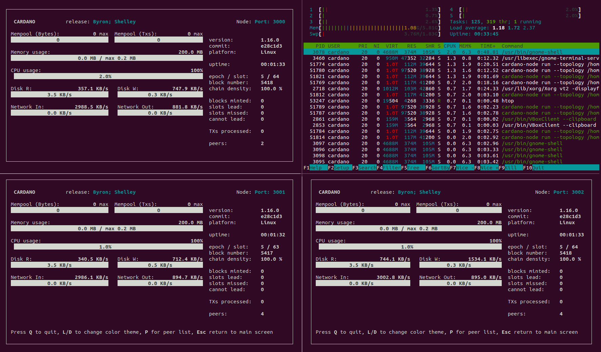
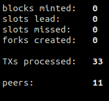
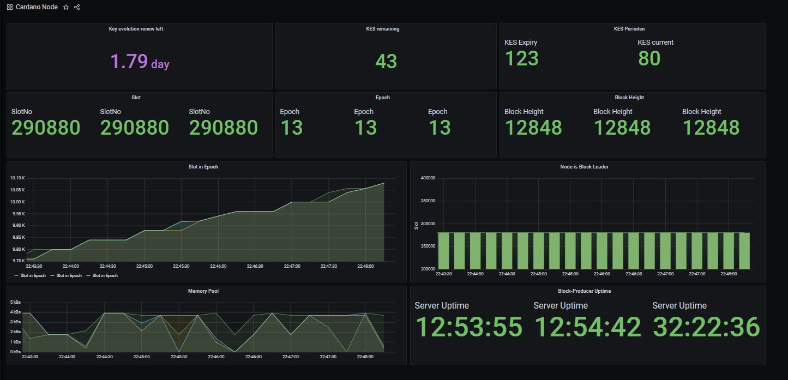

# Guide: How to build a Cardano Stake Pool


As of July 28, 2020, this guide is written for **mainnet** with **release v.1.18.0** 😁 


## 🏁 0. Prerequisites

### 🧙♂ Skills for stake pool operators

As a stake pool operator for Cardano, you will typically have the following abilities:

* operational knowledge of how to set up, run and maintain a Cardano node continuously
* a commitment to maintain your node 24/7/365
* system operation skills
* server administration skills \(operational and maintenance\).
* experience of development and operations \(DevOps\) would be very useful

### 🎗 Minimum Hardware Requirements

* **Operating system:** 64-bit Linux \(i.e. Ubuntu 20.04 LTS\)
* **Processor:** 6 core CPU
* **Memory:** 16GB RAM
* **Storage:** 100GB SSD
* **Internet:** 24/7 broadband internet connection with speeds at least 10 Mbps.
* **Data Plan**: at least 1GB per hour. 720GB per month.
* **Power:** 24/7 electrical power
* **ADA balance:** at least 1000 ADA

### 🏋♂ Recommended Futureproof Hardware Setup

* **Operating system:** 64-bit Linux \(i.e. Ubuntu 20.04 LTS\)
* **Processor:** 12 core or higher CPU
* **Memory:** 32GB+ RAM
* **Storage:** 2TB SSD with RAID
* **Internet:** Multiple 24/7 broadband internet connections with speeds at least 100 Mbps
* **Data Plan**: Unlimited
* **Power:** Redundant 24/7 electrical power with UPS
* **ADA balance:** more pledge is better, to be determined by **a0**, the pledge influence factor

For instructions on installing **Ubuntu**, refer to the following:



If you are rebuilding or reusing an existing `cardano-node` installation, [refer to section 15.2 on how to reset the installation.](./#15-2-resetting-the-installation)

## 🏭 1. Install Cabal and GHC

**Press** Ctrl+Alt+T. This will launch a terminal window. 

First, update packages and install Ubuntu dependencies.

```bash
sudo apt-get update -y
sudo apt-get upgrade -y
sudo apt-get install git make tmux rsync htop curl build-essential pkg-config libffi-dev libgmp-dev libssl-dev libtinfo-dev libsystemd-dev zlib1g-dev make g++ tmux git jq wget libncursesw5 libtool autoconf -y
```

Install Libsodium.

```bash
mkdir ~/git
cd ~/git
git clone https://github.com/input-output-hk/libsodium
cd libsodium
git checkout 66f017f1
./autogen.sh
./configure
make
sudo make install
```

Install Cabal.

```bash
cd
wget https://downloads.haskell.org/~cabal/cabal-install-3.2.0.0/cabal-install-3.2.0.0-x86_64-unknown-linux.tar.xz
tar -xf cabal-install-3.2.0.0-x86_64-unknown-linux.tar.xz
rm cabal-install-3.2.0.0-x86_64-unknown-linux.tar.xz cabal.sig
mkdir -p ~/.local/bin
mv cabal ~/.local/bin/
```

Install GHC.

```bash
wget https://downloads.haskell.org/~ghc/8.6.5/ghc-8.6.5-x86_64-deb9-linux.tar.xz
tar -xf ghc-8.6.5-x86_64-deb9-linux.tar.xz
rm ghc-8.6.5-x86_64-deb9-linux.tar.xz
cd ghc-8.6.5
./configure
sudo make install
```

Update PATH to include Cabal and GHC and add exports. Your node's location will be in **$NODE\_HOME**. The [cluster configuration](https://hydra.iohk.io/job/Cardano/iohk-nix/cardano-deployment/latest-finished/download/1/index.html) is set by **$NODE\_CONFIG, $NODE\_URL** and **$NODE\_BUILD\_NUM**. 

```bash
echo PATH="~/.local/bin:$PATH" >> ~/.bashrc
echo export LD_LIBRARY_PATH="/usr/local/lib:$LD_LIBRARY_PATH" >> ~/.bashrc
echo export NODE_HOME=$HOME/cardano-my-node >> ~/.bashrc
echo export NODE_CONFIG=mainnet>> ~/.bashrc
echo export NODE_URL=cardano-mainnet >> ~/.bashrc
echo export NODE_BUILD_NUM=$(curl https://hydra.iohk.io/job/Cardano/iohk-nix/cardano-deployment/latest-finished/download/1/index.html | grep -e "build" | sed 's/.*build\/\([0-9]*\)\/download.*/\1/g') >> ~/.bashrc
echo export NETWORK_IDENTIFIER=\"--mainnet\" >> ~/.bashrc
source ~/.bashrc
```

Update cabal and verify the correct versions were installed successfully.

```bash
cabal update
cabal -V
ghc -V
```


Cabal library should be version 3.2.0.0 and GHC should be version 8.6.5


## 🏗 2. Build the node from source code

Download source code and switch to the latest tag. In this case, use `tags/1.18.0`

```bash
cd ~/git
git clone https://github.com/input-output-hk/cardano-node.git
cd cardano-node
git fetch --all
git checkout tags/1.18.0
```

Update the cabal config, project settings, and reset build folder.

```bash
echo -e "package cardano-crypto-praos\n flags: -external-libsodium-vrf" > cabal.project.local
sed -i $HOME/.cabal/config -e "s/overwrite-policy:/overwrite-policy: always/g"
rm -rf $HOME/git/cardano-node/dist-newstyle/build/x86_64-linux/ghc-8.6.5
```

Build the cardano-node from source code.

```text
cabal build cardano-cli cardano-node
```


Building process may take a few minutes up to a few hours depending on your computer's processing power.


Copy **cardano-cli** and **cardano-node** files into bin directory.

```bash
sudo cp $(find ~/git/cardano-node/dist-newstyle/build -type f -name "cardano-cli") /usr/local/bin/cardano-cli
sudo cp $(find ~/git/cardano-node/dist-newstyle/build -type f -name "cardano-node") /usr/local/bin/cardano-node
```

Verify your **cardano-cli** and **cardano-node** are the expected versions.

```text
cardano-node version
cardano-cli version
```

## 📐 3. Configure the node

Here you'll grab the config.json, genesis.json, and topology.json files needed to configure your node.

```bash
mkdir $NODE_HOME
cd $NODE_HOME
wget -N https://hydra.iohk.io/build/${NODE_BUILD_NUM}/download/1/${NODE_CONFIG}-byron-genesis.json
wget -N https://hydra.iohk.io/build/${NODE_BUILD_NUM}/download/1/${NODE_CONFIG}-topology.json
wget -N https://hydra.iohk.io/build/${NODE_BUILD_NUM}/download/1/${NODE_CONFIG}-shelley-genesis.json
wget -N https://hydra.iohk.io/build/${NODE_BUILD_NUM}/download/1/${NODE_CONFIG}-config.json
```

Run the following to modify **config.json** and 

* update ViewMode to "LiveView"
* update TraceBlockFetchDecisions to "true"

```bash
sed -i ${NODE_CONFIG}-config.json \
    -e "s/SimpleView/LiveView/g" \
    -e "s/TraceBlockFetchDecisions\": false/TraceBlockFetchDecisions\": true/g"
```

Update **.bashrc** shell variables.

```bash
echo export CARDANO_NODE_SOCKET_PATH="$NODE_HOME/db/socket" >> ~/.bashrc
source ~/.bashrc
```

### 🔮 3.1 Configure the block-producer node and the relay nodes


A block producing node will be configured with various key-pairs needed for block generation \(cold keys, KES hot keys and VRF hot keys\). It can only connect to its relay nodes.



A relay node will not be in possession of any keys and will therefore be unable to produce blocks. It will be connected to its block-producing node, other relays and external nodes.



Setup the directory structure and copy the essential json files to each directory.

```bash
mkdir relaynode1
mkdir relaynode2
cp *.json relaynode1
cp *.json relaynode2
```

Configure **topology.json** file so that 

* only relay nodes connect to the public internet and your block-producing node
* the block-producing node can only connect to your relay nodes

Update relaynode1 with the following. Simply copy/paste.

```bash
cat > $NODE_HOME/relaynode1/${NODE_CONFIG}-topology.json << EOF 
 {
    "Producers": [
      {
        "addr": "127.0.0.1",
        "port": 3000,
        "valency": 2
      },
      {
        "addr": "127.0.0.1",
        "port": 3002,
        "valency": 2
      },
      {
        "addr": "relays-new.${NODE_URL}.iohk.io",
        "port": 3001,
        "valency": 2
      }
    ]
  }
EOF
```

Update relaynode2 with the following. Simply copy/paste.

```bash
cat > $NODE_HOME/relaynode2/${NODE_CONFIG}-topology.json << EOF 
 {
    "Producers": [
      {
        "addr": "127.0.0.1",
        "port": 3000,
        "valency": 2
      },
      {
        "addr": "127.0.0.1",
        "port": 3001,
        "valency": 2
      },
      {
        "addr": "relays-new.${NODE_URL}.iohk.io",
        "port": 3001,
        "valency": 2
      }
    ]
  }
EOF
```

Update the block-producer node with the following. Simply copy/paste.

```bash
cat > $NODE_HOME/${NODE_CONFIG}-topology.json << EOF 
 {
    "Producers": [
      {
        "addr": "127.0.0.1",
        "port": 3001,
        "valency": 2
      },
      {
        "addr": "127.0.0.1",
        "port": 3002,
        "valency": 2
      }
    ]
  }
EOF
```


Valency tells the node how many connections to keep open. Only DNS addresses are affected. If value is 0, the address is ignored.



\*\*\*\*✨ **Port Forwarding Tip:** You'll need to forward ports 3001 and 3002 to your computer. Check with [https://canyouseeme.org/](https://canyouseeme.org/)


## 🤖 4. Create startup scripts

The startup script contains all the variables needed to run a cardano-node such as directory, port, db path, config file, and topology file.

For your **block-producing node**:

```bash
cat > $NODE_HOME/startBlockProducingNode.sh << EOF 
DIRECTORY=\$NODE_HOME
PORT=3000
HOSTADDR=0.0.0.0
TOPOLOGY=\${DIRECTORY}/${NODE_CONFIG}-topology.json
DB_PATH=\${DIRECTORY}/db
SOCKET_PATH=\${DIRECTORY}/db/socket
CONFIG=\${DIRECTORY}/${NODE_CONFIG}-config.json
cardano-node run --topology \${TOPOLOGY} --database-path \${DB_PATH} --socket-path \${SOCKET_PATH} --host-addr \${HOSTADDR} --port \${PORT} --config \${CONFIG}
EOF
```

For your **relaynode1**:

```bash
cat > $NODE_HOME/relaynode1/startRelayNode1.sh << EOF 
DIRECTORY=\$NODE_HOME/relaynode1
PORT=3001
HOSTADDR=0.0.0.0
TOPOLOGY=\${DIRECTORY}/${NODE_CONFIG}-topology.json
DB_PATH=\${DIRECTORY}/db
SOCKET_PATH=\${DIRECTORY}/db/socket
CONFIG=\${DIRECTORY}/${NODE_CONFIG}-config.json
cardano-node run --topology \${TOPOLOGY} --database-path \${DB_PATH} --socket-path \${SOCKET_PATH} --host-addr \${HOSTADDR} --port \${PORT} --config \${CONFIG}
EOF
```

For your **relaynode2**:

```bash
cat > $NODE_HOME/relaynode2/startRelayNode2.sh << EOF 
DIRECTORY=\$NODE_HOME/relaynode2
PORT=3002
HOSTADDR=0.0.0.0
TOPOLOGY=\${DIRECTORY}/${NODE_CONFIG}-topology.json
DB_PATH=\${DIRECTORY}/db
SOCKET_PATH=\${DIRECTORY}/db/socket
CONFIG=\${DIRECTORY}/${NODE_CONFIG}-config.json
cardano-node run --topology \${TOPOLOGY} --database-path \${DB_PATH} --socket-path \${SOCKET_PATH} --host-addr \${HOSTADDR} --port \${PORT} --config \${CONFIG}
EOF
```

The **startStakePool.sh** script will automatically start your relays and block-producing node.

```bash
cat > $NODE_HOME/startStakePool.sh << EOF
#!/bin/bash
SESSION=$(whoami)
tmux has-session -t \$SESSION 2>/dev/null
if [ \$? != 0 ]; then
   # tmux attach-session -t \$SESSION
    tmux new-session -s \$SESSION -n window -d
    tmux split-window -v
    tmux split-window -h
    tmux select-pane -t \$SESSION:window.0
    tmux split-window -h
    tmux send-keys -t \$SESSION:window.0 $NODE_HOME/startBlockProducingNode.sh Enter
    tmux send-keys -t \$SESSION:window.1 htop Enter
    tmux send-keys -t \$SESSION:window.2 $NODE_HOME/relaynode1/startRelayNode1.sh Enter
    tmux send-keys -t \$SESSION:window.3 $NODE_HOME/relaynode2/startRelayNode2.sh Enter
    echo Stakepool started. \"tmux a\" to view.
fi
EOF
```

The **stopStakePool.sh** script will automatically stop your relays and block-producing node.

```bash
cat > $NODE_HOME/stopStakePool.sh << EOF
#!/bin/bash
SESSION=$(whoami)
tmux has-session -t \$SESSION 2>/dev/null
if [ \$? != 0 ]; then
        echo Stakepool not running.
else
        echo Stopped stakepool.
        tmux kill-session -t \$SESSION
fi
EOF
```

## ✅ 5. Start the node

**Press** Ctrl+Alt+T. This will launch a terminal window.

Add execute permissions to the script, start your stake pool, and begin syncing the blockchain!

```bash
cd $NODE_HOME
chmod +x startBlockProducingNode.sh
chmod +x relaynode1/startRelayNode1.sh
chmod +x relaynode2/startRelayNode2.sh
chmod +x startStakePool.sh
chmod +x stopStakePool.sh
./startStakePool.sh
```

Your stake pool is running in a **tmux** terminal session now. To attach to the terminal, run the following.

```text
tmux a
```


Smash the Maximize Window icon for best viewing effect.




To detach from a **tmux** session,

**Press** Ctrl+b+d.


✨ Tips for using **tmux** with the \[start\|stop\]StakePool.sh scripts.

* **Ctrl + b + arrow key** to navigate around panes
* **Ctrl + b + z** to zoom



Congratulations! Your node is running successfully now. Let it sync up.


## ⚙ 6. Generate block-producer keys

The block-producer node requires you to create 3 keys as defined in the [Shelley ledger specs](https://hydra.iohk.io/build/2473732/download/1/ledger-spec.pdf):

* stake pool cold key
* stake pool hot key \(KES key\)
* stake pool VRF key

First, make a KES key pair.

```bash
cd $NODE_HOME
cardano-cli shelley node key-gen-KES \
    --verification-key-file kes.vkey \
    --signing-key-file kes.skey
```


KES \(key evolving signature\) keys are created to secure your stake pool against hackers who might compromise your keys. On mainnet, these will be regenerated every 90 days.



**Cold keys** should be generated and stored on an unconnected air-gapped offline machine. Copy `cardano-cli` binary over and run the `node key-gen` commands. The cold keys are the files stored in `~/cold-keys.`


Make a directory to store your cold keys

```text
mkdir ~/cold-keys
pushd ~/cold-keys
```

Make a set of cold keys and create the cold counter file.

```bash
cardano-cli shelley node key-gen \
    --cold-verification-key-file node.vkey \
    --cold-signing-key-file node.skey \
    --operational-certificate-issue-counter node.counter
```


Be sure to **back up your all your keys** to another secure storage device. Make multiple copies.


Determine the number of slots per KES period from the genesis file.

```bash
pushd +1
slotsPerKESPeriod=$(cat $NODE_HOME/${NODE_CONFIG}-shelley-genesis.json | jq -r '.slotsPerKESPeriod')
echo slotsPerKESPeriod: ${slotsPerKESPeriod}
```


Before continuing, your node must be fully synchronized to the blockchain. Otherwise, you won't calculate the latest KES period. Your node is synchronized when the _epoch_ and _slot\#_ is equal to that found on a block explorer such as [https://pooltool.io/](https://pooltool.io/)


```bash
slotNo=$(cardano-cli shelley query tip $NETWORK_IDENTIFIER | jq -r '.slotNo')
echo slotNo: ${slotNo}
```

Find the kesPeriod by dividing the slot tip number by the slotsPerKESPeriod.

```bash
kesPeriod=$((${slotNo} / ${slotsPerKESPeriod}))
echo kesPeriod: ${kesPeriod}
```

With this calculation, you can generate a operational certificate for your pool.


Stake pool operators must provide an operational certificate to verify that the pool has the authority to run. The certificate includes the operator’s signature, and includes key information about the pool \(addresses, keys, etc.\). Operational certificates represent the link between the operator’s offline key and their operational key.


```bash
cardano-cli shelley node issue-op-cert \
    --kes-verification-key-file kes.vkey \
    --cold-signing-key-file ~/cold-keys/node.skey \
    --operational-certificate-issue-counter ~/cold-keys/node.counter \
    --kes-period $kesPeriod \
    --out-file node.cert
```

Make a VRF key pair.

```bash
cardano-cli shelley node key-gen-VRF \
    --verification-key-file vrf.vkey \
    --signing-key-file vrf.skey
```

Open a new terminal window with Ctrl+Alt+T and stop your ****stake pool by running the following:

```bash
cd $NODE_HOME
./stopStakePool.sh
```

Update your startup script with the new **KES, VRF and Operation Certificate.**

```bash
cat > $NODE_HOME/startBlockProducingNode.sh << EOF 
DIRECTORY=\$NODE_HOME
PORT=3000
HOSTADDR=0.0.0.0
TOPOLOGY=\${DIRECTORY}/${NODE_CONFIG}-topology.json
DB_PATH=\${DIRECTORY}/db
SOCKET_PATH=\${DIRECTORY}/db/socket
CONFIG=\${DIRECTORY}/${NODE_CONFIG}-config.json
KES=\${DIRECTORY}/kes.skey
VRF=\${DIRECTORY}/vrf.skey
CERT=\${DIRECTORY}/node.cert
cardano-node run --topology \${TOPOLOGY} --database-path \${DB_PATH} --socket-path \${SOCKET_PATH} --host-addr \${HOSTADDR} --port \${PORT} --config \${CONFIG} --shelley-kes-key \${KES} --shelley-vrf-key \${VRF} --shelley-operational-certificate \${CERT}
EOF
```


To operate a stake pool, two sets of keys are needed: they KES key \(hot\) and the cold key. Cold keys generate new hot keys periodically.


Now start your stake pool.

```bash
cd $NODE_HOME
./startStakePool.sh
tmux a
```

## 🔐 7. Setup payment and staking keys

First, obtain the protocol-parameters.


Wait for the block-producing node to start syncing before continuing if you get this error message.

`cardano-cli: Network.Socket.connect: : does not exist (No such file or directory)`


```bash
cardano-cli shelley query protocol-parameters \
    $NETWORK_IDENTIFIER \
    --out-file params.json
```


Payment keys are used to send and receive payments and staking keys are used to manage stake delegations.


There are two ways to create your `payment` and `stake` key pair. Pick the one that best suits your needs.



Create a new payment key pair:  `payment.skey` & `payment.vkey`

```text
cardano-cli shelley address key-gen \
    --verification-key-file payment.vkey \
    --signing-key-file payment.skey
```

 Create a new stake address key pair: `stake.skey` & `stake.vkey`

```text
cardano-cli shelley stake-address key-gen \
    --verification-key-file stake.vkey \
    --signing-key-file stake.skey
```

Create your stake address from the stake address verification key and store it in `stake.addr`

```text
cardano-cli shelley stake-address build \
    --staking-verification-key-file stake.vkey \
    --out-file stake.addr \
    --mainnet
```

Build a payment address for the payment key `payment.vkey` which will delegate to the stake address, `stake.vkey`

```text
cardano-cli shelley address build \
    --payment-verification-key-file payment.vkey \
    --staking-verification-key-file stake.vkey \
    --out-file payment.addr \
    --mainnet
```




Credits to [ilap](https://gist.github.com/ilap/3fd57e39520c90f084d25b0ef2b96894) for creating this process.



**Benefits**: Track and control pool rewards from any wallet \(Daedalus, Yoroi or any other wallet\) that support stakings.


Create a 15-word or 24-word length shelley compatible mnemonic with [Daedalus](https://daedaluswallet.io/) or [Yoroi](../../../wallets/browser-wallets/yoroi-wallet-cardano.md) on a offline machine preferred.

Download `cardano-wallet`.

```bash
cd $NODE_HOME
wget https://hydra.iohk.io/build/3662127/download/1/cardano-wallet-shelley-2020.7.28-linux64.tar.gz
```

Verify the legitimacy of `cardano-wallet` by checking the [sha256 hash found in the **Details** button.](https://hydra.iohk.io/build/3662127/)

```bash
echo "f75e5b2b4cc5f373d6b1c1235818bcab696d86232cb2c5905b2d91b4805bae84 *cardano-wallet-shelley-2020.7.28-linux64.tar.gz" | shasum -a 256 --check
```

Example valid output:

> cardano-wallet-shelley-2020.7.28-linux64.tar.gz: OK


Only proceed if the sha256 check passes with **OK**!


Extract the wallet files and cleanup.

```bash
tar -xvf cardano-wallet-shelley-2020.7.28-linux64.tar.gz
rm cardano-wallet-shelley-2020.7.28-linux64.tar.gz
```

Create`extractPoolStakingKeys.sh` script.

```bash
cat > extractPoolStakingKeys.sh << HERE
#!/bin/bash 

CADDR=\${CADDR:=\$( which cardano-address )}
[[ -z "\$CADDR" ]] && ( echo "cardano-address cannot be found, exiting..." >&2 ; exit 127 )

CCLI=\${CCLI:=\$( which cardano-cli )}
[[ -z "\$CCLI" ]] && ( echo "cardano-cli cannot be found, exiting..." >&2 ; exit 127 )

OUT_DIR="\$1"
[[ -e "\$OUT_DIR"  ]] && {
       	echo "The \"\$OUT_DIR\" is already exist delete and run again." >&2 
       	exit 127
} || mkdir -p "\$OUT_DIR" && pushd "\$OUT_DIR" >/dev/null

shift
MNEMONIC="\$*"

# Generate the master key from mnemonics and derive the stake account keys 
# as extended private and public keys (xpub, xprv)
echo "\$MNEMONIC" |\
"\$CADDR" key from-recovery-phrase Shelley > root.prv

cat root.prv |\
"\$CADDR" key child 1852H/1815H/0H/2/0 > stake.xprv

cat root.prv |\
"\$CADDR" key child 1852H/1815H/0H/0/0 > payment.xprv

TESTNET=0
MAINNET=1
NETWORK=\$MAINNET

cat payment.xprv |\
"\$CADDR" key public | tee payment.xpub |\
"\$CADDR" address payment --network-tag \$NETWORK |\
"\$CADDR" address delegation \$(cat stake.xprv | "\$CADDR" key public | tee stake.xpub) |\
tee base.addr_candidate |\
"\$CADDR" address inspect
echo "Generated from 1852H/1815H/0H/{0,2}/0"
cat base.addr_candidate
echo

# XPrv/XPub conversion to normal private and public key, keep in mind the 
# keypars are not a valind Ed25519 signing keypairs.
TESTNET_MAGIC="--testnet-magic 42"
MAINNET_MAGIC="--mainnet"
MAGIC="\$MAINNET_MAGIC"

SESKEY=\$( cat stake.xprv | bech32 | cut -b -128 )\$( cat stake.xpub | bech32)
PESKEY=\$( cat payment.xprv | bech32 | cut -b -128 )\$( cat payment.xpub | bech32)

cat << EOF > stake.skey
{
    "type": "StakeExtendedSigningKeyShelley_ed25519_bip32",
    "description": "",
    "cborHex": "5880\$SESKEY"
}
EOF

cat << EOF > payment.skey
{
    "type": "PaymentExtendedSigningKeyShelley_ed25519_bip32",
    "description": "Payment Signing Key",
    "cborHex": "5880\$PESKEY"
}
EOF

"\$CCLI" shelley key verification-key --signing-key-file stake.skey --verification-key-file stake.evkey
"\$CCLI" shelley key verification-key --signing-key-file payment.skey --verification-key-file payment.evkey

"\$CCLI" shelley key non-extended-key --extended-verification-key-file payment.evkey --verification-key-file payment.vkey
"\$CCLI" shelley key non-extended-key --extended-verification-key-file stake.evkey --verification-key-file stake.vkey


"\$CCLI" shelley stake-address build --stake-verification-key-file stake.vkey \$MAGIC > stake.addr
"\$CCLI" shelley address build --payment-verification-key-file payment.vkey \$MAGIC > payment.addr
"\$CCLI" shelley address build \
    --payment-verification-key-file payment.vkey \
    --stake-verification-key-file stake.vkey \
    \$MAGIC > base.addr

echo "Important the base.addr and the base.addr_candidate must be the same"
diff base.addr base.addr_candidate
popd >/dev/null
HERE
```

Add permissions and update PATH.

```bash
chmod +x extractPoolStakingKeys.sh
echo PATH="$(pwd)/cardano-wallet-shelley-2020.7.28:$PATH" >> ~/.bashrc
source ~/.bashrc
```

Extract your keys. Update the command with your mnemonic phrase.

```bash
./extractPoolStakingKeys.sh extractedPoolKeys/ <15|24-word length mnemonic>
```


Important the base.addr and the base.addr\_candidate must be the same. Review the screen output. **Base.addr is the payment address to be funded.**


Your new staking keys are in the folder `extractedPoolKeys/`

Now move `payment/stake` key pair over to your `$NODE_HOME` for use with your stake pool.

```bash
cd extractedPoolKeys/
cp stake.vkey stake.skey stake.addr payment.vkey payment.skey base.addr $NODE_HOME
cd $NODE_HOME
#Rename to base.addr file to payment.addr
mv base.addr payment.addr
```

Clear the bash history in order to protect your mnemonic phrase.

```text
history -c && history -w
```

Finally close all your terminal windows and open new ones with zero history.


Awesome. Now you can track your pool rewards in your wallet.




Next step is to fund your payment address. 



Payment address can be funded from

* your Daedalus / Yoroi wallet
* if you were part of the ITN, you can convert your keys.

Run the following to find your payment address.

```text
cat payment.addr
```



Payment address can be funded from

* [Public testnet faucet](https://testnets.cardano.org/en/shelley/tools/faucet/)
* your Byron mainnet funds based on a snapshot from 07/20 00:00 UTC. 
* if you were part of the ITN, you can convert your address as specified above. 

Run the following to find your payment address.

```text
cat payment.addr
```



Visit the [faucet ](https://testnets.cardano.org/en/shelley/tools/faucet/)to request funds to your `payment.addr`

 Run the following to find your address.

```text
cat payment.addr
```

Paste this address and fill out the captcha.


The Shelly Testnet Faucet can deliver up to 100,000 fADA every 24 hours.




After funding your account, check your payment address balance.


Before continuing, your nodes must be fully synchronized to the blockchain. Otherwise, you won't see your funds.


```bash
cardano-cli shelley query utxo \
    --address $(cat payment.addr) \
    $NETWORK_IDENTIFIER
```

You should see output similar to this. This is your unspent transaction output \(UXTO\).

```text
                           TxHash                                 TxIx        Lovelace
----------------------------------------------------------------------------------------
100322a39d02c2ead....                                              0        1000000000
```

## 👩💻 8. Register your stake address

Create a certificate, `stake.cert`, using the `stake.vkey`

```text
cardano-cli shelley stake-address registration-certificate \
    --staking-verification-key-file stake.vkey \
    --out-file stake.cert
```

You need to find the **tip** of the blockchain to set the **ttl** parameter properly.

```bash
currentSlot=$(cardano-cli shelley query tip $NETWORK_IDENTIFIER | jq -r '.slotNo')
echo Current Slot: $currentSlot
```

Find your balance and **UTXOs**.

```bash
cardano-cli shelley query utxo \
    --address $(cat payment.addr) \
    $NETWORK_IDENTIFIER > fullUtxo.out

tail -n +3 fullUtxo.out | sort -k3 -nr > balance.out

cat balance.out

tx_in=""
total_balance=0
while read -r utxo; do
    in_addr=$(awk '{ print $1 }' <<< "${utxo}")
    idx=$(awk '{ print $2 }' <<< "${utxo}")
    utxo_balance=$(awk '{ print $3 }' <<< "${utxo}")
    total_balance=$((${total_balance}+${utxo_balance}))
    echo TxHash: ${in_addr}#${idx}
    echo ADA: ${utxo_balance}
    tx_in="${tx_in} --tx-in ${in_addr}#${idx}"
done < balance.out
txcnt=$(cat balance.out | wc -l)
echo Total ADA balance: ${total_balance}
echo Number of UTXOs: ${txcnt}
```

Find the keyDeposit value.

```bash
keyDeposit=$(cat $NODE_HOME/params.json | jq -r '.keyDeposit')
echo keyDeposit: $keyDeposit
```


Registration of a stake address certificate \(keyDeposit\) costs 2000000 lovelace.


Run the build-raw transaction command


The **ttl** value must be greater than the current tip. In this example, we use current slot + 10000.


```bash
cardano-cli shelley transaction build-raw \
    ${tx_in} \
    --tx-out $(cat payment.addr)+0 \
    --ttl $(( ${currentSlot} + 10000)) \
    --fee 0 \
    --out-file tx.tmp \
    --certificate stake.cert
```

Calculate the current minimum fee:

```bash
fee=$(cardano-cli shelley transaction calculate-min-fee \
    --tx-body-file tx.tmp \
    --tx-in-count ${txcnt} \
    --tx-out-count 1 \
    $NETWORK_IDENTIFIER \
    --witness-count 2 \
    --byron-witness-count 0 \
    --protocol-params-file params.json | awk '{ print $1 }')
echo fee: $fee
```


Ensure your balance is greater than cost of fee + keyDeposit or this will not work.


Calculate your change output.

```bash
txOut=$((${total_balance}-${keyDeposit}-${fee}))
echo Change Output: ${txOut}
```

Build your transaction which will register your stake address.

```bash
cardano-cli shelley transaction build-raw \
    ${tx_in} \
    --tx-out $(cat payment.addr)+${txOut} \
    --ttl $(( ${currentSlot} + 10000)) \
    --fee ${fee} \
    --certificate-file stake.cert \
    --out-file tx.raw
```

Sign the transaction with both the payment and stake secret keys.

```bash
cardano-cli shelley transaction sign \
    --tx-body-file tx.raw \
    --signing-key-file payment.skey \
    --signing-key-file stake.skey \
    $NETWORK_IDENTIFIER \
    --out-file tx.signed
```

Send the signed transaction.

```bash
cardano-cli shelley transaction submit \
    --tx-file tx.signed \
    $NETWORK_IDENTIFIER
```

## 📄 9. Register your stake pool

Create your pool's metadata with a JSON file. Update with your pool information.


**ticker** must be between 3-5 characters in length.



**description** cannot exceed 255 characters in length.


```bash
cat > poolMetaData.json << EOF
{
"name": "MyPoolName",
"description": "My pool description",
"ticker": "MPN",
"homepage": "https://myadapoolnamerocks.com"
}
EOF
```

Calculate the hash of your metadata file.

```bash
cardano-cli shelley stake-pool metadata-hash --pool-metadata-file poolMetaData.json > poolMetaDataHash.txt
```

Now upload your **poolMetaData.json** to your website or a public website such as [https://pages.github.com/](https://pages.github.com/)

Refer to the following quick guide if you need help hosting your metadata on github.com



Find the minimum pool cost.

```bash
minPoolCost=$(cat $NODE_HOME/params.json | jq -r .minPoolCost)
echo minPoolCost: ${minPoolCost}
```


minPoolCost is 340000000 lovelace or 340 ADA. Therefore, your `--pool-cost` must be at a minimum this amount.


Create a registration certificate for your stake pool. Update with your **metadata URL** and **relay IP address**.


**metadata-url** must be no longer than 64 characters.


```bash
cardano-cli shelley stake-pool registration-certificate \
    --cold-verification-key-file ~/cold-keys/node.vkey \
    --vrf-verification-key-file vrf.vkey \
    --pool-pledge 100000000 \
    --pool-cost 345000000 \
    --pool-margin 0.15 \
    --pool-reward-account-verification-key-file stake.vkey \
    --pool-owner-stake-verification-key-file stake.vkey \
    $NETWORK_IDENTIFIER \
    --pool-relay-port 3001 \
    --pool-relay-ipv4 <your relay IP address> \
    --metadata-url <url where you uploaded poolMetaData.json> \
    --metadata-hash $(cat poolMetaDataHash.txt) \
    --out-file pool.cert
```


Here we are pledging 100 ADA with a fixed pool cost of 345 ADA and a pool margin of 15%. 


Pledge stake to your stake pool.

```bash
cardano-cli shelley stake-address delegation-certificate \
    --staking-verification-key-file stake.vkey \
    --cold-verification-key-file ~/cold-keys/node.vkey \
    --out-file deleg.cert
```


This creates a delegation certificate which delegates funds from all stake addresses associated with key `stake.vkey` to the pool belonging to cold key `node.vkey`



A stake pool owner's promise to fund their own pool is called **Pledge**.

* Your balance needs to be greater than the pledge amount.
* You pledge funds are not moved anywhere. In this guide's example, the pledge remains in the stake pool's owner keys, specifically `payment.addr`
* Failing to fulfill pledge will result in missed block minting opportunities and your delegators would miss rewards. 
* Your pledge is not locked up. You are free to transfer your funds.


You need to find the **tip** of the blockchain to set the **ttl** parameter properly.

```bash
currentSlot=$(cardano-cli shelley query tip $NETWORK_IDENTIFIER | jq -r '.slotNo')
echo Current Slot: $currentSlot
```

Find your balance and **UTXOs**.

```bash
cardano-cli shelley query utxo \
    --address $(cat payment.addr) \
    $NETWORK_IDENTIFIER > fullUtxo.out

tail -n +3 fullUtxo.out | sort -k3 -nr > balance.out

cat balance.out

tx_in=""
total_balance=0
while read -r utxo; do
    in_addr=$(awk '{ print $1 }' <<< "${utxo}")
    idx=$(awk '{ print $2 }' <<< "${utxo}")
    utxo_balance=$(awk '{ print $3 }' <<< "${utxo}")
    total_balance=$((${total_balance}+${utxo_balance}))
    echo TxHash: ${in_addr}#${idx}
    echo ADA: ${utxo_balance}
    tx_in="${tx_in} --tx-in ${in_addr}#${idx}"
done < balance.out
txcnt=$(cat balance.out | wc -l)
echo Total ADA balance: ${total_balance}
echo Number of UTXOs: ${txcnt}
```

Find the deposit fee for a pool.

```bash
poolDeposit=$(cat $NODE_HOME/params.json | jq -r '.poolDeposit')
echo poolDeposit: $poolDeposit
```

Run the build-raw transaction command.


The **ttl** value must be greater than the current tip. In this example, we use current slot + 10000. 


```bash
cardano-cli shelley transaction build-raw \
    ${tx_in} \
    --tx-out $(cat payment.addr)+$(( ${total_balance} - ${poolDeposit}))  \
    --ttl $(( ${currentSlot} + 10000)) \
    --fee 0 \
    --certificate-file pool.cert \
    --certificate-file deleg.cert \
    --out-file tx.tmp
```

Calculate the minimum fee:

```bash
fee=$(cardano-cli shelley transaction calculate-min-fee \
    --tx-body-file tx.tmp \
    --tx-in-count ${txcnt} \
    --tx-out-count 1 \
    $NETWORK_IDENTIFIER \
    --witness-count 3 \
    --byron-witness-count 0 \
    --protocol-params-file params.json | awk '{ print $1 }')
echo fee: $fee
```


Ensure your balance is greater than cost of fee + minPoolCost or this will not work.


Calculate your change output.

```bash
txOut=$((${total_balance}-${poolDeposit}-${fee}))
echo txOut: ${txOut}
```

Build the transaction.

```bash
cardano-cli shelley transaction build-raw \
    ${tx_in} \
    --tx-out $(cat payment.addr)+${txOut} \
    --ttl $(( ${currentSlot} + 10000)) \
    --fee ${fee} \
    --certificate-file pool.cert \
    --certificate-file deleg.cert \
    --out-file tx.raw
```

Sign the transaction.

```bash
cardano-cli shelley transaction sign \
    --tx-body-file tx.raw \
    --signing-key-file payment.skey \
    --signing-key-file ~/cold-keys/node.skey \
    --signing-key-file stake.skey \
    $NETWORK_IDENTIFIER \
    --out-file tx.signed
```

Send the transaction.

```bash
cardano-cli shelley transaction submit \
    --tx-file tx.signed \
    $NETWORK_IDENTIFIER
```

## 🐣 10. Locate your Stake pool ID and verify everything is working 

Your stake pool ID can be computed with:

```bash
cardano-cli shelley stake-pool id --verification-key-file ~/cold-keys/node.vkey > stakepoolid.txt
cat stakepoolid.txt
```

Now that you have your stake pool ID,  verify it's included in the blockchain.

```bash
cardano-cli shelley query ledger-state $NETWORK_IDENTIFIER | grep publicKey | grep $(cat stakepoolid.txt)
```


A non-empty string return means you're registered! 👏 


With your stake pool ID, now you can find your data on block explorers such as [https://pooltool.io/](https://pooltool.io/)

## ⚙ 11. Configure your topology files


Shelley testnet has been launched without peer-to-peer \(p2p\) node discovery so that means we will need to manually add trusted nodes in order to configure our topology. This is a **critical step** as skipping this step will result in your minted blocks being orphaned by the rest of the network.


There are two ways to configure your topology files. 

* **topologyUpdate.sh method** is automated and works after 4 hours. 
* **Pooltool.io method** gives you control over who your nodes connect to.



### 🚀 Publishing your Relay Node with topologyUpdater.sh


Credits to [GROWPOOL](https://twitter.com/PoolGrow) for this addition and credits to [CNTOOLS Guild OPS](https://cardano-community.github.io/guild-operators/Scripts/topologyupdater.html) on creating this process.


Create the `topologyUpdater.sh` script which publishes your node information to a topology fetch list.

```bash
cat > $NODE_HOME/topologyUpdater.sh << EOF
#!/bin/bash
# shellcheck disable=SC2086,SC2034
 
USERNAME=$(whoami)
CNODE_PORT=3001  # must match your relay node port as set in the startup command
CNODE_HOSTNAME="CHANGE ME"  # optional. must resolve to the IP you are requesting from
CNODE_BIN="/usr/local/bin"
CNODE_HOME=$NODE_HOME
CNODE_LOG_DIR="\${CNODE_HOME}/logs"
GENESIS_JSON="\${CNODE_HOME}/${NODE_CONFIG}-shelley-genesis.json"
NETWORKID=\$(jq -r .networkId \$GENESIS_JSON)
CNODE_VALENCY=1   # optional for multi-IP hostnames
NWMAGIC=\$(jq -r .networkMagic < \$GENESIS_JSON)
[[ "\${NETWORKID}" = "Mainnet" ]] && HASH_IDENTIFIER="--mainnet" || HASH_IDENTIFIER="--testnet-magic \${NWMAGIC}"
[[ "\${NWMAGIC}" = "764824073" ]] && NETWORK_IDENTIFIER="--mainnet" || NETWORK_IDENTIFIER="--testnet-magic \${NWMAGIC}"
 
export PATH="\${CNODE_BIN}:\${PATH}"
export CARDANO_NODE_SOCKET_PATH="\${CNODE_HOME}/db/socket"
 
blockNo=\$(cardano-cli shelley query tip \${NETWORK_IDENTIFIER} | jq -r .blockNo )
 
# Note:
# if you run your node in IPv4/IPv6 dual stack network configuration and want announced the
# IPv4 address only please add the -4 parameter to the curl command below  (curl -4 -s ...)
if [ "\${CNODE_HOSTNAME}" != "CHANGE ME" ]; then
  T_HOSTNAME="&hostname=\${CNODE_HOSTNAME}"
else
  T_HOSTNAME=''
fi

if [ ! -d \${CNODE_LOG_DIR} ]; then
  mkdir -p \${CNODE_LOG_DIR};
fi
 
curl -s "https://api.clio.one/htopology/v1/?port=\${CNODE_PORT}&blockNo=\${blockNo}&valency=\${CNODE_VALENCY}&magic=\${NWMAGIC}\${T_HOSTNAME}" | tee -a \$CNODE_LOG_DIR/topologyUpdater_lastresult.json
EOF
```

Add permissions and run the updater script.

```bash
cd $NODE_HOME
chmod +x topologyUpdater.sh
./topologyUpdater.sh
```

When the `topologyUpdater.sh` runs successfully, you will see 

> `{ "resultcode": "201", "datetime":"2020-07-28 01:23:45", "clientIp": "1.2.3.4", "iptype": 4, "msg": "nice to meet you" }`


Every time the script runs and updates your IP, a log is created in **`$NODE_HOME/logs`**


Add a crontab job to automatically run `topologyUpdater.sh` every hour on the 22nd minute. You can change the 22 value to your own preference.

```bash
cat > $NODE_HOME/crontab-fragment.txt << EOF
22 * * * * ${NODE_HOME}/topologyUpdater.sh
EOF
crontab -l | cat - crontab-fragment.txt >crontab.txt && crontab crontab.txt
rm crontab-fragment.txt
```


After four hours and four updates, your node IP will be registered in the topology fetch list.


### 🤹♀ Update your relay node topology files


Complete this section after **four hours** when your relay node IP is properly registered.


Create `relay-topology_pull.sh` script which fetches your relay node buddies and updates your topology file.

```bash
cat > $NODE_HOME/relay-topology_pull.sh << EOF
#!/bin/bash
BLOCKPRODUCING_IP=127.0.0.1
BLOCKPRODUCING_PORT=3000
RELAYNODE1_IP=127.0.0.1
RELAYNODE1_PORT=3001
RELAYNODE2_IP=127.0.0.1
RELAYNODE2_PORT=3002
curl -s -o $NODE_HOME/relaynode1/${NODE_CONFIG}-topology.json "https://api.clio.one/htopology/v1/fetch/?max=20&customPeers=\${BLOCKPRODUCING_IP}:\${BLOCKPRODUCING_PORT}:2|\${RELAYNODE1_IP}:\${RELAYNODE1_PORT}|relays-new.${NODE_URL}.iohk.io:3001:2|\${RELAYNODE2_IP}:\${RELAYNODE2_PORT}"
cp $NODE_HOME/relaynode1/${NODE_CONFIG}-topology.json $NODE_HOME/relaynode2/${NODE_CONFIG}-topology.json
EOF
```

Add permissions and pull new topology files.

```text
chmod +x relay-topology_pull.sh
./relay-topology_pull.sh
```

The new topology takes after after restarting your stake pool.

```text
./stopStakePool.sh
./startStakePool.sh
tmux a
```


Don't forget to restart your nodes after every time you fetch the topology!




1. Visit [https://htn.pooltool.io/](https://htn.pooltool.io/)
2. Create an account and login
3. Search for your stakepool id
4. Click ➡ **Pool Details** &gt; **Manage** &gt; **CLAIM THIS POOL**
5. Fill in your pool name and pool URL if you have one.
6. Fill in your **Private Nodes** and **Your Relays** as follows.



You can find your public IP with [https://www.whatismyip.com/](https://www.whatismyip.com/) or

```text
curl http://ifconfig.me/ip
```


Add requests for nodes or "buddies" to each of your relay nodes. Make sure you include the IOHK node and your private nodes.

IOHK's node address is:

```text
relays-new.cardano-mainnet.iohk.io
```

IOHK's node port is:

```text
3001
```

For example, on relaynode1's buddies you should add **requests** for

* your private BlockProducingNode
* your private RelayNode2
* IOHK's node
* and any other buddy/friendly nodes your can find or know

For example, on relaynode2's buddies you should add **requests** for

* your private BlockProducingNode
* your private RelayNode1
* IOHK's node
* and any other buddy/friendly nodes your can find or know


A relay node connection is not established until there is a request and an approval.


For relaynode1, create a get\_buddies.sh script to update your topology.json file.

```bash
cat > $NODE_HOME/relaynode1/get_buddies.sh << EOF 
#!/usr/bin/env bash

# YOU CAN PASS THESE STRINGS AS ENVIRONMENTAL VARIABLES, OR EDIT THEM IN THE SCRIPT HERE
if [ -z "\$PT_MY_POOL_ID" ]; then
## CHANGE THESE TO SUIT YOUR POOL TO YOUR POOL ID AS ON THE EXPLORER
PT_MY_POOL_ID="XXXXXXXX"
fi

if [ -z "\$PT_MY_API_KEY" ]; then
## GET THIS FROM YOUR ACCOUNT PROFILE PAGE ON POOLTOOL WEBSITE
PT_MY_API_KEY="XXXXXXXX"
fi

if [ -z "\$PT_MY_NODE_ID" ]; then
## GET THIS FROM YOUR POOL MANAGE TAB ON POOLTOOL WEBSITE
PT_MY_NODE_ID="XXXXXXXX"
fi

if [ -z "\$PT_TOPOLOGY_FILE" ]; then
## SET THIS TO THE LOCATION OF YOUR TOPOLOGY FILE THAT YOUR NODE USES
PT_TOPOLOGY_FILE="$NODE_HOME/relaynode1/${NODE_CONFIG}-topology.json"
fi

JSON="\$(jq -n --compact-output --arg MY_API_KEY "\$PT_MY_API_KEY" --arg MY_POOL_ID "\$PT_MY_POOL_ID" --arg MY_NODE_ID "\$PT_MY_NODE_ID" '{apiKey: \$MY_API_KEY, nodeId: \$MY_NODE_ID, poolId: \$MY_POOL_ID}')"
echo "Packet Sent: \$JSON"
RESPONSE="\$(curl -s -H "Accept: application/json" -H "Content-Type:application/json" -X POST --data "\$JSON" "https://api.pooltool.io/v0/getbuddies")"
SUCCESS="\$(echo \$RESPONSE | jq '.success')"
if [ \$SUCCESS ]; then
  echo "Success"
  echo \$RESPONSE | jq '. | {Producers: .message}' > \$PT_TOPOLOGY_FILE
  echo "Topology saved to \$PT_TOPOLOGY_FILE.  Note topology will only take effect next time you restart your node"
else
  echo "Failure "
  echo \$RESPONSE | jq '.message'
fi
EOF
```

For relaynode2, create a get\_buddies.sh script to update your topology.json file.

```bash
cat > $NODE_HOME/relaynode2/get_buddies.sh << EOF 
#!/usr/bin/env bash

# YOU CAN PASS THESE STRINGS AS ENVIRONMENTAL VARIABLES, OR EDIT THEM IN THE SCRIPT HERE
if [ -z "\$PT_MY_POOL_ID" ]; then
## CHANGE THESE TO SUIT YOUR POOL TO YOUR POOL ID AS ON THE EXPLORER
PT_MY_POOL_ID="XXXXXXXX"
fi

if [ -z "\$PT_MY_API_KEY" ]; then
## GET THIS FROM YOUR ACCOUNT PROFILE PAGE ON POOLTOOL WEBSITE
PT_MY_API_KEY="XXXXXXXX"
fi

if [ -z "\$PT_MY_NODE_ID" ]; then
## GET THIS FROM YOUR POOL MANAGE TAB ON POOLTOOL WEBSITE
PT_MY_NODE_ID="XXXXXXXX"
fi

if [ -z "\$PT_TOPOLOGY_FILE" ]; then
## SET THIS TO THE LOCATION OF YOUR TOPOLOGY FILE THAT YOUR NODE USES
PT_TOPOLOGY_FILE="$NODE_HOME/relaynode2/${NODE_CONFIG}-topology.json"
fi

JSON="\$(jq -n --compact-output --arg MY_API_KEY "\$PT_MY_API_KEY" --arg MY_POOL_ID "\$PT_MY_POOL_ID" --arg MY_NODE_ID "\$PT_MY_NODE_ID" '{apiKey: \$MY_API_KEY, nodeId: \$MY_NODE_ID, poolId: \$MY_POOL_ID}')"
echo "Packet Sent: \$JSON"
RESPONSE="\$(curl -s -H "Accept: application/json" -H "Content-Type:application/json" -X POST --data "\$JSON" "https://api.pooltool.io/v0/getbuddies")"
SUCCESS="\$(echo \$RESPONSE | jq '.success')"
if [ \$SUCCESS ]; then
  echo "Success"
  echo \$RESPONSE | jq '. | {Producers: .message}' > \$PT_TOPOLOGY_FILE
  echo "Topology saved to \$PT_TOPOLOGY_FILE.  Note topology will only take effect next time you restart your node"
else
  echo "Failure "
  echo \$RESPONSE | jq '.message'
fi
EOF
```

For each of your relay nodes, update the following variables from pooltool.io into your get\_buddies.sh file

* PT\_MY\_POOL\_ID 
* PT\_MY\_API\_KEY 
* PT\_MY\_NODE\_ID

Update your get\_buddies.sh scripts with this information.


Use **nano** to edit your files. 

`nano $NODE_HOME/relaynode1/get_buddies.sh`

`nano $NODE_HOME/relaynode2/get_buddies.sh`


Add execute permissions to these scripts. Run the scripts to update your topology files.

```bash
cd $NODE_HOME
chmod +x relaynode1/get_buddies.sh
chmod +x relaynode2/get_buddies.sh
./relaynode1/get_buddies.sh
./relaynode2/get_buddies.sh
```

Stop and then restart your stakepool in order for the new topology settings to take effect.

```text
./stopStakePool.sh
./startStakePool.sh
tmux a
```


As your REQUESTS are approved, you must re-run the get\_buddies.sh script to pull the latest topology data. Restart your relay nodes afterwards.





\*\*\*\*🔥 **Critical step:** In order to be a functional stake pool ready to mint blocks, you must see the **TXs processed** number increasing. If not, review your topology file and ensure your relay buddies are well connected and ideally, minted some blocks.





Congratulations! Your stake pool is registered and ready to produce blocks.


## 🎇 12. Checking Stake pool Rewards

After the epoch is over and assuming you successfully minted blocks, check with this:

```bash
cardano-cli shelley query stake-address-info \
 --address $(cat stake.addr) \
 $NETWORK_IDENTIFIER
```

## 🔮 13. Setup Prometheus and Grafana Dashboard

Prometheus is a monitoring platform that collects metrics from monitored targets by scraping metrics HTTP endpoints on these targets. [Official documentation is available here.](https://prometheus.io/docs/introduction/overview/) Grafana is a dashboard used to visualize the collected data.

###  🐣 13.1 Installation

Install prometheus and prometheus node exporter.

```bash
sudo apt-get install -y prometheus prometheus-alertmanager prometheus-node-exporter 
```

Install grafana.

```bash
wget -q -O - https://packages.grafana.com/gpg.key | sudo apt-key add -
```

```bash
echo "deb https://packages.grafana.com/oss/deb stable main" > grafana.list
sudo mv grafana.list /etc/apt/sources.list.d/grafana.list
```

```bash
sudo apt-get update && sudo apt-get install -y grafana
```

Change the default port of Grafana from 3000 to 30000


Port 3000 is used by the block-producing node.


```bash
cd /etc/grafana
sudo sed -i grafana.ini -e "s/;http_port = 3000/http_port = 30000/g"
```

Enable services so they start automatically.

```bash
sudo systemctl enable grafana-server.service
sudo systemctl enable prometheus.service
sudo systemctl enable prometheus-node-exporter.service
```

Update prometheus.yml located in `/etc/prometheus/prometheus.yml`

```bash
cat > prometheus.yml << EOF
global:
  scrape_interval:     15s # By default, scrape targets every 15 seconds.

  # Attach these labels to any time series or alerts when communicating with
  # external systems (federation, remote storage, Alertmanager).
  external_labels:
    monitor: 'codelab-monitor'

# A scrape configuration containing exactly one endpoint to scrape:
# Here it's Prometheus itself.
scrape_configs:
  # The job name is added as a label job=<job_name> to any timeseries scraped from this config.
  - job_name: 'prometheus'

    static_configs:
      - targets: ['localhost:9100']
      - targets: ['localhost:12700']
        labels:
          alias: 'block-producing-node'
          type:  'cardano-node'
      - targets: ['localhost:12701']
        labels:
          alias: 'relaynode1'
          type:  'cardano-node'
      - targets: ['localhost:12702']
        labels:
          alias: 'relaynode2'
          type:  'cardano-node'
EOF
sudo mv prometheus.yml /etc/prometheus/prometheus.yml
```

Finally, restart the services.

```text
sudo systemctl restart grafana-server.service
sudo systemctl restart prometheus.service
sudo systemctl restart prometheus-node-exporter.service
```

Verify that the services are running properly:

```text
sudo systemctl status grafana-server.service prometheus.service prometheus-node-exporter.service
```

Update `${NODE_CONFIG}-config.json` config files with new `hasEKG`  and `hasPrometheus` ports.

```bash
cd $NODE_HOME
sed -i ${NODE_CONFIG}-config.json -e "s/    12798/    12700/g" -e "s/hasEKG\": 12788/hasEKG\": 12600/g" 
sed -i relaynode1/${NODE_CONFIG}-config.json -e "s/    12798/    12701/g" -e "s/hasEKG\": 12788/hasEKG\": 12601/g" 
sed -i relaynode2/${NODE_CONFIG}-config.json -e "s/    12798/    12702/g" -e "s/hasEKG\": 12788/hasEKG\": 12602/g" 
```

Stop and restart your stake pool.

```bash
cd $NODE_HOME
./stopStakePool.sh
./startStakePool.sh
tmux a
```

### 📶 13.2 Setting up Grafana Dashboards 

1. Open [http://localhost:30000](http://localhost:30000) in your browser
2. Login with **admin** / **admin**
3. Change password
4. Click the **configuration gear** icon, then **Add data Source**
5. Select **Prometheus**
6. Set **Name** to **"prometheus**" . ✨ Lower case matters.
7. Set **URL** to **http://localhost:9090**
8. Click **Save & Test**
9. Click **Create +** icon &gt; **Import**
10. Add dashboard by importing id: **11074**
11. Click the **Load** button.
12. Set **Prometheus** data source as "**prometheus**"
13. Click the **Import** button.


Grafana [dashboard ID 11074](https://grafana.com/grafana/dashboards/11074) is an excellent overall systems health visualizer.



Import a **Cardano-Node** dashboard

1. Click **Create +** icon &gt; **Import**
2. Add dashboard by **importing via panel json. Copy the json from below.**
3. Click the Import button.

```bash
{
  "annotations": {
    "list": [
      {
        "builtIn": 1,
        "datasource": "-- Grafana --",
        "enable": true,
        "hide": true,
        "iconColor": "rgba(0, 211, 255, 1)",
        "name": "Annotations & Alerts",
        "type": "dashboard"
      }
    ]
  },
  "editable": true,
  "gnetId": null,
  "graphTooltip": 0,
  "id": 1,
  "links": [],
  "panels": [
    {
      "datasource": "prometheus",
      "description": "",
      "fieldConfig": {
        "defaults": {
          "custom": {},
          "decimals": 2,
          "mappings": [],
          "thresholds": {
            "mode": "absolute",
            "steps": [
              {
                "color": "purple",
                "value": null
              }
            ]
          },
          "unit": "d"
        },
        "overrides": []
      },
      "gridPos": {
        "h": 5,
        "w": 6,
        "x": 0,
        "y": 0
      },
      "id": 18,
      "options": {
        "colorMode": "value",
        "graphMode": "area",
        "justifyMode": "auto",
        "orientation": "auto",
        "reduceOptions": {
          "calcs": [
            "mean"
          ],
          "fields": "",
          "values": false
        }
      },
      "pluginVersion": "7.0.3",
      "targets": [
        {
          "expr": "(cardano_node_Forge_metrics_remainingKESPeriods_int * 6 / 24 / 6)",
          "instant": true,
          "interval": "",
          "legendFormat": "Days till renew",
          "refId": "A"
        }
      ],
      "timeFrom": null,
      "timeShift": null,
      "title": "Key evolution renew left",
      "type": "stat"
    },
    {
      "datasource": "prometheus",
      "fieldConfig": {
        "defaults": {
          "custom": {},
          "mappings": [],
          "thresholds": {
            "mode": "absolute",
            "steps": [
              {
                "color": "red",
                "value": null
              },
              {
                "color": "#EAB839",
                "value": 12
              },
              {
                "color": "green",
                "value": 24
              }
            ]
          }
        },
        "overrides": []
      },
      "gridPos": {
        "h": 5,
        "w": 5,
        "x": 6,
        "y": 0
      },
      "id": 12,
      "options": {
        "colorMode": "value",
        "graphMode": "area",
        "justifyMode": "auto",
        "orientation": "auto",
        "reduceOptions": {
          "calcs": [
            "mean"
          ],
          "fields": "",
          "values": false
        }
      },
      "pluginVersion": "7.0.3",
      "targets": [
        {
          "expr": "cardano_node_Forge_metrics_remainingKESPeriods_int",
          "instant": true,
          "interval": "",
          "legendFormat": "KES Remaining",
          "refId": "A"
        }
      ],
      "timeFrom": null,
      "timeShift": null,
      "title": "KES remaining",
      "type": "stat"
    },
    {
      "datasource": "prometheus",
      "description": "",
      "fieldConfig": {
        "defaults": {
          "custom": {
            "align": null
          },
          "mappings": [],
          "thresholds": {
            "mode": "absolute",
            "steps": [
              {
                "color": "green",
                "value": null
              },
              {
                "color": "yellow",
                "value": 460
              },
              {
                "color": "red",
                "value": 500
              }
            ]
          }
        },
        "overrides": []
      },
      "gridPos": {
        "h": 5,
        "w": 6,
        "x": 11,
        "y": 0
      },
      "id": 2,
      "options": {
        "colorMode": "value",
        "graphMode": "area",
        "justifyMode": "auto",
        "orientation": "auto",
        "reduceOptions": {
          "calcs": [
            "mean"
          ],
          "fields": "",
          "values": false
        }
      },
      "pluginVersion": "7.0.3",
      "targets": [
        {
          "expr": "cardano_node_Forge_metrics_operationalCertificateExpiryKESPeriod_int",
          "format": "time_series",
          "instant": true,
          "interval": "",
          "legendFormat": "KES Expiry",
          "refId": "A"
        },
        {
          "expr": "cardano_node_Forge_metrics_currentKESPeriod_int",
          "instant": true,
          "interval": "",
          "legendFormat": "KES current",
          "refId": "B"
        }
      ],
      "timeFrom": null,
      "timeShift": null,
      "title": "KES Perioden",
      "type": "stat"
    },
    {
      "datasource": "prometheus",
      "description": "",
      "fieldConfig": {
        "defaults": {
          "custom": {
            "align": null
          },
          "mappings": [],
          "thresholds": {
            "mode": "absolute",
            "steps": [
              {
                "color": "green",
                "value": null
              }
            ]
          }
        },
        "overrides": []
      },
      "gridPos": {
        "h": 5,
        "w": 6,
        "x": 0,
        "y": 5
      },
      "id": 10,
      "options": {
        "colorMode": "value",
        "graphMode": "area",
        "justifyMode": "auto",
        "orientation": "auto",
        "reduceOptions": {
          "calcs": [
            "mean"
          ],
          "fields": "",
          "values": false
        }
      },
      "pluginVersion": "7.0.3",
      "targets": [
        {
          "expr": "cardano_node_ChainDB_metrics_slotNum_int",
          "instant": true,
          "interval": "",
          "legendFormat": "SlotNo",
          "refId": "A"
        }
      ],
      "timeFrom": null,
      "timeShift": null,
      "title": "Slot",
      "type": "stat"
    },
    {
      "datasource": "prometheus",
      "description": "",
      "fieldConfig": {
        "defaults": {
          "custom": {
            "align": null
          },
          "mappings": [],
          "thresholds": {
            "mode": "absolute",
            "steps": [
              {
                "color": "green",
                "value": null
              },
              {
                "color": "red",
                "value": 80
              }
            ]
          }
        },
        "overrides": []
      },
      "gridPos": {
        "h": 5,
        "w": 5,
        "x": 6,
        "y": 5
      },
      "id": 8,
      "options": {
        "colorMode": "value",
        "graphMode": "area",
        "justifyMode": "auto",
        "orientation": "auto",
        "reduceOptions": {
          "calcs": [
            "mean"
          ],
          "fields": "",
          "values": false
        }
      },
      "pluginVersion": "7.0.3",
      "targets": [
        {
          "expr": "cardano_node_ChainDB_metrics_epoch_int",
          "format": "time_series",
          "instant": true,
          "interval": "",
          "legendFormat": "Epoch",
          "refId": "A"
        }
      ],
      "timeFrom": null,
      "timeShift": null,
      "title": "Epoch",
      "type": "stat"
    },
    {
      "datasource": "prometheus",
      "description": "",
      "fieldConfig": {
        "defaults": {
          "custom": {},
          "mappings": [],
          "thresholds": {
            "mode": "absolute",
            "steps": [
              {
                "color": "green",
                "value": null
              }
            ]
          }
        },
        "overrides": []
      },
      "gridPos": {
        "h": 5,
        "w": 6,
        "x": 11,
        "y": 5
      },
      "id": 16,
      "options": {
        "colorMode": "value",
        "graphMode": "area",
        "justifyMode": "auto",
        "orientation": "auto",
        "reduceOptions": {
          "calcs": [
            "mean"
          ],
          "fields": "",
          "values": false
        }
      },
      "pluginVersion": "7.0.3",
      "targets": [
        {
          "expr": "cardano_node_ChainDB_metrics_blockNum_int",
          "instant": true,
          "interval": "",
          "legendFormat": "Block Height",
          "refId": "A"
        }
      ],
      "timeFrom": null,
      "timeShift": null,
      "title": "Block Height",
      "type": "stat"
    },
    {
      "aliasColors": {},
      "bars": false,
      "dashLength": 10,
      "dashes": false,
      "datasource": "prometheus",
      "description": "",
      "fieldConfig": {
        "defaults": {
          "custom": {
            "align": null
          },
          "mappings": [],
          "thresholds": {
            "mode": "absolute",
            "steps": [
              {
                "color": "green",
                "value": null
              },
              {
                "color": "red",
                "value": 80
              }
            ]
          }
        },
        "overrides": []
      },
      "fill": 1,
      "fillGradient": 0,
      "gridPos": {
        "h": 9,
        "w": 9,
        "x": 0,
        "y": 10
      },
      "hiddenSeries": false,
      "id": 6,
      "legend": {
        "avg": false,
        "current": false,
        "max": false,
        "min": false,
        "show": true,
        "total": false,
        "values": false
      },
      "lines": true,
      "linewidth": 1,
      "nullPointMode": "null",
      "options": {
        "dataLinks": []
      },
      "percentage": false,
      "pluginVersion": "7.0.3",
      "pointradius": 2,
      "points": false,
      "renderer": "flot",
      "seriesOverrides": [],
      "spaceLength": 10,
      "stack": false,
      "steppedLine": false,
      "targets": [
        {
          "expr": "cardano_node_ChainDB_metrics_slotInEpoch_int",
          "interval": "",
          "legendFormat": "Slot in Epoch",
          "refId": "B"
        }
      ],
      "thresholds": [],
      "timeFrom": null,
      "timeRegions": [],
      "timeShift": null,
      "title": "Slot in Epoch",
      "tooltip": {
        "shared": true,
        "sort": 0,
        "value_type": "individual"
      },
      "type": "graph",
      "xaxis": {
        "buckets": null,
        "mode": "time",
        "name": null,
        "show": true,
        "values": []
      },
      "yaxes": [
        {
          "format": "short",
          "label": null,
          "logBase": 1,
          "max": null,
          "min": null,
          "show": true
        },
        {
          "format": "short",
          "label": null,
          "logBase": 1,
          "max": null,
          "min": null,
          "show": true
        }
      ],
      "yaxis": {
        "align": false,
        "alignLevel": null
      }
    },
    {
      "aliasColors": {},
      "bars": true,
      "dashLength": 10,
      "dashes": false,
      "datasource": "prometheus",
      "description": "",
      "fieldConfig": {
        "defaults": {
          "custom": {
            "align": null
          },
          "mappings": [],
          "thresholds": {
            "mode": "absolute",
            "steps": [
              {
                "color": "green",
                "value": null
              },
              {
                "color": "red",
                "value": 80
              }
            ]
          }
        },
        "overrides": []
      },
      "fill": 1,
      "fillGradient": 4,
      "gridPos": {
        "h": 9,
        "w": 8,
        "x": 9,
        "y": 10
      },
      "hiddenSeries": false,
      "id": 20,
      "legend": {
        "avg": false,
        "current": false,
        "max": false,
        "min": false,
        "show": false,
        "total": false,
        "values": false
      },
      "lines": true,
      "linewidth": 1,
      "nullPointMode": "null",
      "options": {
        "dataLinks": []
      },
      "percentage": false,
      "pluginVersion": "7.0.3",
      "pointradius": 2,
      "points": false,
      "renderer": "flot",
      "seriesOverrides": [],
      "spaceLength": 10,
      "stack": false,
      "steppedLine": false,
      "targets": [
        {
          "expr": "cardano_node_Forge_metrics_nodeIsLeader_int",
          "interval": "",
          "legendFormat": "Node is leader",
          "refId": "A"
        }
      ],
      "thresholds": [],
      "timeFrom": null,
      "timeRegions": [],
      "timeShift": null,
      "title": "Node is Block Leader",
      "tooltip": {
        "shared": true,
        "sort": 0,
        "value_type": "individual"
      },
      "type": "graph",
      "xaxis": {
        "buckets": null,
        "mode": "time",
        "name": null,
        "show": true,
        "values": []
      },
      "yaxes": [
        {
          "decimals": null,
          "format": "none",
          "label": "Slot",
          "logBase": 1,
          "max": null,
          "min": null,
          "show": true
        },
        {
          "format": "short",
          "label": null,
          "logBase": 1,
          "max": null,
          "min": null,
          "show": true
        }
      ],
      "yaxis": {
        "align": false,
        "alignLevel": null
      }
    },
    {
      "aliasColors": {},
      "bars": false,
      "dashLength": 10,
      "dashes": false,
      "datasource": "prometheus",
      "description": "",
      "fieldConfig": {
        "defaults": {
          "custom": {}
        },
        "overrides": []
      },
      "fill": 1,
      "fillGradient": 0,
      "gridPos": {
        "h": 6,
        "w": 9,
        "x": 0,
        "y": 19
      },
      "hiddenSeries": false,
      "id": 14,
      "legend": {
        "avg": false,
        "current": false,
        "max": false,
        "min": false,
        "show": false,
        "total": false,
        "values": false
      },
      "lines": true,
      "linewidth": 1,
      "nullPointMode": "null",
      "options": {
        "dataLinks": []
      },
      "percentage": false,
      "pointradius": 2,
      "points": false,
      "renderer": "flot",
      "seriesOverrides": [],
      "spaceLength": 10,
      "stack": false,
      "steppedLine": false,
      "targets": [
        {
          "expr": "cardano_node_metrics_mempoolBytes_int / 1024",
          "interval": "",
          "intervalFactor": 1,
          "legendFormat": "Memory KB",
          "refId": "A"
        }
      ],
      "thresholds": [],
      "timeFrom": null,
      "timeRegions": [],
      "timeShift": null,
      "title": "Memory Pool",
      "tooltip": {
        "shared": true,
        "sort": 0,
        "value_type": "individual"
      },
      "type": "graph",
      "xaxis": {
        "buckets": null,
        "mode": "time",
        "name": null,
        "show": true,
        "values": []
      },
      "yaxes": [
        {
          "format": "KBs",
          "label": null,
          "logBase": 1,
          "max": null,
          "min": null,
          "show": true
        },
        {
          "format": "short",
          "label": null,
          "logBase": 1,
          "max": null,
          "min": null,
          "show": true
        }
      ],
      "yaxis": {
        "align": false,
        "alignLevel": null
      }
    },
    {
      "datasource": "prometheus",
      "description": "",
      "fieldConfig": {
        "defaults": {
          "custom": {},
          "decimals": 2,
          "mappings": [],
          "thresholds": {
            "mode": "absolute",
            "steps": [
              {
                "color": "green",
                "value": null
              }
            ]
          },
          "unit": "dthms"
        },
        "overrides": []
      },
      "gridPos": {
        "h": 6,
        "w": 8,
        "x": 9,
        "y": 19
      },
      "id": 4,
      "options": {
        "colorMode": "value",
        "graphMode": "area",
        "justifyMode": "auto",
        "orientation": "auto",
        "reduceOptions": {
          "calcs": [
            "last"
          ],
          "fields": "",
          "values": false
        }
      },
      "pluginVersion": "7.0.3",
      "targets": [
        {
          "expr": "cardano_node_metrics_upTime_ns / (1000000000)",
          "format": "time_series",
          "instant": true,
          "interval": "",
          "intervalFactor": 1,
          "legendFormat": "Server Uptime",
          "refId": "A"
        }
      ],
      "timeFrom": null,
      "timeShift": null,
      "title": "Block-Producer Uptime",
      "type": "stat"
    }
  ],
  "refresh": "5s",
  "schemaVersion": 25,
  "style": "dark",
  "tags": [],
  "templating": {
    "list": []
  },
  "time": {
    "from": "now-24h",
    "to": "now"
  },
  "timepicker": {
    "refresh_intervals": [
      "10s",
      "30s",
      "1m",
      "5m",
      "15m",
      "30m",
      "1h",
      "2h",
      "1d"
    ]
  },
  "timezone": "",
  "title": "Cardano Node",
  "uid": "bTDYKJZMk",
  "version": 1
}
```




Congratulations. Prometheus and Grafana are working.


## 👏 14. Thank yous, Telegram and reference material

### 😁 14.1 Thank yous

Thanks to all &gt; 7000 of you, the Cardano hodlers, buidlers, stakers, and pool operators for making the better future a reality.

👏 Special thanks to [Kaze-Stake](https://github.com/Kaze-Stake) for the pull requests and automatic script contributions.

### \*\*\*\*💬 **14.2 Telegram Chat Channel**

 Hang out and chat with our stake pool community at [https://t.me/coincashew](https://t.me/coincashew)

### 😊 14.3 Donation Tipjar

We sincerely appreciate all [donations](../../../contact-us/donations.md). 😁 Thank you for supporting Cardano and us! 


```text
addr1qxhazv2dp8yvqwyxxlt7n7ufwhw582uqtcn9llqak736ptfyf8d2zwjceymcq6l5gxht0nx9zwazvtvnn22sl84tgkyq7guw7q
```

or visit the donation address on[ ADAScan's block explorer](https://adascan.net/address/addr1qxhazv2dp8yvqwyxxlt7n7ufwhw582uqtcn9llqak736ptfyf8d2zwjceymcq6l5gxht0nx9zwazvtvnn22sl84tgkyq7guw7q/).



### 📚 14.4 Reference Material

For more information and official documentation, please refer to the following links:











#### CNTools by Guild Operators

Many pool operators have asked about how to deploy a stake pool with CNTools. The [official guide can be found here.](https://cardano-community.github.io/guild-operators/#/Scripts/cntools)

## 🛠 15. Operational and Maintenance Tips

### 🤖 15.1 Updating the operational cert with a new KES Period


You are required to regenerate the hot keys and issue a new operational certificate, a process called rotating the KES keys, when the hot keys expire.

**Mainnet**: KES keys will be valid for 120 rotations or 90 days


**Updating the KES Period**: When it's time to issue a new operational certificate, run the following:

```bash
cd $NODE_HOME
slotNo=$(cardano-cli shelley query tip $NETWORK_IDENTIFIER | jq -r '.slotNo')
slotsPerKESPeriod=$(cat $NODE_HOME/${NODE_CONFIG}-shelley-genesis.json | jq -r '.slotsPerKESPeriod')
kesPeriod=$((${slotNo} / ${slotsPerKESPeriod}))
chmod u+rwx ~/cold-keys
cardano-cli shelley node issue-op-cert \
    --kes-verification-key-file kes.vkey \
    --cold-signing-key-file ~/cold-keys/node.skey \
    --operational-certificate-issue-counter ~/cold-keys/node.counter \
    --kes-period ${kesPeriod} \
    --out-file node.cert
chmod a-rwx ~/cold-keys
```


\*\*\*\*✨ **Tip:** With your hot keys created, you can remove access to the cold keys for improved security. This protects against accidental deletion, editing, or access. 

To lock,

```text
chmod a-rwx ~/cold-keys
```

To unlock,

```text
chmod u+rwx ~/cold-keys
```


### 🔥 15.2 Resetting the installation

Want a clean start? Re-using existing server? Forked blockchain?

Delete git repo, and then rename your previous `$NODE_HOME` and `cold-keys` directory \(or optionally, remove\). Now you can start this guide from the beginning again.

```bash
rm -rf ~/git/cardano-node/ ~/git/libsodium/
mv $NODE_HOME $(basename $NODE_HOME)_backup_$(date -I)
mv ~/cold-keys ~/cold-keys_backup_$(date -I)
```

### 🌊 15.3 Resetting the databases

Corrupted or stuck blockchain? Delete all db folders.

```bash
cd $NODE_HOME
rm -rf db
rm -rf relaynode1/db
rm -rf relaynode2/db
```

### 📝 15.4 Changing the pledge, fee, margin, etc.


Need to change your pledge, fee, margin, pool IP/port, or metadata? Simply resubmit your stake pool registration certificate.


Find the minimum pool cost.

```bash
minPoolCost=$(cat $NODE_HOME/params.json | jq -r .minPoolCost)
echo minPoolCost: ${minPoolCost}
```


minPoolCost is 340000000 lovelace or 340 ADA. Therefore, your `--pool-cost` must be at a minimum this amount.


If you're changing your poolMetaData.json, remember to calculate the hash of your metadata file and re-upload the updated poolMetaData.json file. Refer to [section 9 for information.](./#9-register-your-stakepool) If you're verifying your stake pool ID, the hash is already provided to you by pooltool.

```text
cardano-cli shelley stake-pool metadata-hash --pool-metadata-file poolMetaData.json > poolMetaDataHash.txt
```

Update the below registration-certificate transaction with your desired settings.


**metadata-url** must be no longer than 64 characters.


```bash
cardano-cli shelley stake-pool registration-certificate \
    --cold-verification-key-file ~/cold-keys/node.vkey \
    --vrf-verification-key-file vrf.vkey \
    --pool-pledge 1000000000 \
    --pool-cost 345000000 \
    --pool-margin 0.20 \
    --pool-reward-account-verification-key-file stake.vkey \
    --pool-owner-stake-verification-key-file stake.vkey \
    $NETWORK_IDENTIFIER \
    --pool-relay-port 3001 \
    --pool-relay-ipv4 <your relay IP address> \
    --metadata-url <url where you uploaded poolMetaData.json> \
    --metadata-hash $(cat poolMetaDataHash.txt) \
    --out-file pool.cert
```


Here we are pledging 1000 ADA with a fixed pool cost of 345 ADA and a pool margin of 20%. 


Pledge stake to your stake pool.

```text
cardano-cli shelley stake-address delegation-certificate \
    --staking-verification-key-file stake.vkey \
    --cold-verification-key-file ~/cold-keys/node.vkey \
    --out-file deleg.cert
```

You need to find the **tip** of the blockchain to set the **ttl** parameter properly.

```bash
currentSlot=$(cardano-cli shelley query tip $NETWORK_IDENTIFIER | jq -r '.slotNo')
echo Current Slot: $currentSlot
```

Find your balance and **UTXOs**.

```bash
cardano-cli shelley query utxo \
    --address $(cat payment.addr) \
    $NETWORK_IDENTIFIER > fullUtxo.out

tail -n +3 fullUtxo.out | sort -k3 -nr > balance.out

cat balance.out

tx_in=""
total_balance=0
while read -r utxo; do
    in_addr=$(awk '{ print $1 }' <<< "${utxo}")
    idx=$(awk '{ print $2 }' <<< "${utxo}")
    utxo_balance=$(awk '{ print $3 }' <<< "${utxo}")
    total_balance=$((${total_balance}+${utxo_balance}))
    echo TxHash: ${in_addr}#${idx}
    echo ADA: ${utxo_balance}
    tx_in="${tx_in} --tx-in ${in_addr}#${idx}"
done < balance.out
txcnt=$(cat balance.out | wc -l)
echo Total ADA balance: ${total_balance}
echo Number of UTXOs: ${txcnt}
```

Run the build-raw transaction command.


The **ttl** value must be greater than the current tip. In this example, we use current slot + 10000. 


```bash
cardano-cli shelley transaction build-raw \
    ${tx_in} \
    --tx-out $(cat payment.addr)+${total_balance} \
    --ttl $(( ${currentSlot} + 10000)) \
    --fee 0 \
    --certificate-file pool.cert \
    --certificate-file deleg.cert \
    --out-file tx.tmp
```

Calculate the minimum fee:

```bash
fee=$(cardano-cli shelley transaction calculate-min-fee \
    --tx-body-file tx.tmp \
    --tx-in-count ${txcnt} \
    --tx-out-count 1 \
    $NETWORK_IDENTIFIER \
    --witness-count 3 \
    --byron-witness-count 0 \
    --protocol-params-file params.json | awk '{ print $1 }')
echo fee: $fee
```

Calculate your change output.

```bash
txOut=$((${total_balance}-${fee}))
echo txOut: ${txOut}
```

Build the transaction.

```bash
cardano-cli shelley transaction build-raw \
    ${tx_in} \
    --tx-out $(cat payment.addr)+${txOut} \
    --ttl $(( ${currentSlot} + 10000)) \
    --fee ${fee} \
    --certificate-file pool.cert \
    --certificate-file deleg.cert \
    --out-file tx.raw
```

Sign the transaction.

```bash
cardano-cli shelley transaction sign \
    --tx-body-file tx.raw \
    --signing-key-file payment.skey \
    --signing-key-file ~/cold-keys/node.skey \
    --signing-key-file stake.skey \
    $NETWORK_IDENTIFIER \
    --out-file tx.signed
```

Send the transaction.

```bash
cardano-cli shelley transaction submit \
    --tx-file tx.signed \
    $NETWORK_IDENTIFIER
```

Changes take effect next epoch. After the next epoch transition, verify that your pool settings are correct.

```bash
cardano-cli shelley query ledger-state $NETWORK_IDENTIFIER --out-file ledger-state.json
jq -r '.esLState._delegationState._pstate._pParams."'"$(cat stakepoolid.txt)"'"  // empty' ledger-state.json
```

### 🧩 15.5 Transferring files over SSH

Common use cases can include

* Downloading backups of staking/payment keys
* Uploading a new operational certificate to the block producer from an offline node

#### To download files from a node to your local PC

```bash
ssh <USERNAME>@<IP ADDRESS> -p <SSH-PORT>
rsync -avzhe “ssh -p <SSH-PORT>” <USERNAME>@<IP ADDRESS>:<PATH TO NODE DESTINATION> <PATH TO LOCAL PC DESTINATION>
```

> Example:
>
> `ssh myusername@6.1.2.3 -p 12345`
>
> `rsync -avzhe "ssh -p 12345" myusername@6.1.2.3:/home/myusername/cardano-my-node/stake.vkey ./stake.vkey`

#### To upload files from your local PC to a node

```bash
ssh <USERNAME>@<IP ADDRESS> -p <SSH-PORT>
rsync -avzhe “ssh -p <SSH-PORT>” <PATH TO LOCAL PC DESTINATION> <USERNAME>@<IP ADDRESS>:<PATH TO NODE DESTINATION>
```

> Example:
>
> `ssh myusername@6.1.2.3 -p 12345`
>
> `rsync -avzhe "ssh -p 12345" ./node.cert myusername@6.1.2.3:/home/myusername/cardano-my-node/node.cert`

### 🏃♂ 15.6 Auto-starting with systemd services

#### 🍰 Benefits of using systemd for your stake pool

1. Auto-start your stake pool when the computer reboots due to maintenance, power outage, etc.
2. Automatically restart crashed stake pool processes.
3. Maximize your stake pool up-time and performance.

#### 🛠 Setup Instructions

Before beginning, ensure your stake pool is stopped.

```bash
$NODE_HOME/stopStakePool.sh
```

Run the following to create a **unit file** to define your`cardano-stakepool.service` configuration.

```bash
cat > $NODE_HOME/cardano-stakepool.service << EOF 
# The Cardano Stakepool service (part of systemd)
# file: /etc/systemd/system/cardano-stakepool.service 

[Unit]
Description     = Cardano Stakepool Service
Wants           = network-online.target
After           = network-online.target 

[Service]
User            = $(whoami)
Type            = forking
WorkingDirectory= /home/$(whoami)/
ExecStart       = $NODE_HOME/startStakePool.sh
ExecStop        = $NODE_HOME/stopStakePool.sh
ExecReload      = $NODE_HOME/stopStakePool.sh && $NODE_HOME/startStakePool.sh
Restart         = always

[Install]
WantedBy	= multi-user.target
EOF
```

Copy the unit file to `/etc/systemd/system` and give it permissions.

```bash
sudo cp $NODE_HOME/cardano-stakepool.service /etc/systemd/system/cardano-stakepool.service
```

```bash
sudo chmod 644 /etc/systemd/system/cardano-stakepool.service
```

Run the following to enable auto-start at boot time and then start your stake pool service.

```text
sudo systemctl daemon-reload
sudo systemctl enable cardano-stakepool
sudo systemctl start cardano-stakepool
```


Nice work. Your stake pool is now managed by the reliability and robustness of systemd. Below are some commands for using systemd.


#### 📎 Reattach to the stake pool tmux session after system startup.

```text
tmux a
```

#### ✅ Check whether the stake pool service is active

```text
sudo systemctl is-active cardano-stakepool
```

#### 🔎 View the status of the stake pool service

```text
sudo systemctl status cardano-stakepool
```

#### 🔄 Restarting the stake pool service

```text
sudo systemctl reload-or-restart cardano-stakepool
```

#### 🛑 Stopping the stake pool service

```text
sudo systemctl stop cardano-stakepool
```

#### 🗄 Filtering logs

```bash
journalctl --unit=cardano-stakepool --since=yesterday
journalctl --unit=cardano-stakepool --since=today
journalctl --unit=cardano-stakepool --since='2020-07-29 00:00:00' --until='2020-07-29 12:00:00'
```

### ✅ 15.7 Verify your stake pool ticker with ITN key

In order to defend against spoofing and hijacking of reputable stake pools, a owner can verify their ticker by proving ownership of an ITN stake pool.


Incentivized Testnet phase of Cardano’s Shelley era ran from late November 2019 to late June 2020. If you participated, you can verify your ticker.


Make sure the ITN's `jcli` binaries are present in `$NODE_HOME`. Use `jcli` to sign your stake pool id with your `itn_owner.skey`

```bash
./jcli key sign --secret-key itn_owner.skey stakepoolid.txt --output stakepoolid.sig
```

Visit [pooltool.io](https://pooltool.io/) and enter your owner public key and pool id witness data in the metadata section.

Find your pool id witness with the following command.

```text
cat stakepoolid.sig
```

Find your owner public key in the file you generated on ITN. This data might be stored in a file ending in `.pub`

Finally, perform section [15.4 instructions to update your pool registration data](./#15-4-changing-the-pledge-fee-margin-etc) with the pooltool generated **`metadata-url`** and **`metadata-hash`**. Notice the metadata has an "extended" field which proves your ticker ownership since ITN.

### 📚 15.8 Updating your node's configuration files

Keep your config files fresh by downloading the latest .json files.

```bash
NODE_BUILD_NUM=$(curl https://hydra.iohk.io/job/Cardano/iohk-nix/cardano-deployment/latest-finished/download/1/index.html | grep -e "build" | sed 's/.*build\/\([0-9]*\)\/download.*/\1/g')
cd $NODE_HOME
wget -N https://hydra.iohk.io/build/${NODE_BUILD_NUM}/download/1/${NODE_CONFIG}-byron-genesis.json
wget -N https://hydra.iohk.io/build/${NODE_BUILD_NUM}/download/1/${NODE_CONFIG}-shelley-genesis.json
wget -N https://hydra.iohk.io/build/${NODE_BUILD_NUM}/download/1/${NODE_CONFIG}-config.json
sed -i ${NODE_CONFIG}-config.json \
    -e "s/SimpleView/LiveView/g" \
    -e "s/TraceBlockFetchDecisions\": false/TraceBlockFetchDecisions\": true/g"
```

### 💸 15.9 Send a simple transaction example

Let's walk through an example to send **10 ADA** to **CoinCashew's tip address** 🙃 

First, find the **tip** of the blockchain to set the **ttl** parameter properly.

```bash
currentSlot=$(cardano-cli shelley query tip $NETWORK_IDENTIFIER | jq -r '.slotNo')
echo Current Slot: $currentSlot
```

Set the amount to send in lovelaces. ✨ Remember **1 ADA** = **1,000,000 lovelaces.**

```bash
amountToSend=10000000
echo amountToSend: $amountToSend
```

Set the destination address which is where you're sending funds to.

```bash
destinationAddress=addr1qxhazv2dp8yvqwyxxlt7n7ufwhw582uqtcn9llqak736ptfyf8d2zwjceymcq6l5gxht0nx9zwazvtvnn22sl84tgkyq7guw7q
echo destinationAddress: $destinationAddress
```

Find your balance and **UTXOs**.

```bash
cardano-cli shelley query utxo \
    --address $(cat payment.addr) \
    $NETWORK_IDENTIFIER > fullUtxo.out

tail -n +3 fullUtxo.out | sort -k3 -nr > balance.out

cat balance.out

tx_in=""
total_balance=0
while read -r utxo; do
    in_addr=$(awk '{ print $1 }' <<< "${utxo}")
    idx=$(awk '{ print $2 }' <<< "${utxo}")
    utxo_balance=$(awk '{ print $3 }' <<< "${utxo}")
    total_balance=$((${total_balance}+${utxo_balance}))
    echo TxHash: ${in_addr}#${idx}
    echo ADA: ${utxo_balance}
    tx_in="${tx_in} --tx-in ${in_addr}#${idx}"
done < balance.out
txcnt=$(cat balance.out | wc -l)
echo Total ADA balance: ${total_balance}
echo Number of UTXOs: ${txcnt}
```

Run the build-raw transaction command.

```bash
cardano-cli shelley transaction build-raw \
    ${tx_in} \
    --tx-out $(cat payment.addr)+0 \
    --tx-out ${destinationAddress}+0 \
    --ttl $(( ${currentSlot} + 10000)) \
    --fee 0 \
    --out-file tx.tmp
```

Calculate the current minimum fee:

```bash
fee=$(cardano-cli shelley transaction calculate-min-fee \
    --tx-body-file tx.tmp \
    --tx-in-count ${txcnt} \
    --tx-out-count 2 \
    $NETWORK_IDENTIFIER \
    --witness-count 1 \
    --byron-witness-count 0 \
    --protocol-params-file params.json | awk '{ print $1 }')
echo fee: $fee
```

Calculate your change output.

```bash
txOut=$((${total_balance}-${fee}-${amountToSend}))
echo Change Output: ${txOut}
```

Build your transaction.

```bash
cardano-cli shelley transaction build-raw \
    ${tx_in} \
    --tx-out $(cat payment.addr)+${txOut} \
    --tx-out ${destinationAddress}+${amountToSend} \
    --ttl $(( ${currentSlot} + 10000)) \
    --fee ${fee} \
    --out-file tx.raw
```

Sign the transaction with both the payment and stake secret keys.

```bash
cardano-cli shelley transaction sign \
    --tx-body-file tx.raw \
    --signing-key-file payment.skey \
    $NETWORK_IDENTIFIER \
    --out-file tx.signed
```

Send the signed transaction.

```bash
cardano-cli shelley transaction submit \
    --tx-file tx.signed \
    $NETWORK_IDENTIFIER
```

Check if the funds arrived.

```bash
cardano-cli shelley query utxo \
    --address ${destinationAddress} \
    $NETWORK_IDENTIFIER
```

You should see output similar to this showing the funds you sent.

```text
                           TxHash                                 TxIx        Lovelace
----------------------------------------------------------------------------------------
100322a39d02c2ead....                                              0        10000000
```

## 🌜 16. Retiring your stake pool

Find the slots per epoch.

```bash
epochLength=$(cat $NODE_HOME/${NODE_CONFIG}-shelley-genesis.json | jq -r '.epochLength')
echo epochLength: ${epochLength}
```

 Find the current slot by querying the tip.

```bash
slotNo=$(cardano-cli shelley query tip $NETWORK_IDENTIFIER | jq -r '.slotNo')
echo slotNo: ${slotNo}
```

Calculate the current epoch by dividing the slot tip number by epochLength.

```bash
epoch=$(( $((${slotNo} / ${epochLength})) + 1))
echo current epoch: ${epoch}
```

Find the eMax value.

```bash
eMax=$(cat $NODE_HOME/params.json | jq -r '.eMax')
echo eMax: ${eMax}
```


\*\*\*\*🚧 **Example**: if we are in epoch 39 and eMax is 18,

* the earliest epoch for retirement is 40 \( current epoch  + 1\).
* the latest epoch for retirement is 57 \( eMax + current epoch\). 

Let's pretend we wish to retire as soon as possible in epoch 40.


 Create the deregistration certificate and save it as `pool.dereg`:

```bash
cardano-cli shelley stake-pool deregistration-certificate \
--cold-verification-key-file ~/cold-keys/node.vkey \
--epoch $((${epoch} + 1)) \
--out-file pool.dereg
echo pool will retire at end of epoch: $((${epoch} + 1))
```

Find your balance and **UTXOs**.

```bash
cardano-cli shelley query utxo \
    --address $(cat payment.addr) \
    $NETWORK_IDENTIFIER > fullUtxo.out

tail -n +3 fullUtxo.out | sort -k3 -nr > balance.out

cat balance.out

tx_in=""
total_balance=0
while read -r utxo; do
    in_addr=$(awk '{ print $1 }' <<< "${utxo}")
    idx=$(awk '{ print $2 }' <<< "${utxo}")
    utxo_balance=$(awk '{ print $3 }' <<< "${utxo}")
    total_balance=$((${total_balance}+${utxo_balance}))
    echo TxHash: ${in_addr}#${idx}
    echo ADA: ${utxo_balance}
    tx_in="${tx_in} --tx-in ${in_addr}#${idx}"
done < balance.out
txcnt=$(cat balance.out | wc -l)
echo Total ADA balance: ${total_balance}
echo Number of UTXOs: ${txcnt}
```

Run the build-raw transaction command.


The **ttl** value must be greater than the current tip. In this example, we use current slot + 10000. 


```bash
cardano-cli shelley transaction build-raw \
    ${tx_in} \
    --tx-out $(cat payment.addr)+${total_balance} \
    --ttl $(( ${slotNo} + 10000)) \
    --fee 0 \
    --certificate-file pool.dereg \
    --out-file tx.tmp
```

Calculate the minimum fee:

```bash
fee=$(cardano-cli shelley transaction calculate-min-fee \
    --tx-body-file tx.tmp \
    --tx-in-count ${txcnt} \
    --tx-out-count 1 \
    $NETWORK_IDENTIFIER \
    --witness-count 2 \
    --byron-witness-count 0 \
    --protocol-params-file params.json | awk '{ print $1 }')
echo fee: $fee
```

Calculate your change output.

```bash
txOut=$((${total_balance}-${fee}))
echo txOut: ${txOut}
```

Build the transaction.

```bash
cardano-cli shelley transaction build-raw \
    ${tx_in} \
    --tx-out $(cat payment.addr)+${txOut} \
    --ttl $(( ${slotNo} + 10000)) \
    --fee ${fee} \
    --certificate-file pool.dereg \
    --out-file tx.raw
```

Sign the transaction.

```bash
cardano-cli shelley transaction sign \
    --tx-body-file tx.raw \
    --signing-key-file payment.skey \
    --signing-key-file ~/cold-keys/node.skey \
    $NETWORK_IDENTIFIER \
    --out-file tx.signed
```

Send the transaction.

```bash
cardano-cli shelley transaction submit \
    --tx-file tx.signed \
    $NETWORK_IDENTIFIER
```


Pool will retire at the end of your specified epoch. In this example, retirement occurs at the end of epoch 40. 

If you have a change of heart, you can create and submit a new registration certificate before the end of epoch 40, which will then overrule the deregistration certificate.


After the retirement epoch, you can verify that the pool was successfully retired with the following query which should return an empty result.

```bash
cardano-cli shelley query ledger-state $NETWORK_IDENTIFIER --out-file ledger-state.json
jq -r '.esLState._delegationState._pstate._pParams."'"$(cat stakepoolid.txt)"'"  // empty' ledger-state.json
```

