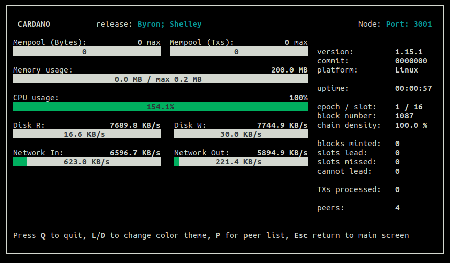
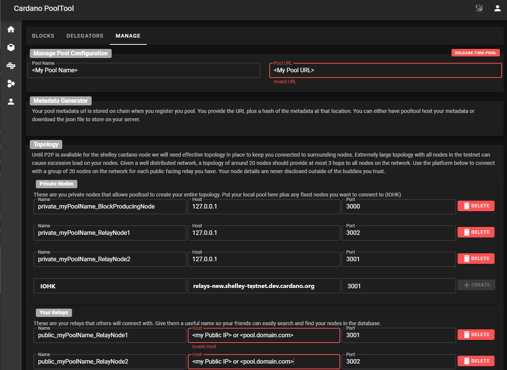

# Guide: How to build a Haskell Testnet Cardano Stakepool


As of July 12, 2020, this guide is written for mainnet candidate v.1.15.1 😁 


## 🏁 0. Prerequisites

### 🎗 Minimum Setup Requirements

* **Operating system:** 64-bit Linux \(i.e. Ubuntu 20.04 LTS\)
* **Processor:** Dual core CPU
* **Memory:** 4GB RAM
* **Storage:** 20GB
* **Internet:** 24/7 broadband internet connection with speeds at least 1 Mbps.
* **Data Plan**: at least 100MB per hour. 72GB per month.
* **Power:** 24/7 electrical power
* **ADA balance:** at least 1000 fADA

### 🏋♂ Recommended Futureproof Setup

* **Operating system:** 64-bit Linux \(i.e. Ubuntu 20.04 LTS\)
* **Processor:** Quad core or better CPU
* **Memory:** 16GB RAM
* **Storage:** 500GB SSD with RAID
* **Internet:** Multiple 24/7 broadband internet connections with speeds at least 10 Mbps \(i.e. fiber + cellular 4G\)
* **Data Plan**: at least 100MB per hour. 72GB per month.
* **Power:** Redundant 24/7 electrical power with UPS
* **ADA balance:** more pledge is better, to be determined by **a0**, the pledge influence factor

For instructions on installing **Ubuntu**, refer to the following:



## 🏭 1. Install Cabal and GHC

**Press** Ctrl+Alt+T. This will launch a terminal window. 

First, update packages and install Ubuntu dependencies.

```text
sudo apt-get update -y
sudo apt-get upgrade -y
sudo apt-get -y install libtool curl build-essential pkg-config libffi-dev libgmp-dev libssl-dev libtinfo-dev libsystemd-dev zlib1g-dev make g++ tmux git jq wget libncursesw5
```

Install Libsodium.

```text
mkdir ~/git
cd ~/git
git clone https://github.com/input-output-hk/libsodium
cd libsodium
git checkout 66f017f1
./autogen.sh
./configure
make
sudo make install
```

Install Cabal.

```text
cd
wget https://downloads.haskell.org/~cabal/cabal-install-3.2.0.0/cabal-install-3.2.0.0-x86_64-unknown-linux.tar.xz
tar -xf cabal-install-3.2.0.0-x86_64-unknown-linux.tar.xz
rm cabal-install-3.2.0.0-x86_64-unknown-linux.tar.xz cabal.sig
mkdir -p ~/.local/bin
mv cabal ~/.local/bin/
```

Install GHC.

```text
wget https://downloads.haskell.org/~ghc/8.6.5/ghc-8.6.5-x86_64-deb9-linux.tar.xz
tar -xf ghc-8.6.5-x86_64-deb9-linux.tar.xz
rm ghc-8.6.5-x86_64-deb9-linux.tar.xz
cd ghc-8.6.5
./configure
sudo make install
```

Update PATH to include Cabal and GHC and add exports. Your node's location will be in **$NODE\_HOME**.

```text
echo PATH="~/.local/bin:$PATH" >> ~/.bashrc
echo export LD_LIBRARY_PATH="/usr/local/lib:$LD_LIBRARY_PATH" >> ~/.bashrc
echo export NODE_HOME=$HOME/cardano-my-node >> ~/.bashrc
source ~/.bashrc
```

Update cabal and verify the correct versions were installed successfully.

```text
cabal update
cabal -V
ghc -V
```


Cabal library should be version 3.2.0.0 and GHC should be version 8.6.5


## 🏗 2. Build the node from source code

Download source code and switch to the latest tag. In this case, use `release/1.15.x`

```text
cd ~/git
git clone https://github.com/input-output-hk/cardano-node.git
cd cardano-node
git fetch --tags
git checkout release/1.15.x
```

Update the cabal config, project settings, and reset build folder.

```text
echo -e "package cardano-crypto-praos\n flags: -external-libsodium-vrf" > cabal.project.local
sed -i.bak -e "s/overwrite-policy:/overwrite-policy: always/g" $HOME/.cabal/config
rm -rf $HOME/git/cardano-node/dist-newstyle/build/x86_64-linux/ghc-8.6.5
```

Build the cardano-node from source code.

```text
cabal build cardano-cli cardano-node
```


Building process may take a few minutes up to a few hours depending on your computer's processing power.


Copy **cardano-cli** and **cardano-node** files into bin directory.

```text
sudo cp $(find ~/git/cardano-node/dist-newstyle/build -type f -name "cardano-cli") /usr/local/bin/cardano-cli
sudo cp $(find ~/git/cardano-node/dist-newstyle/build -type f -name "cardano-node") /usr/local/bin/cardano-node
```

Verify your **cardano-cli** and **cardano-node** are the expected versions.

```text
cardano-node version
cardano-cli version
```

## 📐 3. Configure the node

Here you'll grab the config.json, genesis.json, and topology.json files needed to configure your node.

```text
mkdir $NODE_HOME
cd $NODE_HOME
wget https://hydra.iohk.io/build/3413883/download/1/mainnet_candidate-byron-genesis.json
wget https://hydra.iohk.io/build/3413883/download/1/mainnet_candidate-topology.json
wget https://hydra.iohk.io/build/3413883/download/1/mainnet_candidate-shelley-genesis.json
wget https://hydra.iohk.io/build/3413883/download/1/mainnet_candidate-config.json
```

Run the following to modify **config.json** and 

* update ViewMode to "LiveView"
* update TraceBlockFetchDecisions to "true"

```text
sed -i.bak -e "s/SimpleView/LiveView/g" -e "s/TraceBlockFetchDecisions\": false/TraceBlockFetchDecisions\": true/g" mainnet_candidate-config.json
```

Update **.bashrc** shell variables.

```
echo export CARDANO_NODE_SOCKET_PATH="$NODE_HOME/db/socket" >> ~/.bashrc
source ~/.bashrc
```

### 🔮 3.1 Configure the block-producer node and the relay nodes


A block producing node will be configured with various key-pairs needed for block generation \(cold keys, KES hot keys and VRF hot keys\). It can only connect to its relay nodes.



A relay node will not be in possession of any keys and will therefore be unable to produce blocks. It will be connected to its block-producing node, other relays and external nodes.



Setup the directory structure.

```text
mkdir relaynode1
mkdir relaynode2
```

Copy the essential json files to each directory.

```text
cp *.json relaynode1
cp *.json relaynode2
```

Configure **topology.json** file so that 

* only relay nodes connect to the public internet and your block-producing node
* the block-producing node can only connect to your relay nodes

Update relaynode1 with the following. Simply copy/paste.

```text
cat > $NODE_HOME/relaynode1/mainnet_candidate-topology.json << EOF 
 {
    "Producers": [
      {
        "addr": "127.0.0.1",
        "port": 3000,
        "valency": 2
      },
      {
        "addr": "127.0.0.1",
        "port": 3002,
        "valency": 2
      },
      {
        "addr": "relays-new.mainnet-candidate.dev.cardano.org",
        "port": 3001,
        "valency": 2
      }
    ]
  }
EOF
```

Update relaynode2 with the following. Simply copy/paste.

```text
cat > $NODE_HOME/relaynode2/mainnet_candidate-topology.json << EOF 
 {
    "Producers": [
      {
        "addr": "127.0.0.1",
        "port": 3000,
        "valency": 2
      },
      {
        "addr": "127.0.0.1",
        "port": 3001,
        "valency": 2
      },
      {
        "addr": "relays-new.mainnet-candidate.dev.cardano.org",
        "port": 3001,
        "valency": 2
      }
    ]
  }
EOF
```

Update the block-producer node with the following. Simply copy/paste.

```text
cat > $NODE_HOME/mainnet_candidate-topology.json << EOF 
 {
    "Producers": [
      {
        "addr": "127.0.0.1",
        "port": 3001,
        "valency": 2
      },
      {
        "addr": "127.0.0.1",
        "port": 3002,
        "valency": 2
      }
    ]
  }
EOF
```


Valency tells the node how many connections to keep open. Only DNS addresses are affected. If value is 0, the address is ignored.



\*\*\*\*✨ **Port Forwarding Tip:** You'll need to forward ports 3001 and 3002 to your computer.


## 🤖 4. Create startup scripts

The startup script contains all the variables needed to run a cardano-node such as directory, port, db path, config file, and topology file.

For your **block-producing node**:

```text
cat > $NODE_HOME/startBlockProducingNode.sh << EOF 
DIRECTORY=\$NODE_HOME
PORT=3000
HOSTADDR=0.0.0.0
TOPOLOGY=\${DIRECTORY}/mainnet_candidate-topology.json
DB_PATH=\${DIRECTORY}/db
SOCKET_PATH=\${DIRECTORY}/db/socket
CONFIG=\${DIRECTORY}/mainnet_candidate-config.json
cardano-node run --topology \${TOPOLOGY} --database-path \${DB_PATH} --socket-path \${SOCKET_PATH} --host-addr \${HOSTADDR} --port \${PORT} --config \${CONFIG}
EOF
```

For your **relaynode1**:

```text
cat > $NODE_HOME/relaynode1/startRelayNode1.sh << EOF 
DIRECTORY=\$NODE_HOME/relaynode1
PORT=3001
HOSTADDR=0.0.0.0
TOPOLOGY=\${DIRECTORY}/mainnet_candidate-topology.json
DB_PATH=\${DIRECTORY}/db
SOCKET_PATH=\${DIRECTORY}/db/socket
CONFIG=\${DIRECTORY}/mainnet_candidate-config.json
cardano-node run --topology \${TOPOLOGY} --database-path \${DB_PATH} --socket-path \${SOCKET_PATH} --host-addr \${HOSTADDR} --port \${PORT} --config \${CONFIG}
EOF
```

For your **relaynode2**:

```text
cat > $NODE_HOME/relaynode2/startRelayNode2.sh << EOF 
DIRECTORY=\$NODE_HOME/relaynode2
PORT=3002
HOSTADDR=0.0.0.0
TOPOLOGY=\${DIRECTORY}/mainnet_candidate-topology.json
DB_PATH=\${DIRECTORY}/db
SOCKET_PATH=\${DIRECTORY}/db/socket
CONFIG=\${DIRECTORY}/mainnet_candidate-config.json
cardano-node run --topology \${TOPOLOGY} --database-path \${DB_PATH} --socket-path \${SOCKET_PATH} --host-addr \${HOSTADDR} --port \${PORT} --config \${CONFIG}
EOF
```

## ✅ 5. Start the node

**Press** Ctrl+Alt+T. This will launch a terminal window. Do this 3 times for 3 terminals. 

Add execute permissions to the script and begin syncing the ADA blockchain!

Run each in a separate terminal.

```text
cd $NODE_HOME
chmod +x startBlockProducingNode.sh
./startBlockProducingNode.sh
```

```text
cd $NODE_HOME/relaynode1
chmod +x startRelayNode1.sh
./startRelayNode1.sh
```

```text
cd $NODE_HOME/relaynode2
chmod +x startRelayNode2.sh
./startRelayNode2.sh
```




Congratulations! Your node is running successfully now. Let it sync up.


## ⚙ 6. Generate block-producer keys

Make a KES key pair.

```text
cd $NODE_HOME
cardano-cli shelley node key-gen-KES \
    --verification-key-file kes.vkey \
    --signing-key-file kes.skey
```


KES \(key evolving signature\) keys are created to secure your stakepool against hackers who might compromise your keys. On mainnet, these will be regenerated every 90 days.


Make a directory to store your cold keys

```text
mkdir ~/cold-keys
pushd ~/cold-keys
```

Make a set of cold keys and create the cold counter file.

```text
cardano-cli shelley node key-gen \
    --cold-verification-key-file node.vkey \
    --cold-signing-key-file node.skey \
    --operational-certificate-issue-counter node.counter
```


Be sure to **back up your all your keys** to another secure storage device. 



Currently on testnet, delegators who delegate via CLI tools will require the ****data contained in `node.vkey` in order to delegate to your stakepool. You can share this file. DO NOT accidentally share the secret key,`node.skey` file.


Determine the number of slots per KES period from the genesis file.

```text
pushd +1
slotsPerKESPeriod=$(cat $NODE_HOME/mainnet_candidate-shelley-genesis.json | jq -r '.slotsPerKESPeriod')
echo slotsPerKESPeriod: ${slotsPerKESPeriod}
```


Before continuing, your node must be fully synchronized to the blockchain. Otherwise, you won't calculate the latest KES period. Your node is synchronized when the _epoch_ and _slot\#_ is equal to that found on a block explorer such as [https://htn.pooltool.io/](https://htn.pooltool.io/)


```text
slotNo=$(cardano-cli shelley query tip --testnet-magic 42 | jq -r '.slotNo')
echo slotNo: ${slotNo}
```

Find the kesPeriod by dividing the slot tip number by theslotsPerKESPeriod which is 3600 slots.

```text
kesPeriod=$((${slotNo} / ${slotsPerKESPeriod}))
echo kesPeriod: ${kesPeriod}
```

With this calculation, you can generate a operational certificate for your pool. 

```text
cardano-cli shelley node issue-op-cert \
    --kes-verification-key-file kes.vkey \
    --cold-signing-key-file ~/cold-keys/node.skey \
    --operational-certificate-issue-counter ~/cold-keys/node.counter \
    --kes-period $kesPeriod \
    --out-file node.cert
```


**Optional tip:** Save this step until after you finish the guide.

With your hot keys created, you can remove access to the cold keys for improved security. This protects against accidental deletion, editing, or access. 

To lock,

```text
chmod a-rwx ~/cold-keys
```

To unlock,

```text
chmod u+rwx ~/cold-keys
```


Make a VRF key pair.

```text
cardano-cli shelley node key-gen-VRF \
    --verification-key-file vrf.vkey \
    --signing-key-file vrf.skey
```

On your **block-producing node's terminal**, stop your **block-producing node** by typing the letter `q`

Update your startup script with the new **KES, VRF and Operation Certificate.**

```text
cat > $NODE_HOME/startBlockProducingNode.sh << EOF 
DIRECTORY=\$NODE_HOME
PORT=3000
HOSTADDR=0.0.0.0
TOPOLOGY=\${DIRECTORY}/mainnet_candidate-topology.json
DB_PATH=\${DIRECTORY}/db
SOCKET_PATH=\${DIRECTORY}/db/socket
CONFIG=\${DIRECTORY}/mainnet_candidate-config.json
KES=\${DIRECTORY}/kes.skey
VRF=\${DIRECTORY}/vrf.skey
CERT=\${DIRECTORY}/node.cert
cardano-node run --topology \${TOPOLOGY} --database-path \${DB_PATH} --socket-path \${SOCKET_PATH} --host-addr \${HOSTADDR} --port \${PORT} --config \${CONFIG} --shelley-kes-key \${KES} --shelley-vrf-key \${VRF} --shelley-operational-certificate \${CERT}
EOF
```


To operate a stakepool, two sets of keys are needed: they KES key \(hot\) and the cold key. Cold keys generate new hot keys periodically.


Now start the new block-producing node.

```text
cd $NODE_HOME
./startBlockProducingNode.sh
```

## 🔐 7. Setup payment and staking keys

First, obtain the protocol-parameters.


Wait for the block-producing node to start syncing before continuing if you get this error message.

`cardano-cli: Network.Socket.connect: : does not exist (No such file or directory)`


```text
cardano-cli shelley query protocol-parameters \
    --testnet-magic 42 \
    --out-file params.json \
    --cardano-mode
```

Create a new payment key pair:  `payment.skey` & `payment.vkey`

```text
cardano-cli shelley address key-gen \
    --verification-key-file payment.vkey \
    --signing-key-file payment.skey
```


If you participated in the ITN, you can convert your ITN ed25519 public/private key to a shelley stake verification/signing key. This does not yet work for ITN ed25519e keys.

```
itnKeyFile=<yourITNPrivateKeyFile>
cardano-cli shelley stake-address convert-itn-key --itn-signing-key-file ${itnKeyFile} --out-file payment.skey
cardano-cli shelley stake-address convert-itn-key --itn-verification-key-file ${itnKeyFile} --out-file payment.vkey
```


 Create a new stake address key pair: `stake.skey` & `stake.vkey`

```text
cardano-cli shelley stake-address key-gen \
    --verification-key-file stake.vkey \
    --signing-key-file stake.skey
```

Create your stake address from the stake address verification key and store it in `stake`

```text
cardano-cli shelley stake-address build \
    --staking-verification-key-file stake.vkey \
    --out-file stake.addr \
    --mainnet
```

Build a payment address for the payment key `payment.vkey` which will delegate to the stake address, `stake.vkey`

```text
cardano-cli shelley address build \
    --payment-verification-key-file payment.vkey \
    --staking-verification-key-file stake.vkey \
    --out-file payment.addr \
    --mainnet
```


Payment keys are used to send and receive payments and staking keys are used to manage stake delegations.


Next step is to fund your payment address. Payment address can be funded from your Byron mainnet funds based on a snapshot from July 10th. If you were part of the ITN, you can convert your address as specified above. Public faucet is coming soon.

After funding your account, check your payment address balance.


Before continuing, your nodes must be fully synchronized to the blockchain. Otherwise, you won't see your funds.


```text
cardano-cli shelley query utxo \
    --address $(cat payment.addr) \
    --testnet-magic 42 \
    --cardano-mode
```

You should see output similar to this. This is your unspent transaction output \(UXTO\).

```text
                           TxHash                                 TxIx        Lovelace
----------------------------------------------------------------------------------------
100322a39d02c2ead....                                              0        1000000000
```

## 👩💻 8. Register your stake address

Create a certificate, `stake.cert`, using the `stake.vkey`

```text
cardano-cli shelley stake-address registration-certificate \
    --staking-verification-key-file stake.vkey \
    --out-file stake.cert
```

You need to find the **tip** of the blockchain to set the **ttl** parameter properly.

```
currentSlot=$(cardano-cli shelley query tip --testnet-magic 42 | jq -r '.slotNo')
echo Current Slot: $currentSlot
```

Find your balance and **UTXOs**.

```text
cardano-cli shelley query utxo \
    --address $(cat payment.addr) \
    --testnet-magic 42 \
    --cardano-mode > fullUtxo.out

tail -n +3 fullUtxo.out | sort -k3 -nr > balance.out

cat balance.out

tx_in=""
total_balance=0
while read -r utxo; do
    in_addr=$(awk '{ print $1 }' <<< "${utxo}")
    idx=$(awk '{ print $2 }' <<< "${utxo}")
    utxo_balance=$(awk '{ print $3 }' <<< "${utxo}")
    total_balance=$((${total_balance}+${utxo_balance}))
    echo TxHash: ${in_addr}#${idx}
    echo ADA: ${utxo_balance}
    tx_in="${tx_in} --tx-in ${in_addr}#${idx}"
done < balance.out
txcnt=$(cat balance.out | wc -l)
echo Total ADA balance: ${total_balance}
echo Number of UTXOs: ${txcnt}
```

Find the keyDeposit value.

```text
keyDeposit=$(cat $NODE_HOME/params.json | jq -r '.keyDeposit')
echo keyDeposit: $keyDeposit
```


Registration of a stake address certificate \(keyDeposit\) costs 400000 lovelace.


Run the build-raw transaction command


The **ttl** value must be greater than the current tip. In this example, we use current slot + 10000.


```text
cardano-cli shelley transaction build-raw \
    ${tx_in} \
    --tx-out $(cat payment.addr)+0 \
    --ttl $(( ${currentSlot} + 10000)) \
    --fee 0 \
    --out-file tx.tmp \
    --certificate stake.cert
```

Calculate the current minimum fee:

```text
fee=$(cardano-cli shelley transaction calculate-min-fee \
    --tx-body-file tx.tmp \
    --tx-in-count ${txcnt} \
    --tx-out-count 1 \
    --testnet-magic 42 \
    --witness-count 2 \
    --byron-witness-count 0 \
    --protocol-params-file params.json | awk '{ print $1 }')
echo fee: $fee
```


Ensure your balance is greater than cost of fee + keyDeposit or this will not work.


Calculate your change output.

```text
txOut=$((${total_balance}-${keyDeposit}-${fee}))
echo Change Output: ${txOut}
```

Build your transaction which will register your stake address.

```text
cardano-cli shelley transaction build-raw \
    ${tx_in} \
    --tx-out $(cat payment.addr)+${txOut} \
    --ttl $(( ${currentSlot} + 10000)) \
    --fee ${fee} \
    --certificate-file stake.cert \
    --out-file tx.raw
```

Sign the transaction with both the payment and stake secret keys.

```text
cardano-cli shelley transaction sign \
    --tx-body-file tx.raw \
    --signing-key-file payment.skey \
    --signing-key-file stake.skey \
    --testnet-magic 42 \
    --out-file tx.signed
```

Send the signed transaction.

```text
cardano-cli shelley transaction submit \
    --tx-file tx.signed \
    --cardano-mode \
    --testnet-magic 42
```

## 📄 9. Register your stakepool

Create your pool's metadata with a JSON file. Update with your pool information.


**ticker** must be between 3-5 characters in length.


```text
cat > poolMetaData.json << EOF
{
"name": "MyPoolName",
"description": "My pool description",
"ticker": "MPN",
"homepage": "https://myadapoolnamerocks.com"
}
EOF
```

Get the hash of your metadata file.

```text
cardano-cli shelley stake-pool metadata-hash --pool-metadata-file poolMetaData.json > poolMetaDataHash.txt
```

Now upload your **poolMetaData.json** to your website or a public website such as [https://pages.github.com/](https://pages.github.com/)

Create a registration certificate for your stakepool. Update with your metadata URL and pool relay IP.


**metadata-url** must be no longer than 64 characters.


Find the minimum pool cost.

```text
minPoolCost=$(cat $NODE_HOME/params.json | jq -r .minPoolCost)
echo minPoolCost: ${minPoolCost}
```


minPoolCost is 228000000 lovelace or 228 ADA. Therefore, your `--pool-cost` must be at a minimum this amount.


```text
cardano-cli shelley stake-pool registration-certificate \
    --cold-verification-key-file ~/cold-keys/node.vkey \
    --vrf-verification-key-file vrf.vkey \
    --pool-pledge 50000000 \
    --pool-cost 328000000 \
    --pool-margin 0.12 \
    --pool-reward-account-verification-key-file stake.vkey \
    --pool-owner-stake-verification-key-file stake.vkey \
    --testnet-magic 42 \
    --pool-relay-port 3001 \
    --pool-relay-ipv4 <your relay IP address> \
    --metadata-url <url where you uploaded poolMetaData.json> \
    --metadata-hash $(cat poolMetaDataHash.txt) \
    --out-file pool.cert
```


Here we are pledging 50 ADA with a fixed pool cost of 328 ADA and a pool margin of 12%. 


Pledge stake to your stakepool.

```text
cardano-cli shelley stake-address delegation-certificate \
    --staking-verification-key-file stake.vkey \
    --cold-verification-key-file ~/cold-keys/node.vkey \
    --out-file deleg.cert
```


 This creates a delegation certificate which delegates funds from all stake addresses associated with key `stake.vkey` to the pool belonging to cold key `node.vkey`


You need to find the **tip** of the blockchain to set the **ttl** parameter properly.

```
currentSlot=$(cardano-cli shelley query tip --testnet-magic 42 | jq -r '.slotNo')
echo Current Slot: $currentSlot
```

Find your balance and **UTXOs**.

```text
cardano-cli shelley query utxo \
    --address $(cat payment.addr) \
    --testnet-magic 42 \
    --cardano-mode > fullUtxo.out

tail -n +3 fullUtxo.out | sort -k3 -nr > balance.out

cat balance.out

tx_in=""
total_balance=0
while read -r utxo; do
    in_addr=$(awk '{ print $1 }' <<< "${utxo}")
    idx=$(awk '{ print $2 }' <<< "${utxo}")
    utxo_balance=$(awk '{ print $3 }' <<< "${utxo}")
    total_balance=$((${total_balance}+${utxo_balance}))
    echo TxHash: ${in_addr}#${idx}
    echo ADA: ${utxo_balance}
    tx_in="${tx_in} --tx-in ${in_addr}#${idx}"
done < balance.out
txcnt=$(cat balance.out | wc -l)
echo Total ADA balance: ${total_balance}
echo Number of UTXOs: ${txcnt}
```

Find the deposit fee for a pool.

```text
poolDeposit=$(cat $NODE_HOME/params.json | jq -r '.poolDeposit')
echo poolDeposit: $poolDeposit
```

Run the build-raw transaction command.


The **ttl** value must be greater than the current tip. In this example, we use current slot + 10000. 


```text
cardano-cli shelley transaction build-raw \
    ${tx_in} \
    --tx-out $(cat payment.addr)+$(( ${total_balance} - ${poolDeposit}))  \
    --ttl $(( ${currentSlot} + 10000)) \
    --fee 0 \
    --certificate-file pool.cert \
    --certificate-file deleg.cert \
    --out-file tx.tmp
```

Calculate the minimum fee:

```text
fee=$(cardano-cli shelley transaction calculate-min-fee \
    --tx-body-file tx.tmp \
    --tx-in-count ${txcnt} \
    --tx-out-count 1 \
    --testnet-magic 42 \
    --witness-count 3 \
    --byron-witness-count 0 \
    --protocol-params-file params.json | awk '{ print $1 }')
echo fee: $fee
```


Ensure your balance is greater than cost of fee + minPoolCost or this will not work.


Calculate your change output.

```text
txOut=$((${total_balance}-${poolDeposit}-${fee}))
echo txOut: ${txOut}
```

Build the transaction.

```text
cardano-cli shelley transaction build-raw \
    ${tx_in} \
    --tx-out $(cat payment.addr)+${txOut} \
    --ttl $(( ${currentSlot} + 10000)) \
    --fee ${fee} \
    --certificate-file pool.cert \
    --certificate-file deleg.cert \
    --out-file tx.raw
```

Sign the transaction.

```text
cardano-cli shelley transaction sign \
    --tx-body-file tx.raw \
    --signing-key-file payment.skey \
    --signing-key-file ~/cold-keys/node.skey \
    --signing-key-file stake.skey \
    --testnet-magic 42 \
    --out-file tx.signed
```

Send the transaction.

```text
cardano-cli shelley transaction submit \
    --tx-file tx.signed \
    --cardano-mode \
    --testnet-magic 42
```

## 🐣 10. Locate your Stakepool ID and verify everything is working 

Your stakepool ID can be computed with:

```text
cardano-cli shelley stake-pool id --verification-key-file ~/cold-keys/node.vkey > stakepoolid.txt
cat stakepoolid.txt
```

Now that you have your stakepool ID,  verify it's included in the blockchain.

```text
cardano-cli shelley query ledger-state --testnet-magic 42 --cardano-mode | grep publicKey | grep $(cat stakepoolid.txt)
```


A non-empty string return means you're registered! 👏 


With your stakepool ID, now you can find your data on block explorers such as [https://htn.pooltool.io/](https://htn.pooltool.io/)

## ⚙ 11. Configure topology with Pooltool.io


Shelley testnet has been launched without peer-to-peer \(p2p\) node discovery so that means we will need to manually add trusted nodes in order to configure our topology. This is a **critical step** as skipping this step will result in your minted blocks being orphaned by the rest of the network.


1. Visit [https://htn.pooltool.io/](https://htn.pooltool.io/)
2. Create an account and login
3. Search for your stakepool id
4. Click ➡ **Pool Details** &gt; **Manage** &gt; **CLAIM THIS POOL**
5. Fill in your pool name and pool URL if you have one.
6. Fill in your **Private Nodes** and **Your Relays** as follows.



Add requests for nodes or "buddies" to each of your relay nodes. Make sure you include the IOHK node and your private nodes.

IOHK's node address is:

```text
relays-new.mainnet-candidate.dev.cardano.org
```

IOHK's node port is:

```text
3001
```

For example, on relaynode1's buddies you should add **requests** for

* your private BlockProducingNode
* your private RelayNode2
* IOHK's node
* and any other buddy/friendly nodes your can find or know

For example, on relaynode2's buddies you should add **requests** for

* your private BlockProducingNode
* your private RelayNode1
* IOHK's node
* and any other buddy/friendly nodes your can find or know


A relay node connection is not established until there is a request and an approval.


For relaynode1, create a get\_buddies.sh script to update your topology.json file.

```text
cd $NODE_HOME
cat > relaynode1/get_buddies.sh << EOF 
#!/usr/bin/env bash

## CHANGE THESE TO SUIT YOUR POOL TO YOUR POOL ID AS ON THE EXPLORER
MY_POOL_ID="XXXXXXXX"
## GET THIS FROM YOUR ACCOUNT PROFILE PAGE ON POOLTOOL WEBSITE
MY_API_KEY="XXXXXXXX"
## GET THIS FROM YOUR POOL MANAGE TAB ON POOLTOOL WEBSITE
MY_NODE_ID="XXXXXXXX"
## SET THIS TO THE LOCATION OF YOUR TOPOLOGY FILE THAT YOUR NODE USES
TOPOLOGY_FILE="$NODE_HOME/relaynode1/mainnet_candidate-topology.json"

JSON="\$(jq -n --compact-output --arg MY_API_KEY "\$MY_API_KEY" --arg MY_POOL_ID "\$MY_POOL_ID" --arg MY_NODE_ID "\$MY_NODE_ID" '{apiKey: \$MY_API_KEY, nodeId: \$MY_NODE_ID, poolId: \$MY_POOL_ID}')"
echo "Packet Sent: \$JSON"
RESPONSE="\$(curl -s -H "Accept: application/json" -H "Content-Type:application/json" -X POST --data "\$JSON" "https://api.pooltool.io/v0/getbuddies")"
SUCCESS="\$(echo \$RESPONSE | jq '.success')"
if [ \$SUCCESS ]; then
  echo "Success"
  echo \$RESPONSE | jq '. | {Producers: .message}' > \$TOPOLOGY_FILE
  echo "Topology saved to \$TOPOLOGY_FILE.  Note topology will only take effect next time you restart your node"
else
  echo "Failure "
  echo \$RESPONSE | jq '.message'
fi
EOF
```

For relaynode2, create a get\_buddies.sh script to update your topology.json file.

```text
cd $NODE_HOME
cat > relaynode2/get_buddies.sh << EOF 
#!/usr/bin/env bash

## CHANGE THESE TO SUIT YOUR POOL TO YOUR POOL ID AS ON THE EXPLORER
MY_POOL_ID="XXXXXXXX"
## GET THIS FROM YOUR ACCOUNT PROFILE PAGE ON POOLTOOL WEBSITE
MY_API_KEY="XXXXXXXX"
## GET THIS FROM YOUR POOL MANAGE TAB ON POOLTOOL WEBSITE
MY_NODE_ID="XXXXXXXX"
## SET THIS TO THE LOCATION OF YOUR TOPOLOGY FILE THAT YOUR NODE USES
TOPOLOGY_FILE="$NODE_HOME/relaynode2/mainnet_candidate-topology.json"

JSON="\$(jq -n --compact-output --arg MY_API_KEY "\$MY_API_KEY" --arg MY_POOL_ID "\$MY_POOL_ID" --arg MY_NODE_ID "\$MY_NODE_ID" '{apiKey: \$MY_API_KEY, nodeId: \$MY_NODE_ID, poolId: \$MY_POOL_ID}')"
echo "Packet Sent: \$JSON"
RESPONSE="\$(curl -s -H "Accept: application/json" -H "Content-Type:application/json" -X POST --data "\$JSON" "https://api.pooltool.io/v0/getbuddies")"
SUCCESS="\$(echo \$RESPONSE | jq '.success')"
if [ \$SUCCESS ]; then
  echo "Success"
  echo \$RESPONSE | jq '. | {Producers: .message}' > \$TOPOLOGY_FILE
  echo "Topology saved to \$TOPOLOGY_FILE.  Note topology will only take effect next time you restart your node"
else
  echo "Failure "
  echo \$RESPONSE | jq '.message'
fi
EOF
```

For each of your relay nodes, update the following variables from pooltool.io into your get\_buddies.sh file

* MY\_POOL\_ID 
* MY\_API\_KEY 
* MY\_NODE\_ID

Update your get\_buddies.sh scripts with this information.


Use **nano** to edit your files. 

`nano $NODE_HOME/relaynode1/get_buddies.sh`

`nano $NODE_HOME/relaynode2/get_buddies.sh`


Add execute permissions to these scripts. Run the scripts to update your topology files.

```text
chmod +x relaynode1/get_buddies.sh
chmod +x relaynode2/get_buddies.sh
./relaynode1/get_buddies.sh
./relaynode2/get_buddies.sh
```

Stop and then restart your relay nodes in order for the new topology settings to take effect.

```text
kill $(lsof -t -i:3001)
kill $(lsof -t -i:3002)
```

```text
cd $NODE_HOME
./relaynode1/startRelayNode1.sh
```

```text
cd $NODE_HOME
./relaynode2/startRelayNode2.sh
```


As your REQUESTS are approved, you must re-run the get\_buddies.sh script to pull the latest topology data. Restart your relay nodes afterwards.


You are properly connected to the network when you see the transactions processed increasing.



Congratulations! Your stakepool is registered and ready to produce blocks.


## 🎇 12. Checking Stakepool Rewards

After the epoch is over and assuming you successfully minted blocks, check with this:

```text
cardano-cli shelley query stake-address-info --address $(cat stake.addr) --cardano-mode --testnet-magic 42
```

## 🔮 13. Setup Prometheus and Grafana Dashboard

Prometheus is a monitoring platform that collects metrics from monitored targets by scraping metrics HTTP endpoints on these targets. [Official documentation is available here.](https://prometheus.io/docs/introduction/overview/) Grafana is a dashboard used to visualize the collected data.

###  🐣 13.1 Installation

Install prometheus and prometheus node exporter.

```text
sudo apt-get install -y prometheus prometheus-alertmanager prometheus-node-exporter 
```

Install grafana.

```text
wget -q -O - https://packages.grafana.com/gpg.key | sudo apt-key add -
```

```text
sudo su
echo "deb https://packages.grafana.com/oss/deb stable main" > /etc/apt/sources.list.d/grafana.list
exit
```

```text
sudo apt-get update && sudo apt-get install -y grafana
```

Change the default port of Grafana from 3000 to 30000


Port 3000 is used by the block-producing node.


```text
cd /etc/grafana
sudo sed -i.bak -e "s/;http_port = 3000/http_port = 30000/g" grafana.ini
```

Enable services so they start automatically.

```text
sudo systemctl enable grafana-server.service
sudo systemctl enable prometheus.service
sudo systemctl enable prometheus-node-exporter.service
```

Update prometheus.yml located in `/etc/prometheus/prometheus.yml`

```text
sudo su
cat > /etc/prometheus/prometheus.yml << EOF
global:
  scrape_interval:     15s # By default, scrape targets every 15 seconds.

  # Attach these labels to any time series or alerts when communicating with
  # external systems (federation, remote storage, Alertmanager).
  external_labels:
    monitor: 'codelab-monitor'

# A scrape configuration containing exactly one endpoint to scrape:
# Here it's Prometheus itself.
scrape_configs:
  # The job name is added as a label job=<job_name> to any timeseries scraped from this config.
  - job_name: 'prometheus'

    static_configs:
      - targets: ['localhost:9100']
      - targets: ['localhost:12700']
        labels:
          alias: 'block-producing-node'
          type:  'cardano-node'
      - targets: ['localhost:12701']
        labels:
          alias: 'relaynode1'
          type:  'cardano-node'
      - targets: ['localhost:12702']
        labels:
          alias: 'relaynode2'
          type:  'cardano-node'

EOF
exit
```

Finally, restart the services.

```text
sudo systemctl restart grafana-server.service
sudo systemctl restart prometheus.service
sudo systemctl restart prometheus-node-exporter.service
```

Verify that the services are running properly:

```text
sudo systemctl status grafana-server.service prometheus.service prometheus-node-exporter.service
```

Update `mainnet_candidate-config.json` config files with new `hasEKG`  and `hasPrometheus` ports.

```text
cd $NODE_HOME
sed -i.bak -e "s/    12798/    12700/g" -e "s/hasEKG\": 12788/hasEKG\": 12600/g" mainnet_candidate-config.json
cd $NODE_HOME/relaynode1
sed -i.bak -e "s/    12798/    12701/g" -e "s/hasEKG\": 12788/hasEKG\": 12601/g" mainnet_candidate-config.json
cd $NODE_HOME/relaynode2
sed -i.bak -e "s/    12798/    12702/g" -e "s/hasEKG\": 12788/hasEKG\": 12602/g" mainnet_candidate-config.json
```

Stop and start your blockproducer, relaynode1, relaynode2.

```text
kill $(lsof -t -i:3000)
kill $(lsof -t -i:3001)
kill $(lsof -t -i:3002)
```

```text
cd $NODE_HOME
./startBlockProducingNode.sh
```

```text
cd $NODE_HOME
./relaynode1/startRelayNode1.sh
```

```text
cd $NODE_HOME
./relaynode1/startRelayNode2.sh
```

### 📶 13.2 Setting up Grafana Dashboards 

1. Open [http://localhost:30000](http://localhost:30000) in your browser
2. Login with **admin** / **admin**
3. Change password
4. Click the **configuration gear** icon, then **Add data Source**
5. Select **Prometheus**
6. Set **Name** to **"prometheus**" . ✨ Lower case matters.
7. Set **URL** to **http://localhost:9090**
8. Click **Save & Test**
9. Click **Create +** icon &gt; **Import**
10. Add dashboard by importing id: **11074**
11. Click the **Load** button.
12. Set **Prometheus** data source as "**prometheus**"
13. Click the **Import** button.


Grafana [dashboard ID 11074](https://grafana.com/grafana/dashboards/11074) is an excellent overall systems health visualizer.



Import a **Cardano-Node** dashboard

1. Click **Create +** icon &gt; **Import**
2. Add dashboard by **importing via panel json. Copy the json from below.**
3. Click the Import button.

```text
{
  "annotations": {
    "list": [
      {
        "builtIn": 1,
        "datasource": "-- Grafana --",
        "enable": true,
        "hide": true,
        "iconColor": "rgba(0, 211, 255, 1)",
        "name": "Annotations & Alerts",
        "type": "dashboard"
      }
    ]
  },
  "editable": true,
  "gnetId": null,
  "graphTooltip": 0,
  "id": 1,
  "links": [],
  "panels": [
    {
      "datasource": "prometheus",
      "description": "",
      "fieldConfig": {
        "defaults": {
          "custom": {},
          "decimals": 2,
          "mappings": [],
          "thresholds": {
            "mode": "absolute",
            "steps": [
              {
                "color": "purple",
                "value": null
              }
            ]
          },
          "unit": "d"
        },
        "overrides": []
      },
      "gridPos": {
        "h": 5,
        "w": 6,
        "x": 0,
        "y": 0
      },
      "id": 18,
      "options": {
        "colorMode": "value",
        "graphMode": "area",
        "justifyMode": "auto",
        "orientation": "auto",
        "reduceOptions": {
          "calcs": [
            "mean"
          ],
          "fields": "",
          "values": false
        }
      },
      "pluginVersion": "7.0.3",
      "targets": [
        {
          "expr": "(cardano_node_Forge_metrics_remainingKESPeriods_int * 6 / 24 / 6)",
          "instant": true,
          "interval": "",
          "legendFormat": "Days till renew",
          "refId": "A"
        }
      ],
      "timeFrom": null,
      "timeShift": null,
      "title": "Key evolution renew left",
      "type": "stat"
    },
    {
      "datasource": "prometheus",
      "fieldConfig": {
        "defaults": {
          "custom": {},
          "mappings": [],
          "thresholds": {
            "mode": "absolute",
            "steps": [
              {
                "color": "red",
                "value": null
              },
              {
                "color": "#EAB839",
                "value": 12
              },
              {
                "color": "green",
                "value": 24
              }
            ]
          }
        },
        "overrides": []
      },
      "gridPos": {
        "h": 5,
        "w": 5,
        "x": 6,
        "y": 0
      },
      "id": 12,
      "options": {
        "colorMode": "value",
        "graphMode": "area",
        "justifyMode": "auto",
        "orientation": "auto",
        "reduceOptions": {
          "calcs": [
            "mean"
          ],
          "fields": "",
          "values": false
        }
      },
      "pluginVersion": "7.0.3",
      "targets": [
        {
          "expr": "cardano_node_Forge_metrics_remainingKESPeriods_int",
          "instant": true,
          "interval": "",
          "legendFormat": "KES Remaining",
          "refId": "A"
        }
      ],
      "timeFrom": null,
      "timeShift": null,
      "title": "KES remaining",
      "type": "stat"
    },
    {
      "datasource": "prometheus",
      "description": "",
      "fieldConfig": {
        "defaults": {
          "custom": {
            "align": null
          },
          "mappings": [],
          "thresholds": {
            "mode": "absolute",
            "steps": [
              {
                "color": "green",
                "value": null
              },
              {
                "color": "yellow",
                "value": 460
              },
              {
                "color": "red",
                "value": 500
              }
            ]
          }
        },
        "overrides": []
      },
      "gridPos": {
        "h": 5,
        "w": 6,
        "x": 11,
        "y": 0
      },
      "id": 2,
      "options": {
        "colorMode": "value",
        "graphMode": "area",
        "justifyMode": "auto",
        "orientation": "auto",
        "reduceOptions": {
          "calcs": [
            "mean"
          ],
          "fields": "",
          "values": false
        }
      },
      "pluginVersion": "7.0.3",
      "targets": [
        {
          "expr": "cardano_node_Forge_metrics_operationalCertificateExpiryKESPeriod_int",
          "format": "time_series",
          "instant": true,
          "interval": "",
          "legendFormat": "KES Expiry",
          "refId": "A"
        },
        {
          "expr": "cardano_node_Forge_metrics_currentKESPeriod_int",
          "instant": true,
          "interval": "",
          "legendFormat": "KES current",
          "refId": "B"
        }
      ],
      "timeFrom": null,
      "timeShift": null,
      "title": "KES Perioden",
      "type": "stat"
    },
    {
      "datasource": "prometheus",
      "description": "",
      "fieldConfig": {
        "defaults": {
          "custom": {
            "align": null
          },
          "mappings": [],
          "thresholds": {
            "mode": "absolute",
            "steps": [
              {
                "color": "green",
                "value": null
              }
            ]
          }
        },
        "overrides": []
      },
      "gridPos": {
        "h": 5,
        "w": 6,
        "x": 0,
        "y": 5
      },
      "id": 10,
      "options": {
        "colorMode": "value",
        "graphMode": "area",
        "justifyMode": "auto",
        "orientation": "auto",
        "reduceOptions": {
          "calcs": [
            "mean"
          ],
          "fields": "",
          "values": false
        }
      },
      "pluginVersion": "7.0.3",
      "targets": [
        {
          "expr": "cardano_node_ChainDB_metrics_slotNum_int",
          "instant": true,
          "interval": "",
          "legendFormat": "SlotNo",
          "refId": "A"
        }
      ],
      "timeFrom": null,
      "timeShift": null,
      "title": "Slot",
      "type": "stat"
    },
    {
      "datasource": "prometheus",
      "description": "",
      "fieldConfig": {
        "defaults": {
          "custom": {
            "align": null
          },
          "mappings": [],
          "thresholds": {
            "mode": "absolute",
            "steps": [
              {
                "color": "green",
                "value": null
              },
              {
                "color": "red",
                "value": 80
              }
            ]
          }
        },
        "overrides": []
      },
      "gridPos": {
        "h": 5,
        "w": 5,
        "x": 6,
        "y": 5
      },
      "id": 8,
      "options": {
        "colorMode": "value",
        "graphMode": "area",
        "justifyMode": "auto",
        "orientation": "auto",
        "reduceOptions": {
          "calcs": [
            "mean"
          ],
          "fields": "",
          "values": false
        }
      },
      "pluginVersion": "7.0.3",
      "targets": [
        {
          "expr": "cardano_node_ChainDB_metrics_epoch_int",
          "format": "time_series",
          "instant": true,
          "interval": "",
          "legendFormat": "Epoch",
          "refId": "A"
        }
      ],
      "timeFrom": null,
      "timeShift": null,
      "title": "Epoch",
      "type": "stat"
    },
    {
      "datasource": "prometheus",
      "description": "",
      "fieldConfig": {
        "defaults": {
          "custom": {},
          "mappings": [],
          "thresholds": {
            "mode": "absolute",
            "steps": [
              {
                "color": "green",
                "value": null
              }
            ]
          }
        },
        "overrides": []
      },
      "gridPos": {
        "h": 5,
        "w": 6,
        "x": 11,
        "y": 5
      },
      "id": 16,
      "options": {
        "colorMode": "value",
        "graphMode": "area",
        "justifyMode": "auto",
        "orientation": "auto",
        "reduceOptions": {
          "calcs": [
            "mean"
          ],
          "fields": "",
          "values": false
        }
      },
      "pluginVersion": "7.0.3",
      "targets": [
        {
          "expr": "cardano_node_ChainDB_metrics_blockNum_int",
          "instant": true,
          "interval": "",
          "legendFormat": "Block Height",
          "refId": "A"
        }
      ],
      "timeFrom": null,
      "timeShift": null,
      "title": "Block Height",
      "type": "stat"
    },
    {
      "aliasColors": {},
      "bars": false,
      "dashLength": 10,
      "dashes": false,
      "datasource": "prometheus",
      "description": "",
      "fieldConfig": {
        "defaults": {
          "custom": {
            "align": null
          },
          "mappings": [],
          "thresholds": {
            "mode": "absolute",
            "steps": [
              {
                "color": "green",
                "value": null
              },
              {
                "color": "red",
                "value": 80
              }
            ]
          }
        },
        "overrides": []
      },
      "fill": 1,
      "fillGradient": 0,
      "gridPos": {
        "h": 9,
        "w": 9,
        "x": 0,
        "y": 10
      },
      "hiddenSeries": false,
      "id": 6,
      "legend": {
        "avg": false,
        "current": false,
        "max": false,
        "min": false,
        "show": true,
        "total": false,
        "values": false
      },
      "lines": true,
      "linewidth": 1,
      "nullPointMode": "null",
      "options": {
        "dataLinks": []
      },
      "percentage": false,
      "pluginVersion": "7.0.3",
      "pointradius": 2,
      "points": false,
      "renderer": "flot",
      "seriesOverrides": [],
      "spaceLength": 10,
      "stack": false,
      "steppedLine": false,
      "targets": [
        {
          "expr": "cardano_node_ChainDB_metrics_slotInEpoch_int",
          "interval": "",
          "legendFormat": "Slot in Epoch",
          "refId": "B"
        }
      ],
      "thresholds": [],
      "timeFrom": null,
      "timeRegions": [],
      "timeShift": null,
      "title": "Slot in Epoch",
      "tooltip": {
        "shared": true,
        "sort": 0,
        "value_type": "individual"
      },
      "type": "graph",
      "xaxis": {
        "buckets": null,
        "mode": "time",
        "name": null,
        "show": true,
        "values": []
      },
      "yaxes": [
        {
          "format": "short",
          "label": null,
          "logBase": 1,
          "max": null,
          "min": null,
          "show": true
        },
        {
          "format": "short",
          "label": null,
          "logBase": 1,
          "max": null,
          "min": null,
          "show": true
        }
      ],
      "yaxis": {
        "align": false,
        "alignLevel": null
      }
    },
    {
      "aliasColors": {},
      "bars": true,
      "dashLength": 10,
      "dashes": false,
      "datasource": "prometheus",
      "description": "",
      "fieldConfig": {
        "defaults": {
          "custom": {
            "align": null
          },
          "mappings": [],
          "thresholds": {
            "mode": "absolute",
            "steps": [
              {
                "color": "green",
                "value": null
              },
              {
                "color": "red",
                "value": 80
              }
            ]
          }
        },
        "overrides": []
      },
      "fill": 1,
      "fillGradient": 4,
      "gridPos": {
        "h": 9,
        "w": 8,
        "x": 9,
        "y": 10
      },
      "hiddenSeries": false,
      "id": 20,
      "legend": {
        "avg": false,
        "current": false,
        "max": false,
        "min": false,
        "show": false,
        "total": false,
        "values": false
      },
      "lines": true,
      "linewidth": 1,
      "nullPointMode": "null",
      "options": {
        "dataLinks": []
      },
      "percentage": false,
      "pluginVersion": "7.0.3",
      "pointradius": 2,
      "points": false,
      "renderer": "flot",
      "seriesOverrides": [],
      "spaceLength": 10,
      "stack": false,
      "steppedLine": false,
      "targets": [
        {
          "expr": "cardano_node_Forge_metrics_nodeIsLeader_int",
          "interval": "",
          "legendFormat": "Node is leader",
          "refId": "A"
        }
      ],
      "thresholds": [],
      "timeFrom": null,
      "timeRegions": [],
      "timeShift": null,
      "title": "Node is Block Leader",
      "tooltip": {
        "shared": true,
        "sort": 0,
        "value_type": "individual"
      },
      "type": "graph",
      "xaxis": {
        "buckets": null,
        "mode": "time",
        "name": null,
        "show": true,
        "values": []
      },
      "yaxes": [
        {
          "decimals": null,
          "format": "none",
          "label": "Slot",
          "logBase": 1,
          "max": null,
          "min": null,
          "show": true
        },
        {
          "format": "short",
          "label": null,
          "logBase": 1,
          "max": null,
          "min": null,
          "show": true
        }
      ],
      "yaxis": {
        "align": false,
        "alignLevel": null
      }
    },
    {
      "aliasColors": {},
      "bars": false,
      "dashLength": 10,
      "dashes": false,
      "datasource": "prometheus",
      "description": "",
      "fieldConfig": {
        "defaults": {
          "custom": {}
        },
        "overrides": []
      },
      "fill": 1,
      "fillGradient": 0,
      "gridPos": {
        "h": 6,
        "w": 9,
        "x": 0,
        "y": 19
      },
      "hiddenSeries": false,
      "id": 14,
      "legend": {
        "avg": false,
        "current": false,
        "max": false,
        "min": false,
        "show": false,
        "total": false,
        "values": false
      },
      "lines": true,
      "linewidth": 1,
      "nullPointMode": "null",
      "options": {
        "dataLinks": []
      },
      "percentage": false,
      "pointradius": 2,
      "points": false,
      "renderer": "flot",
      "seriesOverrides": [],
      "spaceLength": 10,
      "stack": false,
      "steppedLine": false,
      "targets": [
        {
          "expr": "cardano_node_metrics_mempoolBytes_int / 1024",
          "interval": "",
          "intervalFactor": 1,
          "legendFormat": "Memory KB",
          "refId": "A"
        }
      ],
      "thresholds": [],
      "timeFrom": null,
      "timeRegions": [],
      "timeShift": null,
      "title": "Memory Pool",
      "tooltip": {
        "shared": true,
        "sort": 0,
        "value_type": "individual"
      },
      "type": "graph",
      "xaxis": {
        "buckets": null,
        "mode": "time",
        "name": null,
        "show": true,
        "values": []
      },
      "yaxes": [
        {
          "format": "KBs",
          "label": null,
          "logBase": 1,
          "max": null,
          "min": null,
          "show": true
        },
        {
          "format": "short",
          "label": null,
          "logBase": 1,
          "max": null,
          "min": null,
          "show": true
        }
      ],
      "yaxis": {
        "align": false,
        "alignLevel": null
      }
    },
    {
      "datasource": "prometheus",
      "description": "",
      "fieldConfig": {
        "defaults": {
          "custom": {},
          "decimals": 2,
          "mappings": [],
          "thresholds": {
            "mode": "absolute",
            "steps": [
              {
                "color": "green",
                "value": null
              }
            ]
          },
          "unit": "dthms"
        },
        "overrides": []
      },
      "gridPos": {
        "h": 6,
        "w": 8,
        "x": 9,
        "y": 19
      },
      "id": 4,
      "options": {
        "colorMode": "value",
        "graphMode": "area",
        "justifyMode": "auto",
        "orientation": "auto",
        "reduceOptions": {
          "calcs": [
            "last"
          ],
          "fields": "",
          "values": false
        }
      },
      "pluginVersion": "7.0.3",
      "targets": [
        {
          "expr": "cardano_node_metrics_upTime_ns / (1000000000)",
          "format": "time_series",
          "instant": true,
          "interval": "",
          "intervalFactor": 1,
          "legendFormat": "Server Uptime",
          "refId": "A"
        }
      ],
      "timeFrom": null,
      "timeShift": null,
      "title": "Block-Producer Uptime",
      "type": "stat"
    }
  ],
  "refresh": "5s",
  "schemaVersion": 25,
  "style": "dark",
  "tags": [],
  "templating": {
    "list": []
  },
  "time": {
    "from": "now-24h",
    "to": "now"
  },
  "timepicker": {
    "refresh_intervals": [
      "10s",
      "30s",
      "1m",
      "5m",
      "15m",
      "30m",
      "1h",
      "2h",
      "1d"
    ]
  },
  "timezone": "",
  "title": "Cardano Node",
  "uid": "bTDYKJZMk",
  "version": 1
}
```



Congratulations. Prometheus and Grafana are working.


## 👏 14. Thank yous and reference material

Thanks to all Cardano hodlers, buidlers, stakers, and pool operators for making the better future a reality.

👏 Special thanks to [Kaze-Stake](https://github.com/Kaze-Stake) for the pull requests and automatic script contributions.

For more information and official documentation, please refer to the following links:









## 🛠 15. Maintenance Tips

### 🤖 15.1 Updating the operational cert with a new KES Period


You are required to regenerate the hot keys and issue a new operational certificate, a process called rotating the KES keys, when the hot keys expire.

**Mainnet**: KES keys will be valid for 120 rotations or 90 days

**Testnet**: KES keys will be valid for 120 rotations or 5 days



✨ **Updating the KES Period:** When it's time to issue a new operational certificate, run the following:

```text
cd $NODE_HOME
slotNo=$(cardano-cli shelley query tip --testnet-magic 42 | jq -r '.slotNo')
slotsPerKESPeriod=$(cat $NODE_HOME/mainnet_candidate-shelley-genesis.json | jq -r '.slotsPerKESPeriod')
kesPeriod=$((${slotNo} / ${slotsPerKESPeriod}))
chmod u+rwx ~/cold-keys
cardano-cli shelley node issue-op-cert \
    --kes-verification-key-file kes.vkey \
    --cold-signing-key-file ~/cold-keys/node.skey \
    --operational-certificate-issue-counter ~/cold-keys/node.counter \
    --kes-period ${kesPeriod} \
    --out-file node.cert
chmod a-rwx ~/cold-keys
```


### 🌊 15.2 Resetting the databases

Corrupted or stuck blockchain? Delete all db folders.

```text
cd $NODE_HOME
rm -rf db
rm -rf relaynode1/db
rm -rf relaynode2/db
```

