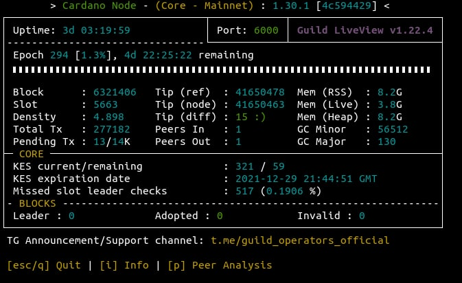

# Guide: How to build a Cardano Stake Pool

## :tada: ∞ Pre-Announcements


If you want to support this free educational Cardano content or found this helpful, visit [cointr.ee to find our donation ](https://cointr.ee/coincashew)addresses. Much appreciated in advance. :pray:&#x20;



As of October 30 2021, this is **guide version 5.0.0** and written for **cardano mainnet **with **release v.1.30.1** :grin:&#x20;


### :page\_facing\_up: Changelog - **Update Notes -** **October 30 2021**

* Re-organized content to improve loading speed.
* Added high-level explanation of Topology API.
* Increased the cardano-node service unit file timeout from 2 to 300 seconds.
* Added a [collection of projects](./#17-6-community-inspired-projects) built by this amazing community.
* Added cardano-node RTS flags to reduce chance of missed slot leader checks.
* Added Leaderlog changes and improvements
* Increased minimum RAM requirements to 12GB.
* Updated for Alonzo release 1.29.0.
* Various fixes to testnet  / alonzo / storage requirements / cli commands
* Updated CNCLI's Leaderlog command with the [stake-snapshot approach](./#18-12-slot-leader-schedule-find-out-when-your-pool-will-mint-blocks)
* Added [CNCLI tool](./#18-12-slot-leader-schedule-find-out-when-your-pool-will-mint-blocks) for sending slot to Pooltool and for LeaderLog scripts
* Updated guide for release cardano-node/cli v1.27.0 changes
* Added [Stake Pool Operator's Best Practices Checklist](./#18-15-stake-pool-operators-best-practices-checklist)
* Contribution By [Billionaire Pool](https://www.billionairepool.com) - [Guide to monitor your node security with OSSEC and Slack.](how-to-monitor-security-with-ossec.md)
* Added how to [Secure your pool pledge with a 2nd pool owner using a hardware wallet](./#18-14-secure-your-pool-pledge-with-a-2nd-pool-owner-using-a-hardware-wallet)

## :checkered\_flag: 0. Prerequisites

### :man\_mage: Mandatory skills for stake pool operators

As a stake pool operator for Cardano, you will be competent with the following abilities:

* operational knowledge of how to set up, run and maintain a Cardano node continuously
* a commitment to maintain your node 24/7/365
* system operation skills
* server administration skills (operational and maintenance).

### :mage: Mandatory experience for stake pool operators

* experience of development and operations (DevOps)
* experience on how to [harden ](https://www.lifewire.com/harden-ubuntu-server-security-4178243)and [secure a server](https://gist.github.com/lokhman/cc716d2e2d373dd696b2d9264c0287a3).
* [passed the official Stake Pool School course.](https://cardano-foundation.gitbook.io/stake-pool-course/)


:octagonal\_sign: **Before continuing this guide, you must satisfy the above requirements. **:construction:&#x20;


### :reminder\_ribbon: Minimum Stake Pool Hardware Requirements

* **Two separate servers: **1 for block producer node, 1 for relay node
* **One air-gapped offline machine (cold environment)**
* **Operating system: **64-bit Linux (i.e. Ubuntu Server 20.04 LTS)
* **Processor:** An Intel or AMD x86 processor with two or more cores, at 2GHz or faster
* **Memory:** 12GB of RAM
* **Storage:** 50GB of free storage
* **Internet:** Broadband internet connection with speeds at least 10 Mbps.
* **Data Plan**: at least 1GB per hour. 720GB per month.
* **Power:** Reliable electrical power
* **ADA balance:** at least 505 ADA for pool deposit and transaction fees

### :man\_lifting\_weights: Recommended Future-proof Stake Pool Hardware Setup

* **Three separate servers: **1 for block producer node, 2 for relay nodes
* **One air-gapped offline machine (cold environment)**
* **Operating system: **64-bit Linux (i.e. Ubuntu 20.04 LTS)
* **Processor:** 4 core or higher CPU
* **Memory: **16GB+ of RAM
* **Storage: **256GB+ SSD
* **Internet: **Broadband internet connections with speeds at least 100 Mbps
* **Data Plan**: Unlimited
* **Power:** Reliable electrical power with UPS
* **ADA balance: **more pledge is better, to be determined by **a0**, the pledge influence factor

### :unlock: Recommended Stake Pool Security

If you need ideas on how to harden your stake pool's nodes, refer [to this guide.](https://www.coincashew.com/coins/overview-ada/guide-how-to-build-a-haskell-stakepool-node/how-to-harden-ubuntu-server)

### :tools: Setup Ubuntu

If you need to install **Ubuntu Server**, refer [to this guide.](https://ubuntu.com/tutorials/install-ubuntu-server#1-overview)

For instructions on installing **Ubuntu Desktop**, refer [to this guide.](https://www.coincashew.com/coins/overview-xtz/guide-how-to-setup-a-baker/install-ubuntu)

### :bricks: Rebuilding Nodes

If you are rebuilding or reusing an existing `cardano-node` installation, refer to [section 18.2 on how to reset the installation.](./#18-2-resetting-the-installation)

## :factory: 1. Install Cabal and GHC

If using Ubuntu Desktop, **press **Ctrl+Alt+T. This will launch a terminal window.&#x20;

First, update packages and install Ubuntu dependencies.

```bash
sudo apt-get update -y
```

```
sudo apt-get upgrade -y
```

```
sudo apt-get install git jq bc make automake rsync htop curl build-essential pkg-config libffi-dev libgmp-dev libssl-dev libtinfo-dev libsystemd-dev zlib1g-dev make g++ wget libncursesw5 libtool autoconf -y
```

Install Libsodium.

```bash
mkdir $HOME/git
cd $HOME/git
git clone https://github.com/input-output-hk/libsodium
cd libsodium
git checkout 66f017f1
./autogen.sh
./configure
make
sudo make install
```


**Debian OS pool operators**: extra lib linking may be required.

```bash
sudo ln -s /usr/local/lib/libsodium.so.23.3.0 /usr/lib/libsodium.so.23
```

**AWS Linux CentOS pool operators: **clearing the lib cache may be required.

```bash
sudo ldconfig
```

**Raspberry Pi 4 with Ubuntu pool operators **: extra lib linking may be required.

```bash
sudo apt-get install libnuma-dev
```

This will help to solve "cannot find -lnuma" error when compiling.


Install Cabal and dependencies.

```bash
sudo apt-get -y install pkg-config libgmp-dev libssl-dev libtinfo-dev libsystemd-dev zlib1g-dev build-essential curl libgmp-dev libffi-dev libncurses-dev libtinfo5
```

```bash
curl --proto '=https' --tlsv1.2 -sSf https://get-ghcup.haskell.org | sh
```

Answer **NO **to installing haskell-language-server (HLS).

Answer **YES **to automatically add the required PATH variable to ".bashrc".

```bash
cd $HOME
source .bashrc
ghcup upgrade
ghcup install cabal 3.4.0.0
ghcup set cabal 3.4.0.0
```

Install GHC.

```bash
ghcup install ghc 8.10.4
ghcup set ghc 8.10.4
```

Update PATH to include Cabal and GHC and add exports. Your node's location will be in **$NODE\_HOME**. The [cluster configuration](https://hydra.iohk.io/job/Cardano/iohk-nix/cardano-deployment/latest-finished/download/1/index.html) is set by **$NODE\_CONFIG**.&#x20;

```bash
echo PATH="$HOME/.local/bin:$PATH" >> $HOME/.bashrc
echo export LD_LIBRARY_PATH="/usr/local/lib:$LD_LIBRARY_PATH" >> $HOME/.bashrc
echo export NODE_HOME=$HOME/cardano-my-node >> $HOME/.bashrc
echo export NODE_CONFIG=mainnet>> $HOME/.bashrc
source $HOME/.bashrc
```


:bulb: **How to use this Guide on TestNet**

Run the following commands to set your **NODE\_CONFIG** to testnet rather than mainnet.

```bash
echo export NODE_CONFIG=testnet>> $HOME/.bashrc
source $HOME/.bashrc
```

As you work through this guide, replace every instance of** **CLI parameter

```bash
 --mainnet 
```

with&#x20;

```bash
--testnet-magic 1097911063
```


Update cabal and verify the correct versions were installed successfully.

```bash
cabal update
cabal --version
ghc --version
```


Cabal library should be version 3.4.0.0 and GHC should be version 8.10.4


## :construction\_site: 2. Build the node from source code

Download source code and switch to the latest tag.

```bash
cd $HOME/git
git clone https://github.com/input-output-hk/cardano-node.git
cd cardano-node
git fetch --all --recurse-submodules --tags
git checkout $(curl -s https://api.github.com/repos/input-output-hk/cardano-node/releases/latest | jq -r .tag_name)
```

Configure build options.

```
cabal configure -O0 -w ghc-8.10.4
```

Update the cabal config, project settings, and reset build folder.

```bash
echo -e "package cardano-crypto-praos\n flags: -external-libsodium-vrf" > cabal.project.local
sed -i $HOME/.cabal/config -e "s/overwrite-policy:/overwrite-policy: always/g"
rm -rf $HOME/git/cardano-node/dist-newstyle/build/x86_64-linux/ghc-8.10.4
```

Build the cardano-node from source code.

```
cabal build cardano-cli cardano-node
```


Building process may take a few minutes up to a few hours depending on your computer's processing power.


Copy **cardano-cli **and **cardano-node** files into bin directory.

```bash
sudo cp $(find $HOME/git/cardano-node/dist-newstyle/build -type f -name "cardano-cli") /usr/local/bin/cardano-cli
```

```bash
sudo cp $(find $HOME/git/cardano-node/dist-newstyle/build -type f -name "cardano-node") /usr/local/bin/cardano-node
```

Verify your **cardano-cli **and **cardano-node** are the expected versions.

```
cardano-node version
cardano-cli version
```

## :triangular\_ruler: 3. Configure the nodes

Here you'll grab the config.json, genesis.json, and topology.json files needed to configure your node.

```bash
mkdir $NODE_HOME
cd $NODE_HOME
wget -N https://hydra.iohk.io/job/Cardano/cardano-node/cardano-deployment/latest-finished/download/1/${NODE_CONFIG}-config.json
wget -N https://hydra.iohk.io/job/Cardano/cardano-node/cardano-deployment/latest-finished/download/1/${NODE_CONFIG}-byron-genesis.json
wget -N https://hydra.iohk.io/job/Cardano/cardano-node/cardano-deployment/latest-finished/download/1/${NODE_CONFIG}-shelley-genesis.json
wget -N https://hydra.iohk.io/job/Cardano/cardano-node/cardano-deployment/latest-finished/download/1/${NODE_CONFIG}-alonzo-genesis.json
wget -N https://hydra.iohk.io/job/Cardano/cardano-node/cardano-deployment/latest-finished/download/1/${NODE_CONFIG}-topology.json
```

Run the following to modify **mainnet-config.json** and&#x20;

* update TraceBlockFetchDecisions to "true"

```bash
sed -i ${NODE_CONFIG}-config.json \
    -e "s/TraceBlockFetchDecisions\": false/TraceBlockFetchDecisions\": true/g"
```


****:sparkles: **Tip for relay nodes**: It's possible to reduce the number of missed slot leader checks, memory and cpu usage by setting "**TraceMempool**" to "**false**" in **mainnet-config.json**


**Side effects of TraceMempool = false**

* gLiveView will show 0 for transactions processed
* If your block producer is configured this way, troubleshooting topology / firewall / transaction processing issues may be harder to diagnose and identify. For block producer nodes, it is considered [best practice](https://github.com/input-output-hk/cardano-node/issues/2350) to keep TraceMempool as true.


Update **.bashrc **shell variables.

```bash
echo export CARDANO_NODE_SOCKET_PATH="$NODE_HOME/db/socket" >> $HOME/.bashrc
source $HOME/.bashrc
```

## :crystal\_ball: 4. Configure the block-producer node


A block producer node will be configured with various key-pairs needed for block generation (cold keys, KES hot keys and VRF hot keys). It can only connect to its relay nodes.



A relay node will not be in possession of any keys and will therefore be unable to produce blocks. It will be connected to its block-producing node, other relays and external nodes.




For the purposes of this guide, we will be building **two nodes** on two **separate servers**. One node will be designated the **block producer node**, and the other will be the relay node, named **relaynode1**.



Configure **topology.json** file so that&#x20;

* relay node(s) connect to public relay nodes (like IOHK) and your block-producer node
* block-producer node **only **connects to your relay node(s)


On your **block-producer node, **run the following. Update the **addr **with your relay node's IP address.


**What IP address to use?**

* If both block producer and relay nodes are a local network, then use the relay node's local IP address. `i.e. 192.168.1.123`
* If you are running all nodes in the cloud/VPS , then use the relay node's public IP address. `i.e. 173.45.12.32`
* If your block producer node is local and relay node is in the cloud, then use the relay node's public IP address. `i.e. 173.45.12.32`




```bash
cat > $NODE_HOME/${NODE_CONFIG}-topology.json << EOF 
 {
    "Producers": [
      {
        "addr": "<RELAYNODE1'S IP ADDRESS>",
        "port": 6000,
        "valency": 1
      }
    ]
  }
EOF
```



## :flying\_saucer: 5. Configure the relay node(s)


:construction: On your other server that will be designed as your relay node or what we will call **relaynode1** throughout this guide, carefully **repeat steps 1 through 3** in order to build the cardano binaries.



You can have multiple relay nodes as you scale up your stake pool architecture. Simply create **relaynodeN** and adapt the guide instructions accordingly.


On your **relaynode1, **run** **with the following after updating with your block producer's IP address.


**What IP address to use?**

* If both block producer and relay nodes are a local network, then use the local IP address. `i.e. 192.168.1.123`
* If you are running on a cloud or VPS configuration, then use the block producer's public IP address. `i.e. 173.45.12.32`
* If your block producer node is local and relay node is in the cloud, then use the block producer's public IP address (also known as your local network's public IP address). `i.e. 173.45.12.32`




```bash
cat > $NODE_HOME/${NODE_CONFIG}-topology.json << EOF 
 {
    "Producers": [
      {
        "addr": "<BLOCK PRODUCER NODE'S IP ADDRESS>",
        "port": 6000,
        "valency": 1
      },
      {
        "addr": "relays-new.cardano-mainnet.iohk.io",
        "port": 3001,
        "valency": 2
      }
    ]
  }
EOF
```




Valency tells the node how many connections to keep open. Only DNS addresses are affected. If value is 0, the address is ignored.



****:sparkles: **Port Forwarding Tip: **You'll need to forward and open ports 6000 to your nodes. Check with [https://www.yougetsignal.com/tools/open-ports/](https://www.yougetsignal.com/tools/open-ports/) or [https://canyouseeme.org/](https://canyouseeme.org) .


## :lock\_with\_ink\_pen: 6. Configure the air-gapped offline machine


An air-gapped offline machine is called your cold environment.&#x20;

* Protects against key-logging attacks, malware/virus based attacks and other firewall or security exploits.&#x20;
* Physically isolated from the rest of your network.&#x20;
* Must not have a network connection, wired or wireless.&#x20;
* Is not a VM on a machine with a network connection.
* Learn more about [air-gapping at wikipedia](https://en.wikipedia.org/wiki/Air\_gap\_\(networking\)).



A note about **hardware requirements** for an air-gapped offline machine.

* Can be as basic as a Raspberry Pi or an upcycled older laptop/desktop.
* Uses an usb port to transport files back and forth.




```bash
echo export NODE_HOME=$HOME/cardano-my-node >> $HOME/.bashrc
source $HOME/.bashrc
mkdir -p $NODE_HOME
```



Copy from your **hot environment**, also known as your block producer node, a copy of the **`cardano-cli` **to your **cold environment**, this air-gapped offline machine.&#x20;

Location of your cardano-cli.

```
/usr/local/bin/cardano-cli
```


In order to remain a true air-gapped environment, you must move files physically between your cold and hot environments with USB keys or other removable media.


After copying over to your cold environment, add execute permissions to the file.

```
sudo chmod +x /usr/local/bin/cardano-cli
```

## :robot: 7. Create startup scripts

The startup script contains all the variables needed to run a cardano-node such as directory, port, db path, config file, and topology file.



```bash
cat > $NODE_HOME/startBlockProducingNode.sh << EOF 
#!/bin/bash
DIRECTORY=$NODE_HOME
PORT=6000
HOSTADDR=0.0.0.0
TOPOLOGY=\${DIRECTORY}/${NODE_CONFIG}-topology.json
DB_PATH=\${DIRECTORY}/db
SOCKET_PATH=\${DIRECTORY}/db/socket
CONFIG=\${DIRECTORY}/${NODE_CONFIG}-config.json
/usr/local/bin/cardano-node run +RTS -N -A16m -qg -qb -RTS --topology \${TOPOLOGY} --database-path \${DB_PATH} --socket-path \${SOCKET_PATH} --host-addr \${HOSTADDR} --port \${PORT} --config \${CONFIG}
EOF
```



```bash
cat > $NODE_HOME/startRelayNode1.sh << EOF 
#!/bin/bash
DIRECTORY=$NODE_HOME
PORT=6000
HOSTADDR=0.0.0.0
TOPOLOGY=\${DIRECTORY}/${NODE_CONFIG}-topology.json
DB_PATH=\${DIRECTORY}/db
SOCKET_PATH=\${DIRECTORY}/db/socket
CONFIG=\${DIRECTORY}/${NODE_CONFIG}-config.json
/usr/local/bin/cardano-node run +RTS -N -A16m -qg -qb -RTS --topology \${TOPOLOGY} --database-path \${DB_PATH} --socket-path \${SOCKET_PATH} --host-addr \${HOSTADDR} --port \${PORT} --config \${CONFIG}
EOF
```



Add execute permissions to the startup script.



```bash
chmod +x $NODE_HOME/startBlockProducingNode.sh
```



```bash
chmod +x $NODE_HOME/startRelayNode1.sh 
```



Run the following to create a **systemd unit file** to define your`cardano-node.service` configuration.


#### :cake: Benefits of using systemd for your stake pool

1. Auto-start your stake pool when the computer reboots due to maintenance, power outage, etc.
2. Automatically restart crashed stake pool processes.
3. Maximize your stake pool up-time and performance.




```bash
cat > $NODE_HOME/cardano-node.service << EOF 
# The Cardano node service (part of systemd)
# file: /etc/systemd/system/cardano-node.service 

[Unit]
Description     = Cardano node service
Wants           = network-online.target
After           = network-online.target 

[Service]
User            = ${USER}
Type            = simple
WorkingDirectory= ${NODE_HOME}
ExecStart       = /bin/bash -c '${NODE_HOME}/startBlockProducingNode.sh'
KillSignal=SIGINT
RestartKillSignal=SIGINT
TimeoutStopSec=300
LimitNOFILE=32768
Restart=always
RestartSec=5
SyslogIdentifier=cardano-node

[Install]
WantedBy	= multi-user.target
EOF
```



```bash
cat > $NODE_HOME/cardano-node.service << EOF 
# The Cardano node service (part of systemd)
# file: /etc/systemd/system/cardano-node.service 

[Unit]
Description     = Cardano node service
Wants           = network-online.target
After           = network-online.target 

[Service]
User            = ${USER}
Type            = simple
WorkingDirectory= ${NODE_HOME}
ExecStart       = /bin/bash -c '${NODE_HOME}/startRelayNode1.sh'
KillSignal=SIGINT
RestartKillSignal=SIGINT
TimeoutStopSec=300
LimitNOFILE=32768
Restart=always
RestartSec=5
SyslogIdentifier=cardano-node

[Install]
WantedBy	= multi-user.target
EOF
```



Move the unit file to `/etc/systemd/system` and give it permissions.

```bash
sudo mv $NODE_HOME/cardano-node.service /etc/systemd/system/cardano-node.service
```

```bash
sudo chmod 644 /etc/systemd/system/cardano-node.service
```

Run the following to enable auto-starting of your stake pool at boot time.

```
sudo systemctl daemon-reload
sudo systemctl enable cardano-node
```


Your stake pool is now managed by the reliability and robustness of systemd. Below are some commands for using systemd.


#### :mag\_right: View the status of the node service

```
sudo systemctl status cardano-node
```

#### :arrows\_counterclockwise: Restarting the node service

```
sudo systemctl reload-or-restart cardano-node
```

#### :octagonal\_sign: Stopping the node service

```
sudo systemctl stop cardano-node
```

#### 🗄 Viewing and filter logs

```bash
journalctl --unit=cardano-node --follow
```

```bash
journalctl --unit=cardano-node --since=yesterday
```

```
journalctl --unit=cardano-node --since=today
```

```
journalctl --unit=cardano-node --since='2020-07-29 00:00:00' --until='2020-07-29 12:00:00'
```

## :white\_check\_mark: 8. Start the nodes

Start your stake pool with systemctl and begin syncing the blockchain!



```bash
sudo systemctl start cardano-node
```



```bash
sudo systemctl start cardano-node
```



Install gLiveView, a monitoring tool.


gLiveView displays crucial node status information and works well with systemd services. Credits to the [Guild Operators](https://cardano-community.github.io/guild-operators/#/Scripts/gliveview) for creating this tool.


```bash
cd $NODE_HOME
sudo apt install bc tcptraceroute -y
curl -s -o gLiveView.sh https://raw.githubusercontent.com/cardano-community/guild-operators/master/scripts/cnode-helper-scripts/gLiveView.sh
curl -s -o env https://raw.githubusercontent.com/cardano-community/guild-operators/master/scripts/cnode-helper-scripts/env
chmod 755 gLiveView.sh
```

Run the following to modify **env** with the updated file locations.

```bash
sed -i env \
    -e "s/\#CONFIG=\"\${CNODE_HOME}\/files\/config.json\"/CONFIG=\"\${NODE_HOME}\/mainnet-config.json\"/g" \
    -e "s/\#SOCKET=\"\${CNODE_HOME}\/sockets\/node0.socket\"/SOCKET=\"\${NODE_HOME}\/db\/socket\"/g"
```


A node must reach epoch 208 (Shelley launch) before **gLiveView.sh** can start tracking the node syncing. You can track the node syncing using `journalctl `before epoch 208.

```
journalctl --unit=cardano-node --follow
```


Run gLiveView to monitor the progress of the sync'ing of the blockchain.

```
./gLiveView.sh
```

Sample output of gLiveView.



For more information, refer to the [official Guild Live View docs.](https://cardano-community.github.io/guild-operators/#/Scripts/gliveview)


****:sparkles: **Pro tip**: If you synchronize a node's database, you can copy the database directory over to your other node directly and save time.



Congratulations! Your node is running successfully now. Let it sync up.


## :gear: 9. Generate block-producer keys

The block-producer node requires you to create 3 keys as defined in the [Shelley ledger specs](https://hydra.iohk.io/build/2473732/download/1/ledger-spec.pdf):

* stake pool cold key (node.cert)
* stake pool hot key (kes.skey)
* stake pool VRF key (vrf.skey)

First, make a KES key pair.



```bash
cd $NODE_HOME
cardano-cli node key-gen-KES \
    --verification-key-file kes.vkey \
    --signing-key-file kes.skey
```




KES (key evolving signature) keys are created to secure your stake pool against hackers who might compromise your keys.&#x20;

**On mainnet, you will need to regenerate the KES key every 90 days.**



****:fire: **Cold keys** **must be generated and stored on your air-gapped offline machine.** The cold keys are the files stored in `$HOME/cold-keys.`


Make a directory to store your cold keys



```
mkdir $HOME/cold-keys
pushd $HOME/cold-keys
```



Make a set of cold keys and create the cold counter file.



```bash
cardano-cli node key-gen \
    --cold-verification-key-file node.vkey \
    --cold-signing-key-file $HOME/cold-keys/node.skey \
    --operational-certificate-issue-counter node.counter
```




Be sure to **back up your all your keys** to another secure storage device. Make multiple copies.


Determine the number of slots per KES period from the genesis file.



```bash
pushd +1
slotsPerKESPeriod=$(cat $NODE_HOME/${NODE_CONFIG}-shelley-genesis.json | jq -r '.slotsPerKESPeriod')
echo slotsPerKESPeriod: ${slotsPerKESPeriod}
```




Before continuing, your node must be fully synchronized to the blockchain. Otherwise, you won't calculate the latest KES period. Your node is synchronized when the _epoch _and _slot# _is equal to that found on a block explorer such as [https://pooltool.io/](https://pooltool.io)




```bash
slotNo=$(cardano-cli query tip --mainnet | jq -r '.slot')
echo slotNo: ${slotNo}
```



Find the kesPeriod by dividing the slot tip number by the slotsPerKESPeriod.



```bash
kesPeriod=$((${slotNo} / ${slotsPerKESPeriod}))
echo kesPeriod: ${kesPeriod}
startKesPeriod=${kesPeriod}
echo startKesPeriod: ${startKesPeriod}
```



With this calculation, you can generate a operational certificate for your pool.&#x20;

Copy **kes.vkey** to your **cold environment**.&#x20;

Change the <**startKesPeriod> **value accordingly.


Stake pool operators must provide an operational certificate to verify that the pool has the authority to run. The certificate includes the operator’s signature, and includes key information about the pool (addresses, keys, etc.). Operational certificates represent the link between the operator’s offline key and their operational key.




```bash
cardano-cli node issue-op-cert \
    --kes-verification-key-file kes.vkey \
    --cold-signing-key-file $HOME/cold-keys/node.skey \
    --operational-certificate-issue-counter $HOME/cold-keys/node.counter \
    --kes-period <startKesPeriod> \
    --out-file node.cert
```



Copy **node.cert** to your **hot environment**.

Make a VRF key pair.



```bash
cardano-cli node key-gen-VRF \
    --verification-key-file vrf.vkey \
    --signing-key-file vrf.skey
```



Update vrf key permissions to read-only. You must also copy **vrf.vkey** to your **cold environment.**

```
chmod 400 vrf.skey
```

Stop your** **stake pool by running the following:



```bash
sudo systemctl stop cardano-node
```



Update your startup script with the new** KES, VRF and Operation Certificate.**



```bash
cat > $NODE_HOME/startBlockProducingNode.sh << EOF 
DIRECTORY=$NODE_HOME
PORT=6000
HOSTADDR=0.0.0.0
TOPOLOGY=\${DIRECTORY}/${NODE_CONFIG}-topology.json
DB_PATH=\${DIRECTORY}/db
SOCKET_PATH=\${DIRECTORY}/db/socket
CONFIG=\${DIRECTORY}/${NODE_CONFIG}-config.json
KES=\${DIRECTORY}/kes.skey
VRF=\${DIRECTORY}/vrf.skey
CERT=\${DIRECTORY}/node.cert
/usr/local/bin/cardano-node run +RTS -N -A16m -qg -qb -RTS --topology \${TOPOLOGY} --database-path \${DB_PATH} --socket-path \${SOCKET_PATH} --host-addr \${HOSTADDR} --port \${PORT} --config \${CONFIG} --shelley-kes-key \${KES} --shelley-vrf-key \${VRF} --shelley-operational-certificate \${CERT}
EOF
```




To operate a stake pool, you need the KES, VRF key and Operational Certificate. Cold keys generate new operational certificates periodically.


Now start your block producer node.



```bash
sudo systemctl start cardano-node

# Monitor with gLiveView
./gLiveView.sh
```



## :closed\_lock\_with\_key: 10. Setup payment and stake keys

First, obtain the protocol-parameters.


Wait for the block-producing node to start syncing before continuing if you get this error message.

`cardano-cli: Network.Socket.connect: : does not exist (No such file or directory)`




```bash
cardano-cli query protocol-parameters \
    --mainnet \
    --out-file params.json
```




Payment keys are used to send and receive payments and stake keys are used to manage stake delegations.


There are two ways to create your `payment` and `stake` key pair. Pick the one that best suits your needs.


:fire: **Critical Operational Security Advice:** `payment `and `stake `keys must be generated and used to build transactions in an cold environment. In other words, your **air-gapped offline machine**. Copy `cardano-cli` binary over to your offline machine and run the CLI method or mnemonic method. The only steps performed online in a hot environment are those steps that require live data. Namely the follow type of steps:

* querying the current slot tip
* querying the balance of an address
* submitting a transaction




Create a new payment key pair:  `payment.skey` & `payment.vkey`

```bash
###
### On air-gapped offline machine,
###
cd $NODE_HOME
cardano-cli address key-gen \
    --verification-key-file payment.vkey \
    --signing-key-file payment.skey
```

&#x20;Create a new stake address key pair: `stake.skey` & `stake.vkey`

```bash
###
### On air-gapped offline machine,
###
cardano-cli stake-address key-gen \
    --verification-key-file stake.vkey \
    --signing-key-file stake.skey
```

Create your stake address from the stake address verification key and store it in `stake.addr`

```bash
###
### On air-gapped offline machine,
###
cardano-cli stake-address build \
    --stake-verification-key-file stake.vkey \
    --out-file stake.addr \
    --mainnet
```

Build a payment address for the payment key `payment.vkey` which will delegate to the stake address, `stake.vkey`

```bash
###
### On air-gapped offline machine,
###
cardano-cli address build \
    --payment-verification-key-file payment.vkey \
    --stake-verification-key-file stake.vkey \
    --out-file payment.addr \
    --mainnet
```




Credits to [ilap](https://gist.github.com/ilap/3fd57e39520c90f084d25b0ef2b96894) for creating this process.



**Benefits**: Track and control pool rewards from any wallet (Daedalus, Yoroi or any other wallet) that support stakings.


Create a 15-word or 24-word length shelley compatible mnemonic with [Daedalus](https://daedaluswallet.io) or [Yoroi](../../../wallets/browser-wallets/yoroi-wallet-cardano.md) on a offline machine preferred.

Using your online block producer node, download `cardano-wallet`

```bash
###
### On block producer node,
###
cd $NODE_HOME
wget https://hydra.iohk.io/build/3662127/download/1/cardano-wallet-shelley-2020.7.28-linux64.tar.gz
```

Verify the legitimacy of `cardano-wallet` by checking the [sha256 hash found in the **Details **button.](https://hydra.iohk.io/build/3662127/)

```bash
echo "f75e5b2b4cc5f373d6b1c1235818bcab696d86232cb2c5905b2d91b4805bae84 *cardano-wallet-shelley-2020.7.28-linux64.tar.gz" | shasum -a 256 --check
```

Example valid output:

> cardano-wallet-shelley-2020.7.28-linux64.tar.gz: OK


Only proceed if the sha256 check passes with **OK**!


Transfer the **cardano-wallet** to your **air-gapped offline machine** via USB key or other removable media.

Extract the wallet files and cleanup.

```bash
###
### On air-gapped offline machine,
###
tar -xvf cardano-wallet-shelley-2020.7.28-linux64.tar.gz
rm cardano-wallet-shelley-2020.7.28-linux64.tar.gz
```

Create`extractPoolStakingKeys.sh` script.

```bash
###
### On air-gapped offline machine,
###
cat > extractPoolStakingKeys.sh << HERE
#!/bin/bash 

CADDR=\${CADDR:=\$( which cardano-address )}
[[ -z "\$CADDR" ]] && ( echo "cardano-address cannot be found, exiting..." >&2 ; exit 127 )

CCLI=\${CCLI:=\$( which cardano-cli )}
[[ -z "\$CCLI" ]] && ( echo "cardano-cli cannot be found, exiting..." >&2 ; exit 127 )

OUT_DIR="\$1"
[[ -e "\$OUT_DIR"  ]] && {
       	echo "The \"\$OUT_DIR\" is already exist delete and run again." >&2 
       	exit 127
} || mkdir -p "\$OUT_DIR" && pushd "\$OUT_DIR" >/dev/null

shift
MNEMONIC="\$*"

# Generate the master key from mnemonics and derive the stake account keys 
# as extended private and public keys (xpub, xprv)
echo "\$MNEMONIC" |\
"\$CADDR" key from-recovery-phrase Shelley > root.prv

cat root.prv |\
"\$CADDR" key child 1852H/1815H/0H/2/0 > stake.xprv

cat root.prv |\
"\$CADDR" key child 1852H/1815H/0H/0/0 > payment.xprv

TESTNET=0
MAINNET=1
NETWORK=\$MAINNET

cat payment.xprv |\
"\$CADDR" key public | tee payment.xpub |\
"\$CADDR" address payment --network-tag \$NETWORK |\
"\$CADDR" address delegation \$(cat stake.xprv | "\$CADDR" key public | tee stake.xpub) |\
tee base.addr_candidate |\
"\$CADDR" address inspect
echo "Generated from 1852H/1815H/0H/{0,2}/0"
cat base.addr_candidate
echo

# XPrv/XPub conversion to normal private and public key, keep in mind the 
# keypars are not a valind Ed25519 signing keypairs.
TESTNET_MAGIC="--testnet-magic 1097911063"
MAINNET_MAGIC="--mainnet"
MAGIC="\$MAINNET_MAGIC"

SESKEY=\$( cat stake.xprv | bech32 | cut -b -128 )\$( cat stake.xpub | bech32)
PESKEY=\$( cat payment.xprv | bech32 | cut -b -128 )\$( cat payment.xpub | bech32)

cat << EOF > stake.skey
{
    "type": "StakeExtendedSigningKeyShelley_ed25519_bip32",
    "description": "",
    "cborHex": "5880\$SESKEY"
}
EOF

cat << EOF > payment.skey
{
    "type": "PaymentExtendedSigningKeyShelley_ed25519_bip32",
    "description": "Payment Signing Key",
    "cborHex": "5880\$PESKEY"
}
EOF

"\$CCLI" shelley key verification-key --signing-key-file stake.skey --verification-key-file stake.evkey
"\$CCLI" shelley key verification-key --signing-key-file payment.skey --verification-key-file payment.evkey

"\$CCLI" shelley key non-extended-key --extended-verification-key-file payment.evkey --verification-key-file payment.vkey
"\$CCLI" shelley key non-extended-key --extended-verification-key-file stake.evkey --verification-key-file stake.vkey


"\$CCLI" shelley stake-address build --stake-verification-key-file stake.vkey \$MAGIC > stake.addr
"\$CCLI" shelley address build --payment-verification-key-file payment.vkey \$MAGIC > payment.addr
"\$CCLI" shelley address build \
    --payment-verification-key-file payment.vkey \
    --stake-verification-key-file stake.vkey \
    \$MAGIC > base.addr

echo "Important the base.addr and the base.addr_candidate must be the same"
diff base.addr base.addr_candidate
popd >/dev/null
HERE
```

Add permissions and export PATH to use the binaries.

```bash
###
### On air-gapped offline machine,
###
chmod +x extractPoolStakingKeys.sh
export PATH="$(pwd)/cardano-wallet-shelley-2020.7.28:$PATH"
```

Extract your keys. Update the command with your mnemonic phrase.

```bash
###
### On air-gapped offline machine,
###
./extractPoolStakingKeys.sh extractedPoolKeys/ <15|24-word length mnemonic>
```


**Important**: The **base.addr** and the **base.addr\_candidate** must be the same. Review the screen output.


Your new staking keys are in the folder `extractedPoolKeys/`

Now move `payment/stake` key pair over to your `$NODE_HOME` for use with your stake pool.

```bash
###
### On air-gapped offline machine,
###
cd extractedPoolKeys/
cp stake.vkey stake.skey stake.addr payment.vkey payment.skey base.addr $NODE_HOME
cd $NODE_HOME
#Rename to base.addr file to payment.addr
mv base.addr payment.addr
```


**payment.addr**, or also known as base.addr from this extraction script, will be the cardano address which holds your pool's pledge.


Clear the bash history in order to protect your mnemonic phrase and remove the `cardano-wallet` files.

```bash
###
### On air-gapped offline machine,
###
history -c && history -w
rm -rf $NODE_HOME/cardano-wallet-shelley-2020.7.28
```

Finally close all your terminal windows and open new ones with zero history.


Awesome. Now you can track your pool rewards in your wallet.




Next step is to fund your payment address.&#x20;

Copy **payment.addr** to your **hot environment**.

Payment address can be funded from your Daedalus / Yoroi wallet.

Run the following to find your payment address.

```bash
cat payment.addr
```

After funding your account, check your payment address balance.


Before continuing, your nodes must be fully synchronized to the blockchain. Otherwise, you won't see your funds.




```bash
cardano-cli query utxo \
    --address $(cat payment.addr) \
    --mainnet
```



You should see output similar to this. This is your unspent transaction output (UXTO).

```
                           TxHash                                 TxIx        Lovelace
----------------------------------------------------------------------------------------
100322a39d02c2ead....                                              0        1000000000
```

## :woman\_technologist: 11. Register your stake address

Create a certificate, `stake.cert`, using the `stake.vkey`



```
cardano-cli stake-address registration-certificate \
    --stake-verification-key-file stake.vkey \
    --out-file stake.cert
```



Copy **stake.cert **to your **hot environment.**

You need to find the **tip **of the blockchain to set the **invalid-hereafter **parameter properly.



```bash
currentSlot=$(cardano-cli query tip --mainnet | jq -r '.slot')
echo Current Slot: $currentSlot
```



Find your balance and **UTXOs**.



```bash
cardano-cli query utxo \
    --address $(cat payment.addr) \
    --mainnet > fullUtxo.out

tail -n +3 fullUtxo.out | sort -k3 -nr > balance.out

cat balance.out

tx_in=""
total_balance=0
while read -r utxo; do
    in_addr=$(awk '{ print $1 }' <<< "${utxo}")
    idx=$(awk '{ print $2 }' <<< "${utxo}")
    utxo_balance=$(awk '{ print $3 }' <<< "${utxo}")
    total_balance=$((${total_balance}+${utxo_balance}))
    echo TxHash: ${in_addr}#${idx}
    echo ADA: ${utxo_balance}
    tx_in="${tx_in} --tx-in ${in_addr}#${idx}"
done < balance.out
txcnt=$(cat balance.out | wc -l)
echo Total ADA balance: ${total_balance}
echo Number of UTXOs: ${txcnt}
```



Find the stakeAddressDeposit value.



```bash
stakeAddressDeposit=$(cat $NODE_HOME/params.json | jq -r '.stakeAddressDeposit')
echo stakeAddressDeposit : $stakeAddressDeposit
```




Registration of a stake address certificate (stakeAddressDeposit) costs 2000000 lovelace.


Run the build-raw transaction command


The **invalid-hereafter** value must be greater than the current tip. In this example, we use current slot + 10000.




```bash
cardano-cli transaction build-raw \
    ${tx_in} \
    --tx-out $(cat payment.addr)+0 \
    --invalid-hereafter $(( ${currentSlot} + 10000)) \
    --fee 0 \
    --out-file tx.tmp \
    --certificate stake.cert
```



Calculate the current minimum fee:



```bash
fee=$(cardano-cli transaction calculate-min-fee \
    --tx-body-file tx.tmp \
    --tx-in-count ${txcnt} \
    --tx-out-count 1 \
    --mainnet \
    --witness-count 2 \
    --byron-witness-count 0 \
    --protocol-params-file params.json | awk '{ print $1 }')
echo fee: $fee
```




Ensure your balance is greater than cost of fee + stakeAddressDeposit or this will not work.


Calculate your change output.



```bash
txOut=$((${total_balance}-${stakeAddressDeposit}-${fee}))
echo Change Output: ${txOut}
```



Build your transaction which will register your stake address.&#x20;



```bash
cardano-cli transaction build-raw \
    ${tx_in} \
    --tx-out $(cat payment.addr)+${txOut} \
    --invalid-hereafter $(( ${currentSlot} + 10000)) \
    --fee ${fee} \
    --certificate-file stake.cert \
    --out-file tx.raw
```



Copy **tx.raw** to your **cold environment**.

Sign the transaction with both the payment and stake secret keys.&#x20;



```bash
cardano-cli transaction sign \
    --tx-body-file tx.raw \
    --signing-key-file payment.skey \
    --signing-key-file stake.skey \
    --mainnet \
    --out-file tx.signed
```



Copy **tx.signed** to your **hot environment.**

Send the signed transaction.



```bash
cardano-cli transaction submit \
    --tx-file tx.signed \
    --mainnet
```



## :page\_facing\_up: 12. Register your stake pool

Create your pool's metadata with a JSON file. Update with your pool information.


**ticker **must be between 3-5 characters in length. Characters must be A-Z and 0-9 only.



**description **cannot exceed 255 characters in length.




```bash
cat > poolMetaData.json << EOF
{
"name": "MyPoolName",
"description": "My pool description",
"ticker": "MPN",
"homepage": "https://myadapoolnamerocks.com"
}
EOF
```



Calculate the hash of your metadata file. It's saved to **poolMetaDataHash.txt**



```bash
cardano-cli stake-pool metadata-hash --pool-metadata-file poolMetaData.json > poolMetaDataHash.txt
```



Copy **poolMetaDataHash.txt** to your air-gapped offline machine, cold environment.

Now upload your **poolMetaData.json** to your website or a public website such as [https://pages.github.com/](https://pages.github.com)

Refer to [this quick guide](https://www.coincashew.com/coins/overview-ada/guide-how-to-build-a-haskell-stakepool-node/how-to-upload-poolmetadata.json-to-github) if you need help hosting your metadata on github.com

Verify the metadata hashes by comparing your uploaded .json file and your local .json file's hash.&#x20;



Get the metadata hash from your metadata json URL. Replace **\<https://REPLACE WITH YOUR METADATA\_URL>** with your actual URL.

```bash
cardano-cli stake-pool metadata-hash --pool-metadata-file <(curl -s -L <https://REPLACE WITH YOUR METADATA_URL>)
```

This above hash must equal the local metadata hash.

```
cat poolMetaDataHash.txt
```




If the hashes do no match, then the uploaded .json file likely was truncated or extra whitespace caused issues. Upload the .json again or to a different web host.


Find the minimum pool cost.



```bash
minPoolCost=$(cat $NODE_HOME/params.json | jq -r .minPoolCost)
echo minPoolCost: ${minPoolCost}
```




minPoolCost is 340000000 lovelace or 340 ADA. Therefore, your `--pool-cost` must be at a minimum this amount.


Create a registration certificate for your stake pool. Update with your **metadata URL** and your **relay node information**. Choose one of the three options available to configure relay nodes -- DNS based, Round Robin DNS based, or IP based.&#x20;


DNS based relays are recommended for simplicity of node management. In other words, you don't need to re-submit this **registration certificate** transaction every time your IP changes. Also you can easily update the DNS to point towards a new IP should you re-locate or re-build a relay node, for example.



#### ****:sparkles: **How to configure multiple relay nodes. **

Update the next operation

`cardano-cli stake-pool registration-certificate`

to be run on your air-gapped offline machine appropriately. Replace with your proper domain names or IP addresses.

**DNS based relays, 1 entry per DNS record**

```bash
    --single-host-pool-relay <relaynode1.myadapoolnamerocks.com> \
    --pool-relay-port 6000 \
    --single-host-pool-relay <relaynode2.myadapoolnamerocks.com> \
    --pool-relay-port 6000 \
```

**Round Robin DNS based relays, 1 entry per **[**SRV DNS record**](https://support.dnsimple.com/articles/srv-record/)****

```bash
    --multi-host-pool-relay <relayNodes.myadapoolnamerocks.com> \
    --pool-relay-port 6000 \
```

**IP based relays, 1 entry per IP address**

```bash
    --pool-relay-port 6000 \
    --pool-relay-ipv4 <your first relay node public IP address> \
    --pool-relay-port 6000 \
    --pool-relay-ipv4 <your second relay node public IP address> \
```



**metadata-url** must be no longer than 64 characters.




```bash
cardano-cli stake-pool registration-certificate \
    --cold-verification-key-file $HOME/cold-keys/node.vkey \
    --vrf-verification-key-file vrf.vkey \
    --pool-pledge 100000000 \
    --pool-cost 345000000 \
    --pool-margin 0.15 \
    --pool-reward-account-verification-key-file stake.vkey \
    --pool-owner-stake-verification-key-file stake.vkey \
    --mainnet \
    --single-host-pool-relay <dns based relay, example ~ relaynode1.myadapoolnamerocks.com> \
    --pool-relay-port 6000 \
    --metadata-url <url where you uploaded poolMetaData.json> \
    --metadata-hash $(cat poolMetaDataHash.txt) \
    --out-file pool.cert
```




Here we are pledging 100 ADA with a fixed pool cost of 345 ADA and a pool margin of 15%.&#x20;


Copy **pool.cert** to your **hot environment.**

Pledge stake to your stake pool.



```bash
cardano-cli stake-address delegation-certificate \
    --stake-verification-key-file stake.vkey \
    --cold-verification-key-file $HOME/cold-keys/node.vkey \
    --out-file deleg.cert
```



Copy **deleg.cert** to your **hot environment**.


This operation creates a delegation certificate which delegates funds from all stake addresses associated with key `stake.vkey` to the pool belonging to cold key `node.vkey`



A stake pool owner's promise to fund their own pool is called **Pledge**.

* Your balance needs to be greater than the pledge amount.
* You pledge funds are not moved anywhere. In this guide's example, the pledge remains in the stake pool's owner keys, specifically `payment.addr`
* Failing to fulfill pledge will result in missed block minting opportunities and your delegators would miss rewards.&#x20;
* Your pledge is not locked up. You are free to transfer your funds.


You need to find the **tip **of the blockchain to set the **invalid-hereafter **parameter properly.



```bash
currentSlot=$(cardano-cli query tip --mainnet | jq -r '.slot')
echo Current Slot: $currentSlot
```



Find your balance and **UTXOs**.



```bash
cardano-cli query utxo \
    --address $(cat payment.addr) \
    --mainnet > fullUtxo.out

tail -n +3 fullUtxo.out | sort -k3 -nr > balance.out

cat balance.out

tx_in=""
total_balance=0
while read -r utxo; do
    in_addr=$(awk '{ print $1 }' <<< "${utxo}")
    idx=$(awk '{ print $2 }' <<< "${utxo}")
    utxo_balance=$(awk '{ print $3 }' <<< "${utxo}")
    total_balance=$((${total_balance}+${utxo_balance}))
    echo TxHash: ${in_addr}#${idx}
    echo ADA: ${utxo_balance}
    tx_in="${tx_in} --tx-in ${in_addr}#${idx}"
done < balance.out
txcnt=$(cat balance.out | wc -l)
echo Total ADA balance: ${total_balance}
echo Number of UTXOs: ${txcnt}
```



Find the deposit fee for a pool.



```bash
stakePoolDeposit=$(cat $NODE_HOME/params.json | jq -r '.stakePoolDeposit')
echo stakePoolDeposit: $stakePoolDeposit
```



Run the build-raw transaction command.


The **invalid-hereafter **value must be greater than the current tip. In this example, we use current slot + 10000.&#x20;




```bash
cardano-cli transaction build-raw \
    ${tx_in} \
    --tx-out $(cat payment.addr)+$(( ${total_balance} - ${stakePoolDeposit}))  \
    --invalid-hereafter $(( ${currentSlot} + 10000)) \
    --fee 0 \
    --certificate-file pool.cert \
    --certificate-file deleg.cert \
    --out-file tx.tmp
```



Calculate the minimum fee:



```bash
fee=$(cardano-cli transaction calculate-min-fee \
    --tx-body-file tx.tmp \
    --tx-in-count ${txcnt} \
    --tx-out-count 1 \
    --mainnet \
    --witness-count 3 \
    --byron-witness-count 0 \
    --protocol-params-file params.json | awk '{ print $1 }')
echo fee: $fee
```




Ensure your balance is greater than cost of fee + minPoolCost or this will not work.


Calculate your change output.



```bash
txOut=$((${total_balance}-${stakePoolDeposit}-${fee}))
echo txOut: ${txOut}
```



Build the transaction.&#x20;



```bash
cardano-cli transaction build-raw \
    ${tx_in} \
    --tx-out $(cat payment.addr)+${txOut} \
    --invalid-hereafter $(( ${currentSlot} + 10000)) \
    --fee ${fee} \
    --certificate-file pool.cert \
    --certificate-file deleg.cert \
    --out-file tx.raw
```



Copy **tx.raw** to your **cold environment.**

Sign the transaction.&#x20;



```bash
cardano-cli transaction sign \
    --tx-body-file tx.raw \
    --signing-key-file payment.skey \
    --signing-key-file $HOME/cold-keys/node.skey \
    --signing-key-file stake.skey \
    --mainnet \
    --out-file tx.signed
```



Copy **tx.signed** to your **hot environment.**

Send the transaction.



```bash
cardano-cli transaction submit \
    --tx-file tx.signed \
    --mainnet
```



## :hatching\_chick: 13. Locate your Stake pool ID and verify everything is working&#x20;

Your stake pool ID can be computed with:



```bash
cardano-cli stake-pool id --cold-verification-key-file $HOME/cold-keys/node.vkey --output-format hex > stakepoolid.txt
cat stakepoolid.txt
```



Copy **stakepoolid.txt **to your **hot environment.**

Now that you have your stake pool ID,  verify it's included in the blockchain.



```bash
cardano-cli query stake-snapshot --stake-pool-id $(cat stakepoolid.txt) --mainnet 
```




A non-empty string return means you're registered! :clap:&#x20;


With your stake pool ID, now you can find your data on block explorers such as [https://pooltool.io/](https://pooltool.io)

## :gear: 14. Configure your topology files


Shelley has been launched without peer-to-peer (p2p) node discovery so that means we will need to manually add trusted nodes in order to configure our topology. This is a **critical step** as skipping this step will result in your minted blocks being orphaned by the rest of the network.


#### :rocket: Publishing your Relay Node with topologyUpdater.sh


Credits to [GROWPOOL](https://twitter.com/PoolGrow) for this addition and credits to [CNTOOLS Guild OPS](https://cardano-community.github.io/guild-operators/Scripts/topologyupdater.html) on creating this process.



**How Topology API works**

1. Your relay node pings an API server.
2. When the API server is convinced that your relay node is stable and is actually a running Cardano node, based on the ability to report the current block number accurately a number of times over a period of time, then the domain name or IP address of your node is automatically added to a list of other nodes that have been vetted similarly for quality and stability.
3. When your relay node is on the list, the relay node can request from the API server a list of other active Cardano nodes with which your node can synchronize in order to participate in the network of nodes as a peer. Also, the domain name or IP address of your relay node is distributed on lists that other active Cardano nodes may request from the same API server. **NOTE**: Other nodes refreshing their list of peer nodes with a list that may include the domain name or IP address of your relay node is dependent on how often other nodes request an updated list from the API server. Request an updated list of nodes from the API server for your relay regularly so that your list of peers remains accurate.
4. In order to stay on the list of active nodes, your relay node must ping the API server once every hour. If your relay node stops pinging the API server, then your relay node is removed from the list of active nodes after three hours.

Credits for the high level explanation: [Oliver Sterzik - Change (CHG) Cardano Stake Pool Operator](https://change.paradoxicalsphere.com)


Create the `topologyUpdater.sh` script which publishes your node information to a topology fetch list.

```bash
###
### On relaynode1
###
cat > $NODE_HOME/topologyUpdater.sh << EOF
#!/bin/bash
# shellcheck disable=SC2086,SC2034
 
USERNAME=$(whoami)
CNODE_PORT=6000 # must match your relay node port as set in the startup command
CNODE_HOSTNAME="CHANGE ME"  # optional. must resolve to the IP you are requesting from
CNODE_BIN="/usr/local/bin"
CNODE_HOME=$NODE_HOME
CNODE_LOG_DIR="\${CNODE_HOME}/logs"
GENESIS_JSON="\${CNODE_HOME}/${NODE_CONFIG}-shelley-genesis.json"
NETWORKID=\$(jq -r .networkId \$GENESIS_JSON)
CNODE_VALENCY=1   # optional for multi-IP hostnames
NWMAGIC=\$(jq -r .networkMagic < \$GENESIS_JSON)
[[ "\${NETWORKID}" = "Mainnet" ]] && HASH_IDENTIFIER="--mainnet" || HASH_IDENTIFIER="--testnet-magic \${NWMAGIC}"
[[ "\${NWMAGIC}" = "764824073" ]] && NETWORK_IDENTIFIER="--mainnet" || NETWORK_IDENTIFIER="--testnet-magic \${NWMAGIC}"
 
export PATH="\${CNODE_BIN}:\${PATH}"
export CARDANO_NODE_SOCKET_PATH="\${CNODE_HOME}/db/socket"
 
blockNo=\$(/usr/local/bin/cardano-cli query tip \${NETWORK_IDENTIFIER} | jq -r .block )
 
# Note:
# if you run your node in IPv4/IPv6 dual stack network configuration and want announced the
# IPv4 address only please add the -4 parameter to the curl command below  (curl -4 -s ...)
if [ "\${CNODE_HOSTNAME}" != "CHANGE ME" ]; then
  T_HOSTNAME="&hostname=\${CNODE_HOSTNAME}"
else
  T_HOSTNAME=''
fi

if [ ! -d \${CNODE_LOG_DIR} ]; then
  mkdir -p \${CNODE_LOG_DIR};
fi
 
curl -s "https://api.clio.one/htopology/v1/?port=\${CNODE_PORT}&blockNo=\${blockNo}&valency=\${CNODE_VALENCY}&magic=\${NWMAGIC}\${T_HOSTNAME}" | tee -a \$CNODE_LOG_DIR/topologyUpdater_lastresult.json
EOF
```

Add permissions and run the updater script.

```bash
###
### On relaynode1
###
cd $NODE_HOME
chmod +x topologyUpdater.sh
./topologyUpdater.sh
```

When the `topologyUpdater.sh` runs successfully, you will see

> `{ "resultcode": "201", "datetime":"2020-07-28 01:23:45", "clientIp": "1.2.3.4", "iptype": 4, "msg": "nice to meet you" }`


Every time the script runs and updates your IP, a log is created in **`$NODE_HOME/logs`**&#x20;


Add a crontab job to automatically run `topologyUpdater.sh` every hour on the 33rd minute. You can change the 33 value to your own preference.

```bash
###
### On relaynode1
###
cat > $NODE_HOME/crontab-fragment.txt << EOF
33 * * * * ${NODE_HOME}/topologyUpdater.sh
EOF
crontab -l | cat - ${NODE_HOME}/crontab-fragment.txt > ${NODE_HOME}/crontab.txt && crontab ${NODE_HOME}/crontab.txt
rm ${NODE_HOME}/crontab-fragment.txt
```


After four hours and four updates, your node IP will be registered in the topology fetch list.


#### Update your relay node topology files


Complete this section after **four hours** when your relay node IP is properly registered.


Create `relay-topology_pull.sh` script which fetches your relay node buddies and updates your topology file. **Update with your block producer's IP address.**



```bash
###
### On relaynode1
###
cat > $NODE_HOME/relay-topology_pull.sh << EOF
#!/bin/bash
BLOCKPRODUCING_IP=<BLOCK PRODUCERS IP ADDRESS>
BLOCKPRODUCING_PORT=6000
curl -s -o $NODE_HOME/${NODE_CONFIG}-topology.json "https://api.clio.one/htopology/v1/fetch/?max=20&customPeers=\${BLOCKPRODUCING_IP}:\${BLOCKPRODUCING_PORT}:1|relays-new.cardano-mainnet.iohk.io:3001:2"
EOF
```



```bash
###
### On relaynode1
###
cat > $NODE_HOME/relay-topology_pull.sh << EOF
#!/bin/bash
BLOCKPRODUCING_IP=<BLOCK PRODUCERS IP ADDRESS>
BLOCKPRODUCING_PORT=6000
curl -s -o $NODE_HOME/testnet-topology.json "https://api.clio.one/htopology/v1/fetch/?max=20&magic=1097911063&customPeers=${BLOCKPRODUCING_IP}:${BLOCKPRODUCING_PORT}:1|relays-new.cardano-testnet.iohkdev.io:3001:2"
EOF
```



Add permissions and pull new topology files.

```bash
###
### On relaynode1
###
chmod +x relay-topology_pull.sh
./relay-topology_pull.sh
```

The new topology takes after after restarting your stake pool.

```bash
###
### On relaynode1
###
sudo systemctl restart cardano-node
```


Don't forget to restart your relay nodes after every time you fetch the topology!&#x20;



****:octagonal\_sign: **Critical Key Security Reminde**r: The only stake pool **keys **and **certs **that are required to run a stake pool are those required by the block producer. Namely, the following three files.

```bash
###
### On block producer node
###
KES=${NODE_HOME}/kes.skey
VRF=${NODE_HOME}/vrf.skey
CERT=${NODE_HOME}/node.cert
```

**All other keys must remain offline in your air-gapped offline cold environment.**



****:fire: **Relay Node Security Reminder:** Relay nodes must not contain any **`operational certifications`, `vrf`, `skey` or `cold`**` `**keys**.



Congratulations! Your stake pool is registered and ready to produce blocks.


Continue to the next section 15 - Checking stake pool rewards.

