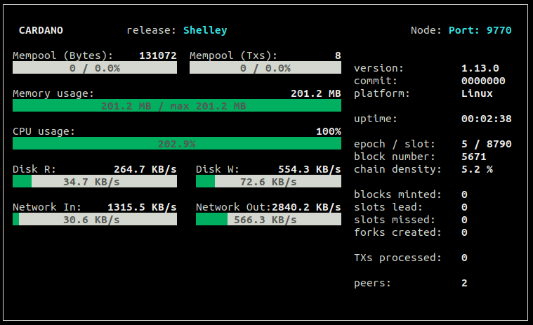

# Guide: How to build a Haskell Testnet Stakepool Node

## 🏁 0. Prerequisites

### 🎗 Minimum Setup Requirements

* **Operating system:** 64-bit Linux \(i.e. Ubuntu 20.04 LTS\)
* **Processor:** Dual core CPU
* **Memory:** 4GB RAM
* **Storage:** 20GB
* **Internet:** 24/7 broadband internet connection with speeds at least 1 Mbps.
* **Data Plan**: at least 100MB per hour. 72GB per month.
* **Power:** 24/7 electrical power
* **ADA balance:** at least 1000 fADA

### 🏋♂ Recommended Futureproof Setup

* **Operating system:** 64-bit Linux \(i.e. Ubuntu 20.04 LTS\)
* **Processor:** Quad core or better CPU
* **Memory:** 16GB RAM
* **Storage:** 500GB SSD with RAID
* **Internet:** Multiple 24/7 broadband internet connections with speeds at least 10 Mbps \(i.e. fiber + cellular 4G\)
* **Data Plan**: at least 100MB per hour. 72GB per month.
* **Power:** Redundant 24/7 electrical power with UPS
* **ADA balance:** more pledge is better, to be determined by **a0**, the pledge influence factor

For instructions on installing **Ubuntu**, refer to the following:



## 🏭 1. Install Cabal and GHC

**Press** Ctrl+Alt+T. This will launch a terminal window. 

First, update packages and install Ubuntu dependencies.

```text
sudo apt-get update -y
sudo apt-get upgrade -y
sudo apt-get -y install build-essential pkg-config libffi-dev libgmp-dev libssl-dev libtinfo-dev libsystemd-dev zlib1g-dev make g++ tmux git jq wget libncursesw5 -y
```

Install Cabal.

```text
wget https://downloads.haskell.org/~cabal/cabal-install-3.2.0.0/cabal-install-3.2.0.0-x86_64-unknown-linux.tar.xz
tar -xf cabal-install-3.2.0.0-x86_64-unknown-linux.tar.xz
rm cabal-install-3.2.0.0-x86_64-unknown-linux.tar.xz cabal.sig
mkdir -p ~/.local/bin
mv cabal ~/.local/bin/
```

Install GHC.

```text
wget https://downloads.haskell.org/~ghc/8.6.5/ghc-8.6.5-x86_64-deb9-linux.tar.xz
tar -xf ghc-8.6.5-x86_64-deb9-linux.tar.xz
rm ghc-8.6.5-x86_64-deb9-linux.tar.xz
cd ghc-8.6.5
./configure
sudo make install
```

Update PATH to include Cabal and GHC.

```text
echo PATH="~/.local/bin:$PATH" >> ~/.bashrc
source ~/.bashrc
```

Update cabal and verify the correct versions were installed successfully.

```text
cabal update
cabal -V
ghc -V
```


Cabal library should be version 3.2.0.0 and GHC should be version 8.6.5


## 🏗 2. Build the node from source code

Download source code and switch to the latest tag. In this case, use 1.13.0.

```text
cd ~
git clone https://github.com/input-output-hk/cardano-node.git
cd cardano-node
git fetch
git checkout 1.13.0
```

Build the cardano-node from source code.

```text
cabal install cardano-node cardano-cli
```


Building process may take a few minutes up to a few hours depending on your computer's processing power.


Copy **cardano-cli** and **cardano-node** files into bin directory.

```text
sudo cp $(find ~/.cabal/store -type f -name "cardano-cli") /usr/local/bin/cardano-cli
sudo cp $(find ~/.cabal/store -type f -name "cardano-node") /usr/local/bin/cardano-node
```

## 📐 3. Configure the node

Here you'll grab the config.json, genesis.json, and topology.json files needed to configure your node.

```text
cd ~
mkdir cardano-my-node
cd cardano-my-node
wget https://hydra.iohk.io/job/Cardano/cardano-node/cardano-deployment/latest-finished/download/1/ff-topology.json
wget https://hydra.iohk.io/job/Cardano/cardano-node/cardano-deployment/latest-finished/download/1/ff-genesis.json
wget https://hydra.iohk.io/job/Cardano/cardano-node/cardano-deployment/latest-finished/download/1/ff-config.json
```

Run the following to modify **config.json** and 

* update ViewMode to "LiveView"
* update TraceBlockFetchDecisions to "true"

```text
sed -i.bak -e "s/SimpleView/LiveView/g" -e "s/TraceBlockFetchDecisions\": false/TraceBlockFetchDecisions\": true/g" ff-config.json
```

Update **.bashrc** shell variables.

```
echo export CARDANO_NODE_SOCKET_PATH="$HOME/cardano-my-node/db/socket" >> ~/.bashrc
source ~/.bashrc
```

### 🔮 3.1 Configure the block-producer node and the relay nodes


A block producing node will be configured with various key-pairs needed for block generation \(cold keys, KES hot keys and VRF hot keys\). It can only connect to its relay nodes.



A relay node will not be in possession of any keys and will therefore be unable to produce blocks. It will be connected to its block-producing node, other relays and external nodes.



Create two new directories, one for each relay node.

```text
mkdir relaynode1
mkdir relaynode2
```

Copy the essential json files to each directory.

```text
cp ff-*.json relaynode1
cp ff-*.json relaynode2
```

Configure **ff-topology.json** file so that 

* only relay nodes connect to the public internet and your block-producing node
* the block-producing node can only connect to your relay nodes

Update relaynode1 with the following. Simply copy/paste.

```text
cat > relaynode1/ff-topology.json << EOF 
 {
    "Producers": [
      {
        "addr": "127.0.0.1",
        "port": 3000,
        "valency": 2
      },
      {
        "addr": "127.0.0.1",
        "port": 3002,
        "valency": 2
      },
      {
        "addr": "relays-new.ff.dev.cardano.org",
        "port": 3001,
        "valency": 2
      }
    ]
  }
EOF
```

Update relaynode2 with the following. Simply copy/paste.

```text
cat > relaynode2/ff-topology.json << EOF 
 {
    "Producers": [
      {
        "addr": "127.0.0.1",
        "port": 3000,
        "valency": 2
      },
      {
        "addr": "127.0.0.1",
        "port": 3001,
        "valency": 2
      },
      {
        "addr": "relays-new.ff.dev.cardano.org",
        "port": 3001,
        "valency": 2
      }
    ]
  }
EOF
```

Update the block-producer node with the following. Simply copy/paste.

```text
cat > ff-topology.json << EOF 
 {
    "Producers": [
      {
        "addr": "127.0.0.1",
        "port": 3001,
        "valency": 2
      },
      {
        "addr": "127.0.0.1",
        "port": 3002,
        "valency": 2
      }
    ]
  }
EOF
```


Valency tells the node how many connections to keep open. Only DNS addresses are affected. If value is 0, the address is ignored.



\*\*\*\*✨ **Port Forwarding Tip:** You'll need to forward ports 3001 and 3002 to your computer.


## 🤖 4. Create startup scripts

The startup script contains all the variables needed to run a cardano-node such as directory, port, db path, config file, and topology file.

For your **block-producing node**:

```text
cat > startBlockProducingNode.sh << EOF 
DIRECTORY=~/cardano-my-node
PORT=3000
HOSTADDR=127.0.0.1
TOPOLOGY=\${DIRECTORY}/ff-topology.json
DB_PATH=\${DIRECTORY}/db
SOCKET_PATH=\${DIRECTORY}/db/socket
CONFIG=\${DIRECTORY}/ff-config.json
cardano-node run --topology \${TOPOLOGY} --database-path \${DB_PATH} --socket-path \${SOCKET_PATH} --host-addr \${HOSTADDR} --port \${PORT} --config \${CONFIG}
EOF

```

For your **relaynode1**:

```text
cat > relaynode1/startRelayNode1.sh << EOF 
DIRECTORY=~/cardano-my-node/relaynode1
PORT=3001
HOSTADDR=127.0.0.1
TOPOLOGY=\${DIRECTORY}/ff-topology.json
DB_PATH=\${DIRECTORY}/db
SOCKET_PATH=\${DIRECTORY}/db/socket
CONFIG=\${DIRECTORY}/ff-config.json
cardano-node run --topology \${TOPOLOGY} --database-path \${DB_PATH} --socket-path \${SOCKET_PATH} --host-addr \${HOSTADDR} --port \${PORT} --config \${CONFIG}
EOF
```

For your **relaynode2**:

```text
cat > relaynode2/startRelayNode2.sh << EOF 
DIRECTORY=~/cardano-my-node/relaynode2
PORT=3002
HOSTADDR=127.0.0.1
TOPOLOGY=\${DIRECTORY}/ff-topology.json
DB_PATH=\${DIRECTORY}/db
SOCKET_PATH=\${DIRECTORY}/db/socket
CONFIG=\${DIRECTORY}/ff-config.json
cardano-node run --topology \${TOPOLOGY} --database-path \${DB_PATH} --socket-path \${SOCKET_PATH} --host-addr \${HOSTADDR} --port \${PORT} --config \${CONFIG}
EOF
```


**Pro tip**: 🎆 If you want your relay nodes to be hosted on a different server, make sure to change **HOSTADDR** from `127.0.0.1 to 0.0.0.0`  and update **ff-topology.json** where appropriate.


## ✅ 5. Start the node

**Press** Ctrl+Alt+T. This will launch a terminal window. Do this 3 times for 3 terminals. 

Add execute permissions to the script and begin syncing the ADA blockchain!

Run each in a separate terminal.

```text
cd ~/cardano-my-node
chmod +x startBlockProducingNode.sh
./startBlockProducingNode.sh
```

```text
cd ~/cardano-my-node
chmod +x relaynode1/startRelayNode1.sh
./relaynode1/startRelayNode1.sh
```

```text
cd ~/cardano-my-node
chmod +x relaynode2/startRelayNode2.sh
./relaynode2/startRelayNode2.sh
```




Congratulations! Your node is running successfully now. Let it sync up.


## ⚙ 6. Generate block-producer keys

Make a KES key pair.

```text
cd ~/cardano-my-node
cardano-cli shelley node key-gen-KES \
    --verification-key-file kes.vkey \
    --signing-key-file kes.skey
```


KES \(key evolving signature\) keys are created to secure your stakepool against hackers who might compromise your keys. On mainnet, these will be regenerated every 90 days.


Make a directory to store your cold keys

```text
mkdir ~/cold-keys
pushd ~/cold-keys
```

Make a set of cold keys and create the cold counter file.

```text
cardano-cli shelley node key-gen \
    --cold-verification-key-file node.vkey \
    --cold-signing-key-file node.skey \
    --operational-certificate-issue-counter coldcounter
```


Be sure to **back up your all your keys** to another secure storage device. 


Copy the node.vkey to your node directory

```text
cp ~/cold-keys/node.vkey ~/cardano-my-node
```


Currently on testnet, delegators who delegate via CLI tools will require the ****data contained in `node.vkey` in order to delegate to your stakepool. You can share this file. DO NOT accidentally share the secret key,`node.skey` file.


Determine the number of slots per KES period from the genesis file.

```text
pushd +1
cat ff-genesis.json | grep KESPeriod
```

Example **KES Period** output:

> "slotsPerKESPeriod": 3600,

Determine the KES period.

```text
cardano-cli shelley query tip --testnet-magic 42
```

Example **query tip** output:

> Tip \(SlotNo {unSlotNo = 507516}\) ...

Find the tip number\(e.g. 507516\) and divide by one period which is 3600 slots.

```text
expr 507516 / 3600
```

Example **expr calculation** output:

> 140

With this information, now you can generate a operational certificate for your pool.

```text
cardano-cli shelley node issue-op-cert \
    --kes-verification-key-file kes.vkey \
    --cold-signing-key-file ~/cold-keys/node.skey \
    --operational-certificate-issue-counter ~/cold-keys/coldcounter \
    --kes-period 140 \
    --out-file opcert
```


You are required to regenerate the hot keys and issue a new operational certificate, a process called rotating the KES keys, when the hot keys expire.

**Mainnet**: KES keys will be valid for 120 rotations or 90 days

**Testnet**: KES keys will be valid for 120 rotations or 5 days



When it's time to issue a new operational certificate, update your KES period value and run the following:

```text
chmod u+rwx ~/cold-keys
cardano-cli shelley node issue-op-cert \
    --kes-verification-key-file kes.vkey \
    --cold-signing-key-file ~/cold-keys/node.skey \
    --operational-certificate-issue-counter ~/cold-keys/coldcounter \
    --kes-period <new kes period = old period + 120> \
    --out-file opcert
chmod a-rwx ~/cold-keys
```



**Optional tip:** Save this step until after you finish the guide.

With your hot keys created, you can remove access to the cold keys for improved security. This protects against accidental deletion, editing, or access. 

To lock,

```text
chmod a-rwx ~/cold-keys
```

To unlock,

```text
chmod u+rwx ~/cold-keys
```


Make a VRF key pair.

```text
cardano-cli shelley node key-gen-VRF \
    --verification-key-file vrf.vkey \
    --signing-key-file vrf.skey
```

On your node's terminal window, stop your node by typing the letter `q`

Update your startup script with the new **KES, VRF and Operation Certificate.**

```text
cd ~/cardano-my-node
cat > startBlockProducingNode.sh << EOF 
DIRECTORY=~/cardano-my-node
PORT=3000
HOSTADDR=127.0.0.1
TOPOLOGY=\${DIRECTORY}/ff-topology.json
DB_PATH=\${DIRECTORY}/db
SOCKET_PATH=\${DIRECTORY}/db/socket
CONFIG=\${DIRECTORY}/ff-config.json
KES=\${DIRECTORY}/kes.skey
VRF=\${DIRECTORY}/vrf.skey
CERT=\${DIRECTORY}/opcert
cardano-node run --topology \${TOPOLOGY} --database-path \${DB_PATH} --socket-path \${SOCKET_PATH} --host-addr \${HOSTADDR} --port \${PORT} --config \${CONFIG} --shelley-kes-key \${KES} --shelley-vrf-key \${VRF} --shelley-operational-certificate \${CERT}
EOF
```


To operate a stakepool, two sets of keys are needed: they KES key \(hot\) and the cold key. Cold keys generate new hot keys periodically.


Now start the new block-producing node.

```text
cd ~/cardano-my-node
./startBlockProducingNode.sh
```

## 🔐 7. Setup payment and staking keys

First, obtain the protocol-parameters.

```text
cardano-cli shelley query protocol-parameters \
    --testnet-magic 42 \
    --out-file params.json
```

Create a new payment key pair:  `pay.skey` & `pay.vkey`

```text
cardano-cli shelley address key-gen \
    --verification-key-file pay.vkey \
    --signing-key-file pay.skey
```

 Create a new stake address key pair: `stake.skey` & `stake.vkey`

```text
cardano-cli shelley stake-address key-gen \
    --verification-key-file stake.vkey \
    --signing-key-file stake.skey
```

Create your stake address from the stake address verification key and store it in `stake`

```text
cardano-cli shelley stake-address build \
    --staking-verification-key-file stake.vkey \
    --out-file stake.addr \
    --testnet-magic 42
```

Build a payment address for the payment key `pay.vkey` which will delegate to the stake address, `stake.vkey`

```text
cardano-cli shelley address build \
    --payment-verification-key-file pay.vkey \
    --staking-verification-key-file stake.vkey \
    --out-file pay.addr \
    --testnet-magic 42
```


Payment keys are used to send and receive payments and staking keys are used to manage stake delegations.


Next step is to fund your payment address from a faucet or other address.

You can find your payment address in `pay.addr`

```text
cat pay.addr
```


[The Shelly Testnet Faucet](https://testnets.cardano.org/en/shelley/tools/faucet/) can deliver up to 100,000 fADA per 24 hours.


After funding your account, check your payment address balance.


 Before continuing, your nodes must be fully synchronized to the blockchain. Otherwise, you won't see your funds.


```text
cardano-cli shelley query utxo \
    --address $(cat pay.addr) \
    --testnet-magic 42
```

You should see output similar to this. This is your unspent transaction output \(UXTO\).

```text
                           TxHash                                 TxIx        Lovelace
----------------------------------------------------------------------------------------
100322a39d02c2ead....                                              0        100000000
```

## 📄 8. Register your stakepool

Create a registration certificate for your stakepool.

```text
cardano-cli shelley stake-pool registration-certificate \
    --stake-pool-verification-key-file node.vkey \
    --vrf-verification-key-file vrf.vkey \
    --pool-pledge 1000000000 \
    --pool-cost 10000000 \
    --pool-margin 0.07 \
    --reward-account-verification-key-file stake.vkey \
    --pool-owner-stake-verification-key-file stake.vkey \
    --out-file pool.cert \
    --testnet-magic 42
```


Here we are pledging 1000 ADA with a fixed pool cost of 10 ADA and a pool margin of 7%. 


Pledge stake to your stakepool.

```text
cardano-cli shelley stake-address delegation-certificate \
    --staking-verification-key-file stake.vkey \
    --stake-pool-verification-key-file node.vkey \
    --out-file deleg.cert
```


 This creates a delegation certificate which delegates funds from all stake addresses associated with key `stake.vkey` to the pool belonging to cold key `node.vkey`


You need to find the **tip** of the blockchain to set the **ttl** parameter properly.

```
cardano-cli shelley query tip --testnet-magic 42
```

Example **tip** output:

> `Tip (SlotNo {unSlotNo = 510000})`


You will want to set your **ttl** value greater than the current tip. In this example, we use 2000000. 


Calculate the fee for a stakepool registration transaction.

```text
cardano-cli shelley transaction calculate-min-fee \
    --tx-in-count 1 \
    --tx-out-count 1 \
    --ttl 2000000 \
    --testnet-magic 42 \
    --signing-key-file pay.skey \
    --signing-key-file ~/cold-keys/node.skey \
    --signing-key-file stake.skey \
    --certificate pool.cert \
    --certificate deleg.cert \
    --protocol-params-file params.json

#> runTxCalculateMinFee: 184861
```

Find the deposit fee for a pool.

```text
cat ff-genesis.json | grep poolDeposit
```

Example **poolDeposit** output:

> "poolDeposit": 500000000,

Find your unspent output \(UTXO\).

```text
cardano-cli shelley query utxo \
    --address $(cat pay.addr) \
    --testnet-magic 42
```

Example of **query utxo** output:

```text
                 TxHash                         Ix        Lovelace
--------------------------------------------------------------------
3ac393d...                                        0      999428691 
```

Calculate the change amount.

```text
expr 999428691 - 500000000 - 184861
```

Example **change amount** output:

> 499243830

Build the transaction.


Pay close attention to **tx-in**. The data should in the format`<TxHash>#<Ix number>`from above.


```text
cardano-cli shelley transaction build-raw \
    --tx-in 3ac393d...#0 \
    --tx-out $(cat pay.addr)+499243830\
    --ttl 2000000 \
    --fee 184861\
    --tx-body-file tx.raw \
    --certificate pool.cert \
    --certificate deleg.cert
```

Sign the transaction.

```text
cardano-cli shelley transaction sign \
    --tx-body-file tx.raw \
    --signing-key-file pay.skey \
    --signing-key-file ~/cold-keys/node.skey \
    --signing-key-file stake.skey \
    --testnet-magic 42 \
    --tx-file tx.signed
```

Send the transaction.

```text
cardano-cli shelley transaction submit \
    --tx-file tx.signed \
    --testnet-magic 42
```

## 🐣 9. Locate your Stakepool ID and verify everything is working 

Your stakepool ID can be computed with:

```text
cardano-cli shelley stake-pool id --verification-key-file node.vkey
```

Now that you have your stakepool ID,  verify it's included in the blockchain.

```text
cardano-cli shelley query ledger-state --testnet-magic 42 | grep poolPubKey | grep <your stakepool ID>
```


A non-empty string return means you're registered! 👏 


With your stakepool ID, now you can find your data on block explorers such as [https://ff.pooltool.io/](https://ff.pooltool.io/)


Congratulations! Your stakepool is registered and ready to accept delegations.


## 🎇 10. Checking Stakepool Rewards

After the epoch is over and assuming you successfully minted blocks, check with this:

```text
cardano-cli shelley query stake-address-info --address $(cat pay.addr) --testnet-magic 42
```

## 👏 11. Thank yous and reference material

Thanks to all Cardano hodlers, buidlers, stakers, and pool operators for making the better future a reality.

For more information and official documentation, please refer to the following links:





