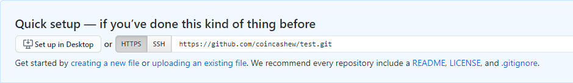
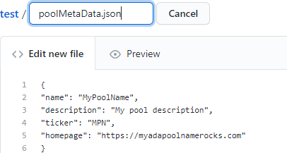
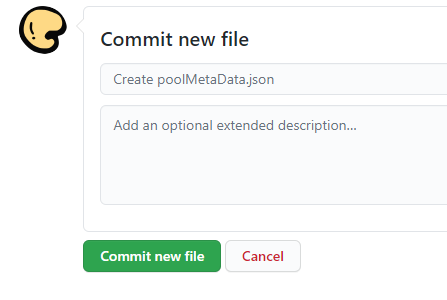

# How to upload poolMetaData.json to Github

## Quick steps to hosting your poolmetadata.json

1. Sign up for a Github account by visiting [https://github.com/](https://github.com/)
2. Create a **new repository** with a short name
3. Click Get started by "**creating a new file**"

1. Enter your file name as **poolMetaData.json** and paste in your **json** content.

1. Click **Commit new file**

1. Click your new file's name
2. Click on **Raw button**
3. Copy the URL into your clipboard

> Example: [https://raw.githubusercontent.com/coincashew/test/master/poolMetaData.json](https://raw.githubusercontent.com/coincashew/test/master/poolMetaData.json)

1. The URL must be shorter than 64 characters. Use [https://tinyurl.com/](https://tinyurl.com/) to shorten it.

> Example:  
> [https://tinyurl.com/MPNpooldata](https://tinyurl.com/MPNpooldata)

1. Use this tinyurl URL`--metadata-url` in your stakepool registration transaction.

