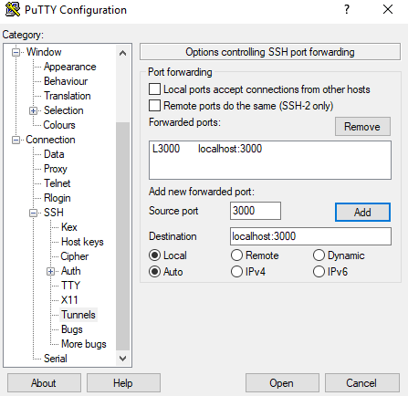

# Hardening an Ubuntu Server


Thank you for your support and kind messages! It really energizes us to keep creating the best crypto guides. Use [cointr.ee to find our donation ](https://cointr.ee/coincashew)addresses and share your message. :pray:&#x20;


## :robot: Prerequisites

* Ubuntu Server or Ubuntu Desktop installed
* SSH server installed
* a SSH client or terminal window access

In case you need to install SSH server, refer to:



In case you need a SSH client for your operating system, refer to:



## :man\_mage: Creating a Non-root User with sudo Privileges


Make a habit of logging to your server using a non-root account. This will prevent the accidental deletion of files if you make a mistake. For instance, the command rm can wipe your entire server if run incorrectly using by a root user.



****:fire: **Tip**: Do NOT routinely use the root account. Use `su` or `sudo`, always.


SSH to your server

```bash
ssh username@server.public.ip.address
# example
# ssh myUsername@77.22.161.10
```

Create a new user called cardano

```
useradd -m -s /bin/bash cardano
```

Set the password for cardano user

```
passwd cardano
```

Add cardano to the sudo group

```
usermod -aG sudo cardano
```

## ****:lock\_with\_ink\_pen: **Disabling SSH Password Authentication and Using SSH Keys Only**


The basic rules of hardening SSH are:

* No password for SSH access (use private key)
* Don't allow root to SSH (the appropriate users should SSH in, then `su` or `sudo`)
* Use `sudo` for users so commands are logged
* Log unauthorized login attempts (and consider software to block/ban users who try to access your server too many times, like fail2ban)
* Lock down SSH to only the ip range your require (if you feel like it)


Create a new SSH key pair on your local machine. Run this on your local machine. You will be asked to type a file name in which to save the key. This will be your **keyname**.

Your choice of [ED25519 or RSA](https://goteleport.com/blog/comparing-ssh-keys/) public key algorithm.



```
ssh-keygen -t ed25519
```



```bash
ssh-keygen -t rsa -b 4096
```



Transfer the public key to your remote node. Update the **keyname**.

```bash
ssh-copy-id -i $HOME/.ssh/<keyname>.pub cardano@server.public.ip.address
```

Login with your new cardano user

```
ssh cardano@server.public.ip.address
```

Disable root login and password based login. Edit the `/etc/ssh/sshd_config file`

```
sudo nano /etc/ssh/sshd_config
```

Locate **ChallengeResponseAuthentication** and update to no

```
ChallengeResponseAuthentication no
```

Locate **PasswordAuthentication** update to no

```
PasswordAuthentication no 
```

Locate **PermitRootLogin **and update to prohibit-password

```
PermitRootLogin prohibit-password
```

Locate **PermitEmptyPasswords **and update to no

```
PermitEmptyPasswords no
```

**Optional**: Locate **Port **and customize it your** random **port.


Use a **random **port # from 1024 thru 49141. [Check for possible conflicts. ](https://en.wikipedia.org/wiki/List\_of\_TCP\_and\_UDP\_port\_numbers)


```bash
Port <port number>
```

Validate the syntax of your new SSH configuration.

```
sudo sshd -t
```

If no errors with the syntax validation, restart the SSH process.

```
sudo systemctl restart sshd
```

Verify the login still works



```
ssh cardano@server.public.ip.address
```



```bash
ssh cardano@server.public.ip.address -p <custom port number>
```




Alternatively, add the `-p <port#>` flag if you used a custom SSH port.

```bash
ssh -i <path to your SSH_key_name.pub> cardano@server.public.ip.address
```


**Optional**: Make logging in easier by updating your local ssh config.

To simplify the ssh command needed to log in to your server, consider updating your local `$HOME/.ssh/config` file:

```bash
Host cardano-server
  User cardano
  HostName <server.public.ip.address>
  Port <custom port number>
```

This will allow you to log in with `ssh cardano-server` rather than needing to pass through all ssh parameters explicitly.

## ****:robot: **Updating Your System**


It's critically important to keep your system up-to-date with the latest patches to prevent intruders from accessing your system.


```bash
sudo apt-get update -y && sudo apt-get upgrade -y
sudo apt-get autoremove
sudo apt-get autoclean
```

Enable automatic updates so you don't have to manually install them.

```
sudo apt-get install unattended-upgrades
sudo dpkg-reconfigure -plow unattended-upgrades
```


By default when enabled, the `unattended-upgrades` service only installs security updates automatically. To configure unattended upgrades, edit the `/etc/apt/apt.conf.d/50unattended-upgrades` file. For more details, see [How to Setup & Configure Unattended Upgrades on Ubuntu 20.04](https://www.linuxcapable.com/how-to-setup-configure-unattended-upgrades-on-ubuntu-20-04/), for example.


## :teddy\_bear: Disabling the root Account

System admins should not frequently log in as root in order to maintain server security. Instead, you can use sudo execute that require low-level privileges.

```bash
# To disable the root account, simply use the -l option.
sudo passwd -l root
```

```bash
# If for some valid reason you need to re-enable the account, simply use the -u option.
sudo passwd -u root
```

## :tools: Configuring Two Factor Authentication for SSH


SSH, the secure shell, is often used to access remote Linux systems. Because we often use it to connect with computers containing important data, it’s recommended to add another security layer. Here comes the two factor authentication (_2FA_).


```
sudo apt install libpam-google-authenticator -y
```

To make SSH use the Google Authenticator PAM module, edit the `/etc/pam.d/sshd` file:

```
sudo nano /etc/pam.d/sshd 
```

Add the follow line:

```
auth required pam_google_authenticator.so
```

Now you need to restart the `sshd` daemon using:

```
sudo systemctl restart sshd.service
```

Modify `/etc/ssh/sshd_config`&#x20;

```
sudo nano /etc/ssh/sshd_config
```

Locate **ChallengeResponseAuthentication **and update to yes

```
ChallengeResponseAuthentication yes
```

Locate **UsePAM **and update to yes

```
UsePAM yes
```

Save the file and exit.

Run the **google-authenticator** command.

```
google-authenticator
```

It will ask you a series of questions, here is a recommended configuration:

* Make tokens “time-base”": yes
* Update the `.google_authenticator` file: yes
* Disallow multiple uses: yes
* Increase the original generation time limit: no
* Enable rate-limiting: yes

You may have noticed the giant QR code that appeared during the process, underneath are your emergency scratch codes to be used if you don’t have access to your phone: write them down on paper and keep them in a safe place.

Now, open Google Authenticator on your phone and add your secret key to make two factor authentication work.


**Note**: If you are enabling 2FA on a remote machine that you access over SSH you need to follow **steps 2 and 3** of [this tutorial](https://www.digitalocean.com/community/tutorials/how-to-set-up-multi-factor-authentication-for-ssh-on-ubuntu-18-04) to make 2FA work.


## :jigsaw: Securing Shared Memory


One of the first things you should do is secure the shared [memory](https://www.lifewire.com/what-is-random-access-memory-ram-2618159) used on the system. If you're unaware, shared memory can be used in an attack against a running service. Because of this, secure that portion of system memory.&#x20;

To learn more about secure shared memory, read this [techrepublic.com article](https://www.techrepublic.com/article/how-to-enable-secure-shared-memory-on-ubuntu-server/).



### One exceptional case

There may be a reason for you needing to have that memory space mounted in read/write mode (such as a specific server application like **Chrome **that requires such access to the shared memory or standard applications like Google Chrome). In this case, use the following line for the fstab file with instructions below.

```
none /run/shm tmpfs rw,noexec,nosuid,nodev 0 0
```

The above line will mount the shared memory with read/write access but without permission to execute programs, change the UID of running programs, or to create block or character devices in the namespace. This a net security improvement over default settings.

### Use with caution

With some trial and error, you may discover some applications(**like Chrome**) do not work with shared memory in read-only mode. For the highest security and if compatible with your applications, it is a worthwhile endeavor to implement this secure shared memory setting.

Source: [techrepublic.com](https://www.techrepublic.com/article/how-to-enable-secure-shared-memory-on-ubuntu-server/)


Edit `/etc/fstab`

```
sudo nano /etc/fstab
```

Insert the following line to the bottom of the file and save/close.

```
tmpfs	/run/shm	tmpfs	ro,noexec,nosuid	0 0
```

Reboot the node in order for changes to take effect.

```
sudo reboot
```

## ****:chains: **Installing fail2ban**


Fail2ban is an intrusion-prevention system that monitors log files and searches for particular patterns that correspond to a failed login attempt. If a certain number of failed logins are detected from a specific IP address (within a specified amount of time), fail2ban blocks access from that IP address.


```
sudo apt-get install fail2ban -y
```

Edit a config file that monitors SSH logins.

```
sudo nano /etc/fail2ban/jail.local
```

Add the following lines to the bottom of the file.


:fire: **Whitelisting IP address tip**: The `ignoreip` parameter accepts IP addresses, IP ranges or DNS hosts that you can specify to be allowed to connect. This is where you want to specify your local machine, local IP range or local domain, separated by spaces.

```
# Exampleignoreip = 192.168.1.0/24 127.0.0.1/8 
```


```bash
[sshd]
enabled = true
port = <22 or your random port number>
filter = sshd
logpath = /var/log/auth.log
maxretry = 3
# whitelisted IP addresses
ignoreip = <list of whitelisted IP address, your local daily laptop/pc>
```

Save/close file.&#x20;

Restart fail2ban for settings to take effect.

```
sudo systemctl restart fail2ban
```

## ****:bricks: **Configuring Your Firewall**

The standard UFW firewall can be used to control network access to your node.

With any new installation, ufw is disabled by default. Enable it with the following settings.

* Port 22 (or your random port #) TCP for SSH connection
* Port 123 UDP for chrony ntp
* Port 6000 TCP for p2p traffic
* Port 3000 TCP for Grafana web server (if applicable)
* Port 9100 tcp for Prometheus node data
* Port 12798 tcp for Prometheus cardano-node metrics data

```bash
# By default, deny all incoming and outgoing traffic
sudo ufw default deny incoming
sudo ufw default allow outgoing
# Allow ssh access
sudo ufw allow ssh #<port 22 or your random ssh port number>/tcp
# Allow cardano-node p2p port
sudo ufw allow 6000/tcp
# Enable firewall
sudo ufw enable
```

```bash
# Verify status
sudo ufw status numbered
```


Do not expose Grafana (port 3000) and Prometheus endpoint (port 9100 and 12798) to the public internet as this invites a new attack surface!&#x20;


**Better idea - SSH tunnel to Grafana server**

Setup a SSH tunnel with the following command:

```
ssh -L 3000:localhost:3000 <user>@<your-server-ip-or-dns>
```

Alternatively, If using Putty for SSHing, you can configure the tunnel as follows. Make sure to click "Add" and save your settings.




Now you can access the Grafana server from your local machine's browser by visiting http://localhost:3000


Only open the following ports on nodes behind a network firewall. This is not required if using the above SSH tunnel method.

****:fire: **It is dangerous to open these ports on a VPS/cloud node.**

```bash
# Allow grafana web server port
sudo ufw allow 3000/tcp
# Allow prometheus endpoint port
sudo ufw allow 9100/tcp
# Allow prometheus cardano-node metric data port
sudo ufw allow 12798/tcp
```

Confirm the settings are in effect.&#x20;

> ```csharp
>      To                         Action      From
>      --                         ------      ----
> [ 1] 22/tcp                     ALLOW IN    Anywhere
> [ 2] 3000/tcp                   ALLOW IN    Anywhere
> [ 3] 6000/tcp                   ALLOW IN    Anywhere
> [ 4] 22/tcp (v6)                ALLOW IN    Anywhere (v6)
> [ 5] 3000/tcp (v6)              ALLOW IN    Anywhere (v6)
> [ 6] 6000/tcp (v6)              ALLOW IN    Anywhere (v6)
> ```

**\[ Optional but recommended ]** Whitelisting (or permitting connections from a specific IP) can be setup via the following command.

```bash
sudo ufw allow from <your local daily laptop/pc>
# Example
# sudo ufw allow from 192.168.50.22
```


&#x20;:confetti\_ball: **Port Forwarding Tip:** You'll need to forward and open ports to your validator. Verify it's working with [https://www.yougetsignal.com/tools/open-ports/](https://www.yougetsignal.com/tools/open-ports/) or [https://canyouseeme.org/](https://canyouseeme.org) .


### :bricks: Additional Hardening Rules for a Block-producing Node

Only your Relay Node(s) should be permitted access to your Block Producer Node.

```bash
sudo ufw allow proto tcp from <RELAY NODE IP> to any port <BLOCK PRODUCER PORT>
# Example
# sudo ufw allow proto tcp from 18.58.3.31 to any port 6000
```

### :bricks: Additional Hardening Rules for Relay Nodes

In order to protect your Relay Node(s) from a novel "DoS/Syn" attack, [**Michael Fazio**](https://github.com/michaeljfazio) created iptables entry which restricts connections to a given destination port to 5 connections from the same IP.&#x20;

Replace `<RELAY NODE PORT>` with your public relay port, replace the 5 with your preferred connection limit.

```bash
sudo iptables -I INPUT -p tcp -m tcp --dport <RELAY NODE PORT> --tcp-flags FIN,SYN,RST,ACK SYN -m connlimit --connlimit-above 5 --connlimit-mask 32 --connlimit-saddr -j REJECT --reject-with tcp-reset
```


Set the connection limit high enough so that your internal relay/block producer node topology remains functional.


You can check you current connections with a sorted list. Change the relay node port number, if needed.

```bash
sudo netstat -enp | grep ":6000" | awk {'print $5'} | cut -d ':' -f 1 | sort | uniq -c | sort
```

## :telescope: Verifying Listening Ports

If you want to maintain a secure server, you should validate the listening network ports every once in a while. This will provide you essential information about your network.

```
netstat -tulpn
```

```
ss -tulpn
```


Congrats on completing the guide. :sparkles:&#x20;

Did you find our guide useful? Send us a signal with a tip and we'll keep updating it.&#x20;

It really energizes us to keep creating the best crypto guides.&#x20;

Use [cointr.ee to find our donation ](https://cointr.ee/coincashew)addresses. :pray:&#x20;

Any feedback and all pull requests much appreciated. :first\_quarter\_moon\_with\_face:&#x20;

Hang out and chat with fellow stake pool operators on Discord @

[https://discord.gg/w8Bx8W2HPW](https://discord.gg/w8Bx8W2HPW) :smiley:&#x20;

Hang out and chat with our stake pool community on Telegram @ [https://t.me/coincashew](https://t.me/coincashew)


## :rocket: References









[https://gist.github.com/lokhman/cc716d2e2d373dd696b2d9264c0287a3#file-ubuntu-hardening-md](https://gist.github.com/lokhman/cc716d2e2d373dd696b2d9264c0287a3#file-ubuntu-hardening-md)




