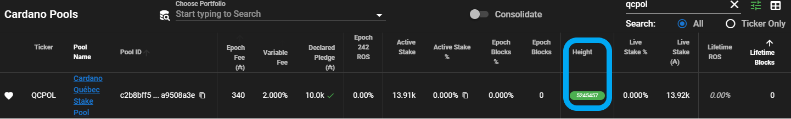

# Configuring Slot Leader Calculations


:fire: **Hot tip**: You can calculate your slot leader schedule, which tells you when it's your stake pools turn to mint a block. This can help you know what time is best to schedule maintenance on your stake pool. It can also help verify your pool is minting blocks correctly when it is your pool's turn. This is to be setup and run on the block producer node.




Since version 1.34, it is possible to check the slot leadership schedule for the **current** and **next** epoch using cardano-cli.


Next epoch's leadership schedule becomes available 1.5 days (36 hours) before the end of the current epoch.


***

**Next epoch's leadership schedule** is obtained with the following:

```bash
cardano-cli query leadership-schedule \
--mainnet \
--genesis $NODE_HOME/shelley-genesis.json \
--stake-pool-id $(cat $NODE_HOME/stakepoolid.txt) \
--vrf-signing-key-file $NODE_HOME/vrf.skey \
--next
```

***

**Current epoch's leadership schedule** is obtained with the following:

```bash
cardano-cli query leadership-schedule \
--mainnet \
--genesis $NODE_HOME/shelley-genesis.json \
--stake-pool-id $(cat $NODE_HOME/stakepoolid.txt) \
--vrf-signing-key-file $NODE_HOME/vrf.skey \
--current
```

Example leadership schedule output:

```ada
SlotNo                          UTC Time
-------------------------------------------------------------
     4073                   2021-12-29 17:26:54.998001755 UTC
     4126                   2021-12-29 17:27:00.298001755 UTC
     4206                   2021-12-29 17:27:08.298001755 UTC
     4256                   2021-12-29 17:27:13.298001755 UTC
     4309                   2021-12-29 17:27:18.598001755 UTC
     4376                   2021-12-29 17:27:25.298001755 UTC
     4423                   2021-12-29 17:27:29.998001755 UTC
     4433                   2021-12-29 17:27:30.998001755 UTC
```


:repeat: **Automate the process with Cronjob:**


The automation of this process will work with the following method, as said, next epoch blocks can be checked 1.5 days before the start of the next epoch or at the 75% of the current epoch's completion.\
What the script will do, is to calculate the the correct day and hour to run the command, then wait until it is possible to do that and once the selected time comes, run the check listed below.\
Once finished, it will redirect the output into a log file that can be analyzed.



Keep in mind that running the leadership-schedule command, listed below and used by the script, with the cardano-node at the same time, will use approximately 17GB of RAM at the time of writing this guide (April 2022).

The possible solutions to avoid a node crash are:

* Increase the RAM of the node
* [Increase the SWAP partition of the node](../part-v-tips/increasing-swap-file.md)



Credits to [Techs2help](https://techs2help.ch) for developing the [script](https://github.com/Techs2Help/leaderScheduleCheck\_cron).



Create the `leaderScheduleCheck.sh` script file in the block producer (script can also be run on a relay node but vrf.skey needs to be exported there) and paste the following code inside of it:

```bash
#!/bin/bash

# cardano node directory
DIRECTORY=

if [[ ! -d "$DIRECTORY/logs" ]]; then mkdir $DIRECTORY/logs; fi 

# create a pid, this way you can ps aux | grep leaderScheduleCheck.sh to see if script is running     
echo $$ > "$DIRECTORY/logs/leaderScheduleCheck.pid"; 

# Set your own stake pool ID
STAKE_POOL_ID=""

TESTNET="testnet"
MAINNET="mainnet"

# Set the network magic value as needed for the testnet environment that you want to use
# For details on available testnet environments, see https://book.world.dev.cardano.org/environments.html
MAGICNUMBER="1"

# Edit variable with $TESTNET for Testnet and $MAINNET for Mainnet
network=$TESTNET

# check for vrf.skey presence
if [[ ! -f "$DIRECTORY/vrf.skey" ]]; then echo "vrf.skey not found"; exit 127; fi

CCLI=$(which cardano-cli)
if [[ -z $CCLI ]]; then echo "cardano-cli command cannot be found, exiting..."; exit 127; fi

JQ=$(which jq)
if [[ -z $JQ ]]; then echo "jq command cannot be found, exiting..."; exit 127; fi

read -ra BYRON_GENESIS <<< "$(jq -r '[ .startTime, .protocolConsts.k, .blockVersionData.slotDuration ] |@tsv' < $DIRECTORY/$network-byron-genesis.json)"
if [[ -z $BYRON_GENESIS ]]; then echo "BYRON GENESIS config file not loaded correctly"; exit 127; fi

network_magic=""
if [ $network = $TESTNET ]; then
    network_magic="--testnet-magic $MAGICNUMBER"
elif [ $network = $MAINNET ]; then
    network_magic="--mainnet"
else
    echo "Incorrect network selected, please use $TESTNET or $MAINNET network type"; exit 1
fi


# Check that node is synced
function isSynced(){
    isSynced=false

    sync_progress=$($CCLI query tip $network_magic | jq -r ".syncProgress")
    if [[ $sync_progress == "100.00" ]]; then
        isSynced=true
    fi

    echo $isSynced
}

# Get current epoch
function getCurrentEpoch(){
    echo $($CCLI query tip $network_magic | jq -r ".epoch")
}

# Get epoch start time based on current one
function getEpochStartTime(){
    byron_genesis_start_time=${BYRON_GENESIS[0]}
    byron_k=${BYRON_GENESIS[1]}
    byron_epoch_length=$(( 10 * byron_k ))
    byron_slot_length=${BYRON_GENESIS[2]}

    echo $(( $byron_genesis_start_time + (($(getCurrentEpoch) * $byron_epoch_length * $byron_slot_length) / 1000) ))
}

# Get epoch end time based on the current one
function getEpochEndTime(){
    #calculate currentEpoch Start time + 5 days of epoch duration - 10 minutes(600s) to not overlap with next epoch
    echo $(( $(getEpochStartTime)+(5*86400)-(600) ))
}

# Get current timestamp
function getCurrentTime(){
    echo $(printf '%(%s)T\n' -1)
}

# Convert timestamps to UTC time
function timestampToUTC(){
    timestamp=$1
    echo $(date +"%D %T" -ud @$timestamp)
}

# Find the correct time to run the leaderslot check command
function getLeaderslotCheckTime(){
    epochStartTime=$(getEpochStartTime)
    epochEndTime=$(getEpochEndTime)

    # epoch completion percent to check for --next epoch leaderslots
    percentage=75
    checkTimestamp=$(( $epochStartTime+($percentage*($epochEndTime-$epochStartTime)/100) ))

    echo $checkTimestamp
}

# Function to make the script sleep until check need to be executed
function sleepUntil(){
    sleepSeconds=$1
    if [[ $sleepSeconds -gt 0 ]]; then
        echo "Script is going to sleep for: $sleepSeconds seconds"
        sleep $sleepSeconds
    fi
}

# Check leaderschedule of next epoch
function checkLeadershipSchedule(){
    next_epoch=$(( $(getCurrentEpoch)+1 ))
    currentTime=$(getCurrentTime)

    echo "Check is running at: $(timestampToUTC $currentTime) for epoch: $next_epoch"
    $CCLI query leadership-schedule $network_magic --genesis "$DIRECTORY/$network-shelley-genesis.json" --stake-pool-id $STAKE_POOL_ID --vrf-signing-key-file "$DIRECTORY/vrf.skey" --next > "$DIRECTORY/logs/leaderSchedule_$next_epoch.txt"
}

if [ isSynced ];then
    echo "Current epoch: $(getCurrentEpoch)"

    epochStartTimestamp=$(getEpochStartTime)
    echo "Epoch start time: $(timestampToUTC $epochStartTimestamp)"

    epochEndTimestamp=$(getEpochEndTime)
    echo "Epoch end time: $(timestampToUTC $epochEndTimestamp)"

    currentTime=$(getCurrentTime)
    echo "Current cron execution time: $(timestampToUTC $currentTime)"

    timestampCheckLeaders=$(getLeaderslotCheckTime)
    echo "Next check time: $(timestampToUTC $timestampCheckLeaders)"

    timeDifference=$(( $timestampCheckLeaders-$currentTime ))
    if [ -f "$DIRECTORY/logs/leaderSchedule_$(( $(getCurrentEpoch)+1 )).txt" ]; then
                echo "Check already done, check logs for results"; exit 1
    elif [[ $timeDifference -gt 86400 ]]; then
                echo "Too early to run the script, wait for next cron scheduled job"; exit 1
    elif [[ $timeDifference -gt 0 ]] && [[ $timeDifference -le 86400 ]]; then
        sleepUntil $timeDifference
        echo "Check is starting on $(timestampToUTC $(getCurrentTime))"
            checkLeadershipSchedule
        echo "Script ended, schedule logged inside file: leaderSchedule_$(( $(getCurrentEpoch)+1 )).txt"
    elif [[ $timeDifference -lt 0 ]] && [ ! -f "$DIRECTORY/logs/leaderSchedule_$(( $(getCurrentEpoch)+1 )).txt" ]; then
                echo "Check is starting on $(timestampToUTC $(getCurrentTime))"
                checkLeadershipSchedule
                echo "Script ended, schedule logged inside file: leaderSchedule_$(( $(getCurrentEpoch)+1 )).txt"
    else
        echo "There were problems on running the script, check that everything is working fine"; exit 1
    fi
else
    echo "Node not fully synced."; exit 1
fi
```


Set the following variables with your data:

```bash
# cardano node directory, directory where all files needed for running a cardano-node are located
DIRECTORY=

# Set your own stake pool ID
STAKE_POOL_ID=""

# Set variable with $TESTNET for Testnet and $MAINNET for Mainnet
network=
```


Add execution permissions and test that the script is running without errors:

```bash
chmod +x leaderScheduleCheck.sh
./leaderScheduleCheck.sh
```


If everything is working correctly, an output as the follow will be presented:

> Current epoch: 199\
> Epoch start time: 04/14/22 20:20:16\
> Epoch end time: 04/19/22 20:10:16\
> Current cron execution time: 04/18/22 15:37:51\
> Next check time: 04/18/22 14:12:46\
> \[...] Cutted output cause it can vary based on time when the script is ran


Configure `Cronjob` to make the script run automatically:


To configure the job at the start of an epoch, keep in mind the following information:

* Epoch in MAINNET starts at 21:45 UTC


<!-- * Epoch in legacy TESTNET starts at 20:20 UTC -->

Find the time when the cronjob should start:


Cronjobs run based on local timezone, not on UTC hours. \\



Find timezone:

`timedatectl | grep "Time zone"`

Once you found your timezone, you need to understand when run the job (It isn't mandatory to run it at epoch's starting hour).\
Here is an example with a UTC+2 timezone for Mainnet:

> Epoch starting hour UTC: 21:45 Epoch starting hour for requested timezone: 23:45 Cronjob will be set to run at 23:45


Add cronjob and edit parameters based on your needs, `PATH`, `NODE_HOME`, `NODE_CONFIG`, `CARDANO_NODE_SOCKET_PATH`, `MM`, `HH`, `path_to_script` and `desired_log_folder`:

```bash
cat > $NODE_HOME/crontab-fragment.txt << EOF
# disable MTA use
MAILTO=""
# linux path, needed because cron doesn't know where to find cardano-cli
PATH=
# folder with cardano-node files
NODE_HOME=
# testnet or mainnet
NODE_CONFIG=
# path to the socket of cardano node, should be under db/ folder under NODE_HOME
CARDANO_NODE_SOCKET_PATH=

MM HH * * * path_to_script/leaderScheduleCheck.sh > desired_log_folder/leaderSchedule_logs.txt 2>&1
EOF
crontab -l | cat - ${NODE_HOME}/crontab-fragment.txt > ${NODE_HOME}/crontab.txt && crontab ${NODE_HOME}/crontab.txt
rm ${NODE_HOME}/crontab-fragment.txt
```



Once the cronjob is set, the script will be run every day and it will check if in the next 24H, it will be the correct time to run the command and see if there are scheduled blocks in the next epoch.\
For every epoch, there will be a file called leaderSchedule\_epoch.txt





[**CNCLI**](https://github.com/cardano-community/cncli) **by** [**BCSH**](https://bluecheesestakehouse.com)**,** [**SAND**](https://www.sandstone.io)**,** [**SALAD**](https://insalada.io)

A community-based `cardano-node` CLI tool. It's a collection of utilities to enhance and extend beyond those available with the `cardano-cli`.



:dna: **Installing the Binary**

```bash
###
### On blockproducer
###
RELEASETAG=$(curl -s https://api.github.com/repos/cardano-community/cncli/releases/latest | jq -r .tag_name)
VERSION=$(echo ${RELEASETAG} | cut -c 2-)
echo "Installing release ${RELEASETAG}"
curl -sLJ https://github.com/cardano-community/cncli/releases/download/${RELEASETAG}/cncli-${VERSION}-x86_64-unknown-linux-gnu.tar.gz -o /tmp/cncli-${VERSION}-x86_64-unknown-linux-gnu.tar.gz
```

```bash
sudo tar xzvf /tmp/cncli-${VERSION}-x86_64-unknown-linux-gnu.tar.gz -C /usr/local/bin/
```


**Confirming That CNCLI is Properly Installed**

Run the following command to check if cncli is correctly installed and available in your system `PATH` variable:

```
command -v cncli
```

It should return `/usr/local/bin/cncli`


:pick: **Running LeaderLog with stake-snapshot**

This command calculates a stake pool's expected slot list.

* `prev` and `current` logs are available as long as you have a synchronized database.
* `next` logs are only available 1.5 days (36 hours) before the end of the epoch.
* You need to use `poolStakeMark` and `activeStakeMark` for `next`, `poolStakeSet` and `activeStakeSet` for `current`, `poolStakeGo` and `activeStakeGo` for `prev`.


Example usage with the `stake-snapshot` approach for `next` epoch:



Run this command 1.5 days (36 hours) before the next epoch begins.




As of CNCLI v5.0.2, additional parameters are required for leaderlogs.

`--consensus tpraos` while in Alonzo era

`--consensus praos` after the Vasil HF



```bash
/usr/local/bin/cncli sync --host 127.0.0.1 --port 6000 --no-service

MYPOOLID=$(cat $NODE_HOME/stakepoolid.txt)
echo "LeaderLog - POOLID $MYPOOLID"

SNAPSHOT=$(/usr/local/bin/cardano-cli query stake-snapshot --stake-pool-id $MYPOOLID --mainnet)
POOL_STAKE=$(echo "$SNAPSHOT" | grep -oP '(?<=    "poolStakeMark": )\d+(?=,?)')
ACTIVE_STAKE=$(echo "$SNAPSHOT" | grep -oP '(?<=    "activeStakeMark": )\d+(?=,?)')
MYPOOL=`/usr/local/bin/cncli leaderlog --consensus tpraos --pool-id $MYPOOLID --pool-vrf-skey ${NODE_HOME}/vrf.skey --byron-genesis ${NODE_HOME}/byron-genesis.json --shelley-genesis ${NODE_HOME}/shelley-genesis.json --pool-stake $POOL_STAKE --active-stake $ACTIVE_STAKE --ledger-set next`
echo $MYPOOL | jq .

EPOCH=`echo $MYPOOL | jq .epoch`
echo "\`Epoch $EPOCH\` 🧙🔮:"

SLOTS=`echo $MYPOOL | jq .epochSlots`
IDEAL=`echo $MYPOOL | jq .epochSlotsIdeal`
PERFORMANCE=`echo $MYPOOL | jq .maxPerformance`

echo "\`MYPOOL - $SLOTS \`🎰\`,  $PERFORMANCE% \`🍀max, \`$IDEAL\` 🧱ideal"
```


Example usage with the `stake-snapshot` approach for `current` epoch:

```bash
/usr/local/bin/cncli sync --host 127.0.0.1 --port 6000 --no-service

MYPOOLID=$(cat $NODE_HOME/stakepoolid.txt)
echo "LeaderLog - POOLID $MYPOOLID"

SNAPSHOT=$(/usr/local/bin/cardano-cli query stake-snapshot --stake-pool-id $MYPOOLID --mainnet)
POOL_STAKE=$(echo "$SNAPSHOT" | grep -oP '(?<=    "poolStakeSet": )\d+(?=,?)')
ACTIVE_STAKE=$(echo "$SNAPSHOT" | grep -oP '(?<=    "activeStakeSet": )\d+(?=,?)')
MYPOOL=`/usr/local/bin/cncli leaderlog --consensus tpraos --pool-id $MYPOOLID --pool-vrf-skey ${NODE_HOME}/vrf.skey --byron-genesis ${NODE_HOME}/byron-genesis.json --shelley-genesis ${NODE_HOME}/shelley-genesis.json --pool-stake $POOL_STAKE --active-stake $ACTIVE_STAKE --ledger-set current`
echo $MYPOOL | jq .

EPOCH=`echo $MYPOOL | jq .epoch`
echo "\`Epoch $EPOCH\` 🧙🔮:"

SLOTS=`echo $MYPOOL | jq .epochSlots`
IDEAL=`echo $MYPOOL | jq .epochSlotsIdeal`
PERFORMANCE=`echo $MYPOOL | jq .maxPerformance`

echo "\`MYPOOL - $SLOTS \`🎰\`,  $PERFORMANCE% \`🍀max, \`$IDEAL\` 🧱ideal"
```


Example usage with the `stake-snapshot` approach for `previous` epoch:

```bash
/usr/local/bin/cncli sync --host 127.0.0.1 --port 6000 --no-service

MYPOOLID=$(cat $NODE_HOME/stakepoolid.txt)
echo "LeaderLog - POOLID $MYPOOLID"

SNAPSHOT=$(/usr/local/bin/cardano-cli query stake-snapshot --stake-pool-id $MYPOOLID --mainnet)
POOL_STAKE=$(echo "$SNAPSHOT" | grep -oP '(?<=    "poolStakeGo": )\d+(?=,?)')
ACTIVE_STAKE=$(echo "$SNAPSHOT" | grep -oP '(?<=    "activeStakeGo": )\d+(?=,?)')
MYPOOL=`/usr/local/bin/cncli leaderlog --consensus tpraos --pool-id $MYPOOLID --pool-vrf-skey ${NODE_HOME}/vrf.skey --byron-genesis ${NODE_HOME}/byron-genesis.json --shelley-genesis ${NODE_HOME}/shelley-genesis.json --pool-stake $POOL_STAKE --active-stake $ACTIVE_STAKE --ledger-set prev`
echo $MYPOOL | jq .

EPOCH=`echo $MYPOOL | jq .epoch`
echo "\`Epoch $EPOCH\` 🧙🔮:"

SLOTS=`echo $MYPOOL | jq .epochSlots`
IDEAL=`echo $MYPOOL | jq .epochSlotsIdeal`
PERFORMANCE=`echo $MYPOOL | jq .maxPerformance`

echo "\`MYPOOL - $SLOTS \`🎰\`,  $PERFORMANCE% \`🍀max, \`$IDEAL\` 🧱ideal"
```


**Integrating with PoolTool**

[PoolTool](https://pooltool.io) provides [example scripts](https://github.com/papacarp/pooltool.io) to submit the following data for your stake pool:

* Current block height
* The number of slots in which your stake pool is currently elected to mint blocks

The following figure shows the green badge that PoolTool displays next to your stake pool when your node is fully synchronized with the blockchain (image credit to [QCPOL](https://cardano.stakepool.quebec)):



You can also use [CNCLI utilities](https://github.com/cardano-community/cncli) developed by the Cardano Community to send the block height and slot count to PoolTool.

[Guild Operators](https://cardano-community.github.io/guild-operators/) maintain the [`cncli.sh`](https://cardano-community.github.io/guild-operators/Scripts/cncli/) companion script to help stake pool operators use the Cardano Community's CNCLI utilities.

To send data to PoolTool using CNCLI utilities without using the `cncli.sh` script, create a configuration file containing your PoolTool API key and stake pool details.



For details on requesting an API key from PoolTool, see the topic [Obtaining a PoolTool API Key](../part-v-tips/obtaining-a-pooltool-api-key.md).



To create a configuration file, update values in the following example with your pool information. To follow the example, save the configuration file at `$NODE_HOME/scripts/pooltool.json`


```bash
cat > ${NODE_HOME}/scripts/pooltool.json << EOF
{
    "api_key": "<UPDATE WITH YOUR API KEY FROM POOLTOOL PROFILE PAGE>",
    "pools": [
        {
            "name": "<UPDATE TO MY POOL TICKER>",
            "pool_id": "$(cat ${NODE_HOME}/stakepoolid.txt)",
            "host" : "127.0.0.1",
            "port": 6000
        }
    ]
}
EOF
```


**Creating systemd Services**

CNCLI `sync` and `sendtip` can be easily enabled as `systemd` services. When enabled as `systemd` services:

* `sync` will continuously keep the `cncli.db` database synchronized.
* `sendtip` will continuously send your stake pool `tip` to PoolTool.

To set up `systemd`:

* Create the following and move to`/etc/systemd/system/cncli-sync.service`

```bash
cat > ${NODE_HOME}/cncli-sync.service << EOF
[Unit]
Description=CNCLI Sync
After=multi-user.target

[Service]
User=$USER
Type=simple
Restart=always
RestartSec=5
LimitNOFILE=131072
ExecStart=/usr/local/bin/cncli sync --host 127.0.0.1 --port 6000 --db ${NODE_HOME}/scripts/cncli.db
KillSignal=SIGINT
SuccessExitStatus=143
StandardOutput=syslog
StandardError=syslog
SyslogIdentifier=cncli-sync

[Install]
WantedBy=multi-user.target
EOF
```

```bash
sudo mv ${NODE_HOME}/cncli-sync.service /etc/systemd/system/cncli-sync.service
```


* Create the following and move to `/etc/systemd/system/cncli-sendtip.service`

```bash
cat > ${NODE_HOME}/cncli-sendtip.service << EOF
[Unit]
Description=CNCLI Sendtip
After=multi-user.target

[Service]
User=$USER
Type=simple
Restart=always
RestartSec=5
LimitNOFILE=131072
ExecStart=/usr/local/bin/cncli sendtip --cardano-node /usr/local/bin/cardano-node --config ${NODE_HOME}/scripts/pooltool.json
KillSignal=SIGINT
SuccessExitStatus=143
StandardOutput=syslog
StandardError=syslog
SyslogIdentifier=cncli-sendtip

[Install]
WantedBy=multi-user.target
EOF
```

```bash
sudo mv ${NODE_HOME}/cncli-sendtip.service /etc/systemd/system/cncli-sendtip.service
```


* To enable and run the above services, run:

```
sudo systemctl daemon-reload
```

```
sudo systemctl start cncli-sync.service
```

```
sudo systemctl start cncli-sendtip.service
```


:tools: **Upgrading CNCLI**

```bash
RELEASETAG=$(curl -s https://api.github.com/repos/cardano-community/cncli/releases/latest | jq -r .tag_name)
VERSION=$(echo ${RELEASETAG} | cut -c 2-)
echo "Installing release ${RELEASETAG}"
curl -sLJ https://github.com/cardano-community/cncli/releases/download/${RELEASETAG}/cncli-${VERSION}-x86_64-unknown-linux-gnu.tar.gz -o /tmp/cncli-${VERSION}-x86_64-unknown-linux-gnu.tar.gz
```

```bash
sudo tar xzvf /tmp/cncli-${VERSION}-x86_64-unknown-linux-gnu.tar.gz -C /usr/local/bin/
```


**Confirming CNCLI Upgrades**

```
cncli -V
```

It should return the updated version number.




Credits for inventing this process goes to the hard work by [Andrew Westberg @amw7](https://twitter.com/amw7) (developer of JorManager and operator of BCSH family of stake pools).


Check if you have python installed.

```bash
python3 --version
```

Otherwise, install python3.

```
sudo apt-get update
sudo apt-get install -y software-properties-common
sudo add-apt-repository ppa:deadsnakes/ppa
sudo apt-get update
sudo apt-get install -y python3.9
```

Check if you have pip installed.

```bash
pip3 --version
```

Install pip3 if needed.

```bash
sudo apt-get install -y python3-pip
```

Install pytz which handles timezones.

```bash
pip3 install pytz
```

Verify python and pip are setup correctly before continuing.

```bash
python3 --version
pip3 --version
```

Clone the leaderLog scripts from [papacarp/pooltool.io](https://github.com/papacarp/pooltool.io) git repo.


Official documentation for this LeaderLogs tool can be [read here.](https://github.com/papacarp/pooltool.io/blob/master/leaderLogs/README.md)


```bash
cd $HOME/git
git clone https://github.com/papacarp/pooltool.io
cd pooltool.io/leaderLogs
```

Calculate your slot leader schedule for the latest current epoch.

```bash
python3 leaderLogs.py \
--pool-id $(cat ${NODE_HOME}/stakepoolid.txt) \
--tz America/Los_Angeles \
--vrf-skey ${NODE_HOME}/vrf.skey
```


Set the timezone name to format the schedule's times properly. Use the --tz option. \[Default: America/Los\_Angeles]') [Refer to the official documentation for more info.](https://github.com/papacarp/pooltool.io/blob/master/leaderLogs/README.md#arguments-1)



:robot: **Pro Tip**: 1.5 days before the end of the current epoch, you can find the next epoch's schedule.

:robot: **Pro Tip #2**: Add the flag **--epoch \<INTEGER #>** to find a specific epoch's slot schedule.

:robot: **Pro Tip #3**: Ensure your slot leader scripts are up to date.

```bash
cd $HOME/git/pooltool.io/leaderLogs
git pull
```


If your pool is scheduled to mint blocks, you should hopefully see output similar to this. Listed by date and time, this is your slot leader schedule or in other words, when your pool is eligible to mint a block.

```bash
Checking leadership log for Epoch 222 [ d Param: 0.6 ]
2020-10-01 00:11:10 ==> Leader for slot 121212, Cumulative epoch blocks: 1
2020-10-01 00:12:22 ==> Leader for slot 131313, Cumulative epoch blocks: 2
2020-10-01 00:19:55 ==> Leader for slot 161212, Cumulative epoch blocks: 3
```




Your slot leader log should remain confidential. If you share this information publicly, an attacker could use this information to attack your stake pool.

