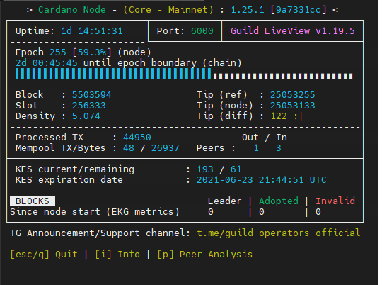

# Setting Up an External Passive Relay Node


Major credits and appreciation to the fine folks at [Cardano Community Guild Operators](https://cardano-community.github.io/guild-operators/#/README) for creating and maintaining [CNtool](https://cardano-community.github.io/guild-operators/#/Scripts/cntools), a most helpful swiss army knife for pool operators. You MUST be familiar with how [ADA staking works](https://docs.cardano.org/en/latest/getting-started/stake-pool-operators/index.html) and possess [fundamental Linux system administration skills](https://www.tecmint.com/free-online-linux-learning-guide-for-beginners/) before continuing this guide.



**Relay nodes** do not have any keys, so they cannot produce blocks. Instead, relays act as proxies between the core network nodes and the Internet, establishing a security perimeter around the core, block-producing network nodes. Since external nodes cannot communicate with block-producing nodes directly, relay nodes ensure that the integrity of the core nodes and the blockchain remains intact, even if one or more relays become compromised.


## :last_quarter_moon_with_face: Prerequisites

* A different server/VM (not located on the same machine as your block-producer node)

## :flying_saucer: Running the prereqs.sh Script

Installs prerequisite dependencies and creates folder structure.

```
sudo apt-get install curl net-tools
```

```bash
mkdir "$HOME/tmp";cd "$HOME/tmp"
# Install curl
# CentOS / RedHat - sudo dnf -y install curl
# Ubuntu / Debian - sudo apt -y install curl
curl -sS -o prereqs.sh https://raw.githubusercontent.com/cardano-community/guild-operators/master/scripts/cnode-helper-scripts/prereqs.sh
chmod 755 prereqs.sh

# Ensure you can run sudo commands with your user before execution
# You can check the syntax for prereqs.sh using command below:
#
# ./prereqs.sh -h
# Usage: prereqs.sh [-o] [-s] [-i] [-g] [-p]
# Install pre-requisites for building cardano node and using cntools
# -o    Do *NOT* overwrite existing genesis, topology.json and topology-updater.sh files (Default: will overwrite)
# -s    Skip installing OS level dependencies (Default: will check and install any missing OS level prerequisites)
# -i    Interactive mode (Default: silent mode)
# -g    Connect to guild network instead of public network (Default: connect to public cardano network)
# -p    Copy Transitional Praos config as default instead of Combinator networks (Default: copies combinator network)

# You can use one of the options above, if you'd like to defer from defaults (below).
# Running without any parameters will run script in silent mode with OS Dependencies, and overwriting existing files.

./prereqs.sh
```

Reload environment variables.

```
. "${HOME}/.bashrc"
```


Familiarize yourself with the [folder structure](https://cardano-community.github.io/guild-operators/#/basics?id=folder-structure) created by CNtools.


## :woman_juggling: Building the Cardano Node and Command Line Interface

To clone the git repository, type:

```bash
cd ~/git
git clone https://github.com/input-output-hk/cardano-node
cd cardano-node
```
To compile binaries, type the following commands where `<NodeVersion>` is the node version number or branch that you want to build:

```bash
git fetch --tags --all
git pull
# For example, to build node version 1.26.2 type git checkout 1.26.2
git checkout <NodeVersion>

echo -e "package cardano-crypto-praos\n  flags: -external-libsodium-vrf" > cabal.project.local
$CNODE_HOME/scripts/cabal-build-all.sh
```

To install the compiled binaries, type:

```
sudo cp $HOME/.cabal/bin/cardano* /usr/local/bin
```

To verify that the correct Cardano node and command line versions are installed, type:

```bash
cardano-node version
cardano-cli version
```

## :hammer_pick: Using systemd Services

Using systemd services to run your Cardano nodes offers the following benefits:

1. Auto-start your node when the computer reboots due to maintenance, power outage, etc.
2. Automatically restart crashed node processes.
3. Maximize your stake pool up-time and performance.

```bash
sudo bash -c "cat << 'EOF' > /etc/systemd/system/cnode.service
[Unit]
Description=Cardano Node
After=network.target

[Service]
Type=simple
Restart=on-failure
RestartSec=5
User=$USER
LimitNOFILE=1048576
WorkingDirectory=$CNODE_HOME/scripts
ExecStart=/bin/bash -l -c \"exec $CNODE_HOME/scripts/cnode.sh\"
ExecStop=/bin/bash -l -c \"exec kill -2 \$(ps -ef | grep [c]ardano-node.*.${CNODE_HOME} | tr -s ' ' | cut -d ' ' -f2)\"
KillSignal=SIGINT
SuccessExitStatus=143
StandardOutput=syslog
StandardError=syslog
SyslogIdentifier=cnode
TimeoutStopSec=5
KillMode=mixed

[Install]
WantedBy=multi-user.target
EOF"

sudo systemctl daemon-reload
sudo systemctl enable cnode.service
```


Nice work. Your node is now managed by the reliability and robustness of systemd. Below are some commands for using systemd.


###   :white_check_mark: Example systemd Commands

To confirm that the node service is active, type:

```
sudo systemctl is-active cnode
```

To display the status of the node service, type:

```
sudo systemctl status cnode
```

To restart the node service, type:

```
sudo systemctl reload-or-restart cnode
```

To stop the node service, type:

```
sudo systemctl stop cnode
```

### :construction: Filtering Logs

To filter logs, type:

```
journalctl --unit=cnode --since=yesterday
```

<p style="text-align: center;">OR</p>

```
journalctl --unit=cnode --since=today
```

<p style="text-align: center;">OR</p>

```
journalctl --unit=cnode --since='2020-07-29 00:00:00' --until='2020-07-29 12:00:00'
```

## :rocket: Starting the Relay Node


**Pro tip:** :sparkler: Speed this step up by copying the **db** folder from another node you control.


To start the relay node, type:

```bash
sudo systemctl start cnode
```

To install Guild LiveView, type:

```bash
cd $CNODE_HOME/scripts
curl -s -o gLiveView.sh https://raw.githubusercontent.com/cardano-community/guild-operators/master/scripts/cnode-helper-scripts/gLiveView.sh
curl -s -o env https://raw.githubusercontent.com/cardano-community/guild-operators/master/scripts/cnode-helper-scripts/env
chmod 755 gLiveView.sh
```

To run Guild Liveview, type:

```
./gLiveView.sh
```

Sample output of Guild Live View



For more information, refer to the [official Guild Live View docs.](https://cardano-community.github.io/guild-operators/#/Scripts/gliveview)

## :octagonal_sign: Configuring and Reviewing the Relay Node Topology File

Modify the **CUSTOM_PEERS section** of the `topologyUpdater.sh` script to configure your relay node's connections to your other relays and block producer node. Refer to the [official documentation for more info.](https://cardano-community.github.io/guild-operators/#/Scripts/topologyupdater?id=download-and-configure-topologyupdatersh)

```bash
nano $CNODE_HOME/scripts/topologyUpdater.sh
```

Deploy the scripts with  `deploy-as-systemd.sh` to setup and schedule the execution. This will handle automatically sending updates to the Topology Updater API as well as fetching new peers whenever the node is restarted.

```bash
$CNODE_HOME/scripts/deploy-as-systemd.sh
```

Review your topology.json and check that it looks correct. Your new relay node's topology should contain your block producer node, your other relay nodes, and other public buddy relay nodes.

```bash
cat $CNODE_HOME/files/topology.json
```

## :fire: Configuring Port Forwarding and/or Firewall

Specific to your networking setup or cloud provider settings, ensure your relay node's port 6000 is open and reachable. 


****:sparkles: **Port Forwarding Tip: **Check that your relay port 6000 is open with [https://www.yougetsignal.com/tools/open-ports/](https://www.yougetsignal.com/tools/open-ports/) or [https://canyouseeme.org/](https://canyouseeme.org) .


Additionally, if you have node-exporter installed for grafana stats, you will need to open ports 9100 and 12798. Don't forget to update `prometheus.yml` on your prometheus server (aka relaynode1). Restart prometheus service for the new relay node to appear in your dashboard.

## :woman_technologist: Configuring the Existing Relay or Block-producing Node's Topology

Finally, add your new **NEW **relay node IP/port information to your **EXISTING **block producer and/or relay node's topology file. Modify the **CUSTOM_PEERS section** of the `topologyUpdater.sh`

For your block producer node, you'll want to manually add the new relay node information to your topology.json file.

Example snippet to add to your block producer's topology file. Add a comma to separate the nodes where appropriate.

```
 {
    "addr": "<relay node public ip address>",
    "port": 6000,
    "valency": 1
 }
```

For relay nodes, use the [topologyUpdater process](./#14-configure-your-topology-files) to manage your topology file or modify the **CUSTOM_PEERS section** of the `topologyUpdater.sh`.

## :arrows_counterclockwise: Restarting Nodes

To enable updated topology configurations for a node, you need to restart the node.

To restart nodes:

1\. Type:

```
sudo systemctl reload-or-restart cnode
```

2\. Repeat step 1 for each node having updated topology configurations.

## :confetti_ball: 9. Verify the connection is working

On the Guild LiveView screen, press `P` to view the peer list. You should see the connection to other node's IP.


:sparkles: Congrats on the new relay node.



****:fire: **Critical Security Reminder:** Relay nodes must not contain any **`operational certifications`, `vrf`, `skey` or `cold`**` `**keys**.



Congrats on completing the guide. :sparkles: 

Did you find our guide useful? Send us a signal with a tip and we'll keep updating it. 

It really energizes us to keep creating the best crypto guides. 

Use [cointr.ee to find our donation ](https://cointr.ee/coincashew)addresses. :pray: 

Any feedback and all pull requests much appreciated. :first_quarter_moon_with_face: 

Hang out and chat with fellow stake pool operators on Discord @

[https://discord.gg/w8Bx8W2HPW](https://discord.gg/w8Bx8W2HPW) :smiley: 

Hang out and chat with our stake pool community on Telegram @ [https://t.me/coincashew](https://t.me/coincashew)

