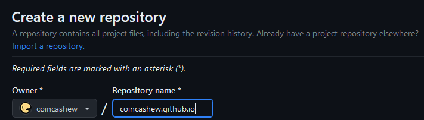
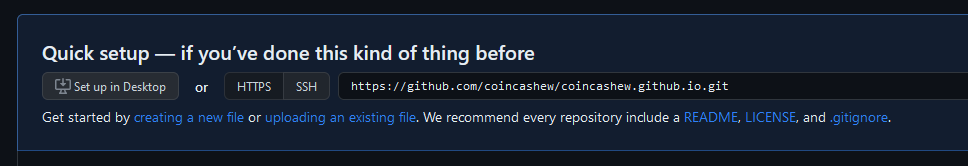
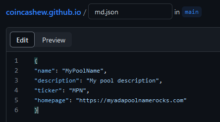
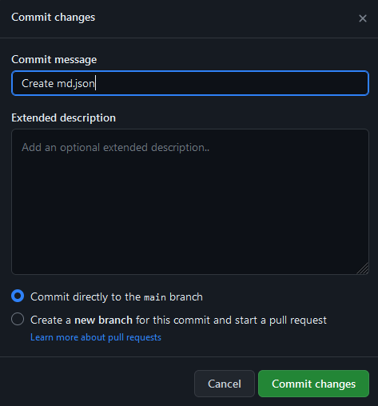

# Uploading Pool Metadata to GitHub Pages

### **To host the file containing metadata for your pool on GitHub Pages:**

1. Sign up or login to your [GitHub](https://github.com) account.
2. [Create a new public repository](https://github.com/new) named _username_.github.io, where _username_ is your username (or organization name) on GitHub. **Shorter the better.**

<figure><figcaption></figcaption></figure>

3.  Click Get started by "**creating a new file**" under Quick setup.\


    <figure><figcaption></figcaption></figure>
4. Enter your file name as **md.json** and paste in your JSON content.

<figure><figcaption></figcaption></figure>

5. Click **Commit Changes...**

<figure><figcaption></figcaption></figure>

6. If everything worked properly, your pool metadata is now hosted at URL:

```
https://USERNAME.github.io/FILE
```


Example URL: [https://coincashew.github.io/md.json](https://coincashew.github.io/md.json)



Ensure the URL is less than 64 characters. If too long, pick a shorter github username or shorter json file name.


7. In your stakepool registration transaction, set the value of the `--metadata-url` parameter to this URL.
8. On your block producer node, download your JSON file using the URL with `wget` command:

```bash
cd $NODE_HOME
wget -O md.json <your github pages URL>
```


Note that it can take up to 10 minutes for changes to your site to publish after you commit changes.


9. As a sanity check, check the contents of your JSON file.

```bash
cat md.json
```

10. On your block producer node, generate the updated pool metadata hash.

```bash
cardano-cli conway stake-pool metadata-hash --pool-metadata-file md.json > poolMetaDataHash.txt
```
