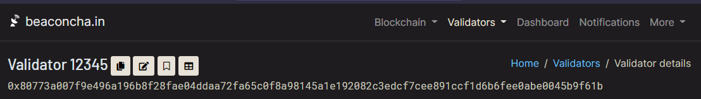

# Checking my eth validator's sync committee duties

## :fast\_forward: Quick steps guide


The following steps align with our [mainnet guide](../../../guide-or-how-to-setup-a-validator-on-eth2-mainnet/). You may need to adjust file names and directory locations where appropriate. The core concepts remain the same.


### :dagger: Why do I want to check my sync committee duties ?

* Since the Altair Hard Fork, checking sync committee membership is a must before performing any maintenance. This will give you up to [\~27 hours of advanced notice](https://github.com/ethereum/consensus-specs/pull/2453) in case your validators have been selected for sync committee duties.
* Understanding the schedule of your validator's duties better, you can find the best time to plan consensus/execution client updates, system reboots or outages.

### :robot: Pre-requisites

* Linux bash shell or command line
* Assumes you will be running this script on the beacon node. If running remotely, you might need to change your beacon node's http API to bind from localhost to 0.0.0.0
* Your ETH validator index number(s) -- Enter your validator's public key on [https://beaconcha.in/](https://beaconcha.in) or [https://beaconscan.com/](https://beaconscan.com) Example of Validator index # 12345 is shown below.

<figure><figcaption><p>Given your validator's public key, the index number is shown. Example of Validator 12345 from <a href="https://beaconcha.in/validator/12345">https://beaconcha.in/validator/12345</a></p></figcaption></figure>


:sparkles: Kudos to [**2038**](https://www.reddit.com/user/2038/) on Reddit for [authoring this process.](https://www.reddit.com/r/ethstaker/comments/qjlfsf/how\_to\_check\_upcoming\_sync\_committee\_membership/)


### :construction: How to Check Sync Committee Duties script

1\. Create a `check_sync_committee.sh` script with a text editor, nano.

```
nano check_sync_committee.sh
```

2\. Paste the following script content and then save your file. CTRL+O, enter, then CTRL+X.

```
#!/bin/sh

BEACON_NODE="http://localhost:5052"
VALIDATOR_LIST=$(echo "$@" | tr ' ' '|')

epoch_to_time(){
    expr 1606824000 + \( $1 \* 384 \)
    }

time_to_epoch(){
    expr \( $1 - 1606824000 \) / 384
    }

get_committee(){
    URLSTEM="${BEACON_NODE}/eth/v1/beacon/states/finalized"
    curl -X GET "${URLSTEM}/sync_committees?epoch=$1" 2> /dev/null \
    | sed -e 's/["]/''/g' | cut -d'[' -f2 | cut -d']' -f1 | tr ',' '\n'
    }

search_committee(){
    get_committee $2 | grep -Ex $VALIDATOR_LIST \
    | awk -v c=$1 '{print "validator:", $1, "found in", c, "sync committee"}'
    }

display_epoch(){
    echo "epoch: $1 : $(date -d@$(epoch_to_time $1)) <-- $2"
    }

CURR_EPOCH=$(time_to_epoch $(date +%s))
CURR_START_EPOCH=`expr \( $CURR_EPOCH / 256 \) \* 256`
NEXT_START_EPOCH=`expr $CURR_START_EPOCH + 256`
NEXTB1_START_EPOCH=`expr $NEXT_START_EPOCH + 256`

echo
display_epoch $CURR_START_EPOCH   "current sync committee start"
display_epoch $CURR_EPOCH         "now"
display_epoch $NEXT_START_EPOCH   "next sync committee start"
display_epoch $NEXTB1_START_EPOCH "next-but-one sync committee start"
echo

if [ "$#" -gt 0 ]
then
    search_committee "current" $CURR_EPOCH
    search_committee "next"    $NEXT_START_EPOCH
fi
```

3\. Add execute permissions to the script.

```
 chmod +x check_sync_committee.sh
```

4\. Enter your validator index numbers as parameters to the script.

```bash
./check_sync_committee.sh <validator index number(s)>
# Example
# ./check_sync_committee.sh 1000 1001 1002 1003
```

Sample Output of the script:

> ```
> ./check_sync_committee.sh 123511 124216 
>
> epoch: 75008 : Sat 30 Oct 21:51:12 BST 2021 <-- current sync committee start
> epoch: 75115 : Sun 31 Oct 08:16:00 GMT 2021 <-- now
> epoch: 75264 : Mon  1 Nov 00:09:36 GMT 2021 <-- next sync committee start
> epoch: 75520 : Tue  2 Nov 03:28:00 GMT 2021 <-- next-but-one sync committee start
>
> validator: 123511 found in current sync committee
> validator: 124216 found in next sync committee
> ```

This output indicates the following:

* it is currently epoch 75115
* and validator #123511 is in current sync committee from epoch 75008 to epoch 75263
* and validator #124216 is in next sync committee from epoch 75264 to epoch 75520

If there is no output, then no validators are scheduled for current or next sync committee.



:question:**Troubleshooting:**

* The python script calls the `http API`
* Ensure the `http API` is enabled for your consensus layer client.
  * teku: `--rest-api-enabled=true`
* Teku by default uses port 5051, rather than 5052. Replace the port number before using.
  * example: BEACON\_NODE="http://localhost:5051"



:fire: **Script Usage Caveats**:

* Sync committee duties are only known for the current AND next sync committee period.

