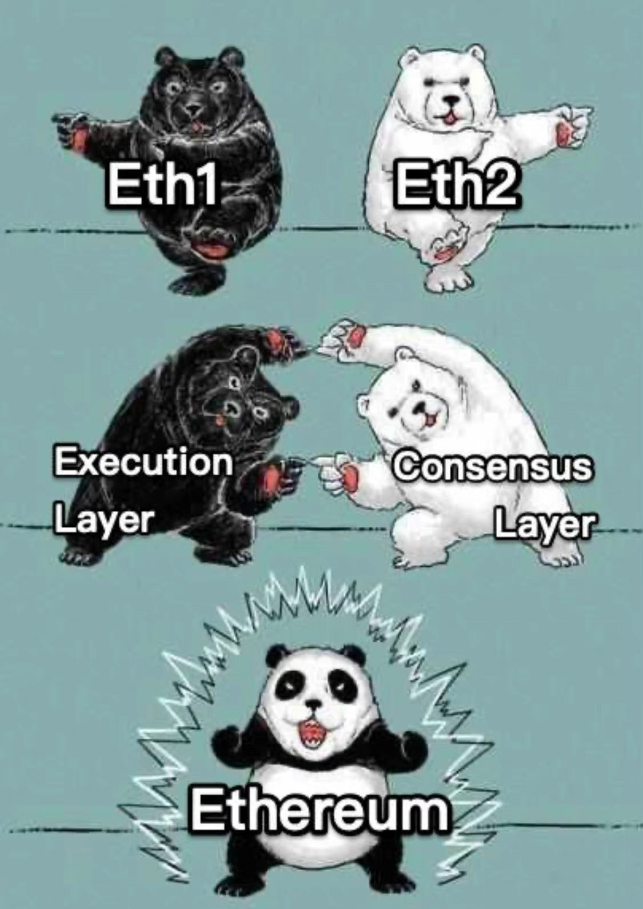

# Ethereum Merge Upgrade Checklist for Home Stakers and Validators


​**2022-6 Gitcoin Grant Round 14:** [We improve this guide with your support!](https://gitcoin.co/grants/1653/eth2-staking-guides-by-coincashew)🙏



The following steps align with our [mainnet guide](guide-or-how-to-setup-a-validator-on-eth2-mainnet/). You may need to adjust file names and directory locations where appropriate. The core concepts remain the same.


## Wen merge?&#x20;

Ropsten testnet merge done, two more to go, namely Sepolia and Goerli. Mainnet merge upgrade to follow and latest estimates are End of July or August.

## What's merge?



## How to merge?

**Prerequisite:** Before beginning, there is a mandatory requirement to run your own Execution Layer (EL) client (i.e. besu, geth, nethermind, erigon). Outsourcing EL/eth1 to Infura is no longer possible post merge.

#### In order to transition through the merge successfully, your staking node/validator must:

1\) Update to latest EL / CL node software

2\) Create a jwtsecret file

3\) Update startup commands with the following:

* Set your suggested fee recipient address
* Enable the authenticated port to the new Engine API

### 1) Update to latest EL / CL node software

First start by updating your system.

```
sudo apt -y update && sudo apt -y upgrade
```

Next, follow the instructions for [updating EL](guide-or-how-to-setup-a-validator-on-eth2-mainnet/part-ii-maintenance/updating-your-execution-client.md) or [updating CL](guide-or-how-to-setup-a-validator-on-eth2-mainnet/part-ii-maintenance/updating-your-consensus-client.md), or your node's official documentation.

### 2) Create a jwtsecret file


This new jwtsecret file contains a hexadecimal string that is passed to both Execution Layer client and Consensus Layer clients, and is used to ensure authenticated communications between both clients.


```bash
#store the jwtsecret file at /secrets
sudo mkdir -p /secrets

#create the jwtsecret file
openssl rand -hex 32 | tr -d "\n" | sudo tee /secrets/jwtsecret

#enable read access
sudo chmod 644 /secrets/jwtsecret
```

### 3) Update startup commands

Updates to your systemd file for the consensus layer, execution layer, or validator will be required to support the following new merge options:

* Set your suggested fee recipient address
* Enable the authenticated port to the new Engine API


The fee recipient address recieves block proposal priority fees (aka mining tips) and is an ETH address you designate as your rewards address. These rewards are immediately spendable, unlike the validator's attestation and block proposal rewards.


#### Location of system service files to update

* Ensure you add/append the changes to the **END** of the `ExecStart` line. Ctrl + O, Ctrl + X to save and exit.
* Change 0x000000000... to an ETH address you control.



```
# Consensus Client:
sudo nano /etc/systemd/system/beacon-chain.service

# Validator Client:
sudo nano /etc/systemd/system/validator.service

# Execution Client:
sudo nano /etc/systemd/system/eth1.service
```




For reference purposes only. Recommend refer to the official SomerEsat Merge Updates when available.


```
# Nimbus
sudo nano /etc/systemd/system/nimbus.service

# Prysm
sudo nano /etc/systemd/system/prysmvalidator.service
sudo nano /etc/systemd/system/prysmbeacon.service

# Lighthouse
sudo nano /etc/systemd/system/lighthousevalidator.service
sudo nano /etc/systemd/system/lighthousebeacon.service

# Teku
sudo nano /etc/systemd/system/teku.service

# Geth EL
sudo nano /etc/systemd/system/geth.service
```



**Consensus Client Layer Changes (beacon chain)**



```
--execution-endpoints http://127.0.0.1:8551 \
--jwt-secrets="/secrets/jwtsecret"
```



```
--ee-endpoint http://localhost:8551 \ 
--ee-jwt-secret-file "/secrets/jwtsecret" \
--validators-proposer-default-fee-recipient=0x0000000000000000000000000000000000000000
```



```
--jwt-secret "/secrets/jwtsecret" \
--execution.urls "http://127.0.0.1:8551" \
--chain.defaultFeeRecipient "0x0000000000000000000000000000000000000000"
```



```
--web3-url=http://127.0.0.1:8551 \ 
--jwt-secret="/secrets/jwtsecret" \
--suggested-fee-recipient=0x0000000000000000000000000000000000000000
```



```
--http-web3provider=http://localhost:8551 \ 
--jwt-secret=/secrets/jwtsecret \
--suggested-fee-recipient=0x0000000000000000000000000000000000000000
```



**Validator Client Changes**



```
--suggested-fee-recipient 0x0000000000000000000000000000000000000000
```



Only if running in validator in a separate client

```
--validators-proposer-default-fee-recipient=0x0000000000000000000000000000000000000000
```



```
--defaultFeeRecipient 0x0000000000000000000000000000000000000000
```



Runs in consensus client, not needed.



```
--suggested-fee-recipient 0x0000000000000000000000000000000000000000
```



**Execution Client Layer Changes (eth1)**



TOML format

```
# toml format
# nano /etc/teku/teku.yaml

miner-enabled=true
miner-coinbase="0x0000000000000000000000000000000000000000"
engine-jwt-enabled=true 
engine-jwt-secret="/secrets/jwtsecret" 
engine-host-allowlist=["*"]
```

CLI flags

```
--miner-enabled=true \
--miner-coinbase="0x0000000000000000000000000000000000000000" \
--engine-jwt-enabled=true \
--engine-jwt-secret=/secrets/jwtsecret \
--engine-host-allowlist=*
```



```
--authrpc.jwtsecret=/secrets/jwtsecret \
--authrpc.vhosts="*"
```



```
--authrpc.jwtsecret=/secrets/jwtsecret \
--http \
--http.api=engine,net,eth
```



```
--JsonRpc.Host=0.0.0.0 \
--JsonRpc.JwtSecretFile=/secrets/jwtsecret
```



After adding the above startup commands, reload and restart your services.

```
sudo systemctl daemon-reload
sudo systemctl restart eth1 beacon-chain validator
```

Verify your validator is still attesting properly by checking an public block explorer such as beaconcha.in


Congrats! Your node should be merge ready now. Stay tuned to the latest news.


## Optional - Extra #TestingTheMerge

Can't get your mind off the merge? Here's some additional ideas and nice to haves.

\[:white\_check\_mark:] Participate in Sepolia/Goerli Upcoming Merge

\[:white\_check\_mark:] Improve [Client Diversity](https://clientdiversity.org/)

* Switch to a minority EL - tip: Use besu as "minority client" - while Infura still works as a backup EL/eth1 client, stop existing EL/eth1 node, delete, then install and sync besu. Besu features auto pruning.&#x20;
* Switch to a minority CL

\[:white\_check\_mark:] Configure MetaMask to use your own node. Bye Infura outages.

\[:white\_check\_mark:] Upgrade node storage to 2TB+&#x20;

\[:white\_check\_mark:] Prune your EL node

\[:white\_check\_mark:] Upgrade Grafana reporting with [samc's ethereum metrics exporter](https://github.com/samcm/ethereum-metrics-exporter)

\[:white\_check\_mark:] Test / dev / deploy code on the testnets

