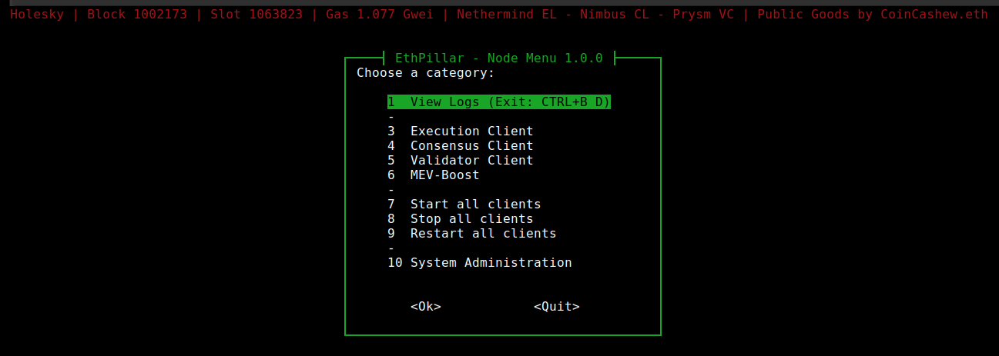

# 🛡️ EthPillar: a simple TUI for Validator Node Management

## What is EthPillar?

:smile: **Friendly Node Installer**: No node yet? Helps you installs a Ethereum node stack in a jiffy.

:floppy\_disk: **Ease of use**: No more remembering CLI commands required. Access common node operations via a simple text menu.

:owl: **Fast Updates**: Quickly find and download the latest consensus/execution release. Less downtime!

:tada:**Compatibility**: Behind the scenes, node commands and file structure are identical to V2 staking setups.&#x20;


Already a running a Validator? EthPillar is compatible with [a Coincashew V2 Staking Setup.](https://www.coincashew.com/coins/overview-eth/guide-or-how-to-setup-a-validator-on-eth2-mainnet)&#x20;


<figure><figcaption><p>EthPillar Main Menu</p></figcaption></figure>

## Option 1: Automated One-Liner Install

Simply copy and paste the command into your terminal.

Open source source code available here: [https://github.com/coincashew/EthPillar](https://github.com/coincashew/EthPillar)

```bash
/bin/bash -c "$(curl -fsSL https://raw.githubusercontent.com/coincashew/ethpillar/master/install.sh)"
```

## Option 2: Manual Install

**Install updates and packages:**

```bash
sudo apt-get update && sudo apt-get install git curl ccze
```

**Clone the ethpillar repo and install:**

```bash
mkdir -p ~/git/ethpillar
git clone https://github.com/coincashew/ethpillar.git ~/git/ethpillar
sudo ln -s ~/git/ethpillar/ethpillar.sh /usr/local/bin/ethpillar
```

#### Run ethpillar:

```bash
ethpillar
```

## :tada:Next Steps


Congrats on installing a simple UI for making node maintenance easier!


<details>

<summary>Additional step for new Node operators</summary>

Step 1: Configure your network, port forwarding and firewall. From the main guide, [click here for detailed network configuration](guide-or-how-to-setup-a-validator-on-eth2-mainnet/part-i-installation/step-2-configuring-node.md#network-configuration).

* Involves setting UFW defaults, opening SSH port, allowing consensus/execution p2p port traffic, enabling the UFW firewall, configuring port forwarding and installing fail2ban.

</details>

<details>

<summary>Additional steps for new Validators</summary>

**Step 1: Setup Validator Keys**

* Refer to the main guide's section on [setting up your validator keys.](guide-or-how-to-setup-a-validator-on-eth2-mainnet/part-i-installation/step-5-installing-validator/setting-up-validator-keys.md)

**Step 2: Import Validator Keys**

First, ensure your validator client is stopped.

```bash
sudo systemctl stop validator
```

The following command will import your validator keys.

Enter your **keystore password** to import accounts.

```bash
sudo /usr/local/bin/nimbus_beacon_node deposits import \
  --data-dir=/var/lib/nimbus_validator $HOME/staking-deposit-cli/validator_keys
```

WARNING: Do not import your validator keys into multiple validator clients and run them at the same time, or you might get slashed. If moving validators to a new setup or different validator client, ensure deletion of the previous validator keys before continuing.

Now you can verify the accounts were imported successfully by doing a directory listing.

```bash
sudo ls -l /var/lib/nimbus_validator/validators
```

You should see a folder named for each of your validator's pubkey.

Setup ownership permissions, including hardening the access to this directory.

```bash
sudo chown -R validator:validator /var/lib/nimbus_validator
sudo chmod -R 700 /var/lib/nimbus_validator
```

Finally, start your validator client.

```bash
sudo systemctl start validator
```

Check your logs to confirm that the validator clients are up and functioning.

```bash
sudo journalctl -fu validator | ccze
```

</details>

:thumbsup:Are you a EthPillar Enjooyer? [Support this public good by purchasing a limited edition POAP!](https://checkout.poap.xyz/169495)

<figure><figcaption><p>Your EthPillar Enjoyoor's POAP</p></figcaption></figure>

**Purchase link:** [https://checkout.poap.xyz/169495](https://checkout.poap.xyz/169495)

ETH accepted on Mainnet, Arbitrum, Base, Optimism. :pray:
