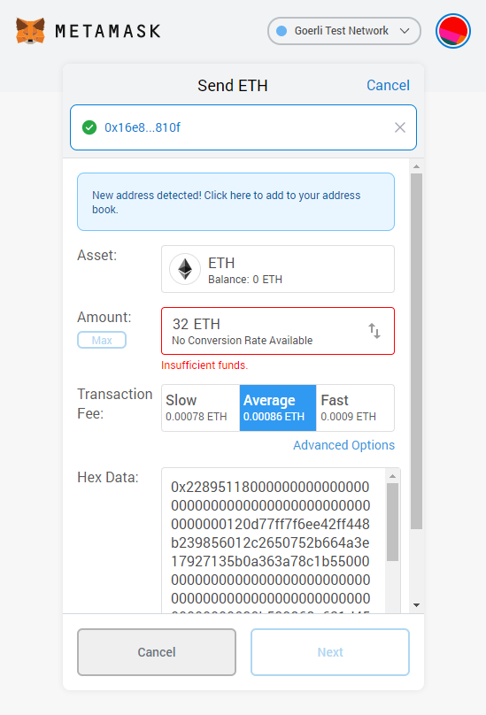

# Guide: How to stake on ETH 2.0 Altona Testnet with Lighthouse on Ubuntu

## 📶 0.0 Altona ETH 2.0 Network Stats

* Genesis Time: `1593433805` \(2020-06-29 12:30:05 +0000 UTC\)
* Genesis Block Root: `0x9e2ffe8ab9316e03e45409eaaffab10cf02e1b60e609276113e07240d4a31b7a`
* Deposit Contract: [`0x16e82D77882A663454Ef92806b7DeCa1D394810f`](https://goerli.etherscan.io/address/0x16e82D77882A663454Ef92806b7DeCa1D394810f) \([Goerli Testnet](https://github.com/goerli/testnet)\)
* Blockchain Explorer: [altona.beaconcha.in](https://altona.beaconcha.in/)
* Multi-client test net predecessors: Schlsi and Witti
* Implements ETH 2.0 spec v0.12.1
* [More information](https://github.com/goerli/altona)

## 🐣 0.1 Prerequisites

### \*\*\*\*🎗 **Minimum Setup Requirements**

* **Operating system:** 64-bit Linux \(i.e. Ubuntu 18.04.4 LTS\)
* **Processor:** Dual core CPU
* **Memory:** 4GB RAM
* **Storage:** 20GB SSD
* **Internet:** 24/7 broadband internet connection with speeds at least 1 Mbps.
* **Power:** 24/7 electrical power
* **ETH balance:** at least 32 Goerli ETH
* **Wallet**: Metamask installed

If you need to install Ubuntu, refer to



If you need to install Metamask, refer to



## 🤖 1. Download a ETH1 node, geth

```text
sudo add-apt-repository -y ppa:ethereum/ethereum
sudo apt-get update -y
sudo apt-get install ethereum -y
```

or manually download at:



## 📄 2. Create a geth startup script

```text
cat > startGethNode.sh << EOF 
geth --goerli --datadir="$HOME/Goerli" --rpc
EOF
```

## 🐣 3. Start the geth node for ETH Goerli testnet

```text
chmod +x startGethNode.sh
./startGethNode.sh
```


Syncing the node could take up to 1 hour.



You are fully sync'd when you see the message: `Imported new chain segment`


## ⚙ 4. Obtain Goerli test network ETH

Join the [Prysmatic Labs Discord](https://discord.com/invite/YMVYzv6) and send a request for ETH in the **`-request-goerli-eth channel`**

```text
!send <your metamask goerli network ETH address>
```

Otherwise, visit below and use metamask to request ETH on step 2, "Get GöETH — Test ether". 




This method is sometimes unreliable.


## 👩💻 5. Install rust

```text
curl --proto '=https' --tlsv1.2 -sSf https://sh.rustup.rs | sh
```


 In case of compilation errors, run`rustup update`


Enter '1' to proceed with the default install.

Update your environment variables.

```text
echo export PATH="$HOME/.cargo/bin:$PATH" >> ~/.bashrc
source ~/.bashrc
```

Install rust dependencies.

```text
sudo apt install -y git gcc g++ make cmake pkg-config libssl-dev
```

## 💡 6. Install Lighthouse

```text
git clone https://github.com/sigp/lighthouse.git
cd lighthouse
make
```


This build process may take up to an hour.


Verify lighthouse was installed properly.

```text
lighthouse --version
```

## 🏂 7. Start the beacon chain

In a new terminal, start the beacon chain.

```text
lighthouse beacon --eth1 --http
```

## 🚥 8. Create a wallet and save the mnemonic seed 

This creates a wallet called `my-validators` protected by a randomly generated password stored in `my-validators.pass`

```text
lighthouse account wallet create --name my-validators --passphrase-file my-validators.pass
```


Be sure to save your mnemonic seed.


Create the **voting** and **withdrawal** **keystores** for a validator. Change `--count` to the \# of validators you want.

```text
lighthouse account validator create --wallet-name my-validators --wallet-passphrase my-validators.pass --count 1
```

> Sample Output:
>
> `1/1 0xa777c8a16638c4f3e1f5d80f1b91f8f5fca70b0c3ee56c8e71a616bb04c48d2df4f0928ef8fabde42c8ba201e0b6382a`


Note the validator public key \(0xxa777...64 chars\). Use this public key in a [block explorer](https://altona.beaconcha.in/) to view your validator's activity.



Validator public key data is saved in `~$HOME/.lighthouse/validators`


## 🏁 9. Configure firewall and/or port forwarding

By default, lighthouse p2p traffic is transmitted over port 9000. Open and/or forward this port

## 🧬 10. Start the validator

```text
lighthouse validator --auto-register
```


**Validator client** - Responsible for producing new blocks and attestations in the beacon chain and shard chains.

**Beacon chain client** - Responsible for managing the state of the beacon chain, validator shuffling, and more.


## 📄 11. Copy the validator deposit data

Copy the text from your  `eth1_deposit_data.rlp`  in your validator directory located at

```text
cd ~/.lighthouse/validators/<your validator's public key>
```

> For example, if your ubuntu username is `ethereum` and your validator's public key is `0xabc123...`, then your `eth1-deposit-data.rlp` is located in
>
> `/home/ethereum/.lighthouse/validators/0xabc123.../`

View the deposit data and then copy this into your clipboard.

```text
cat eth1-deposit-data.rlp
```

Save the **deposit data** for the next step. Sample deposit data looks as follows:

> 0x2289511800000000000000000000000000000000000000000000000120d77ff7f6ee42ff448b239856012c2650752b664a3e17927135b0a363a78c1b550000000000000000000000000000000000000000000000000000000000000030b539868a621d45b51f66ce88bc80e35099e01f31a0aec8484e7fbd04936056483053c5f2b1d195273b651599555ef35e0000000000000000000000000000000000000000000000000000000000000000000000000000000000000000000000200086c2c1fb70ed4e6435d2f32a3f6a5fdd4596ad5dc82bd6254ef73959d1ec2b0000000000000000000000000000000000000000000000000000000000000060a8480dd7d6341273789afa176e00e2c105cfe76adb670a211da5604c74cb7fd1ee6ceb4753a25400227fbf01cc344e98000d0705db8f3a964692f85901e4cb4fb6211aa5091967c22f550666adfa65bbde8b33c41cdc56fb62564a73a2135c20

## 📩 12. Send the validator deposit


Do not send mainnet ETH.


1. Open **Metamask** wallet in your browser
2. Ensure you have selected the **Goerli Test Network** from the dropdown menu.
3. Click your account Identicon, the circular colorful icon.
4. Go to **Settings then Advanced**
5. Enable **"Show Hex Data"**
6. Click **Send**
7. Enter the Altona Deposit Contract Address as Recipient:  [0x16e82D77882A663454Ef92806b7DeCa1D394810f](https://goerli.etherscan.io/address/0x16e82D77882A663454Ef92806b7DeCa1D394810f)
8. Enter **32 ETH** into the **Amount** field
9. Paste the **Deposit Data** from step 11 into the **Hex Data** field.
10. Click **Next** to send.





Congratulations. Once your beacon-chain is sync'd, validator up and running, you just wait for activation. This process takes up to 8 hours. When you're assigned, your validator will begin creating and voting on blocks while earning ETH staking rewards. Find your validator's status at [beaconcha.in](https://altona.beaconcha.in)


## Reference Material




