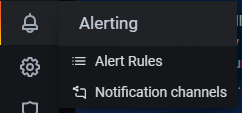

# Guide: How to stake on ETH2 Mainnet with Prysm on Ubuntu


**Nov 24 2020 Update**: The [new mainnet guide is located here](guide-or-how-to-setup-a-validator-on-eth2-mainnet.md). 

Instructions below are now deprecated and for reference only.




[Prysm](https://github.com/prysmaticlabs/prysm) is a Go implementation of Ethereum 2.0 protocol with a focus on usability, security, and reliability. Prysm is developed by [Prysmatic Labs](https://prysmaticlabs.com/), a company with the sole focus on the development of their client. Prysm is written in Go and released under a GPL-3.0 license.


## 🏁 0. Prerequisites

### 👩💻 Skills for operating a eth2 validator and beacon node

As a validator for eth2, you will typically have the following abilities:

* operational knowledge of how to set up, run and maintain a eth2 beacon node and validator continuously
* a commitment to maintain your validator 24/7/365
* basic operating system skills
* have learned the essentials by watching ['Intro to Eth2 & Staking for Beginners' by Superphiz](https://www.youtube.com/watch?v=tpkpW031RCI)
* have passed or is actively enrolled in the [Eth2 Study Master course](https://ethereumstudymaster.com/)
* and have read the [8 Things Every Eth2 validator should know.](https://medium.com/chainsafe-systems/8-things-every-eth2-validator-should-know-before-staking-94df41701487)

### 🎗 **Minimum Setup Requirements**

* **Operating system:** 64-bit Linux \(i.e. Ubuntu 20.04 LTS\)
* **Processor:** Dual core CPU, Intel Core i5–760 or AMD FX-8100 or better
* **Memory:** 8GB RAM
* **Storage:** 20GB SSD
* **Internet:** Broadband internet connection with speeds at least 1 Mbps.
* **Power:** Reliable electrical power.
* **ETH balance:** at least 32 ETH and some ETH for deposit transaction fees
* **Wallet**: Metamask installed

### 🏋♂ Recommended Hardware Setup

* **Operating system:** 64-bit Linux \(i.e. Ubuntu 20.04 LTS\)
* **Processor:** Quad core CPU, Intel Core i7–4770 or AMD FX-8310 or better
* **Memory:** 16 GB RAM or more
* **Storage:** 1TB SSD or more
* **Internet:** Broadband internet connections with speeds at least 10 Mbps
* **Power:** Reliable electrical power with uninterruptible power supply \(UPS\)
* **ETH balance:** at least 32 ETH and some ETH for deposit transaction fees
* **Wallet**: Metamask installed


✨ **Pro Validator Tip**: Highly recommend you begin with a brand new instance of an OS, VM, and/or machine. Avoid headaches by NOT reusing testnet keys, wallets, or databases for your mainnet validator.


### 🔓 Recommended eth2 validator Security Best Practices

If you need ideas or a reminder on how to secure your validator, refer to



### 🛠 Setup Ubuntu

If you need to install Ubuntu, refer to



### 🎭 Setup Metamask

If you need to install Metamask, refer to



## 🌱 1. Buy/exchange or consolidate ETH


Every 32 ETH you own allows you to make 1 validator. You can run thousands of validators with your beacon node.


Your ETH \(or multiples of 32 ETH\) should be consolidated into a single address accessible with Metamask.

If you need to buy/exchange or top up your ETH to a multiple of 32, check out:



## 👩💻 2. Signup to be a validator at the Launchpad

1. Install dependencies, the ethereum foundation deposit tool and generate your two sets of key pairs.


Each validator will have two sets of key pairs. A **signing key** and a **withdrawal key.** These keys are derived from a single mnemonic phrase. [Learn more about keys.](https://blog.ethereum.org/2020/05/21/keys/)


You have the choice of downloading the pre-built [ethereum foundation deposit tool](https://github.com/ethereum/eth2.0-deposit-cli) or building it from source.



Download eth2deposit-cli.

```bash
cd $HOME
wget https://github.com/ethereum/eth2.0-deposit-cli/releases/download/v1.0.0/eth2deposit-cli-9310de0-linux-amd64.tar.gz
```

Verify the SHA256 Checksum matches the checksum on the [releases page](https://github.com/ethereum/eth2.0-deposit-cli/releases/tag/v1.0.0).

```bash
sha256sum eth2deposit-cli-9310de0-linux-amd64.tar.gz 
# SHA256 should be
# b09da136895a7f77a4b430924ea2ae5827fa47b2bf444c4ea6fcfac5b04b8c8a
```

Extract the archive.

```text
tar -xvf eth2deposit-cli-9310de0-linux-amd64.tar.gz
cd eth2deposit-cli-9310de0-linux-amd64
```

Make a new mnemonic.

```text
./deposit new-mnemonic --chain mainnet
```



Install dependencies.

```text
sudo apt update
sudo apt install python3-pip git -y
```

Download source code and install.

```text
mkdir ~/git
cd ~/git
git clone https://github.com/ethereum/eth2.0-deposit-cli.git
cd eth2.0-deposit-cli
sudo ./deposit.sh install
```

Make a new mnemonic.

```text
./deposit.sh new-mnemonic --chain mainnet
```




🔥**\[ Optional \] Pro Security Tip**: Run the eth2deposit-cli tool and generate your **mnemonic seed** for your validator keys on an **air-gapped offline machine**.

You can copy via USB key the pre-built eth2deposit-cli binaries from an online machine to an air-gapped offline machine.

* Protects against key-logging attacks, malware/virus based attacks and other firewall or security exploits. 
* Physically isolated from the rest of your network. 
* Must not have a network connection, wired or wireless. 
* Is not a VM on a machine with a network connection.
* Learn more about [air-gapping at wikipedia](https://en.wikipedia.org/wiki/Air_gap_%28networking%29).




1. Follow the prompts and pick a password. Write down your mnemonic and keep this safe and **offline**.
2. Follow the steps at [https://launchpad.ethereum.org/](https://launchpad.ethereum.org/) while skipping over the steps you already just completed. Study the eth2 phase 0 overview material. Understanding eth2 is the key to success!
3. Back on the launchpad website, upload your`deposit_data-#########.json` found in the `validator_keys` directory.
4. Connect to the launchpad with your Metamask wallet, review and accept terms.
5. Confirm the transaction\(s\). There's one deposit transaction of 32 ETH for each validator.


Your transaction is sending and depositing your ETH to the [official ETH2 deposit contract address. ](https://blog.ethereum.org/2020/11/04/eth2-quick-update-no-19/)

**Check**, _double-check_, _**triple-check**_ that the official Eth2 deposit contract address is correct.[`0x00000000219ab540356cBB839Cbe05303d7705Fa`](https://etherscan.io/address/0x00000000219ab540356cbb839cbe05303d7705fa)



Be sure to write down or record your mnemonic seed **offline**. _Not email. Not cloud._

Make **offline backups**, such as to a USB key, of your **`validator_keys`** \`\`directory.


## 🛸 3. Install a ETH1 node


Ethereum 2.0 requires a connection to Ethereum 1.0 in order to monitor for 32 ETH validator deposits. Hosting your own Ethereum 1.0 node is the best way to maximize decentralization and minimize dependency on third parties such as Infura.



The subsequent steps assume you have completed the [best practices security guide](guide-or-security-best-practices-for-a-eth2-validator-beaconchain-node.md).


Your choice of either [**OpenEthereum**](https://www.parity.io/ethereum/)**,** [**Geth**](https://geth.ethereum.org/)**,** [**Besu**](https://besu.hyperledger.org/) **or** [**Nethermind**](https://www.nethermind.io/)**.**



#### 🤖 Install and run OpenEthereum.

```text
mkdir ~/openethereum && cd ~/openethereum
wget https://github.com/openethereum/openethereum/releases/download/v3.0.1/openethereum-linux-v3.0.1.zip
unzip openethereum*.zip
chmod +x openethereum
rm openethereum*.zip
```

​ ⚙ **Setup and configure systemd**

Run the following to create a **unit file** to define your `eth1.service` configuration.

```bash
cat > $HOME/eth1.service << EOF 
[Unit]
Description     = openethereum eth1 service
Wants           = network-online.target
After           = network-online.target 

[Service]
User            = $(whoami)
WorkingDirectory= /home/$(whoami)/openethereum
ExecStart       = /home/$(whoami)/openethereum/openethereum --chain foundation
Restart         = on-failure

[Install]
WantedBy    = multi-user.target
EOF
```

Move the unit file to `/etc/systemd/system` and give it permissions.

```bash
sudo mv $HOME/eth1.service /etc/systemd/system/eth1.service
```

```bash
sudo chmod 644 /etc/systemd/system/eth1.service
```

Run the following to enable auto-start at boot time.

```text
sudo systemctl daemon-reload
sudo systemctl enable eth1
```

#### ⛓ Start OpenEthereum on mainnet.

```text
sudo systemctl start eth1
```



#### 🧬 Install from the repository.

```text
sudo add-apt-repository -y ppa:ethereum/ethereum
sudo apt-get update -y
sudo apt-get install ethereum -y
```

⚙ **Setup and configure systemd**

Run the following to create a **unit file** to define your `eth1.service` configuration.

```bash
cat > $HOME/eth1.service << EOF 
[Unit]
Description     = geth eth1 service
Wants           = network-online.target
After           = network-online.target 

[Service]
User            = $(whoami)
ExecStart       = /usr/bin/geth --rpc --http
Restart         = on-failure

[Install]
WantedBy    = multi-user.target
EOF
```

Move the unit file to `/etc/systemd/system` and give it permissions.

```bash
sudo mv $HOME/eth1.service /etc/systemd/system/eth1.service
sudo chmod 644 /etc/systemd/system/eth1.service
```

Run the following to enable auto-start at boot time.

```text
sudo systemctl daemon-reload
sudo systemctl enable eth1
```

#### ⛓ Start geth on mainnet.

```text
sudo systemctl start eth1
```



#### 🧬 Install java dependency.

```text
sudo apt install openjdk-11-jdk
```

#### 🌜 Download and unzip Besu.

```text
cd
wget -O besu.tar.gz https://bintray.com/hyperledger-org/besu-repo/download_file?file_path=besu-1.5.0.tar.gz
tar -xvf besu.tar.gz
rm besu.tar.gz
mv besu-1.5.0 besu
```

⚙ **Setup and configure systemd**

Run the following to create a **unit file** to define your `eth1.service` configuration.

```bash
cat > $HOME/eth1.service << EOF 
[Unit]
Description     = openethereum eth1 service
Wants           = network-online.target
After           = network-online.target 

[Service]
User            = $(whoami)
WorkingDirectory= /home/$(whoami)/besu/bin
ExecStart       = /home/$(whoami)/besu/bin/besu --data-path="$HOME/.ethereum_besu"
Restart         = on-failure

[Install]
WantedBy    = multi-user.target
EOF
```

Move the unit file to `/etc/systemd/system` and give it permissions.

```bash
sudo mv $HOME/eth1.service /etc/systemd/system/eth1.service
sudo chmod 644 /etc/systemd/system/eth1.service
```

Run the following to enable auto-start at boot time.

```text
sudo systemctl daemon-reload
sudo systemctl enable eth1
```

#### ⛓ Start besu on mainnet.

```text
sudo systemctl start eth1
```



#### ⚙ Install dependencies.

```text
sudo apt-get update && sudo apt-get install libsnappy-dev libc6-dev libc6 unzip -y
```

#### 🌜 Download and unzip Nethermind.

```text
mkdir ~/nethermind && cd ~/nethermind
wget -O nethermind.zip https://nethdev.blob.core.windows.net/builds/nethermind-linux-amd64-1.8.77-9d3a58a.zip
unzip nethermind.zip
rm nethermind.zip
```

#### 🛸 Launch Nethermind.

```text
./Nethermind.Launcher
```

* Select `Ethereum Node`
* Select `Ethereum (mainnet)` then select `Fast sync` 
* Yes to enable web3 / JSON RPC
* Accept default IP
* Skip ethstats registration




Infura is suitable for limited disk space setups. Always run your own full eth1 node when possible.


Sign up for an API access key at [https://infura.io/](https://infura.io/)

1. Sign up for a free account.
2. Confirm your email address.
3. Visit your dashboard [https://infura.io/dashboard](https://infura.io/dashboard)
4. Create a project, give it a name.
5. Select **Mainnet** as the ENDPOINT
6. Copy your API key.
7. Update the parameter **http-web3provider** in the **start beacon chain** section.

```bash
#example parameter
--http-web3provider=https://infura.io/v3/<YOUR_API_KEY>
```





Syncing the eth1 node could take up to 24 hour.



Your eth1 node is fully sync'd when these events occur.

* **`OpenEthereum:`** `Imported #<block number>`
* **`Geth:`** `Imported new chain segment`
* **`Besu:`** `Imported #<block number>`
* **`Nethermind:`** `No longer syncing Old Headers`


#### 🛠 Helpful eth1.service commands

​​ 🗒 **To view and follow eth1 logs**

```text
journalctl -u eth1 -f
```

🗒 **To stop eth1 service**

```text
sudo systemctl stop eth1
```


🛑 **Before continuing the rest of this guide, we recommend you wait until closer to Dec 1st as the Prysm code is rapidly preparing for mainnet.** 🚧 


## 💡 4. Install Prysm

```bash
mkdir ~/prysm && cd ~/prysm 
curl https://raw.githubusercontent.com/prysmaticlabs/prysm/master/prysm.sh --output prysm.sh && chmod +x prysm.sh 
```


Prysm is a Ethereum 2.0 client and it comes in two components.

**Beacon chain client** - Responsible for managing the state of the beacon chain, validator shuffling, and more.

**Validator client** - Responsible for producing new blocks and attestations in the beacon chain and shard chains.


## 🔥 5. Configure port forwarding and/or firewall

Specific to your networking setup or cloud provider settings, [ensure your validator's firewall ports are open and reachable.](guide-or-security-best-practices-for-a-eth2-validator-beaconchain-node.md#configure-your-firewall)

* **Prysm beacon chain node** will use port 12000 for udp and port 13000 for tcp
* **eth1** node requires port 30303 for tcp and udp


✨ **Port Forwarding Tip:** You'll need to forward and open ports to your validator. Verify it's working with [https://www.yougetsignal.com/tools/open-ports/](https://www.yougetsignal.com/tools/open-ports/) or [https://canyouseeme.org/](https://canyouseeme.org/) .


## 🎩 6. Import validator key

Choose the correct command depending on how you installed **eth2deposit-cli.**



```bash
$HOME/prysm/prysm.sh validator accounts import --keys-dir=$HOME/eth2deposit-cli-9310de0-linux-amd64/validator_keys
```



```bash
$HOME/prysm/prysm.sh validator accounts import --keys-dir=$HOME/git/eth2.0-deposit-cli/validator_keys
```



Accept default wallet location, enter a new password to encrypt your wallet and enter the password for your imported accounts.


**WARNING**: DO NOT USE THE ORIGINAL KEYSTORES TO VALIDATE WITH ANOTHER CLIENT, OR YOU WILL GET SLASHED.


## 🏂 7. Start the beacon chain


If you participated in any of the prior test nets, you need to clear the database.

```bash
$HOME/prysm/prysm.sh beacon-chain --clear-db
```


Your choice of running a beacon chain and validator manually from command line or automatically with systemd.



#### 🍰 Benefits of using systemd for your beacon chain and validator <a id="benefits-of-using-systemd-for-your-stake-pool"></a>

1. Auto-start your beacon chain when the computer reboots due to maintenance, power outage, etc.
2. Automatically restart crashed beacon chain processes.
3. Maximize your beacon chain up-time and performance.

#### 🛠 Setup Instructions

Run the following to create a **unit file** to define your`beacon-chain.service` configuration.

```bash
cat > $HOME/beacon-chain.service << EOF 
# The eth2 beacon chain service (part of systemd)
# file: /etc/systemd/system/beacon-chain.service 

[Unit]
Description     = eth2 beacon chain service
Wants           = network-online.target
After           = network-online.target 

[Service]
User            = $(whoami)
Environment     = "ClientIP=$(curl -s v4.ident.me)"
WorkingDirectory= /home/$(whoami)/prysm
ExecStart       = /home/$(whoami)/prysm/prysm.sh beacon-chain --p2p-host-ip=${ClientIP} --monitoring-host="0.0.0.0" --http-web3provider=http://127.0.0.1:8545 --accept-terms-of-use 
Restart         = on-failure

[Install]
WantedBy    = multi-user.target
EOF
```


Geth users can achieve higher performance with 

```bash
--http-web3provider=$HOME/.ethereum/geth.ipc
```


Move the unit file to `/etc/systemd/system` and give it permissions.

```bash
sudo mv $HOME/beacon-chain.service /etc/systemd/system/beacon-chain.service
sudo chmod 644 /etc/systemd/system/beacon-chain.service
```

Run the following to enable auto-start at boot time and then start your beacon node service.

```text
sudo systemctl daemon-reload
sudo systemctl enable beacon-chain
sudo systemctl start beacon-chain
```


Nice work. Your beacon chain is now managed by the reliability and robustness of systemd. Below are some commands for using systemd.


### 🛠 Some helpful systemd commands

#### ✅ Check whether the beacon chain is active

```text
sudo systemctl is-active beacon-chain
```

#### 🔎 View the status of the beacon chain

```text
sudo systemctl status beacon-chain
```

####  🔄 Restarting the beacon chain

```text
sudo systemctl reload-or-restart beacon-chain
```

####  🛑 Stopping the beacon chain

```text
sudo systemctl stop beacon-chain
```

#### 🗒 Viewing and filtering logs

```bash
journalctl --unit=beacon-chain --since=yesterday
journalctl --unit=beacon-chain --since=today
journalctl --unit=beacon-chain --since='2020-12-01 00:00:00' --until='2020-12-02 12:00:00'
```



In a new terminal, start the beacon chain.

```bash
$HOME/prysm/prysm.sh beacon-chain \
--p2p-host-ip=$(curl -s v4.ident.me) \
--http-web3provider="http://127.0.0.1:8545"
--monitoring-host="0.0.0.0" \
--accept-terms-of-use
```


Geth users can achieve higher performance with 

```bash
--http-web3provider=$HOME/.ethereum/geth.ipc
```




## 🧬 8. Start the validator <a id="9-start-the-validator"></a>

Store your validator's password in a file and make it read-only.

```bash
echo "my_password_goes_here" > $HOME/.eth2validators/validators-password.txt
sudo chmod 600 $HOME/.eth2validators/validators-password.txt
```

Your choice of running a validator manually from command line or automatically with systemd.



#### 🍰 Benefits of using systemd for your validator <a id="benefits-of-using-systemd-for-your-stake-pool"></a>

1. Auto-start your validator when the computer reboots due to maintenance, power outage, etc.
2. Automatically restart crashed validator processes.
3. Maximize your validator up-time and performance.

#### 🛠 Setup Instructions

Run the following to create a **unit file** to define your`validator.service` configuration.

```bash
cat > $HOME/validator.service << EOF 
# The eth2 validator service (part of systemd)
# file: /etc/systemd/system/validator.service 

[Unit]
Description     = eth2 validator service
Wants           = network-online.target beacon-chain.service
After           = network-online.target 

[Service]
User            = $(whoami)
WorkingDirectory= /home/$(whoami)/prysm
ExecStart       = /home/$(whoami)/prysm/prysm.sh validator --accept-terms-of-use --wallet-password-file /home/$(whoami)/.eth2validators/validators-password.txt
Restart         = on-failure

[Install]
WantedBy	= multi-user.target
EOF
```

Move the unit file to `/etc/systemd/system` and give it permissions.

```bash
sudo mv $HOME/validator.service /etc/systemd/system/validator.service
sudo chmod 644 /etc/systemd/system/validator.service
```

Run the following to enable auto-start at boot time and then start your validator.

```text
sudo systemctl daemon-reload
sudo systemctl enable validator
sudo systemctl start validator
```

### 🛠 Some helpful systemd commands

#### ✅ Check whether the validator is active

```text
sudo systemctl is-active validator
```

#### 🔎 View the status of the validator

```text
sudo systemctl status validator
```

#### 🔄 Restarting the validator

```text
sudo systemctl reload-or-restart validator
```

#### 🛑 Stopping the validator

```text
sudo systemctl stop validator
```

#### 🗄 Viewing and filtering logs

```bash
journalctl --unit=validator --since=yesterday
journalctl --unit=validator --since=today
journalctl --unit=validator --since='2020-12-01 00:00:00' --until='2020-12-02 12:00:00'
```



In a new terminal, start the validator.

```bash
$HOME/prysm/prysm.sh validator \
--accept-terms-of-use \
--wallet-password-file /home/$(whoami)/.eth2validators/validators-password.txt
```



Verify that your **validator public key** appears in the logs. Example below:

```text
INFO Enabled validator       voting_pubkey: 0x2374.....7121
```


**Validator client** - Responsible for producing new blocks and attestations in the beacon chain and shard chains.

**Beacon chain client** - Responsible for managing the state of the beacon chain, validator shuffling, and more.



Congratulations. Once your beacon-chain is sync'd, validator up and running, you just wait for activation. This process takes up to 24 hours. When you're assigned, your validator will begin creating and voting on blocks while earning ETH staking rewards.

Use [beaconcha.in](https://beaconcha.in/) and [register an account](https://beaconcha.in/register) to create alerts and track your validator's performance.


## 🕒 9. Time Synchronization


Because beacon chain relies on accurate times to perform attestations and produce blocks, your computer's time must be accurate to real NTP or NTS time within 0.5 seconds.


Setup **Chrony** with the following guide.


chrony is an implementation of the Network Time Protocol and helps to keep your computer's time synchronized with NTP.


## 🔎 10. Monitoring your validator with Grafana and Prometheus

Prometheus is a monitoring platform that collects metrics from monitored targets by scraping metrics HTTP endpoints on these targets. [Official documentation is available here.](https://prometheus.io/docs/introduction/overview/) Grafana is a dashboard used to visualize the collected data.

### 🐣 10.1 Installation

Install prometheus and prometheus node exporter.

```text
sudo apt-get install -y prometheus prometheus-node-exporter
```

Install grafana.

```bash
wget -q -O - https://packages.grafana.com/gpg.key | sudo apt-key add -
echo "deb https://packages.grafana.com/oss/deb stable main" > grafana.list
sudo mv grafana.list /etc/apt/sources.list.d/grafana.list
sudo apt-get update && sudo apt-get install -y grafana
```

Enable services so they start automatically.

```bash
sudo systemctl enable grafana-server.service
sudo systemctl enable prometheus.service
sudo systemctl enable prometheus-node-exporter.service
```

Update **prometheus.yml** located in `/etc/prometheus/prometheus.yml`

```bash
cat > $HOME/prometheus.yml << EOF
global:
  scrape_interval:     15s # By default, scrape targets every 15 seconds.

  # Attach these labels to any time series or alerts when communicating with
  # external systems (federation, remote storage, Alertmanager).
  external_labels:
    monitor: 'codelab-monitor'

# A scrape configuration containing exactly one endpoint to scrape:
# Here it's Prometheus itself.
scrape_configs:
  - job_name: 'node_exporter'
    static_configs:
      - targets: ['localhost:9100']
  - job_name: 'validator'
    static_configs:
      - targets: ['localhost:8081']
  - job_name: 'beacon node'
    static_configs:
      - targets: ['localhost:8080']
  - job_name: 'slasher'
    static_configs:
      - targets: ['localhost:8082']
EOF
sudo mv $HOME/prometheus.yml /etc/prometheus/prometheus.yml
```

Finally, restart the services.

```bash
sudo systemctl restart grafana-server.service
sudo systemctl restart prometheus.service
sudo systemctl restart prometheus-node-exporter.service
```

Verify that the services are running properly:

```text
sudo systemctl status grafana-server.service prometheus.service prometheus-node-exporter.service
```


💡 **Reminder**: Ensure port 3000 is open on the firewall and/or port forwarded if you intend to view monitoring info from a different machine.


### 📶 10.2 Setting up Grafana Dashboards

1. Open [http://localhost:3000](http://localhost:3000) or [http://&lt;your](http://<your) validator's ip address&gt;:3000 in your local browser.
2. Login with **admin** / **admin**
3. Change password
4. Click the **configuration gear** icon, then **Add data Source**
5. Select **Prometheus**
6. Set **Name** to **"Prometheus**"
7. Set **URL** to [http://localhost:9090](http://localhost:9090)
8. Click **Save & Test**
9. **Download and save** this [**json file**](https://raw.githubusercontent.com/GuillaumeMiralles/prysm-grafana-dashboard/master/less_10_validators.json)**.** Or if you have more than 10 validators, use this [json file](https://raw.githubusercontent.com/GuillaumeMiralles/prysm-grafana-dashboard/master/more_10_validators.json).
10. Click **Create +** icon &gt; **Import**
11. Add dashboard by **Upload JSON file**
12. Click the **Import** button.


### ⚠ 10.3 Setup Alert Notifications


Setup alerts to get notified if your validators go offline.


Get notified of problems with your validators. Choose between email, telegram, discord or slack.



1. Visit [https://beaconcha.in/](https://beaconcha.in/)
2. Sign Up ****for an **account**
3. Verify your **email**
4. Search for your **validator's public address**
5. Add validators to your watchlist by clicking the **bookmark symbol**.



1. On the menu of Grafana, select **Notification channels** under the bell icon.  
2. Click on **Add channel**.
3. Give the notification channel a **name**.
4. Select **Telegram** from the Type list.
5. To complete the **Telegram API settings**, a Telegram channel and bot are required. For instructions on setting up a bot with `@Botfather`, see [this section](https://core.telegram.org/bots#6-botfather) of the Telegram documentation.
6. Once completed, invite the bot to the newly created channel.



1. On the menu of Grafana, select **Notification channels** under the bell icon.  
2. Click on **Add channel**.
3. Add a **name** to the notification channel.
4. Select **Discord** from the Type list.
5. To complete the set up, a Discord server \(and a text channel available\) as well as a Webhook URL are required. For instructions on setting up a Discord's Webhooks, see [this section](https://support.discord.com/hc/en-us/articles/228383668-Intro-to-Webhooks) of their documentation.
6. Enter the Webhook **URL** in the Discord notification settings panel.
7. Click **Send Test**, which will push a confirmation message to the Discord channel.



1. On the menu of Grafana, select **Notification channels** under the bell icon.  
2. Click on **Add channel**.
3. Add a **name** to the notification channel.
4. Select **Slack** from the Type list.
5. For instructions on setting up a Slack's Incoming Webhooks, see [this section](https://api.slack.com/messaging/webhooks) of their documentation.
6. Enter the Slack Incoming Webhook URL in the **URL** field.
7. Click **Send Test**, which will push a confirmation message to the Slack channel.




🎉 Congrats on setting up your validator! You're good to go on eth2.0.

Did you find our guide useful? Let us know with a tip and we'll keep updating it.

Use [cointr.ee to find our donation ](https://cointr.ee/coincashew)addresses. 🙌 

Any feedback and all pull requests much appreciated. 😃 

Hang out and chat with fellow stakers on telegram @ [https://t.me/coincashew](https://t.me/coincashew) 🌛 


## 🧙♂ 11. Updating Prysm

Restart beacon chain and validator as per normal operating procedures.



```text
sudo systemctl reload-or-restart beacon-chain
sudo systemctl reload-or-restart validator
```



```bash
#Control C to exit both your beacon-chain and validator processes 
#Press up arrow and enter to restart.
```



## 🧩 12. Reference Material

Appreciate the hard work done by the fine folks at the following links which served as a foundation for creating this guide.









## 🎉 13. Bonus Links

### 🌰 CoinCashew Guides for other ETH2 Clients









### 🧱 ETH2 Block Explorers





### 🗒 Latest Eth2 Info









## 🔥 14. Additional Useful Tips

### 🛑 14.1 Voluntary exit a validator


Use this command to signal your intentions to stop validating with your validator. This means you no longer want to stake with your validator and want to turn off your node.

* Voluntary exiting takes a minimum of 2048 epochs \(or ~9days\). There is a queue to exit and a delay before your validator is finally exited.
* Once a validator is exited in phase 0, this is non-reversible and you can no longer restart validating again. 
* Your funds will not be available for withdrawal until phase 1.5 or later. 
* After your validator leaves the exit queue and is truely exited, it is safe to turn off your beacon node and validator.


```bash
$HOME/prysm/prysm.sh validator accounts voluntary-exit
```

### 🔐 14.2 Verify your mnemonic phrase

Using the eth2deposit-cli tool, ensure you can regenerate the same eth2 key pairs by restoring your `validator_keys` 

```bash
./deposit existing-mnemonic --chain mainnet
```


When the **pubkey** is identical, this means your **keystore file** you correctly verified your mnemonic phrase. Other fields will be different because of salting.


### 🤖 14.3 Add additional validators

Using the eth2deposit-cli tool, you can add more validators by creating a new deposit data file and `validator_keys`

For example, in case we originally created 3 validators but now wish to add 5 more validators, we could use the following command.

```bash
./deposit existing-mnemonic --validator_start_index 3 --num_validators 5 --chain mainnet
```

Complete the steps of uploading the `deposit_data-#########.json` to the launch pad site.

