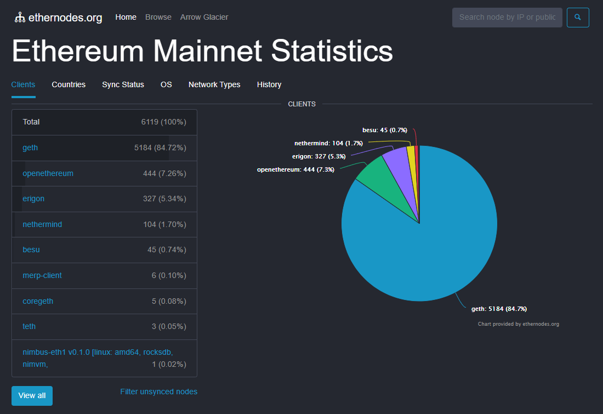
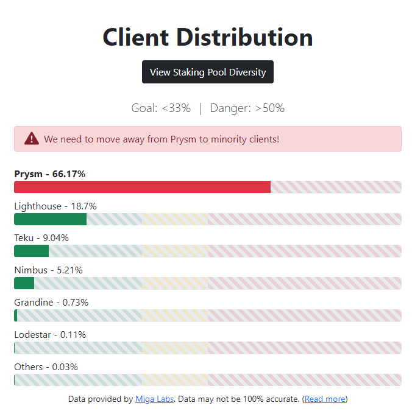
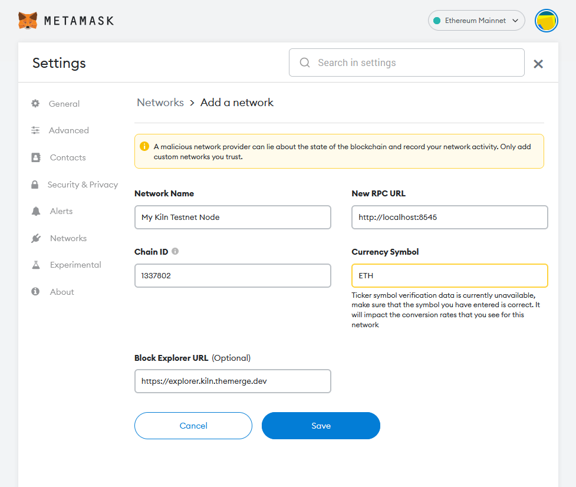

# Guide | Besu + Lodestar | Most Viable Diverse Client | Staking Ethereum on Kiln testnet

## Your Mission - #TestingTheMerge

* To participate in the public testnet known as **Kiln**, the first concentrated public effort to test Ethereum’s upgrade to proof-of-stake with a hardfork called "Paris-Bellatrix" or affectionly called “[The Merge](https://consensys.net/blog/ethereum-2-0/an-update-on-the-merge-after-the-amphora-interop-event-in-greece/)”.&#x20;
* Within the Ethereum network of nodes, you want to maximize [Ethereum's client diversity](https://ethereum.org/en/developers/docs/nodes-and-clients/client-diversity/) by being the **Most Viable Diverse Client** with execution and consensus clients, **Besu and Lodestar** aka **Bestar.**


As of mid-March 2022, Besu is the most minority execution client with 0.74% of nodes. Lodestar is by far the most minority consensus client with 0.11% representation.


 

## Prerequisites

This guide was written for aspiring Ethereum stakers who have basic familiarity with command line tools and it was tested against Ubuntu 20.04.1 LTS client. You’ll need a cloud VPS or local desktop/server/laptop running Ubuntu preferably. Commands are to be run in a terminal window or ssh terminal.

If using a VPS or remote server, install and start the SSH client for your operating system:

**Windows**: [PuTTY](https://www.puttygen.com/download-putty)

**MacOS and Linux**: from the Terminal, use the native command:&#x20;

```
ssh YourUserName@YourServersIP
```

#### **Minimum Hardware Requirements**

* **Operating system:** 64-bit Linux (i.e. Ubuntu 20.04 LTS Server or Desktop)
* **Processor:** Dual core CPU, Intel Core i5–760 or AMD FX-8100 or better
* **Memory:** 8GB RAM
* **Storage:** 30GB SSD

#### **Recommended Hardware Requirements**


Once done with testnet staking, this hardware configuration would be suitable for a mainnet staking node.


* **Operating system:** 64-bit Linux (i.e. Ubuntu 20.04 LTS Server or Desktop)
* **Processor:** Intel i5 or AMD Ryzen 5 or better.
* **Memory:** 32GB RAM
* **Storage:** 2TB SSD or NVME
* **Network**: 100 Mbit or faster connection with at least 2TB per month data plan


For examples of actual staking hardware builds, check out [RocketPool’s hardware guide](https://github.com/rocket-pool/docs.rocketpool.net/blob/main/src/guides/node/local/hardware.md).



**Pro Staking Tip**: Highly recommend you begin with a brand new instance of an OS, VM, and/or machine. Avoid headaches by NOT reusing testnet keys, wallets, or databases for your validator.


## How to participate with Kiln

### 1. Install dependencies and updates

Install packages and update OS

```
sudo apt-get update && sudo apt-get upgrade -y
sudo apt-get install git ufw curl -y
```

Reboot your machine to update installation.

```
sudo reboot
```

### 2. Configure Firewall

Initialize the firewall with Ethereum’s p2p ports and ssh.


For additionaly security, check out the comprehensive [eth staking validator node security best practices guide.](guide-or-how-to-setup-a-validator-on-eth2-mainnet/part-i-installation/guide-or-security-best-practices-for-a-eth2-validator-beaconchain-node.md)


```bash
# By default, deny all incoming and outgoing traffic
sudo ufw default deny incoming
sudo ufw default allow outgoing

# Allow SSH access
sudo ufw allow ssh

# Allow execution client port
sudo ufw allow 30303/tcp

# Allow consensus client port
sudo ufw allow 9000/tcp
sudo ufw allow 9000/udp

# Enable UFW
sudo ufw enable
```

Confirm the settings are in effect.

```
sudo ufw status numbered
```

Example output:

```
Status: active

     To                         Action      From
     --                         ------      ----
[ 1] 9000/udp                   ALLOW IN    Anywhere
[ 2] 22/tcp                     ALLOW IN    Anywhere
[ 3] 30303/tcp                  ALLOW IN    Anywhere
[ 4] 9000/tcp                   ALLOW IN    Anywhere
[ 5] 9000/udp (v6)              ALLOW IN    Anywhere (v6)
[ 6] 22/tcp (v6)                ALLOW IN    Anywhere (v6)
[ 7] 30303/tcp (v6)             ALLOW IN    Anywhere (v6)
[ 8] 9000/tcp (v6)              ALLOW IN    Anywhere (v6)
```


For optimal connectivity, ensure Port Forwarding is setup for your router.


### 3. Synchronize Time with Chrony


Because Consensus Layer Clients relies on accurate times to perform attestations and produce blocks, your node's time must be accurate to real NTP within 0.5 seconds.


Install Chrony with the following.

```
sudo apt-get install chrony -y
```

Wait a few seconds, then verify that Chrony is syncing time.

```
chronyc tracking
```

### 4. Download Kiln configuration files

```bash
#Setup git directory
mkdir ~/git && cd ~/git

#Clone the testnet config files
git clone https://github.com/eth-clients/merge-testnets.git

#Kiln config files found here
cd merge-testnets/kiln && ls
```

### 5. Setup Execution Layer Client

Setup your execution layer client, **Besu.**


****[**Hyperledger Besu**](https://besu.hyperledger.org/) is an open-source Ethereum client designed for demanding enterprise applications requiring secure, high-performance transaction processing in a private network. It's developed under the Apache 2.0 license and written in **Java**.


Install dependencies.

```bash
sudo apt install openjdk-11-jdk libsodium23 libnss3 -y
```

Build the binaries.

```bash
cd $HOME/git
git clone https://github.com/hyperledger/besu.git
cd besu
./gradlew installDist
```

Verify Besu was properly built by viewing the help menu.

```shell
cd build/install/besu
./bin/besu --help
```

Create a service user for the execution service, as this improves security, then create data directories.

```
sudo adduser --system --no-create-home --group execution
sudo mkdir -p /var/lib/besu
```

Generate the JWT secret, a file used by both the execution and consensus client, add read access privileges for the consensus client and setup ownership permissions

```
openssl rand -hex 32 | tr -d "\n" | sudo tee "/var/lib/besu/jwtsecret"
sudo chmod +r /var/lib/besu/jwtsecret
sudo chown -R execution:execution /var/lib/besu
```

Configure systemd by running the following to define your `execution.service` configuration. Simply copy and paste.

```shell
cat > $HOME/execution.service << EOF 
[Unit]
Description     = Besu Execution Layer Client service
Wants           = network-online.target
After           = network-online.target 

[Service]
User            = execution
Restart         = on-failure
RestartSec      = 3
KillSignal      = SIGINT
TimeoutStopSec  = 300
ExecStart       = $HOME/git/besu/build/install/besu/bin/besu \
  --network=kiln \
  --rpc-http-host="0.0.0.0" \
  --rpc-http-cors-origins="*" \
  --rpc-ws-enabled=true \
  --rpc-http-enabled=true \
  --rpc-ws-host="0.0.0.0" \
  --host-allowlist="*" \
  --Xmerge-support=true \
  --engine-host-allowlist="*" \
  --engine-jwt-enabled=true \
  --engine-rpc-ws-port=8550 \
  --engine-rpc-http-port=8551 \
  --engine-jwt-secret="/var/lib/besu/jwtsecret" \
  --metrics-enabled=true \
  --metrics-host=0.0.0.0 \
  --data-storage-format=BONSAI \
  --data-path="/var/lib/besu"
  
[Install]
WantedBy    = multi-user.target
EOF
```

Move the unit file to `/etc/systemd/system` and give it permissions.

```
sudo mv $HOME/execution.service /etc/systemd/system/execution.service
```

```
sudo chmod 644 /etc/systemd/system/execution.service
```

Run the following to enable auto-start at boot time.

```
sudo systemctl daemon-reload
sudo systemctl enable execution
```

Finally, start your execution layer client, Besu and check it's status.

```
sudo systemctl start execution
sudo systemctl status execution
```

Press `Ctrl` + `C` to exit the status.

### 6. Setup Consensus Layer Client

Set up your consensus layer client, **Lodestar**.


[​**Lodestar**](https://lodestar.chainsafe.io/) **is a Typescript implementation** by the Chainsafe.io team. In addition to the beacon chain client, the team is also working on 22 packages and libraries. Finally, the Lodestar team is leading the Ethereum space in light client research and development and has received funding from the EF and Moloch DAO for this purpose.


Install dependencies.

```bash
#install dependencies
sudo apt-get install gcc g++ make git curl -y
```

Install yarn.

```shell
curl -sS https://dl.yarnpkg.com/debian/pubkey.gpg | sudo apt-key add -
echo "deb https://dl.yarnpkg.com/debian/ stable main" | sudo tee /etc/apt/sources.list.d/yarn.list
sudo apt update
sudo apt install yarn -y
```

Install nodejs.

```shell
curl -fsSL https://deb.nodesource.com/setup_16.x | sudo -E bash -
sudo apt-get install -y nodejs
```

Build the binaries.

```bash
cd $HOME/git
git clone https://github.com/chainsafe/lodestar.git
cd lodestar
yarn install --ignore-optional
yarn run build
```

Verify Lodestar was installed properly by displaying the help menu.

```shell
./lodestar --help
```

Create a service user for the consensus service, as this improves security, then create data directories.

```
sudo adduser --system --no-create-home --group consensus
sudo mkdir -p /var/lib/lodestar
```

Copy Kiln testnet configuration files.

```bash
sudo cp $HOME/git/merge-testnets/kiln/config.yaml /var/lib/lodestar
sudo cp $HOME/git/merge-testnets/kiln/boot_enr.yaml /var/lib/lodestar
sudo cp $HOME/git/merge-testnets/kiln/genesis.ssz /var/lib/lodestar
```

Setup ownership permissions.

```
sudo chown -R consensus:consensus /var/lib/lodestar
```

Configure systemd by running the following to define your `consensus.service` configuration. Simply copy and paste.

```bash
cat > $HOME/consensus.service << EOF 
# Lodestar consensus layer client service
# file: /etc/systemd/system/consensus.service 

[Unit]
Description     = Lodestar Consensus Layer Client service
Wants           = network-online.target
After           = network-online.target 

[Service]
User            = consensus
Restart         = on-failure
RestartSec      = 3
KillSignal      = SIGINT
TimeoutStopSec  = 300
WorkingDirectory= $HOME/git/lodestar
ExecStart       = $HOME/git/lodestar/lodestar beacon \
  --rootDir="/var/lib/lodestar" \
  --paramsFile="/var/lib/lodestar/config.yaml" \
  --genesisStateFile="/var/lib/lodestar/genesis.ssz" \
  --eth1.providerUrls=http://127.0.0.1:8545 \
  --execution.urls="http://127.0.0.1:8550" \
  --jwt-secret="/var/lib/besu/jwtsecret" \
  --bootnodesFile="/var/lib/lodestar/boot_enr.yaml" \
  --network.discv5.bootEnrs="enr:-Iq4QMCTfIMXnow27baRUb35Q8iiFHSIDBJh6hQM5Axohhf4b6Kr_cOCu0htQ5WvVqKvFgY28893DHAg8gnBAXsAVqmGAX53x8JggmlkgnY0gmlwhLKAlv6Jc2VjcDI1NmsxoQK6S-Cii_KmfFdUJL2TANL3ksaKUnNXvTCv1tLwXs0QgIN1ZHCCIyk" \
  --network.connectToDiscv5Bootnodes \
  --network.discv5.enabled=true \
  --eth1.depositContractDeployBlock=0 \
  --eth1.enabled \
  --api.rest.enabled \
  --api.rest.host 0.0.0.0 \
  --api.rest.api '*' \
  --metrics.enabled true \
  --metrics.serverPort 8008

[Install]
WantedBy	= multi-user.target
EOF
```

Move the unit file to `/etc/systemd/system` and give it permissions.

```
sudo mv $HOME/consensus.service /etc/systemd/system/consensus.service
```

```
sudo chmod 644 /etc/systemd/system/consensus.service
```

Run the following to enable auto-start at boot time.

```
sudo systemctl daemon-reload
sudo systemctl enable consensus
```

Finally, start your consensus layer client, Lodestar and check it's status.

```
sudo systemctl start consensus
sudo systemctl status consensus
```

Press `Ctrl` + `C` to exit the status.

Check your logs to confirm that the execution and consensus clients are up and syncing.

```
journalctl -fu execution
```

```
journalctl -fu consensus
```

A properly functioning Besu execution client will indicate "Fork-Choice-Updates". For example,

```bash
2022-03-19 04:09:36.315+00:00 | vert.x-worker-thread-0 | INFO  | EngineForkchoiceUpdated | Consensus fork-choice-update: head: 0xcd2a_8b32..., finalized: 0xfa22_1142...
2022-03-19 04:09:48.328+00:00 | vert.x-worker-thread-0 | INFO  | EngineForkchoiceUpdated | Consensus fork-choice-update: head: 0xff1a_f12a..., finalized: 0xfa22_1142...
```


Within Besu's logs, you might see a false warning. In reality, Lodestar consensus client is working fine and no cause for concern.

`WARN | EngineExchangeTransitionConfiguration | not called in 120 seconds, consensus client may not be connected`&#x20;


A properly functioning Lodestar consensus client will indicate "info: Synced". For example,

```bash
Mar-19 04:09:49.000    info: Synced - slot: 3338 - head: 3355 0x5abb_ac30 - execution: valid(0x1a3c_2ca5) - finalized: 0xfa22_1142:3421 - peers: 25
Mar-19 04:09:52.000    info: Synced - slot: 3339 - head: 3356 0xcd2a_8b32 - execution: valid(0xab34_fa32) - finalized: 0xfa22_1142:3421 - peers: 25
Mar-19 04:09:04.000    info: Synced - slot: 3340 - head: 3357 0xff1a_f12a - execution: valid(0xfaf1_b35f) - finalized: 0xfa22_1142:3421 - peers: 25
```

Press `Ctrl` + `C` to exit the logs.


Since the network is relatively new, syncing both the execution and consensus layers should take less than an hour.



Syncing is complete when your latest block and slot number matches the public block explorers.&#x20;

**Consensus client**: check latest slot number with [https://beaconchain.kiln.themerge.dev](https://beaconchain.kiln.themerge.dev)

**Execution client**: check latest block number with [https://explorer.kiln.themerge.dev/blocks](https://explorer.kiln.themerge.dev/blocks)


### 7. Configure MetaMask and Using the Testnet Faucet

Configure your [MetaMask](https://metamask.io/) to point to the Kiln testnet. Visit the [https://kiln.themerge.dev/](https://kiln.themerge.dev/) website and hit the "**Add Network to MetaMask**" button.


For security and privacy reasons, it is best practice to use a brand new unused ETH address for these testnet activities. Do not re-use any of your existing mainnet ETH addresses.


Use the [Kiln Testnet faucet](https://faucet.kiln.themerge.dev/) to acquire some testnet ETH. It may take a few moments, sometimes up to an hour, for the funds to appear in your wallet.


Alternative kiln testnet faucets:&#x20;

* [https://faucet.kiln.ethdevops.io/
  ](https://faucet.kiln.ethdevops.io/http://kiln-faucet.pk-net.net/)
* [http://kiln-faucet.pk-net.net/](https://faucet.kiln.ethdevops.io/http://kiln-faucet.pk-net.net/)


### 8. Generate Validator Keys

With two easy methods, your can setup your mnemonic keys with either:

* [Wagyu - a friendly graphical UI key gen app](https://github.com/stake-house/wagyu-key-gen)
* [staking-deposit-cli](https://github.com/ethereum/staking-deposit-cli/releases) - the original command line based key generator

For the command line method,

```shell
cd $HOME
wget https://github.com/ethereum/staking-deposit-cli/releases/download/v2.1.0/staking_deposit-cli-ce8cbb6-linux-amd64.tar.gz
tar xvf staking_deposit-cli-ce8cbb6-linux-amd64.tar.gz
cd staking_deposit-cli-ce8cbb6-linux-amd64
./deposit new-mnemonic --num_validators 1 --chain kiln
```


Don't lose your **keystore password** and write down your **24 word secret mnemonic key**! Ideally keep this offline but for testnet purposes it's okay to save digitally for your convenience.


### 9. Sign up to be a Validator at the Launchpad

After running the staking deposit tool, you will have a **deposit\_data-##########.json** file which you'll upload to the [Kiln Launchpad](https://kiln.launchpad.ethereum.org/en/).

Your deposit\_data file is located in the following location:

```shell
ls $HOME/staking_deposit-cli-ce8cbb6-linux-amd64/validator_keys
```


Ensure your MetaMask is switched to the Kiln Testnet network.


Follow along the instructions at the Kiln Launchpad. You'll complete this process when you've uploaded your **deposit\_data-##########.json** file and sent the corresponding 32 Kiln testnet ETH deposit to the Kiln staking deposit address.&#x20;


The Kiln network staking deposit address is 0x4242424242424242424242424242424242424242


Verify your deposit was completed on a [block explorer](https://explorer.kiln.themerge.dev/address/0x4242424242424242424242424242424242424242/transactions).

### 10. Setup Validator Client

Create a service user for the validator service, as this improves security, then create data directories.

```
sudo adduser --system --no-create-home --group validator
sudo mkdir -p /var/lib/lodestar/validator
```

Import your validator keys by importing your **keystore file**. Be sure to enter your **keystore password** correctly.

```shell
cd $HOME/git/lodestar
sudo ./lodestar account validator import \
  --network kiln \
  --rootDir="/var/lib/lodestar/validator" \
  --directory $HOME/staking_deposit-cli-ce8cbb6-linux-amd64/validator_keys
```

Setup ownership permissions, including hardening the access to this directory.

```
sudo chown -R validator:validator /var/lib/lodestar/validator
sudo chmod 700 /var/lib/lodestar/validator
```

Verify that your keystore file was imported successfully.

```
sudo ./lodestar account validator list --network kiln --rootDir="/var/lib/lodestar/validator"
```

Once successful, you will be shown your **validator's public key**.

For example, `0x8d9138fcf5676e2031dc4eae30a2c92e3306903eeec83ca83f4f851afbd4cb3b33f710e6f4ac516b4598697b30b04302`


Monitor your validator's status and performance at [https://beaconchain.kiln.themerge.dev/](https://beaconchain.kiln.themerge.dev/) by entering your **validator's public key**.


Configure systemd by running the following to define your `validator.service` configuration. Simply copy and paste.


If you wish to customize a graffiti message that is included when you produce a block, add your message between the double quotes after `--graffiti`.


```bash
cat > $HOME/validator.service << EOF 
# Lodestar validator client service
# file: /etc/systemd/system/validator.service 

[Unit]
Description     = Lodestar validator Client service
Wants           = network-online.target
After           = network-online.target 

[Service]
User            = validator
Restart         = on-failure
RestartSec      = 3
KillSignal      = SIGINT
TimeoutStopSec  = 300
WorkingDirectory= $HOME/git/lodestar
ExecStart       = $HOME/git/lodestar/lodestar validator \
                --network kiln \
                --rootDir="/var/lib/lodestar/validator" \
                --graffiti=""

[Install]
WantedBy	= multi-user.target
EOF
```

Move the unit file to `/etc/systemd/system` and give it permissions.

```
sudo mv $HOME/validator.service /etc/systemd/system/validator.service
```

```
sudo chmod 644 /etc/systemd/system/validator.service
```

Run the following to enable auto-start at boot time.

```
sudo systemctl daemon-reload
sudo systemctl enable validator
```

Finally, start your validator client and check it's status.

```
sudo systemctl start validator
sudo systemctl status validator
```

Check your logs to confirm that the validator clients are up and functioning.

```
journalctl -fu validator
```


After making your 32 ETH deposit, your validator is placed into queue for activation which typically takes 6-24 hours. Once activated, your validator begins staking and attestation duties. Learn more about the [depositing process.](https://kb.beaconcha.in/ethereum-2.0-and-depositing-process)


A properly functioning Lodestar validator will indicate publishing of attestations. For example,

```bash
Mar-19  03:33:30.228     info: Published aggregateAndProofs slot=2662, index=13, count=1
Mar-19  03:37:48.393     info: Published attestations slot=2699, index=20, count=1
Mar-19  03:46:36.450     info: Published attestations slot=2713, index=2, count=1
Mar-19  03:53:48.944     info: Published attestations slot=2765, index=21, count=1
Mar-19  04:01:48.812     info: Published attestations slot=2809, index=17, count=1
```

Press `Ctrl` + `C` to exit the logs.


:tada:Congrats on setting up your Kiln “Merge” staking node!


### 11. Next Steps

As a newly minted Ethereum Staker,

* \#TestingTheMerge has a [comprehensive list of things-to-test](https://hackmd.io/WKpg6SNzQbi1jVKNgrSgWg)
* Monitor your validator's earnings and performance at [https://beaconchain.kiln.themerge.dev/](https://beaconchain.kiln.themerge.dev/) by entering your validator's public key.
* Learn to connect your MetaMask wallet to [your own execution layer node](https://media.consensys.net/make-use-of-your-remote-ethereum-node-using-an-ssh-tunnel-and-metamask-f7b51f7c1c0f)
  * If node is remote then establish a ssh tunnel. Configure MetaMask with these settings.



### Additional Information

#### Stopping the execution, consensus and validator clients

```
sudo systemctl stop execution
sudo systemctl stop consensus
sudo systemctl stop validator 
```

#### Viewing logs / troubleshooting

```shell
#View Besu
journalctl -fu execution

#View Lodestar Beacon Chain
journalctl -fu consensus

#View Lodestar Validator
journalctl -fu validator
```

#### Removing your validator from staking duties: Perform a Voluntary Exit

```shell
#Stop validator first
sudo systemctl stop validator 

#Perform a voluntary exit, follow the prompts and confirm your choices
sudo ./lodestar account validator voluntary-exit --rootDir /var/lib/lodestar/validator --network kiln

#Restart validator. 
sudo systemctl start validator

#Finally in 1/2 day, your validator will exit and no longer have staking duties.
sudo systemctl stop validator
sudo systemctl disable validator
```

### Reference Material



### Support and Community

* [https://www.reddit.com/r/ethstaker](https://www.reddit.com/r/ethstaker)
