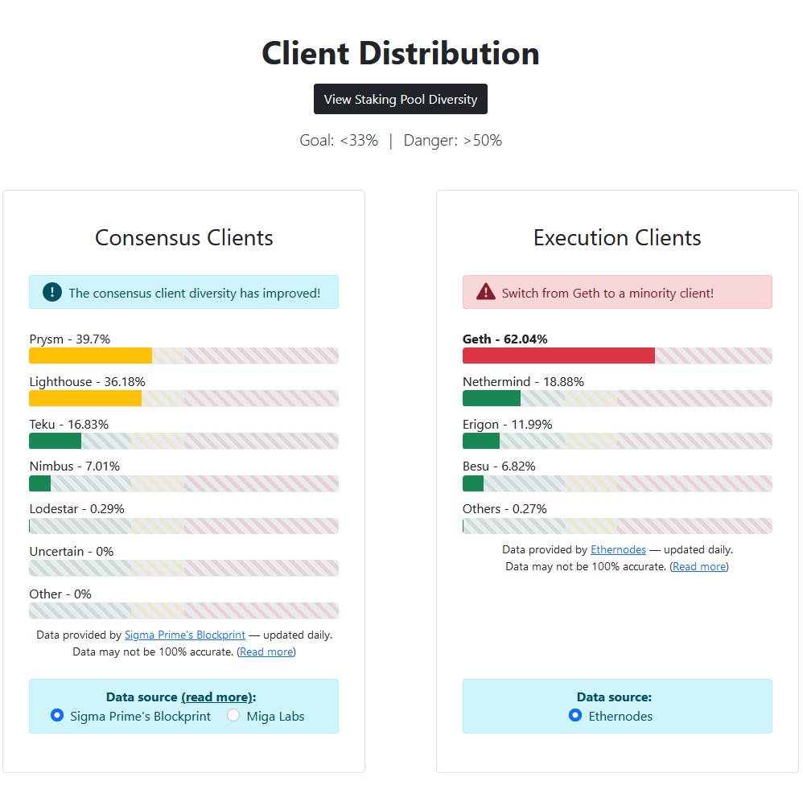
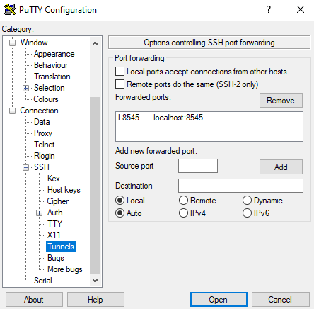
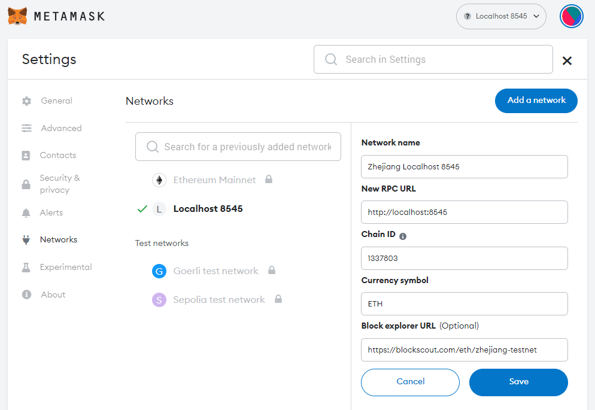

# Guide | Ethereum Staking on Zhejiang Testnet | Lodestar | Most Diverse Client

## Your Mission - #TestingTheWithdrawalsShanghai

* **Overview**: To participate in the public testnet known as **Zhejiang**, the first public effort to test Ethereum’s upgrade to enabling validator withdrawals with a hardfork called "Shanghai-Capella" or also known as [EIP 4855](https://eips.ethereum.org/EIPS/eip-4895).
* **Goals**: To test your staking setups, practice voluntary exits and validator withdrawals.
* **Staked ETH:** With the new ability to withdraw staked ETH since beacon chain genesis on December 1 2020, this upgrade to Ethereum POS will add flexibility and attract the next wave of stakers and innovation.
* **Client Diversity**: Within the Ethereum network of nodes, you want to maximize [Ethereum's client diversity](https://ethereum.org/en/developers/docs/nodes-and-clients/client-diversity/) by being the **Most Diverse Client** with execution and consensus clients, **Besu and Lodestar** aka **Bestar.**
* **Timeline**: Assuming this testnet is thoroughly tested, mainnet Ethereum could be upgraded sometime in March 2023.


As of early February 2023, Besu is the most minority execution client with 6.8% of nodes. Lodestar is by far the most minority consensus client with 0.29% representation.


<figure><figcaption><p>Besu Lodestar Client Diversity</p></figcaption></figure>

## How Staking on Ethereum Works

1. Acquire some hardware (laptop, desktop, server) or rent a VPS (cloud server): You need to run a node to stake.
2. Sync an execution layer client
3. Sync a consensus layer client
4. Generate your validator keys and import them into your validator client
5. Monitor and maintain your node

A Ethereum node consists of the Execution Layer + Consensus Layer.

A Ethereum Staking node is the previous plus a Validator client.

<figure><figcaption><p>Client Stack</p></figcaption></figure>

<figure><figcaption><p>Big picture: Execution / Consensus / Validator</p></figcaption></figure>

## Prerequisites

This guide was written for aspiring Ethereum stakers who have basic familiarity with command line tools and it was tested against Ubuntu 22.04.1 LTS client. You’ll want a dedicated cloud VPS or local desktop/server/laptop running a clean install of Ubuntu preferably.

If using a VPS or remote server, install and start the SSH client for your operating system:

**Windows**: [PuTTY](https://www.puttygen.com/download-putty)

**MacOS and Linux**: from the Terminal, use the native command:

```
ssh <YourUserName>@<YourServersIP>
```

## How to Run Commands

* Commands are to be run in a terminal window or ssh terminal.
* Commands preceded by `sudo` will prompt for your password at first, and periodically afterwards.

## **Minimum Hardware Requirements**

* **Operating system:** 64-bit Linux (i.e. Ubuntu 22.04 LTS Server or Desktop)
* **Processor:** Dual core CPU, Intel Core i5–760 or AMD FX-8100 or better
* **Memory:** 16GB RAM
* **Storage:** 40GB SSD

## **Recommended Hardware Requirements**


Once done with testnet staking, this hardware configuration would be suitable for a mainnet staking node.


* **Operating system:** 64-bit Linux (i.e. Ubuntu 22.04 LTS Server or Desktop)
* **Processor:** Intel i5 or AMD Ryzen 5 or better.
* **Memory:** 32GB RAM
* **Storage:** 2TB SSD or NVME
* **Network**: 100 Mbit or faster connection with at least 2TB per month data plan


For examples of actual staking hardware builds, check out [RocketPool’s hardware guide](https://github.com/rocket-pool/docs.rocketpool.net/blob/main/src/guides/node/local/hardware.md).


<figure><figcaption><p>Ethereum Staking Node</p></figcaption></figure>


**Pro Staking Tip**: Highly recommend you begin with a brand new instance of an OS, VM, and/or machine. Avoid headaches by NOT reusing testnet keys, wallets, or databases for your validator.


## How to participate with Zhejiang

### 1. Install dependencies and updates

Install packages and update OS.

```
sudo apt-get update && sudo apt-get upgrade -y
sudo apt-get install git ufw curl ccze -y
```

Reboot your machine to update installation.

```
sudo reboot
```

### 2. Configure Firewall

Initialize the firewall with Ethereum’s p2p ports and ssh.

<pre class="language-bash"><code class="lang-bash"># By default, deny all incoming and outgoing traffic
<strong>sudo ufw default deny incoming
</strong>sudo ufw default allow outgoing

# Allow SSH access
sudo ufw allow ssh

# Allow execution client port
sudo ufw allow 30303/tcp

# Allow consensus client port
sudo ufw allow 9000/tcp
sudo ufw allow 9000/udp

# Enable UFW
sudo ufw enable
</code></pre>

Confirm the settings are in effect.

```
sudo ufw status numbered
```

Example output:

```
Status: active

     To                         Action      From
     --                         ------      ----
[ 1] 9000/udp                   ALLOW IN    Anywhere
[ 2] 22/tcp                     ALLOW IN    Anywhere
[ 3] 30303/tcp                  ALLOW IN    Anywhere
[ 4] 9000/tcp                   ALLOW IN    Anywhere
[ 5] 9000/udp (v6)              ALLOW IN    Anywhere (v6)
[ 6] 22/tcp (v6)                ALLOW IN    Anywhere (v6)
[ 7] 30303/tcp (v6)             ALLOW IN    Anywhere (v6)
[ 8] 9000/tcp (v6)              ALLOW IN    Anywhere (v6)
```


For optimal connectivity, ensure Port Forwarding is setup for your router. Learn to port foward with guides found at [https://portforward.com/how-to-port-forward](https://portforward.com/how-to-port-forward/)


### 3. Synchronize Time with Chrony


Because Consensus Layer Clients relies on accurate times to perform attestations and produce blocks, your node's time must be accurate to real NTP within 0.5 seconds.


Install Chrony with the following.

```
sudo apt-get install chrony -y
```

Wait a few seconds, then verify that Chrony is syncing time.

```
chronyc tracking
```

### 4. Download Zhejiang configuration files

<pre class="language-bash"><code class="lang-bash">#Setup git directory
<strong>mkdir ~/git &#x26;&#x26; cd ~/git
</strong>
#Clone the testnet config files
git clone https://github.com/ethpandaops/withdrawals-testnet.git

#Make a directory to store config files
sudo mkdir -p /var/lib/ethereum/zhejiang

#Copy config files to default location
sudo cp -R ~/git/withdrawals-testnet/zhejiang-testnet/custom_config_data /var/lib/ethereum/zhejiang
</code></pre>

### 5. Setup Execution Layer Client

Setup your execution layer client, your choice of **Nethermind or Besu.**


Only one execution layer client is required per node.



[**Hyperledger Besu**](https://besu.hyperledger.org/) is an open-source Ethereum client designed for demanding enterprise applications requiring secure, high-performance transaction processing in a private network. It's developed under the Apache 2.0 license and written in **Java**.


****[**Nethermind**](https://docs.nethermind.io/nethermind/) **** is all about performance and flexibility. Built on .NET core, a widespread, enterprise-friendly platform, Nethermind makes integration with existing infrastructures simple, without losing sight of stability, reliability, data integrity, and security.


<details>

<summary>Install Nethermind</summary>

Install dependencies.

```bash
sudo apt-get update
sudo apt-get install curl libsnappy-dev libc6-dev jq libc6 unzip -y
```

Review the latest release at [https://github.com/NethermindEth/nethermind/releases](https://github.com/NethermindEth/nethermind/releases)

Run the following to automatically download the latest linux release, un-zip and cleanup.

```bash
cd $HOME
curl -s https://api.github.com/repos/NethermindEth/nethermind/releases/latest | jq -r ".assets[] | select(.name) | .browser_download_url" | grep linux-x64 | xargs wget -q --show-progress
unzip -o nethermind*.zip -d $HOME/nethermind
rm nethermind*linux*.zip
```

Install the binaries.

<pre class="language-shell"><code class="lang-shell"><strong>sudo cp -a $HOME/nethermind /usr/local/bin/nethermind
</strong></code></pre>

Download the testnet configs.

```
cd /usr/local/bin/nethermind/configs
wget https://raw.githubusercontent.com/NethermindEth/nethermind/master/src/Nethermind/Nethermind.Runner/configs/withdrawals_devnet.cfg
```

Create a service user for the execution service, as this improves security, then create data directories.

<pre><code><strong>sudo adduser --system --no-create-home --group execution
</strong>sudo mkdir -p /var/lib/nethermind/zhejiang
<strong>sudo chown -R execution:execution /var/lib/nethermind/zhejiang
</strong></code></pre>

Generate the JWT secret, a file used by both the execution and consensus client, add read access privileges for the consensus client and setup ownership permissions

```
openssl rand -hex 32 | tr -d "\n" | sudo tee "/var/lib/ethereum/zhejiang/jwtsecret"
sudo chmod +r /var/lib/ethereum/zhejiang/jwtsecret
```

Create a **systemd unit file** to define your `execution.service` configuration.

```
sudo nano /etc/systemd/system/execution.service
```

Paste the following configuration into the file.

```shell
[Unit]
Description=Nethermind Execution Layer Client service for Zhejiang
Wants=network-online.target
After=network-online.target
Documentation=https://www.coincashew.com

[Service]
Type=simple
User=execution
Group=execution
Restart=on-failure
RestartSec=3
KillSignal=SIGINT
TimeoutStopSec=300
WorkingDirectory=/var/lib/nethermind/zhejiang
Environment="DOTNET_BUNDLE_EXTRACT_BASE_DIR=/var/lib/nethermind/zhejiang"
ExecStart=/usr/local/bin/nethermind/Nethermind.Runner \
  --config withdrawals_devnet \
  --datadir="/var/lib/nethermind/zhejiang" \
  --JsonRpc.JwtSecretFile="/var/lib/ethereum/zhejiang/jwtsecret" \
  --Init.ChainSpecPath="/var/lib/ethereum/zhejiang/custom_config_data/chainspec.json" \
  --Discovery.Bootnodes="enode://691c66d0ce351633b2ef8b4e4ef7db9966915ca0937415bd2b408df22923f274873b4d4438929e029a13a680140223dcf701cabe22df7d8870044321022dfefa@64.225.78.1:30303,enode://89347b9461727ee1849256d78e84d5c86cc3b4c6c5347650093982b726d71f3d08027e280b399b7b6604ceeda863283dcfe1a01e93728b4883114e9f8c7cc8ef@146.190.238.212:30303,enode://c2892072efe247f21ed7ebea6637ade38512a0ae7c5cffa1bf0786d5e3be1e7f40ff71252a21b36aa9de54e49edbcfc6962a98032adadfa29c8524262e484ad3@165.232.84.160:30303,enode://71e862580d3177a99e9837bd9e9c13c83bde63d3dba1d5cea18e89eb2a17786bbd47a8e7ae690e4d29763b55c205af13965efcaf6105d58e118a5a8ed2b0f6d0@68.183.13.170:30303,enode://2f6cf7f774e4507e7c1b70815f9c0ccd6515ee1170c991ce3137002c6ba9c671af38920f5b8ab8a215b62b3b50388030548f1d826cb6c2b30c0f59472804a045@161.35.147.98:30303"

[Install]
WantedBy=multi-user.target
```

To exit and save, press `Ctrl` + `X`, then `Y`, then `Enter`.

</details>

<details>

<summary>Install Besu</summary>

Install dependencies.

```bash
sudo apt install -y openjdk-17-jdk libjemalloc-dev
```

Build the binaries.

```bash
cd $HOME/git
git clone https://github.com/hyperledger/besu.git
cd besu
./gradlew installDist
```

Verify Besu was properly built by checking the version.

```shell
./build/install/besu/bin/besu --version
```


Sample output of a compatible version.

`besu/v23.1.0-dev-e18e407c/linux-x86_64/openjdk-java-17`

`2023-02-02 01:22:12.000+00:00 | main | INFO | Besu | Using jemalloc`


Install the binaries.

<pre class="language-shell"><code class="lang-shell"><strong>sudo cp -a $HOME/git/besu/build/install/besu /usr/local/bin/besu
</strong></code></pre>

Create a service user for the execution service, as this improves security, then create data directories.

<pre><code><strong>sudo adduser --system --no-create-home --group execution
</strong>sudo mkdir -p /var/lib/besu/zhejiang
sudo chown -R execution:execution /var/lib/besu/zhejiang
</code></pre>

Generate the JWT secret, a file used by both the execution and consensus client, add read access privileges for the consensus client and setup ownership permissions

```
openssl rand -hex 32 | tr -d "\n" | sudo tee "/var/lib/ethereum/zhejiang/jwtsecret"
sudo chmod +r /var/lib/ethereum/zhejiang/jwtsecret
```

Create a **systemd unit file** to define your `execution.service` configuration.

```
sudo nano /etc/systemd/system/execution.service
```

Paste the following configuration into the file.

```shell
[Unit]
Description=Besu Execution Layer Client service for Zhejiang
Wants=network-online.target
After=network-online.target
Documentation=https://www.coincashew.com

[Service]
Type=simple
User=execution
Group=execution
Restart=on-failure
RestartSec=3
KillSignal=SIGINT
TimeoutStopSec=300
Environment="JAVA_OPTS=-Xmx5g"
ExecStart=/usr/local/bin/besu/bin/besu \
  --network-id=1337803 \
  --rpc-ws-enabled=true \
  --rpc-http-enabled=true \
  --engine-jwt-secret="/var/lib/ethereum/zhejiang/jwtsecret" \
  --metrics-enabled=true \
  --data-storage-format=BONSAI \
  --sync-mode=X_CHECKPOINT \
  --Xplugin-rocksdb-high-spec-enabled \
  --genesis-file="/var/lib/ethereum/zhejiang/custom_config_data/besu.json" \
  --data-path="/var/lib/besu/zhejiang" \
  --bootnodes="enode://691c66d0ce351633b2ef8b4e4ef7db9966915ca0937415bd2b408df22923f274873b4d4438929e029a13a680140223dcf701cabe22df7d8870044321022dfefa@64.225.78.1:30303,enode://89347b9461727ee1849256d78e84d5c86cc3b4c6c5347650093982b726d71f3d08027e280b399b7b6604ceeda863283dcfe1a01e93728b4883114e9f8c7cc8ef@146.190.238.212:30303,enode://c2892072efe247f21ed7ebea6637ade38512a0ae7c5cffa1bf0786d5e3be1e7f40ff71252a21b36aa9de54e49edbcfc6962a98032adadfa29c8524262e484ad3@165.232.84.160:30303,enode://71e862580d3177a99e9837bd9e9c13c83bde63d3dba1d5cea18e89eb2a17786bbd47a8e7ae690e4d29763b55c205af13965efcaf6105d58e118a5a8ed2b0f6d0@68.183.13.170:30303,enode://2f6cf7f774e4507e7c1b70815f9c0ccd6515ee1170c991ce3137002c6ba9c671af38920f5b8ab8a215b62b3b50388030548f1d826cb6c2b30c0f59472804a045@161.35.147.98:30303"
  
[Install]
WantedBy=multi-user.target
```

To exit and save, press `Ctrl` + `X`, then `Y`, then `Enter`.


</details>

Run the following to enable auto-start at boot time.

```
sudo systemctl daemon-reload
sudo systemctl enable execution
```

Finally, start your execution layer client and check it's status.

```
sudo systemctl start execution
sudo systemctl status execution
```

Press `Ctrl` + `C` to exit the status.

### 6. Setup Consensus Layer Client

Set up your consensus layer client, **Lodestar**.


[​**Lodestar**](https://lodestar.chainsafe.io/) **is a Typescript implementation** by the Chainsafe.io team. In addition to the beacon chain client, the team is also working on 22 packages and libraries. Finally, the Lodestar team is leading the Ethereum space in light client research and development and has received funding from the EF and Moloch DAO for this purpose.


<details>

<summary>Install Lodestar Consensus Client</summary>

Install dependencies.

```bash
sudo apt-get install gcc g++ make git curl -y
```

Install yarn.

```shell
curl -sS https://dl.yarnpkg.com/debian/pubkey.gpg | sudo apt-key add -
echo "deb https://dl.yarnpkg.com/debian/ stable main" | sudo tee /etc/apt/sources.list.d/yarn.list
sudo apt update
sudo apt install yarn -y
```

Install nodejs.

<pre class="language-shell"><code class="lang-shell"><strong>curl -fsSL https://deb.nodesource.com/setup_18.x | sudo -E bash -
</strong>sudo apt-get install -y nodejs
</code></pre>

Build the binaries.

```bash
cd $HOME/git
git clone -b unstable https://github.com/chainsafe/lodestar.git
cd lodestar
yarn install --ignore-optional
yarn run build
```

Verify Lodestar was installed properly by displaying the version.

```shell
./lodestar --version
```


Sample output of a compatible version.

🌟 Lodestar: TypeScript Implementation of the Ethereum Consensus Beacon Chain.

* Version: v1.4.1/bff1438
* by ChainSafe Systems, 2018-2022


Install the binaries.

```shell
sudo cp -a $HOME/git/lodestar /usr/local/bin/lodestar
```

Create a service user for the consensus service, as this improves security, then create data directories.

```
sudo adduser --system --no-create-home --group consensus
sudo mkdir -p /var/lib/lodestar/zhejiang
```

Setup ownership permissions.

```
sudo chown -R consensus:consensus /var/lib/lodestar
```

Create a **systemd unit file** to define your `consensus.service` configuration.

<pre><code><strong>sudo nano /etc/systemd/system/consensus.service
</strong></code></pre>

Paste the following configuration into the file. Replace `<enter-eth-address-here>` with your suggested fee recipient ETH address.

```bash
[Unit]
Description=Lodestar Consensus Layer Client service for Zhejiang
Wants=network-online.target
After=network-online.target
Documentation=https://www.coincashew.com

[Service]
Type=simple
User=consensus
Group=consensus
Restart=on-failure
RestartSec=3
KillSignal=SIGINT
TimeoutStopSec=300
WorkingDirectory=/usr/local/bin/lodestar
ExecStart=/usr/local/bin/lodestar/lodestar beacon \
  --dataDir="/var/lib/lodestar/zhejiang" \
  --paramsFile="/var/lib/ethereum/zhejiang/custom_config_data/config.yaml" \
  --genesisStateFile="/var/lib/ethereum/zhejiang/custom_config_data/genesis.ssz" \
  --execution.urls="http://127.0.0.1:8551" \
  --jwt-secret="/var/lib/ethereum/zhejiang/jwtsecret" \
  --bootnodes="enr:-Iq4QMCTfIMXnow27baRUb35Q8iiFHSIDBJh6hQM5Axohhf4b6Kr_cOCu0htQ5WvVqKvFgY28893DHAg8gnBAXsAVqmGAX53x8JggmlkgnY0gmlwhLKAlv6Jc2VjcDI1NmsxoQK6S-Cii_KmfFdUJL2TANL3ksaKUnNXvTCv1tLwXs0QgIN1ZHCCIyk,enr:-Ly4QOS00hvPDddEcCpwA1cMykWNdJUK50AjbRgbLZ9FLPyBa78i0NwsQZLSV67elpJU71L1Pt9yqVmE1C6XeSI-LV8Bh2F0dG5ldHOIAAAAAAAAAACEZXRoMpDuKNezAAAAckYFAAAAAAAAgmlkgnY0gmlwhEDhTgGJc2VjcDI1NmsxoQIgMUMFvJGlr8dI1TEQy-K78u2TJE2rWvah9nGqLQCEGohzeW5jbmV0cwCDdGNwgiMog3VkcIIjKA,enr:-MK4QMlRAwM7E8YBo6fqP7M2IWrjFHP35uC4pWIttUioZWOiaTl5zgZF2OwSxswTQwpiVCnj4n56bhy4NJVHSe682VWGAYYDHkp4h2F0dG5ldHOIAAAAAAAAAACEZXRoMpDuKNezAAAAckYFAAAAAAAAgmlkgnY0gmlwhJK-7tSJc2VjcDI1NmsxoQLDq7LlsXIXAoJXPt7rqf6CES1Q40xPw2yW0RQ-Ly5S1YhzeW5jbmV0cwCDdGNwgiMog3VkcIIjKA" \
  --metrics=true \
  --suggestedFeeRecipient=<enter-eth-address-here>

[Install]
WantedBy=multi-user.target
```

To exit and save, press `Ctrl` + `X`, then `Y`, then `Enter`.

</details>

Run the following to enable auto-start at boot time.

```
sudo systemctl daemon-reload
sudo systemctl enable consensus
```

Finally, start your consensus layer client and check it's status.

```
sudo systemctl start consensus
sudo systemctl status consensus
```

Press `Ctrl` + `C` to exit the status.

Check your logs to confirm that the execution and consensus clients are up and syncing.

```
journalctl -fu execution | ccze
```

```
journalctl -fu consensus | ccze
```

<details>

<summary>Sample <strong>Besu</strong> Logs</summary>

A properly functioning **Besu** execution client will indicate "Fork-Choice-Updates". For example,

```bash
2022-03-19 04:09:36.315+00:00 | vert.x-worker-thread-0 | INFO  | EngineForkchoiceUpdated | Consensus fork-choice-update: head: 0xcd2a_8b32..., finalized: 0xfa22_1142...
2022-03-19 04:09:48.328+00:00 | vert.x-worker-thread-0 | INFO  | EngineForkchoiceUpdated | Consensus fork-choice-update: head: 0xff1a_f12a..., finalized: 0xfa22_1142...
```

**Known error in Lodestar/Besu consensus logs**: As noted in [Lodestar's discord](https://discord.com/channels/593655374469660673/743858262864167062/1066771696394191039), there will be a noisy error about updating eth1 chain cache. This does not seem to affect node syncing or validator duties.

Example error output:

```
error: Error updating eth1 chain cache JSON RPC error: Number of requests exceeds max batch size, batch Error: JSON RPC error: Number of requests exceeds max batch size, batch at JsonRpcHttpClient.fetchBatch (file:///usr/local/bin/lodestar/packages/beacon-node/src/eth1/provider/jsonRpcHttpClient.ts:151:15) at processTicksAndRejections (node:internal/process/task_queues:95:5) at Eth1Provider.getBlocksByNumber...
```

</details>

<details>

<summary>Sample Nethermind Logs</summary>

A properly functioning **Nethermind** execution client will indicate "block nnn ... was processed". For example,

```markup
Nethermind.Runner[2]: 2023-02-03 00:01:36.2643|FCU - block 16001 (fd781...c2e19f) was processed.
Nethermind.Runner[2]: 2023-02-03 00:01:36.2643|Block 0xd78eaabc854f4e4a844c5c0f9ccf45bed0b2f13d77ea978af62d0eef2210c2e19f was set as head.
```

</details>

<details>

<summary>Sample Lodestar Consensus Logs</summary>

A properly functioning **Lodestar** consensus client will indicate "info: Synced". For example,

```bash
Mar-19 04:09:49.000    info: Synced - slot: 3338 - head: 3355 0x5abb_ac30 - execution: valid(0x1a3c_2ca5) - finalized: 0xfa22_1142:3421 - peers: 25
Mar-19 04:09:52.000    info: Synced - slot: 3339 - head: 3356 0xcd2a_8b32 - execution: valid(0xab34_fa32) - finalized: 0xfa22_1142:3421 - peers: 25
Mar-19 04:09:04.000    info: Synced - slot: 3340 - head: 3357 0xff1a_f12a - execution: valid(0xfaf1_b35f) - finalized: 0xfa22_1142:3421 - peers: 25
```

</details>

Press `Ctrl` + `C` to exit the logs.


Since the network is relatively new, syncing both the execution and consensus layers should take less than an hour.


Syncing is complete when your latest block and slot number matches the public block explorers.

**Consensus client**: check latest slot number with [https://zhejiang.beaconcha.in](https://zhejiang.beaconcha.in)

**Execution client**: check latest block number with[\
https://blockscout.com/eth/zhejiang-testnet](https://blockscout.com/eth/zhejiang-testnet)

### 7. Configure MetaMask and Use the Testnet Faucet

Configure your [MetaMask](https://metamask.io/) to point to the Zhejiang testnet or use your own node.

<details>

<summary>Use remote RPC from ethpandaops.io</summary>

1\) Visit [https://zhejiang.ethpandaops.io](https://zhejiang.ethpandaops.io) website

2\) Click the "**Add Network to MetaMask**" button

</details>

<details>

<summary>Use my node</summary>

#### 1) Setup SSH tunnel

**Note**: If your node and where metamask resides is on the same local laptop/desktop/server, skip step 1.

If your node is remote or on another machine, open a SSH tunnel to your node.

For Mac/Linux,

Typically you an open a ssh tunnel with the following:

```
ssh -N -v <user>@<staking.node.ip.address> -L 8545:localhost:8545
```

For Windows using Putty, configure the SSH Tunnel as follows:

1\) Navigate to`Connection > SSH > Tunnels`&#x20;

2\) Set Source port: **8545**

3\) Set Destination: **localhost:8545**

4\) Click **Add** button, then **Open** Button



#### 2) Add a network to Metamask:

Go to `Metamask > Settings> Networks > Add a network > Localhost 8545`

Configure your Metamask as follows:

* **Network name**: Zhejiang Localhost 8545
* **New RPC URL**: [http://localhost:8545](http://localhost:8545)
* **Chain ID**: 1337803
* **Currency symbol**: ETH
* **Block explorer URL**: [https://blockscout.com/eth/zhejiang-testnet](https://blockscout.com/eth/zhejiang-testnet)



</details>


For security and privacy reasons, it is best practice to use a brand new unused ETH address for these testnet activities. Avoid re-using any of your existing mainnet ETH addresses.


Use the [Testnet faucet](https://faucet.zhejiang.ethpandaops.io/) to acquire at least 32 Zhejiang testnet ETH for 1 validator. It may take a few moments, sometimes up to an hour, for the funds to appear in your wallet. Or request funds from the [ethStaker Discord](http://discord.io/ethstaker) in the #request-zhejiang-eth channel. Alternatively, use the [POW faucet by pk910](https://zhejiang-faucet.pk910.de/)

### 8. Generate Validator Keys

With two easy methods, your can setup your mnemonic keys with either:

* [Wagyu - a friendly graphical UI key gen app](https://github.com/stake-house/wagyu-key-gen)
* [staking-deposit-cli](https://github.com/ethereum/staking-deposit-cli/releases) - the original command line based key generator

<details>

<summary>Staking Deposit CLI Instructions</summary>

For the command line method,

```shell
cd $HOME
wget https://github.com/ethereum/staking-deposit-cli/releases/download/v2.4.0/staking_deposit-cli-ef89710-linux-amd64.tar.gz
```

Verify the SHA256 Checksum matches the checksum on the [releases page](https://github.com/ethereum/staking-deposit-cli/releases/tag/v2.3.0).

```bash
echo "c2b12a9e515f904ca359ec39dfbd7022dfefe881c1796ce42319df0a2da05560 *staking_deposit-cli-ef89710-linux-amd64.tar.gz" | shasum -a 256 --check
```

Example valid output:

staking\_deposit-cli-ef89710-linux-amd64.tar.gz: OK

Only proceed if the sha256 check passes with **OK**!

Extract the archive.

```
tar xvf staking_deposit-cli-ef89710-linux-amd64.tar.gz
mv staking_deposit-cli-ef89710-linux-amd64 staking-deposit-cli
cd staking-deposit-cli
```

Make a new mnemonic and replace `<ETH_ADDRESS_FROM_IDEALLY_HARDWARE_WALLET>` with your [ethereum withdrawal address](https://notes.ethereum.org/@launchpad/withdrawals-faq#Q-If-I-used---eth1\_withdrawal\_address-when-making-my-initial-deposit-which-type-of-withdrawal-credentials-do-I-have), ideally from a Trezor, Ledger or comparable hardware wallet. Adjust number of validators accordingly.

```
./deposit new-mnemonic --num_validators 1 --chain zhejiang --eth1_withdrawal_address <ETH_ADDRESS_FROM_IDEALLY_HARDWARE_WALLET>
```

Run the following, in case of this error: `RuntimeError: Click will abort further execution because Python 3 was configured to use ASCII as encoding for the environment.`

```
export LC_ALL=C.UTF-8
export LANG=C.UTF-8
```

</details>

<details>

<summary>Wagyu Instructions</summary>

For the Wagyu key gen app, make sure to select the _Zhejiang_ network and follow the guided steps.

Wagyu (formerly known as StakeHouse) is an application aimed at lowering the technical bar to staking on Ethereum 2.0.

Download Wagyu: [https://wagyu.gg](https://wagyu.gg/)

Github: [https://github.com/stake-house/wagyu-installer](https://github.com/stake-house/wagyu-installer)

After creating the validator keys locally, you'll want to copy these validator keys via USB key or rsync file transfer to your staking node.

To align with this guide's steps, first make a default path to store your validator keys

```
mkdir -p $HOME/staking-deposit-cli/validator_keys
```

If using USB key, mount the key then copy.

```
cp <directory-with-keys>/*.json $HOME/staking-deposit-cli/validator_keys
```

If using rsync, copy your validator keys from your local computer to your staking node with the following command. Change ssh port if needed.

```
rsync -a "ssh -p 22" <directory-with-keys>/*.json <username>@<remote_host>:/home/<username>/staking-deposit-cli/validator_keys
```

</details>

Don't lose your **keystore password** and write down your **24 word secret mnemonic key**! Ideally keep this offline but for testnet purposes it's okay to save digitally for your convenience.

### 9. Sign up to be a Validator at the Launchpad

After running the staking deposit tool, you will have a **deposit\_data-##########.json** file which you'll upload to the [Launchpad](https://zhejiang.launchpad.ethereum.org/).

Your deposit\_data file is located in the following location:

```shell
ls $HOME/staking-deposit-cli/validator_keys
```


Ensure your MetaMask is switched to the Zhejiang Testnet network.


Follow along the instructions at the [Launchpad](https://zhejiang.launchpad.ethereum.org/). You'll complete this process when you've uploaded your **deposit\_data-##########.json** file and sent the corresponding 32 Zhejiang testnet ETH deposit to the Zhejiang staking deposit address.


The Zhejiang network staking deposit address is 0x4242424242424242424242424242424242424242


After sending the deposit with Metamask, verify your deposit was completed on a [block explorer](https://blockscout.com/eth/zhejiang-testnet/address/0x4242424242424242424242424242424242424242).

### 10. Setup Validator Client

<details>

<summary>Install Lodestar Validator Client</summary>

Create a service user for the validator service, as this improves security, then create data directories.

<pre><code>sudo adduser --system --no-create-home --group validator
<strong>sudo mkdir -p /var/lib/lodestar/validator/zhejiang
</strong></code></pre>

Import your validator keys by importing your **keystore file**. Be sure to enter your **keystore password** correctly.

```shell
cd /usr/local/bin/lodestar
sudo ./lodestar validator import \
  --dataDir="/var/lib/lodestar/validator/zhejiang" \
  --keystore=$HOME/staking-deposit-cli/validator_keys
```

Setup ownership permissions, including hardening the access to this directory.

```
sudo chown -R validator:validator /var/lib/lodestar/validator/zhejiang
sudo chmod 700 /var/lib/lodestar/validator/zhejiang
```

Verify that your keystore file was imported successfully.

<pre class="language-bash"><code class="lang-bash"><strong>cd /usr/local/bin/lodestar
</strong><strong>sudo ./lodestar validator list \
</strong>  --dataDir="/var/lib/lodestar/validator/zhejiang"
</code></pre>


Once successful, you will be shown your **validator's public key**.

For example, `0x8d9138fcf5676e2031dc4eae30a2c92e3306903eeec83ca83f4f851afbd4cb3b33f710e6f4ac516b4598697b30b04302`


Monitor your validator's status and performance at [https://zhejiang.beaconcha.in](https://zhejiang.beaconcha.in) by entering your **validator's public key**.

Create a **systemd unit file** to define your `validator.service` configuration.

```
sudo nano /etc/systemd/system/validator.service
```

Paste the following configuration into the file. Replace `<enter-eth-address-here>` with your suggested fee recipient ETH address.

If you wish to customize a graffiti message that is included when you produce a block, add your message between the double quotes after `--graffiti`.

```bash
[Unit]
Description=Lodestar validator Client service for Zhejiang
Wants=network-online.target
After=network-online.target
Documentation=https://www.coincashew.com

[Service]
Type=simple
User=validator
Group=validator
Restart=on-failure
RestartSec=3
KillSignal=SIGINT
TimeoutStopSec=300
WorkingDirectory=/usr/local/bin/lodestar
ExecStart=/usr/local/bin/lodestar/lodestar validator \
  --dataDir="/var/lib/lodestar/validator/zhejiang" \
  --paramsFile="/var/lib/ethereum/zhejiang/custom_config_data/config.yaml" \
  --graffiti="lodestar-besu" \
  --suggested-fee-recipient=<enter-eth-address-here>

[Install]
WantedBy=multi-user.target
```

To exit and save, press `Ctrl` + `X`, then `Y`, then `Enter`.

</details>

Run the following to enable auto-start at boot time.

```
sudo systemctl daemon-reload
sudo systemctl enable validator
```

Finally, start your validator client and check it's status.

```
sudo systemctl start validator
sudo systemctl status validator
```

Check your logs to confirm that the validator clients are up and functioning.

```
journalctl -fu validator | ccze
```

<details>

<summary>Sample Lodestar Validator Logs</summary>

A properly functioning Lodestar validator will indicate publishing of attestations. For example,

```bash
Feb-1  03:33:30.228     info: Published aggregateAndProofs slot=2662, index=13, count=1
Feb-1  03:37:48.393     info: Published attestations slot=2699, index=20, count=1
Feb-1  03:46:36.450     info: Published attestations slot=2713, index=2, count=1
Feb-1  03:53:48.944     info: Published attestations slot=2765, index=21, count=1
Feb-1  04:01:48.812     info: Published attestations slot=2809, index=17, count=1
```

</details>

Press `Ctrl` + `C` to exit the logs.


After making your 32 ETH deposit, your validator is placed into queue for activation which typically takes 6-24 hours. Once activated, your validator begins staking and attestation duties. Learn more about the [depositing process.](https://kb.beaconcha.in/ethereum-2.0-and-depositing-process)



:tada:Congrats on setting up your Zhejiang “Withdrawals” staking node!


### 11. Next Steps

As a newly minted Zhejiang Ethereum Staker,

* Learn more about [what features are introduced and being tested on Zhejiang](https://notes.ethereum.org/@launchpad/zhejiang#What-is-in-the-Zhejiang-testnet).
* Monitor your validator's earnings and performance at [https://zhejiang.beaconcha.in](https://zhejiang.beaconcha.in) by entering your validator's public key.
* Learn to connect your MetaMask wallet to your own execution layer node. See [step 7, use my own node.](guide-or-ethereum-staking-on-zhejiang-testnet-or-lodestar-or-most-diverse-client.md#use-my-node)

#### Additional Commands

<details>

<summary><strong>Stopping the execution, consensus and validator clients</strong></summary>

```
sudo systemctl stop execution
```

```
sudo systemctl stop consensus
```

```
sudo systemctl stop validator 
```

</details>

<details>

<summary><strong>Viewing logs / troubleshooting</strong></summary>

```bash
#View Besu
journalctl -fu execution | ccze

#View Lodestar Beacon Chain
journalctl -fu consensus | ccze

#View Lodestar Validator
journalctl -fu validator | ccze
```

</details>

## Extra Testing Commands

<details>

<summary>Perform a Voluntary Exit</summary>

Stop Lodestar validator

```
sudo systemctl stop validator
```

Run the voluntary exit command and follow the instructions

<pre class="language-bash"><code class="lang-bash"><strong># change directories to binary folder
</strong><strong>cd /usr/local/bin/lodestar
</strong><strong>
</strong># the voluntary exit command
./lodestar validator voluntary-exit
</code></pre>

Restart validator

```
sudo systemctl restart validator
```

</details>

## Your Github Contributions Welcome

This guide is fully open source and fully powered by home stakers like you. 🙏

Pull requests or issues can be submitted on [github](https://github.com/coincashew/coincashew):



## Support Us

These guides are solely supported by [Gitcoin Grants](https://gitcoin.co/grants/1653/eth2-staking-guides-by-coincashew) and donations to our [Cointr.ee](https://cointr.ee/coincashew) by stakers like you. 🙏





## Marvelous Reference Material

* [Ethpandaops](https://zhejiang.ethpandaops.io)
* [Ethereum.org How to Run a Node](https://notes.ethereum.org/@launchpad/zhejiang)
* [Testing Beacon Chain Withdrawals with Docker by Ladislaus](https://mirror.xyz/ladislaus.eth/nYZCmrO7ZndrP92kGyJG0-wzbnIsd3HwxsII-gT1zu8)
* [Ethereum.org Withrdrawals Guide](https://notes.ethereum.org/@launchpad/withdrawals-guide)
* [Ethstaker's Zhejiang Testnet Geth Lighthouse Guide by remyroy](https://github.com/eth-educators/ethstaker-guides/blob/main/zhejiang.md)

## Technical Support and Community

* Reddit > [https://www.reddit.com/r/ethstaker](https://www.reddit.com/r/ethstaker)
* Discord > [ethStaker](http://discord.io/ethstaker) > #zhejiang channel

## Last Words

> I stand upon the shoulders of giants and as such, invite you to stand upon mine. Use my work with or without attribution; I make no claim of "intellectual property." My ideas are the result of countless millenia of evolution - they belong to humanity.

<figure><figcaption><p>This is Leslie, the official mascot of Eth Staking</p></figcaption></figure>
