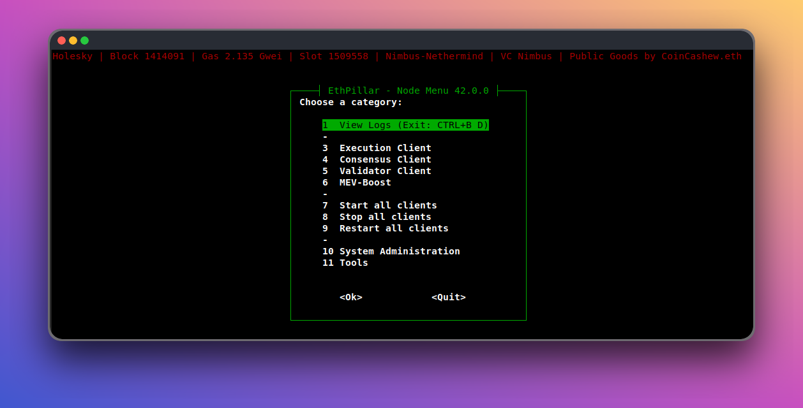

# 🥩 Guide | How to setup a validator for Ethereum staking on mainnet


:heart: Support us on **Gitcoin** GR23: [https://explorer.gitcoin.co/#/round/42161/865/14](https://explorer.gitcoin.co/#/round/42161/865/14)


## :rocket:Option 1: Quickstart with EthPillar - Recommended for most users

### :arrow\_forward:  Ubuntu One-liner Install:

```
/bin/bash -c "$(curl -fsSL https://raw.githubusercontent.com/coincashew/EthPillar/main/install.sh)"
```

😄 **Friendly Node Installer**: Helps you deploy a systemd installation with minority clients Nimbus-Nethermind or Teku-Besu stack in just minutes. MEVboost included. Lido CSM supported.

:floppy\_disk: **Ease of use**: No more remembering CLI commands required. Access common node operations via a simple text user interface (TUI). When EthPillar is deployed, operating your node becomes a breeze.

:owl: **Fast Updates**: Quickly find and download the latest consensus/execution release. Less downtime!

#### :exclamation:To learn more about EthPillar, [visit the quickstart page.](../ethpillar.md)

<figure><figcaption><p>EthPillar's TUI - Navigate the menu to control your node</p></figcaption></figure>

### :chains:Option 2: Manual Installation

* This guide aims to reduce the reliance on scripts in this section to make the learning process more straightforward and understandable.
* This approach provides a detailed overview of the steps involved, ensuring stakers have a clear understanding of the process.
* Great for advanced users comfortable with the CLI terminal who want full control and require customization of EL/CL combinations and their configurations.
* Deploys a systemd installation with any EL/CL combination you choose.
* After installation, use [EthPillar](../ethpillar.md) to simplify maintenance of your node.

#### To install manually, continue with this guide.

#### :shield: Built by home-stakers for home-stakers. :pray:
