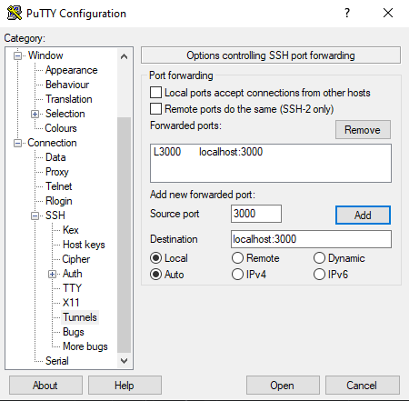
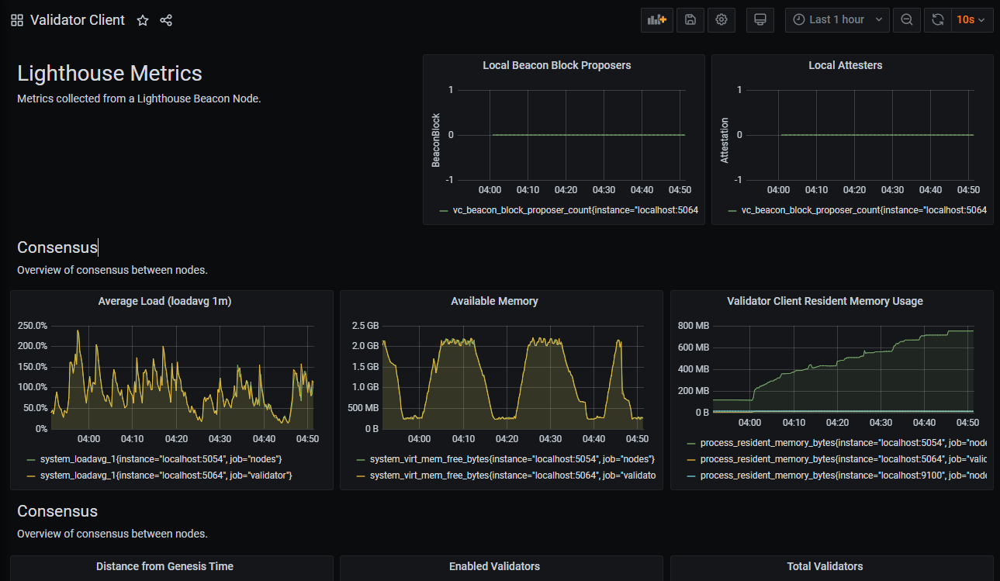
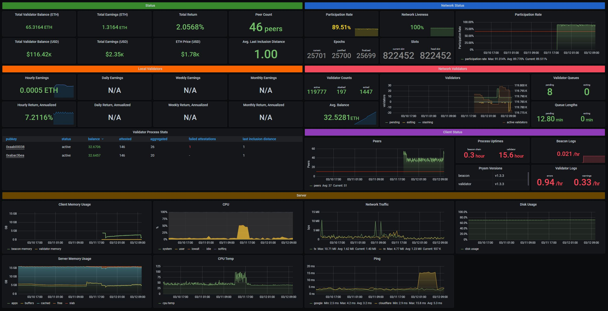
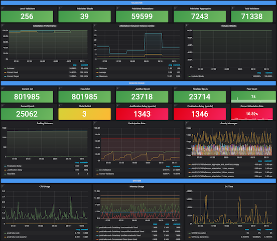
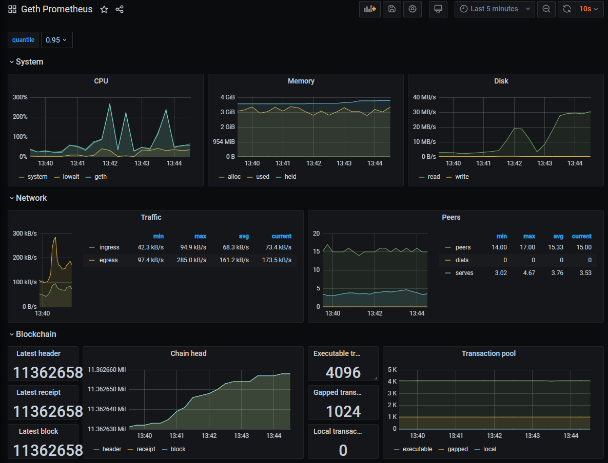
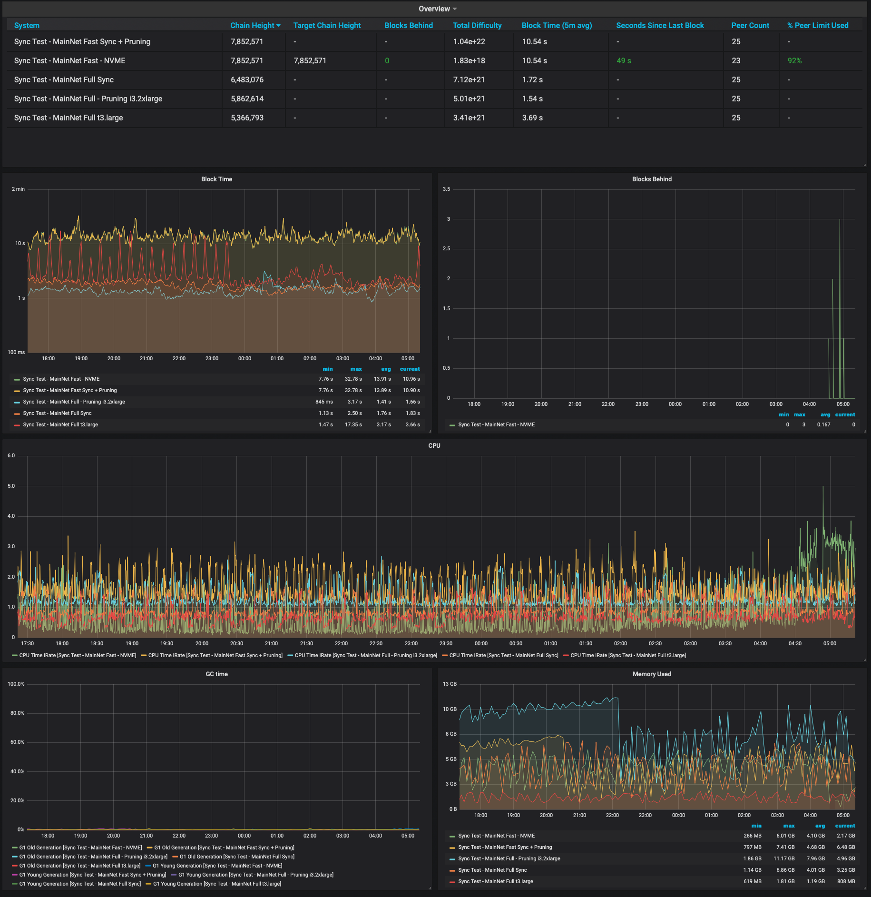
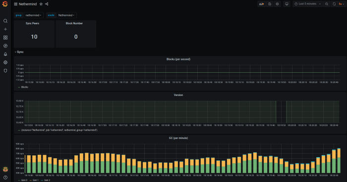
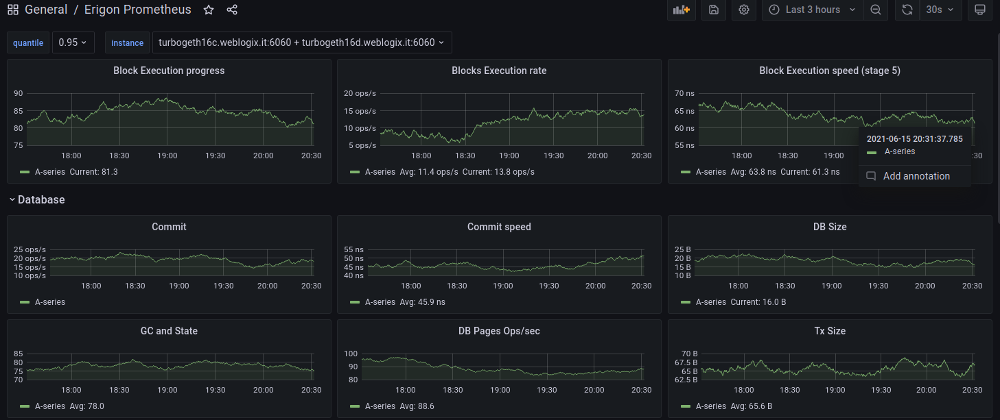

# Monitoring your validator with Grafana and Prometheus

Prometheus is a monitoring platform that collects metrics from monitored targets by scraping metrics HTTP endpoints on these targets.&#x20;

Grafana is a dashboard used to visualize the collected data.

[Official documentation is available here.](https://prometheus.io/docs/introduction/overview/)&#x20;

### Step 1: Install Prometheus and Node Exporter

```bash
sudo apt-get install -y prometheus prometheus-node-exporter
```

### Step 2: Install Grafana

```bash
sudo apt-get install -y apt-transport-https
sudo apt-get install -y software-properties-common wget
sudo wget -q -O /usr/share/keyrings/grafana.key https://apt.grafana.com/gpg.key
echo "deb [signed-by=/usr/share/keyrings/grafana.key] https://apt.grafana.com stable main" | sudo tee -a /etc/apt/sources.list.d/grafana.list
sudo apt-get update && sudo apt-get install -y grafana
```

### Step 3: Enable services so they start automatically.

```bash
sudo systemctl enable grafana-server.service prometheus.service prometheus-node-exporter.service
```

### Step 4: Create the **prometheus.yml** config file&#x20;

Choose the tab for your consensus client. Simply copy and paste into your terminal window.



```bash
cat > $HOME/prometheus.yml << EOF
global:
  scrape_interval:     15s # By default, scrape targets every 15 seconds.

  # Attach these labels to any time series or alerts when communicating with
  # external systems (federation, remote storage, Alertmanager).
  external_labels:
    monitor: 'codelab-monitor'

# A scrape configuration containing exactly one endpoint to scrape:
# Here it's Prometheus itself.
scrape_configs:
   - job_name: 'node_exporter'
     static_configs:
       - targets: ['localhost:9100']
   - job_name: 'nodes'
     metrics_path: /metrics    
     static_configs:
       - targets: ['localhost:5054']
   - job_name: 'validators'
     metrics_path: /metrics
     static_configs:
       - targets: ['localhost:5064']
EOF
```



```bash
cat > $HOME/prometheus.yml << EOF
global:
  scrape_interval:     15s # By default, scrape targets every 15 seconds.

  # Attach these labels to any time series or alerts when communicating with
  # external systems (federation, remote storage, Alertmanager).
  external_labels:
    monitor: 'codelab-monitor'

# A scrape configuration containing exactly one endpoint to scrape:
# Here it's Prometheus itself.
scrape_configs:
   - job_name: 'node_exporter'
     static_configs:
       - targets: ['localhost:9100']
   - job_name: 'nodes'
     metrics_path: /metrics    
     static_configs:
       - targets: ['localhost:8008']
EOF
```



```bash
cat > $HOME/prometheus.yml << EOF
global:
  scrape_interval:     15s # By default, scrape targets every 15 seconds.

  # Attach these labels to any time series or alerts when communicating with
  # external systems (federation, remote storage, Alertmanager).
  external_labels:
    monitor: 'codelab-monitor'

# A scrape configuration containing exactly one endpoint to scrape:
# Here it's Prometheus itself.
scrape_configs:
   - job_name: 'node_exporter'
     static_configs:
       - targets: ['localhost:9100']
   - job_name: 'nodes'
     metrics_path: /metrics    
     static_configs:
       - targets: ['localhost:8008']
EOF
```



```bash
cat > $HOME/prometheus.yml << EOF
global:
  scrape_interval:     15s # By default, scrape targets every 15 seconds.

  # Attach these labels to any time series or alerts when communicating with
  # external systems (federation, remote storage, Alertmanager).
  external_labels:
    monitor: 'codelab-monitor'

# A scrape configuration containing exactly one endpoint to scrape:
# Here it's Prometheus itself.
scrape_configs:
   - job_name: 'node_exporter'
     static_configs:
       - targets: ['localhost:9100']
   - job_name: 'validator'
     static_configs:
       - targets: ['localhost:8081']
   - job_name: 'beacon node'
     static_configs:
       - targets: ['localhost:8080']
   - job_name: 'slasher'
     static_configs:
       - targets: ['localhost:8082']
EOF
```



```bash
cat > $HOME/prometheus.yml << EOF   
scrape_configs:
   - job_name: 'node_exporter'
     static_configs:
       - targets: ['localhost:9100']
   - job_name: 'Lodestar'
     metrics_path: /metrics    
     static_configs:
       - targets: ['localhost:8008']
EOF
```



### Step 5: Setup prometheus for your execution client&#x20;

Start by editing **prometheus.yml**

```bash
nano $HOME/prometheus.yml
```

Append the applicable job snippet for your execution client to the end of **prometheus.yml**.


**Spacing matters**. Ensure all `job_name` snippets are in alignment.




```bash
   - job_name: 'geth'
     scrape_interval: 15s
     scrape_timeout: 10s
     metrics_path: /debug/metrics/prometheus
     scheme: http
     static_configs:
     - targets: ['localhost:6060']
```



```bash
   - job_name: 'besu'
     scrape_interval: 15s
     scrape_timeout: 10s
     metrics_path: /metrics
     scheme: http
     static_configs:
     - targets:
       - localhost:9545
```



```bash
   - job_name: 'nethermind'
     static_configs:
       - targets: ['localhost:6060']
```



```bash
   - job_name: 'erigon'
     scrape_interval: 10s
     scrape_timeout: 3s
     metrics_path: /debug/metrics/prometheus
     scheme: http
     static_configs:
       - targets: ['localhost:6060']
```



To exit and save, press `Ctrl` + `X`, then `Y`, then `Enter`.

Move it to `/etc/prometheus/prometheus.yml`

```bash
sudo mv $HOME/prometheus.yml /etc/prometheus/prometheus.yml
```

Update file permissions.

```bash
sudo chmod 644 /etc/prometheus/prometheus.yml
```

Finally, restart the services.

```bash
sudo systemctl restart grafana-server.service prometheus.service prometheus-node-exporter.service
```

Verify that the services are running properly:

```bash
sudo systemctl status grafana-server.service prometheus.service prometheus-node-exporter.service
```

### Step 6: Create a SSH Tunnel to Grafana


Do not expose Grafana (port 3000) to the public internet as this invites a new attack surface!&#x20;


Each time you want to access Grafana, a secure method is to access Grafana through a ssh tunnel.



Example of how to create a ssh tunnel in Linux or MacOS:

```
ssh -N -v <user>@<staking.node.ip.address> -L 3000:localhost:3000
```



Example of how to create a ssh tunnel in Windows with [Putty](https://putty.org/):

Navigate to Connection > SSH > Tunnels > Enter Source Port `3000` > Enter Destination `localhost:3000` > Click Add



Now save your configuration. Navigate to Session > Enter a session name > Save



Now you can access Grafana on your local machine by pointing a web browser to [http://localhost:3000](http://localhost:3000/)

### Step 7: Setup Grafana Dashboards

1. Open [http://localhost:3000](http://localhost:3000)
2. Login with **admin** / **admin**
3. Change password
4. Click the **configuration gear** icon, then **Add data Source**
5. Select **Prometheus**
6. Set **Name** to **"Prometheus**"
7. Set **URL** to [http://localhost:9090](http://localhost:9090)
8. Click **Save & Test**
9. **Download and save** your consensus client's json file. More json dashboard options available below. \[ [Lighthouse](https://raw.githubusercontent.com/Yoldark34/lighthouse-staking-dashboard/main/Yoldark\_ETH\_staking\_dashboard.json) | [Teku ](https://grafana.com/api/dashboards/13457/revisions/2/download)| [Nimbus ](https://raw.githubusercontent.com/status-im/nimbus-eth2/master/grafana/beacon\_nodes\_Grafana\_dashboard.json)| [Prysm ](https://raw.githubusercontent.com/GuillaumeMiralles/prysm-grafana-dashboard/master/less\_10\_validators.json)| [Prysm > 10 Validators](https://raw.githubusercontent.com/GuillaumeMiralles/prysm-grafana-dashboard/master/more\_10\_validators.json) | [Lodestar](https://raw.githubusercontent.com/ChainSafe/lodestar/unstable/dashboards/lodestar\_summary.json) ]
10. **Download and save** your execution client's json file \[ [Geth](https://gist.githubusercontent.com/karalabe/e7ca79abdec54755ceae09c08bd090cd/raw/3a400ab90f9402f2233280afd086cb9d6aac2111/dashboard.json) | [Besu ](https://grafana.com/api/dashboards/10273/revisions/5/download)| [Nethermind](https://raw.githubusercontent.com/NethermindEth/metrics-infrastructure/master/grafana/provisioning/dashboards/nethermind.json) | [Erigon](https://raw.githubusercontent.com/ledgerwatch/erigon/devel/cmd/prometheus/dashboards/erigon.json) ]
11. **Download and save** a [node-exporter dashboard](https://grafana.com/api/dashboards/11074/revisions/9/download) for general system monitoring
12. Click **Create +** icon > **Import**
13. Add the consensus client dashboard via **Upload JSON file**
14. If needed, select Prometheus as **Data Source**.
15. Click the **Import** button.
16. Repeat steps 12-15 for the execution client dashboard.
17. Repeat steps 12-15 for the node-exporter dashboard.


:fire: **Troubleshooting common Grafana issues**

**Symptom 1**: Your dashboard is missing some data_._

**Solution 1**_:_ Ensure that the execution or consensus client has enabled the appropriate metrics flag.

```bash
cat /etc/systemd/system/execution.service
cat /etc/systemd/system/consensus.service
```

* **Geth**: --http --metrics --pprof
* **Besu**: --metrics-enabled=true
* **Nethermind**:  --Metrics.Enabled true
* **Erigon**: --metrics
* **Lighthouse**:  --validator-monitor-auto
* **Nimbus**:  --metrics  --metrics-port=8008
* **Teku**: --metrics-enabled=true --metrics-port=8008
* **Lodestar**: --metrics true


**Symptom 2**: Don't want to use SSH tunnels and you want to expose port 3000 to access Grafana, but understand the security concerns.

**Solution 2**: Open port 3000 in your ufw firewall. Access grafana at http://\<node ipaddress>:3000

```
sudo ufw allow 3000
```


#### Example of Grafana Dashboards for each consensus client.







Beacon Chain JSON Download link: [https://raw.githubusercontent.com/sigp/lighthouse-metrics/master/dashboards/Summary.json](https://raw.githubusercontent.com/sigp/lighthouse-metrics/master/dashboards/Summary.json)

Validator Client JSON download link: [https://raw.githubusercontent.com/sigp/lighthouse-metrics/master/dashboards/ValidatorClient.json](https://raw.githubusercontent.com/sigp/lighthouse-metrics/master/dashboards/ValidatorClient.json)

Credits: [https://github.com/sigp/lighthouse-metrics/](https://github.com/sigp/lighthouse-metrics/)


JSON Download link: [https://raw.githubusercontent.com/Yoldark34/lighthouse-staking-dashboard/main/Yoldark\_ETH\_staking\_dashboard.json](https://raw.githubusercontent.com/Yoldark34/lighthouse-staking-dashboard/main/Yoldark\_ETH\_staking\_dashboard.json)

Credits: [https://github.com/Yoldark34/lighthouse-staking-dashboard](https://github.com/Yoldark34/lighthouse-staking-dashboard)





Credits: [https://github.com/status-im/nimbus-eth2/](https://github.com/status-im/nimbus-eth2/)



JSON download link:

Credits: [https://github.com/metanull-operator/eth2-grafana/](https://github.com/metanull-operator/eth2-grafana/)





Credits: [https://grafana.com/grafana/dashboards/13457](https://grafana.com/grafana/dashboards/13457)





Credits: [https://github.com/GuillaumeMiralles/prysm-grafana-dashboard](https://github.com/GuillaumeMiralles/prysm-grafana-dashboard)


JSON download link: [https://github.com/metanull-operator/eth2-grafana/raw/master/eth2-grafana-dashboard-single-source.json](https://github.com/metanull-operator/eth2-grafana/raw/master/eth2-grafana-dashboard-single-source.json)

Credits: [https://github.com/metanull-operator/eth2-grafana/](https://github.com/metanull-operator/eth2-grafana/)



Work in progress.



#### Example of Grafana Dashboards for each execution client.





Credits: [https://gist.github.com/karalabe/e7ca79abdec54755ceae09c08bd090cd](https://gist.github.com/karalabe/e7ca79abdec54755ceae09c08bd090cd)





Credits: [https://grafana.com/dashboards/10273](https://grafana.com/dashboards/10273)





Credits: [https://github.com/NethermindEth/metrics-infrastructure](https://github.com/NethermindEth/metrics-infrastructure)





Credits: [https://github.com/ledgerwatch/erigon/tree/devel/cmd/prometheus/dashboards](https://github.com/ledgerwatch/erigon/tree/devel/cmd/prometheus/dashboards)



#### Example of Node-Exporter Dashboard



**General system monitoring**

Includes: CPU, memory, disk IO, network, temperature and other monitoring metrics。

.png>)


Credits: [starsliao](https://grafana.com/grafana/dashboards/11074)



### &#x20;Step 8: Setup Alert Notifications


Setup alerts to get notified if your validators go offline.


Get notified of problems with your validators. Choose between email, telegram, discord or slack.

<details>

<summary>Option 1: Email Notifications</summary>

1. Visit [https://beaconcha.in/](https://beaconcha.in)
2. Sign up for an account
3. Verify your **email**
4. Search for your **validator's public address**
5. Add validators to your watchlist by clicking the **bookmark symbol**.

</details>

<details>

<summary>Option 2: Telegram Notifications</summary>

1. On the menu of Grafana, select **Notification channels** under the bell icon.
2. Click on **Add channel**.
3. Give the notification channel a **name**.
4. Select **Telegram** from the Type list.
5. To complete the **Telegram API settings**, a **Telegram channel** and \*\*bot \*\*are required. For instructions on setting up a bot with `@Botfather`, see [this section](https://core.telegram.org/bots#6-botfather) of the Telegram documentation. You need to create a BOT API token.
6. Create a new telegram group.
7. Invite the bot to your new group.
8. Type at least 1 message into the group to initialize it.
9. Visit [`https://api.telegram.org/botXXX:YYY/getUpdates`](https://api.telegram.org/botXXX:YYY/getUpdates) where `XXX:YYY` is your BOT API Token.
10. In the JSON response, find and copy the **Chat ID**. Find it between \*\*chat \*\*and **title**. _Example of Chat ID_: `-1123123123`

    ```
    "chat":{"id":-123123123,"title":
    ```
11. Paste the **Chat ID** into the corresponding field in **Grafana**.
12. **Save and test** the notification channel for your alerts.
13. Now you can create custom alerts from your dashboards. [Visit here to learn how to create alerts.](https://grafana.com/docs/grafana/latest/alerting/create-alerts/)

</details>

<details>

<summary>Option 3: Discord Notifications</summary>

1. On the menu of Grafana, select **Notification channels** under the bell icon.
2. Click on **Add channel**.
3. Add a **name** to the notification channel.
4. Select **Discord** from the Type list.
5. To complete the set up, a Discord server (and a text channel available) as well as a Webhook URL are required. For instructions on setting up a Discord's Webhooks, see [this section](https://support.discord.com/hc/en-us/articles/228383668-Intro-to-Webhooks) of their documentation.
6. Enter the Webhook **URL** in the Discord notification settings panel.
7. Click **Send Test**, which will push a confirmation message to the Discord channel.

</details>

<details>

<summary>Option 4: Slack Notifications</summary>

1. On the menu of Grafana, select **Notification channels** under the bell icon.
2. Click on **Add channel**.
3. Add a **name** to the notification channel.
4. Select **Slack** from the Type list.
5. For instructions on setting up a Slack's Incoming Webhooks, see [this section](https://api.slack.com/messaging/webhooks) of their documentation.
6. Enter the Slack Incoming Webhook URL in the **URL** field.
7. Click **Send Test**, which will push a confirmation message to the Slack channel.

</details>
