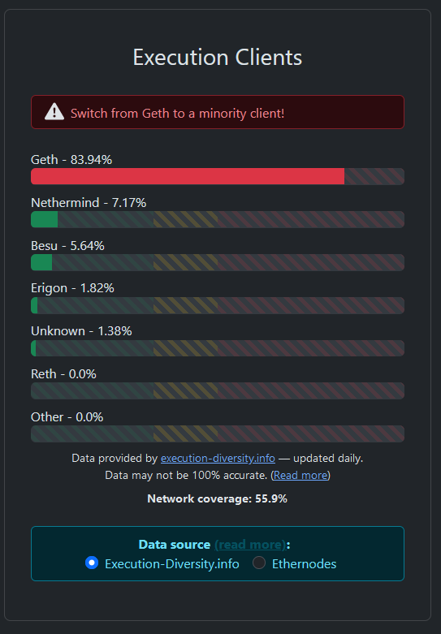

# Step 3: Installing execution client

Your choice of either [**Besu**](https://besu.hyperledger.org)**,** [**Nethermind**](https://www.nethermind.io)**,** [**Reth**](reth.md) **or** [**Erigon**](https://github.com/ledgerwatch/erigon)**.**


Only one execution client is required per node.


## **Execution Client Diversity**

* To strengthen Ethereum's resilience against potential attacks or consensus bugs, it's best practice to run a minority client in order to increase client diversity.
* Find the latest distribution of execution clients here: [https://clientdiversity.org](https://clientdiversity.org/)

<figure><figcaption>
Sept 2023 Client Diversity
</figcaption></figure>

## Overview of Execution Clients


:shield: **Recommendation** :shield:: **Nethermind** or **Besu**



:octagonal\_sign:**Strongly discouraged** :octagonal\_sign:**: GETH can be** [**hazardous to your all YOUR STAKE.**](https://twitter.com/EthDreamer/status/1749355402473410714)


### Nethermind

* Nethermind: Open-source Ethereum client written in .NET Core.
* Fast sync speed: Boasts the quickest Execution client syncing performance and is designed so you can start following the chain and attesting while it downloads history in the background.
* Flexible configuration: Rich set of options tailored for node operators.
* Online pruning: Allows database pruning while still online, no need to turn off client.
* Resource-intensive pruning process: May result in noticeable performance degradation for low-power nodes during the process.

### Besu

* Hyperledger Besu: Open-source Ethereum client under Apache 2.0 license, written in Java.
* Distinctive features: Uses Bonsai Tries for state storage for enhanced performance and benefits.
* Maintenance-free: Does not require pruning, making it effectively maintenance-free.

### Geth

* Geth (Go Ethereum): One of the original Ethereum protocol implementations, written in Go and fully open source under GNU LGPL v3 license.
* Stable and reliable: Oldest and most widely-used Execution Client with a strong reputation.
* Multithreaded: Utilizes the entire CPU for enhanced performance.
* Adjustable RAM usage: Configurable down to 4 GB minimum for Mainnet, accommodating various system specifications.

### Erigon

* Erigon: High-performance Ethereum implementation focused on efficiency, faster synchronization, and optimized experience written in Go.
* Born as a Geth fork, completely rewritten for enhanced speed and storage savings.
* Faster archive node synchronization: Achieves full node synchronization in under three days with less than 2TB of storage.
* Supports several popular EVM-compatible blockchains and testnets.
* Efficient state storage: Utilizes a key-value database for improved performance.
* Separate JSON RPC daemon: Enables read-only calls without requiring the same system as the main Erigon binary, even from a database snapshot.

### Reth

* Reth: Execution layer (EL) Ethereum client, written in Rust, is compatible with all consensus layer (CL) implementations.
* Developed by Paradigm, licensed under Apache and MIT licenses.
* Capabilities: Sending/receiving transactions, querying logs and traces, and accessing/interacting with smart contracts.
* Prioritizing security, efficiency, and ease-of-use for consumer hardware.

## Comparison of Execution Clients

<table><thead><tr><th>Client</th><th width="111">RAM Use</th><th>Minimum Database Size</th><th>Database Growth</th><th>Time to sync</th></tr></thead><tbody><tr><td><strong>Nethermind</strong></td><td>8 GB</td><td>0.95 TB</td><td>18 GB/week</td><td>Fastest, 2hrs+</td></tr><tr><td><strong>Besu</strong></td><td>12 GB</td><td>1.2 TB</td><td>10 GB/week</td><td>Medium, 16hrs+</td></tr><tr><td><strong>Geth</strong></td><td>8 GB</td><td>1.2 TB</td><td>8 GB/week</td><td>Fast, 8hrs+</td></tr><tr><td><strong>Erigon</strong></td><td>8 GB</td><td>1.2 TB</td><td>8 GB/week</td><td>Medium, 16hrs+</td></tr><tr><td><strong>Reth</strong></td><td>10 GB</td><td>1.2 TB</td><td>4GB/week</td><td>Medium, 16hrs+</td></tr></tbody></table>

#### Notes:

* Time to sync to a state capable beginning attestations depends on the IOPs of your storage drive.
* Initial sync is always resource intensive. Synced operation is relatively resource use light.
* Nethermind, Besu, Geth have the capability to prune the database.
