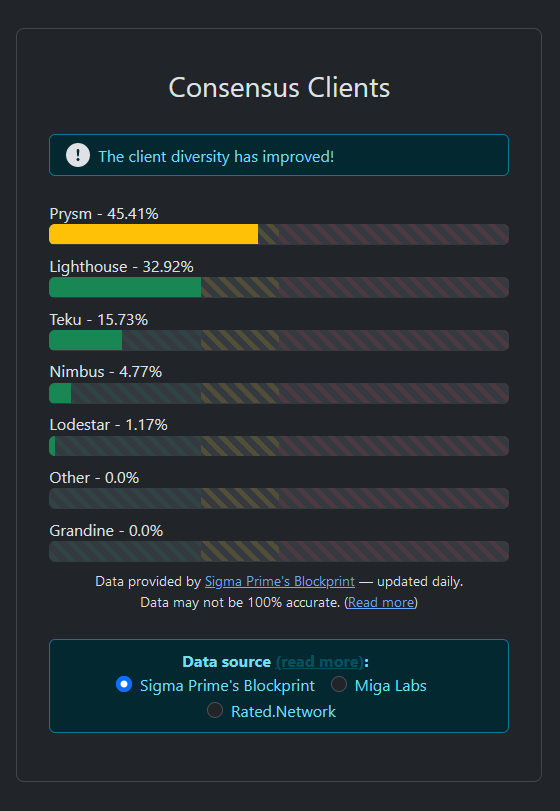

# Step 4: Installing consensus client

Your choice of either Lighthouse, Lodestar, Teku, Nimbus, or Prysm.


Only one consensus client is required per node.


**Consensus Client Diversity**: To strengthen Ethereum's resilience against potential attacks or consensus bugs, it's best practice to run a minority client in order to increase client diversity. Find the latest distribution of consensus clients here: [https://clientdiversity.org](https://clientdiversity.org/)

<figure><figcaption>
Sept 2023 Client Diversity
</figcaption></figure>


:shield: **Recommendation** :shield:: Nimbus or Lodestar


## Select your desired consensus client for further instructions.

**Lighthouse** is an Ethereum client with a heavy focus on speed and security. Lighthouse is built in Rust.

**Lodestar** is a Typescript implementation by the Chainsafe.io team. The Lodestar team is leading the Ethereum space in light client research.

**Teku** is a Java-based Ethereum client designed & built to meet institutional needs and security requirements.

**Nimbus** is designed to perform well on embedded systems and personal mobile devices. Written in Nim, a language with Python-like syntax that compiles to C.

**Prysm** is a Go implementation with a focus on usability, security, and reliability.
