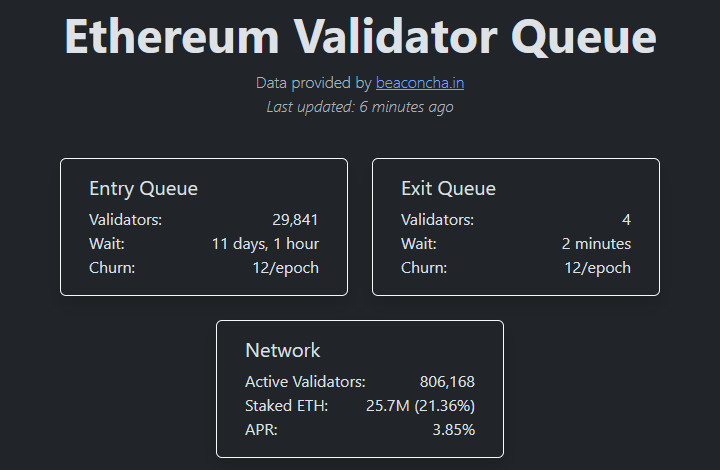

# Adding a New Validator to an Existing Setup with Existing Seed Words

## :white\_check\_mark: Requirements

Before continuing please have the following ready:

* Existing 24 word validator mnemonic phrase
* Existing keystore password
* ETH Withdrawal Address from your hardware wallet

### Step 1: Create new deposit\_data json file and new validator\_keys&#x20;

In this example, using the `staking-deposit-cli` tool, you can add more validators by creating a new deposit data file and `validator_keys`&#x20;


**Security recommendation reminder**: For best security practices, key management and other activities where you type your 24 word mnemonic seed should be completed on an air-gapped offline cold machine booted from USB drive.



Reminder to use the same **keystore password** as existing validators.


For example, in case we originally created **3 validators** but now wish to **add 5 more validators**, we could use the following command.

```bash
# Generate from an existing mnemonic 5 more validators when 3 were previously already made
./deposit existing-mnemonic \
--validator_start_index 3 \
--num_validators 5 \
--chain mainnet \
--execution_address <ETH_ADDRESS_FROM_HARDWARE_WALLET>
```

&#x20;

| Flag                      | Description                                                                                                                                                                                                                                                                                                                                                                                                                                                                                                                                                                                                       |
| ------------------------- | ----------------------------------------------------------------------------------------------------------------------------------------------------------------------------------------------------------------------------------------------------------------------------------------------------------------------------------------------------------------------------------------------------------------------------------------------------------------------------------------------------------------------------------------------------------------------------------------------------------------- |
| --validator\_start\_index | Number of validators you ALREADY created                                                                                                                                                                                                                                                                                                                                                                                                                                                                                                                                                                          |
| --num\_validators         | Number of NEW validators you want to create                                                                                                                                                                                                                                                                                                                                                                                                                                                                                                                                                                       |
| --chain                   | Options: mainnet holesky goerli                                                                                                                                                                                                                                                                                                                                                                                                                                                                                                                                                                                   |
| --execution\_address      | <p><strong>Critically important</strong>: Your Ethereum Address from a Hardware Wallet. </p><p></p><p>Withdrawals will be sent to this address. If you stop validating and exit your validator, your 32 ETH will be sent here. </p><p></p><p>This <strong>ETH withdrawal address</strong> is one such that <strong>you control the private keys</strong> to, ideally one from a hardware wallet.</p><p></p><p><span data-gb-custom-inline data-tag="emoji" data-code="1f6d1">🛑</span><strong>DO NOT USE A EXCHANGE ADDRESS!</strong><span data-gb-custom-inline data-tag="emoji" data-code="1f6d1">🛑</span></p> |

### Step 2: Deposit 32 ETH per validator

**Option 1**: Visit the [official Ethereum Launchpad site](https://launchpad.ethereum.org)

Two important tasks to complete at the launchpad.

* Upload the `deposit_data-#########.json`
* Make the 32 ETH deposit transaction(s), 32 ETH per validator. 1 deposit transaction per validator.&#x20;

**Option 2**: Use [Abyss's Batch Ethereum Depositor](https://abyss.finance/eth2depositor) to combine many validator deposits into just 1 transaction.

### Step 3: Import New Validator Keys

This step assumes your new validator keys are located in&#x20;

```bash
$HOME/staking-deposit-cli/validator_keys
```

If Wagyu was used to generate validator keys, move the keystore files to the above location.



Stop your validator client.

```bash
sudo systemctl stop validator
```

Import your validator keys by importing your **keystore file**. Be sure to enter your **keystore password** correctly.

```bash
sudo lighthouse account validator import \
  --network mainnet \
  --datadir /var/lib/lighthouse \
  --directory=$HOME/staking-deposit-cli/validator_keys \
  --reuse-password
```

Verify that your keystore file was imported successfully.

<pre class="language-bash"><code class="lang-bash"><strong>sudo lighthouse account_manager validator list \
</strong><strong>  --network mainnet \
</strong>  --datadir /var/lib/lighthouse
</code></pre>

Once successful, you will be shown your **validator's public key**.

For example, `0x8d9138fcf5676e2031dc4eae30a2c92e3306903eeec83ca83f4f851afbd4cb3b33f710e6f4ac516b4598697b30b04302`

Setup ownership permissions, including hardening the access to this directory.

```bash
sudo chown -R validator:validator /var/lib/lighthouse/validators
sudo chmod 700 /var/lib/lighthouse/validators
```

Finally, start your validator client.

```bash
sudo systemctl restart validator
```

Check your logs to confirm that the validator clients are up and functioning.

```bash
sudo journalctl -fu validator | ccze
```

For example when using 2 validators, logs will show the following:

```bash
INFO Enabled validator          voting_pubkey: 0x82b225f66476962b161ed015786df00a0b7b28231915e6d09e81ba8d5c4ae8502b6d5337e3bf101ad72741dc69f0a7cf, signing_method: local_keystore
INFO Enabled validator          voting_pubkey: 0x95d39860a0d6ea3b92cba78069d21f3a987988f3b8417b14f0945353d79ed9e338bbe6e9d63d487abc044a710ce34866, signing_method: local_keystore
INFO Initialized validators     enabled: 2, disabled: 0
```



Stop your validator client.

```bash
sudo systemctl stop validator
```

Import your validator keys by importing your **keystore file**. Be sure to enter your **keystore password** correctly.

```bash
cd /usr/local/bin/lodestar
sudo ./lodestar validator import \
  --network mainnet \
  --dataDir="/var/lib/lodestar/validators" \
  --keystore=$HOME/staking-deposit-cli/validator_keys
```

Verify that your keystore file was imported successfully.

```bash
sudo ./lodestar validator list \
  --network mainnet \
  --dataDir="/var/lib/lodestar/validators"
```

Once successful, you will be shown your **validator's public key**.

For example, `0x8d9138fcf5676e2031dc4eae30a2c92e3306903eeec83ca83f4f851afbd4cb3b33f710e6f4ac516b4598697b30b04302`

Setup ownership permissions, including hardening the access to this directory.

```bash
sudo chown -R validator:validator /var/lib/lodestar/validators
sudo chmod 700 /var/lib/lodestar/validators
```

Finally, restart to use the new validators.

```bash
sudo systemctl restart validator
```

Check your logs to confirm that the validator clients are up and functioning.

```bash
sudo journalctl -fu validator | ccze
```

For example when using 2 validators, logs will show the following:

```bash
info: 100% of local keystores imported. current=2 total=2 rate=975.61keys/m
info: 2 local keystores
info: 0x82b225f66476962b161ed015786df00a0b7b28231915e6d09e81ba8d5c4ae8502b6d5337e3bf101ad72741dc69f0a7cf
info: 0x95d39860a0d6ea3b92cba78069d21f3a987988f3b8417b14f0945353d79ed9e338bbe6e9d63d487abc044a710ce34866
```

Press `Ctrl` + `C` to exit the logs.



<details>

<summary>Option 1: For standalone validator</summary>

Stop your Teku client.

```bash
sudo systemctl stop validator
```

Storing your **keystore password** in a text file is required so that Teku can decrypt and load your validators automatically.

Create a temporary file to store your **keystore password**. Type your password in this file.

```bash
sudo nano $HOME/validators-password.txt
```

To exit and save, press `Ctrl` + `X`, then `Y`, then `Enter`.

Confirm that your **keystore password** is correct.

```bash
sudo cat $HOME/validators-password.txt
```

Run the following command to create a corresponding password file for every one of your validators.

```bash
for f in $HOME/staking-deposit-cli/validator_keys/keystore*.json; do sudo cp $HOME/validators-password.txt $HOME/staking-deposit-cli/validator_keys/$(basename $f .json).txt; done
```

Copy keystores to validator folder

```bash
sudo cp $HOME/staking-deposit-cli/validator_keys/keystore* /var/lib/teku_validator/validator_keys
```

Setup ownership permissions, including hardening the access to this directory.

```bash
sudo chown -R validator:validator /var/lib/teku_validator
sudo chmod -R 700 /var/lib/teku_validator
```

Verify that your validator's keystore .json files and validator's passwords .txt files are present by checking the following directory.

```bash
sudo ls -l /var/lib/teku_validator/validator_keys
```

Example output of two validator's keystore.json files with matching password.txt files.

```
-rwx------ 1 consensus consensus 710 Sep 19 23:39 keystore-m_12381_3600_1_0_0-1695165818.json
-rwx------ 1 consensus consensus  43 Sep 19 23:39 keystore-m_12381_3600_1_0_0-1695165818.txt
-rwx------ 1 consensus consensus 710 Sep 19 23:39 keystore-m_12381_3600_2_0_0-1695165819.json
-rwx------ 1 consensus consensus  43 Sep 19 23:39 keystore-m_12381_3600_2_0_0-1695165819.txt
```

Delete the temporary **keystore password** file.

```bash
sudo rm $HOME/validators-password.txt
```

Finally, restart Teku to use the new validators.

```bash
sudo systemctl restart validator
```

Check your logs to confirm that the validators are up and functioning.

```bash
sudo journalctl -fu validator | ccze
```

For example when using 2 validators, logs will show the following:

```bash
INFO  - Loading 2 validator keys...
INFO  - Loaded 2 Validators: 95d3986, 82b225f
```

</details>

<details>

<summary>Option 2: For Combined CL+VC</summary>

Stop your Teku client.

```bash
sudo systemctl stop consensus
```

Storing your **keystore password** in a text file is required so that Teku can decrypt and load your validators automatically.

Create a temporary file to store your **keystore password**. Type your password in this file.

```bash
sudo nano $HOME/validators-password.txt
```

To exit and save, press `Ctrl` + `X`, then `Y`, then `Enter`.

Confirm that your **keystore password** is correct.

```bash
sudo cat $HOME/validators-password.txt
```

Run the following command to create a corresponding password file for every one of your validators.

```bash
for f in $HOME/staking-deposit-cli/validator_keys/keystore*.json; do sudo cp $HOME/validators-password.txt $HOME/staking-deposit-cli/validator_keys/$(basename $f .json).txt; done
```

Copy keystores to validator folder

```bash
sudo cp $HOME/staking-deposit-cli/validator_keys/keystore* /var/lib/teku/validator_keys
```

Setup ownership permissions, including hardening the access to this directory.

<pre class="language-bash"><code class="lang-bash">sudo chown -R consensus:consensus /var/lib/teku/
<strong>sudo chmod -R 700 /var/lib/teku/validator_keys
</strong></code></pre>

Verify that your validator's keystore .json files and validator's passwords .txt files are present by checking the following directory.

```bash
sudo ls -l /var/lib/teku/validator_keys
```

Example output of two validator's keystore.json files with matching password.txt files.

```
-rwx------ 1 consensus consensus 710 Sep 19 23:39 keystore-m_12381_3600_1_0_0-1695165818.json
-rwx------ 1 consensus consensus  43 Sep 19 23:39 keystore-m_12381_3600_1_0_0-1695165818.txt
-rwx------ 1 consensus consensus 710 Sep 19 23:39 keystore-m_12381_3600_2_0_0-1695165819.json
-rwx------ 1 consensus consensus  43 Sep 19 23:39 keystore-m_12381_3600_2_0_0-1695165819.txt
```

Delete the temporary **keystore password** file.

```bash
sudo rm $HOME/validators-password.txt
```

Finally, restart Teku to use the new validators.

```bash
sudo systemctl restart consensus
```

Check your logs to confirm that the validators are up and functioning.

```bash
sudo journalctl -fu consensus | ccze
```

For example when using 2 validators, logs will show the following:

```bash
INFO  - Loading 2 validator keys...
INFO  - Loaded 2 Validators: 95d3986, 82b225f
```

</details>



<details>

<summary>Option 1: For standalone validator</summary>

Stop your Nimbus client.

```bash
sudo systemctl stop validator
```

Enter your **keystore password** to import accounts.

```bash
sudo /usr/local/bin/nimbus_beacon_node deposits import \
  --data-dir=/var/lib/nimbus_validator $HOME/staking-deposit-cli/validator_keys
```

Now you can verify the accounts were imported successfully by doing a directory listing.

```bash
sudo ls -l /var/lib/nimbus_validator/validators
```

You should see a folder named for each of your validator's pubkey.

Setup ownership permissions, including hardening the access to this directory.

```bash
sudo chown -R validator:validator /var/lib/nimbus_validator
sudo chmod -R 700 /var/lib/nimbus_validator
```

Finally, restart Nimbus to use the new validators.

```bash
sudo systemctl restart validator
```

Check your logs to confirm that the validators are up and functioning.

```bash
sudo journalctl -fu validator | ccze
```

For example when using 2 validators, logs will show the following:

```bash
Loading validators             topics="beacval" validatorsDir=/var/lib/nimbus/validators keystore_cache_available=true
Local validator attached       topics="val_pool" pubkey=95d39860a0d6ea3b92cba78069d21f3a validator=95d39860 initial_fee_recipient=81ba8d5c4ae850
Local validator attached       topics="val_pool" pubkey=82b225f66476962b161ed015786df00f validator=82b225f6 initial_fee_recipient=81ba8d5c4ae850
```

</details>

<details>

<summary>Option 2: For Combined CL+VC</summary>

Stop your Nimbus client.

```bash
sudo systemctl stop consensus
```

Enter your **keystore password** to import accounts.

```bash
sudo /usr/local/bin/nimbus_beacon_node deposits import \
  --data-dir=/var/lib/nimbus $HOME/staking-deposit-cli/validator_keys
```

Now you can verify the accounts were imported successfully by doing a directory listing.

```bash
sudo ls -l /var/lib/nimbus/validators
```

You should see a folder named for each of your validator's pubkey.

Setup ownership permissions, including hardening the access to this directory.

```bash
sudo chown -R consensus:consensus /var/lib/nimbus
sudo chmod -R 700 /var/lib/nimbus
```

Finally, restart Nimbus to use the new validators.

```bash
sudo systemctl restart consensus
```

Check your logs to confirm that the validators are up and functioning.

```bash
sudo journalctl -fu consensus | ccze
```

For example when using 2 validators, logs will show the following:

```bash
Loading validators             topics="beacval" validatorsDir=/var/lib/nimbus/validators keystore_cache_available=true
Local validator attached       topics="val_pool" pubkey=95d39860a0d6ea3b92cba78069d21f3a validator=95d39860 initial_fee_recipient=81ba8d5c4ae850
Local validator attached       topics="val_pool" pubkey=82b225f66476962b161ed015786df00f validator=82b225f6 initial_fee_recipient=81ba8d5c4ae850
```

</details>



Stop your validator client.

```bash
sudo systemctl stop validator
```

Import your validator keys by importing your **keystore file**. When asked to create a new wallet password, enter your **keystore password**. When prompted for the imported accounts password, enter your **keystore password** again.

If using Binaries,

```shell
sudo /usr/local/bin/validator accounts import \
  --accept-terms-of-use \
  --mainnet \
  --wallet-dir=/var/lib/prysm/validators \
  --keys-dir=$HOME/staking-deposit-cli/validator_keys
```

If Built from Source,

```bash
cd /usr/local/bin/prysm
sudo bazel run //validator:validator -- accounts import \
  --accept-terms-of-use \
  --mainnet \
  --wallet-dir=/var/lib/prysm/validators \
  --keys-dir=$HOME/staking-deposit-cli/validator_keys
```

Verify that your keystore file was imported successfully.

If using Binaries,

```bash
sudo /usr/local/bin/validator accounts list \
  --wallet-dir=/var/lib/prysm/validators \
  --mainnet
```

If Built from Source,

<pre class="language-bash"><code class="lang-bash"><strong>cd /usr/local/bin/prysm
</strong><strong>sudo bazel run //validator:validator -- accounts list \
</strong>  --wallet-dir=/var/lib/prysm/validator \
  --mainnet
</code></pre>

Once successful, you will be shown your **validator's public key**. For example:

```
Showing 2 validator accounts
View the eth1 deposit transaction data for your accounts by running `validator accounts list --show-deposit-data`

Account 0 | gently-learning-chamois
[validating public key] 0x95d39860a0d6ea3b92cba78069d21f3a987988f3b8417b14f0945353d79ed9e338bbe6e9d63d487abc044a710ce34866

Account 1 | presumably-powerful-lynx
[validating public key] 0x82b225f66476962b161ed015786df00a0b7b28231915e6d09e81ba8d5c4ae8502b6d5337e3bf101ad72741dc69f0a7cf
```

Setup ownership permissions, including hardening the access to this directory.

```bash
sudo chown -R validator:validator /var/lib/prysm/validators
sudo chmod 700 /var/lib/prysm/validators
```

Finally, restart Prsym validator to use the new validators.

```bash
sudo systemctl restart validator
```

Check your logs to confirm that the validator clients are up and functioning.

```bash
sudo journalctl -fu validator | ccze
```

For example when using 2 validators, logs will show the following:

```bash
level=info msg="Validating for public key" prefix=validator publicKey=0x95d39860a0d6
level=info msg="Validating for public key" prefix=validator publicKey=0x82b225f66476

```



### Step 4: Backup and Delete `validator_keys` directory

Make backup copies of your validator\_keys directory to USB media or other devices. These validator keys can always be regenerated from secret recovery mnemonic phrase.

Afterwards, you may safely delete the directory.

```bash
# Remove default validator_key directory
sudo rm -r $HOME/staking-deposit-cli/validator_keys
```

### Step 5: Estimate when your new validator becomes active

Your additional validators are now in the activation queue waiting their turn. Check the "**Entry Queue**" for your estimated wait time at [https://www.validatorqueue.com](https://www.validatorqueue.com/)

In the below example, the wait time was approximately 11 days, 1 hour until a new validator became active.

<figure><figcaption><p>Entry Queue</p></figcaption></figure>
