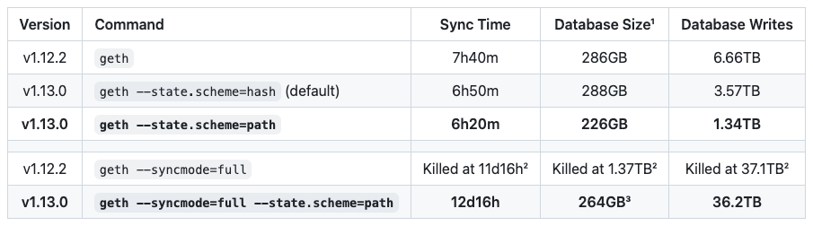

# 😁 Geth - Enabling path-based state storage


As of [Geth v1.13.0](https://blog.ethereum.org/2023/09/12/geth-v1-13-0), a new database model for storing the Ethereum state, which is both faster than the previous scheme, and also has proper pruning implemented.&#x20;


No more junk accumulating on disk and no more guerilla (offline) pruning!


### :tada: Enjoy performance improvements

<figure><figcaption></figcaption></figure>

### :robot: How to enable PBSS for existing installations


Before continuing please understand the following:

* Synching Geth can take hours during which time block proposals can be missed
* Consider using a backup EL/CL if you have many validators
* Enabling PBSS requires a full Geth resync




```bash
# Stop geth
sudo systemctl stop execution

#(add --state.scheme=path to the ExecStart line)
sudo nano /etc/systemd/system/execution.service

# reload changes
sudo systemctl daemon-reload

# Delete the old db
# and when asked, delete the state database, but keep the ancient database
# Yes to state db, no to ancient db.
sudo -u execution /usr/local/bin/geth --datadir /var/lib/geth removedb

# Start geth
sudo systemctl start execution
```



```bash
# Stop geth
sudo systemctl stop eth1

#(add --state.scheme=path to the ExecStart line)
sudo nano /etc/systemd/system/eth1.service

# reload changes
sudo systemctl daemon-reload

# Delete the old db
# and when asked, delete the state database, but keep the ancient database
# Yes to state db, no to ancient db.
sudo /usr/bin/geth --datadir ~/.ethereum removedb

# Start geth
sudo systemctl start eth1
```



Example of V2 service file with updated ExecStart line using `--state.scheme=path`

```bash
[Unit]
Description=Geth Execution Layer Client service for Mainnet
Wants=network-online.target
After=network-online.target
Documentation=https://www.coincashew.com

[Service]
Type=simple
User=execution
Group=execution
Restart=on-failure
RestartSec=3
KillSignal=SIGINT
TimeoutStopSec=900
ExecStart=/usr/local/bin/geth \
    --mainnet \
    --metrics \
    --datadir=/var/lib/geth \
    --pprof \
    --state.scheme=path \
    --authrpc.jwtsecret=/secrets/jwtsecret
   
[Install]
WantedBy=multi-user.target
```
