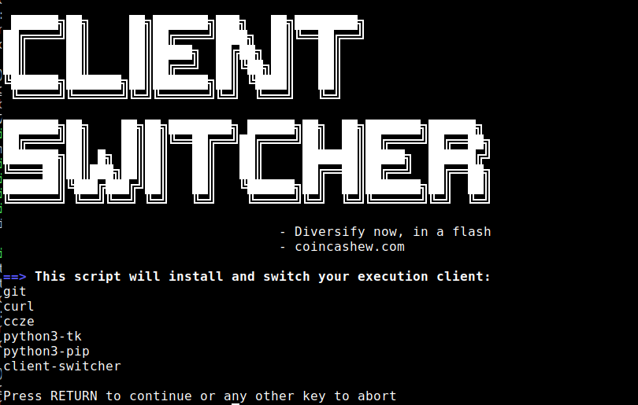

# 🛡 Switching / Migrating Execution Client


Important reasons why you would want to switch Execution Clients:

:owl: **Client Diversity**: Improve Ethereum's resilience by using a [minority client](https://mirror.xyz/jmcook.eth/S7ONEka\_0RgtKTZ3-dakPmAHQNPvuj15nh0YGKPFriA)

:floppy\_disk: **Unique Features**: Each client has their own strengths, i.e. faster sync, lower resource requirements, different programming language, unique abilities



:fire:**Optional Tip**: Before switching, it is possible to minimize downtime and keep your validator online by using a failover node, either your own EL/CL stack, or a public service.

Here are some public options:

* [RocketPool's Rescue Node](https://rescuenode.com/docs/how-to-connect/solo)
* [Tennisbowling's Open Execution Node](https://openexecution.tennisbowling.com/)

However, as validator downtime incurs minimal penalties, the added complexity might not be worth your time and extra work configuring a failover option.



The following steps align with our [mainnet guide](../). You may need to adjust file names and directory locations where appropriate. The core concepts remain the same.


## Option 1: Automated One-Liner

Simply copy and paste the command into your terminal.

Open source source code available here: [https://github.com/coincashew/client-switcher](https://github.com/coincashew/client-switcher)

```bash
sudo /bin/bash -c "$(curl -fsSL https://raw.githubusercontent.com/coincashew/client-switcher/master/install.sh)"
```

<figure><figcaption><p>One-liner screenshot</p></figcaption></figure>

## Option 2: Manual Method

<details>

<summary>Step 1: Remove OLD Execution Client</summary>

Stop execution client and remove the service user, data paths, binaries and service files.

```bash
# Stop Execution Client
sudo systemctl stop execution
sudo systemctl disable execution

# Remove service file
sudo rm /etc/systemd/system/execution.service

# Nethermind
sudo rm -rf /usr/local/bin/nethermind
sudo rm -rf /var/lib/nethermind

# Besu
sudo rm -rf /usr/local/bin/besu
sudo rm -rf /var/lib/besu

# Geth
sudo rm -rf /usr/local/bin/geth
sudo rm -rf /var/lib/geth

# Erigon
sudo rm -rf /usr/local/bin/erigon
sudo rm -rf /var/lib/erigon

# Reth
sudo rm -rf /usr/local/bin/reth
sudo rm -rf /var/lib/reth

# Remove service user
sudo userdel execution
```

</details>

<details>

<summary>Step 2: Install NEW Execution Client</summary>

Follow the instructions found under section: [Installing a new Execution Client.](../part-i-installation/step-3-installing-execution-client/)

***

:fire:**Tip**: As well as being a minority client, **Nethermind** is known to be incredibly fast at syncing, often as quick as 2 hours with fast NVME drives.

</details>

<details>

<summary>Step 3: Restart Consensus Client</summary>

Ensure the consensus client establishes a connection to the new execution client.

```bash
sudo systemctl restart consensus
```

</details>

<details>

<summary>Step 4: Update Monitoring tools</summary>

**Promentheus and Grafana**:

* Revisit the [monitoring guide](../part-i-installation/monitoring-your-validator-with-grafana-and-prometheus.md) and update your `prometheus.yml`configuration for the new execution client.
* Ensure prometheus is connected to your new execution client's metrics port 6060.
* Also import your new execution client's dashboard.

**Beaconcha.in Mobile App:**

* To receive new notifications, update your app's settings to indicate you're using a different execution client

</details>


Congrats on switching to a new execution client!

