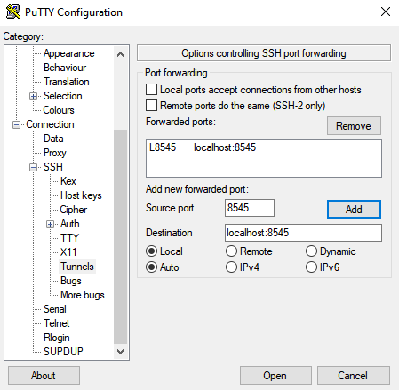
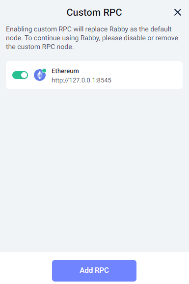
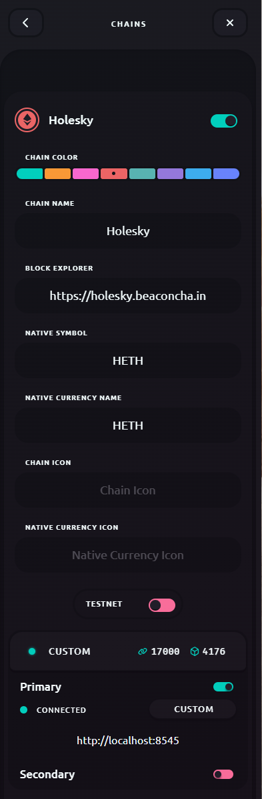

# ⚡ Using Node as RPC URL endpoint

### :tada: Reasons to use your own NODE as RPC URL endpoint

* **Privacy**: No spying by middleman between you and the blockchain
* **Trustless verification**: Ability to verify the ETH transaction data you see is raw and not manipulated
* **Decentralization**: No need to depend on Infura or other centralized 3rd parties
* **Coolness and credibility**: Using Ethereum as it was meant to be, a step towards being more sovereign

### :robot: How to use your NODE as a RPC endpoint


Before continuing please understand the following:

* As this method uses SSH tunneling, no changes are required to your firewall or router's port forwarding


### 1. Verify RPC port 8545 is listening

Double check that your node is listening on port 8545&#x20;

```bash
ss -ntlp | grep 8545
```

For example, here's the output for Besu with RPC enabled.

```bash
LISTEN 0      128    [::ffff:127.0.0.1]:8545             *:*    users:(("java",pid=26453,fd=433))
```


**Port 8545 is NOT listening or using Geth or Besu?**


**Note: Nethermind** and **Erigon** enable RPC by default.


The following flags on the `ExecStart` line are required to enable RPC.


**Geth**

```bash
--http
```

**Besu**

```bash
--rpc-http-enabled=true
--rpc-http-cors-origins="*"
```


Changes can be made to the **systemd unit file** `execution.service,`

```bash
sudo nano /etc/systemd/system/execution.service
```

To exit and save, press `Ctrl` + `X`, then `Y`, then `Enter`.


Make sure to reload and restart.

```bash
sudo systemctl daemon-reload
sudo systemctl restart execution
```


### 2. Create a SSH tunnel


Every time you want to use your node as an RPC endpoint, you must open a SSH tunnel connection with port 8545 forwarded.


**Exception:** **Local nodes** (i.e. using Ubuntu Desktop) - if you're accessing your wallet on the same machine as your node, skip this step.




Example of how to create a SSH tunnel in Linux or MacOS:

```bash
ssh -N -v <user>@<staking.node.ip.address> -L 8545:localhost:8545

#Full Example
ssh -N -v ethereum@192.168.1.69 -L 8545:localhost:8545
```



Example of how to create a SSH tunnel in Windows with [Putty](https://putty.org/):

Navigate to Connection > SSH > Tunnels > Enter Source Port `8545`> Enter Destination `localhost:8545`> Click Add



Now save your configuration. Navigate to Session > Enter a session name > Save

Click Open to open a connection



### 3. Configure wallet to use RPC URL

When configuring your wallet, you can reference the following network information:

| Network     | Chain ID | Block Explorer                                                | Currency |
| ----------- | -------- | ------------------------------------------------------------- | -------- |
| **Mainnet** | 1        | [https://etherscan.io](https://etherscan.io)                  | ETH      |
| **Holešky** | 17000    | [https://holesky.etherscan.io](https://holesky.etherscan.io/) | hETH     |
| **Goerli**  | 5        | [https://goerli.etherscan.io](https://goerli.etherscan.io)    | gETH     |
| **Sepolia** | 11155111 | [https://sepolia.etherscan.io](https://sepolia.etherscan.io)  | sETH     |

Here are steps to configure popular wallets to use a custom RPC URL endpoint.

<details>

<summary>Rabby</summary>

Download from [https://rabby.io](https://rabby.io/)

1. Click **More**
2. Click **Custom RPC**
3. Click **Add RPC**
4. Select the network. If testnet, you might need to go back a menu and enable testnets.
5. Fill in the **RPC URL** as **http://127.0.0.1:8545**
6. Rabby will now show your balances with this RPC.

Example of Adding a Network:



</details>

<details>

<summary>Frame</summary>

Download from [https://frame.sh](https://frame.sh/)

1. Open **Chains**
2. Either add to an existing chain (i.e. Mainnet) or Click "**Add New Chain"**
3. Fill in **Primary (if new chain) or Secondary (if existing chain) RPC URL** as **http://localhost:8545**
4. If required, fill in **Chain name**, **Chain ID**, **Native symbol**, **Native Currency Name** and **Block Explorer** with data from above table
5. Click **ADD CHAIN button**
6. Frame will now display your balances with this RPC.

Example of Adding a Network:



</details>

<details>

<summary>Metamask</summary>

Download from [https://metamask.io](https://metamask.io/)

1. Open **Settings**
2. Open **Networks**
3. Click "**Add a network**" > **Add a network manually**
4. Fill in **New RPC URL** as **http://localhost:8545**
5. Fill in **Network name**, **Chain ID**, **Currency symbol**, and **Block Explorer** with data from above table
6. Click **Save button**
7. Finally, click the top left button and "**Select a Network**", the network which you just added.

Example of Adding a Network:


</details>


Great job! You're now using your own node as your own RPC URL endpoint.

