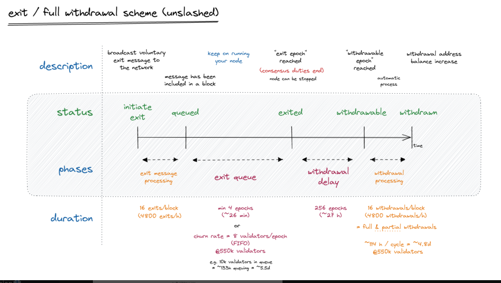

# Voluntary Exiting a Validator

## :track\_next: Voluntary Exit Timeline Visualized

<figure><figcaption></figcaption></figure>

## :clap: Purpose

Use the Voluntary Exit command to signal your intentions to permanently stop your duties as a validator.

* **Timeline**: Voluntary exiting is possible after your validator is actively validating. If there is no exit queue, the exit process requires at least 4 epochs, or 26 minutes. After your validator is "exited", and proceeds through the "withdrawal delay" phase and "withdrawal processing" phase, your ETH is automatically swept back to your withdrawal address.
* **Consequences**: Once a validator is in exited state, it's non-reversible. You would need to re-key, or generate new validator keys to start staking again.
* **ETH Deposit**: In order to re-claim your 32ETH validator deposit and perform a full withdrawal, you must have previously set a Withdrawal Address. If not yet set, see here: [0x01 withdrawal address.](../../update-withdrawal-keys-for-ethereum-validator-bls-to-execution-change-or-0x00-to-0x01-with-ethdo.md)
* **Responsibilities**: After your validator leaves the exit queue and is truly exited, it is safe to turn off your execution client, consensus client and validator.

Reference: [https://liquidcollective.io/eth-activations-and-exits/](https://liquidcollective.io/eth-activations-and-exits/)

## :computer: How-to initiate a voluntary exit



```bash
sudo lighthouse account validator exit \
--keystore /var/lib/lighthouse/validators/<0x validator>/<keystore.json file> \
--beacon-node http://localhost:5052 \
--network mainnet
```

Example:

```bash
sudo lighthouse account validator exit \
--keystore /var/lib/lighthouse/validators/0x838f024753064e90fd8fa183400af82dd2103df885/keystore-m_12311_12-112312.json \
--beacon-node http://localhost:5052 \
--network mainnet
```



```bash
sudo /usr/bin/teku/bin/teku voluntary-exit \
--beacon-node-api-endpoint=http://127.0.0.1:5051 \
--validator-keys=<path to keystore.json>:<path to password.txt file>
```

Example:

```
sudo /usr/bin/teku/bin/teku voluntary-exit \
--beacon-node-api-endpoint=http://127.0.0.1:5051 \
--validator-keys=/var/lib/teku/validator_keys/keys/validator_1abc3.json:/etc/teku/validators-password.txt
```



```bash
sudo /usr/local/bin/nimbus_beacon_node deposits exit \
--validator=<VALIDATOR_PUBLIC_KEY> \
--data-dir=/var/lib/nimbus
```

Example:

```bash
sudo /usr/local/bin/nimbus_beacon_node deposits exit \
--validator=0x838f0247538237064e90fd8fa183400af82dd2103df885 \
--data-dir=/var/lib/nimbus
```



```bash
sudo /usr/local/bin/validator accounts voluntary-exit \
--wallet-dir=/var/lib/prysm/validators
```



Stop Lodestar validator

```bash
sudo systemctl stop validator
```

Run the voluntary exit command

<pre class="language-bash"><code class="lang-bash"><strong># change directories to binary folder
</strong>cd /usr/local/bin/lodestar
<strong>
</strong># the voluntary exit command
sudo ./lodestar validator voluntary-exit
</code></pre>

Restart validator

```bash
sudo systemctl restart validator
```




**Troubleshooting**: To perform a voluntary exit, make sure your consensus client (aka beacon node) is running with **REST-API** enabled.


### Official reference documentation from each team can be found below:

* [Exiting a Teku validator](https://docs.teku.consensys.net/how-to/voluntarily-exit)
* [Exiting a Prysm validator](https://docs.prylabs.network/docs/wallet/exiting-a-validator)
* [Exiting a Nimbus validator](https://nimbus.guide/voluntary-exit.html)
* [Exiting a Lodestar validator](https://chainsafe.github.io/lodestar/reference/cli/#validator-voluntary-exit)
* [Exiting a Lighthouse validator](https://lighthouse-book.sigmaprime.io/voluntary-exit.html)
