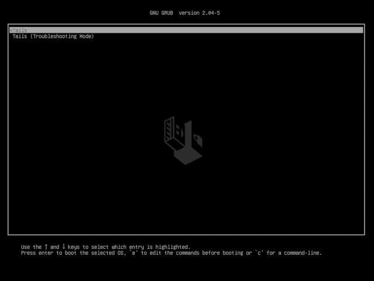

# Guide | How to setup a validator for Ethereum staking on testnet GOERLI

## Announcements


:confetti\_ball: **Live Now! Gitcoin Grants until May 9:** [We improve this guide with your support!](https://explorer.gitcoin.co/#/round/1/0xdf22a2c8f6ba9376ff17ee13e6154b784ee92094/0xdf22a2c8f6ba9376ff17ee13e6154b784ee92094-9)🙏



As of Feb 3 2023, this **post-merge guide is version 5.1.3** and written for **testnet GOERLI.**



**Always test and practice on testnet first.** [**Mainnet guide available here.**](guide-or-how-to-setup-a-validator-on-eth2-mainnet/)


## :thumbsup: Your Github Contributions Welcome

This guide is fully open source and fully powered by home-stakers like you.

Pull requests or issues can be submitted on [github](https://github.com/coincashew/coincashew):



Built by home-stakers for home-stakers. :pray:

## ​​:checkered\_flag: 0. Prerequisites <a href="#0.-prerequisites" id="0.-prerequisites"></a>

### :woman\_technologist:Skills to be a eth staker

As a eth staker, you will typically have the following abilities:

* operational knowledge of how to set up, run and maintain a eth beacon node and validator continuously
* a long term commitment to maintain your validator 24/7/365
* basic operating system skills

### :man\_technologist: Experience required to be a successful validator

* have learned the essentials by watching ['Intro to Eth2 & Staking for Beginners' by Superphiz](https://www.youtube.com/watch?v=tpkpW031RCI)
* have passed or is actively enrolled in the [Eth2 Study Master course](https://ethereumstudymaster.com)
* and have read the [8 Things Every Eth2 validator should know.](https://medium.com/chainsafe-systems/8-things-every-eth2-validator-should-know-before-staking-94df41701487)

### :man\_lifting\_weights: Recommended Hardware Setup

* **Operating system:** 64-bit Linux (i.e. Ubuntu 22.0x+ LTS Server or Desktop)
* **Processor:** Quad core CPU, Intel Core i7–4770 or AMD FX-8310 or better
* **Memory:** 16GB RAM or more
* **Storage:** 2TB SSD or more
* **Internet:** Broadband internet connections with speeds at least 10 Mbps without data limit.
* **Power:** Reliable electrical power with uninterruptible power supply (UPS)
* **ETH balance:** at least 32 goerli ETH and some goerli ETH for deposit transaction fees
* **Wallet**: Metamask installed


:bulb: For examples of actual staking hardware builds, check out [RocketPool's hardware guide](https://github.com/rocket-pool/docs.rocketpool.net/blob/main/src/guides/node/local/hardware.md).



:sparkles: **Pro Validator Tip**: Highly recommend you begin with a brand new instance of an OS, VM, and/or machine. Avoid headaches by NOT reusing testnet keys, wallets, or databases for your validator.


### :unlock: Recommended Security Best Practices

If you need ideas or a reminder on how to secure your staking node, refer to the [security best practices guide](https://www.coincashew.com/coins/overview-eth/guide-or-security-best-practices-for-a-eth2-validator-beaconchain-node).

### :tools: Setup Ubuntu Operating System

If you need to install Ubuntu Server, refer to [this guide.](https://ubuntu.com/tutorials/install-ubuntu-server#1-overview)

Or Ubuntu Desktop, refer to [this guide.](https://www.coincashew.com/coins/overview-xtz/guide-how-to-setup-a-baker/install-ubuntu)

### :performing\_arts: Setup Metamask

If you need to install Metamask, refer to [this guide.](https://www.coincashew.com/wallets/browser-wallets/metamask-ethereum)

### :jigsaw: High Level Validator Node Overview


At the end of this guide, you will build a node that hosts three main components in two layers: consensus layer consists of a consensus client, also known as a validator client with a beacon chain client. The execution layer consists of a execution client, formerly a eth1 node.

**Validator client** - Responsible for producing new blocks and attestations in the beacon chain and shard chains.

**Beacon chain client** - Responsible for managing the state of the beacon chain, validator shuffling, and more.

**Execution client (aka Eth1 node)** - Supplies incoming validator deposits from the eth

chain to the beacon chain client.



## :seedling: 1. Obtain testnet ETH


Every 32 ETH you own allows you to make 1 validator. You can run thousands of validators with your beacon node. However on testnet, please only run 1 or 2 validators to keep the activation queue reasonably quick.


#### Option 1: Ethstaker's #cheap-goerli-validator Channel

* **Step 1**: Visit the [Ethstaker Discord](https://discord.io/ethstaker) and join the #cheap-goerli-validator channel
* **Step 2**: Use the `/cheap-goerli-deposit` slash command and follow the instructions from the bot. You need to start typing the slash command and it will show above your input box where you can use it.
* **Requirement**: In order to use the cheap goerli validator process, you must now set your withdrawal address to `0x4D496CcC28058B1D74B7a19541663E21154f9c84` when creating your validator keys and deposit file. This is to prevent abuses of this service.

#### Option 2: Watch this how-to [youtube video for Goerli ETH](https://youtu.be/uur7hGCscak)

## :woman\_technologist: 2. Signup to be a validator at the Launchpad

1. Install dependencies, the ethereum foundation deposit tool and generate your two sets of key pairs.


Each validator will have two sets of key pairs. A **signing key** and a **withdrawal key.** These keys are derived from a single mnemonic phrase. [Learn more about keys.](https://blog.ethereum.org/2020/05/21/keys/)


You will also set your [ETH Withdrawal Address](https://notes.ethereum.org/@launchpad/withdrawals-faq#Q-What-are-the-two-types-of-withdrawals), preferably from your Ledger or Trezor hardware wallet.


You have the choice of using the [Wagyu GUI](https://github.com/stake-house/wagyu-installer), downloading the pre-built [Ethereum staking deposit tool](https://github.com/ethereum/staking-deposit-cli) or building it from source.&#x20;



Install dependencies.

```
sudo apt update
sudo apt install python3-pip git -y
```


Download source code and install.

```
cd $HOME
git clone https://github.com/ethereum/staking-deposit-cli
cd staking-deposit-cli
sudo ./deposit.sh install
```


Make a new mnemonic and replace `<ETH_ADDRESS_FROM_IDEALLY_HARDWARE_WALLET>` with your [ethereum withdrawal address](https://notes.ethereum.org/@launchpad/withdrawals-faq#Q-If-I-used---eth1\_withdrawal\_address-when-making-my-initial-deposit-which-type-of-withdrawal-credentials-do-I-have), ideally from a Trezor, Ledger or comparable hardware wallet.

```
./deposit.sh new-mnemonic --chain goerli --eth1_withdrawal_address <ETH_ADDRESS_FROM_IDEALLY_HARDWARE_WALLET>
```



Download staking-deposit-cli.

```bash
cd $HOME
wget https://github.com/ethereum/staking-deposit-cli/releases/download/v2.4.0/staking_deposit-cli-ef89710-linux-amd64.tar.gz
```


Verify the SHA256 Checksum matches the checksum on the [releases page](https://github.com/ethereum/staking-deposit-cli/releases/tag/v2.3.0).

```bash
echo "c2b12a9e515f904ca359ec39dfbd7022dfefe881c1796ce42319df0a2da05560 *staking_deposit-cli-76ed782-linux-amd64.tar.gz" | shasum -a 256 --check
```


Example valid output:

> staking\_deposit-cli-ef89710-linux-amd64.tar.gz: OK


Only proceed if the sha256 check passes with **OK**!



Extract the archive.

```
tar -xvf staking_deposit-cli-ef89710-linux-amd64.tar.gz
mv staking_deposit-cli-ef89710-linux-amd64 staking-deposit-cli
rm staking_deposit-cli-ef89710-linux-amd64.tar.gz
cd staking-deposit-cli
```


Make a new mnemonic and replace `<ETH_ADDRESS_FROM_IDEALLY_HARDWARE_WALLET>` with your [ethereum withdrawal address](https://notes.ethereum.org/@launchpad/withdrawals-faq#Q-If-I-used---eth1\_withdrawal\_address-when-making-my-initial-deposit-which-type-of-withdrawal-credentials-do-I-have), ideally from a Trezor, Ledger or comparable hardware wallet.

```
./deposit new-mnemonic --chain goerli --eth1_withdrawal_address <ETH_ADDRESS_FROM_IDEALLY_HARDWARE_WALLET>
```



Wagyu (formerly known as StakeHouse) is an application aimed at lowering the technical bar to staking on Ethereum 2.0.

Dubbed a 'one-click installer', it provides a clean UI automating the setup and management of all the infrastructure necessary to stake without the user needing to have any technical knowledge.


Download Wagyu: [https://wagyu.gg](https://wagyu.gg/)

Github: [https://github.com/stake-house/wagyu-installer](https://github.com/stake-house/wagyu-installer)


After creating the validator keys locally, you'll want to copy these validator keys via USB key or rsync file transfer to your staking node.


To align with this guide's steps, first make a default path to store your validator keys.

<pre><code><strong>mkdir -p $HOME/staking-deposit-cli/validator_keys
</strong></code></pre>


If using USB key, mount the key then copy.

```
cp <directory-with-keys>/*.json $HOME/staking-deposit-cli/validator_keys
```


If using rsync, copy your validator keys from your local computer to your staking node with the following command. Change ssh port if needed.

```
rsync -a "ssh -p 22" <directory-with-keys>/*.json <username>@<remote_host>:/home/<username>/staking-deposit-cli/validator_keys
```




:fire:**\[ Optional ] Pro Security Tip**: Run the staking-deposit-cli tool and generate your **mnemonic seed** for your validator keys on an **air-gapped offline machine booted from usb**.



You will learn how to boot up a windows PC into an airgapped [Tails operating system](https://tails.boum.org/index.en.html).

The Tails OS is an _amnesic_ operating system, meaning it will save nothing and _leave no tracks behind_ each time you boot it.


**Part 0 - Prerequisites**

You need:

* 2 storage mediums (can be USB stick, SD cards or external hard drives)
* One of them must be > 8GB
* Windows or Mac computer
* 30 minutes or longer depending on your download speed


**Part 1 - Download Tails OS**

Download the official image from the [Tails website](https://tails.boum.org/install/index.en.html). Might take a while, go grab a coffee.

Make sure you follow the guide on the Tails website to verify your download of Tails.


**Part 2 - Download and install the software to transfer your Tails image on your USB stick**

For Windows, use one of

* [Etcher](https://tails.boum.org/etcher/Etcher-Portable.exe)
* [Win32 Disk Imager](https://win32diskimager.org/#download)
* [Rufus](https://rufus.ie/en\_US/)

For Mac, download [Etcher](https://tails.boum.org/etcher/Etcher.dmg)


**Part 3 - Making your bootable USB stick**

Run the above software. This is an example how it looks like on Mac OS with etcher, but other software should be similar.


Select the Tails OS image that you downloaded as the image. Then select the USB stick (the larger one).

Then flash the image to the larger USB stick.


**Part 4 - Download and verify the staking-deposit-cli**

You can refer to the other tab on this guide on how to download and verify the staking-deposit-cli.

Copy the file to the other USB stick.


**Part 5 - Reboot your computer and into Tails OS**

After you have done all the above, you can reboot. If you are connected by a LAN cable to the internet, you can disconnect it manually.

Plug in the USB stick that has your Tails OS.

On Mac, press and hold the Option key immediately upon hearing the startup chime. Release the key after Startup Manager appears.

On Windows, it depends on your computer manufacturer. Usually it is by pressing F1 or F12. If it doesn't work, try googling "Enter boot options menu on \[Insert your PC brand]"

Choose the USB stick that you loaded up with Tails OS to boot into Tails.


**Part 6 - Welcome to Tails OS**



You can boot with all the default settings.


**Part 7 - Run the staking-deposit-cli**

Plug in your other USB stick with the `staking-deposit-cli` file.

You can then open your command line and navigate into the directory containing the file. Then you can continue the guide from the other tab.


Make a new mnemonic and replace `<ETH_ADDRESS_FROM_IDEALLY_HARDWARE_WALLET>` with your [ethereum withdrawal address](https://notes.ethereum.org/@launchpad/withdrawals-faq#Q-If-I-used---eth1\_withdrawal\_address-when-making-my-initial-deposit-which-type-of-withdrawal-credentials-do-I-have), ideally from a Trezor, Ledger or comparable hardware wallet.

```
./deposit.sh new-mnemonic --chain goerli --eth1_withdrawal_address <ETH_ADDRESS_FROM_IDEALLY_HARDWARE_WALLET>
```


If you ran this command directly from your non-Tails USB stick, the validator keys should stay on it. If it hasn't, copy the directory over to your non-Tails USB stick.



:fire: **Make sure you have saved your validator keys directory in your other USB stick (non Tails OS) before you shutdown Tails. Tails will delete everything saved on it after you shutdown.**.




:tada: Congrats on learning how to use Tails OS to make an air gapped system. As a bonus, you can reboot into Tails OS again and connect to internet to surf the dark web or clear net safely!



Alternatively, follow this [ethstaker.cc](https://ethstaker.cc) exclusive for the low down on making a bootable usb.


**Part 1 - Create a Ubuntu 20.04 USB Bootable Drive**

Video link: [https://www.youtube.com/watch?v=DTR3PzRRtYU](https://www.youtube.com/watch?v=DTR3PzRRtYU)


**Part 2 - Install Ubuntu 20.04 from the USB Drive**

Video link: [https://www.youtube.com/watch?v=C97\_6MrufCE](https://www.youtube.com/watch?v=C97\_6MrufCE)

You can copy via USB key the pre-built staking-deposit-cli binaries from an online machine to an air-gapped offline machine booted from usb. Make sure to disconnect the ethernet cable and/or WIFI.



2\. If using **staking-deposit-cli**, follow the prompts and pick a **KEYSTORE password**. This password encrypts your keystore files. Write down your mnemonic and keep this safe and **offline**.


**Do not send real mainnet ETH during this process!** :octagonal\_sign: Use only goerli ETH.



**Caution**: Only deposit the 32 ETH per validator if you are confident your execution client (ETH1 node) and consensus client (ETH2 validator) will be fully synced and ready to perform validator duties. You can return later to launchpad with your deposit-data to finish the next steps.


3\. Follow the steps at [https://goerli.launchpad.ethereum.org](https://goerli.launchpad.ethereum.org/en/) while skipping over the steps you already just completed. Study the eth2 phase 0 overview material. Understanding eth2 is the key to success!


:whale: **Batch Depositing Tip**: If you have many deposits to make for many validators, consider using [Abyss.finance's eth2depositor tool.](https://abyss.finance/eth2depositor) This greatly improves the deposit experience as multiple deposits can be batched into one transaction, thereby saving gas fees and saving your fingers by minimizing Metamask clicking.

Make sure to switch to **GÖRLI** network.

Source: [https://twitter.com/AbyssFinance/status/1379732382044069888](https://twitter.com/AbyssFinance/status/1379732382044069888)


4\. Back on the launchpad website, upload your`deposit_data-#########.json` found in the `validator_keys` directory.

5\. Connect to the launchpad with your Metamask wallet, review and accept terms. Ensure you're connected to **GÖRLI** network.

6\. Confirm the transaction(s). There's one deposit transaction of 32 ETH for each validator.


For instance, if you want to run 3 validators you will need to have (32 x 3) = 96 goerli ETH plus some extra to cover the gas fees.



Your transaction is sending and depositing your ETH to the goerli ETH2 deposit contract address.

**Check**, _double-check_, _**triple-check**_ that the goerli Eth2 deposit contract address is correct.

[`0xff50ed3d0ec03aC01D4C79aAd74928BFF48a7b2b`](https://goerli.etherscan.io/address/0xff50ed3d0ec03ac01d4c79aad74928bff48a7b2b)



:fire: **Critical Crypto Reminder:** **Keep your mnemonic, keep your ETH.**

* Write down your mnemonic seed **offline**. _Not email. Not cloud._
* Multiple copies are better. _Best stored in a_ [_metal seed._](https://jlopp.github.io/metal-bitcoin-storage-reviews/)
* Make **offline backups**, such as to a USB key, of your **`validator_keys`** directory.


## :flying\_saucer: 3. Install execution client (ETH1 node)


Ethereum requires a connection to the execution client in order to monitor for 32 ETH validator deposits. Hosting your own execution client is the best way to maximize decentralization and minimize dependency on third parties such as Infura.



The subsequent steps assume you have completed the [best practices security guide.](https://www.coincashew.com/coins/overview-eth/guide-or-how-to-setup-a-validator-on-eth2-mainnet/part-i-installation/guide-or-security-best-practices-for-a-eth2-validator-beaconchain-node)

:octagonal\_sign: Do not run your processes as **ROOT** user. :scream:


### Create a jwtsecret file

A jwtsecret file contains a hexadecimal string that is passed to both Execution Layer client and Consensus Layer clients, and is used to ensure authenticated communications between both clients.

```bash
#store the jwtsecret file at /secrets
sudo mkdir -p /secrets

#create the jwtsecret file
openssl rand -hex 32 | tr -d "\n" | sudo tee /secrets/jwtsecret

#enable read access
sudo chmod 644 /secrets/jwtsecret
```

### Pick an execution client

Your choice of either [**Geth**](https://geth.ethereum.org)**,** [**Besu**](https://besu.hyperledger.org)**,** [**Nethermind**](https://www.nethermind.io)**, or** [**Erigon**](https://github.com/ledgerwatch/erigon)**.**


To strengthen Ethereum's resilience against potential attacks or consensus bugs, it's best practice to run a minority client in order to increase client diversity. Find the latest distribution of execution clients here: [https://clientdiversity.org/](https://clientdiversity.org/)





**Geth** - Go Ethereum is one of the three original implementations (along with C++ and Python) of the Ethereum protocol. It is written in **Go**, fully open source and licensed under the GNU LGPL v3.



Review the latest release notes at [https://github.com/ethereum/go-ethereum/releases](https://github.com/ethereum/go-ethereum/releases)


:dna:**Install from the repository**

```
sudo add-apt-repository -y ppa:ethereum/ethereum
sudo apt-get update -y
sudo apt-get install ethereum -y
```


:gear: **Setup and configure systemd**

Run the following to create a **unit file** to define your `eth1.service` configuration.

Simply copy/paste the following.

```bash
cat > $HOME/eth1.service << EOF
[Unit]
Description=Geth Execution Layer Client service
Wants=network-online.target
After=network-online.target

[Service]
Type=simple
User=$USER
Restart=on-failure
RestartSec=3
TimeoutSec=300
ExecStart=/usr/bin/geth \
  --goerli \
  --metrics \
  --pprof \
  --authrpc.jwtsecret=/secrets/jwtsecret

[Install]
WantedBy=multi-user.target
EOF
```



**Nimbus Specific Configuration**: Add the following flag to the ExecStart line.

```bash
--ws
```



Move the unit file to `/etc/systemd/system` and give it permissions.

```bash
sudo mv $HOME/eth1.service /etc/systemd/system/eth1.service
```

```bash
sudo chmod 644 /etc/systemd/system/eth1.service
```


Run the following to enable auto-start at boot time.

```
sudo systemctl daemon-reload
sudo systemctl enable eth1
```


:chains:**Start geth**

```
sudo systemctl start eth1
```




**Hyperledger Besu** is an open-source Ethereum client designed for demanding enterprise applications requiring secure, high-performance transaction processing in a private network. It's developed under the Apache 2.0 license and written in **Java**.



:dna:**Install java dependency**

```
sudo apt update
sudo apt install openjdk-17-jdk -y libjemalloc-dev
```


:last\_quarter\_moon\_with\_face:**Download and unzip Besu**

Review the latest release at [https://github.com/hyperledger/besu/releases](https://github.com/hyperledger/besu/releases)


Run the following to automatically download the latest linux release, un-tar and cleanup.

```bash
BINARIES_URL="$(curl -s https://api.github.com/repos/hyperledger/besu/releases/latest | grep -o 'https://hyperledger.jfrog.io/hyperledger/besu-binaries/besu/.*tar.gz' | sed -e 's/.*\\n\(https.*.tar.gz$\)/\1/')"

echo Downloading URL: $BINARIES_URL

cd $HOME
wget -O besu.tar.gz "$BINARIES_URL"
tar -xzvf besu.tar.gz -C $HOME
rm besu.tar.gz && mv besu-* besu
```


:gear: **Setup and configure systemd**

```bash
cat > $HOME/eth1.service << EOF
[Unit]
Description=Besu Execution Layer Client service
Wants=network-online.target
After=network-online.target

[Service]
Type=simple
User=$USER
Restart=on-failure
RestartSec=3
KillSignal=SIGINT
TimeoutStopSec=300
Environment="JAVA_OPTS=-Xmx5g"
ExecStart=$HOME/besu/bin/besu \
  --network=goerli \
  --metrics-enabled=true \
  --sync-mode=X_CHECKPOINT \
  --data-storage-format=BONSAI \
  --data-path="$HOME/.besu" \
  --engine-jwt-secret=/secrets/jwtsecret

[Install]
WantedBy=multi-user.target
EOF
```


Move the unit file to `/etc/systemd/system` and give it permissions.

```bash
sudo mv $HOME/eth1.service /etc/systemd/system/eth1.service
```

```bash
sudo chmod 644 /etc/systemd/system/eth1.service
```


Run the following to enable auto-start at boot time.

```
sudo systemctl daemon-reload
sudo systemctl enable eth1
```


:chains: **Start besu**

```
sudo systemctl start eth1
```




**Nethermind** is a flagship Ethereum client all about performance and flexibility. Built on **.NET** core, a widespread, enterprise-friendly platform, Nethermind makes integration with existing infrastructures simple, without losing sight of stability, reliability, data integrity, and security.



:gear: **Install dependencies**

```
sudo apt-get update
sudo apt-get install curl libsnappy-dev libc6-dev jq libc6 unzip -y
```


:last\_quarter\_moon\_with\_face:**Download and unzip Nethermind**

Review the latest release at [https://github.com/NethermindEth/nethermind/releases](https://github.com/NethermindEth/nethermind/releases)

Run the following to automatically download the latest linux release, un-zip and cleanup.

```bash
cd $HOME
curl -s https://api.github.com/repos/NethermindEth/nethermind/releases/latest | jq -r ".assets[] | select(.name) | .browser_download_url" | grep linux-x64 | xargs wget -q --show-progress
unzip -o nethermind*.zip -d $HOME/nethermind
rm nethermind*linux*.zip
```


:gear: **Setup and configure systemd**

Run the following to create a **unit file** to define your `eth1.service` configuration.

Simply copy/paste the following.

```bash
cat > $HOME/eth1.service << EOF
[Unit]
Description=Nethermind Execution Layer Client service
Wants=network-online.target
After=network-online.target

[Service]
Type=simple
User=$USER
Restart=on-failure
RestartSec=3
KillSignal=SIGINT
TimeoutStopSec=300
WorkingDirectory=$HOME/nethermind
ExecStart=$HOME/nethermind/Nethermind.Runner \
  --config goerli \
  --baseDbPath $HOME/.nethermind_goerli \
  --Metrics.Enabled true \
  --Metrics.ExposePort 6060 \
  --Metrics.IntervalSeconds 10000 \
  --Sync.SnapSync true \
  --JsonRpc.JwtSecretFile /secrets/jwtsecret

[Install]
WantedBy=multi-user.target
EOF
```


Move the unit file to `/etc/systemd/system` and give it permissions.

```bash
sudo mv $HOME/eth1.service /etc/systemd/system/eth1.service
```

```bash
sudo chmod 644 /etc/systemd/system/eth1.service
```


Run the following to enable auto-start at boot time.

```
sudo systemctl daemon-reload
sudo systemctl enable eth1
```



On Ubuntu 22.xx+, a [workaround](https://github.com/NethermindEth/nethermind/issues/4039) is required.

```
sudo ln -s /usr/lib/x86_64-linux-gnu/libdl.so.2 /usr/lib/x86_64-linux-gnu/libdl.so
```



:chains: **Start Nethermind**

```
sudo systemctl start eth1
```




**Erigon** - Successor to OpenEthereum, Erigon is an implementation of Ethereum (aka "Ethereum client"), on the efficiency frontier, written in Go.




Erigon is considered alpha software and requires at least 16GB RAM.



:gear: **Install Go dependencies**

```
wget -O go.tar.gz https://go.dev/dl/go1.19.linux-amd64.tar.gz
```

```bash
sudo rm -rf /usr/local/go && sudo tar -C /usr/local -xzf go.tar.gz
```

```bash
echo export PATH=$PATH:/usr/local/go/bin>> $HOME/.bashrc
source $HOME/.bashrc
```


Verify Go is properly installed and cleanup files.

```bash
go version
rm go.tar.gz
```


:robot: **Build and install Erigon**

Install build dependencies.

```bash
sudo apt-get update
sudo apt install build-essential git
```


Review the latest release at [https://github.com/ledgerwatch/erigon/releases](https://github.com/ledgerwatch/erigon/releases)

```bash
cd $HOME
git clone --recurse-submodules -j8 https://github.com/ledgerwatch/erigon.git
cd erigon
make erigon
```


​ Make data directory and update directory ownership.

```bash
sudo mkdir -p /var/lib/erigon
sudo chown $USER:$USER /var/lib/erigon
```


​ :gear: **Setup and configure systemd**

Run the following to create a **unit file** to define your `eth1.service` configuration.

Simply copy/paste the following.

```bash
cat > $HOME/eth1.service << EOF
[Unit]
Description=Erigon Execution Layer Client service
Wants=network-online.target
After=network-online.target

[Service]
Type=simple
User=$USER
Restart=on-failure
RestartSec=3
KillSignal=SIGINT
TimeoutStopSec=300
ExecStart=$HOME/erigon/build/bin/erigon \
 --datadir /var/lib/erigon \
 --chain goerli \
 --metrics \
 --pprof \
 --prune htc \
 --authrpc.jwtsecret=/secrets/jwtsecret

[Install]
WantedBy=multi-user.target
EOF
```



By default with Erigon, `--prune` deletes data older than 90K blocks from the tip of the chain (aka, for if tip block is no. 12'000'000, only the data between 11'910'000-12'000'000 will be kept).



Move the unit files to `/etc/systemd/system` and give it permissions.

```bash
sudo mv $HOME/eth1.service /etc/systemd/system/eth1.service
```

```bash
sudo chmod 644 /etc/systemd/system/eth1.service
```


Run the following to enable auto-start at boot time.

```
sudo systemctl daemon-reload
sudo systemctl enable eth1
```


:chains:**Start Erigon**

```
sudo systemctl start eth1
```



### Helpful execution client commands



```
journalctl -fu eth1
```



```
sudo systemctl stop eth1
```



```
sudo systemctl start eth1
```



```
sudo systemctl status eth1
```



Now that your execution client is configured and started, proceed to the next step on setting up your consensus client.


If you're checking the logs and see any warnings or errors, please be patient as these will normally resolve once both your execution and consensus clients are fully synced to the Ethereum network.


## 4. Configure consensus client (beacon chain and validator)


To strengthen Ethereum's resilience against potential attacks or consensus bugs, it's best practice to run a minority client in order to increase client diversity. Find the latest distribution of consensus clients here: [https://clientdiversity.org/](https://clientdiversity.org/)


Your choice of [Lighthouse](https://github.com/sigp/lighthouse), [Nimbus](https://github.com/status-im/nimbus-eth2), [Teku](https://consensys.net/knowledge-base/ethereum-2/teku/), [Prysm](https://github.com/prysmaticlabs/prysm) or [Lodestar](https://lodestar.chainsafe.io).




[Lighthouse](https://github.com/sigp/lighthouse) is an Eth client with a heavy focus on speed and security. The team behind it, [Sigma Prime](https://sigmaprime.io), is an information security and software engineering firm who have funded Lighthouse along with the Ethereum Foundation, Consensys, and private individuals. Lighthouse is built in Rust and offered under an Apache 2.0 License.



:gear: **4.1. Install rust dependency**


```bash
curl --proto '=https' --tlsv1.2 -sSf https://sh.rustup.rs | sh
```

Enter '1' to proceed with the default install.


Update your environment variables.

```bash
echo export PATH="$HOME/.cargo/bin:$PATH" >> ~/.bashrc
source ~/.bashrc
```


Install rust dependencies.

```
sudo apt-get update
sudo apt install -y git gcc g++ make cmake pkg-config libssl-dev libclang-dev clang protobuf-compiler
```


:bulb: **4.2. Build Lighthouse from source**

```bash
mkdir ~/git
cd ~/git
git clone https://github.com/sigp/lighthouse.git
cd lighthouse
git fetch --all && git checkout stable && git pull
make
```



In case of compilation errors, run the following sequence.

```
rustup update
cargo clean
make
```




This build process may take a few minutes.



Verify lighthouse was installed properly by checking the version number.

```
lighthouse --version
```


:tophat: **4.3. Import validator key**


Run the following command to import your validator keys from the staking-deposit-cli tool directory.


Enter your **keystore password** to import accounts.

```bash
lighthouse account validator import --network goerli --directory=$HOME/staking-deposit-cli/validator_keys
```


Verify the accounts were imported successfully.

```bash
lighthouse account_manager validator list --network goerli
```



WARNING: Do not import your validator keys into multiple validator clients and run them at the same time, or you might get slashed. If moving validators to a new setup or different validator client, ensure deletion of the previous validator keys before continuing.



:fire: **4.4. Configure port forwarding and/or firewall**


Specific to your networking setup or cloud provider settings, ensure your validator's firewall ports are open and reachable.


* **Lighthouse consensus client** requires port 9000 for tcp and udp
* **Execution client** requires port 30303 for tcp and udp


:chains: **4.5. Start the beacon chain**


Create a **systemd unit file** to define your`beacon-chain.service` configuration.

```
sudo nano /etc/systemd/system/beacon-chain.service
```


Paste the following configuration into the file.

```bash
# The eth beacon chain service (part of systemd)
# file: /etc/systemd/system/beacon-chain.service

[Unit]
Description=eth beacon chain service
Wants=network-online.target
After=network-online.target

[Service]
Type=simple
User=<USER>
Restart=on-failure
ExecStart=<HOME>/.cargo/bin/lighthouse bn \
  --network goerli \
  --staking \
  --validator-monitor-auto \
  --metrics \
  --checkpoint-sync-url=https://goerli.beaconstate.info \
  --execution-endpoint http://127.0.0.1:8551 \
  --execution-jwt /secrets/jwtsecret

[Install]
WantedBy=multi-user.target
```


To exit and save, press `Ctrl` + `X`, then `Y`, then`Enter`.


Update the configuration file with your current user's home path and user name.

```
sudo sed -i /etc/systemd/system/beacon-chain.service -e "s:<HOME>:${HOME}:g"
sudo sed -i /etc/systemd/system/beacon-chain.service -e "s:<USER>:${USER}:g"
```


Update file permissions.

```bash
sudo chmod 644 /etc/systemd/system/beacon-chain.service
```


Run the following to enable auto-start at boot time and then start your beacon node service.

```
sudo systemctl daemon-reload
sudo systemctl enable beacon-chain
sudo systemctl start beacon-chain
```



Nice work. Your beacon chain is now managed by the reliability and robustness of systemd.



:dna: **4.6. Start the validator**


Create a **systemd unit file** to define your `validator.service` configuration.

```
sudo nano /etc/systemd/system/validator.service
```


Paste the following configuration into the file.

```bash
# The eth validator service (part of systemd)
# file: /etc/systemd/system/validator.service

[Unit]
Description=eth validator service
Wants=network-online.target beacon-chain.service
After=network-online.target

[Service]
Type=simple
User=<USER>
Restart=on-failure
ExecStart=<HOME>/.cargo/bin/lighthouse vc \
 --network goerli \
 --metrics \
 --suggested-fee-recipient 0x_CHANGE_THIS_TO_MY_ETH_FEE_RECIPIENT_ADDRESS

[Install]
WantedBy=multi-user.target
```


* Replace**`0x_CHANGE_THIS_TO_MY_ETH_FEE_RECIPIENT_ADDRESS`** with your own Ethereum address that you control. Tips are sent to this address and are immediately spendable, unlike the validator's attestation and block proposal rewards.


To exit and save, press `Ctrl` + `X`, then `Y`, then`Enter`.


Update the configuration file with your current user's home path and user name.

```
sudo sed -i /etc/systemd/system/validator.service -e "s:<HOME>:${HOME}:g"
sudo sed -i /etc/systemd/system/validator.service -e "s:<USER>:${USER}:g"
```


Update file permissions.

```bash
sudo chmod 644 /etc/systemd/system/validator.service
```


Run the following to enable auto-start at boot time and then start your validator.

```
sudo systemctl daemon-reload
sudo systemctl enable validator
sudo systemctl start validator
```



Nice work. Your validator is now managed by the reliability and robustness of systemd.





[Nimbus](https://our.status.im/tag/nimbus/) is a research project and a client implementation for Ethereum 2.0 designed to perform well on embedded systems and personal mobile devices, including older smartphones with resource-restricted hardware. The Nimbus team are from [Status](https://status.im/about/) the company best known for [their messaging app/wallet/Web3 browser](https://status.im) by the same name. Nimbus (Apache 2) is written in Nim, a language with Python-like syntax that compiles to C.



**Note**: Nimbus combines both **validator client** and **beacon chain client** into one process.


:gear: **4.1. Build Nimbus from source**


Install dependencies.

```
sudo apt-get update
sudo apt-get install curl build-essential git -y
```


Install and build Nimbus.

```bash
mkdir ~/git
cd ~/git
git clone https://github.com/status-im/nimbus-eth2
cd nimbus-eth2
make update
make nimbus_beacon_node
```



The build process may take a few minutes.



Verify Nimbus was installed properly by displaying the version.

```bash
cd $HOME/git/nimbus-eth2/build
./nimbus_beacon_node --version
```


Copy the binary file to `/usr/bin`

```bash
sudo cp $HOME/git/nimbus-eth2/build/nimbus_beacon_node /usr/bin
```


:tophat: **4.2. Import validator key**


Create a directory structure to store nimbus data.

```bash
sudo mkdir -p /var/lib/nimbus
```


Take ownership of this directory and set the correct permission level.

```bash
sudo chown $(whoami):$(whoami) /var/lib/nimbus
sudo chmod 700 /var/lib/nimbus
```


The following command will import your validator keys.


Enter your **keystore password** to import accounts.

```bash
cd $HOME/git/nimbus-eth2
build/nimbus_beacon_node deposits import --data-dir=/var/lib/nimbus $HOME/staking-deposit-cli/validator_keys
```


Now you can verify the accounts were imported successfully by doing a directory listing.

```bash
ll /var/lib/nimbus/validators
```


You should see a folder named for each of your validator's pubkey.



WARNING: Do not import your validator keys into multiple validator clients and run them at the same time, or you might get slashed. If moving validators to a new setup or different validator client, ensure deletion of the previous validator keys before continuing.



:fire: **4.3. Configure port forwarding and/or firewall**


Specific to your networking setup or cloud provider settings, ensure your validator's firewall ports are open and reachable.


* **Nimbus consensus client** will use port 9000 for tcp and udp
* **Execution client** requires port 30303 for tcp and udp


:snowboarder: **4.4. Start the beacon chain and validator**



Nimbus combines both the beacon chain and validator into one process.



**Running Checkpoint Sync**



Checkpoint sync allows you to start your consensus layer within minutes instead of days.



Run the following command.

```
/usr/bin/nimbus_beacon_node trustedNodeSync \
--network=goerli  \
--trusted-node-url=https://goerli.beaconstate.info \
--data-dir=/var/lib/nimbus \
--backfill=false
```


When the checkpoint sync is complete, you'll see the following message:

> Done, your beacon node is ready to serve you! Don't forget to check that you're on the canonical chain by comparing the checkpoint root with other online sources. See https://nimbus.guide/trusted-node-sync.html for more information.


**🛠 Setup systemd service**


Create a **systemd unit file** to define your`beacon-chain.service` configuration.

```
sudo nano /etc/systemd/system/beacon-chain.service
```


Paste the following configuration into the file.

```bash
# The eth beacon chain service (part of systemd)
# file: /etc/systemd/system/beacon-chain.service

[Unit]
Description=eth consensus layer beacon chain service
Wants=network-online.target
After=network-online.target

[Service]
Type=simple
User=<USER>
Restart=on-failure
ExecStart=/bin/bash -c '/usr/bin/nimbus_beacon_node \
 --network=goerli \
 --data-dir=/var/lib/nimbus \
 --web3-url=ws://127.0.0.1:8551 \
 --metrics \
 --metrics-port=8008 \
 --suggested-fee-recipient=0x_CHANGE_THIS_TO_MY_ETH_FEE_RECIPIENT_ADDRESS \
 --jwt-secret="/secrets/jwtsecret"'

[Install]
WantedBy=multi-user.target
```


* Replace`0x_CHANGE_THIS_TO_MY_ETH_FEE_RECIPIENT_ADDRESS` with your own Ethereum address that you control. Tips are sent to this address and are immediately spendable, unlike the validator's attestation and block proposal rewards.


To exit and save, press `Ctrl` + `X`, then `Y`, then`Enter`.


Update the configuration file with your current user's name.

```
sudo sed -i /etc/systemd/system/beacon-chain.service -e "s:<USER>:${USER}:g"
```


Update file permissions.

```bash
sudo chmod 644 /etc/systemd/system/beacon-chain.service
```


Run the following to enable auto-start at boot time and then start your beacon node service.

```
sudo systemctl daemon-reload
sudo systemctl enable beacon-chain
sudo systemctl start beacon-chain
```



Nice work. Your beacon chain is now managed by the reliability and robustness of systemd.





[PegaSys Teku](https://consensys.net/knowledge-base/ethereum-2/teku/) (formerly known as Artemis) is a Java-based Ethereum 2.0 client designed & built to meet institutional needs and security requirements. PegaSys is an arm of [ConsenSys](https://consensys.net) dedicated to building enterprise-ready clients and tools for interacting with the core Ethereum platform. Teku is Apache 2 licensed and written in Java, a language notable for its materity & ubiquity.



**Note**: Teku combines both **validator client** and **beacon chain client** into one process.


:gear: **4.1 Build Teku from source**


Install git.

```
sudo apt-get install git jq -y
```


Install Java 17 LTS.

```
sudo apt update
sudo apt install openjdk-17-jdk -y
```


Verify Java 17+ is installed.

```bash
java --version
```


Install and build Teku.

```bash
mkdir ~/git
cd ~/git
git clone https://github.com/ConsenSys/teku.git
cd teku
RELEASETAG=$(curl -s https://api.github.com/repos/ConsenSys/teku/releases/latest | jq -r .tag_name)
git checkout tags/$RELEASETAG
./gradlew distTar installDist
```



This build process may take a few minutes.



Verify Teku was installed properly by displaying the version.

```bash
cd $HOME/git/teku/build/install/teku/bin
./teku --version
```


Copy the teku binary file to `/usr/bin/teku`

```bash
sudo cp -r $HOME/git/teku/build/install/teku /usr/bin/teku
```


:fire: **4.2. Configure port forwarding and/or firewall**


Specific to your networking setup or cloud provider settings, ensure your validator's firewall ports are open and reachable.


* **Teku consensus client** will use port 9000 for tcp and udp
* **Execution client** requires port 30303 for tcp and udp


:snowboarder: **4.3. Configure the beacon chain and validator**



Teku combines both the beacon chain and validator into one process.



Setup a directory structure for Teku.

```bash
sudo mkdir -p /var/lib/teku
sudo mkdir -p /etc/teku
sudo chown $USER:$USER /var/lib/teku
```


Copy your `validator_files` directory to the data directory we created above.

```bash
cp -r $HOME/staking-deposit-cli/validator_keys /var/lib/teku
```


Remove the extra deposit\_data file. Answer 'y' to remove write-protected regular file.

```
rm /var/lib/teku/validator_keys/deposit_data*
```



WARNING: Do not import your validator keys into multiple validator clients and run them at the same time, or you might get slashed. If moving validators to a new setup or different validator client, ensure deletion of the previous validator keys before continuing.



Storing your **keystore password** in a text file is required so that Teku can decrypt and load your validators automatically.


Update `my_keystore_password_goes_here` with your **keystore password** between the single quotation marks and then run the command to save it to validators-password.txt

```bash
echo 'my_keystore_password_goes_here' > $HOME/validators-password.txt
```


Confirm that your **keystore password** is correct.

```bash
cat $HOME/validators-password.txt
```


Move the password file and make it read-only.

```bash
sudo mv $HOME/validators-password.txt /etc/teku/validators-password.txt
sudo chmod 600 /etc/teku/validators-password.txt
```


Clear the bash history in order to remove traces of keystore password.

```bash
shred -u ~/.bash_history && touch ~/.bash_history
```


Create your teku.yaml configuration file.

```bash
sudo nano /etc/teku/teku.yaml
```


Paste the following configuration into the file.

```bash
# network
network: "goerli"
initial-state: "https://goerli.beaconstate.info/eth/v2/debug/beacon/states/finalized"

# validators
validator-keys: "/var/lib/teku/validator_keys:/var/lib/teku/validator_keys"

# execution engine
ee-endpoint: http://localhost:8551
ee-jwt-secret-file: "/secrets/jwtsecret"

# fee recipient
validators-proposer-default-fee-recipient: "<0x_CHANGE_THIS_TO_MY_ETH_FEE_RECIPIENT_ADDRESS>"

# metrics
metrics-enabled: true
metrics-port: 8008

# database
data-path: "/var/lib/teku"
data-storage-mode: "prune"
```


* Replace`<0x_CHANGE_THIS_TO_MY_ETH_FEE_RECIPIENT_ADDRESS>` with your own Ethereum address that you control. Tips are sent to this address and are immediately spendable, unlike the validator's attestation and block proposal rewards.


:tophat: **4.4 Import validator key**



When specifying directories for your validator-keys, Teku expects to find identically named keystore and password files.

For example `keystore-m_12221_3600_1_0_0-11222333.json` and `keystore-m_12221_3600_1_0_0-11222333.txt`



Create a corresponding password file for every one of your validators.

```bash
for f in /var/lib/teku/validator_keys/keystore*.json; do cp /etc/teku/validators-password.txt /var/lib/teku/validator_keys/$(basename $f .json).txt; done
```


Verify that your validator's keystore and validator's passwords are present by checking the following directory.

```bash
ll /var/lib/teku/validator_keys
```


:checkered\_flag: **4.5. Start the beacon chain and validator**


Use **systemd** to manage starting and stopping teku.

***

:tools: **Setup systemd service**

***

Run the following to create a **unit file** to define your`beacon-chain.service` configuration. Simply copy and paste.

```bash
cat > $HOME/beacon-chain.service << EOF
# The eth beacon chain service (part of systemd)
# file: /etc/systemd/system/beacon-chain.service

[Unit]
Description=eth consensus layer beacon chain service
Wants=network-online.target
After=network-online.target

[Service]
User=$USER
ExecStart=/usr/bin/teku/bin/teku -c /etc/teku/teku.yaml
Restart=on-failure
Environment=JAVA_OPTS=-Xmx5g

[Install]
WantedBy=multi-user.target
EOF
```


Move the unit file to `/etc/systemd/system`

```bash
sudo mv $HOME/beacon-chain.service /etc/systemd/system/beacon-chain.service
```


Update file permissions.

```bash
sudo chmod 644 /etc/systemd/system/beacon-chain.service
```


Run the following to enable auto-start at boot time and then start your beacon node service.

```
sudo systemctl daemon-reload
sudo systemctl enable beacon-chain
sudo systemctl start beacon-chain
```



Nice work. Your beacon chain is now managed by the reliability and robustness of systemd.





[Prysm](https://github.com/prysmaticlabs/prysm) is a Go implementation of Ethereum 2.0 protocol with a focus on usability, security, and reliability. Prysm is developed by [Prysmatic Labs](https://prysmaticlabs.com), a company with the sole focus on the development of their client. Prysm is written in Go and released under a GPL-3.0 license.



:gear: **4.1. Install Prysm**

```bash
mkdir ~/prysm && cd ~/prysm
curl https://raw.githubusercontent.com/prysmaticlabs/prysm/master/prysm.sh --output prysm.sh && chmod +x prysm.sh
```


:file\_folder: **4.2. Download the goerli/prater testnet genesis state file**

```
wget https://github.com/eth-clients/eth2-networks/raw/master/shared/prater/genesis.ssz $HOME/prysm/genesis.ssz
```


:fire: **4.3. Configure port forwarding and/or firewall**

Specific to your networking setup or cloud provider settings, ensure your validator's firewall ports are open and reachable.


* **Prysm consensus client** will use port 12000 for udp and port 13000 for tcp
* **Execution client** requires port 30303 for tcp and udp


:tophat: **4.4. Import validator key**

Accept terms of use, accept default wallet location, enter a new **prysm-only password** to encrypt your local prysm wallet files and enter the **keystore password** for your imported accounts.



If you wish, you can use the same password for the **keystore** and **prysm-only**.



```bash
$HOME/prysm/prysm.sh validator accounts import --goerli --keys-dir=$HOME/staking-deposit-cli/validator_keys
```


Verify your validators imported successfully.

```bash
$HOME/prysm/prysm.sh validator accounts list --goerli
```


Confirm your validator's pubkeys are listed.

> \#Example output:
>
> Showing 1 validator account View the eth1 deposit transaction data for your accounts by running \`validator accounts list --show-deposit-data
>
> Account 0 | pens-brother-heat\
> \[validating public key] 0x2374.....7121



WARNING: Do not import your validator keys into multiple validator clients and run them at the same time, or you might get slashed. If moving validators to a new setup or different validator client, ensure deletion of the previous validator keys before continuing.



:snowboarder: **4.5. Start the beacon chain**


:tools: **Setup systemd service**


Create a **systemd unit file** to define your`beacon-chain.service` configuration.

```
sudo nano /etc/systemd/system/beacon-chain.service
```


Paste the following configuration into the file.

```bash
# The eth beacon chain service (part of systemd)
# file: /etc/systemd/system/beacon-chain.service

[Unit]
Description=eth consensus layer beacon chain service
Wants=network-online.target
After=network-online.target

[Service]
Type=simple
User=<USER>
Restart=on-failure
ExecStart=<HOME>/prysm/prysm.sh beacon-chain \
  --goerli \
  --genesis-state=<HOME>/prysm/genesis.ssz \
  --checkpoint-sync-url=https://goerli.beaconstate.info \
  --genesis-beacon-api-url=https://goerli.beaconstate.info \
  --execution-endpoint=http://localhost:8551 \
  --jwt-secret=/secrets/jwtsecret \
  --suggested-fee-recipient=0x_CHANGE_THIS_TO_MY_ETH_FEE_RECIPIENT_ADDRESS \
  --accept-terms-of-use

[Install]
WantedBy=multi-user.target
```


* Replace`0x_CHANGE_THIS_TO_MY_ETH_FEE_RECIPIENT_ADDRESS` with your own Ethereum address that you control. Tips are sent to this address and are immediately spendable, unlike the validator's attestation and block proposal rewards.


To exit and save, press `Ctrl` + `X`, then `Y`, then`Enter`.


Update the configuration file with your current user's home path and user name.

```
sudo sed -i /etc/systemd/system/beacon-chain.service -e "s:<HOME>:${HOME}:g"
sudo sed -i /etc/systemd/system/beacon-chain.service -e "s:<USER>:${USER}:g"
```


Update file permissions.

```bash
sudo chmod 644 /etc/systemd/system/beacon-chain.service
```


Run the following to enable auto-start at boot time and then start your beacon node service.

```
sudo systemctl daemon-reload
sudo systemctl enable beacon-chain
sudo systemctl start beacon-chain
```



Nice work. Your beacon chain is now managed by the reliability and robustness of systemd.



:dna: **4.6. Start the validator**


Store your **prysm-only password** in a file and make it read-only. This is required so that Prysm can decrypt and load your validators.

```bash
echo 'my_password_goes_here' > $HOME/.eth2validators/validators-password.txt
sudo chmod 600 $HOME/.eth2validators/validators-password.txt
```


Clear the bash history in order to remove traces of your **prysm-only password.**

```bash
shred -u ~/.bash_history && touch ~/.bash_history
```


Create a **systemd unit file** to define your `validator.service` configuration.

```
sudo nano /etc/systemd/system/validator.service
```


Paste the following configuration into the file.

```bash
# The eth validator service (part of systemd)
# file: /etc/systemd/system/validator.service

[Unit]
Description=eth validator service
Wants=network-online.target beacon-chain.service
After=network-online.target

[Service]
Type=simple
User=<USER>
Restart=on-failure
ExecStart=<HOME>/prysm/prysm.sh validator \
  --goerli \
  --accept-terms-of-use \
  --wallet-password-file <HOME>/.eth2validators/validators-password.txt \
  --suggested-fee-recipient 0x_CHANGE_THIS_TO_MY_ETH_FEE_RECIPIENT_ADDRESS

[Install]
WantedBy=multi-user.target
```


* Replace`0x_CHANGE_THIS_TO_MY_ETH_FEE_RECIPIENT_ADDRESS` with your own Ethereum address that you control. Tips are sent to this address and are immediately spendable, unlike the validator's attestation and block proposal rewards.


To exit and save, press `Ctrl` + `X`, then `Y`, then`Enter`.


Update the configuration file with your current user's home path and user name.

```
sudo sed -i /etc/systemd/system/validator.service -e "s:<HOME>:${HOME}:g"
sudo sed -i /etc/systemd/system/validator.service -e "s:<USER>:${USER}:g"
```


Update file permissions.

```bash
sudo chmod 644 /etc/systemd/system/validator.service
```


Run the following to enable auto-start at boot time and then start your validator.

```
sudo systemctl daemon-reload
sudo systemctl enable validator
sudo systemctl start validator
```




[Lodestar ](https://lodestar.chainsafe.io)**is a Typescript implementation** of the official [Ethereum 2.0 specification](https://github.com/ethereum/eth2.0-specs) by the [ChainSafe.io](https://lodestar.chainsafe.io) team. In addition to the beacon chain client, the team is also working on 22 packages and libraries. A complete list can be found [here](https://hackmd.io/CcsWTnvRS\_eiLUajr3gi9g). Finally, the Lodestar team is leading the Eth2 space in light client research and development and has received funding from the EF and Moloch DAO for this purpose.



:gear: **4.1 Build Lodestar from source**


Install curl and git.

```bash
sudo apt-get install gcc g++ make git curl -y
```


Install yarn.

```bash
curl -sS https://dl.yarnpkg.com/debian/pubkey.gpg | sudo apt-key add -
echo "deb https://dl.yarnpkg.com/debian/ stable main" | sudo tee /etc/apt/sources.list.d/yarn.list
sudo apt update
sudo apt install yarn -y
```


Confirm yarn is installed properly.

```bash
yarn --version
# Should output version >= 1.22.4
```


Install nodejs.

```
curl -sL https://deb.nodesource.com/setup_18.x | sudo -E bash -
sudo apt-get install -y nodejs
```


Install and build Lodestar.

```bash
mkdir ~/git
cd ~/git
git clone -b stable https://github.com/chainsafe/lodestar.git
cd lodestar
yarn install --ignore-optional
yarn run build
```



This build process may take a few minutes.



Verify Lodestar was installed properly by displaying the version.

```
./lodestar --version
```


Setup a directory structure for Lodestar.

```
sudo mkdir -p /var/lib/lodestar
sudo chown $USER:$USER /var/lib/lodestar
```


:fire: **4.2. Configure port forwarding and/or firewall**


Specific to your networking setup or cloud provider settings, ensure your validator's firewall ports are open and reachable.


* **Lodestar consensus client** will use port 9000
* **Execution client** requires port 30303


:tophat: **4.3. Import validator key**

```bash
./lodestar validator import \
  --network goerli \
  --dataDir /var/lib/lodestar \
  --keystore $HOME/staking-deposit-cli/validator_keys
```


Enter your **keystore password** to import accounts.


Confirm your keys were imported properly.

```
./lodestar validator list \
  --network goerli  \
  --dataDir /var/lib/lodestar
```



WARNING: Do not import your validator keys into multiple validator clients and run them at the same time, or you might get slashed. If moving validators to a new setup or different validator client, ensure deletion of the previous validator keys before continuing.



:snowboarder: **4.4. Start the beacon chain and validator**


Run the beacon chain automatically with systemd.

***

**🛠 Setup systemd service**


Create a **systemd unit file** to define your`beacon-chain.service` configuration.

```
sudo nano /etc/systemd/system/beacon-chain.service
```


Paste the following configuration into the file.

```bash
# The eth2 beacon chain service (part of systemd)
# file: /etc/systemd/system/beacon-chain.service

[Unit]
Description=eth2 beacon chain service
Wants=network-online.target
After=network-online.target

[Service]
Type=simple
User=<USER>
Restart=on-failure
WorkingDirectory=<HOME>/git/lodestar
ExecStart=<HOME>/git/lodestar/lodestar beacon \
  --network goerli \
  --dataDir /var/lib/lodestar \
  --metrics true \
  --checkpointSyncUrl https://goerli.beaconstate.info \
  --jwt-secret /secrets/jwtsecret \
  --execution.urls http://127.0.0.1:8551 \
  --suggestedFeeRecipient 0x_CHANGE_THIS_TO_MY_ETH_FEE_RECIPIENT_ADDRESS

[Install]
WantedBy=multi-user.target
```


* Replace`0x_CHANGE_THIS_TO_MY_ETH_FEE_RECIPIENT_ADDRESS` with your own Ethereum address that you control. Tips are sent to this address and are immediately spendable, unlike the validator's attestation and block proposal rewards.


To exit and save, press `Ctrl` + `X`, then `Y`, then`Enter`.


Update the configuration file with your current user's home path and user name.

```
sudo sed -i /etc/systemd/system/beacon-chain.service -e "s:<HOME>:${HOME}:g"
sudo sed -i /etc/systemd/system/beacon-chain.service -e "s:<USER>:${USER}:g"
```


Update file permissions.

```bash
sudo chmod 644 /etc/systemd/system/beacon-chain.service
```


Run the following to enable auto-start at boot time and then start your beacon node service.

```
sudo systemctl daemon-reload
sudo systemctl enable beacon-chain
sudo systemctl start beacon-chain
```



Nice work. Your beacon chain is now managed by the reliability and robustness of systemd.



:dna: **4.5. Start the validator**


:tools: **Setup systemd service**


Create a **systemd unit file** to define your `validator.service` configuration.

```
sudo nano /etc/systemd/system/validator.service
```


Paste the following configuration into the file.

```bash
# The eth2 validator service (part of systemd)
# file: /etc/systemd/system/validator.service

[Unit]
Description=eth2 validator service
Wants=network-online.target beacon-chain.service
After=network-online.target

[Service]
Typesimple
User<USER>
Restart=on-failure
WorkingDirectory=<HOME>/git/lodestar
ExecStart=<HOME>/git/lodestar/lodestar validator \
  --network goerli \
  --dataDir /var/lib/lodestar \
  --suggestedFeeRecipient 0x_CHANGE_THIS_TO_MY_ETH_FEE_RECIPIENT_ADDRESS

[Install]
WantedBy=multi-user.target
```


* Replace`0x_CHANGE_THIS_TO_MY_ETH_FEE_RECIPIENT_ADDRESS` with your own Ethereum address that you control. Tips are sent to this address and are immediately spendable, unlike the validator's attestation and block proposal rewards.


To exit and save, press `Ctrl` + `X`, then `Y`, then`Enter`.


Update the configuration file with your current user's home path and user name.

```
sudo sed -i /etc/systemd/system/validator.service -e "s:<HOME>:${HOME}:g"
sudo sed -i /etc/systemd/system/validator.service -e "s:<USER>:${USER}:g"
```


Update file permissions.

```bash
sudo chmod 644 /etc/systemd/system/validator.service
```


Run the following to enable auto-start at boot time and then start your validator.

```
sudo systemctl daemon-reload
sudo systemctl enable validator
sudo systemctl start validator
```



Nice work! Your validator is now managed by the reliability and robustness of systemd.




### :tools: H**elpful Consensus Client systemd commands**



**🗄 Viewing and filtering logs**

```bash
#view and follow the log
journalctl --unit=beacon-chain -f
```

```bash
#view log since yesterday
journalctl --unit=beacon-chain --since=yesterday
```

```bash
#view log since today
journalctl --unit=beacon-chain --since=today
```

```bash
#view log between a date
journalctl --unit=beacon-chain --since='2020-12-01 00:00:00' --until='2020-12-02 12:00:00'
```


:mag\_right: **View the status of the beacon chain**

```
sudo systemctl status beacon-chain
```


:arrows\_counterclockwise: **Restarting the beacon chain**

```
sudo systemctl reload-or-restart beacon-chain
```


:octagonal\_sign: **Stopping the beacon chain**

```
sudo systemctl stop beacon-chain
```



**🗄 Viewing and filtering logs**

```bash
#view and follow the log
journalctl --unit=validator -f
```

```bash
#view log since yesterday
journalctl --unit=validator --since=yesterday
```

```bash
#view log since today
journalctl --unit=validator --since=today
```

```bash
#view log between a date
journalctl --unit=validator --since='2020-12-01 00:00:00' --until='2020-12-02 12:00:00'
```


:mag\_right: **View the status of the validator**

```
sudo systemctl status validator
```


:arrows\_counterclockwise: **Restarting the validator**

```
sudo systemctl reload-or-restart validator
```


:octagonal\_sign: **Stopping the validator**

```
sudo systemctl stop validator
```



## :track\_next: Next Steps


Syncing the consensus client is instantaneous with checkpoint sync but the execution client can take up to 1 week. On high-end machines with gigabit internet, expect your node to be fully syncing to take less than a day.



**Patience required**: If you're checking the logs and see any warnings or errors, please be patient as these will normally resolve once both your execution and consensus clients are fully synced to the Ethereum network.\


How do I know I'm fully synced?

* Check your execution client's logs and compare the block number against the most recent block on [https://goerli.etherscan.io/](https://goerli.etherscan.io/)
  * Check EL logs: `journalctl -fu eth1`
* Check your consensus client's logs and compare the slot number against the most recent slot on [https://goerli.beaconcha.in](https://goerli.beaconcha.in/)
  * Check CL logs: `journalctl -fu beacon-chain`



Once your beacon chain is synced, validator up and running, you just wait for activation. This process can take 24+ hours. Only 900 new validators can join per day. When you're assigned, your validator will begin creating and voting on blocks while earning staking rewards.

Use [https://goerli.beaconcha.in](https://goerli.beaconcha.in/) to create alerts and track your validator's performance.



:tada: Congrats! You've finished the primary steps of setting up your validator. You're now an Ethereum staker!


### :thumbsup: Recommended Steps

* Ensure your staking computer uses [Chrony or other NTP time synchronization service](guide-or-how-to-setup-a-validator-on-eth2-mainnet/part-i-installation/synchronizing-time-with-chrony.md).
* Subscribe to your Execution Client and Consensus Client's Github repository to be notified of new releases. Hit the Notifications button.
* Join the [community on Discord and Reddit](guide-or-how-to-setup-a-validator-on-eth2-mainnet/joining-the-community-on-discord-and-reddit.md#discord) to discuss all things staking related.
* Familiarize yourself with [Part II - Maintenance](guide-or-how-to-setup-a-validator-on-eth2-mainnet/part-ii-maintenance/) section, as you'll need to keep your staking node running at its best.

### :checkered\_flag: Optional Steps

* Setup [Monitoring with Grafana and Prometheus](guide-or-how-to-setup-a-validator-on-eth2-mainnet/part-i-installation/monitoring-your-validator-with-grafana-and-prometheus.md)
* Setup [Mobile App Notifications and Monitoring by beaconcha.in](guide-or-how-to-setup-a-validator-on-eth2-mainnet/part-i-installation/mobile-app-node-monitoring-by-beaconchain.md)
* Setup [External Monitoring with Uptime Check by Google Cloud](guide-or-how-to-setup-a-validator-on-eth2-mainnet/part-i-installation/monitoring-with-uptime-check-by-google-cloud.md)
* Setup [MEV-boost](mev-boost/) for extra staking rewards!
* Familiarize yourself with [Part III - Tips](guide-or-how-to-setup-a-validator-on-eth2-mainnet/part-iii-tips/) section, as you dive deeper into staking.
* :confetti\_ball: [**Support us on Gitcoin Grants**](https://gitcoin.co/grants/1653/eth2-staking-guides-by-coincashew)**:** We build this guide exclusively by community support!🙏


### Finished with testnet and ready for mainnet staking?  [**Mainnet guide available here.**](guide-or-how-to-setup-a-validator-on-eth2-mainnet/)

