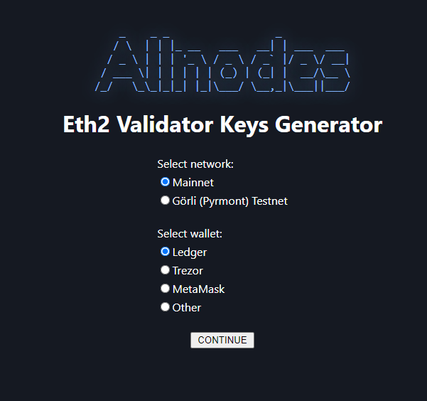
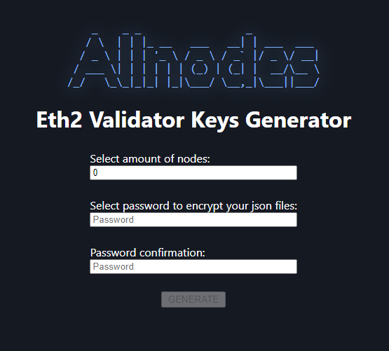
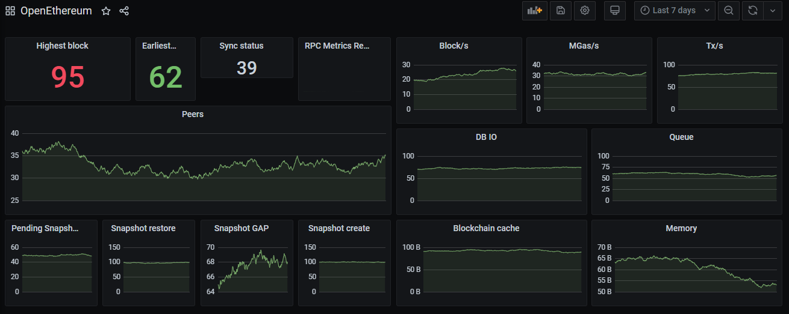

# Guide | (Legacy) How to setup a validator on ETH2 testnet


As of August 28 2021, **testnet PYRMONT is no longer supported.**

**This guide is for historical references only.**



If you would like to test, practice on [**testnet GOERLI**](https://www.coincashew.com/coins/overview-eth/guide-or-how-to-setup-a-validator-on-eth2-testnet-prater)**.**




:fast\_forward: **** [**Mainnet guide**](https://www.coincashew.com/coins/overview-eth/guide-or-how-to-setup-a-validator-on-eth2-mainnet)**. Always test and practice on testnet first.**


## :checkered\_flag: 0. Prerequisites

### :woman\_technologist:Skills for operating a eth2 validator and beacon node

As a validator for eth2, you will typically have the following abilities:

* operational knowledge of how to set up, run and maintain a eth2 beacon node and validator continuously
* a long term commitment to maintain your validator 24/7/365
* basic operating system skills

### :man\_technologist: Experience required to be a successful validator

* have learned the essentials by watching ['Intro to Eth2 & Staking for Beginners' by Superphiz](https://www.youtube.com/watch?v=tpkpW031RCI)
* have passed or is actively enrolled in the [Eth2 Study Master course](https://ethereumstudymaster.com/)
* and have read the [8 Things Every Eth2 validator should know.](https://medium.com/chainsafe-systems/8-things-every-eth2-validator-should-know-before-staking-94df41701487)

### :reminder\_ribbon: **Minimum Setup Requirements**

* **Operating system:** 64-bit Linux (i.e. Ubuntu 20.04 LTS Server or Desktop)
* **Processor:** Dual core CPU, Intel Core i5–760 or AMD FX-8100 or better
* **Memory:** 8GB RAM
* **Storage:** 128GB SSD
* **Internet:** Broadband internet connection with speeds at least 1 Mbps.
* **Power:** Reliable electrical power.
* **ETH balance:** at least 32 goerli ETH and some ETH for deposit transaction fees
* **Wallet**: Metamask installed

### :man\_lifting\_weights: Recommended Hardware Setup

* **Operating system:** 64-bit Linux (i.e. Ubuntu 20.04 LTS Server or Desktop)
* **Processor:** Quad core CPU, Intel Core i7–4770 or AMD FX-8310 or better
* **Memory:** 16GB RAM or more
* **Storage:** 2TB SSD or more
* **Internet:** Broadband internet connections with speeds at least 10 Mbps without data limit.
* **Power:** Reliable electrical power with uninterruptible power supply (UPS)
* **ETH balance:** at least 32 goerli ETH and some ETH for deposit transaction fees
* **Wallet**: Metamask installed


:bulb: For examples of actual staking hardware builds, check out [RocketPool's hardware guide](https://github.com/rocket-pool/docs.rocketpool.net/blob/main/src/guides/node/local/hardware.md).



:sparkles: **Pro Validator Tip**: Highly recommend you begin with a brand new instance of an OS, VM, and/or machine. Avoid headaches by NOT reusing testnet keys, wallets, or databases for your validator.


### :unlock: Recommended eth2 validator Security Best Practices

If you need ideas or a reminder on how to secure your validator, refer to


[broken-reference](broken-reference/)


### :tools: Setup Ubuntu

If you need to install Ubuntu Server, refer to



or Ubuntu Desktop,


[install-ubuntu.md](../overview-xtz/guide-how-to-setup-a-baker/install-ubuntu.md)


### :performing\_arts: Setup Metamask

If you need to install Metamask, refer to


[metamask-ethereum.md](../../wallets/browser-wallets/metamask-ethereum.md)


### :jigsaw: High Level Validator Node Overview


At the end of this guide, you will build a machine that hosts three main components: a validator client, a beacon chain client and an eth1 node.

**Validator client** - Responsible for producing new blocks and attestations in the beacon chain and shard chains.

**Beacon chain client** - Responsible for managing the state of the beacon chain, validator shuffling, and more.

**Eth1 node** - Supplies incoming validator deposits from the eth1 mainnet chain to the beacon chain client.

Note: Teku and Nimbus combines both clients into one process.



## :seedling: 1. Obtain testnet ETH


Every 32 ETH you own allows you to make 1 validator. You can run thousands of validators with your beacon node. However on testnet, please only run 1 or 2 validators to keep the activation queue reasonably quick.


Join the [ethstaker Discord](https://discord.io/ethstaker) and send a request for ETH in the **`-request-goerli-eth channel`**

```
!send <your metamask goerli network ETH address>
```

Otherwise, visit the :potable\_water:[Goerli Authenticated Faucet](https://faucet.goerli.mudit.blog/).

## :woman\_technologist: 2. Signup to be a validator at the Launchpad

1. Install dependencies, the ethereum foundation deposit tool and generate your two sets of key pairs.


Each validator will have two sets of key pairs. A **signing key** and a **withdrawal key.** These keys are derived from a single mnemonic phrase. [Learn more about keys.](https://blog.ethereum.org/2020/05/21/keys/)


You have the choice of downloading the pre-built [ethereum foundation deposit tool](https://github.com/ethereum/eth2.0-deposit-cli) or building it from source. Alternatively, if you have a **Ledger Nano X/S or Trezor Model T**, you're able to generate deposit files with keys managed by a hardware wallet.

### How to generate validator keys with Ledger Nano X/S and Trezor Model T


[Allnodes ](https://help.allnodes.com/en/articles/4664440-how-to-setup-ethereum-2-0-validator-node-on-allnodes)has created an easy to use tool to connect a Ledger Nano X/S and Trezor Model T and generate the deposit json files such that the withdrawal credentials remain secured by the hardware wallet. This tool can be used by any validator or staker.


1. Connect your hardware wallet to your PC/laptop
2. If using a Ledger Nano X/S, open the "ETHEREUM" ledger app (if missing, install from Ledger Live)
3. Visit [AllNode's Deposit Generator Tool.](https://wallet.allnodes.com/eth2/generate)
4. Select network > Gorli (Pyrmont) Testnet
5. Select your wallet > then CONTINUE



6\. From the dropdown, select your eth address with at least 32 ETH to fund your validators

7\. On your hardware wallet, sign the ETH signature message to login to allnodes.com

8\. Again on your hardware wallet, sign another message to verify your eth2 withdrawal credentials


Double check that your generated deposit data file contains the same string as in withdrawal credentials and that this string includes your Ethereum address (starting after 0x)




9\. Enter the amount of nodes (or validators you want)

10\. Finally, enter a **KEYSTORE password** to encrypt the deposit json files. Keep this password safe and **offline**.

11\. Confirm password and click **GENERATE**

Install dependencies.

```
sudo apt update
sudo apt install python3-pip git -y
```

Download source code and install.

```
cd $HOME
git clone https://github.com/ethereum/eth2.0-deposit-cli.git eth2deposit-cli
cd eth2deposit-cli
sudo ./deposit.sh install
```

Make a new mnemonic.

```
./deposit.sh new-mnemonic --chain pyrmont
```


**Advanced option**: Custom eth1 withdrawal address, often used for 3rd party staking.

```bash
# Add the following
--eth1_withdrawal_address <eth1 address hex string>
# Example
./deposit.sh new-mnemonic --chain pyrmont --eth1_withdrawal_address 0x1...x
```

If this field is set and valid, the given Eth1 address will be used to create the withdrawal credentials. Otherwise, it will generate withdrawal credentials with the mnemonic-derived withdrawal public key in [EIP-2334 format](https://eips.ethereum.org/EIPS/eip-2334#eth2-specific-parameters).


Download eth2deposit-cli.

```bash
cd $HOME
wget https://github.com/ethereum/eth2.0-deposit-cli/releases/download/v1.2.0/eth2deposit-cli-256ea21-linux-amd64.tar.gz
```

Verify the SHA256 Checksum matches the checksum on the [releases page](https://github.com/ethereum/eth2.0-deposit-cli/releases/tag/v1.0.0).

```bash
echo "825035b6d6c06c0c85a38f78e8bf3e9df93dfd16bf7b72753b6888ae8c4cb30a *eth2deposit-cli-ed5a6d3-linux-amd64.tar.gz" | shasum -a 256 --check
```

Example valid output:

> eth2deposit-cli-256ea21-linux-amd64.tar.gz: OK


Only proceed if the sha256 check passes with **OK**!


Extract the archive.

```
tar -xvf eth2deposit-cli-256ea21-linux-amd64.tar.gz
mv eth2deposit-cli-256ea21-linux-amd64 eth2deposit-cli
rm eth2deposit-cli-256ea21-linux-amd64.tar.gz
cd eth2deposit-cli
```

Make a new mnemonic.

```
./deposit new-mnemonic --chain pyrmont
```


**Advanced option**: Custom eth1 withdrawal address, often used for 3rd party staking.

```bash
# Add the following
--eth1_withdrawal_address <eth1 address hex string>
# Example
./deposit.sh new-mnemonic --chain pyrmont --eth1_withdrawal_address 0x1...x
```

If this field is set and valid, the given Eth1 address will be used to create the withdrawal credentials. Otherwise, it will generate withdrawal credentials with the mnemonic-derived withdrawal public key in [EIP-2334 format](https://eips.ethereum.org/EIPS/eip-2334#eth2-specific-parameters).



:fire:**\[ Optional ] Pro Security Tip**: Run the **eth2deposit-cli tool** and generate your **mnemonic seed** for your validator keys on an **air-gapped offline machine booted from usb**.


You will learn how to boot up a windows PC into an airgapped [Tails operating system](https://tails.boum.org/index.en.html).

The Tails OS is an _amnesic_ operating system, meaning it will save nothing and _leave no tracks behind_ each time you boot it.

## Part 0 - Prerequisites

You need:

* 2 storage mediums (can be USB stick, SD cards or external hard drives)
* One of them must be > 8GB
* Windows or Mac computer
* 30 minutes or longer depending on your download speed

## Part 1 - Download Tails OS

Download the official image from the [Tails website](https://tails.boum.org/install/index.en.html). Might take a while, go grab a coffee.

Make sure you follow the guide on the Tails website to verify your download of Tails.

## Part 2 - Download and install the software to transfer your Tails image on your USB stick

For Windows, use one of

* [Etcher](https://tails.boum.org/etcher/Etcher-Portable.exe)
* [Win32 Disk Imager](https://win32diskimager.org/#download)
* [Rufus](https://rufus.ie/en\_US/)

For Mac, download [Etcher](https://tails.boum.org/etcher/Etcher.dmg)

## Part 3 - Making your bootable USB stick

Run the above software. This is an example how it looks like on Mac OS with etcher, but other software should be similar.


Select the Tails OS image that you downloaded as the image. Then select the USB stick (the larger one).

Then flash the image to the larger USB stick.

## Part 4 - Download and verify the eth2-deposit-cli

You can refer to the other tab on this guide on how to download and verify the eth2-deposit-cli.

Copy the file to the other USB stick.

## Part 5 - Reboot your computer and into Tails OS

After you have done all the above, you can reboot. If you are connected by a LAN cable to the internet, you can disconnect it manually.

Plug in the USB stick that has your Tails OS.

On Mac, press and hold the Option key immediately upon hearing the startup chime. Release the key after Startup Manager appears.

On Windows, it depends on your computer manufacturer. Usually it is by pressing F1 or F12. If it doesn't work, try googling "Enter boot options menu on \[Insert your PC brand]"

Choose the USB stick that you loaded up with Tails OS to boot into Tails.

## Part 6 - Welcome to Tails OS


You can boot with all the default settings.

## Part 7 - Run the eth2-deposit-cli

Plug in your other USB stick with the `eth2-deposit-cli` file.

You can then open your command line and navigate into the directory containing the file. Then you can continue the guide from the other tab.

Make a new mnemonic.

```
./deposit.sh new-mnemonic --chain pyrmont
```

If you ran this command directly from your non-Tails USB stick, the validator keys should stay on it. If it hasn't, copy the directory over to your non-Tails USB stick.


\*\*\*\*:fire: **Make sure you have saved your validator keys directory in your other USB stick (non Tails OS) before you shutdown Tails. Tails will delete everything saved on it after you shutdown.**.



:tada: Congrats on learning how to use Tails OS to make an air gapped system. As a bonus, you can reboot into Tails OS again and connect to internet to surf the dark web or clear net safely!


Alternatively, follow this [ethstaker.cc](https://ethstaker.cc/) exclusive for the low down on making a bootable usb.

### Part 1 - Create a Ubuntu 20.04 USB Bootable Drive



2\. If using **eth2deposit-cli**, follow the prompts and pick a **KEYSTORE password**. This password encrypts your keystore files. Write down your mnemonic and keep this safe and **offline**.


\*\*\*\*:construction: **Do not send real mainnet ETH during this process!** :octagonal\_sign: Use only goerli ETH.

You should have both your Eth1 node and Beacon Chain node synced before your validator becomes active. If they are not, you may incur penalties until they are synced. You may want to complete steps 3 and 4 BEFORE initiating your deposit to avoid these penalties.


3\. Follow the steps at https://pyrmont.launchpad.ethereum.org while skipping over the steps you already just completed. Study the eth2 phase 0 overview material. Understanding eth2 is the key to success!


\*\*\*\*:whale: **Batch Depositing Tip**: If you have many deposits to make for many validators, consider using [Abyss.finance's eth2depositor tool.](https://abyss.finance/eth2depositor) This greatly improves the deposit experience as multiple deposits can be batched into one transaction, thereby saving gas fees and saving your fingers by minimizing Metamask clicking.

Make sure to switch to **GÖRLI** network.

Source: [https://twitter.com/AbyssFinance/status/1379732382044069888](https://twitter.com/AbyssFinance/status/1379732382044069888)


4\. Back on the launchpad website, upload your`deposit_data-#########.json` found in the `validator_keys` directory.

5\. Connect to the launchpad with your Metamask wallet, review and accept terms.

6\. Confirm the transaction(s). There's one deposit transaction of 32 ETH for each validator.


Your transaction is sending and depositing your ETH to the pyrmont ETH2 deposit contract address.

**Check**, _double-check_, _**triple-check**_ that the pyrmont Eth2 deposit contract address is correct.

[0x8c5fecdC472E27Bc447696F431E425D02dd46a8c](https://goerli.etherscan.io/address/0x8c5fecdc472e27bc447696f431e425d02dd46a8c)



\*\*\*\*:fire: **Critical Crypto Reminder:** **Keep your mnemonic, keep your ETH.** :rocket:

* Write down your mnemonic seed **offline**. _Not email. Not cloud._
* Multiple copies are better. _Best stored in a_ [_metal seed._](https://jlopp.github.io/metal-bitcoin-storage-reviews/)
* The withdrawal keys will be generated from this mnemonic in the future.
* Make **offline backups**, such as to a USB key, of your **`validator_keys`** directory.


## :flying\_saucer: 3. Install a ETH1 node


Ethereum 2.0 requires a connection to Ethereum 1.0 in order to monitor for 32 ETH validator deposits. Hosting your own Ethereum 1.0 node is the best way to maximize decentralization and minimize dependency on third parties such as Infura.



The subsequent steps assume you have completed the [best practices security guide.](broken-reference/)

:octagonal\_sign: Do not run your processes as **ROOT** user. :scream:


Your choice of either [**OpenEthereum**](https://www.parity.io/ethereum/)**,** [**Geth**](https://geth.ethereum.org/)**,** [**Besu**](https://besu.hyperledger.org/)**,** [**Nethermind**](https://www.nethermind.io/) **or** [**Infura**](https://infura.io/)**.**




**Geth** - Go Ethereum is one of the three original implementations (along with C++ and Python) of the Ethereum protocol. It is written in **Go**, fully open source and licensed under the GNU LGPL v3.


:dna: **Install from the repository**

```
sudo add-apt-repository -y ppa:ethereum/ethereum
sudo apt-get update -y
sudo apt-get install ethereum -y
```

:gear: **Setup and configure systemd**

Run the following to create a **unit file** to define your `eth1.service` configuration.

Simply copy/paste the following.

```bash
cat > $HOME/eth1.service << EOF 
[Unit]
Description     = geth eth1 service
Wants           = network-online.target
After           = network-online.target 

[Service]
User            = $(whoami)
ExecStart       = /usr/bin/geth --http --goerli --metrics --pprof
Restart         = on-failure
RestartSec      = 3
TimeoutSec      = 300

[Install]
WantedBy    = multi-user.target
EOF
```


**Nimbus Specific Configuration**: Add the following flag to the **ExecStart** line.

```bash
--ws
```


Move the unit file to `/etc/systemd/system` and give it permissions.

```bash
sudo mv $HOME/eth1.service /etc/systemd/system/eth1.service
```

```bash
sudo chmod 644 /etc/systemd/system/eth1.service
```

Run the following to enable auto-start at boot time.

```
sudo systemctl daemon-reload
sudo systemctl enable eth1
```

:chains: **Start geth**

```
sudo systemctl start eth1
```




**Hyperledger Besu** is an open-source Ethereum client designed for demanding enterprise applications requiring secure, high-performance transaction processing in a private network. It's developed under the Apache 2.0 license and written in **Java**.


:dna: **Install java dependency**

```
sudo apt-get update
sudo apt install openjdk-18-jdk -y
```

:last\_quarter\_moon\_with\_face: **Download and unzip Besu**

Review the latest release at [https://github.com/hyperledger/besu/releases](https://github.com/hyperledger/besu/releases)

File can be downloaded from [https://dl.bintray.com/hyperledger-org/besu-repo](https://dl.bintray.com/hyperledger-org/besu-repo)

```
cd
wget -O besu.tar.gz https://dl.bintray.com/hyperledger-org/besu-repo/besu-20.10.1.tar.gz
tar -xvf besu.tar.gz
rm besu.tar.gz
mv besu* besu
```

:gear: **Setup and configure systemd**

Run the following to create a **unit file** to define your `eth1.service` configuration.

Simply copy/paste the following.

```bash
cat > $HOME/eth1.service << EOF 
[Unit]
Description     = besu eth1 service
Wants           = network-online.target
After           = network-online.target 

[Service]
User            = $(whoami)
ExecStart       = $(echo $HOME)/besu/bin/besu --metrics-enabled --rpc-http-enabled --network=goerli --data-path="$HOME/.besu_goerli"
Restart         = on-failure
RestartSec      = 3

[Install]
WantedBy    = multi-user.target
EOF
```

Move the unit file to `/etc/systemd/system` and give it permissions.

```bash
sudo mv $HOME/eth1.service /etc/systemd/system/eth1.service
```

```bash
sudo chmod 644 /etc/systemd/system/eth1.service
```

Run the following to enable auto-start at boot time.

```
sudo systemctl daemon-reload
sudo systemctl enable eth1
```

:chains: **Start besu**

```
sudo systemctl start eth1
```




**Nethermind** is a flagship Ethereum client all about performance and flexibility. Built on **.NET** core, a widespread, enterprise-friendly platform, Nethermind makes integration with existing infrastructures simple, without losing sight of stability, reliability, data integrity, and security.


:gear: **Install dependencies**

```
sudo apt-get update
sudo apt-get install curl libsnappy-dev libc6-dev jq libc6 unzip -y
```

:last\_quarter\_moon\_with\_face: **Download and unzip Nethermind**

Review the latest release at [https://github.com/NethermindEth/nethermind/releases](https://github.com/NethermindEth/nethermind/releases)

Automatically download the latest linux release, un-zip and cleanup.

```bash
mkdir $HOME/nethermind
chmod 775 $HOME/nethermind
cd $HOME/nethermind
curl -s https://api.github.com/repos/NethermindEth/nethermind/releases/latest | jq -r ".assets[] | select(.name) | .browser_download_url" | grep linux  | xargs wget -q --show-progress
unzip -o nethermind*.zip
rm nethermind*linux*.zip
```

:gear: **Setup and configure systemd**

Run the following to create a **unit file** to define your `eth1.service` configuration.

Simply copy/paste the following.

```bash
cat > $HOME/eth1.service << EOF 
[Unit]
Description     = nethermind eth1 service
Wants           = network-online.target
After           = network-online.target 

[Service]
User            = $(whoami)
ExecStart       = $(echo $HOME)/nethermind/Nethermind.Runner --config goerli --baseDbPath $HOME/.nethermind_goerli --Metrics.Enabled true --JsonRpc.Enabled true --Sync.DownloadBodiesInFastSync true --Sync.DownloadReceiptsInFastSync true --Sync.AncientBodiesBarrier 11052984 --Sync.AncientReceiptsBarrier 11052984
Restart         = on-failure
RestartSec      = 3

[Install]
WantedBy    = multi-user.target
EOF
```

Move the unit file to `/etc/systemd/system` and give it permissions.

```bash
sudo mv $HOME/eth1.service /etc/systemd/system/eth1.service
```

```bash
sudo chmod 644 /etc/systemd/system/eth1.service
```

Run the following to enable auto-start at boot time.

```
sudo systemctl daemon-reload
sudo systemctl enable eth1
```

:chains: **Start Nethermind**

```
sudo systemctl start eth1
```


**Note about Metric Error messages**: You will see these until prometheus pushergateway is setup in section 6. `Error in MetricPusher: System.Net.Http.HttpRequestException: Connection refused`





OpenEthereum will no longer be supported post London hard fork. Gnosis, maintainers of OpenEthereum, suggest users migrate to their new **Erigon** Ethererum client.



**OpenEthereum** - It's \*\*\*\* goal is to be the fastest, lightest, and most secure Ethereum client using the **Rust programming language**. OpenEthereum is licensed under the GPLv3 and can be used for all your Ethereum needs.


:gear: **Install dependencies**

```
sudo apt-get update
sudo apt-get install curl jq unzip -y
```

:robot: **Install OpenEthereum**

Review the latest release at [https://github.com/openethereum/openethereum/releases](https://github.com/openethereum/openethereum/releases)

Automatically download the latest linux release, un-zip, add execute permissions and cleanup.

```bash
mkdir $HOME/openethereum
cd $HOME/openethereum
curl -s https://api.github.com/repos/openethereum/openethereum/releases/latest | jq -r ".assets[] | select(.name) | .browser_download_url" | grep linux | xargs wget -q --show-progress
unzip -o openethereum*.zip
chmod +x openethereum
rm openethereum*.zip
```

​ :gear: **Setup and configure systemd**

Run the following to create a **unit file** to define your `eth1.service` configuration.

Simply copy/paste the following.

```bash
cat > $HOME/eth1.service << EOF 
[Unit]
Description     = openethereum eth1 service
Wants           = network-online.target
After           = network-online.target 

[Service]
User            = $(whoami)
ExecStart       = $(echo $HOME)/openethereum/openethereum --chain goerli --metrics --metrics-port=6060
Restart         = on-failure
RestartSec      = 3

[Install]
WantedBy    = multi-user.target
EOF
```


**Nimbus Specific Configuration**: Add the following flag to the **ExecStart** line.

```bash
--ws-origins=all
```


Move the unit file to `/etc/systemd/system` and give it permissions.

```bash
sudo mv $HOME/eth1.service /etc/systemd/system/eth1.service
```

```bash
sudo chmod 644 /etc/systemd/system/eth1.service
```

Run the following to enable auto-start at boot time.

```
sudo systemctl daemon-reload
sudo systemctl enable eth1
```

:chains: **Start OpenEthereum**

```
sudo systemctl start eth1
```




Infura is suitable for limited disk space setups. Always run your own full eth1 node when possible.


Sign up for an API access key at [https://infura.io/](https://infura.io/)

1. Sign up for a free account.
2. Confirm your email address.
3. Visit your dashboard [https://infura.io/dashboard](https://infura.io/dashboard)
4. Create a project, give it a name.
5. Select **Goerli** as the ENDPOINT
6. Follow the specific configuration for your eth2 client found below.


Alternatively use a free testnet Ethereum node such as [Chainstack ](https://chainstack.com)at [https://ethereumnodes.com/](https://ethereumnodes.com/)


### Nimbus Specific Configuration

1. When creating your systemd's **unit file**, update the `--web-url` parameter with this endpoint.
2. Copy the websocket endpoint. Starts with `wss://`
3. Save this for step 4, configuring your eth2 node.

```bash
#example
--web3-url=<your wss:// infura endpoint>
```

### Teku Specific Configuration

1. After creating the `teku.yaml` located in `/etc/teku/teku.yaml`, update the `--eth1-endpoint` parameter with this endpoint.
2. Copy the http endpoint. Starts with `http://`
3. Save this for step 4, configuring your eth2 node.

```bash
#example
eth1-endpoint: <your https:// infura endpoint>
```

### Lighthouse Specific Configuration

1. When creating your **beacon chain systemd** **unit file**, add the `--eth1-endpoint` parameter with this endpoint.
2. Copy the **https** endpoint. Starts with `https://`
3. Save this for step 4, configuring your eth2 node.

```bash
#example
--eth1-endpoint=<your https:// infura endpoint>
```

### Prysm Specific Configuration

1. When creating your **beacon chain systemd unit file**, update the `--http-web3provider` parameter with this endpoint.
2. Copy the **https** endpoint. Starts with `https://`
3. Save this for step 4, configuring your eth2 node.

```bash
#example
--http-web3provider=<your https:// infura endpoint>
```




Syncing an eth1 node can take up to 1 week. On high-end machines with gigabit internet, expect syncing to take less than a day.



Your eth1 node is fully sync'd when these events occur.

* **`OpenEthereum:`** `Imported #<block number>`
* **`Geth:`** `Imported new chain segment`
* **`Besu:`** `Imported #<block number>`
* **`Nethermind:`** `No longer syncing Old Headers`


#### :tools: Helpful eth1.service commands

​​ :notepad\_spiral: **To view and follow eth1 logs**

```
journalctl -u eth1 -f
```

:notepad\_spiral: **To stop eth1 service**

```
sudo systemctl stop eth1
```

## :last\_quarter\_moon\_with\_face: 4. Configure a ETH2 beacon chain node and validator

Your choice of Lighthouse, Nimbus, Teku, Prysm, or Lodestar.




[Lighthouse](https://github.com/sigp/lighthouse) is an Eth2.0 client with a heavy focus on speed and security. The team behind it, [Sigma Prime](https://sigmaprime.io/), is an information security and software engineering firm who have funded Lighthouse along with the Ethereum Foundation, Consensys, and private individuals. Lighthouse is built in Rust and offered under an Apache 2.0 License.


### :gear: 4.1. Install rust dependency

```bash
curl --proto '=https' --tlsv1.2 -sSf https://sh.rustup.rs | sh
```

Enter '1' to proceed with the default install.

Update your environment variables.

```bash
echo export PATH="$HOME/.cargo/bin:$PATH" >> ~/.bashrc
source ~/.bashrc
```

Install rust dependencies.

```
sudo apt install -y git gcc g++ make cmake pkg-config libssl-dev
```

### :bulb: 4.2. Build Lighthouse from source

```bash
mkdir ~/git
cd ~/git
git clone https://github.com/sigp/lighthouse.git
cd lighthouse
git fetch --all && git checkout stable && git pull
make
```


In case of compilation errors, run the following sequence.

```
rustup update
cargo clean
make
```



This build process may take a few minutes.


Verify lighthouse was installed properly by checking the version number.

```
lighthouse --version
```

### :tophat: 4.3. Import validator key


When you import your keys into Lighthouse, your validator signing key(s) are stored in the `$HOME/.lighthouse/pyrmont/validators` folder.


Run the following command to import your validator keys from the eth2deposit-cli tool directory.

Enter your **keystore password** to import accounts.

```bash
lighthouse account validator import --network pyrmont --directory=$HOME/eth2deposit-cli/validator_keys
```

Verify the accounts were imported successfully.

```bash
lighthouse account_manager validator list --network pyrmont
```


**WARNING**: DO NOT USE THE ORIGINAL KEYSTORES TO VALIDATE WITH ANOTHER CLIENT, OR YOU WILL GET SLASHED.


### :fire: 4.4. Configure port forwarding and/or firewall

Specific to your networking setup or cloud provider settings, [ensure your validator's firewall ports are open and reachable.](broken-reference/)

* **Lighthouse beacon chain** requires port 9000 for tcp and udp
* **eth1** node requires port 30303 for tcp and udp


:sparkles: **Port Forwarding Tip:** You'll need to forward and open ports to your validator. Verify it's working with [https://www.yougetsignal.com/tools/open-ports/](https://www.yougetsignal.com/tools/open-ports/) or [https://canyouseeme.org/](https://canyouseeme.org/) .


### :chains: 4.5. Start the beacon chain

:cake: **Benefits of using systemd for your beacon chain**

1. Auto-start your beacon chain when the computer reboots due to maintenance, power outage, etc.
2. Automatically restart crashed beacon chain processes.
3. Maximize your beacon chain up-time and performance.

:tools: **Setup Instructions**

Run the following to create a **unit file** to define your`beacon-chain.service` configuration.

```bash
cat > $HOME/beacon-chain.service << EOF 
# The eth2 beacon chain service (part of systemd)
# file: /etc/systemd/system/beacon-chain.service 

[Unit]
Description     = eth2 beacon chain service
Wants           = network-online.target
After           = network-online.target 

[Service]
User            = $(whoami)
ExecStart       = $(which lighthouse) bn --staking --validator-monitor-auto --metrics --network pyrmont
Restart         = on-failure

[Install]
WantedBy    = multi-user.target
EOF
```


\*\*\*\*:fire: **Lighthouse Pro Tip:** On the **ExecStart** line, adding the `--eth1-endpoints` flag allows for redundant eth1 nodes. Separate with comma. Make sure the endpoint does not end with a trailing slash or`/` Remove it.

```bash
# Example:
--eth1-endpoints http://localhost:8545,https://nodes.mewapi.io/rpc/eth,https://mainnet.eth.cloud.ava.do,https://mainnet.infura.io/v3/xxx
```

:money\_with\_wings: Find free ethereum fallback nodes at [https://ethereumnodes.com/](https://ethereumnodes.com/)


Move the unit file to `/etc/systemd/system`

```bash
sudo mv $HOME/beacon-chain.service /etc/systemd/system/beacon-chain.service
```

Give it permissions.

```bash
sudo chmod 644 /etc/systemd/system/beacon-chain.service
```

Run the following to enable auto-start at boot time and then start your beacon node service.

```
sudo systemctl daemon-reload
sudo systemctl enable beacon-chain
sudo systemctl start beacon-chain
```


Nice work. Your beacon chain is now managed by the reliability and robustness of systemd. Below are some commands for using systemd.


#### :tools: Some helpful systemd commands

:white\_check\_mark: **Check whether the beacon chain is active**

```
sudo systemctl is-active beacon-chain
```

:mag\_right: **View the status of the beacon chain**

```
sudo systemctl status beacon-chain
```

:arrows\_counterclockwise: **Restarting the beacon chain**

```
sudo systemctl reload-or-restart beacon-chain
```

:octagonal\_sign: **Stopping the beacon chain**

```
sudo systemctl stop beacon-chain
```

**🗄 Viewing and filtering logs**

```bash
#view and follow the log
journalctl --unit=beacon-chain -f
#view log since yesterday
journalctl --unit=beacon-chain --since=yesterday
#view log since today
journalctl --unit=beacon-chain --since=today
#view log between a date
journalctl --unit=beacon-chain --since='2020-12-01 00:00:00' --until='2020-12-02 12:00:00'
```


The `--metrics` flag enables reporting on port 5054 and will be monitored with Prometheus.


### :dna: 4.6. Start the validator

Running the validator automatically with systemd.

:cake: **Benefits of using systemd for your validator**

1. Auto-start your validator when the computer reboots due to maintenance, power outage, etc.
2. Automatically restart crashed validator processes.
3. Maximize your validator up-time and performance.

:tools: **Setup Instructions**

Run the following to create a **unit file** to define your`validator.service` configuration.

```bash
cat > $HOME/validator.service << EOF 
# The eth2 validator service (part of systemd)
# file: /etc/systemd/system/validator.service 

[Unit]
Description     = eth2 validator service
Wants           = network-online.target beacon-chain.service
After           = network-online.target 

[Service]
User            = $(whoami)
ExecStart       = $(which lighthouse) vc --network pyrmont --metrics
Restart         = on-failure

[Install]
WantedBy    = multi-user.target
EOF
```

Move the unit file to `/etc/systemd/system` and give it permissions.

```bash
sudo mv $HOME/validator.service /etc/systemd/system/validator.service
sudo chmod 644 /etc/systemd/system/validator.service
```

Run the following to enable auto-start at boot time and then start your validator.

```
sudo systemctl daemon-reload
sudo systemctl enable validator
sudo systemctl start validator
```


Nice work. Your validator is now managed by the reliability and robustness of systemd. Below are some commands for using systemd.


#### 🛠 Some helpful systemd commands

**✅ Check whether the validator is active**

```
sudo systemctl is-active validator
```

**🔎 View the status of the validator**

```
sudo systemctl status validator
```

**🔄 Restarting the validator**

```
sudo systemctl reload-or-restart validator
```

**🛑 Stopping the validator**

```
sudo systemctl stop validator
```

**🗄 Viewing and filtering logs**

```bash
#view and follow the log
journalctl --unit=validator -f
#view log since yesterday
journalctl --unit=validator --since=yesterday
#view log since today
journalctl --unit=validator --since=today
#view log between a date
journalctl --unit=validator --since='2020-12-01 00:00:00' --until='2020-12-02 12:00:00'
```




[Nimbus](https://our.status.im/tag/nimbus/) is a research project and a client implementation for Ethereum 2.0 designed to perform well on embedded systems and personal mobile devices, including older smartphones with resource-restricted hardware. The Nimbus team are from [Status](https://status.im/about/) the company best known for [their messaging app/wallet/Web3 browser](https://status.im/) by the same name. Nimbus (Apache 2) is written in Nim, a language with Python-like syntax that compiles to C.


### :gear: 4.1. Build Nimbus from source

Install dependencies.

```
sudo apt-get update
sudo apt-get install curl build-essential git -y
```

Install and build Nimbus.

```bash
mkdir ~/git 
cd ~/git
git clone https://github.com/status-im/nimbus-eth2
cd nimbus-eth2
make NIMFLAGS="-d:insecure" nimbus_beacon_node
```


The build process may take a few minutes.


Verify Nimbus was installed properly by displaying the help.

```bash
cd $HOME/git/nimbus-eth2/build
./nimbus_beacon_node --help
```

Copy the binary file to `/usr/bin`

```bash
sudo cp $HOME/git/nimbus-eth2/build/nimbus_beacon_node /usr/bin
```

### :tophat: 4.2. Import validator key <a href="#6-import-validator-key" id="6-import-validator-key"></a>

Create a directory structure to store nimbus data.

```bash
sudo mkdir -p /var/lib/nimbus
```

Take ownership of this directory and set the correct permission level.

```bash
sudo chown $(whoami):$(whoami) /var/lib/nimbus
sudo chmod 700 /var/lib/nimbus
```

The following command will import your validator keys.

Enter your **keystore password** to import accounts.

```bash
cd $HOME/git/nimbus-eth2
build/nimbus_beacon_node deposits import --data-dir=/var/lib/nimbus $HOME/eth2deposit-cli/validator_keys
```

Now you can verify the accounts were imported successfully by doing a directory listing.

```bash
ll /var/lib/nimbus/validators
```

You should see a folder named for each of your validator's pubkey.


When you import your keys into Nimbus, your validator signing key(s) are stored in the `/var/lib/nimbus` folder, under `secrets` and `validators.`

The `secrets` folder contains the common secret that gives you access to all your validator keys.

The `validators` folder contains your signing keystore(s) (encrypted keys). Keystores are used by validators as a method for exchanging keys.

For more on keys and keystores, see [here](https://blog.ethereum.org/2020/05/21/keys/).



**WARNING**: DO NOT USE THE ORIGINAL KEYSTORES TO VALIDATE WITH ANOTHER CLIENT, OR YOU WILL GET SLASHED.


### :fire: 4.3. Configure port forwarding and/or firewall

Specific to your networking setup or cloud provider settings, [ensure your validator's firewall ports are open and reachable.](broken-reference/)

* **Nimbus beacon chain node** will use port 9000 for tcp and udp
* **eth1** node requires port 30303 for tcp and udp


:sparkles: **Port Forwarding Tip:** You'll need to forward and open ports to your validator. Verify it's working with [https://www.yougetsignal.com/tools/open-ports/](https://www.yougetsignal.com/tools/open-ports/) or [https://canyouseeme.org/](https://canyouseeme.org/) .


### :snowboarder: 4.4. Start the beacon chain and validator


Nimbus combines both the beacon chain and validator into one process.


Running the beacon chain and validator automatically with systemd.

**🍰 Benefits of using systemd for your beacon chain and validator**

1. Auto-start your beacon chain when the computer reboots due to maintenance, power outage, etc.
2. Automatically restart crashed beacon chain processes.
3. Maximize your beacon chain up-time and performance.

**🛠 Setup Instructions**

Run the following to create a **unit file** to define your`beacon-chain.service` configuration.

```bash
cat > $HOME/beacon-chain.service << EOF 
# The eth2 beacon chain service (part of systemd)
# file: /etc/systemd/system/beacon-chain.service 

[Unit]
Description     = eth2 beacon chain service
Wants           = network-online.target
After           = network-online.target 

[Service]
Type            = simple
User            = $(whoami)
WorkingDirectory= /var/lib/nimbus
ExecStart       = /usr/bin/nimbus_beacon_node --network=pyrmont --data-dir=/var/lib/nimbus --web3-url=ws://127.0.0.1:8546 --metrics --metrics-port=8008 --rpc --rpc-port=9091 --validators-dir=/var/lib/nimbus/validators --secrets-dir=/var/lib/nimbus/secrets --log-file=/var/lib/nimbus/beacon.log
Restart         = on-failure

[Install]
WantedBy    = multi-user.target
EOF
```


Nimbus only supports websocket connections ("ws://" and "wss://") for the ETH1 node. Geth, OpenEthereum and Infura ETH1 nodes are verified compatible.


Move the unit file to `/etc/systemd/system`

```bash
sudo mv $HOME/beacon-chain.service /etc/systemd/system/beacon-chain.service
```

Update file permissions.

```bash
sudo chmod 644 /etc/systemd/system/beacon-chain.service
```

Run the following to enable auto-start at boot time and then start your beacon node service.

```
sudo systemctl daemon-reload
sudo systemctl enable beacon-chain
sudo systemctl start beacon-chain
```


Nice work. Your beacon chain is now managed by the reliability and robustness of systemd. Below are some commands for using systemd.


#### :tools: Some helpful systemd commands

:white\_check\_mark: **Check whether the beacon chain is active**

```
sudo systemctl is-active beacon-chain
```

:mag\_right: **View the status of the beacon chain**

```
sudo systemctl status beacon-chain
```

:arrows\_counterclockwise: **Restarting the beacon chain**

```
sudo systemctl reload-or-restart beacon-chain
```

:octagonal\_sign: **Stopping the beacon chain**

```
sudo systemctl stop beacon-chain
```

**🗄 Viewing and filtering logs**

```bash
#view and follow the log
journalctl --unit=beacon-chain -f
#view log since yesterday
journalctl --unit=beacon-chain --since=yesterday
#view log since today
journalctl --unit=beacon-chain --since=today
#view log between a date
journalctl --unit=beacon-chain --since='2020-12-01 00:00:00' --until='2020-12-02 12:00:00'
```




[PegaSys Teku](https://pegasys.tech/teku/) (formerly known as Artemis) is a Java-based Ethereum 2.0 client designed & built to meet institutional needs and security requirements. PegaSys is an arm of [ConsenSys](https://consensys.net/) dedicated to building enterprise-ready clients and tools for interacting with the core Ethereum platform. Teku is Apache 2 licensed and written in Java, a language notable for its materity & ubiquity.


### :gear: 4.1 Build Teku from source

Install git.

```
sudo apt-get install git -y
```

Install Java 18.

For **Ubuntu 20.x**, use the following

```
sudo apt update
sudo apt install openjdk-18-jdk -y
```

For **Ubuntu 18.x**, use the following

```
sudo add-apt-repository ppa:linuxuprising/java
sudo apt update
sudo apt install oracle-java11-set-default -y
```

Verify Java 18+ is installed.

```bash
java --version
```

Install and build Teku.

```bash
mkdir ~/git
cd ~/git
git clone https://github.com/ConsenSys/teku.git
cd teku
./gradlew distTar installDist
```


This build process may take a few minutes.


Verify Teku was installed properly by displaying the version.

```bash
cd $HOME/git/teku/build/install/teku/bin
./teku --version
```

Copy the teku binary file to `/usr/bin/teku`

```bash
sudo cp -r $HOME/git/teku/build/install/teku /usr/bin/teku
```

### :fire: 4.2. Configure port forwarding and/or firewall

Specific to your networking setup or cloud provider settings, [ensure your validator's firewall ports are open and reachable.](broken-reference/)

* **Teku beacon chain node** will use port 9000 for tcp and udp
* **eth1** node requires port 30303 for tcp and udp


\*\*\*\*:sparkles: **Port Forwarding Tip:** You'll need to forward and open ports to your validator. Verify it's working with [https://www.yougetsignal.com/tools/open-ports/](https://www.yougetsignal.com/tools/open-ports/) or [https://canyouseeme.org/](https://canyouseeme.org/) .


### :snowboarder: 4.3. Configure the beacon chain and validator


Teku combines both the beacon chain and validator into one process.



If you participated in any of the prior test nets, you need to clear the database.

```bash
rm -rf $HOME/.local/share/teku/data
```


Setup a directory structure for Teku.

```bash
sudo mkdir -p /var/lib/teku
sudo mkdir -p /etc/teku
sudo chown $(whoami):$(whoami) /var/lib/teku
```

Copy your `validator_files` directory to the data directory we created above and remove the extra deposit\_data file.

```bash
cp -r $HOME/eth2deposit-cli/validator_keys /var/lib/teku
rm /var/lib/teku/validator_keys/deposit_data*
```


**WARNING**: DO NOT USE THE ORIGINAL KEYSTORES TO VALIDATE WITH ANOTHER CLIENT, OR YOU WILL GET SLASHED.


Store your **keystore password** in a file and make it read-only. This is required so that Teku can decrypt and load your validators.

Update your **keystore password** between the quotation marks after `echo`.

```bash
echo 'my_keystore_password' > $HOME/validators-password.txt
sudo mv $HOME/validators-password.txt /etc/teku/validators-password.txt
sudo chmod 600 /etc/teku/validators-password.txt
```

Clear the bash history in order to remove traces of keystore password.

```bash
shred -u ~/.bash_history && touch ~/.bash_history
```

Generate your Teku Config file.

```bash
cat > $HOME/teku.yaml << EOF
# network
network: "pyrmont"

# p2p
p2p-enabled: true
p2p-port: 9000
# validators
validator-keys: "/var/lib/teku/validator_keys:/var/lib/teku/validator_keys"
validators-graffiti: ""

# Eth 1
eth1-endpoint: "http://localhost:8545"

# metrics
metrics-enabled: true
metrics-port: 8008

# database
data-path: "$(echo $HOME)/tekudata"
data-storage-mode: "prune"

# rest api
rest-api-port: 5051
rest-api-docs-enabled: true
rest-api-enabled: true

# logging
log-include-validator-duties-enabled: true
log-destination: CONSOLE
EOF
```

Move the config file to `/etc/teku`

```bash
sudo mv $HOME/teku.yaml /etc/teku/teku.yaml
```

### :tophat: 4.4 Import validator key


When specifying directories for your validator-keys, Teku expects to find identically named keystore and password files.

For example `keystore-m_12221_3600_1_0_0-11222333.json` and `keystore-m_12221_3600_1_0_0-11222333.txt`


Create a corresponding password file for every one of your validators.

```bash
for f in /var/lib/teku/validator_keys/keystore*.json; do cp /etc/teku/validators-password.txt /var/lib/teku/validator_keys/$(basename $f .json).txt; done
```

Verify that your validator's keystore and validator's passwords are present by checking the following directory.

```bash
ll /var/lib/teku/validator_keys
```

### :checkered\_flag: 4.5. Start the beacon chain and validator

Use **systemd** to manage starting and stopping teku.

**🍰 Benefits of using systemd for your beacon chain and validator**

1. Auto-start your beacon chain when the computer reboots due to maintenance, power outage, etc.
2. Automatically restart crashed beacon chain processes.
3. Maximize your beacon chain up-time and performance.

:tools: **Setup Instructions**

Run the following to create a **unit file** to define your`beacon-chain.service` configuration.

```bash
cat > $HOME/beacon-chain.service << EOF
# The eth2 beacon chain service (part of systemd)
# file: /etc/systemd/system/beacon-chain.service 

[Unit]
Description     = eth2 beacon chain service
Wants           = network-online.target
After           = network-online.target 

[Service]
User            = $(whoami)
ExecStart       = /usr/bin/teku/bin/teku -c /etc/teku/teku.yaml
Restart         = on-failure
Environment     = JAVA_OPTS=-Xmx5g

[Install]
WantedBy	= multi-user.target
EOF
```

Move the unit file to `/etc/systemd/system` and give it permissions.

```bash
sudo mv $HOME/beacon-chain.service /etc/systemd/system/beacon-chain.service
sudo chmod 644 /etc/systemd/system/beacon-chain.service
```

Run the following to enable auto-start at boot time and then start your beacon node service.

```
sudo systemctl daemon-reload
sudo systemctl enable beacon-chain
sudo systemctl start beacon-chain
```


Nice work. Your beacon chain is now managed by the reliability and robustness of systemd. Below are some commands for using systemd.


#### :tools: Some helpful systemd commands

:white\_check\_mark: **Check whether the beacon chain is active**

```
sudo systemctl is-active beacon-chain
```

:mag\_right: **View the status of the beacon chain**

```
sudo systemctl status beacon-chain
```

:arrows\_counterclockwise: **Restarting the beacon chain**

```
sudo systemctl reload-or-restart beacon-chain
```

:octagonal\_sign: **Stopping the beacon chain**

```
sudo systemctl stop beacon-chain
```

**🗄 Viewing and filtering logs**

```bash
#view and follow the log
journalctl --unit=beacon-chain -f
#view log since yesterday
journalctl --unit=beacon-chain --since=yesterday
#view log since today
journalctl --unit=beacon-chain --since=today
#view log between a date
journalctl --unit=beacon-chain --since='2020-12-01 00:00:00' --until='2020-12-02 12:00:00'
```




[Prysm](https://github.com/prysmaticlabs/prysm) is a Go implementation of Ethereum 2.0 protocol with a focus on usability, security, and reliability. Prysm is developed by [Prysmatic Labs](https://prysmaticlabs.com/), a company with the sole focus on the development of their client. Prysm is written in Go and released under a GPL-3.0 license.


### :gear: 4.1. Install Prysm

```bash
mkdir ~/prysm && cd ~/prysm 
curl https://raw.githubusercontent.com/prysmaticlabs/prysm/master/prysm.sh --output prysm.sh && chmod +x prysm.sh 
```

### :fire: 4.2. Configure port forwarding and/or firewall

Specific to your networking setup or cloud provider settings, [ensure your validator's firewall ports are open and reachable.](broken-reference/)

* **Prysm beacon chain node** will use port 12000 for udp and port 13000 for tcp
* **eth1** node requires port 30303 for tcp and udp


:sparkles: **Port Forwarding Tip:** You'll need to forward and open ports to your validator. Verify it's working with [https://www.yougetsignal.com/tools/open-ports/](https://www.yougetsignal.com/tools/open-ports/) or [https://canyouseeme.org/](https://canyouseeme.org/) .


### :tophat: 4.3. Import validator key

Accept terms of use, accept default wallet location, enter a new prysm-only password to encrypt your local prysm wallet and enter the **keystore password** for your imported accounts.


If you wish, you can use the same password for the **keystore** and **prysm**.


```bash
$HOME/prysm/prysm.sh validator accounts import --pyrmont --keys-dir=$HOME/eth2deposit-cli/validator_keys
```

Verify your validators imported successfully.

```bash
$HOME/prysm/prysm.sh validator accounts list --pyrmont
```

Confirm your validator's pubkeys are listed.

> \#Example output:
>
> Showing 1 validator account View the eth1 deposit transaction data for your accounts by running \`validator accounts list --show-deposit-data
>
> Account 0 | pens-brother-heat\
> \[validating public key] 0x2374.....7121


**WARNING**: DO NOT USE THE ORIGINAL KEYSTORES TO VALIDATE WITH ANOTHER CLIENT, OR YOU WILL GET SLASHED.


### :snowboarder: 4.4. Start the beacon chain

:cake: **Benefits of using systemd for your beacon chain and validator**

1. Auto-start your beacon chain when the computer reboots due to maintenance, power outage, etc.
2. Automatically restart crashed beacon chain processes.
3. Maximize your beacon chain up-time and performance.

:tools: **Setup Instructions**

Run the following to create a **unit file** to define your`beacon-chain.service` configuration.

```bash
cat > $HOME/beacon-chain.service << EOF 
# The eth2 beacon chain service (part of systemd)
# file: /etc/systemd/system/beacon-chain.service 

[Unit]
Description     = eth2 beacon chain service
Wants           = network-online.target
After           = network-online.target 

[Service]
Type            = simple
User            = $(whoami)
ExecStart       = $(echo $HOME)/prysm/prysm.sh beacon-chain --pyrmont --p2p-max-peers=45 --monitoring-host="0.0.0.0" --http-web3provider=http://127.0.0.1:8545 --accept-terms-of-use 
Restart         = on-failure

[Install]
WantedBy    = multi-user.target
EOF
```


:fire: **Prysm Pro Tip:** On the **ExecStart** line, adding the `--fallback-web3provider` flag allows for a backup eth1 node. May repeat flag multiple times. Make sure the endpoint does not end with a trailing slash or`/` Remove it.

```bash
--fallback-web3provider=<http://<alternate eth1 provider one> --fallback-web3provider=<http://<alternate eth1 provider two>
# Example, repeat flag for multiple eth1 providers
# --fallback-web3provider=https://nodes.mewapi.io/rpc/eth --fallback-web3provider=https://mainnet.infura.io/v3/YOUR-PROJECT-ID
```

:money\_with\_wings: Find free ethereum fallback nodes at [https://ethereumnodes.com/](https://ethereumnodes.com/)


Move the unit file to `/etc/systemd/system`

```bash
sudo mv $HOME/beacon-chain.service /etc/systemd/system/beacon-chain.service
```

Give it permissions.

```bash
sudo chmod 644 /etc/systemd/system/beacon-chain.service
```

Run the following to enable auto-start at boot time and then start your beacon node service.

```
sudo systemctl daemon-reload
sudo systemctl enable beacon-chain
sudo systemctl start beacon-chain
```


Nice work. Your beacon chain is now managed by the reliability and robustness of systemd. Below are some commands for using systemd.


#### :tools: Some helpful systemd commands

:white\_check\_mark: **Check whether the beacon chain is active**

```
sudo systemctl is-active beacon-chain
```

:mag\_right: **View the status of the beacon chain**

```
sudo systemctl status beacon-chain
```

:arrows\_counterclockwise: **Restarting the beacon chain**

```
sudo systemctl reload-or-restart beacon-chain
```

:octagonal\_sign: **Stopping the beacon chain**

```
sudo systemctl stop beacon-chain
```

:notepad\_spiral: **Viewing and filtering logs**

```bash
#view and follow the log
journalctl --unit=beacon-chain -f
#view log since yesterday
journalctl --unit=beacon-chain --since=yesterday
#view log since today
journalctl --unit=beacon-chain --since=today
#view log between a date
journalctl --unit=beacon-chain --since='2020-12-01 00:00:00' --until='2020-12-02 12:00:00'
```

### :dna: 4.5. Start the validator <a href="#9-start-the-validator" id="9-start-the-validator"></a>

Store your **prysm password** in a file and make it read-only. This is required so that Prysm can decrypt and load your validators.

```bash
echo 'my_password_goes_here' > $HOME/.eth2validators/validators-password.txt
sudo chmod 600 $HOME/.eth2validators/validators-password.txt
```

Clear the bash history in order to remove traces of keystore password.

```bash
shred -u ~/.bash_history && touch ~/.bash_history
```

Your choice of running a validator manually from command line or automatically with systemd.

:cake: **Benefits of using systemd for your validator**

1. Auto-start your validator when the computer reboots due to maintenance, power outage, etc.
2. Automatically restart crashed validator processes.
3. Maximize your validator up-time and performance.

:tools: **Setup Instructions**

Run the following to create a **unit file** to define your`validator.service` configuration.

```bash
cat > $HOME/validator.service << EOF 
# The eth2 validator service (part of systemd)
# file: /etc/systemd/system/validator.service 

[Unit]
Description     = eth2 validator service
Wants           = network-online.target beacon-chain.service
After           = network-online.target 

[Service]
User            = $(whoami)
ExecStart       = $(echo $HOME)/prysm/prysm.sh validator --pyrmont --accept-terms-of-use --wallet-password-file $(echo $HOME)/.eth2validators/validators-password.txt
Restart         = on-failure

[Install]
WantedBy	= multi-user.target
EOF
```

Move the unit file to `/etc/systemd/system` and give it permissions.

```bash
sudo mv $HOME/validator.service /etc/systemd/system/validator.service
sudo chmod 644 /etc/systemd/system/validator.service
```

Run the following to enable auto-start at boot time and then start your validator.

```
sudo systemctl daemon-reload
sudo systemctl enable validator
sudo systemctl start validator
```

#### :tools: Some helpful systemd commands

:white\_check\_mark: **Check whether the validator is active**

```
sudo systemctl is-active validator
```

:mag\_right: **View the status of the validator**

```
sudo systemctl status validator
```

:arrows\_counterclockwise: **Restarting the validator**

```
sudo systemctl reload-or-restart validator
```

:octagonal\_sign: **Stopping the validator**

```
sudo systemctl stop validator
```

**🗄 Viewing and filtering logs**

```bash
#view and follow the log
journalctl --unit=validator -f
#view log since yesterday
journalctl --unit=validator --since=yesterday
#view log since today
journalctl --unit=validator --since=today
#view log between a date
journalctl --unit=validator --since='2020-12-01 00:00:00' --until='2020-12-02 12:00:00'
```

Verify that your **validator public key** appears in the logs. Example below:

```
INFO Enabled validator       voting_pubkey: 0x2374.....7121
```




**Lodestar is a Typescript implementation** of the official [Ethereum 2.0 specification](https://github.com/ethereum/eth2.0-specs) by the [ChainSafe.io](https://lodestar.chainsafe.io/) team. In addition to the beacon chain client, the team is also working on 22 packages and libraries. A complete list can be found [here](https://hackmd.io/CcsWTnvRS\_eiLUajr3gi9g). Finally, the Lodestar team is leading the Eth2 space in light client research and development and has received funding from the EF and Moloch DAO for this purpose.


### :gear: 4.1 Build Lodestar from source

Install curl and git.

```bash
sudo apt-get install gcc g++ make git curl -y
```

Install yarn.

```bash
curl -sS https://dl.yarnpkg.com/debian/pubkey.gpg | sudo apt-key add -
echo "deb https://dl.yarnpkg.com/debian/ stable main" | sudo tee /etc/apt/sources.list.d/yarn.list
sudo apt update
sudo apt install yarn -y
```

Confirm yarn is installed properly.

```bash
yarn --version
# Should output version >= 1.22.4
```

Install nodejs.

```
curl -sL https://deb.nodesource.com/setup_12.x | sudo -E bash -
sudo apt-get install -y nodejs
```

Confirm nodejs is installed properly.

```bash
nodejs -v
# Should output version >= v12.18.3
```

Install and build Lodestar.

```bash
cd ~/git
git clone https://github.com/chainsafe/lodestar.git
cd lodestar
yarn install --ignore-optional
yarn run build
```


This build process may take a few minutes.


Verify Lodestar was installed properly by displaying the help menu.

```
./lodestar --help
```

### :fire: 4.2. Configure port forwarding and/or firewall

Specific to your networking setup or cloud provider settings, [ensure your validator's firewall ports are open and reachable.](broken-reference/)

* **Lodestar beacon chain node** will use port 30607 for tcp and port 9000 for udp peer discovery.
* **eth1** node requires port 30303 for tcp and udp


\*\*\*\*:sparkles: **Port Forwarding Tip:** You'll need to forward and open ports to your validator. Verify it's working with [https://www.yougetsignal.com/tools/open-ports/](https://www.yougetsignal.com/tools/open-ports/) or [https://canyouseeme.org/](https://canyouseeme.org/) .


### :tophat: 4.3. Import validator key

```bash
./lodestar account validator import \
  --testnet pyrmont \
  --directory $HOME/eth2deposit-cli/validator_keys
```

Enter your **keystore password** to import accounts.

Confirm your keys were imported properly.

```
./lodestar account validator list --testnet pyrmont
```


**WARNING**: DO NOT USE THE ORIGINAL KEYSTORES TO VALIDATE WITH ANOTHER CLIENT, OR YOU WILL GET SLASHED.


### :snowboarder: 4.4. Start the beacon chain and validator

Run the beacon chain automatically with systemd.

**🍰 Benefits of using systemd for your beacon chain**

1. Auto-start your beacon chain when the computer reboots due to maintenance, power outage, etc.
2. Automatically restart crashed beacon chain processes.
3. Maximize your beacon chain up-time and performance.

:tools: **Setup Instructions**

Run the following to create a **unit file** to define your`beacon-chain.service` configuration.

```bash
cat > $HOME/beacon-chain.service << EOF 
# The eth2 beacon chain service (part of systemd)
# file: /etc/systemd/system/beacon-chain.service 

[Unit]
Description     = eth2 beacon chain service
Wants           = network-online.target
After           = network-online.target 

[Service]
User            = $(whoami)
WorkingDirectory= $(echo $HOME)/git/lodestar
ExecStart       = $(echo $HOME)/git/lodestar/lodestar --testnet pyrmont --eth1.providerUrl http://localhost:8545 --metrics.enabled true --metrics.serverPort 8008
Restart         = on-failure

[Install]
WantedBy	= multi-user.target
EOF
```

Move the unit file to `/etc/systemd/system` and give it permissions.

```bash
sudo mv $HOME/beacon-chain.service /etc/systemd/system/beacon-chain.service
sudo chmod 644 /etc/systemd/system/beacon-chain.service
```

Run the following to enable auto-start at boot time and then start your beacon node service.

```
sudo systemctl daemon-reload
sudo systemctl enable beacon-chain
sudo systemctl start beacon-chain
```


Nice work. Your beacon chain is now managed by the reliability and robustness of systemd. Below are some commands for using systemd.


#### :tools: Some helpful systemd commands

:white\_check\_mark: **Check whether the beacon chain is active**

```
sudo systemctl is-active beacon-chain
```

:mag\_right: **View the status of the beacon chain**

```
sudo systemctl status beacon-chain
```

:arrows\_counterclockwise: **Restarting the beacon chain**

```
sudo systemctl reload-or-restart beacon-chain
```

:octagonal\_sign: **Stopping the beacon chain**

```
sudo systemctl stop beacon-chain
```

**🗄 Viewing and filtering logs**

```bash
#view and follow the log
journalctl --unit=beacon-chain -f
#view log since yesterday
journalctl --unit=beacon-chain --since=yesterday
#view log since today
journalctl --unit=beacon-chain --since=today
#view log between a date
journalctl --unit=beacon-chain --since='2020-12-01 00:00:00' --until='2020-12-02 12:00:00'
```

### :dna: 4.5. Start the validator

Run the validator automatically with systemd.

**🍰 Benefits of using systemd for your validator**

1. Auto-start your validator when the computer reboots due to maintenance, power outage, etc.
2. Automatically restart crashed validator processes.
3. Maximize your validator up-time and performance.

:tools: **Setup Instructions**

Run the following to create a **unit file** to define your`validator.service` configuration.

```bash
cat > $HOME/validator.service << EOF 
# The eth2 validator service (part of systemd)
# file: /etc/systemd/system/validator.service 

[Unit]
Description     = eth2 validator service
Wants           = network-online.target beacon-chain.service
After           = network-online.target 

[Service]
User            = $(whoami)
WorkingDirectory= $(echo $HOME)/git/lodestar
ExecStart       = $(echo $HOME)/git/lodestar/lodestar validator --testnet pyrmont
Restart         = on-failure

[Install]
WantedBy	= multi-user.target
EOF
```

Move the unit file to `/etc/systemd/system` and give it permissions.

```bash
sudo mv $HOME/validator.service /etc/systemd/system/validator.service
sudo chmod 644 /etc/systemd/system/validator.service
```

Run the following to enable auto-start at boot time and then start your validator.

```
sudo systemctl daemon-reload
sudo systemctl enable validator
sudo systemctl start validator
```


Nice work. Your validator is now managed by the reliability and robustness of systemd. Below are some commands for using systemd.


#### :tools: Some helpful systemd commands

:white\_check\_mark: **Check whether the validator is active**

```
sudo systemctl is-active validator
```

:mag\_right: **View the status of the validator**

```
sudo systemctl status validator
```

:arrows\_counterclockwise: **Restarting the validator**

```
sudo systemctl reload-or-restart validator
```

:octagonal\_sign: **Stopping the validator**

```
sudo systemctl stop validator
```

**🗄 Viewing and filtering logs**

```bash
#view and follow the log
journalctl --unit=validator -f
#view log since yesterday
journalctl --unit=validator --since=yesterday
#view log since today
journalctl --unit=validator --since=today
#view log between a date
journalctl --unit=validator --since='2020-12-01 00:00:00' --until='2020-12-02 12:00:00'
```



## :clock3:5. Time Synchronization


Because beacon chain relies on accurate times to perform attestations and produce blocks, your computer's time must be accurate to real NTP or NTS time within 0.5 seconds.


Setup **Chrony** with the following guide.


[broken-reference](broken-reference/)



chrony is an implementation of the Network Time Protocol and helps to keep your computer's time synchronized with NTP.



Running multiple time synchronization services is known to cause issues. Ensure only either Chrony or only 1 NTP service is running.


## :mag\_right:6. Monitoring your validator with Grafana and Prometheus

Prometheus is a monitoring platform that collects metrics from monitored targets by scraping metrics HTTP endpoints on these targets. [Official documentation is available here.](https://prometheus.io/docs/introduction/overview/) Grafana is a dashboard used to visualize the collected data.

### :hatching\_chick: 6.1 Installation

Install prometheus and prometheus node exporter.

```
sudo apt-get install -y prometheus prometheus-node-exporter
```

Install grafana.

```bash
wget -q -O - https://packages.grafana.com/gpg.key | sudo apt-key add -
echo "deb https://packages.grafana.com/oss/deb stable main" > grafana.list
sudo mv grafana.list /etc/apt/sources.list.d/grafana.list
sudo apt-get update && sudo apt-get install -y grafana
```

Enable services so they start automatically.

```bash
sudo systemctl enable grafana-server.service prometheus.service prometheus-node-exporter.service
```

Create the **prometheus.yml** config file. Choose the tab for your eth2 client.



```bash
cat > $HOME/prometheus.yml << EOF
global:
  scrape_interval:     15s # By default, scrape targets every 15 seconds.

  # Attach these labels to any time series or alerts when communicating with
  # external systems (federation, remote storage, Alertmanager).
  external_labels:
    monitor: 'codelab-monitor'

# A scrape configuration containing exactly one endpoint to scrape:
# Here it's Prometheus itself.
scrape_configs:
   - job_name: 'node_exporter'
     static_configs:
       - targets: ['localhost:9100']
   - job_name: 'nodes'
     metrics_path: /metrics    
     static_configs:
       - targets: ['localhost:5054']
   - job_name: 'validators'
     metrics_path: /metrics
     static_configs:
       - targets: ['localhost:5064']
EOF
```



```bash
cat > $HOME/prometheus.yml << EOF
global:
  scrape_interval:     15s # By default, scrape targets every 15 seconds.

  # Attach these labels to any time series or alerts when communicating with
  # external systems (federation, remote storage, Alertmanager).
  external_labels:
    monitor: 'codelab-monitor'

# A scrape configuration containing exactly one endpoint to scrape:
# Here it's Prometheus itself.
scrape_configs:
   - job_name: 'node_exporter'
     static_configs:
       - targets: ['localhost:9100']
   - job_name: 'nodes'
     metrics_path: /metrics    
     static_configs:
       - targets: ['localhost:8008']
EOF
```



```bash
cat > $HOME/prometheus.yml << EOF
global:
  scrape_interval:     15s # By default, scrape targets every 15 seconds.

  # Attach these labels to any time series or alerts when communicating with
  # external systems (federation, remote storage, Alertmanager).
  external_labels:
    monitor: 'codelab-monitor'

# A scrape configuration containing exactly one endpoint to scrape:
# Here it's Prometheus itself.
scrape_configs:
   - job_name: 'node_exporter'
     static_configs:
       - targets: ['localhost:9100']
   - job_name: 'nodes'
     metrics_path: /metrics    
     static_configs:
       - targets: ['localhost:8008']
EOF
```



```bash
cat > $HOME/prometheus.yml << EOF
global:
  scrape_interval:     15s # By default, scrape targets every 15 seconds.

  # Attach these labels to any time series or alerts when communicating with
  # external systems (federation, remote storage, Alertmanager).
  external_labels:
    monitor: 'codelab-monitor'

# A scrape configuration containing exactly one endpoint to scrape:
# Here it's Prometheus itself.
scrape_configs:
   - job_name: 'node_exporter'
     static_configs:
       - targets: ['localhost:9100']
   - job_name: 'validator'
     static_configs:
       - targets: ['localhost:8081']
   - job_name: 'beacon node'
     static_configs:
       - targets: ['localhost:8080']
   - job_name: 'slasher'
     static_configs:
       - targets: ['localhost:8082']
EOF
```



```bash
cat > $HOME/prometheus.yml << EOF   
scrape_configs:
   - job_name: 'node_exporter'
     static_configs:
       - targets: ['localhost:9100']
   - job_name: 'Lodestar'
     metrics_path: /metrics    
     static_configs:
       - targets: ['localhost:8008']
EOF
```



Setup prometheus for your **eth1 node**. Start by editing **prometheus.yml**

```bash
nano $HOME/prometheus.yml
```

Append the applicable job snippet for your eth1 node to the end of **prometheus.yml**. Save the file.


**Spacing matters**. Ensure all `job_name` snippets are in alignment.




```bash
   - job_name: 'geth'
     scrape_interval: 15s
     scrape_timeout: 10s
     metrics_path: /debug/metrics/prometheus
     scheme: http
     static_configs:
     - targets: ['localhost:6060']
```



```bash
   - job_name: 'besu'
     scrape_interval: 15s
     scrape_timeout: 10s
     metrics_path: /metrics
     scheme: http
     static_configs:
     - targets:
       - localhost:9545
```



```bash
   - job_name: 'nethermind'
     scrape_interval: 15s
     scrape_timeout: 10s
     honor_labels: true
     static_configs:
       - targets: ['localhost:9091']
```

Nethermind monitoring requires [Prometheus Pushgateway](https://github.com/prometheus/pushgateway). Install with the following command.

```bash
sudo apt-get install -y prometheus-pushgateway
```


Pushgateway listens for data from Nethermind on port 9091.




```bash
   - job_name: 'openethereum'
     scrape_interval: 15s
     scrape_timeout: 10s
     metrics_path: /metrics
     scheme: http
     static_configs:
     - targets: ['localhost:6060']
```



Move it to `/etc/prometheus/prometheus.yml`

```bash
sudo mv $HOME/prometheus.yml /etc/prometheus/prometheus.yml
```

Update file permissions.

```bash
sudo chmod 644 /etc/prometheus/prometheus.yml
```

Finally, restart the services.

```bash
sudo systemctl restart grafana-server.service prometheus.service prometheus-node-exporter.service
```

Verify that the services are running properly:

```
sudo systemctl status grafana-server.service prometheus.service prometheus-node-exporter.service
```


:bulb: **Reminder**: Ensure port 3000 is open on the firewall and/or port forwarded if you intend to view monitoring info from a different machine.


### :signal\_strength: 6.2 Setting up Grafana Dashboards

1. Open [http://localhost:3000](http://localhost:3000) or http://\<your validator's ip address>:3000 in your local browser.
2. Login with **admin** / **admin**
3. Change password
4. Click the **configuration gear** icon, then **Add data Source**
5. Select **Prometheus**
6. Set **Name** to **"Prometheus**"
7. Set **URL** to [http://localhost:9090](http://localhost:9090)
8. Click **Save & Test**
9. **Download and save** your ETH2 Client's json file. \[ [Lighthouse BC ](https://raw.githubusercontent.com/sigp/lighthouse-metrics/master/dashboards/Summary.json)| [Lighthouse VC](https://raw.githubusercontent.com/sigp/lighthouse-metrics/master/dashboards/ValidatorClient.json) | [Teku](https://grafana.com/api/dashboards/13457/revisions/2/download)[ ](https://grafana.com/api/dashboards/12522/revisions/2/download)| [Nimbus ](https://raw.githubusercontent.com/status-im/nimbus-eth2/master/grafana/beacon\_nodes\_Grafana\_dashboard.json)| [Prysm ](https://raw.githubusercontent.com/GuillaumeMiralles/prysm-grafana-dashboard/master/less\_10\_validators.json)| [Prysm > 10 Validators](https://raw.githubusercontent.com/GuillaumeMiralles/prysm-grafana-dashboard/master/more\_10\_validators.json) | Lodestar ]
10. **Download and save** your ETH1 Client's json file \[ [Geth](https://gist.githubusercontent.com/karalabe/e7ca79abdec54755ceae09c08bd090cd/raw/3a400ab90f9402f2233280afd086cb9d6aac2111/dashboard.json) | [Besu ](https://grafana.com/api/dashboards/10273/revisions/5/download)| [Nethermind ](https://raw.githubusercontent.com/NethermindEth/metrics-infrastructure/master/grafana/dashboards/nethermind.json)| [OpenEthereum ](https://raw.githubusercontent.com/dappnode/DAppNodePackage-openethereum/master/openethereum-grafana-dashboard.json)]
11. **Download and save** a [node-exporter dashboard](https://grafana.com/api/dashboards/11074/revisions/9/download) for general system monitoring
12. Click **Create +** icon > **Import**
13. Add the ETH2 client's dashboard via **Upload JSON file**
14. If needed, select Prometheus as **Data Source**.
15. Click the **Import** button.
16. Repeat steps 12-15 for the ETH1 client dashboard.
17. Repeat steps 12-15 for the node-exporter dashboard.


\*\*\*\*:fire: **Troubleshooting common Grafana issues**:

_The dashboards do not display eth1 node data._

* In the **eth1 unit file** under located at `/etc/systemd/system/eth1.service`, make sure your eth1 node/geth is started with the correct parameters so that reporting metrics and pprof http server are enabled.
  * Example: `ExecStartPre = /usr/bin/geth --http --metrics --pprof`


#### Example of Grafana Dashboards for each ETH2 client.





Credits: [https://github.com/sigp/lighthouse-metrics/](https://github.com/sigp/lighthouse-metrics/)





Credits: [https://github.com/status-im/nimbus-eth2/](https://github.com/status-im/nimbus-eth2/)





Credits: [https://grafana.com/grafana/dashboards/13457](https://grafana.com/grafana/dashboards/13457)





Credits: [https://github.com/GuillaumeMiralles/prysm-grafana-dashboard](https://github.com/GuillaumeMiralles/prysm-grafana-dashboard)



Work in progress.



#### Example of Grafana Dashboards for each ETH1 node.





Credits: [https://gist.github.com/karalabe/e7ca79abdec54755ceae09c08bd090cd](https://gist.github.com/karalabe/e7ca79abdec54755ceae09c08bd090cd)





Credits: [https://grafana.com/dashboards/10273](https://grafana.com/dashboards/10273)





Credits: [https://github.com/NethermindEth/metrics-infrastructure](https://github.com/NethermindEth/metrics-infrastructure)







#### Example of Node-Exporter Dashboard



**General system monitoring**

Includes: CPU, memory, disk IO, network, temperature and other monitoring metrics。

.png>)


Credits: [starsliao](https://grafana.com/grafana/dashboards/11074)



### :warning: 6.3 Setup Alert Notifications


Setup alerts to get notified if your validators go offline.


Get notified of problems with your validators. Choose between email, telegram, discord or slack.



1. Visit https://pyrmont.beaconcha.in/
2. Sign up for an account.
3. Verify your **email**
4. Search for your **validator's public address**
5. Add validators to your watchlist by clicking the **bookmark symbol**.



1. On the menu of Grafana, select **Notification channels** under the bell icon.
2. Click on **Add channel**.
3. Give the notification channel a **name**.
4. Select **Telegram** from the Type list.
5. To complete the **Telegram API settings**, a **Telegram channel** and **bot** are required. For instructions on setting up a bot with `@Botfather`, see [this section](https://core.telegram.org/bots#6-botfather) of the Telegram documentation. You need to create a BOT API token.
6. Create a new telegram group.
7. Invite the bot to your new group.
8. Type at least 1 message into the group to initialize it.
9. Visit [`https://api.telegram.org/botXXX:YYY/getUpdates`](https://api.telegram.org/botXXX:YYY/getUpdates) where `XXX:YYY` is your BOT API Token.
10. In the JSON response, find and copy the **Chat ID**. Find it between **chat** and **title**. _Example of Chat ID_: `-1123123123`

    ```
    "chat":{"id":-123123123,"title":
    ```
11. Paste the **Chat ID** into the corresponding field in **Grafana**.
12. **Save and test** the notification channel for your alerts.
13. Now you can create custom alerts from your dashboards. [Visit here to learn how to create alerts.](https://grafana.com/docs/grafana/latest/alerting/create-alerts/)



1. On the menu of Grafana, select **Notification channels** under the bell icon.
2. Click on **Add channel**.
3. Add a **name** to the notification channel.
4. Select **Discord** from the Type list.
5. To complete the set up, a Discord server (and a text channel available) as well as a Webhook URL are required. For instructions on setting up a Discord's Webhooks, see [this section](https://support.discord.com/hc/en-us/articles/228383668-Intro-to-Webhooks) of their documentation.
6. Enter the Webhook **URL** in the Discord notification settings panel.
7. Click **Send Test**, which will push a confirmation message to the Discord channel.



1. On the menu of Grafana, select **Notification channels** under the bell icon.
2. Click on **Add channel**.
3. Add a **name** to the notification channel.
4. Select **Slack** from the Type list.
5. For instructions on setting up a Slack's Incoming Webhooks, see [this section](https://api.slack.com/messaging/webhooks) of their documentation.
6. Enter the Slack Incoming Webhook URL in the **URL** field.
7. Click **Send Test**, which will push a confirmation message to the Slack channel.



### :ocean: 6.4 Monitoring with Uptime Check by Google Cloud


Who watches the watcher? With an external 3rd party tool like Uptime Check, you can have greater reassurance your validator is functioning in case of disasters such as power failure, hardware failure or internet outage. In these scenarios, the previously mentioned monitoring by Prometheus and Grafana would likely cease to function as well.

Credits to [Mohamed Mansour for inspiring this how-to guide](https://www.youtube.com/watch?v=txgOVDTemPQ).


Here's how to setup a no-cost monitoring service called Uptime Check by Google.


For a video demo, watch [MohamedMansour's eth2 education videos](https://www.youtube.com/watch?v=txgOVDTemPQ). Please support his [GITCOIN grant](https://gitcoin.co/grants/1709/video-educational-grant). :pray:


1. Visit [cloud.google.com](https://cloud.google.com/)
2. Search for **Monitoring** in the search field.
3. Click **Select a Project to Start Monitoring**.
4. Click **New Project.**
5. **Name** your project and click **Create.**
6. From the notifications menu, select your new project.
7. On the right column, there's a Monitoring Card. Click **Go to Monitoring**.
8. On the left menu, click **Uptime checks** and then **CREATE UPTIME CHECK.**
9. Type in a title i.e. _**Geth node**_
10. Select protocol as _**TCP**_
11. Enter your public IP address and port number. i.e. ip=**7.55.6.3** and port=**30303**
12. Select your desired frequency to check i.e. **5 minutes.**
13. Choose the region closest to you to check from. Click Next.
14. Create a Notification Channel. Click **Manage Notification Channels.**
15. Choose your desired settings. Pick from any or all of Slack, Webhook, Email or SMS
16. Go back to Create Uptime Check window.
17. Within the notifications field, click the refresh button to load your new notification channels.
18. Select desired notifications.
19. Click **TEST** to verify your notifications are setup correctly.
20. Click **CREATE** to finish.


Once your beacon chain is sync'd, validator up and running, you just wait for activation. This process can take 24+ hours. When you're assigned, your validator will begin creating and voting on blocks while earning staking rewards.

Use https://pyrmont.beaconcha.in/ to create alerts and track your validator's performance.



Be sure to review the [Checklist | How to confirm a healthy functional ETH2 validator.](broken-reference/)



:tada:Congrats on setting up your testnet validator! You're good to go and try mainnet eth2.0.

Did you find our guide useful? Send us a signal with a tip and we'll keep updating it.

Use [cointr.ee to find our donation ](https://cointr.ee/coincashew)addresses. :pray:

Any feedback and all pull requests much appreciated. :first\_quarter\_moon\_with\_face:

Hang out and chat with fellow stakers on Discord @ [https://discord.gg/w8Bx8W2HPW](https://discord.gg/w8Bx8W2HPW) :smiley:


## :man\_mage:7. Update a ETH2 client

When a new release is cut, you will want to update to the latest stable release. The following shows you how to update your eth2 beacon chain and validator.


Always review the **git logs with command`git log`** or **release notes** before updating. There may be changes requiring your attention.


Select your ETH2 client.



Review release notes and check for breaking changes/features.

[https://github.com/sigp/lighthouse/releases](https://github.com/sigp/lighthouse/releases)

Pull the latest source and build it.

```bash
cd $HOME/git/lighthouse
git fetch --all && git checkout stable && git pull
make
```

Verify the build completed by checking the new version number.

```bash
lighthouse --version
```

Restart beacon chain and validator as per normal operating procedures.

```
sudo systemctl reload-or-restart beacon-chain validator
```



Review release notes and check for breaking changes/features.

[https://github.com/status-im/nimbus-eth2/releases](https://github.com/status-im/nimbus-eth2/releases)

Pull the latest source and build it.

```bash
cd $HOME/git/nimbus-eth2
git pull && make update
make NIMFLAGS="-d:insecure" nimbus_beacon_node
```

Verify the build completed by checking the new version number.

```bash
cd $HOME/git/nimbus-eth2/build
./nimbus_beacon_node --version
```

Stop, copy new binary, and restart beacon chain and validator as per normal operating procedures.

```bash
sudo systemctl stop beacon-chain
sudo rm /usr/bin/nimbus_beacon_node
sudo cp $HOME/git/nimbus-eth2/build/nimbus_beacon_node /usr/bin
sudo systemctl reload-or-restart beacon-chain
```



Review release notes and check for breaking changes/features.

[https://github.com/ConsenSys/teku/releases](https://github.com/ConsenSys/teku/releases)

Pull the latest source and build it.

```bash
cd $HOME/git/teku
git pull
./gradlew distTar installDist
```

Verify the build completed by checking the new version number.

```bash
cd $HOME/git/teku/build/install/teku/bin
./teku --version
```

Restart beacon chain and validator as per normal operating procedures.

```bash
sudo systemctl stop beacon-chain
sudo rm -rf /usr/bin/teku
sudo cp -r $HOME/git/teku/build/install/teku /usr/bin/teku
sudo systemctl reload-or-restart beacon-chain
```



Review release notes and check for breaking changes/features. [https://github.com/prysmaticlabs/prysm/releases](https://github.com/prysmaticlabs/prysm/releases)

```bash
#Simply restart the processes
sudo systemctl reload-or-restart beacon-chain validator
```



Review release notes and check for breaking changes/features.

[https://github.com/ChainSafe/lodestar/releases](https://github.com/ChainSafe/lodestar/releases)

Pull the latest source and build it.

```bash
cd $HOME/git/lodestar
git pull
yarn install --ignore-optional
yarn run build
```

Verify the build completed by checking the new version number.

```bash
./lodestar --version
```

Restart beacon chain and validator as per normal operating procedures.

```
sudo systemctl reload-or-restart beacon-chain validator
```



Check the logs to verify the services are working properly and ensure there are no errors.



```bash
sudo systemctl status beacon-chain validator
```



```
sudo systemctl status beacon-chain
```



## :fire:8. Additional Useful Tips

### :octagonal\_sign: 8.1 Voluntary exit a validator


Use this command to signal your intentions to stop validating with your validator. This means you no longer want to stake with your validator and want to turn off your node.

* Voluntary exiting takes a minimum of 2048 epochs (or \~9days). There is a queue to exit and a delay before your validator is finally exited.
* Once a validator is exited in phase 0, this is non-reversible and you can no longer restart validating again.
* Your funds will not be available for withdrawal until phase 1.5 or later.
* After your validator leaves the exit queue and is truely exited, it is safe to turn off your beacon node and validator.




```bash
lighthouse account validator exit \
--keystore $HOME/.lighthouse/pyrmont/validators \
--beacon-node http://localhost:5052 \
--network pyrmont
```



```bash
teku voluntary-exit \
--epoch=<epoch number to exit> \
--beacon-node-api-endpoint=http://127.0.0.1:5051 \
--validator-keys=<path to keystore.json>:<path to password.txt file>
```



```bash
build/nimbus_beacon_node deposits exit --validator=<VALIDATOR_PUBLIC_KEY> --data-dir=/var/lib/nimbus
```



```bash
$HOME/prysm/prysm.sh validator accounts voluntary-exit
```



```bash
#TO BE DETERMINED
```



### :key2: 8.2 Verify your mnemonic phrase

Using the eth2deposit-cli tool, ensure you can regenerate the same eth2 key pairs by restoring your `validator_keys`

```bash
cd $HOME/eth2deposit-cli 
./deposit.sh existing-mnemonic --chain pyrmont
```


When the **pubkey** in both **keystore files** are **identical,** this means your mnemonic phrase is veritably correct. Other fields will be different because of salting.


### :robot:8.3 Add additional validators

Backup and move your existing `validator_key` directory and append the date to the end.

```bash
# Adjust your eth2deposit-cli directory accordingly
cd $HOME/eth2deposit-cli
# Renames and append the date to the existing validator_key directory
mv validator_key validator_key_$(date +"%Y%d%m-%H%M%S")
# Optional: you can also delete this folder since it can be regenerated.
```


Using the eth2deposit-cli tool, you can add more validators by creating a new deposit data file and `validator_keys`


2\. For example, in case we originally created **3 validators** but now wish to **add 5 more validators**, we could use the following command. Select the tab depending on how you acquired [**eth2deposit tool**](https://github.com/ethereum/eth2.0-deposit-cli).


**Security recommendation reminder**: For best security practices, key management and other activities where you type your 24 word mnemonic seed should be completed on an air-gapped offline cold machine booted from USB drive.



Reminder to use the same **keystore password.**


```bash
# Generate from an existing mnemonic 5 more validators when 3 were previously already made
./deposit.sh existing-mnemonic --validator_start_index 3 --num_validators 5 --chain pyrmont
```

```bash
# Generate from an existing mnemonic 5 more validators when 3 were previously already made
./deposit existing-mnemonic --validator_start_index 3 --num_validators 5 --chain pyrmont
```


:fire:**Pro Security Tip**: Run the **eth2deposit-cli tool** and generate your **mnemonic seed** for your validator keys on an **air-gapped offline machine booted from usb**.


Follow this [ethstaker.cc](https://ethstaker.cc/) exclusive for the low down on making a bootable usb.

### Part 1 - Create a Ubuntu 20.04 USB Bootable Drive



3\. Complete the steps of uploading the `deposit_data-#########.json` to the [official Eth2 launch pad site](https://launchpad.ethereum.org/) and making your corresponding 32 ETH deposit transactions.

4\. Finish by stopping your validator, importing the new validator key(s), restarting your validator and verifying the logs ensuring everything still works without error. [Review steps 2 and onward of the main guide if you need a refresher.](guide-or-how-to-setup-a-validator-on-eth2-mainnet/#2-signup-to-be-a-validator-at-the-launchpad)

5\. Finally, verify your **existing** validator's attestations are working with public block explorer such as

https://pyrmont.beaconcha.in/

Enter your validator's pubkey to view its status.


Your additional validators are now in the activation queue waiting their turn.


### :money\_with\_wings: 8.4 Switch / change eth2 clients with slash protection


The key takeaway in this process is to avoid running two eth2 clients simultaneously. You want to avoid being punished by a slashing penalty, which causes a loss of ether.


#### :octagonal\_sign: 8.4.1 Stop old beacon chain and old validator.

In order to export the slashing database, the validator needs to be stopped.



```bash
sudo systemctl stop beacon-chain validator
```



```
sudo systemctl stop beacon-chain
```



#### :minidisc: 8.4.2 Export slashing database (Optional)


[EIP-3076](https://eips.ethereum.org/EIPS/eip-3076) implements a standard to safety migrate validator keys between eth2 clients. This is the exported contents of the slashing database.


Update the export .json file location and name.



```bash
lighthouse account validator slashing-protection export <lighthouse_interchange.json>
```



To be implemented



```bash
teku slashing-protection export --to=<FILE>
```



```bash
prysm.sh validator slashing-protection export --datadir=/path/to/your/wallet --slashing-protection-export-dir=/path/to/desired/outputdir
```



```bash
./lodestar account validator slashing-protection export --network mainnet --file interchange.json
```



#### :construction: 8.4.3 Setup and install new validator / beacon chain

Now you need to setup/install your new validator **but do not start running the systemd processes**. Be sure to thoroughly follow your new validator's [Section 4. Configure a ETH2 beacon chain and validator.](guide-or-how-to-setup-a-validator-on-eth2-testnet.md#4-configure-a-eth2-beacon-chain-node-and-validator) You will need to build/install the client, configure port forwarding/firewalls, and new systemd unit files.


\*\*\*\*:sparkles: **Pro Tip**: During the process of re-importing validator keys, **wait at least 13 minutes** or two epochs to prevent slashing penalties. You must avoid running two eth2 clients with same validator keys at the same time.



:octagonal\_sign: **Critical Step**: Do not start any **systemd processes** until either you have **imported the slashing database** or you have **waited at least 13 minutes or two epochs**.


#### :open\_file\_folder: 8.4.4 Import slashing database (Optional)

Using your new eth2 client, run the following command and update the relevant path to import your slashing database from 2 steps ago.



```bash
lighthouse account validator slashing-protection import <my_interchange.json>
```



To be implemented



```bash
teku slashing-protection import --from=<FILE>
```



```bash
prysm.sh validator slashing-protection import --datadir=/path/to/your/wallet --slashing-protection-json-file=/path/to/desiredimportfile
```



```bash
./lodestar account validator slashing-protection import --network mainnet --file interchange.json
```



#### :stars: 8.4.5 Start new validator and new beacon chain



```bash
sudo systemctl start beacon-chain validator
```



```
sudo systemctl start beacon-chain
```



#### :fire: 8.4.6 Verify functionality

Check the logs to verify the services are working properly and ensure there are no errors.



```bash
sudo systemctl status beacon-chain validator
```



```
sudo systemctl status beacon-chain
```



Finally, verify your validator's attestations are working with public block explorer such as

https://pyrmont.beaconcha.in/

Enter your validator's pubkey to view its status.

#### :fire\_extinguisher: 8.4.7 Update Monitoring with Prometheus and Grafana

[Review section 6](guide-or-how-to-setup-a-validator-on-eth2-testnet.md#6-monitoring-your-validator-with-grafana-and-prometheus) and change your `prometheus.yml`. Ensure prometheus is connected to your new eth2 client's metrics port. You will also want to import your new eth2 client's dashboard.

### :desktop: 8.5 Use all available LVM disk space

During installation of Ubuntu Server, a common issue arises where your hard drive's space is not fully available for use.

```bash
# View your disk drives
sudo -s lvm

# Change the logical volume filesystem path if required
lvextend -l +100%FREE /dev/ubuntu-vg/ubuntu-lv

#exit lvextend
exit

# Resize file system to use the new available space in the logical volume
resize2fs /dev/ubuntu-vg/ubuntu-lv

## Verify new available space
df -h

# Example output of a 2TB drive where 25% is used
# Filesystem                         Size   Used Avail Use% Mounted on
# /dev/ubuntu-vg/ubuntu-lv           2000G  500G  1500G  25% /
```

**Source reference**:



### :vertical\_traffic\_light: 8.6 Reduce network bandwidth usage


Hosting your own ETH1 node can consume hundreds of gigabytes of data per day. Because data plans can be limited or costly, you might desire to slow down data usage but still maintain good connectivity to the network.


Edit your eth1.service unit file.

```bash
sudo nano /etc/systemd/system/eth1.service
```

Add the following flag to limit the number of peers on the `ExecStart` line.



```bash
--maxpeers 10
# Example
# ExecStart       = /usr/bin/geth --maxpeers 10 --http --goerli --ws
```



```bash
--max-peers 10
# Example
# ExecStart       = $(echo $HOME)/openethereum/openethereum --max-peers 10 --chain goerli
```



```bash
--max-peers 10
# Example
# ExecStart       = <home directory>/besu/bin/besu --max-peers 10 --rpc-http-enabled --network=goerli
```



```bash
--Network.ActivePeersMaxCount 10
# Example
# ExecStart       = <home directory>/nethermind/Nethermind.Runner --Network.ActivePeersMaxCount 10 --config goerli --JsonRpc.Enabled true
```



Finally, reload the new unit file and restart the eth1 node.

```bash
sudo systemctl daemon-reload
sudo systemctl restart eth1
```

### :open\_file\_folder: 8.7 Important directory locations


In case you need to locate your validator keys or database directories.




```bash
# Validator Keys
~/.lighthouse/pyrmont/validators

# Beacon Chain Data
~/.lighthouse/pyrmont/beacon

# List of all validators and passwords
~/.lighthouse/pyrmont/validators/validator_definitions.yml

#Slash protection db
~/.lighthouse/pyrmont/validators/slashing_protection.sqlite
```



```bash
# Validator Keys
/var/lib/nimbus/validators

# Beacon Chain Data
/var/lib/nimbus/db

#Slash protection db
/var/lib/nimbus/validators/slashing_protection.sqlite3

#Logs
/var/lib/nimbus/beacon.log
```



```bash
# Validator Keys
/var/lib/teku

# Beacon Chain Data
~/tekudata/beacon

#Slash protection db
~/tekudata/validator/slashprotection
```



```bash
# Validator Keys
~/.eth2validators/prysm-wallet-v2/direct

# Beacon Chain Data
~/.eth2/beaconchaindata
```



```bash
# Validator Keystores
$rootDir/keystores

# Validator Secrets
$rootDir/secrets

# Validator DB Data
$rootDir/validator-db
```



### :earth\_asia: 8.8 Hosting ETH1 node on a different machine


Hosting your own ETH1 node on a different machine than where your beacon-chain and validator resides, can allow some extra modularity and flexibility.


On the eth1 node machine, edit your eth1.service unit file.

```bash
sudo nano /etc/systemd/system/eth1.service
```

Add the following flag to allow remote incoming http and or websocket api requests on the `ExecStart` line.


If not using websockets, there's no need to include ws parameters. Only Nimbus requires websockets.




```bash
--http.addr 0.0.0.0 --ws.addr 0.0.0.0
# Example
# ExecStart       = /usr/bin/geth --http.addr 0.0.0.0 --ws.addr 0.0.0.0 --http --ws
```



```bash
--jsonrpc-interface=all --ws-interface=all
# Example
# ExecStart       = <home directory>/openethereum/openethereum --jsonrpc-interface=all --ws-interface=all
```



```bash
--rpc-http-host=0.0.0.0 --rpc-ws-enabled --rpc-ws-host=0.0.0.0
# Example
# ExecStart       = <home directory>/besu/bin/besu --rpc-http-host=0.0.0.0 --rpc-ws-enabled --rpc-ws-host=0.0.0.0 --rpc-http-enabled
```



```bash
--JsonRpc.Host 0.0.0.0 --WebSocketsEnabled
# Example
# ExecStart       = <home directory>/nethermind/Nethermind.Runner --JsonRpc.Host 0.0.0.0 --WebSocketsEnabled --JsonRpc.Enabled true
```



Reload the new unit file and restart the eth1 node.

```bash
sudo systemctl daemon-reload
sudo systemctl restart eth1
```

On the separate machine hosting the beacon-chain, update the beacon-chain unit file with the eth1 node's IP address.



```bash
# edit beacon-chain unit file
nano /etc/systemd/system/beacon-chain.service
# add the --eth1-endpoints parameter
# example
# --eth1-endpoints=http://192.168.10.22
```



```bash
# edit beacon chain unit file
nano /etc/systemd/system/beacon-chain.service
# modify the --web-url parameter
# example
# --web3-url=ws://192.168.10.22
```



```bash
# edit teku.yaml
nano /etc/teku/teku.yaml
# change the eth1-endpoint
# example
# eth1-endpoint: "http://192.168.10.20:8545"
```



```bash
# edit beacon-chain unit file
nano /etc/systemd/system/beacon-chain.service
# add the --http-web3provider parameter
# example
# --http-web3provider=http://192.168.10.20:8545
```



```bash
# edit beacon-chain unit file
nano /etc/systemd/system/beacon-chain.service
# add the --eth1.providerUrl parameter
# example
# --eth1.providerUrl http://192.168.10.20:8545
```



Reload the updated unit file and restart the beacon-chain.

```bash
sudo systemctl daemon-reload
sudo systemctl restart beacon-chain
```

### :confetti\_ball: 8.9 Add or change POAP graffiti flag

Setup your `graffiti`, a custom message included in blocks your validator successfully proposes, and earn an early beacon chain validator POAP token. [Generate your POAP string by supplying an Ethereum 1.0 address here.](https://beaconcha.in/poap)

Run the following command to set the `MY_GRAFFITI` variable. Replace `<my POAP string or message>` between the single quotes.

```bash
MY_GRAFFITI='<my POAP string or message>'
# Examples
# MY_GRAFFITI='poapAAAAACGatUA1bLuDnL4FMD13BfoD'
# MY_GRAFFITI='eth2 rulez!'
```


Learn more about [POAP - The Proof of Attendance token.](https://www.poap.xyz/)




Run the following to re-create a **unit file** to define your`validator.service` configuration. Simply copy and paste.

```bash
cat > $HOME/validator.service << EOF 
# The eth2 validator service (part of systemd)
# file: /etc/systemd/system/validator.service 

[Unit]
Description     = eth2 validator service
Wants           = network-online.target beacon-chain.service
After           = network-online.target 

[Service]
User            = $(whoami)
ExecStart       = $(which lighthouse) vc --network pyrmont --graffiti "${MY_GRAFFITI}" 
Restart         = on-failure

[Install]
WantedBy    = multi-user.target
EOF
```

Move the unit file to `/etc/systemd/system`

```bash
sudo mv $HOME/validator.service /etc/systemd/system/validator.service
```

Update file permissions.

```bash
sudo chmod 644 /etc/systemd/system/validator.service
```



Run the following to re-create a **unit file** to define your`beacon-chain.service` configuration. Simply copy and paste.

```bash
cat > $HOME/beacon-chain.service << EOF 
# The eth2 beacon chain service (part of systemd)
# file: /etc/systemd/system/beacon-chain.service 

[Unit]
Description     = eth2 beacon chain service
Wants           = network-online.target
After           = network-online.target 

[Service]
Type            = simple
User            = $(whoami)
WorkingDirectory= /var/lib/nimbus
ExecStart       = /usr/bin/nimbus_beacon_node --network=pyrmont --graffiti="${MY_GRAFFITI}" --data-dir=/var/lib/nimbus --web3-url=ws://127.0.0.1:8546 --metrics --metrics-port=8008 --rpc --rpc-port=9091 --validators-dir=/var/lib/nimbus/validators --secrets-dir=/var/lib/nimbus/secrets --log-file=/var/lib/nimbus/beacon.log
Restart         = on-failure

[Install]
WantedBy    = multi-user.target
EOF
```


Nimbus only supports websocket connections ("ws://" and "wss://") for the ETH1 node. Geth, OpenEthereum and Infura ETH1 nodes are verified compatible.


Move the unit file to `/etc/systemd/system`

```bash
sudo mv $HOME/beacon-chain.service /etc/systemd/system/beacon-chain.service
```

Update file permissions.

```bash
sudo chmod 644 /etc/systemd/system/beacon-chain.service
```



Re-generate your Teku Config file. Simply copy and paste.

```bash
cat > $HOME/teku.yaml << EOF
# network
network: "pyrmont"

# p2p
p2p-enabled: true
p2p-port: 9000
# validators
validator-keys: "/var/lib/teku/validator_keys:/var/lib/teku/validator_keys"
validators-graffiti: "${MY_GRAFFITI}"

# Eth 1
eth1-endpoint: "http://localhost:8545"

# metrics
metrics-enabled: true
metrics-categories: ["BEACON","LIBP2P","NETWORK"]
metrics-port: 8008

# database
data-path: "$(echo $HOME)/tekudata"
data-storage-mode: "archive"

# rest api
rest-api-port: 5051
rest-api-docs-enabled: true
rest-api-enabled: true

# logging
log-include-validator-duties-enabled: true
log-destination: CONSOLE
EOF
```

Move the config file to `/etc/teku`

```bash
sudo mv $HOME/teku.yaml /etc/teku/teku.yaml
```



Re-create a **unit file** to define your`validator.service` configuration. Simply copy and paste.

```bash
cat > $HOME/validator.service << EOF 
# The eth2 validator service (part of systemd)
# file: /etc/systemd/system/validator.service 

[Unit]
Description     = eth2 validator service
Wants           = network-online.target beacon-chain.service
After           = network-online.target 

[Service]
User            = $(whoami)
ExecStart       = $(echo $HOME)/prysm/prysm.sh validator --pyrmont --graffiti "${MY_GRAFFITI}" --accept-terms-of-use --wallet-password-file $(echo $HOME)/.eth2validators/validators-password.txt
Restart         = on-failure

[Install]
WantedBy	= multi-user.target
EOF
```

Move the unit file to `/etc/systemd/system`

```bash
sudo mv $HOME/validator.service /etc/systemd/system/validator.service
```

Update its permissions.

```bash
sudo chmod 644 /etc/systemd/system/validator.service
```



Run the following to re-create a **unit file** to define your`validator.service` configuration. Simply copy and paste.

```bash
cat > $HOME/validator.service << EOF 
# The eth2 validator service (part of systemd)
# file: /etc/systemd/system/validator.service 

[Unit]
Description     = eth2 validator service
Wants           = network-online.target beacon-chain.service
After           = network-online.target 

[Service]
User            = $(whoami)
WorkingDirectory= $(echo $HOME)/git/lodestar
ExecStart       = yarn run cli validator run --network pyrmont --graffiti "${MY_GRAFFITI}"
Restart         = on-failure

[Install]
WantedBy	= multi-user.target
EOF
```

Move the unit file to `/etc/systemd/system`

```bash
sudo mv $HOME/validator.service /etc/systemd/system/validator.service
```

Update its permissions.

```bash
sudo chmod 644 /etc/systemd/system/validator.service
```



Reload the updated unit file and restart the validator process for your graffiti to take effect.



```bash
sudo systemctl daemon-reload
sudo systemctl restart validator
```



```
sudo systemctl daemon-reload
sudo systemctl restart beacon-chain
```



### :package: 8.10 Update a ETH1 node - Geth / OpenEthereum / Besu / Nethermind


From time to time, be sure to update to the latest ETH1 releases to enjoy new improvements and features.


Stop your eth1 node process.

```bash
# This can take a few minutes.
sudo systemctl stop eth1
```

Update the eth1 node package or binaries.



Review the latest release notes at [https://github.com/ethereum/go-ethereum/releases](https://github.com/ethereum/go-ethereum/releases)

```bash
sudo apt update
sudo apt upgrade -y
```



Review the latest release at [https://github.com/openethereum/openethereum/releases](https://github.com/openethereum/openethereum/releases)

Automatically download the latest linux release, un-zip, add execute permissions and cleanup.

```bash
cd $HOME
# backup previous openethereum version in case of rollback
mv openethereum openethereum_backup_$(date +"%Y%d%m-%H%M%S")
# store new version in openethreum directory
mkdir openethereum && cd openethereum
# download latest version
curl -s https://api.github.com/repos/openethereum/openethereum/releases/latest | jq -r ".assets[] | select(.name) | .browser_download_url" | grep linux  | xargs wget -q --show-progress
# unzip
unzip openethereum*.zip
# add execute permission
chmod +x openethereum
# cleanup
rm openethereum*.zip
```



Review the latest release at [https://github.com/hyperledger/besu/releases](https://github.com/hyperledger/besu/releases)

File can be downloaded from [https://dl.bintray.com/hyperledger-org/besu-repo](https://dl.bintray.com/hyperledger-org/besu-repo)

Manually find the desired file from above repo and modify the `wget` command with the URL.

> Example:
>
> wget -O besu.tar.gz [https://dl.bintray.com/hyperledger-org/besu-repo/besu-20.10.1.tar.gz](https://dl.bintray.com/hyperledger-org/besu-repo/besu-20.10.1.tar.gz)

```bash
cd $HOME
# backup previous besu version in case of rollback
mv besu besu_backup_$(date +"%Y%d%m-%H%M%S")
# download latest besu
wget -O besu.tar.gz <https URL to latest tax.gz linux file>
# untar
tar -xvf besu.tar.gz
# cleanup
rm besu.tar.gz
# rename besu to standard folder location
mv besu* besu
```



Review the latest release at [https://github.com/NethermindEth/nethermind/releases](https://github.com/NethermindEth/nethermind/releases)

Automatically download the latest linux release, un-zip and cleanup.

```bash
cd $HOME
# backup previous nethermind version in case of rollback
mv nethermind nethermind_backup_$(date +"%Y%d%m-%H%M%S")
# store new version in nethermind directory
mkdir nethermind && cd nethermind 
# download latest version
curl -s https://api.github.com/repos/NethermindEth/nethermind/releases/latest | jq -r ".assets[] | select(.name) | .browser_download_url" | grep linux  | xargs wget -q --show-progress
# unzip
unzip -o nethermind*.zip
# cleanup
rm nethermind*linux*.zip
```



Start your eth1 node process.

```bash
sudo systemctl start eth1
```

Check the logs to verify the services are working properly and ensure there are no errors.



```bash
sudo systemctl status eth1 status beacon-chain validator
```



```
sudo systemctl status eth1 beacon-chain
```



Finally, verify your validator's attestations are working with public block explorer such as

[https://beaconcha.in/](https://beaconcha.in/)

Enter your validator's pubkey to view its status.

### :sparkles: 8.11 How to improve validator attestation effectiveness


Learn about [attestation effectiveness from Attestant.io](https://www.attestant.io/posts/defining-attestation-effectiveness/)


#### :family\_mwgg: Strategy #1: Increase eth2 beacon chain peer count


This change will result in increased bandwidth and memory usage. Tweak and tailor appropriately for your hardware.

_Kudos to_ [_Rémy Roy_](https://www.reddit.com/user/remyroy/) _for this strat._


Edit your `beacon-chain.service` unit file (except for Teku).

```bash
sudo nano /etc/systemd/system/beacon-chain.service
```

Add the following flag to increase peers on the `ExecStart` line.



```bash
--target-peers 100
# Example
# lighthouse bn --target-peers 100 --staking --metrics --network pyrmont
```



```bash
--max-peers=100
# Example
# /usr/bin/nimbus_beacon_node --network=pyrmont --max-peers=100
```



```bash
# Edit teku.yaml
sudo nano /etc/teku/teku.yaml

# add the following line to teku.yaml and save the file
p2p-peer-upper-bound: 100
```



```bash
--p2p-max-peers=100
# Example
# prysm.sh beacon-chain --pyrmont --p2p-max-peers=100 --http-web3provider=http://127.0.0.1:8545 --accept-terms-of-use 
```



```bash
--network.maxPeers 100
# Example
# yarn run cli beacon --network.maxPeers 100 --network pyrmont
```



Reload the updated unit file and restart the beacon-chain process to complete this change.

```bash
sudo systemctl daemon-reload
sudo systemctl restart beacon-chain
```

#### :man\_technologist: Strategy #2: Eth1 node redundancy


Especially useful during eth1 upgrades, when your primary node is temporarily unavailable.


Edit your `beacon-chain.service` unit file.

```bash
sudo nano /etc/systemd/system/beacon-chain.service
```

Add the following flag on the `ExecStart` line.



```bash
--eth1-endpoints <http://alternate eth1 endpoints>
# Example
# --eth1-endpoints http://localhost:8545,https://nodes.mewapi.io/rpc/eth,https://mainnet.eth.cloud.ava.do,https://mainnet.infura.io/v3/xxx
```



```bash
--fallback-web3provider=<http://<alternate eth1 provider one> --fallback-web3provider=<http://<alternate eth1 provider two>
# Example, repeat flag for multiple eth1 providers
# --fallback-web3provider=https://nodes.mewapi.io/rpc/eth --fallback-web3provider=https://mainnet.infura.io/v3/YOUR-PROJECT-ID
```




:money\_with\_wings: Find free ethereum fallback nodes at [https://ethereumnodes.com/](https://ethereumnodes.com/)


Reload the updated unit file and restart the beacon-chain process to complete this change.

```bash
sudo systemctl daemon-reload
sudo systemctl restart beacon-chain
```

#### :gear: Strategy #3: Perform updates or reboots during the longest attestation gap

Learn how to at the following quick guide.


[broken-reference](broken-reference/)


#### :gear: Strategy #4: Beacon node redundancy


Allows the VC (validator client) to connect to multiple BN (beacon nodes). This means your validator client can use multiple BNs. Whenever a BN fails to respond, the VC will try again with the next BN.

Must install a BN of the same eth2 client on another server.

Currently only works for Lighthouse.


Edit your `validator.service` unit file.

```bash
sudo nano /etc/systemd/system/validator.service
```

Add the following flag on the `ExecStart` line.



```bash
--beacon-nodes <BEACON-NODE ENDPOINTS>
# Example, separate endpoints with commas.
# lighthouse vc --beacon-nodes http://localhost:5052,http://192.168.1.100:5052
# If localhost is not responsive (perhaps during an update), the VC will attempt to use 192.168.1.100 instead.
```



Reload the updated unit file and restart the validator process to complete this change.

```bash
sudo systemctl daemon-reload
sudo systemctl restart validator
```

## :city\_sunset: 9. Join the community on Discord and Reddit

### :mobile\_phone: Discord













### :earth\_africa: Reddit r/ethStaker



## :jigsaw:10. Reference Material

Appreciate the hard work done by the fine folks at the following links which served as a foundation for creating this guide.

















## :tada:11. Bonus links

### :bricks: ETH2 Block Explorers





### :notepad\_spiral: Latest Eth2 Info







### :family\_mwgb: Additional ETH2 Community Guides







#### Hardware Staking Guide [https://www.reddit.com/r/ethstaker/comments/j3mlup/a\_slightly\_updated\_look\_at\_hardware\_for\_staking/](https://www.reddit.com/r/ethstaker/comments/j3mlup/a\_slightly\_updated\_look\_at\_hardware\_for\_staking/)




