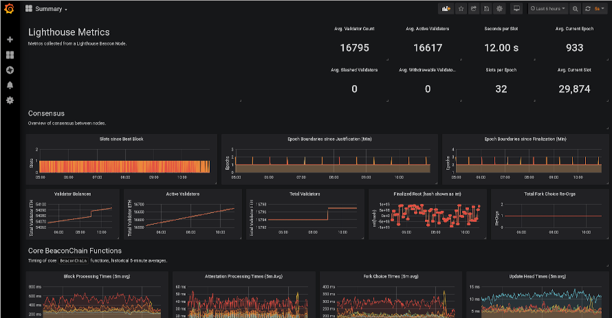
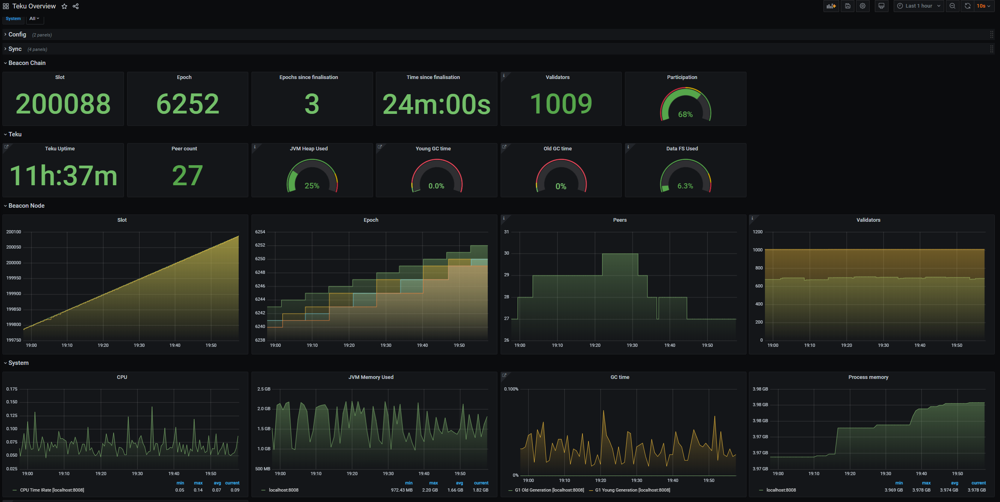
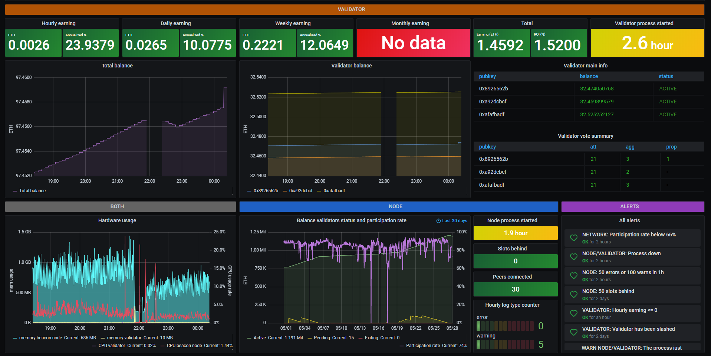

# Guide \| How to setup a validator on ETH2 testnet


As of November 17 2020, this guide is updated for **testnet Pyrmont.** 😁 


## 🏁 0. Prerequisites

### 👩💻Skills for operating a eth2 validator and beacon node

As a validator for eth2, you will typically have the following abilities:

* operational knowledge of how to set up, run and maintain a eth2 beacon node and validator continuously
* a long term commitment to maintain your validator 24/7/365
* basic operating system skills
* have learned the essentials by watching ['Intro to Eth2 & Staking for Beginners' by Superphiz](https://www.youtube.com/watch?v=tpkpW031RCI)
* have passed or is actively enrolled in the [Eth2 Study Master course](https://ethereumstudymaster.com/)
* and have read the [8 Things Every Eth2 validator should know.](https://medium.com/chainsafe-systems/8-things-every-eth2-validator-should-know-before-staking-94df41701487)

### 🎗 **Minimum Setup Requirements**

* **Operating system:** 64-bit Linux \(i.e. Ubuntu 20.04 LTS\)
* **Processor:** Dual core CPU, Intel Core i5–760 or AMD FX-8100 or better
* **Memory:** 8GB RAM
* **Storage:** 20GB SSD
* **Internet:** Broadband internet connection with speeds at least 1 Mbps.
* **Power:** Reliable electrical power.
* **ETH balance:** at least 32 goerli ETH and some ETH for deposit transaction fees
* **Wallet**: Metamask installed

### 🏋♂ Recommended Hardware Setup

* **Operating system:** 64-bit Linux \(i.e. Ubuntu 20.04 LTS\)
* **Processor:** Quad core CPU, Intel Core i7–4770 or AMD FX-8310 or better
* **Memory:** 16GB RAM or more
* **Storage:** 1TB SSD or more
* **Internet:** Broadband internet connections with speeds at least 10 Mbps
* **Power:** Reliable electrical power with uninterruptible power supply \(UPS\)
* **ETH balance:** at least 32 goerli ETH and some ETH for deposit transaction fees
* **Wallet**: Metamask installed


✨ **Pro Validator Tip**: Highly recommend you begin with a brand new instance of an OS, VM, and/or machine. Avoid headaches by NOT reusing testnet keys, wallets, or databases for your validator.


### 🔓 Recommended eth2 validator Security Best Practices

If you need ideas or a reminder on how to secure your validator, refer to



### 🛠 Setup Ubuntu

If you need to install Ubuntu, refer to



### 🎭 Setup Metamask

If you need to install Metamask, refer to



## 🌱 1. Obtain testnet ETH


Every 32 ETH you own allows you to make 1 validator. You can run thousands of validators with your beacon node. However on testnet, please only run 1 or 2 validators to keep the activation queue reasonably quick.


Join the [Prysmatic Labs Discord](https://discord.com/invite/YMVYzv6) and send a request for ETH in the **`-request-goerli-eth channel`**

```text
!send <your metamask goerli network ETH address>
```

Otherwise, visit the 🚰[Goerli Authenticated Faucet](https://faucet.goerli.mudit.blog/).

## 👩💻 2. Signup to be a validator at the Launchpad

1. Install dependencies, the ethereum foundation deposit tool and generate your two sets of key pairs.


Each validator will have two sets of key pairs. A **signing key** and a **withdrawal key.** These keys are derived from a single mnemonic phrase. [Learn more about keys.](https://blog.ethereum.org/2020/05/21/keys/)


You have the choice of downloading the pre-built [ethereum foundation deposit tool](https://github.com/ethereum/eth2.0-deposit-cli) or building it from source.



Install dependencies.

```text
sudo apt update
sudo apt install python3-pip git -y
```

Download source code and install.

```text
cd $HOME
git clone https://github.com/ethereum/eth2.0-deposit-cli.git eth2deposit-cli
cd eth2deposit-cli
sudo ./deposit.sh install
```

Make a new mnemonic.

```text
./deposit.sh new-mnemonic --chain pyrmont
```



Download eth2deposit-cli.

```bash
cd $HOME
wget https://github.com/ethereum/eth2.0-deposit-cli/releases/download/v1.1.0/eth2deposit-cli-ed5a6d3-linux-amd64.tar.gz
```

Verify the SHA256 Checksum matches the checksum on the [releases page](https://github.com/ethereum/eth2.0-deposit-cli/releases/tag/v1.0.0).

```bash
sha256sum eth2deposit-cli-ed5a6d3-linux-amd64.tar.gz
# SHA256 should be
# 2107f26f954545f423530e3501ae616c222b6bf77774a4f2743effb8fe4bcbe7
```

Extract the archive.

```text
tar -xvf eth2deposit-cli-ed5a6d3-linux-amd64.tar.gz
mv eth2deposit-cli-ed5a6d3-linux-amd64 eth2deposit-cli
cd eth2deposit-cli
```

Make a new mnemonic.

```text
./deposit new-mnemonic --chain pyrmont
```




🔥**\[ Optional \] Pro Security Tip**: Run the **eth2deposit-cli tool** and generate your **mnemonic seed** for your validator keys on an **air-gapped offline machine booted from usb**.


Follow this [ethstaker.cc](https://ethstaker.cc/) exclusive for the low down on making a bootable usb.

### Part 1 - Create a Ubuntu 20.04 USB Bootable Drive



### Part 2 - Install Ubuntu 20.04 from the USB Drive



You can copy via USB key the pre-built eth2deposit-cli binaries from an online machine to an air-gapped offline machine booted from usb. Make sure to disconnect the ethernet cable and/or WIFI.




**Do not send real mainnet ETH during this process!** 🛑 Use only goerli ETH.


1. Follow the prompts and pick a password. Write down your mnemonic and keep this safe and **offline**.
2. Follow the steps at [https://pyrmont.launchpad.ethereum.org/](https://pyrmont.launchpad.ethereum.org/) while skipping over the steps you already just completed. Study the eth2 phase 0 overview material. Understanding eth2 is the key to success!
3. Back on the launchpad website, upload your`deposit_data-#########.json` found in the `validator_keys` directory.
4. Connect to the launchpad with your Metamask wallet, review and accept terms.
5. Confirm the transaction\(s\). There's one deposit transaction of 32 ETH for each validator.


Your transaction is sending and depositing your ETH to the pyrmont ETH2 deposit contract address. 

**Check**, _double-check_, _**triple-check**_ that the pyrmont Eth2 deposit contract address is correct.

[0x8c5fecdC472E27Bc447696F431E425D02dd46a8c](https://goerli.etherscan.io/address/0x8c5fecdc472e27bc447696f431e425d02dd46a8c)



Be sure to write down or record your mnemonic seed **offline**. _Not email. Not cloud._

Make **offline backups**, such as to a USB key, of your **`validator_keys`** directory.


## 🛸 3. Install a ETH1 node


Ethereum 2.0 requires a connection to Ethereum 1.0 in order to monitor for 32 ETH validator deposits. Hosting your own Ethereum 1.0 node is the best way to maximize decentralization and minimize dependency on third parties such as Infura.



The subsequent steps assume you have completed the [best practices security guide](guide-or-security-best-practices-for-a-eth2-validator-beaconchain-node.md). 

🛑 Do not run your processes as **ROOT** user. 😱 


Your choice of either [**OpenEthereum**](https://www.parity.io/ethereum/)**,** [**Geth**](https://geth.ethereum.org/)**,** [**Besu**](https://besu.hyperledger.org/)**,** [**Nethermind**](https://www.nethermind.io/) **or** [**Infura**](https://infura.io/)**.**



#### 🤖 Install OpenEthereum

```text
mkdir ~/openethereum && cd ~/openethereum
wget https://github.com/openethereum/openethereum/releases/download/v3.1.0/openethereum-linux-v3.1.0.zip
unzip openethereum*.zip
chmod +x openethereum
rm openethereum*.zip
```

​ ⚙ **Setup and configure systemd**

Run the following to create a **unit file** to define your `eth1.service` configuration.

Simply copy/paste the following.

```bash
cat > $HOME/eth1.service << EOF 
[Unit]
Description     = openethereum eth1 service
Wants           = network-online.target
After           = network-online.target 

[Service]
User            = $(whoami)
ExecStart       = $(echo $HOME)/openethereum/openethereum --chain goerli
Restart         = on-failure

[Install]
WantedBy    = multi-user.target
EOF
```

Move the unit file to `/etc/systemd/system` and give it permissions.

```bash
sudo mv $HOME/eth1.service /etc/systemd/system/eth1.service
sudo chmod 644 /etc/systemd/system/eth1.service
```

Run the following to enable auto-start at boot time.

```text
sudo systemctl daemon-reload
sudo systemctl enable eth1
```

#### ⛓ Start OpenEthereum

```text
sudo systemctl start eth1
```



#### 🧬 Install from the repository

```text
sudo add-apt-repository -y ppa:ethereum/ethereum
sudo apt-get update -y
sudo apt-get install ethereum -y
```

⚙ **Setup and configure systemd**

Run the following to create a **unit file** to define your `eth1.service` configuration.

Simply copy/paste the following.

```bash
cat > $HOME/eth1.service << EOF 
[Unit]
Description     = geth eth1 service
Wants           = network-online.target
After           = network-online.target 

[Service]
User            = $(whoami)
ExecStart       = /usr/bin/geth --http --goerli --ws
Restart         = on-failure

[Install]
WantedBy    = multi-user.target
EOF
```

Move the unit file to `/etc/systemd/system` and give it permissions.

```bash
sudo mv $HOME/eth1.service /etc/systemd/system/eth1.service
sudo chmod 644 /etc/systemd/system/eth1.service
```

Run the following to enable auto-start at boot time.

```text
sudo systemctl daemon-reload
sudo systemctl enable eth1
```

#### ⛓ Start geth

```text
sudo systemctl start eth1
```



#### 🧬 Install java dependency

```text
sudo apt install openjdk-11-jdk
```

#### 🌜 Download and unzip Besu

```text
cd
wget -O besu.tar.gz https://bintray.com/hyperledger-org/besu-repo/download_file?file_path=besu-1.5.0.tar.gz
tar -xvf besu.tar.gz
rm besu.tar.gz
mv besu-1.5.0 besu
```

⚙ **Setup and configure systemd**

Run the following to create a **unit file** to define your `eth1.service` configuration.

Simply copy/paste the following.

```bash
cat > $HOME/eth1.service << EOF 
[Unit]
Description     = openethereum eth1 service
Wants           = network-online.target
After           = network-online.target 

[Service]
User            = $(whoami)
ExecStart       = $(echo $HOME)/besu/bin/besu --rpc-http-enabled --network=goerli
Restart         = on-failure

[Install]
WantedBy    = multi-user.target
EOF
```

Move the unit file to `/etc/systemd/system` and give it permissions.

```bash
sudo mv $HOME/eth1.service /etc/systemd/system/eth1.service
sudo chmod 644 /etc/systemd/system/eth1.service
```

Run the following to enable auto-start at boot time.

```text
sudo systemctl daemon-reload
sudo systemctl enable eth1
```

#### ⛓ Start besu

```text
sudo systemctl start eth1
```



#### ⚙ Install dependencies

```text
sudo apt-get update && sudo apt-get install libsnappy-dev libc6-dev libc6 unzip -y
```

#### 🌜 Download and unzip Nethermind

```bash
mkdir $HOME/nethermind && cd $HOME/nethermind
wget -O nethermind.zip https://nethdev.blob.core.windows.net/builds/nethermind-linux-amd64-1.8.77-9d3a58a.zip
unzip nethermind.zip
rm nethermind.zip
```

⚙ **Setup and configure systemd**

Run the following to create a **unit file** to define your `eth1.service` configuration.

Simply copy/paste the following.

```bash
cat > $HOME/eth1.service << EOF 
[Unit]
Description     = openethereum eth1 service
Wants           = network-online.target
After           = network-online.target 

[Service]
User            = $(whoami)
ExecStart       = $(echo $HOME)/nethermind/Nethermind.Runner --config goerli --JsonRpc.Enabled true
Restart         = on-failure

[Install]
WantedBy    = multi-user.target
EOF
```

Move the unit file to `/etc/systemd/system` and give it permissions.

```bash
sudo mv $HOME/eth1.service /etc/systemd/system/eth1.service
sudo chmod 644 /etc/systemd/system/eth1.service
```

Run the following to enable auto-start at boot time.

```text
sudo systemctl daemon-reload
sudo systemctl enable eth1
```

#### ⛓ Start Nethermind

```text
sudo systemctl start eth1
```




Infura is suitable for limited disk space setups. Always run your own full eth1 node when possible.


Sign up for an API access key at [https://infura.io/](https://infura.io/)

1. Sign up for a free account.
2. Confirm your email address.
3. Visit your dashboard [https://infura.io/dashboard](https://infura.io/dashboard)
4. Create a project, give it a name.
5. Select **Goerli** as the ENDPOINT
6. Follow the specific configuration for your eth2 client found below.

## Nimbus Specific Configuration

1. When creating your systemd's **unit file**, update the `--web-url` parameter with this endpoint. 
2. Copy the websocket endpoint. Starts with `wss://`
3. Save this for step 4, configuring your eth2 node.

```bash
#example
--web3-url=<your wss:// infura endpoint>
```

## Lighthouse Specific Configuration

1. When creating your **beacon chain systemd** **unit file**, add the `--eth1-endpoint` parameter with this endpoint. 
2. Copy the **https** endpoint. Starts with `https://`
3. Save this for step 4, configuring your eth2 node.

```bash
#example
--eth1-endpoint=<your https:// infura endpoint>
```

## Prysm Specific Configuration

1. When creating your **beacon chain systemd unit file**, update the `--http-web3provider` parameter with this endpoint. 
2. Copy the **https** endpoint. Starts with `https://`
3. Save this for step 4, configuring your eth2 node.

```bash
#example
--http-web3provider=<your https:// infura endpoint>
```




Syncing an eth1 node can take up to 1 week. On high-end machines with gigabit internet, expect syncing to take less than a day.



Your eth1 node is fully sync'd when these events occur.

* **`OpenEthereum:`** `Imported #<block number>`
* **`Geth:`** `Imported new chain segment`
* **`Besu:`** `Imported #<block number>`
* **`Nethermind:`** `No longer syncing Old Headers`


#### 🛠 Helpful eth1.service commands

​​ 🗒 **To view and follow eth1 logs**

```text
journalctl -u eth1 -f
```

🗒 **To stop eth1 service**

```text
sudo systemctl stop eth1
```

## 🌜 4. Configure a ETH2 beacon chain node and validator

Your choice of Lighthouse, Nimbus, Teku, Prysm, or Lodestar.




[Lighthouse](https://github.com/sigp/lighthouse) is an Eth2.0 client with a heavy focus on speed and security. The team behind it, [Sigma Prime](https://sigmaprime.io/), is an information security and software engineering firm who have funded Lighthouse along with the Ethereum Foundation, Consensys, and private individuals. Lighthouse is built in Rust and offered under an Apache 2.0 License.


## ⚙ 4.1. Install rust dependency

```bash
curl --proto '=https' --tlsv1.2 -sSf https://sh.rustup.rs | sh
```


In case of compilation errors, run`rustup update`


Enter '1' to proceed with the default install.

Update your environment variables.

```bash
echo export PATH="$HOME/.cargo/bin:$PATH" >> ~/.bashrc
source ~/.bashrc
```

Install rust dependencies.

```text
sudo apt install -y git gcc g++ make cmake pkg-config libssl-dev
```

## 💡 4.2. Build Lighthouse from source

```text
cd ~/git
git clone https://github.com/sigp/lighthouse.git
cd lighthouse
make
```


This build process may take up to an hour.


Verify lighthouse was installed properly by checking the version number.

```text
lighthouse --version
```

## 🎩 4.3. Import validator key


When you import your keys into Lighthouse, your validator signing key\(s\) are stored in the `$HOME/.lighthouse/prymont/validators` folder.


Run the following command to import your validator keys from the eth2deposit-cli tool directory.

Enter your keystore's password to import accounts.

```bash
lighthouse account validator import --testnet pyrmont --directory=$HOME/eth2deposit-cli/validator_keys
```

Verify the accounts were imported successfully.

```bash
lighthouse account_manager validator list --testnet pyrmont
```


**WARNING**: DO NOT USE THE ORIGINAL KEYSTORES TO VALIDATE WITH ANOTHER CLIENT, OR YOU WILL GET SLASHED. 


## 🔥 4.4. Configure port forwarding and/or firewall

Specific to your networking setup or cloud provider settings, [ensure your validator's firewall ports are open and reachable.](guide-or-security-best-practices-for-a-eth2-validator-beaconchain-node.md#configure-your-firewall)

* **Lighthouse beacon chain** requires port 9000 for tcp and udp
* **eth1** node requires port 30303 for tcp and udp


✨ **Port Forwarding Tip:** You'll need to forward and open ports to your validator. Verify it's working with [https://www.yougetsignal.com/tools/open-ports/](https://www.yougetsignal.com/tools/open-ports/) or [https://canyouseeme.org/](https://canyouseeme.org/) .


## ⛓ 4.5. Start the beacon chain


If you participated in any of the prior test nets, you need to clear the database.

```bash
rm -rf $HOME/.lighthouse
```


#### 🍰 Benefits of using systemd for your beacon chain <a id="benefits-of-using-systemd-for-your-stake-pool"></a>

1. Auto-start your beacon chain when the computer reboots due to maintenance, power outage, etc.
2. Automatically restart crashed beacon chain processes.
3. Maximize your beacon chain up-time and performance.

#### 🛠 Setup Instructions

Run the following to create a **unit file** to define your`beacon-chain.service` configuration.

```bash
cat > $HOME/beacon-chain.service << EOF 
# The eth2 beacon chain service (part of systemd)
# file: /etc/systemd/system/beacon-chain.service 

[Unit]
Description     = eth2 beacon chain service
Wants           = network-online.target
After           = network-online.target 

[Service]
User            = $(whoami)
ExecStart       = $(which lighthouse) bn --staking --metrics --testnet pyrmont
Restart         = on-failure

[Install]
WantedBy    = multi-user.target
EOF
```

Move the unit file to `/etc/systemd/system` and give it permissions.

```bash
sudo mv $HOME/beacon-chain.service /etc/systemd/system/beacon-chain.service
sudo chmod 644 /etc/systemd/system/beacon-chain.service
```

Run the following to enable auto-start at boot time and then start your beacon node service.

```text
sudo systemctl daemon-reload
sudo systemctl enable beacon-chain
sudo systemctl start beacon-chain
```


Nice work. Your beacon chain is now managed by the reliability and robustness of systemd. Below are some commands for using systemd.


### 🛠 Some helpful systemd commands

#### ✅ Check whether the beacon chain is active

```text
sudo systemctl is-active beacon-chain
```

#### 🔎 View the status of the beacon chain

```text
sudo systemctl status beacon-chain
```

#### 🔄 Restarting the beacon chain

```text
sudo systemctl reload-or-restart beacon-chain
```

#### 🛑 Stopping the beacon chain

```text
sudo systemctl stop beacon-chain
```

#### 🗄 Viewing and filtering logs

```bash
#view and follow the log
journalctl --unit=beacon-chain -f
#view log since yesterday
journalctl --unit=beacon-chain --since=yesterday
#view log since today
journalctl --unit=beacon-chain --since=today
#view log between a date
journalctl --unit=beacon-chain --since='2020-12-01 00:00:00' --until='2020-12-02 12:00:00'
```


The `--metrics` flag enables reporting on port 5054 and will be monitored with Prometheus.


## 🧬 4.6. Start the validator

Running the validator automatically with systemd.

#### 🍰 Benefits of using systemd for your validator <a id="benefits-of-using-systemd-for-your-stake-pool"></a>

1. Auto-start your validator when the computer reboots due to maintenance, power outage, etc.
2. Automatically restart crashed validator processes.
3. Maximize your validator up-time and performance.

#### 🛠 Setup Instructions

Run the following to create a **unit file** to define your`validator.service` configuration.

```bash
cat > $HOME/validator.service << EOF 
# The eth2 validator service (part of systemd)
# file: /etc/systemd/system/validator.service 

[Unit]
Description     = eth2 validator service
Wants           = network-online.target beacon-chain.service
After           = network-online.target 

[Service]
User            = $(whoami)
ExecStart       = $(which lighthouse) vc --testnet pyrmont
Restart         = on-failure

[Install]
WantedBy    = multi-user.target
EOF
```

Move the unit file to `/etc/systemd/system` and give it permissions.

```bash
sudo mv $HOME/validator.service /etc/systemd/system/validator.service
sudo chmod 644 /etc/systemd/system/validator.service
```

Run the following to enable auto-start at boot time and then start your validator.

```text
sudo systemctl daemon-reload
sudo systemctl enable validator
sudo systemctl start validator
```


Nice work. Your validator is now managed by the reliability and robustness of systemd. Below are some commands for using systemd.


### 🛠 Some helpful systemd commands

#### ✅ Check whether the validator is active

```text
sudo systemctl is-active validator
```

#### 🔎 View the status of the validator

```text
sudo systemctl status validator
```

#### 🔄 Restarting the validator

```text
sudo systemctl reload-or-restart validator
```

#### 🛑 Stopping the validator

```text
sudo systemctl stop validator
```

#### 🗄 Viewing and filtering logs

```bash
journalctl --unit=validator --since=yesterday
journalctl --unit=validator --since=today
journalctl --unit=validator --since='2020-12-01 00:00:00' --until='2020-12-02 12:00:00'
```




[Nimbus](https://our.status.im/tag/nimbus/) is a research project and a client implementation for Ethereum 2.0 designed to perform well on embedded systems and personal mobile devices, including older smartphones with resource-restricted hardware. The Nimbus team are from [Status](https://status.im/about/) the company best known for [their messaging app/wallet/Web3 browser](https://status.im/) by the same name. Nimbus \(Apache 2\) is written in Nim, a language with Python-like syntax that compiles to C.


## ⚙ 4.1. Build Nimbus from source

Install dependencies.

```text
sudo apt-get install curl build-essential git libpcre3-dev -y
```

Install and build Nimbus.

```bash
mkdir ~/git 
cd ~/git
git clone https://github.com/status-im/nimbus-eth2
cd nimbus-eth2
make NIMFLAGS="-d:insecure" nimbus_beacon_node
```


The build process may take a few minutes.


Verify Nimbus was installed properly by displaying the help.

```bash
cd $HOME/git/nimbus-eth2/build
./nimbus_beacon_node --help
```

## 🎩 4.2. Import validator key <a id="6-import-validator-key"></a>


When you import your keys into Nimbus, your validator signing key\(s\) are stored in the `build/data/shared_pyrmont_0/` folder, under `secrets` and `validators.`

The `secrets` folder contains the common secret that gives you access to all your validator keys.

The `validators` folder contains your signing keystore\(s\) \(encrypted keys\). Keystores are used by validators as a method for exchanging keys. 

For more on keys and keystores, see [here](https://blog.ethereum.org/2020/05/21/keys/).


The following command will import your validator keys.

Enter your keystore's password to import accounts.

```bash
cd $HOME/git/nimbus-eth2
build/nimbus_beacon_node deposits import  --data-dir=build/data/shared_pyrmont_0 $HOME/eth2deposit-cli/validator_keys
```

Now you can verify the accounts were imported successfully by doing a directory listing.

```bash
ll build/data/shared_pyrmont_0/validators
```

You should see a folder named for each of your validator's pubkey.


**WARNING**: DO NOT USE THE ORIGINAL KEYSTORES TO VALIDATE WITH ANOTHER CLIENT, OR YOU WILL GET SLASHED.


## 🔥 4.3. Configure port forwarding and/or firewall

Specific to your networking setup or cloud provider settings, [ensure your validator's firewall ports are open and reachable.](guide-or-security-best-practices-for-a-eth2-validator-beaconchain-node.md#configure-your-firewall)

* **Nimbus beacon chain node** will use port 9000 for tcp and udp
* **eth1** node requires port 30303 for tcp and udp


✨ **Port Forwarding Tip:** You'll need to forward and open ports to your validator. Verify it's working with [https://www.yougetsignal.com/tools/open-ports/](https://www.yougetsignal.com/tools/open-ports/) or [https://canyouseeme.org/](https://canyouseeme.org/) .


##  🏂 4.4. Start the beacon chain and validator


Nimbus combines both the beacon chain and validator into one process.



**Nimbus workaround:** Currently you'll be asked to enter your [Web3 provider URL](https://status-im.github.io/nimbus-eth2/start-syncing.html#web3-provider-url) again upon startup. This conflicts with systemd.

In the meantime, manually start Nimbus. Do not use systemd as described below.

```bash
ClientIP=\$(curl -s ident.me)
$HOME/git/nimbus-eth2/run-pyrmont-beacon-node.sh --nat=extip:${ClientIP} --web3-url=ws://127.0.0.1:8546 --metrics --metrics-port=8008 --rpc --rpc-port=9091 --max-peers=100
```


Running the beacon chain automatically with systemd.

#### 🍰 Benefits of using systemd for your beacon chain and validator <a id="benefits-of-using-systemd-for-your-stake-pool"></a>

1. Auto-start your beacon chain when the computer reboots due to maintenance, power outage, etc.
2. Automatically restart crashed beacon chain processes.
3. Maximize your beacon chain up-time and performance.

#### 🛠 Setup Instructions

Run the following to create a **unit file** to define your`beacon-chain.service` configuration.

```bash
cat > $HOME/beacon-chain.service << EOF 
# The eth2 beacon chain service (part of systemd)
# file: /etc/systemd/system/beacon-chain.service 

[Unit]
Description     = eth2 beacon chain service
Wants           = network-online.target
After           = network-online.target 

[Service]
User            = $(whoami)
Environment     = "ClientIP=\$(curl -s ident.me)"
ExecStart       = $(echo $HOME)/git/nimbus-eth2/run-pyrmont-beacon-node.sh --nat=extip:\${ClientIP} --web3-url=ws://127.0.0.1:8546 --metrics --metrics-port=8008 --rpc --rpc-port=9091 --max-peers=100 
Restart         = on-failure

[Install]
WantedBy    = multi-user.target
EOF
```


Nimbus only supports websocket connections \("ws://" and "wss://"\) for the ETH1 node. Only Geth or Infura ETH1 nodes verified compatible.


Move the unit file to `/etc/systemd/system` and give it permissions.

```bash
sudo mv $HOME/beacon-chain.service /etc/systemd/system/beacon-chain.service
sudo chmod 644 /etc/systemd/system/beacon-chain.service
```

Run the following to enable auto-start at boot time and then start your beacon node service.

```text
sudo systemctl daemon-reload
sudo systemctl enable beacon-chain
sudo systemctl start beacon-chain
```


Nice work. Your beacon chain is now managed by the reliability and robustness of systemd. Below are some commands for using systemd.


### 🛠 Some helpful systemd commands

#### ✅ Check whether the beacon chain is active

```text
sudo systemctl is-active beacon-chain
```

#### 🔎 View the status of the beacon chain

```text
sudo systemctl status beacon-chain
```

#### 🔄 Restarting the beacon chain

```text
sudo systemctl reload-or-restart beacon-chain
```

#### 🛑 Stopping the beacon chain

```text
sudo systemctl stop beacon-chain
```

#### 🗄 Viewing and filtering logs

```bash
#view and follow the log
journalctl --unit=beacon-chain -f
#view log since yesterday
journalctl --unit=beacon-chain --since=yesterday
#view log since today
journalctl --unit=beacon-chain --since=today
#view log between a date
journalctl --unit=beacon-chain --since='2020-12-01 00:00:00' --until='2020-12-02 12:00:00'
```




[PegaSys Teku](https://pegasys.tech/teku/) \(formerly known as Artemis\) is a Java-based Ethereum 2.0 client designed & built to meet institutional needs and security requirements. PegaSys is an arm of [ConsenSys](https://consensys.net/) dedicated to building enterprise-ready clients and tools for interacting with the core Ethereum platform. Teku is Apache 2 licensed and written in Java, a language notable for its materity & ubiquity.


## ⚙ 4.1 Build Teku from source

Install git.

```text
sudo apt-get install git -y
```

Install Java 11.

```
sudo apt update
sudo apt install openjdk-11-jdk -y
```

```text
sudo add-apt-repository ppa:linuxuprising/java
sudo apt update
sudo apt install oracle-java11-set-default -y
```

Verify Java 11+ is installed.

```bash
java --version
```

Install and build Teku.

```bash
cd ~/git
git clone https://github.com/PegaSysEng/teku.git
cd teku
./gradlew distTar installDist
```


This build process may take a few minutes.


Verify Teku was installed properly by displaying the version.

```bash
cd $HOME/git/teku/build/install/teku/bin
./teku --version
```

Copy the teku binary file to `/usr/bin/teku`

```bash
sudo cp -r $HOME/git/teku/build/install/teku /usr/bin/teku
```

## 🔥 4.2. Configure port forwarding and/or firewall

Specific to your networking setup or cloud provider settings, [ensure your validator's firewall ports are open and reachable.](guide-or-security-best-practices-for-a-eth2-validator-beaconchain-node.md#configure-your-firewall)

* **Teku beacon chain node** will use port 9001 for tcp and udp
* **eth1** node requires port 30303 for tcp and udp


\*\*\*\*✨ **Port Forwarding Tip:** You'll need to forward and open ports to your validator. Verify it's working with [https://www.yougetsignal.com/tools/open-ports/](https://www.yougetsignal.com/tools/open-ports/) or [https://canyouseeme.org/](https://canyouseeme.org/) .


## 🏂 4.3. Configure the beacon chain and validator


Teku combines both the beacon chain and validator into one process.



If you participated in any of the prior test nets, you need to clear the database.

```bash
rm -rf $HOME/.local/share/teku/data
```


Setup a directory structure for Teku.

```bash
sudo mkdir -p /var/lib/teku
sudo mkdir -p /etc/teku
```

 Copy your `validator_files` directory to the data directory we created above and remove the extra deposit\_data file.

```bash
sudo cp -r $HOME/eth2deposit-cli/validator_keys /var/lib/teku
rm /var/lib/teku/validator_keys/deposit_data*
```


**WARNING**: DO NOT USE THE ORIGINAL KEYSTORES TO VALIDATE WITH ANOTHER CLIENT, OR YOU WILL GET SLASHED.


Store your validator's password in a file. 

Update your password between the quotation marks after `echo`.

```bash
echo "my_password_goes_here" > $HOME/validators-password.txt
sudo mv $HOME/validators-password.txt /etc/teku/validators-password.txt
```

Generate your Teku Config file.

```bash
cat > $HOME/teku.yaml << EOF
# network
network: "pyrmont"

# p2p
p2p-enabled: true
p2p-port: 9001

# validators
validator-keys: "/var/lib/teku/validator_keys:/var/lib/teku/validator_keys"
validators-graffiti: "Teku validator & CoinCashew.com"

# Eth 1
eth1-endpoint: "http://localhost:8545"

# metrics
metrics-enabled: true
metrics-categories: ["BEACON","LIBP2P","NETWORK"]
metrics-port: 8008

# database
data-path: "$(echo $HOME)/tekudata"
data-storage-mode: "archive"

# rest api
rest-api-port: 5051
rest-api-docs-enabled: true
rest-api-enabled: true

# logging
log-include-validator-duties-enabled: true
log-destination: CONSOLE
EOF
```

Move the config file to `/etc/teku`

```bash
sudo mv $HOME/teku.yaml /etc/teku/teku.yaml
```

## 🎩 4.4 Import validator key


When specifying directories for your validator-keys, Teku expects to find identically named keystore and password files. 

For example `keystore-m_12221_3600_1_0_0-11222333.json` and `keystore-m_12221_3600_1_0_0-11222333.txt`


Create a corresponding password file for every one of your validators.

```bash
for f in /var/lib/teku/validator_keys/keystore*.json; do cp /etc/teku/validators-password.txt /var/lib/teku/validator_keys/$(basename $f .json).txt; done
```

Verify that your validator's keystore and validator's passwords are present by checking the following directory.

```bash
ll /var/lib/teku/validator_keys
```

## 🏁 4.5. Start the beacon chain and validator

Use **systemd** to manage starting and stopping teku.

#### 🍰 Benefits of using systemd for your beacon chain and validator <a id="benefits-of-using-systemd-for-your-stake-pool"></a>

1. Auto-start your beacon chain when the computer reboots due to maintenance, power outage, etc.
2. Automatically restart crashed beacon chain processes.
3. Maximize your beacon chain up-time and performance.

#### 🛠 Setup Instructions

Run the following to create a **unit file** to define your`beacon-chain.service` configuration.

```bash
cat > $HOME/beacon-chain.service << EOF
# The eth2 beacon chain service (part of systemd)
# file: /etc/systemd/system/beacon-chain.service 

[Unit]
Description     = eth2 beacon chain service
Wants           = network-online.target
After           = network-online.target 

[Service]
User            = $(whoami)
ExecStart       = /usr/bin/teku/bin/teku -c /etc/teku/teku.yaml
Restart         = on-failure
Environment     = JAVA_OPTS=-Xmx5g

[Install]
WantedBy	= multi-user.target
EOF
```

Move the unit file to `/etc/systemd/system` and give it permissions.

```bash
sudo mv $HOME/beacon-chain.service /etc/systemd/system/beacon-chain.service
sudo chmod 644 /etc/systemd/system/beacon-chain.service
```

Run the following to enable auto-start at boot time and then start your beacon node service.

```text
sudo systemctl daemon-reload
sudo systemctl enable beacon-chain
sudo systemctl start beacon-chain
```


Nice work. Your beacon chain is now managed by the reliability and robustness of systemd. Below are some commands for using systemd.


### 🛠 Some helpful systemd commands

#### ✅ Check whether the beacon chain is active

```text
sudo systemctl is-active beacon-chain
```

#### 🔎 View the status of the beacon chain

```text
sudo systemctl status beacon-chain
```

#### 🔄 Restarting the beacon chain

```text
sudo systemctl reload-or-restart beacon-chain
```

#### 🛑 Stopping the beacon chain

```text
sudo systemctl stop beacon-chain
```

#### 🗄 Viewing and filtering logs

```bash
#view and follow the log
journalctl --unit=beacon-chain -f
#view log since yesterday
journalctl --unit=beacon-chain --since=yesterday
#view log since today
journalctl --unit=beacon-chain --since=today
#view log between a date
journalctl --unit=beacon-chain --since='2020-12-01 00:00:00' --until='2020-12-02 12:00:00'
```




[Prysm](https://github.com/prysmaticlabs/prysm) is a Go implementation of Ethereum 2.0 protocol with a focus on usability, security, and reliability. Prysm is developed by [Prysmatic Labs](https://prysmaticlabs.com/), a company with the sole focus on the development of their client. Prysm is written in Go and released under a GPL-3.0 license.


## ⚙ 4.1. Install Prysm

```bash
mkdir ~/prysm && cd ~/prysm 
curl https://raw.githubusercontent.com/prysmaticlabs/prysm/master/prysm.sh --output prysm.sh && chmod +x prysm.sh 
```

## 🔥 4.2. Configure port forwarding and/or firewall

Specific to your networking setup or cloud provider settings, [ensure your validator's firewall ports are open and reachable.](guide-or-security-best-practices-for-a-eth2-validator-beaconchain-node.md#configure-your-firewall)

* **Prysm beacon chain node** will use port 12000 for udp and port 13000 for tcp
* **eth1** node requires port 30303 for tcp and udp


✨ **Port Forwarding Tip:** You'll need to forward and open ports to your validator. Verify it's working with [https://www.yougetsignal.com/tools/open-ports/](https://www.yougetsignal.com/tools/open-ports/) or [https://canyouseeme.org/](https://canyouseeme.org/) .


## 🎩 4.3. Import validator key

Accept terms of use, accept default wallet location, enter a new password to encrypt your wallet and enter the password for your imported accounts.

```bash
$HOME/prysm/prysm.sh validator accounts import --pyrmont --keys-dir=$HOME/eth2deposit-cli/validator_keys
```

Verify your validators imported successfully.

```bash
$HOME/prysm/prysm.sh validator accounts list --pyrmont     
```

Confirm your validator's pubkeys are listed.

> \#Example output:
>
> Showing 1 validator account View the eth1 deposit transaction data for your accounts by running \`validator accounts list --show-deposit-data
>
> Account 0 \| pens-brother-heat   
> \[validating public key\] 0x2374.....7121


**WARNING**: DO NOT USE THE ORIGINAL KEYSTORES TO VALIDATE WITH ANOTHER CLIENT, OR YOU WILL GET SLASHED.


## 🏂 4.4. Start the beacon chain


If you participated in any of the prior test nets, you need to clear the database.

```bash
$HOME/prysm/prysm.sh beacon-chain --clear-db --pyrmont
```


#### 🍰 Benefits of using systemd for your beacon chain and validator <a id="benefits-of-using-systemd-for-your-stake-pool"></a>

1. Auto-start your beacon chain when the computer reboots due to maintenance, power outage, etc.
2. Automatically restart crashed beacon chain processes.
3. Maximize your beacon chain up-time and performance.

#### 🛠 Setup Instructions

Run the following to create a **unit file** to define your`beacon-chain.service` configuration.

```bash
cat > $HOME/beacon-chain.service << EOF 
# The eth2 beacon chain service (part of systemd)
# file: /etc/systemd/system/beacon-chain.service 

[Unit]
Description     = eth2 beacon chain service
Wants           = network-online.target
After           = network-online.target 

[Service]
User            = $(whoami)
Environment     = "ClientIP=\$(curl -s ident.me)"
ExecStart       = $(echo $HOME)/prysm/prysm.sh beacon-chain --pyrmont --p2p-host-ip=\${ClientIP} --monitoring-host="0.0.0.0" --http-web3provider=http://127.0.0.1:8545 --accept-terms-of-use 
Restart         = on-failure

[Install]
WantedBy    = multi-user.target
EOF
```

Move the unit file to `/etc/systemd/system` and give it permissions.

```bash
sudo mv $HOME/beacon-chain.service /etc/systemd/system/beacon-chain.service
sudo chmod 644 /etc/systemd/system/beacon-chain.service
```

Run the following to enable auto-start at boot time and then start your beacon node service.

```text
sudo systemctl daemon-reload
sudo systemctl enable beacon-chain
sudo systemctl start beacon-chain
```


Nice work. Your beacon chain is now managed by the reliability and robustness of systemd. Below are some commands for using systemd.


### 🛠 Some helpful systemd commands

#### ✅ Check whether the beacon chain is active

```text
sudo systemctl is-active beacon-chain
```

#### 🔎 View the status of the beacon chain

```text
sudo systemctl status beacon-chain
```

####  🔄 Restarting the beacon chain

```text
sudo systemctl reload-or-restart beacon-chain
```

####  🛑 Stopping the beacon chain

```text
sudo systemctl stop beacon-chain
```

#### 🗒 Viewing and filtering logs

```bash
#view and follow the log
journalctl --unit=beacon-chain -f
#view log since yesterday
journalctl --unit=beacon-chain --since=yesterday
#view log since today
journalctl --unit=beacon-chain --since=today
#view log between a date
journalctl --unit=beacon-chain --since='2020-12-01 00:00:00' --until='2020-12-02 12:00:00'
```

## 🧬 4.5. Start the validator <a id="9-start-the-validator"></a>

Store your validator's password in a file and make it read-only.

```bash
echo "my_password_goes_here" > $HOME/.eth2validators/validators-password.txt
sudo chmod 600 $HOME/.eth2validators/validators-password.txt
```

Your choice of running a validator manually from command line or automatically with systemd.

#### 🍰 Benefits of using systemd for your validator <a id="benefits-of-using-systemd-for-your-stake-pool"></a>

1. Auto-start your validator when the computer reboots due to maintenance, power outage, etc.
2. Automatically restart crashed validator processes.
3. Maximize your validator up-time and performance.

#### 🛠 Setup Instructions

Run the following to create a **unit file** to define your`validator.service` configuration.

```bash
cat > $HOME/validator.service << EOF 
# The eth2 validator service (part of systemd)
# file: /etc/systemd/system/validator.service 

[Unit]
Description     = eth2 validator service
Wants           = network-online.target beacon-chain.service
After           = network-online.target 

[Service]
User            = $(whoami)
ExecStart       = $(echo $HOME)/prysm/prysm.sh validator --pyrmont --accept-terms-of-use --wallet-password-file $(echo $HOME)/.eth2validators/validators-password.txt
Restart         = on-failure

[Install]
WantedBy	= multi-user.target
EOF
```

Move the unit file to `/etc/systemd/system` and give it permissions.

```bash
sudo mv $HOME/validator.service /etc/systemd/system/validator.service
sudo chmod 644 /etc/systemd/system/validator.service
```

Run the following to enable auto-start at boot time and then start your validator.

```text
sudo systemctl daemon-reload
sudo systemctl enable validator
sudo systemctl start validator
```

### 🛠 Some helpful systemd commands

#### ✅ Check whether the validator is active

```text
sudo systemctl is-active validator
```

#### 🔎 View the status of the validator

```text
sudo systemctl status validator
```

#### 🔄 Restarting the validator

```text
sudo systemctl reload-or-restart validator
```

#### 🛑 Stopping the validator

```text
sudo systemctl stop validator
```

#### 🗄 Viewing and filtering logs

```bash
#view and follow the log
journalctl --unit=validator -f
#view log since yesterday
journalctl --unit=validator --since=yesterday
#view log since today
journalctl --unit=validator --since=today
#view log between a date
journalctl --unit=validator --since='2020-12-01 00:00:00' --until='2020-12-02 12:00:00'
```

Verify that your **validator public key** appears in the logs. Example below:

```text
INFO Enabled validator       voting_pubkey: 0x2374.....7121
```




**Lodestar is a Typescript implementation** of the official [Ethereum 2.0 specification](https://github.com/ethereum/eth2.0-specs) by the [ChainSafe.io](https://lodestar.chainsafe.io/) team. In addition to the beacon chain client, the team is also working on 22 packages and libraries. A complete list can be found [here](https://hackmd.io/CcsWTnvRS_eiLUajr3gi9g). Finally, the Lodestar team is leading the Eth2 space in light client research and development and has received funding from the EF and Moloch DAO for this purpose.



Lodestar may not be fully functional and stable yet.


## ⚙ 4.1 Build Lodestar from source

Install curl and git.

```bash
sudo apt-get install git curl -y
```

Install yarn.

```bash
curl -sS https://dl.yarnpkg.com/debian/pubkey.gpg | sudo apt-key add -
echo "deb https://dl.yarnpkg.com/debian/ stable main" | sudo tee /etc/apt/sources.list.d/yarn.list
sudo apt update
sudo apt install yarn
```

Confirm yarn is installed properly.

```bash
yarn --version
# Should output version >= 1.22.4
```

Install nodejs.

```text
curl -sL https://deb.nodesource.com/setup_12.x | sudo -E bash -
sudo apt-get install -y nodejs
```

Confirm nodejs is installed properly.

```bash
nodejs -v
# Should output version >= v12.18.3
```

Install and build Lodestar.

```bash
cd ~/git
git clone https://github.com/chainsafe/lodestar.git
cd lodestar
yarn install
yarn run build
```


This build process may take up to an hour.


Verify Lodestar was installed properly by displaying the help menu.

```text
yarn run cli --help
```

## 🔥 4.2. Configure port forwarding and/or firewall

Specific to your networking setup or cloud provider settings, [ensure your validator's firewall ports are open and reachable.](guide-or-security-best-practices-for-a-eth2-validator-beaconchain-node.md#configure-your-firewall)

* **Lodestar beacon chain node** will use port 30607 for tcp and port 9000 for udp peer discovery.
* **eth1** node requires port 30303 for tcp and udp


\*\*\*\*✨ **Port Forwarding Tip:** You'll need to forward and open ports to your validator. Verify it's working with [https://www.yougetsignal.com/tools/open-ports/](https://www.yougetsignal.com/tools/open-ports/) or [https://canyouseeme.org/](https://canyouseeme.org/) .


## 🎩 4.3. Import validator key

```bash
yarn run cli account validator import \
  --testnet pyrmont \
  --directory $HOME/eth2deposit-cli/validator_keys
```

Enter your keystore's password to import accounts. 

Confirm your keys were imported properly.

```text
yarn run cli account validator list --testnet pyrmont
```


**WARNING**: DO NOT USE THE ORIGINAL KEYSTORES TO VALIDATE WITH ANOTHER CLIENT, OR YOU WILL GET SLASHED.


## 🏂 4.4. Start the beacon chain and validator

Run the beacon chain automatically with systemd.

#### 🍰 Benefits of using systemd for your beacon chain <a id="benefits-of-using-systemd-for-your-stake-pool"></a>

1. Auto-start your beacon chain when the computer reboots due to maintenance, power outage, etc.
2. Automatically restart crashed beacon chain processes.
3. Maximize your beacon chain up-time and performance.

#### 🛠 Setup Instructions

Run the following to create a **unit file** to define your`beacon-chain.service` configuration.

```bash
cat > $HOME/beacon-chain.service << EOF 
# The eth2 beacon chain service (part of systemd)
# file: /etc/systemd/system/beacon-chain.service 

[Unit]
Description     = eth2 beacon chain service
Wants           = network-online.target
After           = network-online.target 

[Service]
User            = $(whoami)
WorkingDirectory= $(echo $HOME)/git/lodestar
ExecStart       = yarn run cli beacon --testnet pyrmont --eth1.providerUrl http://localhost:8545 --metrics.serverPort 8008
Restart         = on-failure

[Install]
WantedBy	= multi-user.target
EOF
```

Move the unit file to `/etc/systemd/system` and give it permissions.

```bash
sudo mv $HOME/beacon-chain.service /etc/systemd/system/beacon-chain.service
sudo chmod 644 /etc/systemd/system/beacon-chain.service
```

Run the following to enable auto-start at boot time and then start your beacon node service.

```text
sudo systemctl daemon-reload
sudo systemctl enable beacon-chain
sudo systemctl start beacon-chain
```


Nice work. Your beacon chain is now managed by the reliability and robustness of systemd. Below are some commands for using systemd.


### 🛠 Some helpful systemd commands

#### ✅ Check whether the beacon chain is active

```text
sudo systemctl is-active beacon-chain
```

#### 🔎 View the status of the beacon chain

```text
sudo systemctl status beacon-chain
```

#### 🔄 Restarting the beacon chain

```text
sudo systemctl reload-or-restart beacon-chain
```

#### 🛑 Stopping the beacon chain

```text
sudo systemctl stop beacon-chain
```

#### 🗄 Viewing and filtering logs

```bash
#view and follow the log
journalctl --unit=beacon-chain -f
#view log since yesterday
journalctl --unit=beacon-chain --since=yesterday
#view log since today
journalctl --unit=beacon-chain --since=today
#view log between a date
journalctl --unit=beacon-chain --since='2020-12-01 00:00:00' --until='2020-12-02 12:00:00'
```

## 🧬 4.5. Start the validator

Run the validator automatically with systemd.

#### 🍰 Benefits of using systemd for your validator <a id="benefits-of-using-systemd-for-your-stake-pool"></a>

1. Auto-start your validator when the computer reboots due to maintenance, power outage, etc.
2. Automatically restart crashed validator processes.
3. Maximize your validator up-time and performance.

#### 🛠 Setup Instructions

Run the following to create a **unit file** to define your`validator.service` configuration.

```bash
cat > $HOME/validator.service << EOF 
# The eth2 validator service (part of systemd)
# file: /etc/systemd/system/validator.service 

[Unit]
Description     = eth2 validator service
Wants           = network-online.target beacon-chain.service
After           = network-online.target 

[Service]
User            = $(whoami)
WorkingDirectory= $(echo $HOME)/git/lodestar
ExecStart       = yarn run cli validator run --testnet pyrmont
Restart         = on-failure

[Install]
WantedBy	= multi-user.target
EOF
```

Move the unit file to `/etc/systemd/system` and give it permissions.

```bash
sudo mv $HOME/validator.service /etc/systemd/system/validator.service
sudo chmod 644 /etc/systemd/system/validator.service
```

Run the following to enable auto-start at boot time and then start your validator.

```text
sudo systemctl daemon-reload
sudo systemctl enable validator
sudo systemctl start validator
```


Nice work. Your validator is now managed by the reliability and robustness of systemd. Below are some commands for using systemd.


### 🛠 Some helpful systemd commands

#### ✅ Check whether the validator is active

```text
sudo systemctl is-active validator
```

#### 🔎 View the status of the validator

```text
sudo systemctl status validator
```

#### 🔄 Restarting the validator

```text
sudo systemctl reload-or-restart validator
```

#### 🛑 Stopping the validator

```text
sudo systemctl stop validator
```

#### 🗄 Viewing and filtering logs

```bash
#view and follow the log
journalctl --unit=validator -f
#view log since yesterday
journalctl --unit=validator --since=yesterday
#view log since today
journalctl --unit=validator --since=today
#view log between a date
journalctl --unit=validator --since='2020-12-01 00:00:00' --until='2020-12-02 12:00:00'
```




**Validator client** - Responsible for producing new blocks and attestations in the beacon chain and shard chains.

**Beacon chain client** - Responsible for managing the state of the beacon chain, validator shuffling, and more.

Remember, Teku combines both clients into one process.



Congratulations. Once your beacon chain is sync'd, validator up and running, you just wait for activation. This process can take 24+ hours. When you're assigned, your validator will begin creating and voting on blocks while earning staking rewards.

Use [https://pyrmont.beaconcha.in/](https://pyrmont.beaconcha.in/) to create alerts and track your validator's performance.


## 🕒5. Time Synchronization


Because beacon chain relies on accurate times to perform attestations and produce blocks, your computer's time must be accurate to real NTP or NTS time within 0.5 seconds.


Setup **Chrony** with the following guide.




chrony is an implementation of the Network Time Protocol and helps to keep your computer's time synchronized with NTP.


## 🔎6. Monitoring your validator with Grafana and Prometheus

Prometheus is a monitoring platform that collects metrics from monitored targets by scraping metrics HTTP endpoints on these targets. [Official documentation is available here.](https://prometheus.io/docs/introduction/overview/) Grafana is a dashboard used to visualize the collected data.

### 🐣 6.1 Installation

Install prometheus and prometheus node exporter.

```text
sudo apt-get install -y prometheus prometheus-node-exporter
```

Install grafana.

```bash
wget -q -O - https://packages.grafana.com/gpg.key | sudo apt-key add -
echo "deb https://packages.grafana.com/oss/deb stable main" > grafana.list
sudo mv grafana.list /etc/apt/sources.list.d/grafana.list
sudo apt-get update && sudo apt-get install -y grafana
```

Enable services so they start automatically.

```bash
sudo systemctl enable grafana-server.service
sudo systemctl enable prometheus.service
sudo systemctl enable prometheus-node-exporter.service
```

Create the **prometheus.yml** config file. Choose the tab for your eth2 client.



```bash
cat > $HOME/prometheus.yml << EOF
global:
  scrape_interval:     15s # By default, scrape targets every 15 seconds.

  # Attach these labels to any time series or alerts when communicating with
  # external systems (federation, remote storage, Alertmanager).
  external_labels:
    monitor: 'codelab-monitor'

# A scrape configuration containing exactly one endpoint to scrape:
# Here it's Prometheus itself.
scrape_configs:
   - job_name: 'node_exporter'
     static_configs:
       - targets: ['localhost:9100']
   - job_name: 'nodes'
     metrics_path: /metrics    
     static_configs:
       - targets: ['localhost:5054']
EOF
```



```bash
cat > $HOME/prometheus.yml << EOF
global:
  scrape_interval:     15s # By default, scrape targets every 15 seconds.

  # Attach these labels to any time series or alerts when communicating with
  # external systems (federation, remote storage, Alertmanager).
  external_labels:
    monitor: 'codelab-monitor'

# A scrape configuration containing exactly one endpoint to scrape:
# Here it's Prometheus itself.
scrape_configs:
   - job_name: 'node_exporter'
     static_configs:
       - targets: ['localhost:9100']
   - job_name: 'nodes'
     metrics_path: /metrics    
     static_configs:
       - targets: ['localhost:8008']
EOF
```



```bash
cat > $HOME/prometheus.yml << EOF
global:
  scrape_interval:     15s # By default, scrape targets every 15 seconds.

  # Attach these labels to any time series or alerts when communicating with
  # external systems (federation, remote storage, Alertmanager).
  external_labels:
    monitor: 'codelab-monitor'

# A scrape configuration containing exactly one endpoint to scrape:
# Here it's Prometheus itself.
scrape_configs:
   - job_name: 'node_exporter'
     static_configs:
       - targets: ['localhost:9100']
   - job_name: 'nodes'
     metrics_path: /metrics    
     static_configs:
       - targets: ['localhost:8008']
EOF
```



```bash
cat > $HOME/prometheus.yml << EOF
global:
  scrape_interval:     15s # By default, scrape targets every 15 seconds.

  # Attach these labels to any time series or alerts when communicating with
  # external systems (federation, remote storage, Alertmanager).
  external_labels:
    monitor: 'codelab-monitor'

# A scrape configuration containing exactly one endpoint to scrape:
# Here it's Prometheus itself.
scrape_configs:
  - job_name: 'node_exporter'
    static_configs:
      - targets: ['localhost:9100']
  - job_name: 'validator'
    static_configs:
      - targets: ['localhost:8081']
  - job_name: 'beacon node'
    static_configs:
      - targets: ['localhost:8080']
  - job_name: 'slasher'
    static_configs:
      - targets: ['localhost:8082']
EOF
```



```bash
cat > $HOME/prometheus.yml << EOF   
scrape_configs:
   - job_name: 'node_exporter'
     static_configs:
       - targets: ['localhost:9100']
   - job_name: 'Lodestar'
     metrics_path: /metrics    
     static_configs:
       - targets: ['localhost:8008']
EOF
```



Move it to `/etc/prometheus/prometheus.yml`

```bash
sudo mv $HOME/prometheus.yml /etc/prometheus/prometheus.yml
```

Finally, restart the services.

```bash
sudo systemctl restart grafana-server.service
sudo systemctl restart prometheus.service
sudo systemctl restart prometheus-node-exporter.service
```

Verify that the services are running properly:

```text
sudo systemctl status grafana-server.service prometheus.service prometheus-node-exporter.service
```


💡 **Reminder**: Ensure port 3000 is open on the firewall and/or port forwarded if you intend to view monitoring info from a different machine.


### 📶 6.2 Setting up Grafana Dashboards

1. Open [http://localhost:3000](http://localhost:3000) or http://&lt;your validator's ip address&gt;:3000 in your local browser.
2. Login with **admin** / **admin**
3. Change password
4. Click the **configuration gear** icon, then **Add data Source**
5. Select **Prometheus**
6. Set **Name** to **"Prometheus**"
7. Set **URL** to [http://localhost:9090](http://localhost:9090)
8. Click **Save & Test**
9. **Download and save** your ETH2 Client's json file. \[ [Lighthouse ](https://raw.githubusercontent.com/sigp/lighthouse-metrics/master/dashboards/Summary.json)\| [Teku ](https://grafana.com/api/dashboards/12522/revisions/2/download)\| [Nimbus ](https://raw.githubusercontent.com/status-im/nimbus-eth2/master/grafana/beacon_nodes_Grafana_dashboard.json)\| [Prysm ](https://raw.githubusercontent.com/GuillaumeMiralles/prysm-grafana-dashboard/master/less_10_validators.json)\| [Prysm &gt; 10 Validators](https://raw.githubusercontent.com/GuillaumeMiralles/prysm-grafana-dashboard/master/more_10_validators.json) \| Lodestar \]
10. Click **Create +** icon &gt; **Import**
11. Add dashboard by **Upload JSON file**
12. Click the **Import** button.

#### Example of Grafana Dashboards for each ETH2 client.





Credits: [https://github.com/sigp/lighthouse-metrics/](https://github.com/sigp/lighthouse-metrics/)





Credits: [https://github.com/status-im/nimbus-eth2/](https://github.com/status-im/nimbus-eth2/)





Credits: [https://grafana.com/grafana/dashboards/12522](https://grafana.com/grafana/dashboards/12522)





Credits: [https://github.com/GuillaumeMiralles/prysm-grafana-dashboard](https://github.com/GuillaumeMiralles/prysm-grafana-dashboard)



Work in progress.



### ⚠ 6.3 Setup Alert Notifications


Setup alerts to get notified if your validators go offline.


Get notified of problems with your validators. Choose between email, telegram, discord or slack.



1. Visit [https://pyrmont.beaconcha.in/](https://pyrmont.beaconcha.in/)
2. Sign up for an account.
3. Verify your **email**
4. Search for your **validator's public address**
5. Add validators to your watchlist by clicking the **bookmark symbol**.



1. On the menu of Grafana, select **Notification channels** under the bell icon.  
2. Click on **Add channel**.
3. Give the notification channel a **name**.
4. Select **Telegram** from the Type list.
5. To complete the **Telegram API settings**, a Telegram channel and bot are required. For instructions on setting up a bot with `@Botfather`, see [this section](https://core.telegram.org/bots#6-botfather) of the Telegram documentation.
6. Once completed, invite the bot to the newly created channel.



1. On the menu of Grafana, select **Notification channels** under the bell icon.  
2. Click on **Add channel**.
3. Add a **name** to the notification channel.
4. Select **Discord** from the Type list.
5. To complete the set up, a Discord server \(and a text channel available\) as well as a Webhook URL are required. For instructions on setting up a Discord's Webhooks, see [this section](https://support.discord.com/hc/en-us/articles/228383668-Intro-to-Webhooks) of their documentation.
6. Enter the Webhook **URL** in the Discord notification settings panel.
7. Click **Send Test**, which will push a confirmation message to the Discord channel.



1. On the menu of Grafana, select **Notification channels** under the bell icon.  
2. Click on **Add channel**.
3. Add a **name** to the notification channel.
4. Select **Slack** from the Type list.
5. For instructions on setting up a Slack's Incoming Webhooks, see [this section](https://api.slack.com/messaging/webhooks) of their documentation.
6. Enter the Slack Incoming Webhook URL in the **URL** field.
7. Click **Send Test**, which will push a confirmation message to the Slack channel.




🎉Congrats on setting up your validator! You're good to go on eth2.0.

Did you find our guide useful? Let us know with a tip and we'll keep updating it.

Use [cointr.ee to find our donation ](https://cointr.ee/coincashew)addresses. 🙏 

Any feedback and all pull requests much appreciated. 🌛 

Hang out and chat with fellow stakers on telegram @ [https://t.me/coincashew](https://t.me/coincashew) 😃 


## 🧙♂7. Update a ETH2 client


Always review the **git logs with command`git log`** or **release notes** before updating. There may be changes requiring your attention.


Select your ETH2 client.



Review release notes and check for breaking changes/features.

[https://github.com/sigp/lighthouse/releases](https://github.com/sigp/lighthouse/releases)

Pull the latest source and build it.

```bash
cd $HOME/git/lighthouse
git pull
make
```

Restart beacon chain and validator as per normal operating procedures.

```text
sudo systemctl reload-or-restart beacon-chain
sudo systemctl reload-or-restart validator
```



Review release notes and check for breaking changes/features.

[https://github.com/status-im/nimbus-eth2/releases](https://github.com/status-im/nimbus-eth2/releases)

Pull the latest source and build it.

```bash
cd $HOME/git/nimbus-eth2
git pull && make update
make NIMFLAGS="-d:insecure" nimbus_beacon_node
```

Restart beacon chain and validator as per normal operating procedures.

```bash
sudo systemctl reload-or-restart beacon-chain
```



Review release notes and check for breaking changes/features.

[https://github.com/ConsenSys/teku/releases](https://github.com/ConsenSys/teku/releases)

Pull the latest source and build it.

```bash
cd $HOME/git/teku
git pull
./gradlew distTar installDist
```

Restart beacon chain and validator as per normal operating procedures.

```bash
sudo systemctl stop beacon-chain
sudo rm -rf /usr/bin/teku
sudo cp -r $HOME/git/teku/build/install/teku /usr/bin/teku
sudo systemctl reload-or-restart beacon-chain
```



Review release notes and check for breaking changes/features. [https://github.com/prysmaticlabs/prysm/releases](https://github.com/prysmaticlabs/prysm/releases)

```bash
#Simply restart the processes
sudo systemctl reload-or-restart beacon-chain
sudo systemctl reload-or-restart validator
```



Review release notes and check for breaking changes/features. 

[https://github.com/ChainSafe/lodestar/releases](https://github.com/ChainSafe/lodestar/releases)

Pull the latest source and build it.

```bash
cd $HOME/git/lodestar
git pull
yarn install
yarn run build
```

Restart beacon chain and validator as per normal operating procedures.

```text
sudo systemctl reload-or-restart beacon-chain
sudo systemctl reload-or-restart validator
```



Check the logs to verify the services are working properly and ensure there are no errors.



```bash
sudo systemctl status beacon-chain
sudo systemctl status validator
```



```
sudo systemctl status beacon-chain
```



## 🔥8. Additional Useful Tips

### 🛑 8.1 Voluntary exit a validator


Use this command to signal your intentions to stop validating with your validator. This means you no longer want to stake with your validator and want to turn off your node.

* Voluntary exiting takes a minimum of 2048 epochs \(or ~9days\). There is a queue to exit and a delay before your validator is finally exited.
* Once a validator is exited in phase 0, this is non-reversible and you can no longer restart validating again. 
* Your funds will not be available for withdrawal until phase 1.5 or later. 
* After your validator leaves the exit queue and is truely exited, it is safe to turn off your beacon node and validator.




```bash
lighthouse account validator exit \
--keystore $HOME/.lighthouse/pyrmont/validators \
--beacon-node http://localhost:5052
```



```bash
teku voluntary-exit \
--epoch=<epoch number to exit> \
--beacon-node-api-endpoint=http://127.0.0.1:5051 \
--validator-keys=<path to keystore.json>:<path to password.txt file>
```



```bash
#TO BE DETERMINED
```



```bash
$HOME/prysm/prysm.sh validator accounts voluntary-exit
```



```bash
#TO BE DETERMINED
```



### 🗝 8.2 Verify your mnemonic phrase

Using the eth2deposit-cli tool, ensure you can regenerate the same eth2 key pairs by restoring your `validator_keys`

```bash
cd $HOME/eth2deposit-cli 
./deposit.sh existing-mnemonic --chain pyrmont
```


When the **pubkey** in both **keystore files** are **identical,** this means your mnemonic phrase is veritably correct. Other fields will be different because of salting.


### 🤖8.3 Add additional validators

Using the eth2deposit-cli tool, you can add more validators by creating a new deposit data file and `validator_keys`

For example, in case we originally created 3 validators but now wish to add 5 more validators, we could use the following command.

```bash
cd $HOME/eth2deposit-cli
./deposit.sh existing-mnemonic --validator_start_index 3 --num_validators 5 --chain pyrmont
```

Complete the steps of uploading the `deposit_data-#########.json` to the launch pad site.

### 💸 8.4 Switch / change eth2 clients with slash protection


The priority in this process is to avoid running two eth2 clients simultaneously. You want to avoid being punished by a slashing penalty, which causes a loss of ether.


#### 🛑 8.4.1 Stop old beacon chain and old validator.

In order to export the slashing database, the validator needs to be stopped.



```bash
sudo systemctl stop beacon-chain
sudo systemctl stop validator
```



```
sudo systemctl stop beacon-chain
```



#### 💽 8.4.2 Export slashing database \(Optional\)


[EIP-3076](https://eips.ethereum.org/EIPS/eip-3076) implements a standard to safety migrate validator keys between eth2 clients. This is the exported contents of the slashing database.


Update the export .json file location and name.



```bash
lighthouse account validator slashing-protection export <lighthouse_interchange.json>
```



To be implemented



```bash
teku slashing-protection export --to=<FILE>
```



To be implemented



To be implemented



#### 🚧 8.4.3 Setup and install new validator / beacon chain

Now you need to setup/install your new validator **but do not start running the systemd processes**. Be sure to thoroughly follow your new validator's  [Section 4. Configure a ETH2 beacon chain and validator.](guide-or-how-to-setup-a-validator-on-eth2-testnet.md#4-configure-a-eth2-beacon-chain-node-and-validator) You will need to build/install the client, configure port forwarding/firewalls, and new systemd unit files.


\*\*\*\*✨ **Pro Tip**: During the process of re-importing validator keys, **wait at least 13 minutes** or two epochs to prevent slashing penalties. You must avoid running two eth2 clients with same validator keys at the same time.



🛑 **Critical Step**: Do not start any **systemd processes** until the next you have imported the slashing database or you have **waited at least 13 minutes or two epochs**.


#### 📂 8.4.4 Import slashing database \(Optional\)

Update the import .json file location and name.



```bash
lighthouse account validator slashing-protection import <my_interchange.json>
```



To be implemented



```bash
teku slashing-protection import --from=<FILE>
```



To be implemented



To be implemented



#### 🌠 8.4.5 Start new validator and new beacon chain



```bash
sudo systemctl start beacon-chain
sudo systemctl start validator
```



```
sudo systemctl start beacon-chain
```



#### 🔥 8.4.6 Verify functionality

Check the logs to verify the services are working properly and ensure there are no errors.



```bash
sudo systemctl status beacon-chain
sudo systemctl status validator
```



```
sudo systemctl status beacon-chain
```



Finally, verify your validator's attestations are working with public block explorer such as

[https://pyrmont.beaconcha.in/](https://pyrmont.beaconcha.in/)

Enter your validator's pubkey to view its status.

#### 🧯 8.4.7 Update Monitoring with Prometheus and Grafana

[Review section 6](guide-or-how-to-setup-a-validator-on-eth2-testnet.md#6-monitoring-your-validator-with-grafana-and-prometheus) and change your `prometheus.yml`. Ensure prometheus is connected to your new eth2 client's metrics port. You will also want to import your new eth2 client's dashboard. 

### 🖥 8.5 Use all available LVM disk space

During installation of Ubuntu Server, a common issue arises where your hard drive's space is not fully available for use.

```bash
# View your disk drives
df

# Change the logical volume filesystem path if required
lvextend -l +100%FREE /dev/ubuntu-vg/ubuntu-lv

exit
# Resize file system to use the new available space in the logical volume
resize2fs /dev/ubuntu-vg/ubuntu-lv

## Verify new available space
df -h
```

**Source reference**:



## 🌇 9. Join the community on Discord and Reddit

### 📱 Discord























### 🌍 Reddit r/ethStaker



## 🧩10. Reference Material

Appreciate the hard work done by the fine folks at the following links which served as a foundation for creating this guide.

















## 🎉11. Bonus links

### 🧱 ETH2 Block Explorers





### 🗒 Latest Eth2 Info







### 👨👩👧👦 Additional ETH2 Community Guides







#### Hardware Staking Guide [https://www.reddit.com/r/ethstaker/comments/j3mlup/a\_slightly\_updated\_look\_at\_hardware\_for\_staking/](https://www.reddit.com/r/ethstaker/comments/j3mlup/a_slightly_updated_look_at_hardware_for_staking/)





