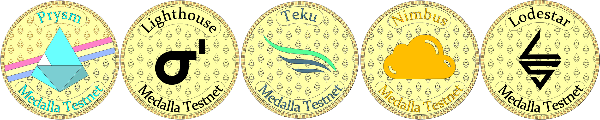

# Guide \| Medalla ETH 2.0 Adventures with POAP

## \*\*\*\*🔥 Your **Mission**

To celebrate the launch eth2 multi-client testnet Medella and learn how to setup and participate with five different eth2 clients.

## \*\*\*\*😁 Your R**eward**

Immense personal satisfaction of gaining eth2 knowledge and POAP badges! There's 1 per unique eth2 client to collect.


What the POAP you may ask? Proof of Attendance Protocol is a dapp that distributes badges in the form of ERC-721 tokens to prove you participated in an event. [More info here.](https://www.beaconcha.in/poap)


## 👩💻 3 simple steps to ETH 2.0 enlightenment and POAP collectibles.


Don't delay! POAP tokens will only be distributed if you propose a block within the first 300,000 blocks or abut first six weeks.


### 🧩 1. Register for poap rewards

1. Visit [https://beaconcha.in/poap](https://beaconcha.in/poap)
2. Enter your Eth 1.0 mainnet public address
3. Add the generated graffiti tag to your validator clients!

### ⚙ 2. Learn to validate with different ETH2 clients with graffiti


Each time you propose a block with a different client, your block will contain your graffiti tag which entitles you to claim your POAP token for that client!



**WARNING**: DO NOT USE THE SAME VALIDATOR KEYS TO VALIDATE WITH ANOTHER CLIENT, OR YOU WILL GET SLASHED. EACH VALIDATOR CLIENT MUST HAVE IT'S OWN KEY.



















**Warning**: Nimbus may have troubles working. Make sure to pull in the latest source code updates and re-build the client.







**Warning**: Lodestar may have troubles working. Make sure to pull in the latest source code updates and re-build the client.




### 🌜 3. Claim POAP Rewards

Distributed via a merkle drop or a reverse airdrop. You can claim your POAP tokens at your leisure.


Did you know your POAP tokens are transferable? Move them to deep, cold and sweet hardware storage.



Congrats on making to eth2 moon base. Hope you had fun! See you at mainnet launch! 🚀 


## 🐶 Reference Material





