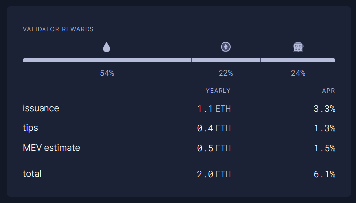

# Guide | MEV-boost for Ethereum Staking


The following steps align with our [mainnet guide](../guide-or-how-to-setup-a-validator-on-eth2-mainnet/). You may need to adjust file names and directory locations where appropriate. The core concepts remain the same.


## :question:What is mev-boost?

* Enables solo and home stakers access to MEV, Maximal Extractible Value.
* Enables validators to earn higher block rewards.
* Optional and not required for ETH staking.
* Open source middleware run by validators to access a competitive block-building market.
* Built by Flashbots as an implementation of [proposer-builder separation (PBS)](https://ethresear.ch/t/proposer-block-builder-separation-friendly-fee-market-designs/9725) for proof-of-stake (PoS) Ethereum.
* `home-staker (you) >> mevboost >> relay >> builder >> searcher +/-  frontrun/sandwich += efficient markets :)`


**tldr**: As of August 2023, MEV is estimated be 24% of a validator rewards. Other estimates suggest it can [boost staking rewards by over 60%.](https://hackmd.io/@flashbots/mev-in-eth2)


<figure><figcaption><p>Estimated earnings per validator. Source: <a href="https://ultrasound.money/">https://ultrasound.money</a></p></figcaption></figure>

## :hammer\_pick: How to MEV?


**Prerequisite:** You run a full Ethereum node (Execution Layer client \[e.g. geth/besu/nethermind/erigon] + Consensus Layer client \[e.g. prysm/lighthouse/teku/lodestar/nimbus]) and a validator.


### Step 1: Create mevboost service account

The systemd service will run under this account, `mevboost`

```bash
sudo useradd --no-create-home --shell /bin/false mevboost
```

### Step 2: Install mevboost

* Downloading binaries is often faster and more convenient.&#x20;
* Building from source code can offer better compatibility and is more aligned with the spirit of FOSS (free open source software).

<details>

<summary>Option 1 - Download binaries</summary>

Run the following to automatically download the latest linux release, un-tar and cleanup.

```bash
RELEASE_URL="https://api.github.com/repos/flashbots/mev-boost/releases/latest"
BINARIES_URL="$(curl -s $RELEASE_URL | jq -r ".assets[] | select(.name) | .browser_download_url" | grep linux_amd64.tar.gz$)"

echo Downloading URL: $BINARIES_URL

cd $HOME
# Download
wget -O  mev-boost.tar.gz $BINARIES_URL
# Untar
tar -xzvf mev-boost.tar.gz -C $HOME
# Cleanup
rm mev-boost.tar.gz LICENSE README.md
```

Install the binaries.

<pre class="language-bash"><code class="lang-bash"><strong>sudo mv $HOME/mev-boost /usr/local/bin
</strong></code></pre>

</details>

<details>

<summary>Option 2 - Build from source code</summary>

Install build dependencies.

```bash
sudo apt -y install build-essential
```

Install Go and removing any previous Go installations.

<pre class="language-bash"><code class="lang-bash"><strong>cd $HOME
</strong>wget -O go.tar.gz https://go.dev/dl/go1.19.6.linux-amd64.tar.gz
sudo rm -rf /usr/local/go &#x26;&#x26; sudo tar -C /usr/local -xzf go.tar.gz
rm go.tar.gz
echo export PATH=$PATH:/usr/local/go/bin >> $HOME/.bashrc
source $HOME/.bashrc
</code></pre>

Verify that you've installed Go 1.18+ by printing the version information.

```bash
go version
```

Install mev-boost with `go install`

```bash
CGO_CFLAGS="-O -D__BLST_PORTABLE__" go install github.com/flashbots/mev-boost@latest
```

Install binaries to `/usr/local/bin` and update ownership permissions.

```bash
sudo cp $HOME/go/bin/mev-boost /usr/local/bin
```

</details>

Create the mevboost systemd unit file.

```bash
sudo nano /etc/systemd/system/mevboost.service
```

The `ExecStart` line lists relays: **Flashbots, UltraSound, Aestus, bloXroute Max Profit, WenMerge**. Remove or add other relays according to your preferences. Add as many or as few relays as you wish.


Find relay endpoints at:

* [MEV Relay List](mev-relay-list.md)
* [https://boost.flashbots.net](https://boost.flashbots.net/)
* [https://github.com/remyroy/ethstaker/blob/main/MEV-relay-list.md](https://github.com/remyroy/ethstaker/blob/main/MEV-relay-list.md)

Multiple relays can be specified by `-relay`

Example:

```
-relay https://RELAY1.COM \
-relay https://RELAY2.COM \
-relay https://RELAY3.COM

Important: Ensure each relay line ends with \ except the last relay line.
```


Paste the following into your `mevboost.service` file. To exit and save from the `nano` editor, press `Ctrl` + `X`, then `Y`, then`Enter`.

```bash
[Unit]
Description=MEV-Boost Service for Ethereum Mainnet
Wants=network-online.target
After=network-online.target
Documentation=https://www.coincashew.com

[Service]
User=mevboost
Group=mevboost
Type=simple
Restart=always
RestartSec=5
ExecStart=/usr/local/bin/mev-boost \
  -mainnet \
  -min-bid 0.03 \
  -relay-check \
  -relay https://0xac6e77dfe25ecd6110b8e780608cce0dab71fdd5ebea22a16c0205200f2f8e2e3ad3b71d3499c54ad14d6c21b41a37ae@boost-relay.flashbots.net \
  -relay https://0xa1559ace749633b997cb3fdacffb890aeebdb0f5a3b6aaa7eeeaf1a38af0a8fe88b9e4b1f61f236d2e64d95733327a62@relay.ultrasound.money \
  -relay https://0xa15b52576bcbf1072f4a011c0f99f9fb6c66f3e1ff321f11f461d15e31b1cb359caa092c71bbded0bae5b5ea401aab7e@aestus.live \
  -relay https://0x8b5d2e73e2a3a55c6c87b8b6eb92e0149a125c852751db1422fa951e42a09b82c142c3ea98d0d9930b056a3bc9896b8f@bloxroute.max-profit.blxrbdn.com \
  -relay https://0x8c7d33605ecef85403f8b7289c8058f440cbb6bf72b055dfe2f3e2c6695b6a1ea5a9cd0eb3a7982927a463feb4c3dae2@relay.wenmerge.com

[Install]
WantedBy=multi-user.target
```


Using `-min-bid` flag, you can set a minimum bid value in ETH.&#x20;

* If all relays cannot bid higher than your minimum value, then your local execution client will produce the block.&#x20;
* By setting this value, you can capture MEV opportunities for higher value blocks and maintain a degree of control for local block production which helps strengthen censorship resistance and a neutral Ethereum network.&#x20;


Reload systemctl to pickup the new service file.

```bash
sudo systemctl daemon-reload
```


**Good to know**: If you add or remove relay endpoints, you'll need to re-run this systemctl`daemon-reload` command and restart the mevboost services.

```bash
sudo systemctl daemon-reload
sudo systemctl restart mevboost
```


Enable mevboost to automatically startup at system reboots and start the service.

```bash
sudo systemctl enable mevboost
sudo systemctl start mevboost
```

Check that the service started successfully.

```bash
sudo systemctl status mevboost
```

Sample of systemd logs showing mevboost running nominally.

```
● mevboost.service - mev-boost ethereum mainnet
     Loaded: loaded (/etc/systemd/system/mevboost.service; enabled; vendor preset: enabled)
     Active: active (running) since Mon 2022-09-17 23:32:00; 10s ago
   Main PID: 12321 (mev-boost)
      Tasks: 11 (limit: 34236)
     Memory: 15.4M
     CGroup: /system.slice/mevboost.service
             └─12321 /usr/local/bin/mev-boost -mainnet -relay-check -relays https://0xac6e77dfe25ecd6110b8e780608cce0dab71fdd5ebea22a16c0205200f2f8e2e3ad3b71d3499c54ad14d6c21b41a37ae@boost-relay.flashbots.net,https://0xad0a8bb54565c2211cee576363f3>
```

View Logs with the following command:

```bash
sudo journalctl -fu mevboost
```

Sample of logs showing mevboost running nominally.

```
Sep 17 23:32:23 ethstaker systemd[1]: Started MEV-Boost Relay.
Sep 17 23:32:23 ethstaker mev-boost[12321]: time="2022-09-17T23:32:32-00:00" level=info msg="mev-boost v1.3.1" module=cli
Sep 17 23:32:23 ethstaker mev-boost[12321]: time="2022-09-17T23:32:32-00:00" level=info msg="Using genesis fork version: 0x00000000" module=cli
Sep 17 23:32:23 ethstaker mev-boost[12321]: time="2022-09-17T23:32:32-00:00" level=info msg="using 2 relays" module=cli relays="[{0xac6e77dfe25ecd6110b8e780608cce0dab71fdd5ebea22a16c0205200f2f8e2e3ad3b71d3499c54ad14d6c21b41a37ae https://0xac6e77dfe25ecd6110b8e780608cce0dab71fdd5ebea22a16c0205200f2f8e2e3ad3b71d3499c54ad14d6c21b41a37ae@boost-relay.flashbots.net} {0xad0a8bb54565c2211cee576363f3a347089d2f07cf72679d16911d740262694cadb62d7fd7483f27afd714ca0f1b9118 https://0xad0a8bb54565c2211cee576363f3a347089d2f07cf72679d16911d740262694cadb62d7fd7483f27afd714ca0f1b9118@bloxroute.ethical.blxrbdn.com}]"
Sep 17 23:32:23 ethstaker mev-boost[12321]: time="2022-09-17T23:32:32-00:00" level=info msg="Checking relay" module=service relay="https://0xac6e77dfe25ecd6110b8e780608cce0dab71fdd5ebea22a16c0205200f2f8e2e3ad3b71d3499c54ad14d6c21b41a37ae@boost-relay.flashbots.net"
Sep 17 23:32:23 ethstaker mev-boost[12321]: time="2022-09-17T23:32:32-00:00" level=info msg="Checking relay" module=service relay="https://0xad0a8bb54565c2211cee576363f3a347089d2f07cf72679d16911d740262694cadb62d7fd7483f27afd714ca0f1b9118@bloxroute.ethical.blxrbdn.com"
Sep 17 23:32:23 ethstaker mev-boost[12321]: time="2022-09-17T23:32:32-00:00" level=info msg="listening on localhost:18550" module=cli
```

### Step 3: Update consensus client and validator


Both the consensus layer client and validator will require additional **Builder API** flags.


**Consensus Client Layer Changes (beacon chain)**

Add the appropriate flag to the `ExecStart` line of your **consensus** **client** service file.&#x20;

Select the tab appropriate to your staking setup.

To exit and save from the `nano` editor, press `Ctrl` + `X`, then `Y`, then`Enter`.



```bash
sudo nano /etc/systemd/system/consensus.service
```



```bash
sudo nano /etc/systemd/system/beacon-chain.service
```





```
--builder http://127.0.0.1:18550
```



#### Option 1: Systemd service file configuration - Use for V2 Teku staking setup&#x20;

If your Teku client is configured by --parameters in the **systemd service file,** add the following changes.

```bash
--validators-builder-registration-default-enabled=true --builder-endpoint=http://127.0.0.1:18550
```

#### Option 2: TOML Configuration - Use for V1 Teku staking setup

If your Teku client is configured by passing in a **TOML file (i.e. teku.yaml),** edit `teku.yaml` with nano.

```bash
sudo nano /etc/teku/teku.yaml
```

Add the following lines to the yaml file:

```bash
# mevboost
validators-builder-registration-default-enabled: true
builder-endpoint: "http://127.0.0.1:18550"
```


Use one configuration or the other but not both!




```
--builder --builder.urls http://127.0.0.1:18550
```



```
--payload-builder=true --payload-builder-url=http://127.0.0.1:18550
```



```
--http-mev-relay=http://127.0.0.1:18550
```



For example, here is the expected result of an updated `ExecStart` line of a **V2 Staking Setup Prysm consensus** **client** service file.&#x20;

Flag is added on the last line.

When adding a new line, notice that previous lines require a backslash `\`

```bash
ExecStart=/usr/local/bin/beacon-chain \
  --mainnet \
  --checkpoint-sync-url=https://beaconstate.info \
  --genesis-beacon-api-url=https://beaconstate.info \
  --execution-endpoint=http://localhost:8551 \
  --jwt-secret=/secrets/jwtsecret \
  --suggested-fee-recipient=0x_CHANGE_THIS_TO_MY_ETH_FEE_RECIPIENT_ADDRESS \
  --accept-terms-of-use \
  --http-mev-relay=http://127.0.0.1:18550
```

**Validator Client Changes**


**Using Teku or Nimbus?** Skip this section on validator client changes. MEV configuration is set in your **consensus.service** file during the prior step.&#x20;


If required, add the appropriate flag to the `ExecStart` line of your **validator** **client** service file. To exit and save from the `nano` editor, press `Ctrl` + `X`, then `Y`, then`Enter`.

```bash
sudo nano /etc/systemd/system/validator.service
```



```
--builder-proposals
```



:fire:**TIP: Only do the following if running Teku validator in a separate client.**&#x20;

:octagonal\_sign: **Most common Teku setups DO NOT use this configuration.**&#x20;

:information\_source: **V2 and V1 staking setups DO NOT use this configuration.**

```bash
--validators-builder-registration-default-enabled=true
--validators-proposer-config="/var/lib/teku/proposerConfig.json"
```

Create a proposerConfig.json file with the following:

```bash
sudo nano /var/lib/teku/proposerConfig.json
```

For example, enable MEV by default, and keep it disabled for a specific key.

```
{
  "proposer_config": {
    "0xa057816155ad77931185101128655c0191bd0214c201ca48ed887f6c4c6adf334070efcd75140eada5ac83a92506dd7a": {
      "fee_recipient": "0x50155530FCE8a85ec7055A5F8b2bE214B3DaeFd3",
      "builder": {
        "enabled": false
      }
    }
  },
  "default_config": {
    "fee_recipient": "0x6e35733c5af9B61374A128e6F85f553aF09ff89A",
    "builder": {
      "enabled": true
    }
  }
}
```

Update file ownership permissions.

```bash
sudo chown consensus:consensus /var/lib/teku/proposerConfig.json
```



```
--builder
```



Runs in consensus client, not needed.



```
--enable-builder
```



For example, here is the expected result of an updated `ExecStart` line of a **V2 Staking Setup Prysm validator client** service file.&#x20;

Flag is added on the last line.

When adding a new line, notice that previous lines require a backslash `\`

```bash
ExecStart=/usr/local/bin/validator \
  --mainnet \
  --accept-terms-of-use \
  --datadir=/var/lib/prysm/validators \
  --beacon-rpc-provider=localhost:4000 \
  --wallet-dir=/var/lib/prysm/validators \
  --wallet-password-file=/var/lib/prysm/validators/password.txt \
  --graffiti "" \
  --suggested-fee-recipient=<0x_CHANGE_THIS_TO_MY_ETH_FEE_RECIPIENT_ADDRESS> \
  --enable-builder
```

After configuring your consensus client and validator to enable mevboost, reload and restart your services. Finally, verify your logs look error-free and show use of the new MEV configurations.



**Lighthouse, Lodestar, Prysm**

<pre class="language-bash"><code class="lang-bash"><strong>sudo systemctl daemon-reload
</strong>sudo systemctl restart consensus validator

sudo journalctl -fu consensus
sudo journalctl -fu validator
</code></pre>

**Teku or Nimbus**

<pre class="language-bash"><code class="lang-bash"><strong>sudo systemctl daemon-reload
</strong>sudo systemctl restart consensus

sudo journalctl -fu consensus
</code></pre>



**Lighthouse, Lodestar, Prysm**

<pre class="language-bash"><code class="lang-bash"><strong>sudo systemctl daemon-reload
</strong>sudo systemctl restart beacon-chain validator

sudo journalctl -fu beacon-chain
sudo journalctl -fu validator
</code></pre>

**Teku or Nimbus**

<pre class="language-bash"><code class="lang-bash"><strong>sudo systemctl daemon-reload
</strong>sudo systemctl restart beacon-chain

sudo journalctl -fu beacon-chain
</code></pre>




Congrats! Your validator with mev-boost will earn more rewards when proposing a block.


## :dart: How to Update MEV-boost

Update to the latest release with the following commands.

[Review the latest MEV-boost release notes](https://github.com/flashbots/mev-boost/releases) for new requirements or breaking changes.

<details>

<summary>Option 1 - Download binaries</summary>

Run the following to automatically download the latest linux release, un-tar and cleanup.

```bash
RELEASE_URL="https://api.github.com/repos/flashbots/mev-boost/releases/latest"
BINARIES_URL="$(curl -s $RELEASE_URL | jq -r ".assets[] | select(.name) | .browser_download_url" | grep linux_amd64.tar.gz$)"

echo Downloading URL: $BINARIES_URL

cd $HOME
# Download
wget -O  mev-boost.tar.gz $BINARIES_URL
# Untar
tar -xzvf mev-boost.tar.gz -C $HOME
# Cleanup
rm mev-boost.tar.gz LICENSE README.md
```

Stop the service, install the binaries and start the service.

```bash
sudo systemctl stop mevboost
sudo mv $HOME/mev-boost /usr/local/bin
sudo systemctl start mevboost
```

Verify the new version number.

```bash
/usr/local/bin/mev-boost --version
```

</details>

<details>

<summary>Option 2 - Build from source code</summary>

Compile new binaries and stop the service.

```bash
CGO_CFLAGS="-O -D__BLST_PORTABLE__" go install github.com/flashbots/mev-boost@latest
sudo systemctl stop mevboost
```

Install new binaries and start the service.

```bash
sudo cp ~/go/bin/mev-boost /usr/local/bin
sudo systemctl start mevboost
```

Verify the new version number.

```bash
/usr/local/bin/mev-boost --version
```

</details>

## :wastebasket: Uninstalling MEV-boost

```bash
sudo systemctl stop mevboost
sudo systemctl disable mevboost
sudo rm /etc/systemd/system/mevboost.service
sudo rm /usr/local/bin/mev-boost
sudo userdel mevboost
```

Finally, remove the Builder API changes made in step 3 to your consensus client and validator.

## :question: FAQ

<details>

<summary>How do I verify I'm registered with my relays?</summary>

Verify that your validator is registered with a particular relay by making a request to the relay's API.

You can either manually query the relay's API or use [dabauxi's Check MEV-Boost Relay Registration script](https://github.com/dabauxi/check-mevboost-registration).

### Check MEV-Boost Relay Registration by dabauxi&#x20;

Review notes and source code [here](https://github.com/dabauxi/check-mevboost-registration). Requires python.

```
# Install python
sudo apt install python3

# Download the script
wget https://raw.githubusercontent.com/dabauxi/check-mevboost-registration/main/check_mevboost_registration.py

# Assign execution permissions
chmod +x check_mevboost_registration.py

# Check mevboost registration
./check_mevboost_registration.py <your-validator-address>
```

Sample output showing your validator's registration to relays.

```
./check_mevboost_registration.py 0x8000a44457e18388c5be046e22e86aedae1a07638394df63adfcd32d29b4e86c030219e94782ebebe398c9a05a8a28e7

Validator '0x8000a44457e18388c5be046e22e86aedae1a07638394df63adfcd32d29b4e86c030219e94782ebebe398c9a05a8a28e7'
Relay: 'bloxroute.ethical.blxrbdn.com', ❌ not found
Relay: 'relay.edennetwork.io', ❌ not found
Relay: 'builder-relay-mainnet.blocknative.com', ✔️ registered
Relay: 'bloxroute.max-profit.blxrbdn.com', ✔️ registered
Relay: 'boost-relay.flashbots.net', ✔️ registered
Relay: 'bloxroute.regulated.blxrbdn.com', ❌ not found
Relay: 'builder-relay-mainnet.blocknative.com', ✔️ registered
Relay: 'relay.edennetwork.io', ❌ not found
Relay: 'mainnet-relay.securerpc.com', ✔️ registered
Relay: 'relayooor.wtf', ✔️ registered
Relay: 'relay.ultrasound.money', ✔️ registered
Relay: 'agnostic-relay.net', ✔️ registered
```

### &#x20;Check Manually

For example, to verify that your validator is registered with the flashbots relay, enter the following URL into your browser. Replace `<myPubKey>` with the public key of your validator and you will see registration data such as your fee recipient address.

```
https://boost-relay.flashbots.net/relay/v1/data/validator_registration?pubkey=<myPubKey>
```

Sample command:

```
https://boost-relay.flashbots.net/relay/v1/data/validator_registration?pubkey=0xb510871a4600b184e83b1ca28402e4de31b5db968f28196419ab64c6e4e2b39920815a61b0bdfe8c928ae8a4db308517
```

Sample output:

```
{"message":{"fee_recipient":"0xebec795c9c8bbd61ffc14a6662944748f299cacf","gas_limit":"30000000","timestamp":"1663454829","pubkey":"0xb510871a4600b184e83b1ca28402e4de31b5db968f28196419ab64c6e4e2b39920815a61b0bdfe8c928ae8a4db308517"},"signature":"0xaeaffeb2f67f378fc8e0e31929a958bf51895d64e93246372e6bb8609c15b3d64b4ad56a5454bc3ac1be0bc57dce031c12c066c973125312d7e4c5020509edd0aaf98a6a190081305723a89e3dcd7b3f6b1ca40b92bb1a50e5714c28407e1bf9"}
```

</details>

<details>

<summary>Where will I get MEV-boost payments?</summary>

When a block is produced using MEV-boost, you may receive your payment in 1 of 3 ways.

Specifically, your MEV payment may arrive as:

1\) by setting you as the block's Fee Recipient&#x20;

2\) an internal transaction

3\) or a normal transaction

</details>

<details>

<summary>Why run MEV-boost?</summary>

Refer to [this article by Stephane Gosslin](https://writings.flashbots.net/writings/why-run-mevboost), which explains the benefits of MEV-boost to the network and you, as a validator.

</details>

<details>

<summary>How does MEV-boost work?</summary>

* Ethereum stakers must run three pieces of software: a validator client, consensus client, and an execution client.
* MEV-boost is a separate piece of open source software, which queries and outsources block-building to a network of builders.
* Block builders prepare full blocks, optimizing for MEV extraction and fair distribution of rewards.
* They then submit their blocks to relays.

<!---->

* Relays aggregate blocks from **multiple** builders in order to select the block with the highest fees.
* One instance of MEV-boost can be configured by a validator to connect to **multiple** relays.
* The Consensus Layer client of a validator proposes the most profitable block received from MEV-boost to the Ethereum network for attestation and block inclusion.


</details>

<details>

<summary>What are the risks of running MEV-boost?</summary>

* Adding more relays increases risk of adding a "bad" relay (hacked, withholds bid, performance issues) and causes your validator to miss a proposal.
* More relays = more chance of getting a high-bid block however this also increases chance of getting rugged by "bad" relays and missing a proposal.Requires trust that relays and block builders will act honestly. MEV is not yet a trust-less process until there is protocol-level proposer-builder-separation (PBS).

Detailed explanation: [https://writings.flashbots.net/writings/understanding-mev-boost-liveness-risks](https://writings.flashbots.net/writings/understanding-mev-boost-liveness-risks/)

Summary of risks: Only add relays you trust.

</details>

<details>

<summary>What's the real-time status of MEV?</summary>

Track network participation, recent MEV blocks, top relays and block builders at [https://www.mevboost.org](https://www.mevboost.org/)

</details>

<details>

<summary>I'm using multiple relays. Which one is chosen?</summary>

If multiple relays are available, the relay bidding highest MEV reward will be chosen. If all relays are not available, the local execution client builds the block without MEV.

</details>

<details>

<summary>What's makes a MEV relay ethical or not?</summary>

Based on varying degrees of profit or censorship, MEV relays can decide on what transactions to bundle in a block.

* Ethical relays: will not censor transactions or profit from front running / sandwich attacks, which is harmful to everyday users on Ethereum.
* OFAC relays: will censor transactions according to the OFAC list.
* Maximal profit relays: profit is all that matters, ethics have no meaning.

</details>

<details>

<summary>Do I need to open any incoming ports on the firewall?</summary>

No changes needed. mevboost only makes outgoing tcp calls.

</details>

## :track\_next: Next Steps

* :moneybag: **MEV Smoothing:** Earn rewards on a consistent basis! Potentially share lottery blocks. Average out your MEV rewards.
  * **Smoothly -** [**https://docs.smoothly.money/how-to-guide**](https://docs.smoothly.money/how-to-guide)
  * **Dappnode's Smooth -** [**https://smooth.dappnode.io/how-to**](https://smooth.dappnode.io/how-to)
* :new: **Stay Updated**: Subscribe to [flashbot's mev-boost repository](https://github.com/flashbots/mev-boost/releases) to be notified of new releases. Hit the Notifications button.
* :telephone\_receiver: **Stay in contact**: Follow [MEV-Boost Twitter contributors](https://github.com/thegostep/awesome-mev-boost#twitter)
* :rocket: **Future ideas**: Learn about the future of MEV democratized by [PBS](https://members.delphidigital.io/reports/the-hitchhikers-guide-to-ethereum/).
* ​:confetti\_ball: **Support us on Gitcoin Grants:** We build this guide exclusively by community support!🙏

## :books: References

* [https://github.com/remyroy/ethstaker/blob/main/prepare-for-the-merge.md#choosing-and-configuring-an-mev-solution](https://github.com/remyroy/ethstaker/blob/main/prepare-for-the-merge.md#choosing-and-configuring-an-mev-solution)
* [https://github.com/flashbots/mev-boost/wiki/Testing](https://github.com/flashbots/mev-boost/wiki/Testing)
* [https://boost.flashbots.net/](https://boost.flashbots.net/)
* [https://github.com/flashbots/mev-boost/blob/main/README.md](https://github.com/flashbots/mev-boost/blob/main/README.md)

## :thumbsup: Credits

Inspired by [Remyroy's Guide on how to Prepare for The Merge](https://github.com/remyroy/ethstaker/blob/main/prepare-for-the-merge.md#choosing-and-configuring-an-mev-solution)
