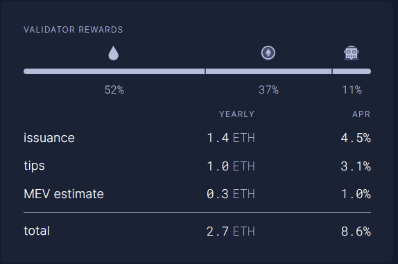

# Guide | MEV-boost for Ethereum Staking


The following steps align with our [mainnet guide](../guide-or-how-to-setup-a-validator-on-eth2-mainnet/). You may need to adjust file names and directory locations where appropriate. The core concepts remain the same.


## :question:What is mev-boost?

* Enables solo and home stakers access to MEV, Maximal Extractible Value.
* Enables validators to earn higher block rewards.
* Optional and not required for ETH staking.
* Open source middleware run by validators to access a competitive block-building market.
* Built by Flashbots as an implementation of [proposer-builder separation (PBS)](https://ethresear.ch/t/proposer-block-builder-separation-friendly-fee-market-designs/9725) for proof-of-stake (PoS) Ethereum.
* `home-staker (you) >> mevboost >> relay >> builder >> searcher +/-  frontrun/sandwich += efficient markets :)`


**tldr**: MEV is estimated be 11% of a validator rewards. Other estimates suggest it can [boost staking rewards by over 60%.](https://hackmd.io/@flashbots/mev-in-eth2)


<figure><figcaption><p>Estimated earnings per validator. Source: <a href="https://ultrasound.money/">https://ultrasound.money</a></p></figcaption></figure>

## :hammer\_pick: How to MEV?


**Prerequisite:** You run a full Ethereum node (Execution Layer client \[e.g. geth/besu/nethermind/erigon] + Consensus Layer client \[e.g. prysm/lighthouse/teku/lodestar/nimbus]) and a validator.


### 1) Install Go 1.18+

First start by installing Go and removing any previous Go installations.

<pre class="language-bash"><code class="lang-bash"><strong>cd $HOME
</strong>wget https://go.dev/dl/go1.19.1.linux-amd64.tar.gz
sudo rm -rf /usr/local/go &#x26;&#x26; sudo tar -C /usr/local -xzf go1.19.1.linux-amd64.tar.gz
rm go1.19.1.linux-amd64.tar.gz
</code></pre>

Add `/usr/local/go/bin` to the `PATH` environment variable.

```bash
export PATH=$PATH:/usr/local/go/bin
echo 'PATH="$PATH:/usr/local/go/bin"' >> ~/.profile
```

Verify that you've installed Go 1.18+ by printing the version information.

```bash
go version
```

### 2) Create mevboost service account

The systemd service will run under this account, `mevboost`

```bash
sudo useradd --no-create-home --shell /bin/false mevboost
```

### 3) Install mevboost

Install build dependencies.

```bash
sudo apt -y install build-essential
```

Install mev-boost with `go install`

```bash
CGO_CFLAGS="-O -D__BLST_PORTABLE__" go install github.com/flashbots/mev-boost@latest
```

Install binaries to `/usr/local/bin` and update ownership permissions.

<pre class="language-bash"><code class="lang-bash">sudo cp $HOME/go/bin/mev-boost /usr/local/bin
<strong>sudo chown mevboost:mevboost /usr/local/bin/mev-boost
</strong></code></pre>

Create the mevboost systemd unit file.

```bash
sudo nano /etc/systemd/system/mevboost.service
```

The `ExecStart` line lists five relays, **Agnostic, UltraSound, Aestus, bloXroute Max Profit and bloXroute Ethical**. Remove or add other relays according to your ethical preferences. Add as many relays as you wish.


Find relay endpoints at:

* [MEV Relay List](mev-relay-list.md)
* [https://boost.flashbots.net](https://boost.flashbots.net/)
* [https://github.com/remyroy/ethstaker/blob/main/MEV-relay-list.md](https://github.com/remyroy/ethstaker/blob/main/MEV-relay-list.md)

Multiple relays can be specified by `-relay`

Example:

```
-relay https://RELAY1.COM \
-relay https://RELAY2.COM \
-relay https://RELAY3.COM

Important: Ensure each relay line ends with \ except the last relay line.
```


Paste the following into your `mevboost.service` file. To exit and save from the `nano` editor, press `Ctrl` + `X`, then `Y`, then`Enter`.

```bash
[Unit]
Description=mev-boost ethereum mainnet
Wants=network-online.target
After=network-online.target

[Service]
User=mevboost
Group=mevboost
Type=simple
Restart=always
RestartSec=5
ExecStart=/usr/local/bin/mev-boost \
  -mainnet \
  -min-bid 0.05 \
  -relay-check \
  -relay https://0xad0a8bb54565c2211cee576363f3a347089d2f07cf72679d16911d740262694cadb62d7fd7483f27afd714ca0f1b9118@bloxroute.ethical.blxrbdn.com \
  -relay https://0xa7ab7a996c8584251c8f925da3170bdfd6ebc75d50f5ddc4050a6fdc77f2a3b5fce2cc750d0865e05d7228af97d69561@agnostic-relay.net \
  -relay https://0xa1559ace749633b997cb3fdacffb890aeebdb0f5a3b6aaa7eeeaf1a38af0a8fe88b9e4b1f61f236d2e64d95733327a62@relay.ultrasound.money \
  -relay https://0xa15b52576bcbf1072f4a011c0f99f9fb6c66f3e1ff321f11f461d15e31b1cb359caa092c71bbded0bae5b5ea401aab7e@aestus.live \
  -relay https://0x8b5d2e73e2a3a55c6c87b8b6eb92e0149a125c852751db1422fa951e42a09b82c142c3ea98d0d9930b056a3bc9896b8f@bloxroute.max-profit.blxrbdn.com

[Install]
WantedBy=multi-user.target
```


Using `-min-bid` flag, you can set a minimum bid value in ETH.&#x20;

* If all relays cannot bid higher than your minimum value, then your local execution client will produce the block.&#x20;
* By setting this value, you can capture MEV opportunities for higher value blocks and maintain a degree of control for local block production which helps strengthen censorship resistance and a neutral Ethereum network.&#x20;


Reload systemctl to pickup the new service file.

```bash
sudo systemctl daemon-reload
```


**Good to know**: If you add or remove relay endpoints, you'll need to re-run this systemctl`daemon-reload` command and restart the mevboost services.


Enable mevboost to automatically startup at system reboots and start the service.

```bash
sudo systemctl enable mevboost
sudo systemctl start mevboost
```

Check that the service started successfully.

```bash
sudo systemctl status mevboost
```

Sample of systemd logs showing mevboost running nominally.

```
● mevboost.service - mev-boost ethereum mainnet
     Loaded: loaded (/etc/systemd/system/mevboost.service; enabled; vendor preset: enabled)
     Active: active (running) since Mon 2022-09-17 23:32:00; 10s ago
   Main PID: 12321 (mev-boost)
      Tasks: 11 (limit: 34236)
     Memory: 15.4M
     CGroup: /system.slice/mevboost.service
             └─12321 /usr/local/bin/mev-boost -mainnet -relay-check -relays https://0xac6e77dfe25ecd6110b8e780608cce0dab71fdd5ebea22a16c0205200f2f8e2e3ad3b71d3499c54ad14d6c21b41a37ae@boost-relay.flashbots.net,https://0xad0a8bb54565c2211cee576363f3>
```

View Logs with the following command:

```bash
sudo journalctl -fu mevboost
```

Sample of logs showing mevboost running nominally.

```
Sep 17 23:32:23 ethstaker systemd[1]: Started MEV-Boost Relay.
Sep 17 23:32:23 ethstaker mev-boost[12321]: time="2022-09-17T23:32:32-00:00" level=info msg="mev-boost v1.3.1" module=cli
Sep 17 23:32:23 ethstaker mev-boost[12321]: time="2022-09-17T23:32:32-00:00" level=info msg="Using genesis fork version: 0x00000000" module=cli
Sep 17 23:32:23 ethstaker mev-boost[12321]: time="2022-09-17T23:32:32-00:00" level=info msg="using 2 relays" module=cli relays="[{0xac6e77dfe25ecd6110b8e780608cce0dab71fdd5ebea22a16c0205200f2f8e2e3ad3b71d3499c54ad14d6c21b41a37ae https://0xac6e77dfe25ecd6110b8e780608cce0dab71fdd5ebea22a16c0205200f2f8e2e3ad3b71d3499c54ad14d6c21b41a37ae@boost-relay.flashbots.net} {0xad0a8bb54565c2211cee576363f3a347089d2f07cf72679d16911d740262694cadb62d7fd7483f27afd714ca0f1b9118 https://0xad0a8bb54565c2211cee576363f3a347089d2f07cf72679d16911d740262694cadb62d7fd7483f27afd714ca0f1b9118@bloxroute.ethical.blxrbdn.com}]"
Sep 17 23:32:23 ethstaker mev-boost[12321]: time="2022-09-17T23:32:32-00:00" level=info msg="Checking relay" module=service relay="https://0xac6e77dfe25ecd6110b8e780608cce0dab71fdd5ebea22a16c0205200f2f8e2e3ad3b71d3499c54ad14d6c21b41a37ae@boost-relay.flashbots.net"
Sep 17 23:32:23 ethstaker mev-boost[12321]: time="2022-09-17T23:32:32-00:00" level=info msg="Checking relay" module=service relay="https://0xad0a8bb54565c2211cee576363f3a347089d2f07cf72679d16911d740262694cadb62d7fd7483f27afd714ca0f1b9118@bloxroute.ethical.blxrbdn.com"
Sep 17 23:32:23 ethstaker mev-boost[12321]: time="2022-09-17T23:32:32-00:00" level=info msg="listening on localhost:18550" module=cli
```

### 4) Update consensus client and validator


Both the consensus layer client and validator will require additional **Builder API** flags.


**Consensus Client Layer Changes (beacon chain)**

Add the appropriate flag to the `ExecStart` line of your **consensus** **client** service file. To exit and save from the `nano` editor, press `Ctrl` + `X`, then `Y`, then`Enter`.

```bash
sudo nano /etc/systemd/system/beacon-chain.service
```



```
--builder http://127.0.0.1:18550
```



If your Teku client is configured by passing in a **TOML file (i.e. teku.yaml),** edit `teku.yaml` with nano.

```
sudo nano /etc/teku/teku.yaml
```

Add the following lines to the yaml file:

```
# mevboost
validators-builder-registration-default-enabled: true
builder-endpoint: "http://127.0.0.1:18550"
```

Alternatively, if your Teku client is configured by --parameters in the **systemd service file,** add the following changes.

```
--validators-builder-registration-default-enabled=true --builder-endpoint=http://127.0.0.1:18550
```


Use one configuration or the other but not both!




```
--builder --builder.urls http://127.0.0.1:18550
```



```
--payload-builder=true --payload-builder-url=http://127.0.0.1:18550
```



```
--http-mev-relay=http://127.0.0.1:18550
```



**Validator Client Changes**

If required, add the appropriate flag to the `ExecStart` line of your **validator** **client** service file. To exit and save from the `nano` editor, press `Ctrl` + `X`, then `Y`, then`Enter`.

```bash
sudo nano /etc/systemd/system/validator.service
```



```
--builder-proposals
```



**WARNING: Only do the following if running Teku validator in a separate client. Most common setups do not use this configuration.**

```
--validators-builder-registration-default-enabled=true
--validators-proposer-config="/etc/teku/proposerConfig.json"
```

Create a proposerConfig.json file with the following:

```
sudo nano /etc/teku/proposerConfig.json
```

For example, enable MEV by default, and keep it disabled for a specific key.

```
{
  "proposer_config": {
    "0xa057816155ad77931185101128655c0191bd0214c201ca48ed887f6c4c6adf334070efcd75140eada5ac83a92506dd7a": {
      "fee_recipient": "0x50155530FCE8a85ec7055A5F8b2bE214B3DaeFd3",
      "builder": {
        "enabled": false
      }
    }
  },
  "default_config": {
    "fee_recipient": "0x6e35733c5af9B61374A128e6F85f553aF09ff89A",
    "builder": {
      "enabled": true
    }
  }
}
```

Update file ownership permissions.

```
sudo chown mevboost:mevboost /etc/teku/proposerConfig.json
```



```
--builder
```



Runs in consensus client, not needed.



```
--enable-builder
```



After configuring your consensus client and validator to enable mevboost, reload and restart your services.

```
sudo systemctl daemon-reload
sudo systemctl restart beacon-chain validator
```

Verify your logs look error-free and show use of the new MEV configurations.

```
journalctl -fu beacon-chain
journalctl -fu validator
```


Congrats! Your validator with mev-boost will earn more rewards when proposing a block.


## :dart: How to Update MEV-boost

Update to the latest release with the following commands.

[Review the latest MEV-boost release notes](https://github.com/flashbots/mev-boost/releases) for new requirements or breaking changes.

Compile new binaries and stop the service.

```bash
CGO_CFLAGS="-O -D__BLST_PORTABLE__" go install github.com/flashbots/mev-boost@latest
sudo systemctl stop mevboost
```

Install new binaries to `/usr/local/bin` and start the service.

```bash
sudo cp ~/go/bin/mev-boost /usr/local/bin
sudo chown mevboost:mevboost /usr/local/bin/mev-boost
sudo systemctl start mevboost
```

## :question: FAQ

<details>

<summary>How do I verify I'm registered with my relays?</summary>

Verify that your validator is registered with a particular relay by making a request to the relay's API.

For example, to verify that your validator is registered with the flashbots relay, enter the following URL into your browser. Replace `<myPubKey>` with the public key of your validator and you will see registration data such as your fee recipient address.

```
https://boost-relay.flashbots.net/relay/v1/data/validator_registration?pubkey=<myPubKey>
```

Sample command:

```
https://boost-relay.flashbots.net/relay/v1/data/validator_registration?pubkey=0xb510871a4600b184e83b1ca28402e4de31b5db968f28196419ab64c6e4e2b39920815a61b0bdfe8c928ae8a4db308517
```

Sample output:

```
{"message":{"fee_recipient":"0xebec795c9c8bbd61ffc14a6662944748f299cacf","gas_limit":"30000000","timestamp":"1663454829","pubkey":"0xb510871a4600b184e83b1ca28402e4de31b5db968f28196419ab64c6e4e2b39920815a61b0bdfe8c928ae8a4db308517"},"signature":"0xaeaffeb2f67f378fc8e0e31929a958bf51895d64e93246372e6bb8609c15b3d64b4ad56a5454bc3ac1be0bc57dce031c12c066c973125312d7e4c5020509edd0aaf98a6a190081305723a89e3dcd7b3f6b1ca40b92bb1a50e5714c28407e1bf9"}
```

</details>

<details>

<summary>Where will I get MEV-boost payments?</summary>

When a block is produced using MEV-boost, the MEV relay sets themselves as the fee recipient and then, in the same block, pays you MEV via a regular ETH transaction to your validator's fee recipient address.

</details>

<details>

<summary>Why run MEV-boost?</summary>

Refer to [this article by Stephane Gosslin](https://writings.flashbots.net/writings/why-run-mevboost), which explains the benefits of MEV-boost to the network and you, as a validator.

</details>

<details>

<summary>How does MEV-boost work?</summary>

* Ethereum stakers must run three pieces of software: a validator client, consensus client, and an execution client.
* MEV-boost is a separate piece of open source software, which queries and outsources block-building to a network of builders.
* Block builders prepare full blocks, optimizing for MEV extraction and fair distribution of rewards.
* They then submit their blocks to relays.

<!---->

* Relays aggregate blocks from **multiple** builders in order to select the block with the highest fees.
* One instance of MEV-boost can be configured by a validator to connect to **multiple** relays.
* The Consensus Layer client of a validator proposes the most profitable block received from MEV-boost to the Ethereum network for attestation and block inclusion.


</details>

<details>

<summary>What are the risks of running MEV-boost?</summary>

* Requires trust that relays and block builders will act honestly. MEV is not yet a trust-less process until there is protocol-level proposer-builder-separation (PBS).

Detailed explanation: [https://writings.flashbots.net/writings/understanding-mev-boost-liveness-risks](https://writings.flashbots.net/writings/understanding-mev-boost-liveness-risks/)

</details>

<details>

<summary>What's the real-time status of MEV?</summary>

Track network participation, recent MEV blocks, top relays and block builders at [https://www.mevboost.org](https://www.mevboost.org/)

</details>

<details>

<summary>I'm using multiple relays. Which one is chosen?</summary>

If multiple relays are available, the relay bidding highest MEV reward will be chosen. If all relays are not available, the local execution client builds the block without MEV.

</details>

<details>

<summary>What's makes a MEV relay ethical or not?</summary>

Based on varying degrees of profit or censorship, MEV relays can decide on what transactions to bundle in a block.

* Ethical relays: will not censor transactions or profit from front running / sandwich attacks, which is harmful to everyday users on Ethereum.
* OFAC relays: will censor transactions according to the OFAC list.
* Maximal profit relays: profit is all that matters, ethics have no meaning.

</details>

## :track\_next: Next Steps

* Subscribe to [flashbot's mev-boost repository](https://github.com/flashbots/mev-boost/releases) to be notified of new releases. Hit the Notifications button.
* Follow [MEV-Boost Twitter contributors](https://github.com/thegostep/awesome-mev-boost#twitter)
* Learn about the future of MEV democratized by [PBS](https://members.delphidigital.io/reports/the-hitchhikers-guide-to-ethereum/).
* ​:confetti\_ball: [**Support us on Gitcoin Grants**](https://gitcoin.co/grants/1653/eth2-staking-guides-by-coincashew)**:** We build this guide exclusively by community support!🙏

## :books: References

* [https://github.com/remyroy/ethstaker/blob/main/prepare-for-the-merge.md#choosing-and-configuring-an-mev-solution](https://github.com/remyroy/ethstaker/blob/main/prepare-for-the-merge.md#choosing-and-configuring-an-mev-solution)
* [https://github.com/flashbots/mev-boost/wiki/Testing](https://github.com/flashbots/mev-boost/wiki/Testing)
* [https://boost.flashbots.net/](https://boost.flashbots.net/)
* [https://github.com/flashbots/mev-boost/blob/main/README.md](https://github.com/flashbots/mev-boost/blob/main/README.md)

## :thumbsup: Credits

Inspired by [Remyroy's Guide on how to Prepare for The Merge](https://github.com/remyroy/ethstaker/blob/main/prepare-for-the-merge.md#choosing-and-configuring-an-mev-solution)
