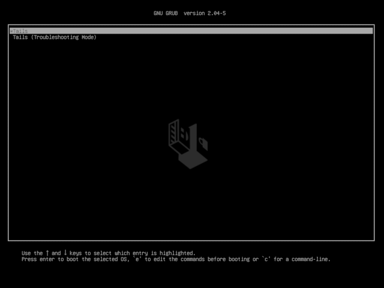

# Setting up Validator Keys

## :seedling: 1. Obtain testnet ETH


Every 32 ETH you own allows you to make 1 validator. You can run thousands of validators with your node. However on testnet, please only run 1 or 2 validators to keep the activation queue reasonably quick.


<details>

<summary>Option 1: Ethstaker's #cheap-holesky-validator Channel</summary>

* **Step 1**: Visit the [Ethstaker Discord](https://discord.io/ethstaker) and join the #cheap-holesky-validator channel

<!---->

* **Step 2**: Use the `/cheap-holesky-deposit` slash command and follow the instructions from the bot. You need to start typing the slash command and it will show above your input box where you can use it.

<!---->

* **Requirement**: In order to use the cheap holesky validator process, you must now set your withdrawal address to `0x4D496CcC28058B1D74B7a19541663E21154f9c84` when creating your validator keys and deposit file. This is to prevent abuses of this service.

</details>

<details>

<summary>Option 2: Use faucet from pk910</summary>

Link: [https://holesky-faucet.pk910.de](https://holesky-faucet.pk910.de/)

</details>

## :key: 2. Generate validator keys

#### Before continuing please have the following:

* [ ] **Hardware wallet address or** [**Safe multisig wallet**](https://app.safe.global/welcome) **address**: This is for your [Withdrawal Address](https://notes.ethereum.org/@launchpad/withdrawals-faq#Q-What-are-the-two-types-of-withdrawals). It must be in checksum format, which means some letters are UPPERCASE. If needed, validate your address's checksum format against a block explorer, such as [https://etherscan.io](https://etherscan.io)
* [ ] **Browser dApp Wallet** (i.e. Metamask) with 32 Ethers for each validator

<figure><figcaption><p>Example of Vitalik's address in checksum format</p></figcaption></figure>

#### Before continuing please understand the following:

* [ ] The **Withdrawal Address** is:
  * where your ETH is returned upon "voluntary exiting a validator", or also known as full withdrawal.
  * where you receive partial withdrawals, which is where any excess balance above 32 ETH is periodically scraped and made available for use.
* [ ] As this is **permanent** once set, **triple check** your address.
* [ ] DO NOT USE AN :octagonal\_sign: **EXCHANGE ADDRESS** :octagonal\_sign: AS WITHDRAWAL ADDRESS.
* [ ] For **testnet purposes** it's okay to use a browser/hot wallet address.


**Offline Key Generation Best Practices**: The mnemonic seed (24 words) to your validator should be protected by keeping them offline. Use Tails OS (see option 3) or a [Linux Live USB with staking-deposit-cli](https://www.youtube.com/watch?v=oDELXYNSS5w) (Option 1) or Wagyu to generate keys.

If this is not possible, at least physically disconnect from the network by unplugging ethernet cable or disconnecting from Wifi.


Ways to create your validator keys:

<details>

<summary>Option 1 for Ubuntu - staking-deposit-cli</summary>

**1. Download** [**staking-deposit-cli**](https://github.com/ethereum/staking-deposit-cli#introduction) **from Github.**

```bash
#Install dependencies
sudo apt install jq curl -y

#Setup variables
RELEASE_URL="https://api.github.com/repos/ethereum/staking-deposit-cli/releases/latest"
BINARIES_URL="$(curl -s $RELEASE_URL | jq -r ".assets[] | select(.name) | .browser_download_url" | grep linux-amd64.tar.gz$)"
BINARY_FILE="staking-deposit-cli.tar.gz"

echo "Downloading URL: $BINARIES_URL"

cd $HOME
#Download binary
wget -O $BINARY_FILE $BINARIES_URL
#Extract archive
tar -xzvf $BINARY_FILE -C $HOME
#Rename
mv staking_deposit-cli*amd64 staking-deposit-cli
cd staking-deposit-cli
```

**2. Make a new mnemonic**

Replace `<HARDWARE_WALLET_ADDRESS>` with withdrawal address.

```
./deposit new-mnemonic --chain holesky --execution_address <HARDWARE_WALLET_ADDRESS>
```

* Choose your language
* Repeat your withdrawal/execution address for confirmation
* Choose the language of the mnemonic word list
* Choose how many new validators you wish to run
* Create a **keystore password** that secures your validator keystore files
* Repeat your **keystore password** for confirmation
* Write down your 24 word mnemonic seed
* Type your mnemonic, first 4 letters is enough

You will see the following messages after successfully generated the keystore(s) and the deposit(s):

```bash

                  #####     #####
                ##     #####     ##
    ###         ##   #######     #########################
    ##  ##      #####               ##                   ##
    ##     #####                 ##                       ##
    ##     ##                     ##                      ###
   ########                        ##                     ####
   ##        ##   ###         #####                       #####
   #                          ##                         # #####
   #                            #                        #  #####
   ##                             ##                    ##
   ##                              ##                   ##
   ##             ###              ##                   ##
   ###############                 ##                   ##
   ###               ##                                 ##
      #############################                    ##
                     ##                             ###
                     #######     #################     ###
                     ##   ## ##        ##   ##    ###
                     ##############          #############

Creating your keys:               [####################################]  <N>/<N>
Creating your keystores:          [####################################]  <N>/<N>
Verifying your keystores:         [####################################]  <N>/<N>
Verifying your deposits:          [####################################]  <N>/<N>

Success!
Your keys can be found at: /home/username/staking-deposit-cli/validator_keys
```

**3. Verify mnemonic seed**

By re-generating the keystore files and comparing them to the originals, the mnemonic seen is verified correct by being reproducible.

```bash
#Make temp directory to verify seeds
mkdir -p ~/staking-deposit-cli/verify_seed
#Re-generate keys
./deposit existing-mnemonic --chain holesky --folder verify_seed --execution_address <HARDWARE_WALLET_ADDRESS>
```

* Choose your language
* Repeat your withdrawal/execution address for confirmation
* Type your mnemonic seed, first 4 letters is enough
* Since this is the first time generating keys, enter the index number as 0.
* Repeat the index to confirm, 0.
* Enter how many validators you with to run (same as before)
* Enter any keystore password, since this is temporary and will be deleted

Compare the **deposit\_data** files.

```bash
diff -s validator_keys/deposit_data*.json verify_seed/validator_keys/deposit_data*.json
```

When the **deposit\_data** files are the same, this means your mnemonic seed is correct.

Example output:

```
Files validator_keys/deposit_data-16945983.json and verify_seed/validator_keys/deposit_data-16647657.json are identical
```

Clean up duplicate files.

```bash
rm -r verify_seed
```

</details>

<details>

<summary>Option 2 for Windows/Linux/Mac - Wagyu GUI</summary>

**Wagyu** is an application aimed at lowering the technical bar to staking on Ethereum.

As a 'one-click installer', it provides a clean UI automating the setup and management of all the infrastructure necessary to stake without the user needing to have any technical knowledge.

**Download Wagyu**: [https://wagyu.gg](https://wagyu.gg/)

1. Click create new secret recovery phrase
2. Select your network
3. Click create
4. Write down your 24 word secret recovery phrase
5. Check your phrase to confirm you copied it correctly
6. Specify number of new keys to generate
7. Specify your keystore password
8. Specify your Withdrawal address
9. Click next
10. Re-type your keystore password
11. Browse to where you want to save your keys
12. Review information and close

</details>

<details>

<summary>Option 3 - Offline Tails with staking-deposit-cli</summary>

You will learn how to boot up a windows PC into an airgapped [Tails operating system](https://tails.boum.org/index.en.html).

The Tails OS is an _amnesic_ operating system, meaning it will save nothing and _leave no tracks behind_ each time you boot it.

**1. Prerequisites**

You need:

* 2 storage mediums (can be USB stick, SD cards or external hard drives)
* One of them must be > 8GB
* Windows or Mac computer
* 30 minutes or longer depending on your download speed

**2. Download Tails OS**

Download the official image from the [Tails website](https://tails.boum.org/install/index.en.html). Might take a while, go grab a coffee.

Make sure you follow the guide on the Tails website to verify your download of Tails.

**3. Download and install the software to transfer your Tails image on your USB stick**

For Windows, use one of

* [Etcher](https://tails.boum.org/etcher/Etcher-Portable.exe)
* [Win32 Disk Imager](https://win32diskimager.org/#download)
* [Rufus](https://rufus.ie/en\_US/)

For Mac, download [Etcher](https://tails.boum.org/etcher/Etcher.dmg)

**4. Making your bootable USB stick**

Run the above software. This is an example how it looks like on Mac OS with etcher, but other software should be similar.


Select the Tails OS image that you downloaded as the image. Then select the USB stick (the larger one).

Then flash the image to the larger USB stick.

**5. Download and verify the staking-deposit-cli**

Download the latest staking-deposit-cli binary by referring to Option 1's steps.

Copy the file to the other USB stick.

**6. Reboot your computer and into Tails OS**

After you have done all the above, you can reboot. If you are connected by a LAN cable to the internet, you can disconnect it manually.

Plug in the USB stick that has your Tails OS.

On Mac, press and hold the Option key immediately upon hearing the startup chime. Release the key after Startup Manager appears.

On Windows, it depends on your computer manufacturer. Usually it is by pressing F1 or F12. If it doesn't work, try googling "Enter boot options menu on \[Insert your PC brand]"

Choose the USB stick that you loaded up with Tails OS to boot into Tails.

**7. Welcome to Tails OS**



You can boot with all the default settings.

**8. Run the staking-deposit-cli**

Plug in your other USB key with the `staking-deposit-cli` file.

Locate the USB key, mount the drive and add execute permissions.

```bash
# Locate the usb key
sudo fdisk -l
# Create a mount point
sudo mkdir -p /media/usb-drive
# Mount the usb key. Change device name
sudo mount /dev/sda1 /media/usb-drive
# Change directories
cd /media/usb-drive/staking-deposit-cli
# Add execute permissions
sudo chmod +x ./deposit
```

**9. Make a new mnemonic**

Replace `<HARDWARE_WALLET_ADDRESS>` with withdrawal address.

```
./deposit new-mnemonic --chain holesky --execution_address <HARDWARE_WALLET_ADDRESS>
```

* Choose your language
* Repeat your withdrawal/execution address for confirmation
* Choose the language of the mnemonic word list
* Choose how many new validators you wish to run
* Create a **keystore password** that secures your validator keystore files
* Repeat your **keystore password** for confirmation
* Write down your 24 word mnemonic seed
* Type your mnemonic, first 4 letters is enough

You will see the following messages after successfully generated the keystore(s) and the deposit(s):

```bash

                  #####     #####
                ##     #####     ##
    ###         ##   #######     #########################
    ##  ##      #####               ##                   ##
    ##     #####                 ##                       ##
    ##     ##                     ##                      ###
   ########                        ##                     ####
   ##        ##   ###         #####                       #####
   #                          ##                         # #####
   #                            #                        #  #####
   ##                             ##                    ##
   ##                              ##                   ##
   ##             ###              ##                   ##
   ###############                 ##                   ##
   ###               ##                                 ##
      #############################                    ##
                     ##                             ###
                     #######     #################     ###
                     ##   ## ##        ##   ##    ###
                     ##############          #############

Creating your keys:               [####################################]  <N>/<N>
Creating your keystores:          [####################################]  <N>/<N>
Verifying your keystores:         [####################################]  <N>/<N>
Verifying your deposits:          [####################################]  <N>/<N>

Success!
Your keys can be found at: /home/username/staking-deposit-cli/validator_keys
```

**Result**: a folder called `validator_keys` containing keystore-m files and deposit\_data.json

**10. Verify mnemonic seed**

By re-generating the keystore files and comparing them to the originals, the mnemonic seen is verified correct by being reproducible.

```bash
#Make temp directory to verify seeds
mkdir verify_seed
#Re-generate keys
./deposit existing-mnemonic --chain holesky --folder verify_seed --execution_address <HARDWARE_WALLET_ADDRESS>
```

* Choose your language
* Repeat your withdrawal/execution address for confirmation
* Type your mnemonic seed, first 4 letters is enough
* Since this is the first time generating keys, enter the index number as 0.
* Repeat the index to confirm, 0.
* Enter how many validators you with to run (same as before)
* Enter any keystore password, since this is temporary and will be deleted

Compare the **deposit\_data** files.

```bash
diff -s validator_keys/deposit_data*.json verify_seed/validator_keys/deposit_data*.json
```

When the **deposit\_data** files are the same, this means your mnemonic seed is correct.

Example output:

```
Files validator_keys/deposit_data-16945983.json and verify_seed/validator_keys/deposit_data-16647657.json are identical
```

Clean up duplicate files.

```bash
rm -r verify_seed
```

If you ran this command directly from your non-Tails USB stick, the validator keys should stay on it.

If it hasn't, copy the directory over to your non-Tails USB stick.

Confirm your validator\_keys are on the USB stick before leaving.

```bash
ls /media/usb-drive/staking-deposit-cli/validator_keys
```

:fire: Make sure you have saved your validator keys directory in your other USB stick (non Tails OS) before you shutdown Tails. Tails will delete everything saved on it after you shutdown.

:tada: Congrats on learning how to use Tails OS to make an air gapped system.

</details>

### Result: There are two types of files generated.

| File type                                                           | Purpose                                                                                                                                                                                                                                        |
| ------------------------------------------------------------------- | ---------------------------------------------------------------------------------------------------------------------------------------------------------------------------------------------------------------------------------------------- |
| <p>Keystore file(s)</p><p>[i.e.. keystore-16945983.json]</p>        | <ul><li>Controls the validator's ability to sign transactions</li><li>Imported and loaded into your validator</li><li>Keep private. Do not share with anyone</li><li>Can be recreated from your mnemonic seed/secret recovery phrase</li></ul> |
| <p>Deposit data file(s)</p><p>[i.e. deposit_data-16945983.json]</p> | <ul><li>Public information about your validator</li><li>Required to execute your deposit through the Ethereum Launchpad</li><li>Can be recreated from your mnemonic seed/secret recovery phrase</li></ul>                                      |

## :arrow\_up: 3. Transfer validator keys to node


**Local node**: Skip this step if you generated your keys on your node with **staking-deposit-cli**. No need to transfer as they're already there.


After creating the validator keys offline, you'll want to copy these validator keys to your node.

To align with this guide's steps, make the default validator\_keys path on your node.

<pre class="language-bash"><code class="lang-bash"><strong>mkdir -p $HOME/staking-deposit-cli/validator_keys
</strong></code></pre>

To transfer validator key files to your node from your local computer, consider using:

<details>

<summary>Option 1 - File Transfer</summary>

* File transfer
  * Windows OS - use [WinSCP](https://winscp.net) or [FileZilla](https://filezilla-project.org/download.php?type=client)
  * Mac or Linux - use [FileZilla](https://filezilla-project.org/download.php?type=client) or [SFTP](https://www.digitalocean.com/community/tutorials/how-to-use-sftp-to-securely-transfer-files-with-a-remote-server) or [rsync](https://linuxize.com/post/how-to-use-rsync-for-local-and-remote-data-transfer-and-synchronization/)

Transfer the **keystore-m\_xxxxxxxx.json** files to the following location on your node.

```bash
$HOME/staking-deposit-cli/validator_keys
```

</details>

<details>

<summary>Option 2 - USB Key</summary>

### **Step 1: From OFFLINE machine, copy validator keys to a USB key.**

Plug the USB key into offline machine, then locate the device name.

```bash
# Locate the usb key
sudo fdisk -l
```

Upon executing the above command you will get an output similar to the one below:

```bash
Disk /dev/sdc: 7.4 GiB, 7948206080 bytes, 15523840 sectors
Units: sectors of 1 * 512 = 512 bytes
Sector size (logical/physical): 512 bytes / 512 bytes
I/O size (minimum/optimal): 512 bytes / 512 bytes
Disklabel type: dos
Disk identifier: 0x00000000

Device     Boot Start      End  Sectors  Size Id Type
/dev/sdc1  *     8192 15555555 25555555 7.4G  b W95 FAT32
```

Mount the key. Change the device name accordingly.

```bash
# Create a mount point
sudo mkdir -p /media/usb-drive
# Mount the usb key
sudo mount /dev/sdc1 /media/usb-drive
```

Copy the keys. Adjust the path names if needed.

```bash
# Create a directory on the usb drive to copy the keys into
sudo mkdir -p /media/usb-drive/staking-deposit-cli/validator_keys
# Copy the keys to the usb drive
sudo cp $HOME/staking-deposit-cli/validator_keys/*.json /media/usb-drive/staking-deposit-cli/validator_keys
# Cleanup
sudo umount /media/usb-drive
```

### **Step 2: From a USB key,  copy validator keys to the NODE.**

Plug the USB key into node, then locate the device name.

```bash
# Locate the usb key
sudo fdisk -l
```

Upon executing the above command you will get an output similar to the one below:

```bash
Disk /dev/sdc: 7.4 GiB, 7948206080 bytes, 15523840 sectors
Units: sectors of 1 * 512 = 512 bytes
Sector size (logical/physical): 512 bytes / 512 bytes
I/O size (minimum/optimal): 512 bytes / 512 bytes
Disklabel type: dos
Disk identifier: 0x00000000

Device     Boot Start      End  Sectors  Size Id Type
/dev/sdc1  *     8192 15555555 25555555 7.4G  b W95 FAT32
```

Mount the key. Change the device name accordingly.

```bash
# Create a mount point
sudo mkdir -p /media/usb-drive
# Mount the usb key
sudo mount /dev/sdc1 /media/usb-drive
```

Copy the keys. Adjust the path names if needed.

```bash
# Create a directory copy the keys into
sudo mkdir -p $HOME/staking-deposit-cli/validator_keys
# Copy the keys to the default path
sudo cp /media/usb-drive/staking-deposit-cli/validator_keys/*.json $HOME/staking-deposit-cli/validator_keys
# Cleanup
sudo umount /media/usb-drive
```

</details>

After transfering the files, verify that the keystore-m files are in the proper location on your node.

```bash
ls -l $HOME/staking-deposit-cli/validator_keys
```

Expected sample output:

```bash
-r--r----- 1 ethereum ethereum 706 Oct  1 02:33 deposit_data-1696645983.json
-r--r----- 1 ethereum ethereum 710 Oct  1 02:33 keystore-m_12381_3600_0_0_0-161664283.json
```

## :woman\_technologist: 4. Deposit transactions at the Launchpad

1. Follow the walk-through at the Launchpad: [https://holesky.launchpad.ethstaker.cc](https://holesky.launchpad.ethstaker.cc)


**Do not send real mainnet ETH during this process!** :octagonal\_sign: Use only Holesky ETH.


2. Upload your`deposit_data-#########.json` found in the `validator_keys` directory.
3. Connect the launchpad with your wallet, review and accept terms. Ensure you're connected to **Holešky** network.


:whale: **Batch Depositing Tip**: If you have many deposits to make for many validators, consider using [Abyss.finance's eth2depositor tool.](https://abyss.finance/eth2depositor) This greatly improves the deposit experience as multiple deposits can be batched into one transaction, thereby saving gas fees and saving your fingers by minimizing Metamask clicking.

On the tool's dropdown box, select **Holešky** network.

Source: [https://twitter.com/AbyssFinance/status/1379732382044069888](https://twitter.com/AbyssFinance/status/1379732382044069888)


4. Confirm the transaction(s). There's one deposit transaction of 32 ETH for each validator.


For instance, if you want to run 3 validators you will need to have (32 x 3) = 96 Holesky ETH plus some extra to cover the gas fees.



Your transaction is depositing your ETH to the Holesky Deposit Contract address.

**Check**, _double-check_, _**triple-check**_ that the Holesky Deposit Contract address is correct.

[`0x4242424242424242424242424242424242424242`](https://holesky.beaconcha.in/address/4242424242424242424242424242424242424242)


## 4. Review backups


:fire: **Critical Crypto Reminder:** **Keep your mnemonics, keep your ETH.**

* **Stay Offline**: Write down your mnemonic seed **offline**. _Not email. Not cloud._
* **More than 1 backup of mnemonic**: Multiple copies with multiple locations is better. _Best stored in a_ [_metal seed._](https://jlopp.github.io/metal-bitcoin-storage-reviews/)
* **Verify your hardware wallet's backup:** Most important of all data, this is where your withdrawal address belongs and ultimately controls the 32 ETH
* **In case of recovery**: Stored on a USB key, keep copies of
  * `validator_keys directory` - contains all the keystore .json files
  * keystore password - used to encrypt keystore files


#### :tada:Validator key setup and deposits are complete!
