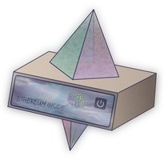

# Step 1: Prerequisites

## :rocket: How Staking on Ethereum Works

1. Acquire some hardware (laptop, desktop, server) or rent a VPS (cloud server): You need to run a node to stake.
2. Sync an execution layer client
3. Sync a consensus layer client
4. Generate your validator keys and import them into your validator client
5. Monitor and maintain your node

A Ethereum node consists of the Execution Layer + Consensus Layer.

A Ethereum Staking node is the previous plus a Validator client.

<figure><figcaption><p>Client Stack</p></figcaption></figure>

<figure><figcaption><p>Big picture: Execution / Consensus / Validator</p></figcaption></figure>

## :wave: Introduction

This guide was written for aspiring Ethereum stakers who have basic familiarity with command line tools and it was tested against Ubuntu 22.04.1 LTS client. You’ll want a dedicated cloud VPS or local desktop/server/laptop running a clean install of Ubuntu preferably.

### Terminology

Your Ethereum staking node may be

* **Local:** on a laptop / PC / NUC that you can physically connect keyboard/mouse/monitor.
* **Remote:** in the cloud on a VPS

If your staking node is **remote**, then you will want to setup SSH, secure shell.

If using a VPS or **remote** node, install and start the SSH client for your operating system:

**Windows**: [PuTTY](https://www.puttygen.com/download-putty)

**MacOS and Linux**: from the Terminal, use the native command:

```
ssh <YourUserName>@<YourServersIP>
```

Here's a [guide from Makeuseof](https://www.makeuseof.com/tag/beginners-guide-setting-ssh-linux-testing-setup/) to connect by SSH to your **remote node.**

## :hammer\_pick: How to Run Commands

* Commands are to be run in a terminal window or ssh terminal.
* Commands preceded by `sudo` will prompt for your password at first, and periodically afterwards.

## :woman\_technologist: Skills for operating an staking node

As a validator for Ethereum, you will typically have the following abilities:

* operational knowledge of how to set up, run and maintain a Ethereum consensus client, execution client and validator continuously
* a long term commitment to maintain your validator 24/7/365
* basic operating system skills

## :man\_technologist: Experience required to be a successful ETH Staker

* have studied [Ethstaker's Staking for Beginners](https://www.reddit.com/r/ethstaker/wiki/staking_for_beginners/)
* have perused the vast tomes of the [EthStaker Knowledge Base](https://docs.ethstaker.cc/ethstaker-knowledge-base/)

## :man\_lifting\_weights: Recommended Node Setup Requirements

* **Operating system:** Ubuntu 24.04 LTS Server or Desktop
* **Processor:** 4 CPU Cores or more
* **Memory:** 32GB RAM
* **Storage:** Testnet: 300GB. Mainnet: 4TB NVME (not QLC).
* **Internet:** Stable broadband internet connections with speeds at least 20 Mbps without data limit.
* **Data Plan**: At least 2 TB per month. Ideally, no data cap or unlimited data plan.
* **Power:** Reliable electrical power with a [Uninterruptible Power Supply (UPS)](https://www.lifewire.com/best-uninterrupted-power-supplies-4142625).
* **ETH balance:** 2.4ETH for [Lido CSM](https://csm.testnet.fi/?ref=ethpillar) or at least 32 ETH for solo staking with 1 validator
* **Wallet**: [Rabby](https://rabby.io/) Wallet installed


:desktop: **Hardware Builds**: For examples of actual staking hardware builds, check out [RocketPool's hardware guide](https://github.com/rocket-pool/docs.rocketpool.net/blob/main/docs/guides/node/local/hardware.md#example-setups) and [Ethstaker's Hardware Examples](https://docs.ethstaker.cc/ethstaker-knowledge-base/hardware/hardware-examples).



:cd: **Storage Suggestion**: Check out the following to find your ideal NVME or SSD drive.

* [**Yorick's Storage Advice**](https://gist.github.com/yorickdowne/f3a3e79a573bf35767cd002cc977b038): Refer to Yorick's Great and less great SSDs for Ethereum nodes
* [**Top SSD List**](https://docs.google.com/spreadsheets/d/1B27_j9NDPU3cNlj2HKcrfpJKHkOf-Oi1DbuuQva2gT4/edit)**:** Suitable drives are identified as Mid-Range or better.


<figure><figcaption><p>Ethereum Staking Node</p></figcaption></figure>


:sparkles: **Pro Validator Tip**: Highly recommend you begin with a brand new instance of an OS, VM, and/or machine. Avoid headaches by NOT reusing testnet keys, wallets, or databases for your validator.


## :desktop: Local Node vs Remote Node

**Decision**: Do I run my Ethereum staking node locally at home or rent a VPS cloud server remotely? Here's a list of criteria to help you decide.

|       Criteria       | Local Node                                                                                                                                         | Remote Node                                                                                                                                                                 |
| :------------------: | -------------------------------------------------------------------------------------------------------------------------------------------------- | --------------------------------------------------------------------------------------------------------------------------------------------------------------------------- |
|     Ongoing Costs    | Plus - No fees, besides internet bill and electricity.                                                                                             | Minus - Monthly or Annual reoccurring rental fees.                                                                                                                          |
| Hardware Maintenance | Minus - Do it yourself if hardware issues.                                                                                                         | Plus - Included, covered by hosting provider.                                                                                                                               |
|       Internet       | Minus - Can slow down home internet and use up data plan (if not unlimited) Budget for at least 2TB per month data plan.                           | Plus - Often plans are generous and more than sufficient for an ETH node.                                                                                                   |
|      Reliability     | Minus - Do it yourself with UPS, redundant internet connections, computer issues                                                                   | Plus - Hosted in a data center with multiple power/internet backups.                                                                                                        |
|   Barrier to Entry   | <p>Plus - Can re-use or re-purpose existing hardware<br><br>Minus - Initial cost to purchase new computer equipment</p>                            | Plus - Renting a VPS might require a lower initial investment as you can pay monthly.                                                                                       |
|   Decentralization   | Plus - Home staking is the **gold standard** for Ethereum decentralization, nothing bets it!                                                       | Minus - VPS cloud hosts like [Netcup](https://www.netcup.eu/bestellen/produkt.php?produkt=3026) or AmazonWebServices are by nature more centralized.                        |
|     Customization    | Plus - More fine control over hardware configuration                                                                                               | Minus - May be limited choices and hardware can be shared. For example, a common issue is insufficient disk storage I/O speeds (IOPS).                                      |
|       Security       | Plus - As secure as your home and personal [OPSEC](https://en.wikipedia.org/wiki/Operations_security)                                              | <p>Plus - Enterprise-grade, professional data centers.</p><p>Minus - Not your hardware, not your node. It's possible the hosting provide can view your node's contents.</p> |
|        Freedom       | <p>Plus - Do whatever you want. Plan your own upgrades.<br><br>Minus - With great freedom and power, you are solely responsible for your node.</p> | <p>Plus - Professionally managed.</p><p><br>Minus - At the mercy of the host's actions, data center outages are possible.</p>                                               |

## :tools: Setup Ubuntu

With your local or remote node, now you need to install an Operating System. This guide is designed for Ubuntu 22.04.1 LTS.

* To install **Ubuntu Server or Desktop**, refer to this [guide](https://docs.ethstaker.cc/ethstaker-knowledge-base/tutorials/installing-linux).


**Recommendation**: A headless (no monitor) install of **Ubuntu Server** on a **dedicated** NUC/laptop/desktop/VPS is best for ease of reliability and security. :fire: Do not use this system for email/browsing web/gaming/socials. :fire:



**Tip**: When installing Ubuntu Server, ensure you are selecting “**Use an entire disk**” on the **Guided storage configuration** screen. Next screen will be the **Storage configuration** screen, ensure your settings are using all available disk storage. A [common issue](../guide-or-how-to-setup-a-validator-on-eth2-mainnet/part-iii-tips/using-all-available-lvm-disk-space.md) is that Ubuntu server defaults to using only 200GB.


## :performing\_arts: Setup Rabby

When the time comes to make your validator's 32ETH deposit(s), you'll need a wallet to transfer funds to the beacon chain deposit contract.

* To install Rabby, visit their [official site.](https://rabby.io/)

## :jigsaw: High Level Validator Node Overview


At the end of this guide, you will build a staking validator node that hosts three main components in two layers: consensus layer consists of a consensus client, also known as a validator client with a beacon chain client. The execution layer consists of a execution client, formerly a eth1 node.

**Validator client** - Responsible for producing new blocks and attestations in the beacon chain and shard chains.

**Consensus client** - Responsible for managing the state of the beacon chain, validator shuffling, and more.

**Execution client** - Supplies incoming validator deposits from the eth mainnet chain to the beacon chain client.



