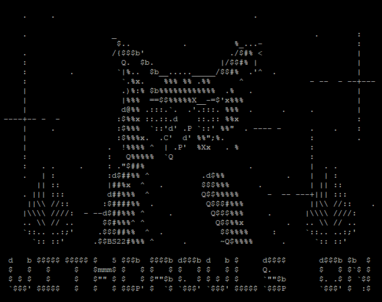

# Update Withdrawal Keys for Ethereum Validator (BLS to Execution Change or 0x00 to 0x01) with ETHDO


The following steps align with our [mainnet guide](guide-or-how-to-setup-a-validator-on-eth2-mainnet/). You may need to adjust file names and directory locations where appropriate. The core concepts remain the same.


## :question:Overview: What? Withdrawals? Owls?

* Greetings, fellow ETH staker! If you were staking before April 2, 2021, setting ETH withdrawal (0x01) credentials was not yet released and so, this guide is relevant for you.
* As of the Shapella upgrade, ETH validators with 0x00 credentials should update to 0x01 credentials to enable partial withdrawals, the sweeping of excess ETH > 32.
* If your validator previously voluntarily exited or you now would like to stop validator duties, you'll need to set your withdrawal credentials to fully reclaim your staked ETH.

<figure><figcaption><p>Guess who says: WITHDROWLS ON</p></figcaption></figure>

## :thumbsup:Pre-requisites: Before you begin

* Your validator's mnemonic keys (the offline 24 word secrets)
* An ETH withdrawal address you control, ideally one from a hardware wallet.
* An **offline air-gapped computer**. Create a Linux Live USB like [Ubuntu](https://ubuntu.com/tutorials/create-a-usb-stick-on-windows#1-overview) or [Tails](https://tails.boum.org/install/download/index.en.html); needs a USB key.
* A ETH staking node, also known as **online computer**.
* A USB storage key for moving files between the offline and online computer.
* Familiarize yourself with the [Ethereum.org Staking Withdrawals guide](https://launchpad.ethereum.org/en/withdrawals).

### Step 1: Download chain information

<details>

<summary>Generate "offline-preparation.json" file, save to USB key, transfer to offline air-gapped computer.</summary>

1. On your **online computer**, open a terminal window or shell. Shortcut: CTRL + ALT + T

<!---->

2. Download Ethdo v1.28.5 from Github [https://github.com/wealdtech/ethdo/releases](https://github.com/wealdtech/ethdo/releases)

```
cd ~
wget https://github.com/wealdtech/ethdo/releases/download/v1.28.5/ethdo-1.28.5-linux-amd64.tar.gz
```

3. Verify the checksum is valid. Located on the release page, the Checksum string is located in the corresponding sha256 file.

```
echo "1436040e1a0a2653723c3df1bc0e4b379e7635d72b35abff8427d29c1f828a2b ethdo-1.28.5-linux-amd64.tar.gz" | sha256sum -c
```

Successful verification occurs if you see "OK" in the resulting output.

```
ethdo-1.28.5-linux-amd64.tar.gz: OK
```

4. Extract ethdo.

```
tar -xvf ethdo-1.28.5-linux-amd64.tar.gz
```

5. Verify your validator's credential status with your index number. Replace`<MY-VALIDATOR-INDEX>` accordingly.

```
./ethdo validator credentials get --validator=<MY-VALIDATOR-INDEX>
```

Example output of a validator with BLS credentials. :white\_check\_mark:

```
BLS credentials: 0x0002a0addda8106aed690654c7af7af0bc5ccde321c8e5e2319ff432cee70396
```

If you have BLS credentials, continue with the rest of this guide. Otherwise, stop because ethdo will output "`Ethereum execution address`" and that means you've already set your withdrawal address!

6. Run the following command to call your consensus client and generate a list of active validators with relevant information for use on your offline computer.

```
./ethdo validator credentials set --prepare-offline
```

After a minute or two, you should see the text, "`offline-preparation.json generated`"

7. Using your USB key, copy both

* the `ethdo` executable&#x20;
* and `offline-preparation.json` file&#x20;

to your offline air-gapped computer.

</details>

### Step 2: Create change credentials file

<details>

<summary>Run ethdo with your mnemonic and withdrawal address. Transfer "change-operations.json" file via USB key back to online computer.</summary>

1. On your **offline air-gapped computer**, disconnect any internet Ethernet cables or WiFi / bluetooth before continuing. Make sure you're truly offline!

<!---->

2. Open a terminal window or shell. Shortcut: CTRL + ALT + T

<!---->

3. After copying the `ethdo` executable and `offline-preparation.json` file to your **offline computer**, ensure the ethdo file has execute permissions.

```
chmod +x ethdo
```

4. This ethdo command sets your validator credentials and the output is stored in a `change-operations.json` file. Replace `<MY MNEMONIC PHRASE>` AND `<MY ETH WITHDRAW ADDRESS>` accordingly.&#x20;

:octagonal\_sign: Double check your work as this is permanent once set!

```
./ethdo validator credentials set --offline --mnemonic="<MY MNEMONIC PHRASE>” --withdrawal-address=<MY ETH WITHDRAW ADDRRESS>
```

5. After a few seconds, `change-operations.json` is created. It's normal for no message to be displayed.
6. Triple check the resulting file for your withdraw address.

```
cat change-operations.json
```

7. Ensure the field **"to\_execution\_address":** contains your withdraw address.

<!---->

8. Using your USB key, copy

* `change-operations.json` file

back to your online computer.

9. Power off your **offline air-gapped computer.**

</details>

### Step 3: Broadcast change credentials

<details>

<summary>Simply run the set command to send your change.</summary>

1. On the **online computer**, copy the `change-operation.json` to your home directory, where `ethdo` is also located.
2. Run the following command to broadcast your withdrawal credentials. &#x20;

```
./ethdo validator credentials set
```

Alternatively, you can upload `change-operation.json` file to [https://beaconcha.in/tools/broadcast](https://beaconcha.in/tools/broadcast)

</details>


Congrats! Your BLS to Execution change is now pending in a queue, waiting to be included in a block.&#x20;


## :fast\_forward:Next Steps

#### For your information:

* Up to 16 BLS to Execution changes are included in each proposed block.
* Depending on the withdrawal queue size, your withdrawal change may take up to a few days to be finalized.
* Terminology: prefix of 0x01 = "Type 1" = execution withdrawal credentials = Withdrawals enabled
* As a partial withdrawal, periodically every few days any amount of ETH over 32 will be automatically swept to your withdrawal address.

#### Learn more from:

* Official Consensus Layer Withdrawal References
  * Prysm: [https://docs.prylabs.network/docs/wallet/withdraw-validator](https://docs.prylabs.network/docs/wallet/withdraw-validator)
  * Nimbus: [https://nimbus.guide/withdrawals.html](https://nimbus.guide/withdrawals.html)
  * Lighthouse: [https://lighthouse-book.sigmaprime.io/voluntary-exit.html#withdrawal-of-exited-funds](https://lighthouse-book.sigmaprime.io/voluntary-exit.html#withdrawal-of-exited-funds)
  * Teku: [https://docs.teku.consensys.net/HowTo/Withdrawal-Keys](https://docs.teku.consensys.net/HowTo/Withdrawal-Keys)
  * Lodestar: [https://chainsafe.github.io/lodestar/reference/cli/#validator-bls-to-execution-change](https://chainsafe.github.io/lodestar/reference/cli/#validator-bls-to-execution-change)
* Ethdo official withdrawals guide: [https://github.com/wealdtech/ethdo/blob/master/docs/changingwithdrawalcredentials.md](https://github.com/wealdtech/ethdo/blob/master/docs/changingwithdrawalcredentials.md)
* Attestant's Post: [https://www.attestant.io/posts/understanding-withdrawals/](https://www.attestant.io/posts/understanding-withdrawals/)

#### **Need extra live support?**&#x20;

* Find Ethstaker frens on the [Ethstaker](https://discord.io/ethstaker) Discord!
* Use reddit: [r/Ethstaker](https://www.reddit.com/r/ethstaker/), or [DMs](https://www.reddit.com/user/coincashew), or [r/coincashew](https://www.reddit.com/r/coincashew/)

#### Like these guides?

* [Tips much appreciated](../../donations.md) :pray:
* [**Support us on Gitcoin Grants**](https://gitcoin.co/grants/1653/eth2-staking-guides-by-coincashew)**:** We build this guide exclusively by community support!🙏
* Feedback or pull-requests: [https://github.com/coincashew/coincashew](https://github.com/coincashew/coincashew)

## :books:FAQ

<details>

<summary>Using my node, how can I check if my change is pending in the withdrawals queue?</summary>

Replace \<MY VALIDATOR INDEX>. Adjust the REST API port number, if needed.&#x20;

Lighthouse/Nimbus=5052. Prysm=3500. Lodestar=9596. Teku=5051.

```
curl "http://localhost:5052/eth/v1/beacon/pool/bls_to_execution_changes" | jq '.data | map(select(.message.validator_index=="<MY VALIDATOR INDEX>"))'
```

Example output:

```
[
  {
    "message": {
      "validator_index": "96193",
      "from_bls_pubkey": "0xb67aca71f04b673037b54009b760f1961f3836e5714141c892afdb75ec0834dce6784d9c72ed8ad7db328cff8fe9f13e",
      "to_execution_address": "0xb9d7934878b5fb9610b3fe8a5e441e8fad7e293f"
    },
    "signature": "0x988251748925e7a2966f28230c250e8c37495346d551e86fd89ea53148302b1145eb069647572801a689c9c1c5b8f2071019e652e01d92055d9aa99aa86696eb453889de38733caf2d5dce7a2786fed910365dcb7df082a62b130436fb9a1035"
  }
]
```

However, if the output shows \[], this means your change is complete and no longer in the queue.

</details>

<details>

<summary>How much longer do I need to wait for this change to take effect?</summary>

Each block can add 16 `blstoexecutionchange`messages and the time to process a BLS change depends on the size of the withdraw queue.&#x20;

Find the size of the queue with the following command.&#x20;

Adjust the REST API port number, if needed.&#x20;

Lighthouse/Nimbus=5052. Prysm=3500. Lodestar=9596. Teku=5051.

```
curl -s http://localhost:5052/eth/v1/beacon/pool/bls_to_execution_changes | jq '.data | length'
```

</details>

<details>

<summary>How do I know the credential change worked?</summary>

Replace `<MyValidatorIndex>` and run the following ethdo command:

```
ethdo validator credentials get --validator=<MyValidatorIndex>
```

The resulting output will start with: `Ethereum execution address`

Alternatively, check your favorite beacon chain explorer such as [beaconcha.in](https://beaconcha.in/validators/withdrawals) and [etherscan.io](https://etherscan.io/) for the 0x01 credentials.

</details>

<details>

<summary>Is the fee-recipient address the same as this withdrawal address?</summary>

They can both be set to the same ETH address; however, understand that **withdrawal credentials** have a different purpose than your **fee recipient**, which receives transaction fee tips from proposed blocks.

</details>

<details>

<summary>Partial Withdrawals vs Full Withdrawals?</summary>

* **Full validator withdrawal:** The process of withdrawing your entire stake on Ethereum and no longer performing validator duties. First you would exit your validator, and then after your request progress through the withdraw queue, your balance is transferred to your withdrawal address.
* **Partial validator withdrawal:** The process of withdrawing your validator’s earnings only. For a validator, any amount over the initial 32 ETH deposit is the earnings and is swept every few days periodically to the withdrawal address, as  each proposed block processes 16 partial withdrawals.

</details>

<details>

<summary>I don't have a mnemonic phrase. I used a private key.</summary>

Refer to the [official ethdo guide's advanced section.](https://github.com/wealdtech/ethdo/blob/master/docs/changingwithdrawalcredentials.md#using-withdrawal-private-key-only)

</details>

<details>

<summary>I want different withdrawal addresses for each of my validators.</summary>

Refer to the [official ethdo guide's advanced section detailing usage with mnemonic's and paths.](https://github.com/wealdtech/ethdo/blob/master/docs/changingwithdrawalcredentials.md#using-a-mnemonic-and-path)

</details>

<details>

<summary>I need to change my withdrawal address.</summary>

The only way to change withdrawal addresses is to perform a full withdrawal by exiting a validator and then, creating a new validator key as if starting the staking journey over again.

</details>
