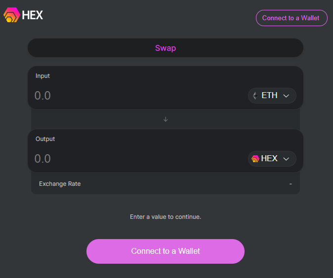
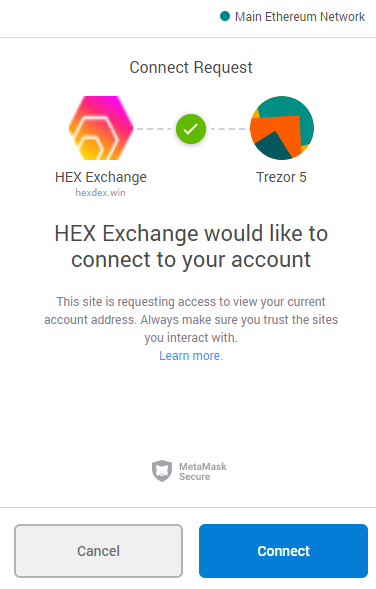
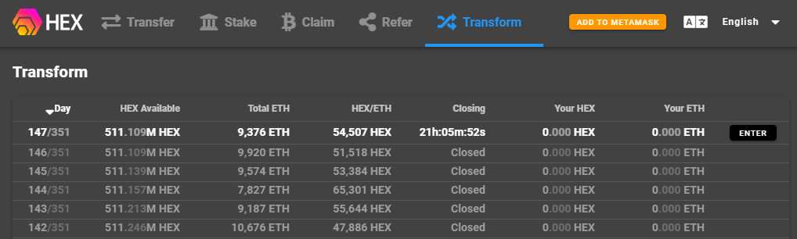

# Guide: How to buy HEX

## :handbag: 1. Install MetaMask

Refer to the following link if you need to setup MetaMask.


Your ETH address is your HEX address.



[metamask-ethereum.md](../../wallets/browser-wallets/metamask-ethereum.md)


## :moneybag: 2. Fund your account with Ether

By this point, you'll need some ETH in your MetaMask wallet. Refer to the following if you need help:


[guide-where-to-get-crypto.md](../../exchanges/guide-where-to-get-crypto.md)


## :currency_exchange: 3. Swap Ether for Hex at Uniswap Exchange

1. **Open **in your browser, [Hexdex.win](https://hexdex.win/swap)

2\. **Click **"Connect a Wallet" button

3\. **Click **"MetaMask"

4\. **Type **your MetaMask password if prompted

5\. **Click "**Connect" to allow the Hex Exchange to connect to MetaMask

6\. Time to decide how many HEX you want or how much ETH you want to spend.

* **Type **how many **Ethers **you want to convert into HEX into the "Input" box
* or **type **how many **HEX **you want in the "Output" box


Notice the opposite asset is automatically filled with an estimated amount.


7\. **Click **"Swap" and then **confirm **the transaction in MetaMask.


Congratulations. It's that easy!


## :fire: 4. Alternative: Transform ETH into HEX

1. Visit [go.hex.win](https://go.hex.win/?r=0xFa802BB14AE13810381e8cb09755b39249cE5Ac7) for your 10% bonus
2. Click "Add to MetaMask" and allow the connection to MetaMask
3. Click **Transform **tab
4. Click **ENTER **button
5. Type **how much ETH **to transform
6. Confirm transaction with MetaMask wallet
7. Revisit after one day and click **EXIT **to get your Hex.


How much HEX you receive will depend on how much ETH is transformed by everyone on the same day.


### :film_frames: Video tutorial on how to use Transform lobby.



