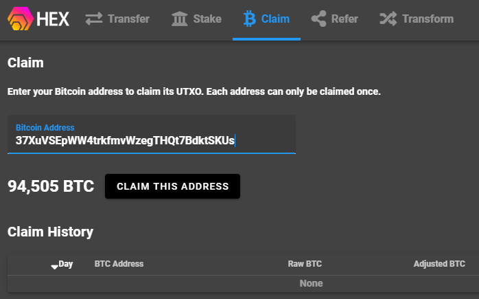
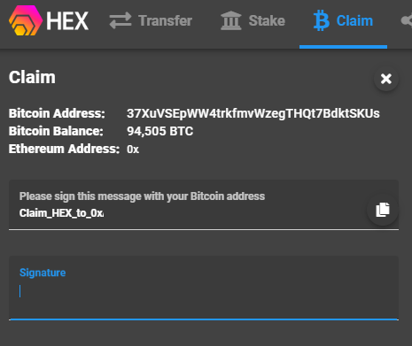

# Guide: How to claim HEX

## :checkered_flag: 1. Prerequisites

1. You hodled Bitcoin (BTC) on the HEX snapshot time which occurred on block 606227 at December 2nd at 00:04:19 UTC
2. You control the private keys to the above BTC.

## :last_quarter_moon_with_face: 2. Install and use a compatible wallet


Your ETH address is your HEX address.



[metamask-ethereum.md](../../wallets/browser-wallets/metamask-ethereum.md)


## :fire: 3. Claim your HEX

1\. Visit [go.hex.win](https://go.hex.win/?r=0xFa802BB14AE13810381e8cb09755b39249cE5Ac7)

2\. Click "Add to MetaMask" and allow the connection to MetaMask

3\. Click **Claim **tab

4\. Paste your BTC address

5\. Click **CLAIM THIS ADDRESS **button

7\. Open your BTC wallet and sign the message given by the claim tool

8\. Copy / paste the BTC signature into the claim page

9\. Enter **how many days** to Auto-Stake

10\. Click **SUBMIT CLAIM **button

11\. Confirm transaction with MetaMask wallet

### :film_frames: Video tutorial on how to claim HEX from BTC


