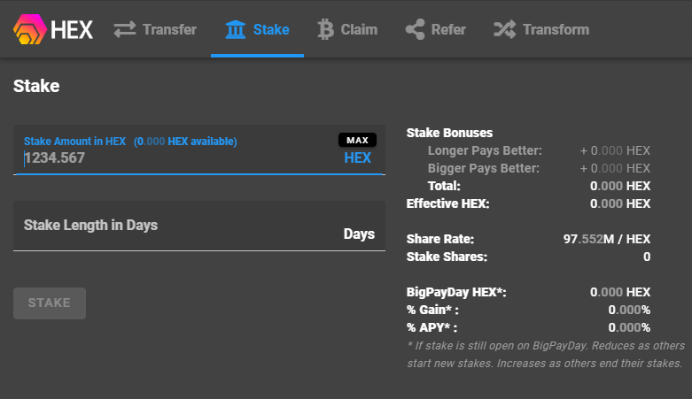

# Guide: How to stake HEX

## :checkered_flag: 1. Prerequisites

HEX tokens stored on a local wallet. You control the seed/private keys. 

## :last_quarter_moon_with_face: 2. Install and use a compatible wallet


Your ETH address is your HEX address.



[metamask-ethereum.md](../../wallets/browser-wallets/metamask-ethereum.md)



[trustwallet-multi-currency.md](../../wallets/mobile-wallets/trustwallet-multi-currency.md)


## :fire: 3. Stake your HEX

1. Visit [go.hex.win](https://go.hex.win/?r=0xFa802BB14AE13810381e8cb09755b39249cE5Ac7)
2. Click "Add to MetaMask" and allow the connection to MetaMask
3. Click **Stake **tab
4. Enter **how much stake** or click **MAX **button
5. Enter the** Stake Length in Days**
6. Review the **Stake Bonuses** and ensure they are to your liking.
7. Click **STAKE **button
8. Confirm transaction with MetaMask wallet


Longer staking pays better. Bigger stakes pay better, too. Stake longer and you won't miss the BigPayDay for big gains!


## :film_frames: Video tutorial on how to stake HEX



