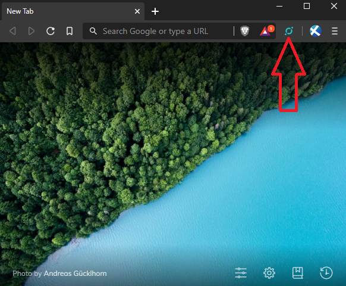
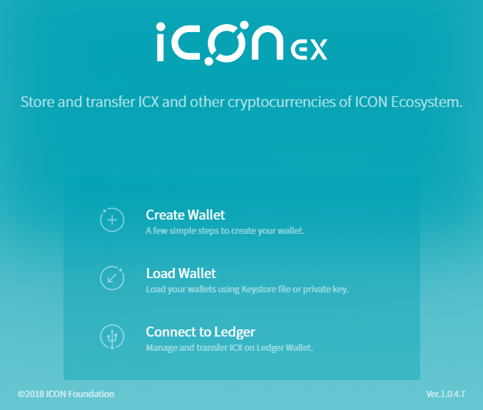
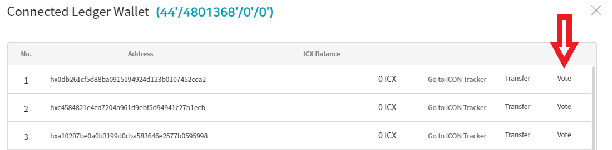
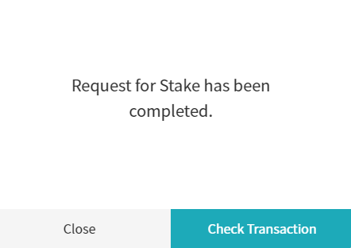
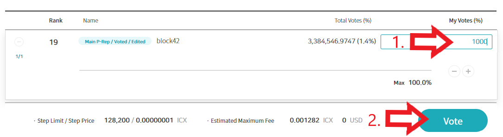
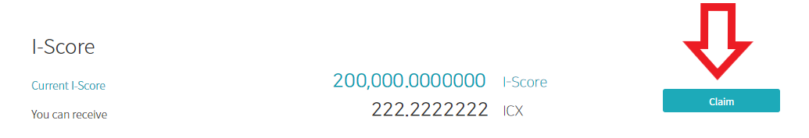
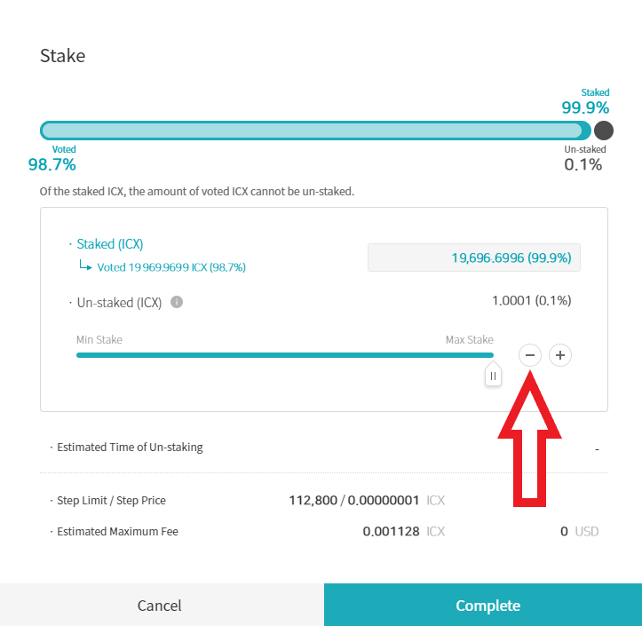

# Guide: How to stake ICX

## :checkered\_flag: 1. Prerequisites

ICX tokens stored on a local wallet. You control the seed/private keys.&#x20;


Remember, it's best practice to always withdraw coins from an Exchange.


## :last\_quarter\_moon\_with\_face: 2. Install and use a compatible wallet


[iconex-icon.md](../../wallets/browser-wallets/iconex-icon.md)


## :ballot\_box: 3. Vote with your stake


For this example, we will stake with Ledger Nano. Now **plug** in your Ledger, **type** the PIN code, **open** the Icon app.



ICONex is currently the easiest way to stake, vote, and claim rewards. It's also very safe because your coins never leave your control.


1\. **Open** the ICONex wallet in your web browser.

2\. Click on the **ICONex Wallet logo** in the top right. See below.

4\. Click **Connect to Ledger**

5\. Click **Connect to Ledger**

6\. Click **Vote** on the account you wish to use.

7\. Click **My Status** tab

8\. Under **Stake** section**,** click **Adjust** button

9\. Adjust the **Amount to Stake** with the `- + buttons`

10\. Click **Complete**

11\. **Review** and **Confirm** the transaction on your Ledger

12\. Click **Complete**

13\. Request for stake has completed. Click **Close**

14\. Under Vote section, click **Vote button**

15\. Add the P-Rep you would like to vote for with the `+ button`

16\. Notice the P-Rep is now added to your choices. **Click** their name. **Adjust** the amount of votes by using the `- + buttons`or type the # of votes. See example below.


&#x20;If you want to vote for multiple P-Reps, repeat steps 15 and 16.


16\. Click **Vote** Button

17\. **Review** and **Confirm** the transaction on your Ledger

18\. Click **Complete**

19\. Click **Close**. Vote Request complete. :tada:&#x20;

## :fireworks: 4. Claiming your Rewards

1\. Under the I-Score section, click the **Claim** button

2\. Click **Claim**

3\. **Review** then **Confirm** the transaction on your Ledger Nano

4\. Click **Complete**

5\. Request for Claim has been completed. Click **Close** :tada:&#x20;


With your newly claimed ICX rewards, you can stake them,and then cast even more votes for more rewards.


## :checkered\_flag: 5. Unstake ICX

If you need to free up some coins to transfer, you might need to unvote then unstake.

1\. In the **My Votes** section of the wallet, **decrease** your **votes** to a P-Rep by how many coins you want to unstake. For example, if you want to unstake 1000 ICX, then subtract 1000 votes from a P-Rep.

2\. Click **Vote** button to complete.

3\. In the Stake section, click the **`- button`** to reduce your stake. See below.

4\. Click the **Complete** button to finish.


Unstaked ICX coins require 11 days before they are released and available for transfer. Plan ahead! :robot:&#x20;

