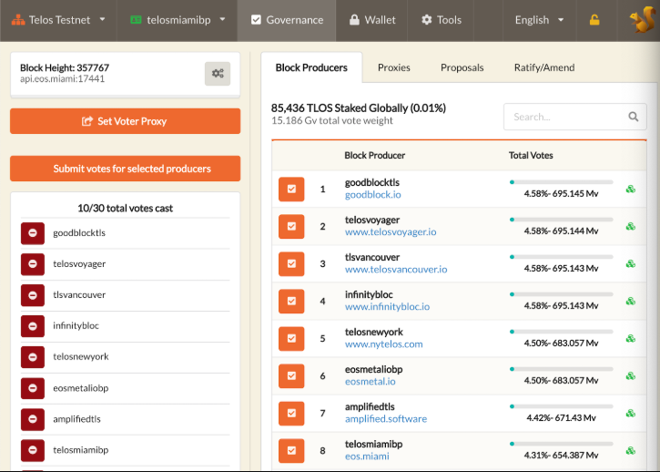

# Guide: How to stake TLOS

## :checkered_flag:1. Prerequisites

In order to stake, TLOS must be stored on a local wallet, where you control the seed/private keys. 


Remember, it's best practice to always withdraw coins from an Exchange.


## :last_quarter_moon_with_face: 2. Download and use a compatible wallet


[sqrl-tlos.md](../../wallets/desktop-wallets/sqrl-tlos.md)



[scatter-eos.md](../../wallets/desktop-wallets/scatter-eos.md)


## :fire: 3. Stake your TLOS


The Telos T-REX allows you to participate in the Resource Exchange system, or REX. This feature allows you to lend your idle CPU and NET resources and then you earn interest for being a lender.


For this example, we will demonstrate with Sqrl wallet.

1\. Open TLOS wallet

2\. Click the **Governance **tab

3\. Click the **Proxies **tab

4\. Select a **voting proxy**


Alternatively, you can manually vote for at least 21 up to 30 block producers


5\. Click **T-REX** tab 

6\. Click **Deposit TLOS for Lending **

7\. Set the **amount of TLOS** to deposit

8\. Click **Deposit TLOS **button


:sparkles: Now you're staking TLOS and earning a portion of the 685 TLOS created every 30 minutes.


