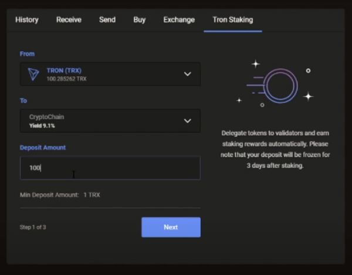
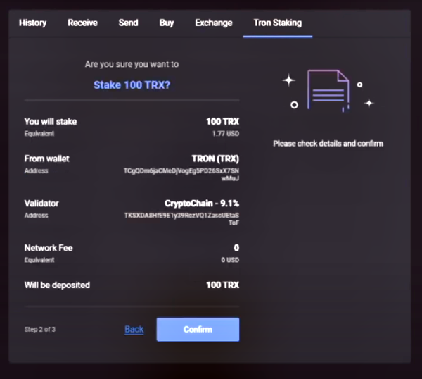

# Guide: How to stake TRX

## :checkered_flag:1. Prerequisites

In order to stake, TRON must be stored on a local wallet, where you control the seed/private keys. 

## :last_quarter_moon_with_face: 2. Download and use a compatible wallet


[guarda-multi-chain-assets.md](../../wallets/mobile-wallets/guarda-multi-chain-assets.md)



[ledger-live-ledger-nano-wallet](../../wallets/hardware-wallets/ledger-live-ledger-nano-wallet/)



[tronwallet-trx.md](../../wallets/mobile-wallets/tronwallet-trx.md)



[tronlink-trx.md](../../wallets/browser-wallets/tronlink-trx.md)


## :fire: 3. Stake your TRON


TRON rewards your participation in the governance process. This means when you vote for TRON Super Representatives (SR), you earn a share of their rewards.


For this example, we will demonstrate with Ledger Live wallet and Guarda Wallet.



1\. Open Guarda Wallet

2\. Find your Tron (TRX) account and click **Staking**

3\. Click **Deposit for Staking **button

4\. In the **To **field, choose your **Validator**

5\. Enter the **Deposit Amount**

6\. Click **Next** button\
\
7\. Review your staking details and then click the **Confirm **button to finish!




1\. Open Ledger Live wallet

2\. Select your Tron account

3\. Click **Earn rewards **button


In order to obtain votes, you need to freeze TRON. Once TRON coins are frozen, they require 3 days for thawing or unstaking. 


4\. Enter the **amount to freeze**


1 vote = 1 frozen TRON. You can choose up to 5 Super Reps.


5\. Click **Cast Votes** button

6\. Enter the **# of votes **for any Super Representatives you prefer


Research, compare, and discover details about your Super Representatives at [TokenGoodies.com](https://www.tokengoodies.com/voterrewards) or [Tron2Moon.com](https://www.tron2moon.com/calculator.php)


8\. After 24+ hours, click the **Claim TRX** button to receive your rewards or your SR might send rewards automatically to your account.

## :film_frames: Video Tutorial







:sparkles: Now you're staking TRON and earning a portion of your Validator's rewards every 24 hours.

