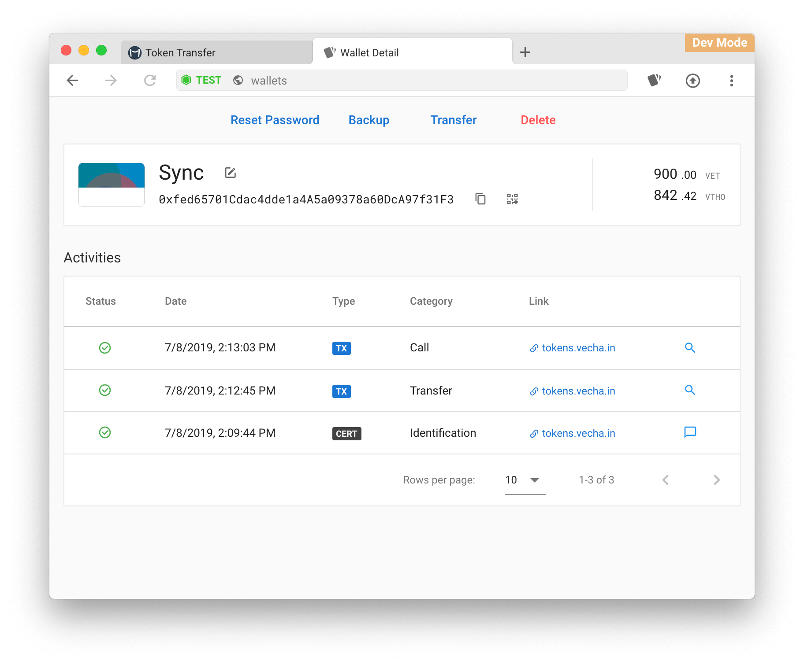

# Guide: How to stake VET

## 🏁1. Prerequisites

In order to stake, VET must be stored on a local wallet, where you control the seed/private keys. 


Remember, it's best practice to always withdraw coins from an Exchange.


## 🌜 2. Download and use a compatible wallet





## 🔥 3. Stake your VET


Staking VET means generating VTHO. It's easy to stake because holding VET in your own wallet is the only requirement.


1. Open Vechain wallet
2. Copy your VET address
3. Send or withdraw VET from exchange or other wallet to your VET address


✨ Now you're staking VET and earning VTHO every 10 seconds.


