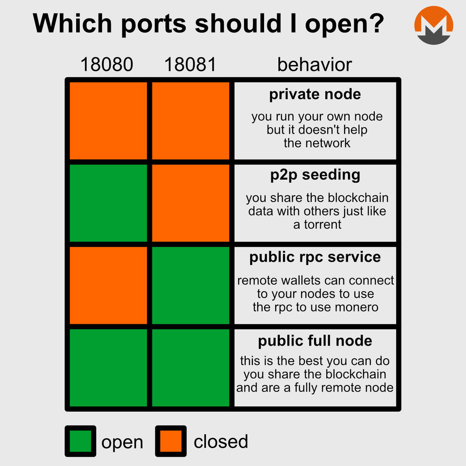

# Guide | How to run your own Monero node

## ​🗡 Why should I run my own Monero node?

* To independently have the ability to send/receive/verify transactions while maintaining the highest privacy and security, you will want to run your own node.
* If you do not run your own node, you are relying on other's nodes to verify and send your transactions.
* To contribute to the decentralization of the Monero network.
* To use a monero wallet requires connecting to a fully synched node. Best node is your own.
* To connect to the monero network, you run a peer-to-peer application called **monerod** (the d stands for daemon) and it forms the backbone of the Monero network.
* **Optional**: Offering your node as a public remote note is to volunteer your node as a public resource by helping onboard new monero nodes and relay other monero users transactions.


Monero nodes come in two flavours.

* **Full Node**: Stores all blockchain data
* **Pruned Node**: Stores a random 1/8th of the blockchain's data and requires much less disk space


### ​  :rocket:Minimum Full Node System Requirements <a href="#minimum-slasher-system-requirements" id="minimum-slasher-system-requirements"></a>

* Dual-core CPU
* 4+ GB RAM
* 160GB+ SSD HD

### :robot: Minimum Pruned Node System Requirements <a href="#minimum-slasher-system-requirements" id="minimum-slasher-system-requirements"></a>

* Same as full node yet with a smaller HD
* 80GB+ SSD HD


As of early 2021, a pruned node uses 32GB and a full node uses 96GB of storage space.


## :bricks: 1. Configuring ports and firewall



Full Public Node with port 18089, a restricted RPC port.

```bash
# By default, deny all incoming and outgoing traffic
sudo ufw default deny incoming
sudo ufw default allow outgoing
# Allow ssh access
sudo ufw allow ssh
# Allow monerod p2p port
sudo ufw allow 18080
# Allow monerod restricted RPC port
sudo ufw allow 18089
# Enable firewall
sudo ufw enable
```

```bash
# Verify status
sudo ufw status numbered
```

Setup service accounts.

```bash
# creates system user account for monero service
sudo adduser --system --group --no-create-home monero
```

Create some folders the service needs & set their ownership:

```bash
# logfile goes here
sudo mkdir /var/log/monero

# blockchain database goes here
sudo mkdir /var/lib/monero

# create file for config  
touch /var/lib/monero/monerod.conf

# set permissions to service account
sudo chown -R monero:monero /var/lib/monero
sudo chown -R monero:monero /var/log/monero
```

Download the latest monero node binaries.

```bash
cd $HOME
wget --content-disposition https://downloads.getmonero.org/cli/linux64
```

Verify the download hash signature.

```bash
#download latest hashes.txt file
wget https://www.getmonero.org/downloads/hashes.txt

#search hashes.txt file for the computed sha256sum
grep -e $(sha256sum monero-linux-x64-*.tar.bz2) hashes.txt
```

A match appears and this confirms the file is valid.

Example output:

> hashes.txt:b566652c5281970c6137c27dd15002fe6d4c9230bc37d81545b2f36c16e7d476 monero-linux-x64-v0.17.1.8.tar.bz2

Extract tar and copy to /usr/local/bin

```bash
tar -xvf monero-linux-x64-*.tar.bz2
sudo mv monero-x86_64-linux-gnu-*/* /usr/local/bin
sudo chown -R monero:monero /usr/local/bin/monero*
```

Cleanup files.

```bash
rm monero-linux-x64-*.tar.bz2
rm hashes.txt
rm -rf monero-x86_64-linux-gnu-*/
```

Configure your Monero Node with a config file.

```bash
sudo nano /var/lib/monero/monerod.conf
```

Add this to the file.

```bash
#blockchain data / log locations
data-dir=/var/lib/monero
log-file=/var/log/monero/monero.log

#log options
log-level=0
max-log-file-size=0 # Prevent monerod from managing the log files; we want logrotate to take care of that

# P2P full node
p2p-bind-ip=0.0.0.0 # Bind to all interfaces (the default)
p2p-bind-port=18080 # Bind to default port
public-node=true # Advertises the RPC-restricted port over p2p peer lists

# rpc settings
rpc-restricted-bind-ip=0.0.0.0
rpc-restricted-bind-port=18089

# i2p settings
tx-proxy=i2p,127.0.0.1:8060

# node settings
prune-blockchain=true
db-sync-mode=safe # Slow but reliable db writes
enforce-dns-checkpointing=true
enable-dns-blocklist=true # Block known-malicious nodes
no-igd=true # Disable UPnP port mapping
no-zmq=true # ZMQ configuration

# bandwidth settings
out-peers=32 # This will enable much faster sync and tx awareness; the default 8 is suboptimal nowadays
in-peers=32 # The default is unlimited; we prefer to put a cap on this
limit-rate-up=1048576 # 1048576 kB/s == 1GB/s; a raise from default 2048 kB/s; contribute more to p2p network
limit-rate-down=1048576 # 1048576 kB/s == 1GB/s; a raise from default 8192 kB/s; allow for faster initial sync
```


**Configuration File Comments**

* Modify `prune-blockchain` to `false` if you want to store full blockchain
* Modify `public-node` to `false` if you do not want other users to use your node.
* `rpc-restricted-bind-ip/port flags`enable restricted access to your node but allow full RPC from other Monero wallets on your LAN.
* Limit the upload speed in case you have a data cap: `limit-rate-up=8192` (in kB/s). Conversely, if you have an unlimited data plan, consider increasing the upload speeds to better support the Monero network. A node can typically use up to 1TB traffic per month.


Create a `monerod.service`  systemd unit file. Simply copy and paste the following.

```bash
cat > $HOME/monerod.service << EOF
[Unit]
Description=monerod
After=network.target

[Service]
Type=forking
PIDFile=/var/lib/monero/monerod.pid
ExecStart=/usr/local/bin/monerod --config-file /var/lib/monero/monerod.conf --detach --pidfile /var/lib/monero/monerod.pid
User=monero
Group=monero
Restart=always
RestartSec=5

[Install]
WantedBy=multi-user.target
EOF
```

Move the file to `/etc/systemd/system/monerod.service`

```bash
sudo mv $HOME/monerod.service /etc/systemd/system/monerod.service
```

Restart monerod in order for config change to take effect.

```
sudo systemctl daemon-reload
sudo systemctl enable monerod
sudo systemctl restart monerod
```

Check the systemd service with

```
journalctl -fu monerod
```

Review the logs for any errors. CTRL + C to exit.

```
tail -f /var/log/monero/monero.log
```


Allow the node to sync. This may take a few hours up to a few days depending on your node's system resources.


Your node is completely synchronized the node status says **height:** **n / n** **100%** and has the same **block height** as a public xmr block explorer such as [https://blockchair.com/monero](https://blockchair.com/monero) or [http://xmrchain.net/](http://xmrchain.net)

Check your node's block height with the following command.

```bash
monerod status
```


Connect to your brand new node with your favorite clients such as Monerujo, CakeWallet or Monero-GUI. Simply enter your node's IP or hostname into the remote node field. Congrats! :confetti\_ball:&#x20;


## :pick: Optional: Start mining

Like winning a lotto ticket, your monero node has a chance to mine a block. You may never win a block but your hashrate helps protect and strengthen the network.

Start with 1 thread, check your mining hashrate and increase if your CPU resources allow.

Run the following command.&#x20;

```bash
monerod start_mining <YOUR XMR ADDRESS> <NUMBER OF THREADS>
```

## :flying\_saucer: Optional: Setup I2P

Download I2p.

```bash
wget https://github.com/i2p-zero/i2p-zero/releases/download/v1.20/i2p-zero-linux.v1.20.zip
unzip i2p-zero-linux.v1.20
sudo cp -r i2p-zero-linux.v1.20/* /usr/local/bin

sudo chown -R i2p:i2p /usr/local/bin/router

rm i2p-zero-linux.v1.20.zip
rm -rf i2p-zero-linux.v1.20
```

Setup service accounts.

```bash
# creates system user account for i2p service
sudo adduser --system --group --no-create-home i2p
```

Create a `i2pzero.service`  systemd unit file. Simply copy and paste the following.

```bash
cat > $HOME/i2pzero.service << EOF
[Unit]
Description=i2pzero
After=network.target

[Service]
Type=simple
User=i2p
Group=i2p
ExecStart=/usr/local/bin/router/bin/i2p-zero
Restart=always
RestartSec=5

[Install]
WantedBy=multi-user.target
EOF
```

Move the file to `/etc/systemd/system/i2pzero.service`

```bash
sudo mv $HOME/i2pzero.service /etc/systemd/system/i2pzero.service
```

Check the logs.

```
journalctl -fu i2pzero
```

Restart i2pzero in order for config change to take effect.

```
sudo systemctl daemon-reload
sudo systemctl enable i2pzero
sudo systemctl start i2pzero
sudo systemctl status i2pzero
```

Based on the status, open the port \<NUMBER> on your firewall for best performance.

> For best performance, please open port \<NUMBER> on your firewall for incoming UDP and TCP connections. This port has been randomly assigned to you. For privacy reasons, please do not share this port with others.

```bash
cd $HOME/i2p-zero-linux
INBOUND_I2P=$(router/bin/tunnel-control.sh server.create 127.0.0.1 8061)
echo INBOUND I2P: $INBOUND_I2P
router/bin/tunnel-control.sh socks.create 8060
```

Append the following to your monerod config file.

```bash
sudo nano /var/lib/monero/monerod.conf

tx-proxy=i2p,127.0.0.1:8060
anonymous-inbound=<Your INBOUND_I2P>,127.0.0.1:8061 
```

Open the i2p port.

```bash
# i2p port
sudo ufw allow 8060
```

Restart monerod.

```
sudo systemctl restart monerod
```

## &#x20;:tools: 2. How to update a monero node <a href="#7-update-a-eth2-client" id="7-update-a-eth2-client"></a>

When a new release is cut, you will want to update to the latest stable release. The following shows you how to update your monero node.

Review release notes and check for breaking changes/features.

​[https://github.com/monero-project/monero/releases](https://github.com/monero-project/monero/releases)

Download the latest monero node binaries.

```bash
cd $HOME
wget --content-disposition https://downloads.getmonero.org/cli/linux64
```

Verify the download hash signature.

```bash
#download latest hashes.txt file
wget https://www.getmonero.org/downloads/hashes.txt

#search hashes.txt file for the computed sha256sum
grep -e $(sha256sum monero-linux-x64-*.tar.bz2) hashes.txt
```

A match appears and this confirms the file is valid.

Also check the new version number matches your expectations.

Example output:

> hashes.txt:b566652c5281970c6137c27dd15002fe6d4c9230bc37d81545b2f36c16e7d476 monero-linux-x64-v0.17.1.8.tar.bz2

Extract tar file.

```bash
tar -xvf monero-linux-x64-*.tar.bz2
```

Stop, copy new binaries and restart monerod service.

```
sudo systemctl stop monerod
```

```bash
sudo mv monero-x86_64-linux-gnu-*/* /usr/local/bin
sudo chown -R monero:monero /usr/local/bin/monero*
sudo systemctl start monerod
```

Check the logs to verify the services are working properly and ensure there are no errors.

```
sudo systemctl status monerod
```

Review the logs for any errors. CTRL + C to exit.

```
tail -f /var/log/monero/monero.log
```

Cleanup files.

```bash
rm monero-linux-x64-*.tar.bz2
rm hashes.txt
rm -rf monero-x86_64-linux-gnu-*/
```
