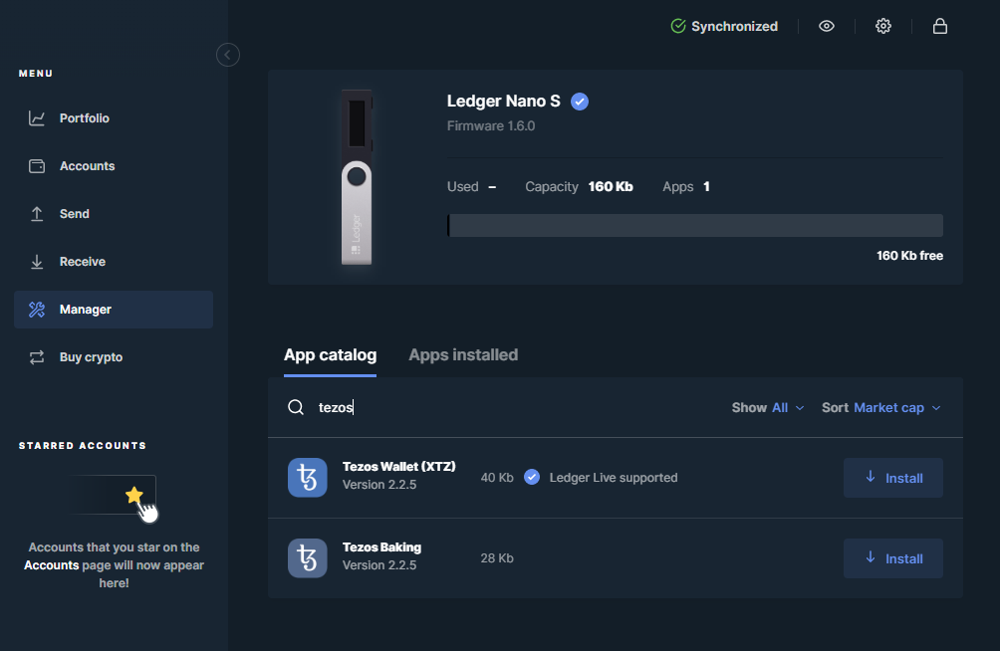

# 4. Configure Ledger Nano S

## :woman\_detective: 1) Update udev rules

This enables the Ledger Nano device to work via USB. \[[\*Reference](https://support.ledger.com/hc/en-us/articles/360019301813-Fix-USB-issues)]

```bash
wget -q -O - https://raw.githubusercontent.com/LedgerHQ/udev-rules/master/add_udev_rules.sh | sudo bash
```

## :mobile\_phone: 2) Install Ledger Live

1. Navigate to [ledger.com/ledger-live/download](https://www.ledger.com/ledger-live/download).
2. Download the Ledger Live AppImage.
3. Make the file executable.\
   In a terminal: `chmod +x ledger-live-*.AppImage`
4. Launch the AppImage by double-clicking on it or via your terminal.
5. Follow the wizard to setup your Ledger Wallet hardware device.

## :jigsaw: 3) Install the latest Tezos Wallet and Baking companion apps

1. Plug in your Ledger Nano hardware wallet
2. Enter your PIN code to unlock
3. Open Ledger Live
4. Go to Manager
5. Allow Ledger Manager on your device
6. Search the app catalog with `tezos`
7. Install both Tezos apps



## :chains: 4) Import secret key from Ledger Nano

&#x20;**Press** Ctrl+Alt+T to open a new terminal.

Verify that your Ledger Nano is connected.

```bash
cd ~/tezos
./tezos-client list connected ledgers
```

If successful, then you'll see something like:

```scala
## Ledger `happy-funny-moody-fun`
Found a Tezos Wallet 2.1.0 (git-description: "091e74e9") application running
on Ledger Nano S at
[IOService:/AppleACPIPlatformExpert/PCI0@0/AppleACPIPCI/XHC1@14/XHC1@14000000/HS03@14300000/Nano
S@14300000/Nano S@0/IOUSBHostHIDDevice@14300000,0].

To use keys at BIP32 path m/44'/1729'/0'/0' (default Tezos key path), use one
of:

tezos-client import secret key ledger_username "ledger://happy-funny-moody-fun/bip25519/0h/0h"
tezos-client import secret key ledger_username "ledger://happy-funny-moody-fun/ed25519/0h/0h"
tezos-client import secret key ledger_username "ledger://happy-funny-moody-fun/secp256k1/0h/0h"
tezos-client import secret key ledger_username "ledger://happy-funny-moody-fun/P-256/0h/0h"
```

Import an account by copying and pasting one of the `tezos-client import secret` commands.&#x20;


It's recommended to use the **ed25519 curve command** as this is the most widely supported account.



Your ledger will show a different identifier after`ledger://`


Update your **account name** for your ledger and run the command.

In this example, we change it to `ledger_mybaker`

This is an example of the command you will run:

> `./tezos-client import secret key ledger_mybaker "ledger://happy-funny-moody-fun/ed25519/0h/0h"`

Verify that your account was added successfully by running:

```bash
./tezos-client list known addresses
```

You should see your **baker's account name** and your **baker's public address**.

Example:

> `ledger_mybaker: tz1LoLVKXA7VL7s3V7uHeXHeHpz8RNxyAE78 (ledger sk known)`

## :woman\_cook: 5) Register your intention to be a baker

Check that your node is fully synchronized.

```bash
./tezos-client bootstrapped
```


When your node is fully synchronized, the output will say `Bootstrapped.`


&#x20;Run this command to tell the Tezos blockchain that you would like to become a baker.

```bash
./tezos-client register key ledger_mybaker as delegate
```

On your Ledger Nano, click the buttons to acknowledge the transaction.

## :pick: 6) Configure Ledger Baking app

1. Open the **Tezos Baking** app on your Ledger Nano.
2. Run the following command from a terminal and then acknowledge the command on your device.

```bash
./tezos-client setup ledger to bake for ledger_mybaker --main-chain-id NetXdQprcVkpaWU
```
