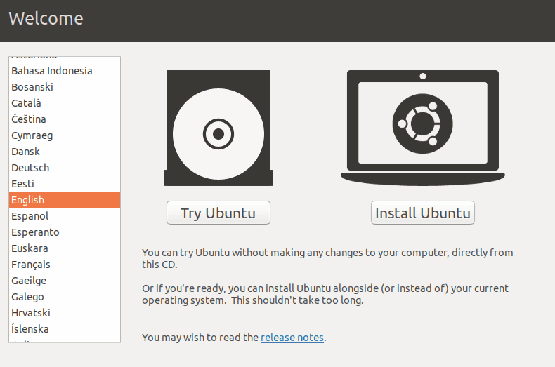

# 2. Install Ubuntu

## :desktop: 1) Getting Ubuntu

Downloading and installing Ubuntu is a fairly easy process.

Download an Ubuntu ISO image from here:

#### [`https://ubuntu.com/download/desktop`](https://ubuntu.com/download/desktop)``

Burn the ISO to disk, boot from the ISO into a VM or write it to a bootable USB drive.

Here is an example of what installing Ubuntu looks like.

Alternatively, you can follow the official Ubuntu installation guide here:


