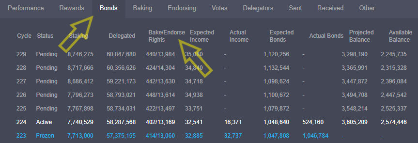

# 5. Start the baker

## :trophy: Almost there

Becoming a baker comes with great power and responsibility.&#x20;

First, you should open three more terminals in Ubuntu, one per process. Remember the keyboard shortcut, **press** Ctrl+Alt+T.

In one terminal, you run the baker.

```bash
cd ~/tezos
./tezos-baker-006-PsCARTHA run with local node ~/.tezos-node ledger_mybaker
```

&#x20;In another terminal, you run the endorser.

```bash
cd ~/tezos
./tezos-endorser-006-PsCARTHA run ledger_mybaker
```

And finally, the accuser in another terminal.

```bash
cd ~/tezos
./tezos-accuser-006-PsCARTHA run
```

Your node is already synchronized and running from an earlier step in this guide. However, if it is not, here is the command again.

```bash
cd ~/tezos
./tezos-node run --rpc-addr 127.0.0.1:8732 --log-output tezos.log &
tail -f tezos.log
```


The above example is running protocol 006-PsCARTHA. In future protocols, you will update this name to reflect the future protocol's name.



Congratulations. Your baker is now ready to bake some rolls!



Since you recently registered as a baker, you need to wait 7 cycles, or about 21 days, before you have rights to start baking and endorsing. Check on your baking rights with a block explorer such as [https://tzstats.com](https://tzstats.com/) via the **Bonds tab**.



