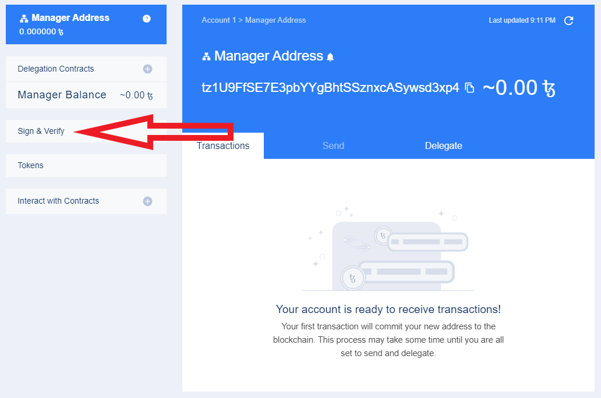
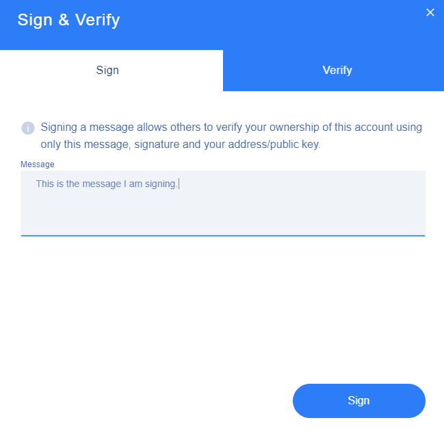

# Guide: How to sign or verify a XTZ message

## :woman_technologist: 0. Purpose

You can sign a message with your Tezos address to prove you own and control it. Alternatively, you can verify a message came from a specific Tezos address.

## :triangular_ruler: 1. Install Galleon wallet


Galleon is the first easy to use wallet with sign & verify message functionality.

Download version 1.1.0b or greater here: [https://github.com/Cryptonomic/Deployments/wiki/Galleon:-Releases#preview-releases](https://github.com/Cryptonomic/Deployments/wiki/Galleon:-Releases#preview-releases)


## :signal_strength: 2. Sign a message

1. Open Galleon
2. Click the Sign & Verify button

3\. Enter your **message **in the textbox

4\. Click **Sign **button.


If you are using a Nano Ledger S, click "Accept" on the device.



A **signature **is generated from your **message **and** tezos address**. You can share these three pieces of information with another person to prove ownership.


## :white_check_mark: 3. Verify a message

1. Click the** Verify tab.**
2. To verify a message, simply paste in the **1. message, 2. signature, and 3. Tezos public address** accordingly.
3. Click the **Verify **button.
4. When all the information is correct, the **Signature is confirmed.**

