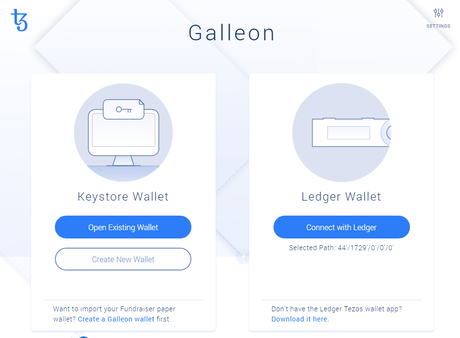
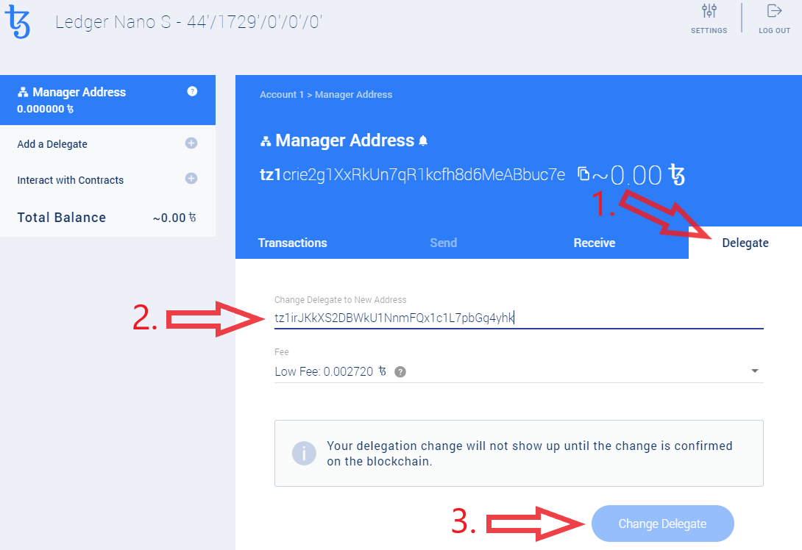

# Guide: How to stake XTZ

## :checkered\_flag:1. Prerequisites

* Tez stored on a local wallet. You control the seed/private keys.&#x20;
* Any amount of tez will work, but check if your baker has a minimum delegation amount requirement. For example, some bakers require at least 10 tez to be delegated.

## :last\_quarter\_moon\_with\_face: 2. Download and use a compatible wallet


[galleon-tezos.md](../../wallets/desktop-wallets/galleon-tezos.md)



[trustwallet-multi-currency.md](../../wallets/mobile-wallets/trustwallet-multi-currency.md)



[ledger-live-ledger-nano-wallet](../../wallets/hardware-wallets/ledger-live-ledger-nano-wallet/)


## :cake: 3. Find a baker


Use the following sites to do your research.






## :confetti\_ball: 4. Delegate your stake


Galleon wallet will be the quickest way to stake and it's safe because your coins never leave your wallet.


For this example, we will use **Galleon wallet** and delegate with a **Ledger Nano S**.

1. **Plug** in Ledger Nano S to a USB port, **type** the PIN code, **open** the Tezos Wallet app.
2. **Open** Galleon wallet.

3\. Click on **Connect with Ledger** button**.**

4\. On the Ledger Nano device, press the :heavy\_check\_mark: button to provide public key.

5\. Click **Delegate tab**

7\. Paste your **baker's public address** in the "Change Delegate to New Address" field


Your **baker's public address** will look something like this.

`tz1P2Po7YM526ughEsRbY4oR9zaUPDZjxFrb`

Copy and paste it. Do not type.


8\. Click **Change Delegate** button

9\. **Confirm** the transaction on your Ledger

10\. :tada: Congratulations. Your first rewards should start arrive in about 36 days and then every 3 days after. You will be able to see your rewards on the **Transactions tab**.

## :mag\_right: 5. Monitoring your rewards

Wondering if your baker is doing a good job and when you will be getting your rewards? Use the auditor at BakingBad.org. Simply search for your tez delegator public address.



